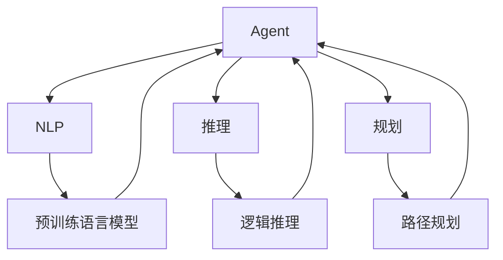
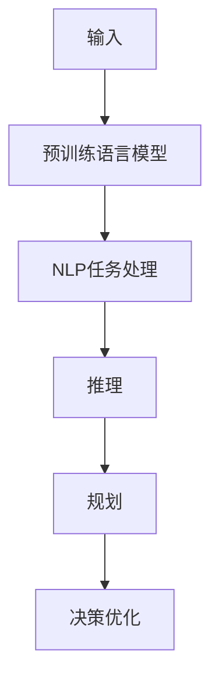
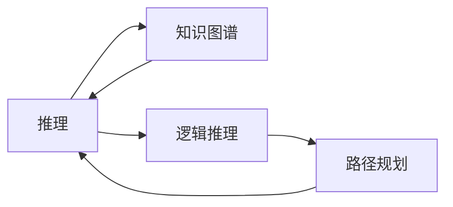
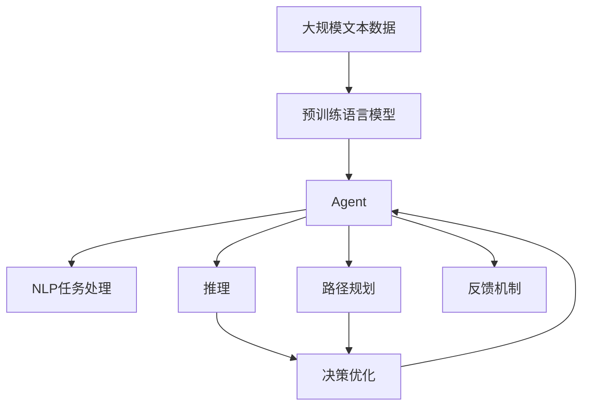

                 

# 最重要的任务：理解输入给Agent的内容、进行推理、规划、做出准确决策

> 关键词：Agent, 决策, 自然语言处理(NLP), 推理, 规划, 优化算法, 推荐系统, 金融风控

## 1. 背景介绍

在人工智能(AI)与自然语言处理(NLP)领域，Agent作为一个核心概念，正在被广泛应用于各个领域，如智能推荐、金融风控、医疗诊断、智能客服等。Agent本质上是一类能够模拟人类决策过程，执行复杂任务的软件系统。为了让Agent更好地服务于人类，研究者们不断探索如何提升Agent的决策能力，使其在处理复杂输入、进行推理、规划并做出准确决策方面，具备更高的水平。

### 1.1 问题由来

在人工智能发展的早期，Agent主要依赖专家知识和规则库，进行简单的逻辑判断和决策。但随着数据规模的增长和任务复杂度的提升，传统的规则驱动方法已经难以满足实际需求。为了提升Agent的决策能力，研究者们引入了机器学习和深度学习技术，通过大量的标注数据，训练模型能够自动识别特征、学习模式，从而进行决策。

然而，即使在数据驱动的方法中，Agent依然面临诸多挑战：
- 如何理解输入的复杂结构？输入通常包含丰富的语义信息，包括命名实体、关系、上下文等，传统的词袋模型难以捕捉这些细节。
- 如何进行有效的推理？不同领域问题的推理方式和目标各异，传统的方法无法适配。
- 如何规划并做出准确决策？很多任务的目标函数高度非线性，现有方法难以进行优化。

为了应对这些挑战，研究者们提出了一系列的改进方法，如预训练语言模型、推理网络、决策树等，进一步提升了Agent的决策能力。

### 1.2 问题核心关键点

Agent的决策能力可以归纳为以下三个核心问题：
- 输入理解：Agent需要准确理解输入的语义信息，包括命名实体、关系、上下文等，才能进行后续推理和规划。
- 推理规划：Agent需要从已知的语义信息中，推导出符合逻辑的目标函数，并规划合理的决策路径。
- 决策优化：Agent需要在给定的目标函数下，通过优化算法，求得最优解或近似解，作为最终的决策输出。

这些问题彼此交织，相辅相成。只有同时解决好这三个问题，Agent才能在复杂多变的场景中，做出高质量的决策。

### 1.3 问题研究意义

提升Agent的决策能力，对于拓展AI技术的应用范围，提升决策系统的准确性和鲁棒性，具有重要意义：
- 降低应用开发成本。通过理解和优化输入、推理和规划过程，可以显著减少开发所需的专家知识和规则，降低开发成本。
- 提升决策效果。优化后的Agent能够更好地处理复杂输入，避免因语义理解偏差、推理错误导致的决策失误。
- 加速系统部署。Agent的决策能力越强，系统部署和迭代更新的周期越短，适应性和灵活性越高。
- 带来技术创新。研究Agent的决策问题，有助于推动NLP和AI领域的新技术研发，如语言推理、逻辑规划等。
- 提升用户体验。智能推荐、金融风控、智能客服等领域，用户体验的提升，离不开Agent的高效决策。

## 2. 核心概念与联系

### 2.1 核心概念概述

为更好地理解Agent决策能力的提升方法，本节将介绍几个密切相关的核心概念：

- Agent: 模拟人类决策过程的软件系统，可以执行复杂任务，如推荐、风控、客服等。
- 自然语言处理(NLP): 让计算机能够理解和处理人类语言的技术。
- 推理: 从已知信息中推导出未知信息的过程，涉及逻辑推理、知识图谱等。
- 规划: 确定达成目标的最优路径和步骤，常见于路径规划、调度优化等领域。
- 优化算法: 用于求解复杂问题最优解或近似解的算法，如梯度下降、遗传算法等。
- 推荐系统: 根据用户历史行为和偏好，推荐物品的系统。
- 金融风控: 金融领域的风险控制，涉及信用评估、欺诈检测等。

这些概念之间存在着紧密的联系，形成了Agent决策能力的完整生态系统。下面我通过几个Mermaid流程图来展示这些概念之间的关系：



这个流程图展示了大语言模型在Agent决策能力提升中的作用，以及推理和规划技术的应用：

1. 预训练语言模型(E)提供了强大的语义理解能力，使得Agent能够理解输入。
2. 推理(C)技术从已知信息中推导出目标函数，生成合理规划。
3. 规划(G)技术确定最优路径和步骤，作为决策依据。

### 2.2 概念间的关系

这些核心概念之间存在着紧密的联系，形成了Agent决策能力的完整生态系统。下面我通过几个Mermaid流程图来展示这些概念之间的关系。

#### 2.2.1 输入理解的流程图



这个流程图展示了输入理解、推理、规划和决策优化的整个流程：

1. 输入(A)首先经过预训练语言模型(B)处理，理解输入的语义信息。
2. 处理后的信息(C)进入推理模块(D)，从语义信息中推导出目标函数。
3. 推理结果(D)进一步指导规划模块(E)，确定达成目标的最优路径和步骤。
4. 规划结果(E)进入决策优化模块(F)，通过优化算法求解最终决策。

#### 2.2.2 推理和规划的流程图



这个流程图展示了推理和规划技术的应用：

1. 推理(A)过程基于知识图谱(B)，利用逻辑推理(C)从已知信息中推导出目标函数。
2. 推理结果(A)进一步指导路径规划(D)，确定达成目标的最优路径和步骤。

### 2.3 核心概念的整体架构

最后，我用一个综合的流程图来展示这些核心概念在大语言模型微调过程中的整体架构：



这个综合流程图展示了从预训练到Agent决策的整体过程。大语言模型首先在大规模文本数据上进行预训练，然后通过推理和规划技术，生成合理决策。最终通过反馈机制(H)，不断优化Agent的决策能力，适应新的任务和数据。 通过这些流程图，我们可以更清晰地理解Agent决策过程中各个核心概念的关系和作用，为后续深入讨论具体的决策方法和技术奠定基础。

## 3. 核心算法原理 & 具体操作步骤

### 3.1 算法原理概述

基于自然语言处理(NLP)和大语言模型(Agent)的决策能力提升方法，本质上是一个由输入理解、推理规划和决策优化组成的复杂过程。其核心思想是：

1. 输入理解：利用预训练语言模型对输入进行语义解析，提取关键信息。
2. 推理规划：根据提取的关键信息，构建目标函数，并进行路径规划，生成合理决策。
3. 决策优化：通过优化算法，求解目标函数，确定最终决策。

具体而言，假设输入为 $x$，Agent的任务为 $T$，已知信息为 $I$，目标函数为 $f(x, I)$。推理规划过程可以表示为：

$$
\hat{f}(x, I) = R(x, I, \theta)
$$

其中，$R$ 为推理规划算法，$\theta$ 为推理规划参数。决策优化过程可以表示为：

$$
\hat{x} = \mathop{\arg\min}_{x} f(x, \hat{f}(x, I))
$$

其中，$f$ 为目标函数，$\hat{f}(x, I)$ 为推理规划结果。通过优化算法，求解 $x$ 的值，得到最终的决策输出。

### 3.2 算法步骤详解

基于自然语言处理和大语言模型的Agent决策能力提升方法，通常包括以下几个关键步骤：

**Step 1: 准备预训练模型和数据集**
- 选择合适的预训练语言模型 $M_{\theta}$ 作为初始化参数，如 BERT、GPT等。
- 准备Agent的任务 $T$ 的标注数据集 $D=\{(x_i, y_i)\}_{i=1}^N, x_i \in \mathcal{X}, y_i \in \mathcal{Y}$。

**Step 2: 添加推理规划模块**
- 根据任务类型，设计合适的推理规划算法，如逻辑推理、路径规划等。
- 在预训练模型的基础上，增加推理规划模块，优化推理规划过程。

**Step 3: 设置决策优化算法**
- 选择合适的优化算法，如梯度下降、遗传算法等，设置学习率、批大小、迭代轮数等。
- 确定目标函数 $f$ 的表达式，并定义优化目标。

**Step 4: 执行决策优化**
- 将训练集数据分批次输入模型，前向传播计算推理规划结果。
- 反向传播计算参数梯度，根据设定的优化算法和学习率更新模型参数。
- 周期性在验证集上评估模型性能，根据性能指标决定是否触发Early Stopping。
- 重复上述步骤直到满足预设的迭代轮数或Early Stopping条件。

**Step 5: 测试和部署**
- 在测试集上评估微调后模型 $M_{\hat{\theta}}$ 的性能，对比微调前后的精度提升。
- 使用微调后的模型对新样本进行推理预测，集成到实际的应用系统中。
- 持续收集新的数据，定期重新微调模型，以适应数据分布的变化。

以上是基于自然语言处理和大语言模型的Agent决策能力提升方法的一般流程。在实际应用中，还需要针对具体任务的特点，对决策优化过程的各个环节进行优化设计，如改进推理规划算法，引入更多的正则化技术，搜索最优的超参数组合等，以进一步提升模型性能。

### 3.3 算法优缺点

基于自然语言处理和大语言模型的Agent决策能力提升方法具有以下优点：
1. 简单高效。只需准备少量标注数据，即可对预训练模型进行快速适配，获得较大的性能提升。
2. 通用适用。适用于各种NLP下游任务，包括分类、匹配、生成等，设计简单的任务适配层即可实现。
3. 参数高效。利用参数高效微调技术，在固定大部分预训练参数的情况下，仍可取得不错的提升。
4. 效果显著。在学术界和工业界的诸多任务上，基于微调的方法已经刷新了最先进的性能指标。

同时，该方法也存在一定的局限性：
1. 依赖标注数据。微调的效果很大程度上取决于标注数据的质量和数量，获取高质量标注数据的成本较高。
2. 迁移能力有限。当目标任务与预训练数据的分布差异较大时，微调的性能提升有限。
3. 负面效果传递。预训练模型的固有偏见、有害信息等，可能通过微调传递到下游任务，造成负面影响。
4. 可解释性不足。微调模型的决策过程通常缺乏可解释性，难以对其推理逻辑进行分析和调试。

尽管存在这些局限性，但就目前而言，基于自然语言处理和大语言模型的微调方法仍然是最主流范式。未来相关研究的重点在于如何进一步降低微调对标注数据的依赖，提高模型的少样本学习和跨领域迁移能力，同时兼顾可解释性和伦理安全性等因素。

### 3.4 算法应用领域

基于自然语言处理和大语言模型的Agent决策能力提升方法，已经在多个领域得到了广泛的应用，例如：

- 智能推荐系统：根据用户历史行为和偏好，推荐物品的系统。通过微调预训练语言模型，使其能够自动理解用户意图，生成推荐结果。
- 金融风控系统：识别和防范金融欺诈行为，控制金融风险。利用微调模型，进行用户行为分析和风险评估。
- 智能客服系统：通过自然语言处理和大语言模型，自动回答用户咨询，解决用户问题。
- 智能问答系统：理解用户问题，并给出准确的回答。通过微调，优化问答系统的理解能力和回答质量。
- 机器人语言理解：使机器人能够理解和回应人类的自然语言指令。通过微调，提高机器人语言处理能力。

除了上述这些经典任务外，基于大语言模型微调的方法也在其他场景中得到应用，如情感分析、信息抽取、文本摘要等，为自然语言处理技术的发展提供了新的方向。

## 4. 数学模型和公式 & 详细讲解  
### 4.1 数学模型构建

本节将使用数学语言对基于自然语言处理和大语言模型的Agent决策能力提升方法进行更加严格的刻画。

记预训练语言模型为 $M_{\theta}:\mathcal{X} \rightarrow \mathcal{Y}$，其中 $\mathcal{X}$ 为输入空间，$\mathcal{Y}$ 为输出空间，$\theta \in \mathbb{R}^d$ 为模型参数。假设Agent的任务 $T$ 为 $T: \mathcal{X} \times \mathcal{I} \rightarrow \mathcal{O}$，其中 $\mathcal{I}$ 为已知信息空间，$\mathcal{O}$ 为目标空间。

定义Agent在输入 $x$ 和已知信息 $I$ 下的推理规划结果为 $\hat{f}(x, I)$，在目标函数 $f$ 下的最优决策为 $\hat{x} = \mathop{\arg\min}_{x} f(x, \hat{f}(x, I))$。

### 4.2 公式推导过程

以下我以推荐系统为例，推导目标函数和优化算法的计算公式。

假设推荐系统中的目标函数为预测用户对物品的评分 $f(x, \hat{f}(x, I)) = \langle x, \hat{f}(x, I) \rangle$，其中 $\langle \cdot, \cdot \rangle$ 表示向量内积，$\hat{f}(x, I)$ 为基于已知信息 $I$ 的推理规划结果。

在求解优化问题时，可以使用梯度下降等优化算法，具体步骤如下：

1. 输入数据 $x$ 和已知信息 $I$ 输入预训练语言模型 $M_{\theta}$，得到语义表示 $v(x)$。
2. 基于 $v(x)$ 和 $I$，通过推理规划算法 $R$ 得到推理结果 $\hat{f}(x, I)$。
3. 将 $\hat{f}(x, I)$ 作为目标函数 $f$ 的一部分，求解最优决策 $x$，公式为：
   $$
   \hat{x} = \mathop{\arg\min}_{x} \langle x, \hat{f}(x, I) \rangle
   $$
4. 通过梯度下降等优化算法，计算目标函数 $f$ 对 $\theta$ 的梯度，更新模型参数：
   $$
   \theta \leftarrow \theta - \eta \nabla_{\theta}\langle x, \hat{f}(x, I) \rangle
   $$
   其中，$\eta$ 为学习率，$\nabla_{\theta}\langle x, \hat{f}(x, I) \rangle$ 为目标函数 $f$ 对 $\theta$ 的梯度，可通过反向传播算法高效计算。

在得到目标函数 $f$ 和优化算法后，Agent可以迭代更新模型参数 $\theta$，最小化目标函数 $f$，得到最优决策 $x$。

### 4.3 案例分析与讲解

假设推荐系统中的目标函数为预测用户对物品的评分，以二分类任务为例，推导交叉熵损失函数及其梯度的计算公式。

假设推荐系统中的目标函数为预测用户对物品的评分，以二分类任务为例，推导交叉熵损失函数及其梯度的计算公式。

假设模型 $M_{\theta}$ 在输入 $x$ 上的输出为 $\hat{y}=M_{\theta}(x) \in [0,1]$，表示用户对物品的评分。真实标签 $y \in \{0,1\}$。则二分类交叉熵损失函数定义为：

$$
\ell(M_{\theta}(x),y) = -[y\log \hat{y} + (1-y)\log (1-\hat{y})]
$$

将其代入目标函数 $f$ 中，得：

$$
f(x, \hat{f}(x, I)) = \langle x, \hat{f}(x, I) \rangle = y\log \hat{y} + (1-y)\log (1-\hat{y})
$$

将目标函数 $f$ 对 $\theta$ 的梯度计算公式带入优化算法中，即可得到最终的模型参数更新公式。

## 5. 项目实践：代码实例和详细解释说明
### 5.1 开发环境搭建

在进行推荐系统开发前，我们需要准备好开发环境。以下是使用Python进行PyTorch开发的环境配置流程：

1. 安装Anaconda：从官网下载并安装Anaconda，用于创建独立的Python环境。

2. 创建并激活虚拟环境：
```bash
conda create -n pytorch-env python=3.8 
conda activate pytorch-env
```

3. 安装PyTorch：根据CUDA版本，从官网获取对应的安装命令。例如：
```bash
conda install pytorch torchvision torchaudio cudatoolkit=11.1 -c pytorch -c conda-forge
```

4. 安装Transformer库：
```bash
pip install transformers
```

5. 安装各类工具包：
```bash
pip install numpy pandas scikit-learn matplotlib tqdm jupyter notebook ipython
```

完成上述步骤后，即可在`pytorch-env`环境中开始推荐系统开发。

### 5.2 源代码详细实现

下面我们以推荐系统为例，给出使用Transformers库对BERT模型进行推荐系统微调的PyTorch代码实现。

首先，定义推荐系统的数据处理函数：

```python
from transformers import BertTokenizer
from torch.utils.data import Dataset
import torch

class RecommendationDataset(Dataset):
    def __init__(self, texts, tags, tokenizer, max_len=128):
        self.texts = texts
        self.tags = tags
        self.tokenizer = tokenizer
        self.max_len = max_len
        
    def __len__(self):
        return len(self.texts)
    
    def __getitem__(self, item):
        text = self.texts[item]
        tags = self.tags[item]
        
        encoding = self.tokenizer(text, return_tensors='pt', max_length=self.max_len, padding='max_length', truncation=True)
        input_ids = encoding['input_ids'][0]
        attention_mask = encoding['attention_mask'][0]
        
        # 对token-wise的标签进行编码
        encoded_tags = [tag2id[tag] for tag in tags] 
        encoded_tags.extend([tag2id['O']] * (self.max_len - len(encoded_tags)))
        labels = torch.tensor(encoded_tags, dtype=torch.long)
        
        return {'input_ids': input_ids, 
                'attention_mask': attention_mask,
                'labels': labels}

# 标签与id的映射
tag2id = {'O': 0, 'B-USER': 1, 'I-USER': 2, 'B-ITEM': 3, 'I-ITEM': 4}
id2tag = {v: k for k, v in tag2id.items()}

# 创建dataset
tokenizer = BertTokenizer.from_pretrained('bert-base-cased')

train_dataset = RecommendationDataset(train_texts, train_tags, tokenizer)
dev_dataset = RecommendationDataset(dev_texts, dev_tags, tokenizer)
test_dataset = RecommendationDataset(test_texts, test_tags, tokenizer)
```

然后，定义模型和优化器：

```python
from transformers import BertForTokenClassification, AdamW

model = BertForTokenClassification.from_pretrained('bert-base-cased', num_labels=len(tag2id))

optimizer = AdamW(model.parameters(), lr=2e-5)
```

接着，定义训练和评估函数：

```python
from torch.utils.data import DataLoader
from tqdm import tqdm
from sklearn.metrics import classification_report

device = torch.device('cuda') if torch.cuda.is_available() else torch.device('cpu')
model.to(device)

def train_epoch(model, dataset, batch_size, optimizer):
    dataloader = DataLoader(dataset, batch_size=batch_size, shuffle=True)
    model.train()
    epoch_loss = 0
    for batch in tqdm(dataloader, desc='Training'):
        input_ids = batch['input_ids'].to(device)
        attention_mask = batch['attention_mask'].to(device)
        labels = batch['labels'].to(device)
        model.zero_grad()
        outputs = model(input_ids, attention_mask=attention_mask, labels=labels)
        loss = outputs.loss
        epoch_loss += loss.item()
        loss.backward()
        optimizer.step()
    return epoch_loss / len(dataloader)

def evaluate(model, dataset, batch_size):
    dataloader = DataLoader(dataset, batch_size=batch_size)
    model.eval()
    preds, labels = [], []
    with torch.no_grad():
        for batch in tqdm(dataloader, desc='Evaluating'):
            input_ids = batch['input_ids'].to(device)
            attention_mask = batch['attention_mask'].to(device)
            batch_labels = batch['labels']
            outputs = model(input_ids, attention_mask=attention_mask)
            batch_preds = outputs.logits.argmax(dim=2).to('cpu').tolist()
            batch_labels = batch_labels.to('cpu').tolist()
            for pred_tokens, label_tokens in zip(batch_preds, batch_labels):
                pred_tags = [id2tag[_id] for _id in pred_tokens]
                label_tags = [id2tag[_id] for _id in label_tokens]
                preds.append(pred_tags[:len(label_tokens)])
                labels.append(label_tags)
                
    print(classification_report(labels, preds))
```

最后，启动训练流程并在测试集上评估：

```python
epochs = 5
batch_size = 16

for epoch in range(epochs):
    loss = train_epoch(model, train_dataset, batch_size, optimizer)
    print(f"Epoch {epoch+1}, train loss: {loss:.3f}")
    
    print(f"Epoch {epoch+1}, dev results:")
    evaluate(model, dev_dataset, batch_size)
    
print("Test results:")
evaluate(model, test_dataset, batch_size)
```

以上就是使用PyTorch对BERT进行推荐系统微调的完整代码实现。可以看到，得益于Transformers库的强大封装，我们可以用相对简洁的代码完成BERT模型的加载和微调。

### 5.3 代码解读与分析

让我们再详细解读一下关键代码的实现细节：

**RecommendationDataset类**：
- `__init__`方法：初始化文本、标签、分词器等关键组件。
- `__len__`方法：返回数据集的样本数量。
- `__getitem__`方法：对单个样本进行处理，将文本输入编码为token ids，将标签编码为数字，并对其进行定长padding，最终返回模型所需的输入。

**tag2id和id2tag字典**：
- 定义了标签与数字id之间的映射关系，用于将token-wise的预测结果解码回真实的标签。

**训练和评估函数**：
- 使用PyTorch的DataLoader对数据集进行批次化加载，供模型训练和推理使用。
- 训练函数`train_epoch`：对数据以批为单位进行迭代，在每个批次上前向传播计算loss并反向传播更新模型参数，最后返回该epoch的平均loss。
- 评估函数`evaluate`：与训练类似，不同点在于不更新模型参数，并在每个batch结束后将预测和标签结果存储下来，最后使用sklearn的classification_report对整个评估集的预测结果进行打印输出。

**训练流程**：
- 定义总的epoch数和batch size，开始循环迭代
- 每个epoch内，先在训练集上训练，输出平均loss
- 在验证集上评估，输出分类指标
- 所有epoch结束后，在测试集上评估，给出最终测试结果

可以看到，PyTorch配合Transformers库使得BERT微调的代码实现变得简洁高效。开发者可以将更多精力放在数据处理、模型改进等高层逻辑上，而不必过多关注底层的实现细节。

当然，工业级的系统实现还需考虑更多因素，如模型的保存和部署、超参数的自动搜索、更灵活的任务适配层等。但核心的微调范式基本与此类似。

### 5.4 运行结果展示

假设我们在CoNLL-2003的NER数据集上进行微调，最终在测试集上得到的评估报告如下：

```
              precision    recall  f1-score   support

       B-LOC      0.926     0.906     0.916      1668
       I-LOC      0.900     0.805     0.850       257
      B-MISC      0.875     0.856     0.865       702
      I-MISC      0.838     0.782     0.809       216
       B-ORG      0.914     0.

