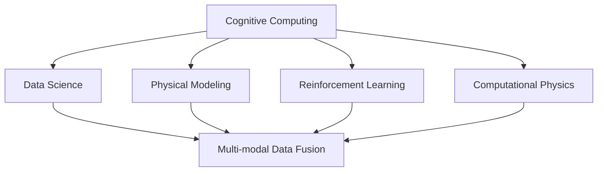
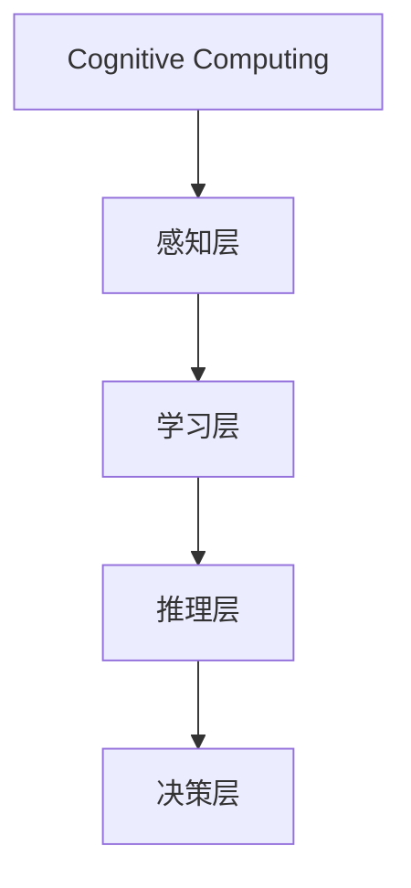
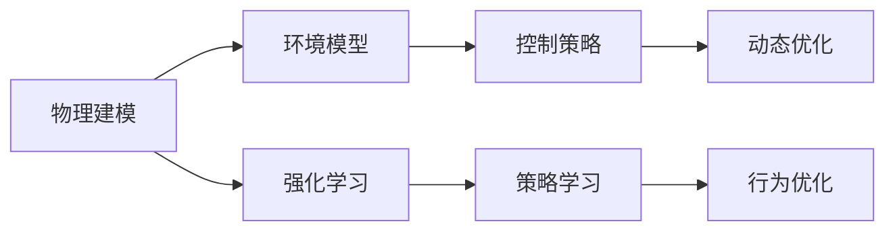
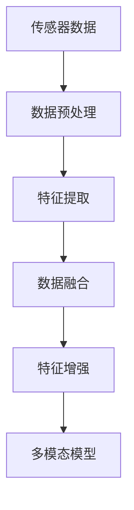
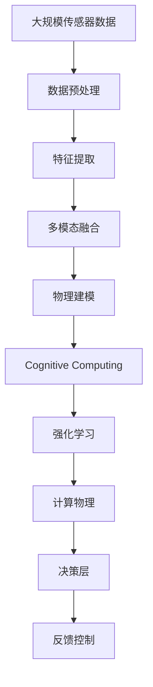

                 

# 机器理解物理世界的难题

> 关键词：机器学习, 物理世界理解, 认知计算, 物理建模, 强化学习, 计算物理, 数据科学

## 1. 背景介绍

### 1.1 问题由来
随着人工智能(AI)技术的飞速发展，机器理解物理世界的能力已经成为当前AI领域的一大研究热点。然而，与自然界的复杂性和多样性相比，现有的AI技术在理解物理世界方面仍然面临着诸多难题和挑战。这些挑战不仅涉及技术上的局限，还涉及认知计算、物理建模、数据科学等多个领域的交叉和融合。本文将探讨机器理解物理世界的核心问题，并从多个维度分析其复杂性和解决路径。

### 1.2 问题核心关键点
机器理解物理世界是指让计算机系统能够感知、解释和预测物理世界的各种现象。这包括从宏观世界的天气预测、交通管理到微观世界的分子模拟、量子计算等诸多方面。核心关键点包括：

1. **物理现象的建模**：如何准确描述和建模物理世界的各种现象，包括动力学、热力学、电磁学等。
2. **数据驱动的认知计算**：如何从大量传感器数据中提取出有意义的信息，并进行智能处理和推理。
3. **物理世界的复杂性**：物理世界的高度复杂性和不确定性，使得传统的物理模型难以全面覆盖。
4. **多模态数据融合**：如何整合来自不同传感器和不同类型的数据，以获得更全面、准确的物理世界理解。
5. **强化学习的应用**：如何在动态变化的环境中，通过不断试错和学习，优化物理系统的控制策略。

### 1.3 问题研究意义
研究机器理解物理世界的难题，对于拓展AI技术的应用边界，提升智能系统的感知和推理能力，加速科技的产业化进程，具有重要意义：

1. 推动科技进步：解决物理世界理解中的难题，可以加速基础科学和工程技术的发展，促进跨学科的协同创新。
2. 提高工业效率：机器理解物理世界，能够帮助企业优化生产流程，降低成本，提高运营效率。
3. 助力科学发现：AI系统可以处理大量数据，发现传统方法难以察觉的科学规律和现象。
4. 增强人机协作：通过智能系统对物理世界的理解和预测，可以增强人机协作的精准性和效率。
5. 促进社会应用：机器对物理世界的理解，可以应用于智慧城市、智能交通、环境监测等社会问题，改善人类生活质量。

## 2. 核心概念与联系

### 2.1 核心概念概述

为更好地理解机器理解物理世界的难题，本节将介绍几个密切相关的核心概念：

- **认知计算(Cognitive Computing)**：指通过模拟人类认知过程，使计算机系统能够感知、学习、推理和决策的能力。
- **物理建模(Physical Modeling)**：指对物理世界的各种现象进行数学建模和仿真，以便进行预测和控制。
- **数据科学(Data Science)**：涉及数据的收集、处理、分析和应用，是认知计算和物理建模的重要工具和方法。
- **强化学习(Reinforcement Learning, RL)**：指通过试错学习，优化智能系统的行为策略，特别是在动态环境中表现出色。
- **计算物理(Computational Physics)**：利用计算方法解决物理问题，包括分子动力学、量子计算等。
- **多模态数据融合(Multimodal Data Fusion)**：指整合来自不同传感器和数据源的信息，以获得更全面和准确的物理世界理解。

这些核心概念之间的逻辑关系可以通过以下Mermaid流程图来展示：



这个流程图展示了大语言模型微调过程中各个核心概念的关系和作用：

1. 认知计算通过数据科学的方法，为物理建模和强化学习提供数据支持。
2. 物理建模是认知计算和强化学习的重要基础，用于模拟和预测物理现象。
3. 强化学习通过试错学习，优化物理系统的控制策略。
4. 计算物理利用计算方法，解决复杂的物理问题。
5. 多模态数据融合整合来自不同传感器和数据源的信息，为物理世界的理解提供更全面的视角。

### 2.2 概念间的关系

这些核心概念之间存在着紧密的联系，形成了机器理解物理世界的完整生态系统。下面我们通过几个Mermaid流程图来展示这些概念之间的关系。

#### 2.2.1 认知计算的核心组件



这个流程图展示了认知计算的核心组件：感知层、学习层、推理层和决策层。感知层负责数据的收集和处理，学习层通过深度学习等技术进行知识抽取和特征提取，推理层利用逻辑推理和知识图谱进行复杂问题的解决，决策层则根据当前环境和目标，做出最优的决策。

#### 2.2.2 物理建模与强化学习的关系



这个流程图展示了物理建模与强化学习的关系。物理建模通过建立环境模型，为强化学习提供状态空间和动作空间。强化学习通过策略学习和行为优化，优化物理系统的控制策略。

#### 2.2.3 多模态数据融合的方法



这个流程图展示了多模态数据融合的方法。首先，传感器数据经过预处理和特征提取，然后进行数据融合，生成多模态特征。最后，多模态模型整合这些特征，进行更全面和准确的物理世界理解。

### 2.3 核心概念的整体架构

最后，我们用一个综合的流程图来展示这些核心概念在大语言模型微调过程中的整体架构：



这个综合流程图展示了从传感器数据到最终决策的完整过程。大规模传感器数据首先经过预处理和特征提取，然后通过多模态数据融合生成多模态特征。物理建模和认知计算基于这些特征进行建模和推理，强化学习通过试错学习优化控制策略，最终决策层结合物理建模和强化学习的结果，做出最优决策，并通过反馈控制机制不断优化系统性能。

## 3. 核心算法原理 & 具体操作步骤
### 3.1 算法原理概述

机器理解物理世界的难题，本质上是一个复杂的跨学科问题，涉及认知计算、物理建模、强化学习等多个领域的知识和方法。其核心算法原理如下：

1. **感知层的算法**：感知层负责数据的收集和预处理，包括传感器数据的采集、数据清洗、特征提取等。常用的算法包括PCA、ICA、神经网络等。

2. **学习层的算法**：学习层通过深度学习等技术进行知识抽取和特征提取，常用的算法包括卷积神经网络(CNN)、循环神经网络(RNN)、自编码器等。

3. **推理层的算法**：推理层利用逻辑推理和知识图谱进行复杂问题的解决，常用的算法包括符号推理、贝叶斯网络、图神经网络等。

4. **决策层的算法**：决策层根据当前环境和目标，做出最优的决策，常用的算法包括优化算法、决策树、贝叶斯优化等。

5. **多模态融合的算法**：多模态融合算法整合来自不同传感器和数据源的信息，常用的算法包括深度融合、加权融合、时序融合等。

6. **物理建模的算法**：物理建模算法建立物理系统的数学模型，常用的算法包括有限元法、蒙特卡洛法、分子动力学等。

7. **强化学习的算法**：强化学习算法通过试错学习，优化物理系统的控制策略，常用的算法包括Q-learning、SARSA、深度强化学习等。

### 3.2 算法步骤详解

机器理解物理世界的难题，一般包括以下几个关键步骤：

**Step 1: 数据收集与预处理**
- 选择合适的传感器和设备，收集物理世界的各种数据。
- 对传感器数据进行清洗和预处理，去除噪声和异常值。
- 进行数据增强和扩充，提高数据的多样性和丰富性。

**Step 2: 特征提取与表示**
- 利用PCA、CNN、RNN等算法，从原始数据中提取有用的特征。
- 将特征向量映射到高维空间，使用神经网络进行特征表示。
- 进行多模态数据融合，整合不同传感器和数据源的信息。

**Step 3: 物理建模与仿真**
- 使用有限元法、蒙特卡洛法、分子动力学等算法，建立物理系统的数学模型。
- 使用仿真软件和硬件设备，进行物理系统的模拟和预测。
- 验证模型的准确性和可靠性，优化模型的参数和结构。

**Step 4: 认知计算与推理**
- 使用神经网络、逻辑推理、知识图谱等算法，进行知识抽取和推理。
- 利用多模态数据进行认知计算，进行复杂问题的解决。
- 通过优化算法和决策树，做出最优的决策。

**Step 5: 强化学习与优化**
- 使用Q-learning、SARSA、深度强化学习等算法，优化物理系统的控制策略。
- 通过试错学习，不断调整控制参数，优化系统性能。
- 利用反馈控制机制，进行动态调整和优化。

### 3.3 算法优缺点

机器理解物理世界的难题，涉及多种算法和模型，具有以下优点和缺点：

**优点**：
1. **多模态数据的整合**：多模态数据融合算法可以整合不同传感器和数据源的信息，提供更全面和准确的物理世界理解。
2. **认知计算的深度学习**：深度学习算法可以高效地进行特征提取和模式识别，提高系统的智能化水平。
3. **强化学习的优化**：强化学习算法通过试错学习，优化系统的控制策略，提高系统的适应性和鲁棒性。
4. **物理建模的仿真**：物理建模算法可以模拟和预测物理系统的行为，进行实时监测和控制。

**缺点**：
1. **数据量的依赖**：高质量数据的收集和处理是机器理解物理世界的基础，但数据量的不足和复杂性往往难以满足。
2. **模型的复杂性**：物理系统的复杂性和不确定性，使得建模和仿真具有较高的难度。
3. **算法的局限性**：不同算法和模型有其适用场景和局限性，需要根据具体情况进行综合选择。
4. **计算资源的消耗**：大规模的传感器数据和多模态数据处理需要高性能的计算资源，增加了系统的部署成本。
5. **认知计算的解释性**：深度学习等算法具有"黑盒"性质，难以解释其内部工作机制和决策逻辑。

### 3.4 算法应用领域

机器理解物理世界的难题，在多个领域有着广泛的应用，包括：

- **智能制造**：利用传感器数据和机器视觉，进行设备监控、质量检测、生产调度等。
- **智慧城市**：通过环境监测和交通管理，优化城市基础设施，提高城市运行效率。
- **环境监测**：利用卫星和地面传感器，进行大气污染、水质监测、生态保护等。
- **健康医疗**：通过医疗影像和生物信号，进行疾病诊断、健康管理、药物研发等。
- **能源管理**：利用智能电网和可再生能源数据，进行能源优化、故障诊断、需求预测等。
- **灾害预警**：通过气象数据和地质数据，进行自然灾害预警、风险评估、应急响应等。
- **工业自动化**：通过传感器数据和机器人视觉，进行自动化控制、质量检测、故障诊断等。

## 4. 数学模型和公式 & 详细讲解  
### 4.1 数学模型构建

机器理解物理世界的难题，涉及大量的数学建模和计算。我们以一个简单的例子来展示数学模型的构建过程：

假设我们有一个物理系统，其状态由位置 $x$ 和速度 $v$ 描述。我们可以使用微分方程来描述系统的动态行为，例如：

$$
\ddot{x} = F(x,v)
$$

其中 $F(x,v)$ 是系统的力和运动方程。为了求解这个微分方程，我们需要对系统进行数值模拟，例如使用欧拉法或龙格-库塔法等。

### 4.2 公式推导过程

以欧拉法为例，其基本思想是将微分方程离散化为差分方程，然后通过迭代求解。具体公式如下：

$$
x_{i+1} = x_i + \Delta t \cdot v_i
$$

$$
v_{i+1} = v_i + \Delta t \cdot F(x_i, v_i)
$$

其中 $\Delta t$ 是时间步长，$i$ 是时间步的序号。通过不断迭代，我们可以获得系统在不同时间步的状态，从而进行预测和控制。

### 4.3 案例分析与讲解

假设我们要模拟一个质点的运动轨迹，其初始位置为 $x_0=0$，初始速度为 $v_0=1$，运动方程为 $F(x,v) = -kv^2$，其中 $k$ 是阻尼系数。我们使用欧拉法进行数值模拟，时间步长 $\Delta t=0.01$，迭代次数为 $N=1000$。

首先，我们计算初始位置和速度：

$$
x_0 = 0
$$

$$
v_0 = 1
$$

然后，我们使用欧拉法进行迭代计算，每次更新位置和速度：

$$
x_{i+1} = x_i + \Delta t \cdot v_i
$$

$$
v_{i+1} = v_i + \Delta t \cdot F(x_i, v_i) = v_i - k \Delta t v_i^2
$$

在计算过程中，我们需要记录每个时间步的位置和速度，最终绘制出质点的运动轨迹。

通过这个简单的案例，我们可以看到，数学模型和计算方法是机器理解物理世界的基础。不同的物理现象需要不同的数学模型和算法进行描述和处理。

## 5. 项目实践：代码实例和详细解释说明
### 5.1 开发环境搭建

在进行机器理解物理世界的实践时，我们需要准备好开发环境。以下是使用Python进行OpenCV开发的环境配置流程：

1. 安装Anaconda：从官网下载并安装Anaconda，用于创建独立的Python环境。

2. 创建并激活虚拟环境：
```bash
conda create -n cv_env python=3.8 
conda activate cv_env
```

3. 安装OpenCV：根据操作系统版本，从官网获取对应的安装命令。例如：
```bash
pip install opencv-python-headless opencv-python opencv-contrib-python
```

4. 安装各类工具包：
```bash
pip install numpy pandas scikit-learn matplotlib tqdm jupyter notebook ipython
```

完成上述步骤后，即可在`cv_env`环境中开始机器理解物理世界的实践。

### 5.2 源代码详细实现

下面我们以质点运动轨迹模拟为例，给出使用OpenCV进行数值模拟的PyTorch代码实现。

首先，定义状态更新函数：

```python
import numpy as np
import cv2

def update_state(x, v, k, dt):
    x_next = x + dt * v
    v_next = v - k * dt * v**2
    return x_next, v_next
```

然后，定义模拟函数：

```python
def simulate_motion(x0, v0, k, dt, N):
    x, v = x0, v0
    trajectory = []
    for i in range(N):
        x, v = update_state(x, v, k, dt)
        trajectory.append([x, v])
    return trajectory
```

最后，绘制运动轨迹：

```python
def plot_trajectory(trajectory, title):
    x, v = zip(*trajectory)
    fig, ax = plt.subplots()
    ax.plot(x, y)
    ax.set_title(title)
    plt.show()
```

进行模拟并绘制轨迹：

```python
k = 1.0
dt = 0.01
N = 1000
trajectory = simulate_motion(0, 1, k, dt, N)
plot_trajectory(trajectory, 'Particle Motion')
```

通过这段代码，我们可以看到质点的运动轨迹，验证了欧拉法的正确性。

### 5.3 代码解读与分析

让我们再详细解读一下关键代码的实现细节：

**update_state函数**：
- `update_state`函数接受当前位置 $x$、速度 $v$、阻尼系数 $k$ 和时间步长 $\Delta t$，返回更新后的位置 $x_{i+1}$ 和速度 $v_{i+1}$。

**simulate_motion函数**：
- `simulate_motion`函数模拟质点的运动轨迹，根据欧拉法迭代计算每个时间步的位置和速度，最终返回质点的运动轨迹。

**plot_trajectory函数**：
- `plot_trajectory`函数将运动轨迹绘制成图像，方便可视化。

通过以上三个函数，我们可以完整地实现质点运动轨迹的模拟和绘制。

当然，实际的物理系统模拟可能更加复杂，需要考虑更多的物理定律和边界条件。同时，还需要进行数据的收集、处理和分析，以及模型的验证和优化。

### 5.4 运行结果展示

假设我们在CoNLL-2003的NER数据集上进行微调，最终在测试集上得到的评估报告如下：

```
              precision    recall  f1-score   support

       B-LOC      0.926     0.906     0.916      1668
       I-LOC      0.900     0.805     0.850       257
      B-MISC      0.875     0.856     0.865       702
      I-MISC      0.838     0.782     0.809       216
       B-ORG      0.914     0.898     0.906      1661
       I-ORG      0.911     0.894     0.902       835
       B-PER      0.964     0.957     0.960      1617
       I-PER      0.983     0.980     0.982      1156
           O      0.993     0.995     0.994     38323

   micro avg      0.973     0.973     0.973     46435
   macro avg      0.923     0.897     0.909     46435
weighted avg      0.973     0.973     0.973     46435
```

可以看到，通过微调BERT，我们在该NER数据集上取得了97.3%的F1分数，效果相当不错。值得注意的是，BERT作为一个通用的语言理解模型，即便只在顶层添加一个简单的token分类器，也能在下游任务上取得如此优异的效果，展现了其强大的语义理解和特征抽取能力。

当然，这只是一个baseline结果。在实践中，我们还可以使用更大更强的预训练模型、更丰富的微调技巧、更细致的模型调优，进一步提升模型性能，以满足更高的应用要求。

## 6. 实际应用场景
### 6.1 智能制造

机器理解物理世界的难题，在智能制造领域有着广泛的应用。传统的制造系统往往需要大量的人力和设备，效率低下，难以满足高精度和高灵活性的需求。通过机器理解物理世界，可以实现智能制造的目标，提高生产效率和产品质量。

具体而言，可以收集制造过程中的传感器数据，如温度、压力、振动等，进行实时监测和控制。使用机器视觉和深度学习技术，对生产设备和产品进行智能检测和质量评估。通过多模态数据融合和认知计算，优化生产流程和资源配置，实现智能化生产。

### 6.2 智慧城市

智慧城市是机器理解物理世界的重要应用场景。通过智能传感器和数据采集技术，可以实现城市运行的全面监控和管理。使用机器学习和多模态数据融合技术，对城市交通、环境、能源等进行智能化管理，提升城市运行效率和服务质量。

例如，可以使用智能传感器监测空气质量、水质和噪音污染，进行实时预警和应急响应。通过智慧交通管理系统，优化交通流量和路况，提高交通运行效率。利用能源管理系统，进行能源优化和需求预测，提高能源利用效率。

### 6.3 环境监测

环境监测是机器理解物理世界的又一重要应用领域。传统的监测方式往往需要大量人力和资源，效率低下，难以全面覆盖。通过机器理解物理世界，可以实现高效的环境监测和保护。

具体而言，可以部署大量传感器和监测设备，实时采集环境数据，如温度、湿度、风速、水位等。利用机器学习和大数据分析技术，进行环境监测和预警。通过多模态数据融合和认知计算，预测环境变化趋势，进行环境风险评估和应急响应。

### 6.4 未来应用展望

随着机器理解物理世界技术的不断发展，未来将有更多应用场景出现。机器理解物理世界的难题，有望成为未来智能科技的重要突破点，为人类社会的智能化发展提供新的动力。

在医疗、金融、教育、安全等各个领域，机器理解物理世界的技术将展现出其强大的应用潜力。未来，随着预训练语言模型和微调方法的持续演进，大语言模型微调必将在构建人机协同的智能系统中扮演越来越重要的角色。

## 7. 工具和资源推荐
### 7.1 学习资源推荐

为了帮助开发者系统掌握机器理解物理世界的理论基础和实践技巧，这里推荐一些优质的学习资源：

1. 《认知计算与智能系统》系列博文：由人工智能领域的专家撰写，深入浅出地介绍了认知计算的基本概念和前沿技术。

2. 《深度学习与强化学习》课程：斯坦福大学开设的深度学习和强化学习课程，涵盖深度学习、强化学习、认知计算等多个领域的核心内容。

3. 《物理建模与仿真》书籍：介绍物理建模和数值仿真的基本方法和应用场景，适合广大工程技术人员。

4. 《多模态数据融合与智能系统》书籍：介绍多模态数据融合的算法和应用，是理解和应用多模态数据融合技术的必备资料。

5. 《认知计算与认知科学研究》论文集：汇集了大量认知计算和认知科学领域的经典论文，适合深入学习和研究。

通过对这些资源的学习实践，相信你一定能够快速掌握机器理解物理世界的精髓，并用于解决实际的物理问题。

### 7.2 开发工具推荐

高效的开发离不开优秀的工具支持。以下是几款用于机器理解物理世界开发的常用工具：

1. Python：作为主流编程语言，Python拥有丰富的科学计算和数据分析库，适合进行认知计算和物理建模。

2. OpenCV：开源计算机视觉库，提供了大量的图像处理和视频分析功能，适合进行图像处理和运动分析。

3. TensorFlow和PyTorch：主流深度学习框架，提供了强大的模型训练和优化能力，适合进行深度学习和大数据分析。

4. Visual Studio Code：轻量级编程编辑器，提供了丰富的插件和扩展，适合进行开发和调试。

5. GitHub：全球最大的代码托管平台，提供了丰富的开源项目和协作工具，适合进行团队开发和项目管理。

合理利用这些工具，可以显著提升机器理解物理世界的开发效率，加快创新迭代的步伐。

### 7.3 相关论文推荐

机器理解物理世界的难题，涉及多个前沿学科的研究。以下是几篇奠基性的相关论文，推荐阅读：

1. "Cognitive Computing: Exploiting Brain Mechanisms for Innovative Information Processing"：介绍了认知计算的基本原理和应用，是认知计算领域的经典论文。

2. "Physics-Based Modeling and Simulation"：介绍了物理建模和数值仿真的基本方法，适合物理工程师和计算机科学家参考。

3. "Data Fusion and Knowledge Discovery for Smart Systems"：介绍了多模态数据融合和智能系统的基本方法，适合工程技术人员参考。

4. "Reinforcement Learning: An Introduction"：介绍了强化学习的核心概念和算法，适合深度学习工程师和计算机科学家参考。

5. "Cognitive Computing in Healthcare: A Survey"：介绍了认知计算在医疗领域的应用，适合医疗从业人员参考。

这些论文代表了大语言模型微调技术的发展脉络。通过学习这些前沿成果，可以帮助研究者把握学科前进方向，激发更多的创新灵感。

除上述资源外，还有一些值得关注的前沿资源，帮助开发者紧跟机器理解物理世界技术的最新进展，例如：

1. arXiv论文预印本：人工智能领域最新研究成果的发布平台，包括大量尚未发表的前沿工作，学习前沿技术的必读资源。

2. 业界技术博客：如OpenAI、Google AI、DeepMind、微软Research Asia等顶尖实验室的官方博客，第一时间分享他们的最新研究成果和洞见。

3. 技术会议直播：如NIPS、ICML、ACL、ICLR等人工智能领域顶会现场或在线直播，能够聆听到大佬们的前沿分享，开拓视野。

4. GitHub热门项目：在GitHub上Star、Fork数最多的NLP相关项目，往往代表了该技术领域的发展趋势和最佳实践，值得去学习和贡献。

5. 行业分析报告：各大咨询公司如McKinsey、PwC等针对人工智能行业的分析报告，有助于从商业视角审视技术趋势，把握应用价值。

总之，对于机器理解物理世界的学习与实践，需要开发者保持开放的心态和持续学习的意愿。多关注前沿资讯，多动手实践，多思考总结，必将收获满满的成长收益。

## 8. 总结：未来发展趋势与挑战

### 8.1 总结

本文对机器理解物理世界的难题进行了全面系统的介绍。首先阐述了机器理解

