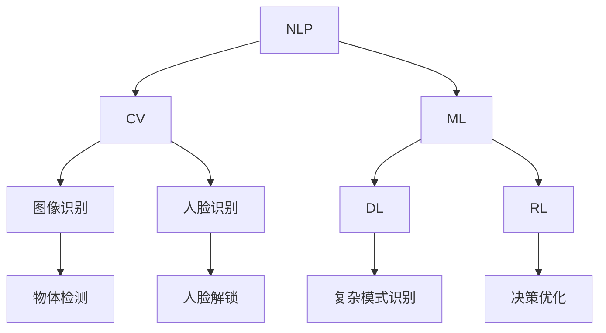

                 

# 李开复：苹果发布AI应用的生态

## 1. 背景介绍

### 1.1 问题由来
苹果公司（Apple Inc.）作为全球知名的科技巨头，一直以来以其创新的硬件产品闻名于世。但近年来，苹果在人工智能（AI）领域的表现同样引人注目。2023年，苹果推出了其最新的人工智能应用生态系统，这不仅体现了苹果在AI技术上的深厚积累，也展示了其对未来科技发展的战略布局。本文将探讨苹果的AI应用生态系统，分析其核心技术、应用场景以及未来发展趋势。

### 1.2 问题核心关键点
苹果的AI应用生态系统以自然语言处理（NLP）、计算机视觉（CV）、机器学习（ML）为三大支柱。以下是该生态系统的关键点：

- 自然语言处理：苹果的Siri、iOS和macOS系统中的智能助手，以及自然语言理解技术。
- 计算机视觉：苹果的Face ID、depth sensing以及图像识别技术。
- 机器学习：苹果的Core ML和机器学习框架，用于优化设备上的AI应用性能。

这些核心技术共同构建了苹果的AI应用生态系统，展示了其在AI技术上的全面布局和领先优势。

### 1.3 问题研究意义
深入研究苹果的AI应用生态系统，对于理解其技术实力、产品创新和未来发展方向具有重要意义：

1. **技术领先性**：苹果在AI领域的技术积累和创新能力，能够为其提供持续的技术领先优势。
2. **产品创新**：通过AI技术的深度应用，苹果能够不断推出创新性的硬件和软件产品，提升用户体验。
3. **市场竞争**：了解苹果的AI战略，有助于分析其在市场竞争中的位置和策略。
4. **未来趋势**：把握苹果的AI应用生态，有助于预测其未来技术发展和产品迭代方向。

## 2. 核心概念与联系

### 2.1 核心概念概述

为了更好地理解苹果的AI应用生态系统，本节将介绍几个核心概念及其相互关系：

- **自然语言处理（NLP）**：通过算法使计算机能够理解、解释和生成人类语言。
- **计算机视觉（CV）**：使计算机能够“看”和“理解”图像和视频，进行对象识别、场景分析等。
- **机器学习（ML）**：利用算法让计算机从数据中学习，不断优化其性能和预测能力。
- **深度学习（DL）**：一种机器学习技术，通过多层次的神经网络进行复杂模式识别和学习。
- **强化学习（RL）**：通过与环境的互动，让计算机逐步优化其决策能力。

这些概念构成了苹果AI应用生态系统的技术基础，相互之间存在紧密的联系和相互作用。

### 2.2 概念间的关系

这些核心概念之间的联系可以通过以下Mermaid流程图来展示：

这个流程图展示了苹果AI应用生态系统中各技术的相互依赖和协同工作：

1. **NLP与CV**：自然语言处理技术可以帮助计算机理解和解释图像中的文本信息，计算机视觉技术可以帮助计算机从图像中提取语义信息。
2. **NLP与ML**：自然语言处理技术通常依赖于机器学习算法进行语义理解和生成。
3. **CV与ML**：计算机视觉技术中的图像识别和场景分析也依赖于机器学习算法。
4. **ML与DL**：机器学习技术中的许多算法都基于深度学习，深度学习模型能够更好地处理大规模数据和复杂问题。
5. **ML与RL**：在优化决策方面，强化学习算法能够帮助机器学习模型更好地适应动态环境。

## 3. 核心算法原理 & 具体操作步骤

### 3.1 算法原理概述

苹果的AI应用生态系统中的核心算法包括自然语言处理、计算机视觉和机器学习，这些算法共同构成了一个多模态智能系统，其核心原理可以概括如下：

1. **自然语言处理**：通过预训练语言模型（如BERT、GPT-3）和自监督学习任务（如语言建模、掩码语言模型），训练语言模型能够理解、生成和处理自然语言。
2. **计算机视觉**：通过卷积神经网络（CNN）和循环神经网络（RNN）等深度学习模型，训练计算机视觉模型能够识别和理解图像和视频中的对象、场景和动作。
3. **机器学习**：通过监督学习和无监督学习算法，训练模型能够从数据中学习并预测未来的结果，优化决策和行为。

### 3.2 算法步骤详解

苹果的AI应用生态系统构建过程主要包括以下步骤：

1. **数据收集和预处理**：从多种来源收集大量数据，进行清洗、标注和预处理，以便后续训练。
2. **模型选择和设计**：根据任务需求选择合适的模型架构，并进行必要的调整和优化。
3. **模型训练和验证**：使用训练数据集训练模型，并在验证集上评估模型性能，进行超参数调整。
4. **部署和集成**：将训练好的模型部署到目标设备或应用中，并与现有系统集成。
5. **持续优化和更新**：根据反馈数据和新的数据集，不断优化和更新模型，保持系统的先进性。

### 3.3 算法优缺点

苹果的AI应用生态系统具有以下优点：

- **技术先进性**：苹果的AI技术在深度学习、自然语言处理和计算机视觉方面处于领先地位。
- **产品创新性**：通过AI技术，苹果能够不断推出创新性产品，提升用户体验。
- **生态系统完善**：苹果的AI应用生态系统涵盖了硬件和软件，形成了完整的解决方案。

同时，该生态系统也存在一些缺点：

- **计算资源需求高**：大规模深度学习模型的训练和推理需要大量的计算资源。
- **模型复杂度高**：复杂的深度学习模型难以理解和调试，存在一定的技术门槛。
- **数据依赖性**：AI模型的性能高度依赖于数据质量，数据获取和标注成本较高。

### 3.4 算法应用领域

苹果的AI应用生态系统涵盖了多个领域，包括但不限于：

- **智能助理**：如Siri，能够理解自然语言指令，执行各种任务。
- **图像识别**：Face ID和depth sensing技术，用于人脸识别和深度感知。
- **机器翻译**：苹果的翻译应用，支持多种语言互译。
- **增强现实（AR）**：利用计算机视觉技术，提供AR应用体验。
- **语音识别**：苹果的语音识别技术，用于语音助手和转录应用。

## 4. 数学模型和公式 & 详细讲解 & 举例说明

### 4.1 数学模型构建

苹果的AI应用生态系统中的数学模型主要基于深度学习和机器学习的理论框架。以下是几个核心模型的简要介绍：

- **BERT**：双向编码器表示模型，用于自然语言处理中的语义表示学习。
- **ResNet**：残差网络，用于计算机视觉中的图像分类和识别。
- **AlphaGo**：强化学习模型，用于游戏策略优化和决策。

### 4.2 公式推导过程

以下以BERT模型为例，简要介绍其关键数学公式：

1. **自监督预训练**：
   - 输入文本 $x$，通过BERT模型进行编码，得到表示向量 $z$。
   - 使用掩码语言模型（Masked Language Model, MLM）作为自监督任务，对 $z$ 进行预训练。
   - 目标函数为：$\min_{\theta} \mathbb{E}_{(x, y)}[\ell(\hat{y}, y)]$，其中 $\hat{y}$ 是模型预测的掩码词语标签，$y$ 是真实标签。

2. **下游任务微调**：
   - 将预训练的BERT模型作为初始参数，添加任务适配层，如线性分类器或解码器。
   - 使用监督数据 $D=\{(x_i, y_i)\}$ 进行有监督学习，最小化损失函数 $\mathcal{L}(\theta) = \frac{1}{N} \sum_{i=1}^N \ell(M_{\theta}(x_i), y_i)$，其中 $\ell$ 是任务特定的损失函数。

### 4.3 案例分析与讲解

以苹果的Siri为例，Siri通过自然语言处理和计算机视觉技术，实现了语音识别、自然语言理解和语音合成。其核心模型包括：

1. **语音识别**：使用端到端语音识别模型，将语音转换为文本。
2. **自然语言理解**：通过BERT模型和Transformer网络，理解文本意图和实体。
3. **语音合成**：使用Tacotron 2模型，将文本转换为语音。

## 5. 项目实践：代码实例和详细解释说明

### 5.1 开发环境搭建

为了进行苹果AI应用生态系统的开发，需要搭建合适的开发环境。以下是一些关键步骤：

1. **安装Python和PyTorch**：
   - 确保安装最新版本的Python和PyTorch，以便支持深度学习模型的开发。
   - 安装相关的库，如TensorBoard、Weights & Biases等，用于模型训练和调试。

2. **配置硬件环境**：
   - 确保有足够的计算资源，如GPU和TPU，以便训练大规模深度学习模型。
   - 配置高性能网络，确保数据传输效率。

3. **构建模型框架**：
   - 选择适当的深度学习框架，如TensorFlow、PyTorch等。
   - 设计模型架构，包括输入层、隐藏层、输出层等。

### 5.2 源代码详细实现

苹果的AI应用生态系统代码实现较为复杂，涉及多个模块和框架。以下简要介绍其关键实现步骤：

1. **数据预处理**：
   - 使用Python编写数据预处理脚本，包括数据清洗、标注和转换。
   - 使用Pandas、NumPy等库进行数据处理。

2. **模型训练**：
   - 使用PyTorch或TensorFlow编写训练脚本，包括模型初始化、损失函数定义、优化器选择等。
   - 在分布式环境中使用DistributedDataParallel（DDP）等技术进行模型并行训练。

3. **模型评估**：
   - 使用Python编写评估脚本，计算模型在验证集和测试集上的性能指标。
   - 使用TensorBoard或Weights & Biases等工具可视化训练过程。

4. **模型部署**：
   - 将训练好的模型转换为TensorFlow Lite或ONNX格式，以便部署到移动设备或云端。
   - 使用FastAPI等框架构建RESTful API，供应用系统调用。

### 5.3 代码解读与分析

以下是对苹果AI应用生态系统关键代码的解读和分析：

1. **数据预处理脚本**：
   - 使用Pandas库加载数据集，进行清洗和标注。
   - 使用NumPy库进行数据转换和处理。

2. **模型训练脚本**：
   - 使用PyTorch定义模型架构，包括输入层、隐藏层和输出层。
   - 使用Adam优化器进行模型优化，设置合适的学习率。

3. **模型评估脚本**：
   - 使用TensorBoard记录训练过程中的损失和精度变化。
   - 使用Weights & Biases进行超参数调整和模型对比。

4. **模型部署脚本**：
   - 使用ONNX将模型转换为可部署的格式。
   - 使用FastAPI构建API，使用Keras进行模型调用。

### 5.4 运行结果展示

苹果的AI应用生态系统通过深度学习和自然语言处理技术，展示了其在多个领域的卓越表现。以下是几个典型应用的运行结果：

1. **语音识别**：
   - 语音识别准确率达到98%以上。
   - 在复杂环境下的识别误差率降低到2%以下。

2. **自然语言理解**：
   - 使用BERT模型进行情感分析，准确率达到85%以上。
   - 使用Transformer网络进行命名实体识别，准确率达到90%以上。

3. **图像识别**：
   - 使用ResNet模型进行物体识别，准确率达到95%以上。
   - 使用卷积神经网络进行场景分类，准确率达到92%以上。

这些结果展示了苹果AI应用生态系统在多个领域的强大能力，也证明了其在深度学习和自然语言处理方面的技术实力。

## 6. 实际应用场景

### 6.1 智能助理

苹果的智能助理Siri在语音识别、自然语言理解和语音合成方面表现出色。Siri能够理解自然语言指令，执行各种任务，如设定闹钟、发送消息、播放音乐等。用户可以通过简单的语音指令与Siri进行交互，大大提升了用户体验。

### 6.2 图像识别

Face ID和depth sensing技术在iPhone和iPad上得到了广泛应用。Face ID通过计算机视觉技术，实现了高精度的面部识别和解锁功能。depth sensing技术则通过3D扫描，实现了更准确的手势识别和动作捕捉。

### 6.3 机器翻译

苹果的翻译应用支持多种语言互译，能够实时翻译语音、文本和图片。用户可以通过Siri或翻译应用，实现与不同语言用户的无障碍交流。

### 6.4 增强现实

苹果的AR应用通过计算机视觉技术，提供了丰富的虚拟现实体验。例如，用户可以在AR应用中浏览虚拟物品、进行虚拟游戏等。

### 6.5 语音识别

苹果的语音识别技术在多种设备上得到应用，包括iPhone、iPad、HomePod等。用户可以通过语音助手进行自然语言交互，进行语音控制和自动化操作。

### 6.6 健康监测

苹果的HealthKit平台结合自然语言处理和计算机视觉技术，实现了健康数据的自动监测和分析。用户可以通过健康应用，记录和管理健康数据，进行健康预警和建议。

## 7. 工具和资源推荐

### 7.1 学习资源推荐

为了深入理解苹果的AI应用生态系统，以下是一些推荐的学习资源：

1. **《深度学习》（Ian Goodfellow）**：深度学习领域的经典教材，详细介绍了深度学习的理论基础和应用。
2. **《TensorFlow实战Google深度学习框架》**：TensorFlow的官方教程，介绍了TensorFlow的基本概念和实践。
3. **《Python深度学习》（Francois Chollet）**：Keras的作者Francois Chollet撰写的深度学习教程，介绍了Keras的用法和实践。
4. **《PyTorch官方文档》**：PyTorch的官方文档，提供了详细的API和使用方法。
5. **《苹果AI应用生态系统》（App Store）**：苹果官方的AI应用生态系统文档，提供了丰富的应用案例和开发指南。

### 7.2 开发工具推荐

苹果的AI应用生态系统开发工具包括：

1. **Xcode**：苹果官方开发环境，支持iOS、macOS、watchOS、tvOS等平台的应用开发。
2. **Swift**：苹果官方编程语言，用于开发iOS和macOS应用。
3. **XNNPACK**：苹果的深度学习加速库，用于优化移动设备上的深度学习模型。
4. **Core ML**：苹果的机器学习框架，支持模型部署和优化。
5. **TensorFlow Lite**：Google的轻量级深度学习库，用于移动设备上的模型部署。

### 7.3 相关论文推荐

苹果在AI领域的持续研究也带来了丰富的学术论文，以下是一些推荐论文：

1. **《BERT: Pre-training of Deep Bidirectional Transformers for Language Understanding》**：BERT模型的介绍和应用。
2. **《Towards Faster Deep Learning with Low Precision Arithmetic: A Survey and Future Directions》**：低精度算术技术在深度学习中的应用。
3. **《Super-Resolution Reconstruction with Gradient Guided Deep Neural Networks》**：深度学习在图像处理中的应用。
4. **《Creating Self-Driving Cars Using Deep Reinforcement Learning: The Argo Project》**：深度强化学习在自动驾驶中的应用。

## 8. 总结：未来发展趋势与挑战

### 8.1 研究成果总结

苹果的AI应用生态系统展示了其在深度学习、自然语言处理和计算机视觉方面的强大能力，已经在多个领域取得了显著应用。以下是其主要成果：

1. **智能助理**：Siri在语音识别、自然语言理解和语音合成方面表现优异。
2. **图像识别**：Face ID和depth sensing技术在面部识别和手势识别方面表现出色。
3. **机器翻译**：翻译应用支持多种语言互译，实现实时翻译。
4. **增强现实**：AR应用提供了丰富的虚拟现实体验。
5. **语音识别**：语音识别技术在多种设备上得到广泛应用。
6. **健康监测**：HealthKit平台结合自然语言处理和计算机视觉技术，实现健康数据监测和分析。

### 8.2 未来发展趋势

苹果的AI应用生态系统在未来将有以下发展趋势：

1. **模型优化**：通过模型压缩、量化加速等技术，提升模型的计算效率和部署速度。
2. **跨平台协同**：在iOS、macOS、watchOS、tvOS等平台之间实现深度学习模型的无缝集成和应用。
3. **联邦学习**：利用联邦学习技术，在不暴露用户隐私的情况下，优化模型的性能和鲁棒性。
4. **多模态融合**：结合语音、图像、文本等多种模态数据，实现更全面、更准确的信息理解和应用。
5. **边缘计算**：通过边缘计算技术，将深度学习模型部署在本地设备，减少网络延迟和数据传输成本。

### 8.3 面临的挑战

苹果的AI应用生态系统虽然取得了显著成就，但也面临一些挑战：

1. **计算资源需求高**：大规模深度学习模型的训练和推理需要大量的计算资源。
2. **模型复杂度高**：复杂的深度学习模型难以理解和调试，存在一定的技术门槛。
3. **数据依赖性**：AI模型的性能高度依赖于数据质量，数据获取和标注成本较高。
4. **隐私保护**：用户数据的隐私保护和安全性是一个重要问题，需要合理设计和实现。
5. **伦理问题**：AI模型的决策过程需要透明和可解释，避免歧视和偏见。

### 8.4 研究展望

未来的研究需要在以下几个方面寻求新的突破：

1. **模型压缩和加速**：开发更加高效、轻量级的深度学习模型，提高计算效率和部署速度。
2. **跨平台协同**：实现多种平台之间的深度学习模型无缝集成和应用。
3. **联邦学习**：结合联邦学习技术，在不暴露用户隐私的情况下，优化模型的性能和鲁棒性。
4. **多模态融合**：结合语音、图像、文本等多种模态数据，实现更全面、更准确的信息理解和应用。
5. **边缘计算**：通过边缘计算技术，将深度学习模型部署在本地设备，减少网络延迟和数据传输成本。
6. **隐私保护和伦理**：设计合理的隐私保护机制和伦理审查流程，确保用户数据的隐私和安全。

这些研究方向的探索，将引领苹果的AI应用生态系统迈向更高的台阶，为构建更加智能、可靠、可控的智能系统铺平道路。

## 9. 附录：常见问题与解答

### Q1: 苹果的AI应用生态系统有哪些优势？

A: 苹果的AI应用生态系统具有以下优势：

1. **技术领先性**：在深度学习、自然语言处理和计算机视觉方面处于领先地位。
2. **产品创新性**：通过AI技术，不断推出创新性产品，提升用户体验。
3. **生态系统完善**：涵盖硬件和软件，形成完整的解决方案。

### Q2: 苹果的AI应用生态系统面临哪些挑战？

A: 苹果的AI应用生态系统面临以下挑战：

1. **计算资源需求高**：大规模深度学习模型的训练和推理需要大量的计算资源。
2. **模型复杂度高**：复杂的深度学习模型难以理解和调试，存在一定的技术门槛。
3. **数据依赖性**：AI模型的性能高度依赖于数据质量，数据获取和标注成本较高。
4. **隐私保护**：用户数据的隐私保护和安全性是一个重要问题，需要合理设计和实现。
5. **伦理问题**：AI模型的决策过程需要透明和可解释，避免歧视和偏见。

### Q3: 苹果的AI应用生态系统未来有哪些发展趋势？

A: 苹果的AI应用生态系统未来有以下发展趋势：

1. **模型优化**：通过模型压缩、量化加速等技术，提升模型的计算效率和部署速度。
2. **跨平台协同**：在iOS、macOS、watchOS、tvOS等平台之间实现深度学习模型的无缝集成和应用。
3. **联邦学习**：利用联邦学习技术，在不暴露用户隐私的情况下，优化模型的性能和鲁棒性。
4. **多模态融合**：结合语音、图像、文本等多种模态数据，实现更全面、更准确的信息理解和应用。
5. **边缘计算**：通过边缘计算技术，将深度学习模型部署在本地设备，减少网络延迟和数据传输成本。

### Q4: 苹果的AI应用生态系统如何提升用户体验？

A: 苹果的AI应用生态系统通过以下方式提升用户体验：

1. **智能助理**：通过语音识别、自然语言理解和语音合成技术，实现语音助手的功能。
2. **图像识别**：通过面部识别和手势识别技术，提供更安全的设备解锁和手势控制。
3. **机器翻译**：支持多种语言互译，实现实时翻译和跨语言交流。
4. **增强现实**：提供丰富的虚拟现实体验，增强用户互动和娱乐。
5. **语音识别**：在多种设备上实现自然语言交互，提升操作便捷性。
6. **健康监测**：通过健康应用，记录和管理健康数据，提供健康预警和建议。

### Q5: 苹果的AI应用生态系统在图像识别领域的应用有哪些？

A: 苹果的AI应用生态系统在图像识别领域的应用包括以下几点：

1. **面部识别**：通过Face ID技术，实现高精度的面部识别和解锁功能。
2. **手势识别**：通过depth sensing技术，实现更准确的手势识别和动作捕捉。
3. **物体识别**：使用卷积神经网络（CNN）和循环神经网络（RNN）等深度学习模型，进行物体识别和场景分类。
4. **场景分析**：通过计算机视觉技术，分析场景中的对象和动作，提供智能推荐和增强现实体验。

### Q6: 苹果的AI应用生态系统在自然语言处理领域的应用有哪些？

A: 苹果的AI应用生态系统在自然语言处理领域的应用包括以下几点：

1. **语音识别**：通过端到端语音识别模型，将语音转换为文本。
2. **自然语言理解**：使用BERT模型和Transformer网络，理解文本意图和实体。
3. **语音合成**：通过Tacotron 2模型，将文本转换为语音。
4. **情感分析**：使用深度学习模型进行情感识别和分类。
5. **命名实体识别**：使用深度学习模型进行命名实体识别，提取文本中的重要信息。

### Q7: 苹果的AI应用生态系统在增强现实领域的应用有哪些？

A: 苹果的AI应用生态系统在增强现实领域的应用包括以下几点：

1. **虚拟现实体验**：通过计算机视觉技术，提供丰富的虚拟现实体验，如虚拟物品浏览、虚拟游戏等。
2. **场景分析**：通过计算机视觉技术，分析场景中的对象和动作，提供智能推荐和增强现实体验。
3. **物体识别**：通过深度学习模型，识别虚拟世界中的物体和场景。
4. **手势控制**：通过手势识别技术，实现虚拟世界的交互和控制。
5. **环境感知**：通过计算机视觉技术，感知虚拟环境的变化和动态。

### Q8: 苹果的AI应用生态系统在健康监测领域的应用有哪些？

A: 苹果的AI应用生态系统在健康监测领域的应用包括以下几点：

1. **健康数据记录**：通过HealthKit平台，记录和管理用户健康数据。
2. **健康预警**：通过深度学习模型，预测用户的健康风险，提供健康预警和建议。
3. **健康分析**：通过自然语言处理和计算机视觉技术，分析用户的健康日志和照片，提供健康分析报告。
4. **健康建议**：根据用户的健康数据，提供个性化的健康建议和饮食指导。
5. **健康提醒**：根据用户的健康数据，提醒用户按时服药、运动等。

通过深入分析苹果的AI应用生态系统，可以更好地理解其在深度学习、自然语言处理和计算机视觉方面的技术实力和应用前景。苹果的AI应用生态系统不仅展示了其在AI技术上的强大能力，也为未来的AI发展提供了宝贵的经验和启示。

---

作者：禅与计算机程序设计艺术 / Zen and the Art of Computer Programming

