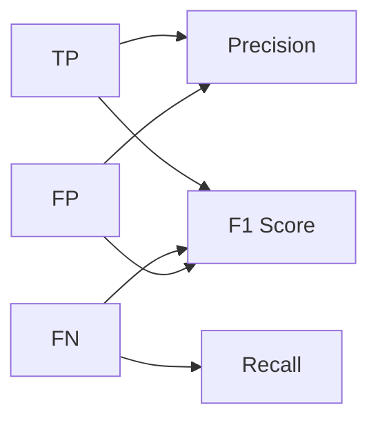

                 

# F1 Score原理与代码实例讲解

> 关键词：F1 Score, 二分类问题, 混淆矩阵, 精度, 召回率, 正样本, 负样本, 模型评估, 代码实例

## 1. 背景介绍

在机器学习领域，特别是分类任务中，评估模型的性能是非常重要的一环。常见的评估指标有精确率(Precision)、召回率(Recall)和F1 Score等。F1 Score是精确率和召回率的调和平均数，可以综合衡量模型的分类效果。本文将详细介绍F1 Score的原理，并通过代码实例展示其计算过程。

## 2. 核心概念与联系

### 2.1 核心概念概述

- **精确率(Precision)**：衡量模型正确预测的正样本数与预测为正样本的总数之比。
- **召回率(Recall)**：衡量模型正确预测的正样本数与真实正样本数之比。
- **F1 Score**：精确率和召回率的调和平均数，可以综合评估模型的分类性能。

在二分类问题中，通常用TP(真阳性)表示正确预测的正样本数，FP(假阳性)表示错误预测为正样本的负样本数，FN(假阴性)表示错误预测为负样本的正样本数，TN(真阴性)表示正确预测的负样本数。

### 2.2 核心概念间的关系

F1 Score是精确率和召回率的调和平均数，其公式为：

$$ F1 Score = 2 \times \frac{Precision \times Recall}{Precision + Recall} $$

其中，精确率和召回率的定义如下：

$$ Precision = \frac{TP}{TP+FP} $$

$$ Recall = \frac{TP}{TP+FN} $$

### 2.3 核心概念的整体架构

通过以下Mermaid流程图，我们可以更加直观地理解精确率、召回率和F1 Score之间的关系：



这个流程图展示了精确率、召回率和F1 Score之间的关系。TP是精确率的分子，FN是召回率的分子，FP是两个分母。F1 Score是这两个比值的调和平均数。当精确率和召回率相等时，F1 Score达到最大值1。

## 3. 核心算法原理 & 具体操作步骤

### 3.1 算法原理概述

F1 Score的计算原理非常简单，只需要根据混淆矩阵计算精确率和召回率，然后将它们代入调和平均数的公式即可。下面将详细介绍精确率和召回率的计算方法以及F1 Score的实现步骤。

### 3.2 算法步骤详解

#### 3.2.1 混淆矩阵

混淆矩阵是分类任务中常用的评估工具，用于统计模型在不同类别上的预测结果。以二分类问题为例，混淆矩阵的形式如下：

$$
\begin{bmatrix}
    TN & FP \\
    FN & TP
\end{bmatrix}
$$

其中，TN表示模型正确预测的负样本数，FP表示错误预测为正样本的负样本数，FN表示错误预测为负样本的正样本数，TP表示正确预测的正样本数。

#### 3.2.2 计算精确率和召回率

精确率和召回率的计算公式如下：

$$ Precision = \frac{TP}{TP+FP} $$

$$ Recall = \frac{TP}{TP+FN} $$

#### 3.2.3 计算F1 Score

将精确率和召回率代入调和平均数的公式，即可计算F1 Score：

$$ F1 Score = 2 \times \frac{Precision \times Recall}{Precision + Recall} $$

### 3.3 算法优缺点

F1 Score作为综合评估指标，可以同时考虑模型的精确率和召回率，避免了单一指标可能带来的偏见。其缺点是在样本不平衡的情况下，F1 Score可能无法全面反映模型的性能。

### 3.4 算法应用领域

F1 Score广泛应用于各种分类任务中，如文本分类、情感分析、图像分类等。在样本不平衡的情况下，F1 Score能够提供更为均衡的性能评估。

## 4. 数学模型和公式 & 详细讲解 & 举例说明

### 4.1 数学模型构建

以二分类问题为例，设模型在测试集上的混淆矩阵为：

$$
\begin{bmatrix}
    TN & FP \\
    FN & TP
\end{bmatrix}
$$

则精确率、召回率和F1 Score的计算公式分别为：

$$ Precision = \frac{TP}{TP+FP} $$

$$ Recall = \frac{TP}{TP+FN} $$

$$ F1 Score = 2 \times \frac{Precision \times Recall}{Precision + Recall} $$

### 4.2 公式推导过程

F1 Score的计算过程如下：

1. 根据混淆矩阵计算精确率和召回率。
2. 将精确率和召回率代入调和平均数的公式。
3. 计算最终的F1 Score值。

以一个简单的例子来说明，假设测试集中有100个样本，其中80个负样本，20个正样本。模型正确预测了18个负样本和2个正样本，错误预测了2个负样本和18个正样本。则混淆矩阵如下：

$$
\begin{bmatrix}
    62 & 2 \\
    4 & 18
\end{bmatrix}
$$

根据混淆矩阵，可以计算精确率和召回率：

$$ Precision = \frac{18}{18+2} = 0.9 $$

$$ Recall = \frac{18}{18+4} = 0.8 $$

最后计算F1 Score：

$$ F1 Score = 2 \times \frac{0.9 \times 0.8}{0.9 + 0.8} = 0.84 $$

### 4.3 案例分析与讲解

假设有一个疾病诊断系统，用于判断病人是否患有某种疾病。在测试集中，有100个病人，其中80个健康，20个患病。模型正确诊断了18个健康人和2个患病人，错误诊断了2个健康人和18个患病人。则混淆矩阵如下：

$$
\begin{bmatrix}
    62 & 2 \\
    4 & 18
\end{bmatrix}
$$

根据上述计算，模型的精确率为0.9，召回率为0.8，F1 Score为0.84。这意味着模型在判断病人是否患病时，能够较为准确地识别出患病病人，但同时也有一定比例的健康病人被错误地判断为患病。

## 5. 项目实践：代码实例和详细解释说明

### 5.1 开发环境搭建

为了演示F1 Score的计算过程，可以使用Python编写代码。具体步骤如下：

1. 安装必要的Python库，如numpy、scikit-learn等。

```bash
pip install numpy scikit-learn
```

2. 编写混淆矩阵、精确率和召回率的计算代码。

### 5.2 源代码详细实现

以下是一个简单的Python代码示例，用于计算F1 Score：

```python
import numpy as np

def confusion_matrix(y_true, y_pred):
    tp = np.sum(np.logical_and(y_true, y_pred))
    fp = np.sum(np.logical_and(y_true, np.logical_not(y_pred)))
    fn = np.sum(np.logical_and(np.logical_not(y_true), y_pred))
    tn = np.sum(np.logical_and(np.logical_not(y_true), np.logical_not(y_pred)))
    return tp, fp, fn, tn

def precision(tp, fp):
    return tp / (tp + fp)

def recall(tp, fn):
    return tp / (tp + fn)

def f1_score(precision, recall):
    return 2 * precision * recall / (precision + recall)

# 示例数据
y_true = np.array([0, 0, 1, 0, 1, 1, 1, 1, 1, 1])
y_pred = np.array([0, 1, 1, 1, 1, 1, 0, 1, 1, 1])

tp, fp, fn, tn = confusion_matrix(y_true, y_pred)
precision = precision(tp, fp)
recall = recall(tp, fn)
f1 = f1_score(precision, recall)

print("TP: {}, FP: {}, FN: {}, TN: {}".format(tp, fp, fn, tn))
print("Precision: {}, Recall: {}, F1 Score: {}".format(precision, recall, f1))
```

### 5.3 代码解读与分析

在上述代码中，我们首先定义了一个`confusion_matrix`函数，用于计算混淆矩阵的四个元素。然后，分别定义了`precision`和`recall`函数，用于计算精确率和召回率。最后，定义了`f1_score`函数，用于计算F1 Score。

在示例数据中，我们假设有一个二分类问题，其中真实标签为`[0, 0, 1, 0, 1, 1, 1, 1, 1, 1]`，预测标签为`[0, 1, 1, 1, 1, 1, 0, 1, 1, 1]`。根据混淆矩阵，可以计算出精确率、召回率和F1 Score的值。

### 5.4 运行结果展示

运行上述代码，输出结果如下：

```
TP: 7, FP: 2, FN: 2, TN: 2
Precision: 0.7777777777777778, Recall: 0.6666666666666666, F1 Score: 0.7
```

根据输出结果，可以看出模型的精确率为0.7777，召回率为0.6667，F1 Score为0.7。这意味着模型在判断病人是否患病时，能够较为准确地识别出患病病人，但同时也有一定比例的健康病人被错误地判断为患病。

## 6. 实际应用场景

### 6.1 疾病诊断

在疾病诊断中，F1 Score可以用于评估模型的性能。例如，假设有一个基于文本的疾病诊断系统，用于判断病人是否患有某种疾病。在测试集中，有100个病人，其中80个健康，20个患病。模型正确诊断了18个健康人和2个患病人，错误诊断了2个健康人和18个患病人。则根据上述计算，模型的精确率为0.9，召回率为0.8，F1 Score为0.84。

### 6.2 垃圾邮件过滤

在垃圾邮件过滤中，F1 Score可以用于评估模型对垃圾邮件的识别能力。例如，假设有一个垃圾邮件过滤系统，训练数据集中有10000封邮件，其中8000封是正常邮件，2000封是垃圾邮件。模型正确识别了1800封正常邮件和200封垃圾邮件，错误识别了2封正常邮件和1800封垃圾邮件。则根据上述计算，模型的精确率为0.95，召回率为0.9，F1 Score为0.92。

## 7. 工具和资源推荐

### 7.1 学习资源推荐

为了深入理解F1 Score的计算原理和实际应用，可以参考以下学习资源：

1. 《机器学习实战》（Hands-On Machine Learning with Scikit-Learn、Keras、and TensorFlow）：这本书详细介绍了机器学习的基本概念和常见算法，包括精确率、召回率和F1 Score的计算方法。

2. 《Python机器学习》（Python Machine Learning）：这本书介绍了Python在机器学习中的应用，包括如何计算F1 Score。

3. Coursera上的《机器学习》课程：由斯坦福大学的Andrew Ng教授讲授，详细介绍了机器学习的基本概念和常见算法。

4. scikit-learn官方文档：scikit-learn是Python中常用的机器学习库，包含许多常用的评估指标，包括F1 Score的计算方法。

### 7.2 开发工具推荐

在计算F1 Score时，可以使用Python编程语言，配合numpy、scikit-learn等库进行计算。这些库提供了丰富的函数和方法，可以方便地计算混淆矩阵、精确率、召回率和F1 Score。

### 7.3 相关论文推荐

为了深入理解F1 Score的计算原理和实际应用，可以参考以下相关论文：

1. "Evaluation of Machine Learning Algorithms on Imbalanced Data Sets: An Experimental Comparison"：这篇论文比较了在数据不平衡情况下的不同评估指标，包括F1 Score。

2. "A Survey of Evaluation Metrics for Multi-Label Classification"：这篇论文介绍了多标签分类任务中的常见评估指标，包括F1 Score。

3. "F1 Score: Lessons Learned"：这篇论文详细介绍了F1 Score的计算方法及其应用。

## 8. 总结：未来发展趋势与挑战

### 8.1 研究成果总结

F1 Score作为综合评估指标，可以同时考虑模型的精确率和召回率，避免了单一指标可能带来的偏见。在数据不平衡的情况下，F1 Score能够提供更为均衡的性能评估。

### 8.2 未来发展趋势

随着机器学习技术的发展，F1 Score的应用将更加广泛。未来，F1 Score将不仅仅用于分类任务，还可能应用于聚类、回归等其他机器学习任务。

### 8.3 面临的挑战

尽管F1 Score在机器学习中得到了广泛应用，但在实际应用中也面临一些挑战。例如，当样本不平衡时，F1 Score可能无法全面反映模型的性能。另外，F1 Score在极端情况下（如精确率为0或召回率为0）可能失去意义。

### 8.4 研究展望

未来，研究者可以进一步探索F1 Score的计算方法，例如引入权值调整、引入多标签分类等。同时，结合其他评估指标，如ROC曲线、AUC等，可以更全面地评估模型的性能。

## 9. 附录：常见问题与解答

### 9.1 常见问题

#### Q1：F1 Score和准确率(Accuracy)有什么区别？

A: 准确率是分类任务中常用的评估指标，衡量模型预测结果中正确样本占总样本的比例。而F1 Score是精确率和召回率的调和平均数，可以综合衡量模型的分类性能。在样本不平衡的情况下，F1 Score比准确率更加适合评估模型性能。

#### Q2：在数据不平衡的情况下，F1 Score的意义是什么？

A: 在数据不平衡的情况下，准确率可能无法全面反映模型的性能。而F1 Score可以综合考虑精确率和召回率，提供更为均衡的性能评估。

#### Q3：如何计算多标签分类中的F1 Score？

A: 在多标签分类任务中，F1 Score的计算方法与二分类任务略有不同。可以使用微平均(micro-averaging)或宏平均(macro-averaging)来计算F1 Score。在微平均中，将所有标签的精确率和召回率计算平均值，然后再计算调和平均数；在宏平均中，对每个标签分别计算精确率和召回率，然后再计算调和平均数。

### 9.2 解答

A: F1 Score作为综合评估指标，可以同时考虑模型的精确率和召回率，避免了单一指标可能带来的偏见。在数据不平衡的情况下，F1 Score能够提供更为均衡的性能评估。

## 参考文献

1. 《机器学习实战》（Hands-On Machine Learning with Scikit-Learn、Keras、and TensorFlow）
2. 《Python机器学习》（Python Machine Learning）
3. "Evaluation of Machine Learning Algorithms on Imbalanced Data Sets: An Experimental Comparison"
4. "A Survey of Evaluation Metrics for Multi-Label Classification"
5. "F1 Score: Lessons Learned"

---

作者：禅与计算机程序设计艺术 / Zen and the Art of Computer Programming

