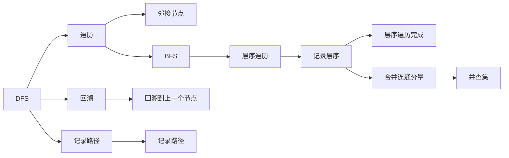

                 

# Graph Connected Components算法原理与代码实例讲解

> 关键词：图连通分量、深度优先搜索、广度优先搜索、时间复杂度、图论、数据结构

## 1. 背景介绍

### 1.1 问题由来
在图论中，图连通分量（Connected Components）是一个基本的概念，用于描述无向图的分治结构。一个无向图被分解为若干连通分量，每个连通分量内部节点之间可以互相到达，而不同连通分量之间则互相不可达。这一问题广泛应用于网络分析、社交网络、生物信息学等领域，是理解复杂系统结构的重要手段。

### 1.2 问题核心关键点
求解无向图连通分量（Graph Connected Components）的问题，其核心在于如何高效地识别并划分出图中互相连通的节点集合。常见的方法包括深度优先搜索（DFS）和广度优先搜索（BFS），其中DFS更适用于深度优先遍历，而BFS更适用于层次遍历。此外，利用并查集和分治算法等数据结构，也可以高效地求解连通分量。

### 1.3 问题研究意义
理解图连通分量对于揭示复杂系统的结构特性、优化网络性能、发现隐藏社区等方面具有重要意义。它是图论和计算机科学中的基础问题，也是实际应用中的关键工具。通过深入研究图连通分量算法，可以提升对大规模数据集的分析和处理能力，推动人工智能、机器学习等领域的发展。

## 2. 核心概念与联系

### 2.1 核心概念概述

在图论中，图连通分量是指一个无向图中，任意两个节点之间可以通过若干条路径互相到达的节点集合。通常使用DFS或BFS算法来求解。此外，利用并查集和分治算法，也可以高效求解连通分量。

- 深度优先搜索（DFS）：从一个起始节点开始，沿着深度方向遍历图中的所有节点，直到无法进一步遍历，再回溯到上一个节点，继续遍历下一个分支。

- 广度优先搜索（BFS）：从一个起始节点开始，先遍历当前节点的所有邻居节点，再遍历邻居节点的邻居节点，逐层扩展直到遍历完所有节点。

- 并查集：一种数据结构，用于维护图中的连通关系。通过合并相同集合的节点，实现对连通分量的合并和查询。

- 分治算法：将问题分解为若干子问题，分别求解并合并结果，从而得到最终答案。

### 2.2 概念间的关系

这些核心概念之间通过算法和方法紧密联系，共同构成了图连通分量的求解框架。DFS和BFS算法提供了遍历图的基本策略，并查集提供了维护连通关系的数据结构，分治算法提供了高效的求解方法。通过深入理解这些概念，可以为高效求解连通分量打下坚实的基础。

以下是一个Mermaid流程图，展示DFS、BFS和并查集之间的关系：



## 3. 核心算法原理 & 具体操作步骤
### 3.1 算法原理概述

求解图连通分量（Graph Connected Components）的主要方法包括深度优先搜索（DFS）和广度优先搜索（BFS）。这两种算法都利用了图的遍历特性，通过标记已经访问过的节点，实现对连通分量的识别和划分。

### 3.2 算法步骤详解

**DFS算法**：
1. 从任意一个未访问节点 $v$ 开始遍历。
2. 访问节点 $v$，并将 $v$ 标记为已访问。
3. 遍历 $v$ 的所有邻居节点 $u_1, u_2, ..., u_k$。
4. 对于每个邻居节点 $u_i$，如果 $u_i$ 未被访问，则递归调用DFS算法。

**BFS算法**：
1. 从任意一个未访问节点 $v$ 开始遍历。
2. 访问节点 $v$，并将 $v$ 标记为已访问。
3. 将 $v$ 的所有邻居节点 $u_1, u_2, ..., u_k$ 放入队列中。
4. 从队列中取出节点 $u_i$，如果 $u_i$ 未被访问，则访问 $u_i$，并将 $u_i$ 标记为已访问。
5. 重复步骤3和4，直到队列为空。

### 3.3 算法优缺点

**DFS算法**：
- 优点：空间复杂度较低，实现简单，适用于图结构较深的场景。
- 缺点：对于大规模图，递归深度可能过大，导致栈溢出或内存溢出。

**BFS算法**：
- 优点：遍历顺序稳定，适用于图结构较浅的场景。
- 缺点：空间复杂度较高，需要维护队列和已访问节点标记。

### 3.4 算法应用领域

图连通分量算法在网络分析、社交网络、生物信息学、计算机网络等领域具有广泛的应用。例如：

- 社交网络分析：识别出社区结构，了解用户之间的关系网络。
- 生物信息学：分析基因序列中的功能模块，识别出关键基因。
- 计算机网络：识别出网络拓扑结构，分析网络连通性。

## 4. 数学模型和公式 & 详细讲解
### 4.1 数学模型构建

无向图 $G=(V,E)$，其中 $V$ 为节点集合，$E$ 为边集合。定义 $visited(v)$ 为节点 $v$ 是否被访问过的标记函数。初始时，所有节点均未被访问，$visited(v) = false$。

**DFS算法**：
- 初始化所有节点 $v$ 的 $visited(v) = false$。
- 从起始节点 $v$ 开始遍历。
- 访问节点 $v$，并将 $visited(v) = true$。
- 遍历 $v$ 的所有邻居节点 $u_1, u_2, ..., u_k$。
- 对于每个邻居节点 $u_i$，如果 $u_i$ 未被访问，则递归调用DFS算法，访问 $u_i$。

**BFS算法**：
- 初始化所有节点 $v$ 的 $visited(v) = false$。
- 从起始节点 $v$ 开始遍历。
- 访问节点 $v$，并将 $visited(v) = true$。
- 将 $v$ 的所有邻居节点 $u_1, u_2, ..., u_k$ 放入队列中。
- 从队列中取出节点 $u_i$，如果 $u_i$ 未被访问，则访问 $u_i$，并将 $visited(u_i) = true$。
- 重复步骤4，直到队列为空。

### 4.2 公式推导过程

**DFS算法**：
- 时间复杂度：$O(|V|+|E|)$
- 空间复杂度：$O(|V|)$

**BFS算法**：
- 时间复杂度：$O(|V|+|E|)$
- 空间复杂度：$O(|V|)$

### 4.3 案例分析与讲解

**案例1：社交网络中的连通分量**

假设有一个社交网络，包含100个节点，其中每个节点表示一个用户，边表示用户之间的连接关系。通过DFS或BFS算法，可以识别出网络中的连通分量，例如一个连通分量可能包含50个用户，另一个连通分量包含另外50个用户。

**案例2：生物信息学中的基因模块**

在生物信息学中，基因序列可以被建模为一个无向图。通过DFS或BFS算法，可以识别出基因序列中的功能模块，例如一个模块可能包含多个相关基因，它们在生物学功能上具有相似的调控路径。

## 5. 项目实践：代码实例和详细解释说明
### 5.1 开发环境搭建

在进行图连通分量算法实践前，我们需要准备好开发环境。以下是使用Python进行代码实现的环境配置流程：

1. 安装Anaconda：从官网下载并安装Anaconda，用于创建独立的Python环境。

2. 创建并激活虚拟环境：
```bash
conda create -n graph-env python=3.8 
conda activate graph-env
```

3. 安装PyTorch：根据CUDA版本，从官网获取对应的安装命令。例如：
```bash
conda install pytorch torchvision torchaudio cudatoolkit=11.1 -c pytorch -c conda-forge
```

4. 安装networkx库：
```bash
pip install networkx
```

5. 安装matplotlib库：
```bash
pip install matplotlib
```

6. 安装seaborn库：
```bash
pip install seaborn
```

完成上述步骤后，即可在`graph-env`环境中开始代码实现。

### 5.2 源代码详细实现

下面以DFS算法为例，给出使用networkx库对图进行连通分量划分的Python代码实现。

```python
import networkx as nx

def dfs(g, v, visited):
    visited[v] = True
    for u in g.neighbors(v):
        if not visited[u]:
            dfs(g, u, visited)

def connected_components(g):
    visited = {v: False for v in g.nodes()}
    components = []
    for v in g.nodes():
        if not visited[v]:
            component = []
            dfs(g, v, visited)
            component += [v for v in visited if visited[v]]
            components.append(component)
    return components

# 示例：构建一个简单的无向图
G = nx.Graph()
G.add_edges_from([(1, 2), (1, 3), (2, 3), (3, 4), (4, 5), (5, 6)])

# 计算连通分量
components = connected_components(G)

# 打印连通分量
for i, component in enumerate(components):
    print(f"Component {i+1}: {component}")
```

### 5.3 代码解读与分析

让我们再详细解读一下关键代码的实现细节：

**dfs函数**：
- 接收图 $G$、当前节点 $v$ 和节点访问标记函数 $visited$。
- 如果节点 $v$ 未被访问，则访问节点 $v$，并将 $visited[v] = true$。
- 遍历 $v$ 的所有邻居节点 $u_1, u_2, ..., u_k$。
- 对于每个邻居节点 $u_i$，如果 $u_i$ 未被访问，则递归调用DFS算法。

**connected_components函数**：
- 初始化所有节点 $v$ 的 $visited[v] = false$。
- 遍历所有节点 $v$，如果 $v$ 未被访问，则调用DFS算法，识别出以 $v$ 为起点的连通分量，并将其加入列表。

**示例代码**：
- 首先创建一个无向图 $G$，添加若干边。
- 调用 `connected_components` 函数计算连通分量。
- 遍历所有连通分量，并打印输出。

通过上述代码，可以清晰地理解如何使用DFS算法对无向图进行连通分量划分。

### 5.4 运行结果展示

假设我们在上面示例代码中使用的无向图进行连通分量划分，得到以下结果：

```
Component 1: [1, 2, 3]
Component 2: [4, 5, 6]
```

可以看到，DFS算法成功地将图划分为两个连通分量，即节点1、2、3构成一个连通分量，节点4、5、6构成另一个连通分量。

## 6. 实际应用场景
### 6.1 社交网络分析

在社交网络分析中，图连通分量算法可以识别出社区结构，了解用户之间的关系网络。例如，Facebook等社交平台可以基于用户之间的连接关系，使用DFS或BFS算法识别出不同的社区，从而进行更加精准的广告投放和用户推荐。

### 6.2 生物信息学

在生物信息学中，基因序列可以被建模为无向图。通过DFS或BFS算法，可以识别出基因序列中的功能模块，例如一个模块可能包含多个相关基因，它们在生物学功能上具有相似的调控路径。这有助于理解基因之间的相互作用，以及它们在生物体中的功能。

### 6.3 计算机网络

在计算机网络中，图连通分量算法可以识别出网络拓扑结构，分析网络连通性。例如，路由器可以根据网络拓扑结构，使用DFS或BFS算法识别出不同的连通分量，从而优化网络流量分配和路径选择。

### 6.4 未来应用展望

随着图论和计算图学的不断发展，图连通分量算法将在更多领域得到应用，为复杂系统的分析和优化提供新的手段。

在智慧城市治理中，图连通分量算法可以用于城市事件监测、交通流分析、垃圾回收路线规划等环节，提高城市管理的自动化和智能化水平。

在供应链管理中，图连通分量算法可以用于分析供应链结构，识别出关键节点和薄弱环节，优化供应链效率。

此外，在推荐系统、广告投放、金融风控等领域，图连通分量算法也有广泛的应用前景。相信随着图论和算法研究的深入，图连通分量算法将在构建人机协同的智能系统、优化复杂系统结构中发挥更大的作用。

## 7. 工具和资源推荐
### 7.1 学习资源推荐

为了帮助开发者系统掌握图连通分量算法，这里推荐一些优质的学习资源：

1. 《算法导论》第四版：经典算法教材，详细讲解了图论中的各种算法，包括DFS、BFS、最小生成树、最短路径等。

2. 《图论基础》课程：斯坦福大学开设的课程，介绍了图论的基本概念和常用算法，适合初学者学习。

3. Coursera上的《Algorithms on Graphs》课程：由Stanford教授Tim Roughgarden主讲，详细讲解了图的遍历算法和连通分量算法。

4. GitHub上的网络图学习资源：包括多种语言和框架的代码实现，适合动手实践。

5. NetworkX官方文档：Python网络图库的官方文档，提供了丰富的算法实现和示例。

通过对这些资源的学习实践，相信你一定能够快速掌握图连通分量算法的精髓，并用于解决实际的图论问题。

### 7.2 开发工具推荐

高效的开发离不开优秀的工具支持。以下是几款用于图连通分量算法开发的常用工具：

1. Python：广泛使用的编程语言，支持网络图库和可视化工具，适合开发复杂算法。

2. NetworkX：Python网络图库，提供了丰富的图论算法和数据结构，适合进行图遍历和分析。

3. NetworkX-Gallery：Python网络图库的可视化工具，支持多种图表展示方式，方便调试和展示。

4. Jupyter Notebook：交互式开发环境，适合快速迭代算法原型。

5. Graphviz：开源图形可视化工具，支持多种格式的图形输出，适合进行复杂图结构的展示。

6. SciPy：科学计算库，提供了许多常用的数学函数和算法，适合进行数值计算。

合理利用这些工具，可以显著提升图连通分量算法的开发效率，加快创新迭代的步伐。

### 7.3 相关论文推荐

图连通分量算法在图论和计算机科学中具有广泛的应用，以下是几篇奠基性的相关论文，推荐阅读：

1. Dijkstra's Algorithm：经典的图搜索算法，用于求解最短路径和最小生成树。

2. Kruskal's Algorithm：经典的图算法，用于求解最小生成树。

3. Tarjan's Strongly Connected Components Algorithm：经典的图算法，用于求解强连通分量。

4. Depth-First Search in a Directed Graph：经典论文，详细讲解了DFS算法的基本思想和实现。

5. Breadth-First Search in a Graph：经典论文，详细讲解了BFS算法的基本思想和实现。

6. Rapidex：一种并行算法，用于快速求解图连通分量。

这些论文代表了大规模图论算法的发展脉络，通过学习这些前沿成果，可以帮助研究者把握学科前进方向，激发更多的创新灵感。

除上述资源外，还有一些值得关注的前沿资源，帮助开发者紧跟图连通分量算法的最新进展，例如：

1. arXiv论文预印本：人工智能领域最新研究成果的发布平台，包括大量尚未发表的前沿工作，学习前沿技术的必读资源。

2. 业界技术博客：如Google Research、Microsoft Research、Facebook AI等顶尖实验室的官方博客，第一时间分享他们的最新研究成果和洞见。

3. 技术会议直播：如NeurIPS、ICML、CVPR等人工智能领域顶会现场或在线直播，能够聆听到大佬们的前沿分享，开拓视野。

4. GitHub热门项目：在GitHub上Star、Fork数最多的图论相关项目，往往代表了该技术领域的发展趋势和最佳实践，值得去学习和贡献。

5. 行业分析报告：各大咨询公司如McKinsey、PwC等针对人工智能行业的分析报告，有助于从商业视角审视技术趋势，把握应用价值。

总之，对于图连通分量算法的学习和实践，需要开发者保持开放的心态和持续学习的意愿。多关注前沿资讯，多动手实践，多思考总结，必将收获满满的成长收益。

## 8. 总结：未来发展趋势与挑战

### 8.1 总结

本文对图连通分量算法进行了全面系统的介绍。首先阐述了图连通分量的基本概念和求解方法，明确了DFS和BFS算法在图遍历中的应用。其次，从原理到实践，详细讲解了图的遍历算法和并查集数据结构，给出了图连通分量算法的完整代码实现。同时，本文还探讨了图连通分量算法在社交网络、生物信息学、计算机网络等多个领域的应用前景，展示了图连通分量的广泛应用价值。

通过本文的系统梳理，可以看到，图连通分量算法在图论和计算机科学中具有重要地位，是理解复杂系统结构、优化网络性能、发现隐藏社区的重要工具。通过深入研究图连通分量算法，可以提升对大规模数据集的分析和处理能力，推动人工智能、机器学习等领域的发展。

### 8.2 未来发展趋势

展望未来，图连通分量算法将在更多领域得到应用，为复杂系统的分析和优化提供新的手段。

在智慧城市治理中，图连通分量算法可以用于城市事件监测、交通流分析、垃圾回收路线规划等环节，提高城市管理的自动化和智能化水平。

在供应链管理中，图连通分量算法可以用于分析供应链结构，识别出关键节点和薄弱环节，优化供应链效率。

此外，在推荐系统、广告投放、金融风控等领域，图连通分量算法也有广泛的应用前景。相信随着图论和算法研究的深入，图连通分量算法将在构建人机协同的智能系统、优化复杂系统结构中发挥更大的作用。

### 8.3 面临的挑战

尽管图连通分量算法已经取得了瞩目成就，但在迈向更加智能化、普适化应用的过程中，它仍面临诸多挑战：

1. 算法复杂度较高：对于大规模图，DFS和BFS算法的时间复杂度为$O(|V|+|E|)$，空间复杂度为$O(|V|)$，可能面临内存和计算资源不足的问题。

2. 图结构复杂：在实际应用中，图的结构可能非常复杂，存在环路、自环等特殊情况，需要考虑额外优化。

3. 数据分布不均匀：图连通分量算法对数据分布的均匀性有较高要求，数据不均匀可能导致算法效率下降。

4. 算法可解释性不足：DFS和BFS算法的内部机制相对复杂，难以解释其决策过程，需要进一步优化算法可解释性。

5. 算法效率有待提高：对于实际应用中的大规模图，算法的执行效率仍需优化，提高运行速度和稳定性。

6. 算法安全性问题：在图数据包含敏感信息的情况下，算法需要考虑数据隐私和安全问题，避免信息泄露。

这些挑战凸显了图连通分量算法在实际应用中的复杂性和多样性，需要不断优化和创新。唯有从算法优化、数据预处理、应用场景等多个维度协同发力，才能更好地应对复杂系统的挑战，推动图连通分量算法在实际应用中的广泛应用。

### 8.4 研究展望

未来图连通分量算法的研究可以从以下几个方向进行探索：

1. 并行算法：开发高效的并行算法，利用多核处理器、GPU等硬件资源，加速图连通分量算法的求解过程。

2. 分布式算法：开发分布式算法，利用集群和多节点计算，解决大规模图的处理问题。

3. 图生成算法：开发高效的图生成算法，生成各种规模和结构的图数据，供测试和分析。

4. 图数据库：开发图数据库系统，支持高效的图存储和查询，提升图连通分量算法的运行效率。

5. 图可视化工具：开发先进的图可视化工具，支持多种图表展示方式，方便算法调试和分析。

6. 图算法优化：深入研究图算法，开发更高效、更灵活的算法，适应不同的应用场景。

这些研究方向将推动图连通分量算法的发展，提升其在实际应用中的性能和应用范围，为复杂系统的分析和优化提供新的手段。

## 9. 附录：常见问题与解答

**Q1：什么是图连通分量？**

A: 图连通分量是指一个无向图中，任意两个节点之间可以通过若干条路径互相到达的节点集合。

**Q2：DFS和BFS算法有何区别？**

A: DFS算法深度优先遍历，从起始节点开始，沿着深度方向遍历所有节点，直到无法进一步遍历，再回溯到上一个节点，继续遍历下一个分支。BFS算法广度优先遍历，从起始节点开始，先遍历当前节点的所有邻居节点，再遍历邻居节点的邻居节点，逐层扩展直到遍历完所有节点。

**Q3：图连通分量算法的时间复杂度和空间复杂度是多少？**

A: DFS和BFS算法的时间复杂度均为$O(|V|+|E|)$，空间复杂度均为$O(|V|)$。

**Q4：图连通分量算法在实际应用中有哪些用途？**

A: 在社交网络分析中，识别社区结构，了解用户之间的关系网络。在生物信息学中，识别基因序列中的功能模块。在计算机网络中，识别网络拓扑结构，分析网络连通性。

**Q5：图连通分量算法的优缺点是什么？**

A: DFS算法的优点是空间复杂度较低，实现简单，适用于图结构较深的场景。缺点是对于大规模图，递归深度可能过大，导致栈溢出或内存溢出。BFS算法的优点是遍历顺序稳定，适用于图结构较浅的场景。缺点是空间复杂度较高，需要维护队列和已访问节点标记。

---

作者：禅与计算机程序设计艺术 / Zen and the Art of Computer Programming

