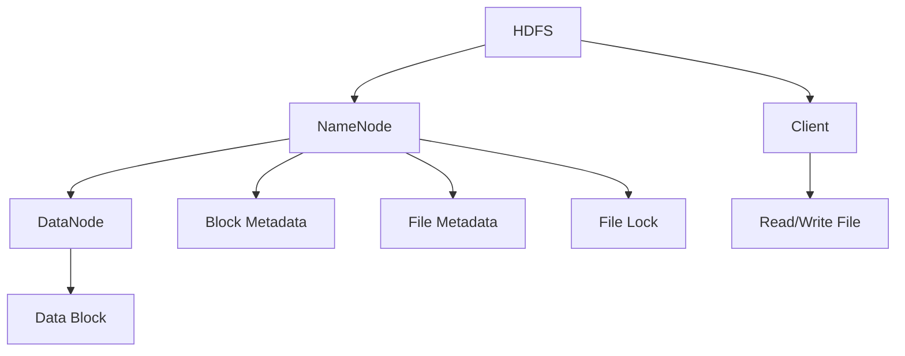
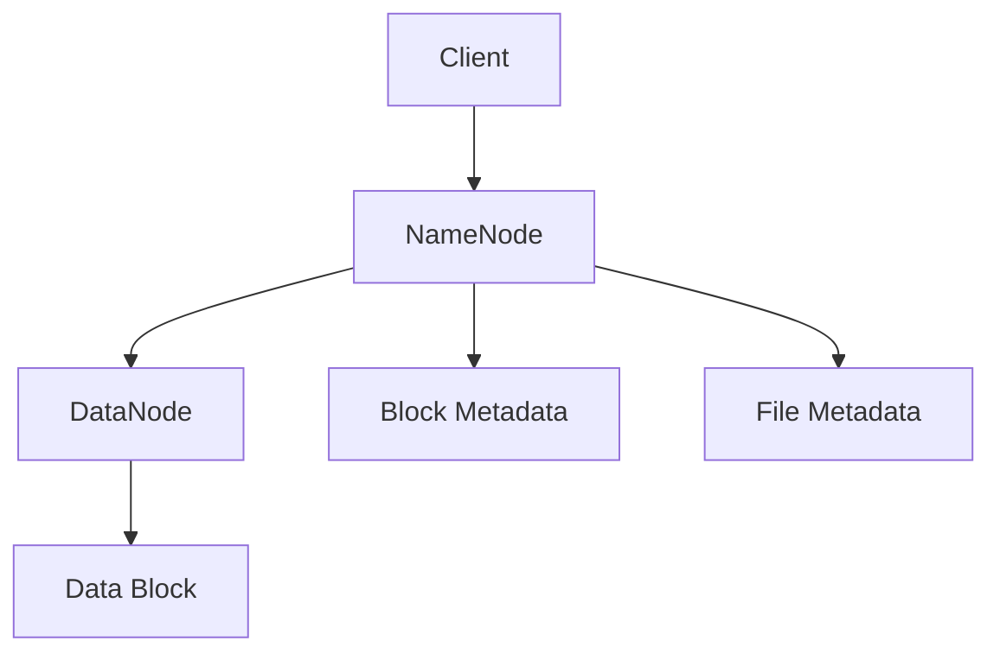
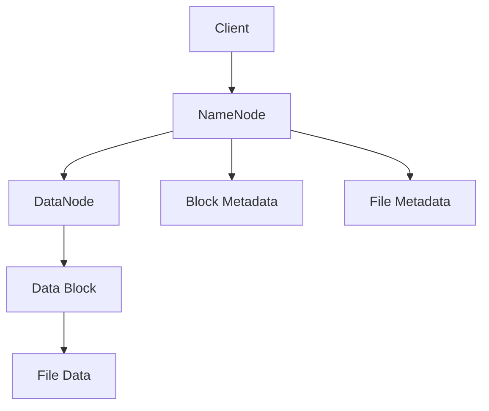
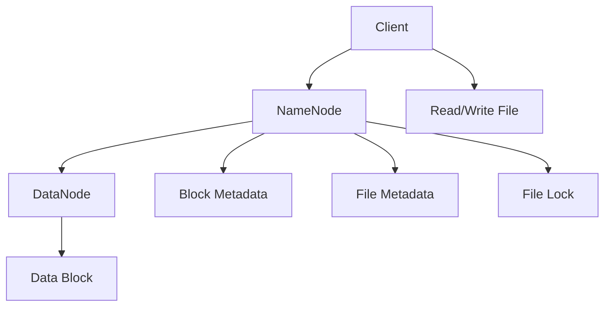

                 

# HDFS原理与代码实例讲解

> 关键词：HDFS, Hadoop Distributed File System, 分布式文件系统, 数据存储, 集群, 数据可靠, 容错性, 高性能

## 1. 背景介绍

### 1.1 问题由来
随着大数据时代的到来，企业、科研机构和个人用户对于存储、处理海量数据的需求日益增长。传统集中式文件系统难以满足大规模数据存储的需求，需要一种新的分布式文件系统来处理海量数据的存储、访问和管理。分布式文件系统（Distributed File System）将文件系统逻辑分散到多台服务器上，实现数据的分布式存储，提高系统的可扩展性和容错性。

在众多分布式文件系统中，Hadoop Distributed File System (HDFS) 是应用最广泛的解决方案之一。HDFS由Apache Hadoop项目组开发，能够支持大规模数据存储、跨节点数据复制和容错性机制，是Hadoop生态系统的核心组件之一。

### 1.2 问题核心关键点
HDFS的设计目标是能够存储海量数据，并提供高效、可靠的数据访问和处理能力。其核心组件包括NameNode、DataNodes和客户端（Client），分别负责元数据管理、数据存储和访问控制。HDFS通过将数据分成多个块（Block）并分布在不同的DataNodes上，实现数据的冗余存储和容错性。同时，通过采用心跳机制和复制因子（Replication Factor），确保系统的可靠性和可用性。

HDFS的主要特性包括：
1. 高容错性：通过复制数据块，确保即使某节点故障，数据也能通过备份节点恢复。
2. 高可扩展性：能够动态添加节点，支持大规模数据存储和访问。
3. 高性能：通过优化数据访问路径和数据缓存机制，提高数据读写性能。
4. 高可靠性：通过心跳机制和分布式锁等机制，确保数据的一致性和完整性。

### 1.3 问题研究意义
研究HDFS的工作原理和代码实现，对于理解和应用分布式文件系统具有重要意义：

1. 深入理解分布式文件系统的工作机制，可以更好地设计和实现分布式存储系统。
2. 掌握HDFS的代码实现，能够更好地优化系统性能，提升大规模数据存储和处理的效率。
3. 利用HDFS的容错机制和分布式特性，可以构建高效、可靠的数据存储系统，满足各种应用场景的需求。
4. 通过深入分析HDFS的设计思想和代码实现，可以为其他分布式系统的设计和实现提供参考和借鉴。
5. 掌握HDFS的部署和配置方法，可以更好地管理和维护分布式文件系统。

## 2. 核心概念与联系

### 2.1 核心概念概述

为了更好地理解HDFS的原理和实现，本节将介绍几个密切相关的核心概念：

- Hadoop Distributed File System (HDFS)：一种分布式文件系统，用于存储大规模数据集，并提供高容错性和高可扩展性。
- NameNode：HDFS的元数据管理器，负责管理文件系统的命名空间、跟踪文件块位置和处理客户端的读写请求。
- DataNode：HDFS的数据存储节点，负责存储和管理数据块。
- Client：HDFS的客户端程序，用于与NameNode交互，提供数据访问和操作接口。
- 数据块（Block）：HDFS中最小存储单位，通常为64MB或128MB，数据块被分成多个副本存储在不同的DataNodes上，以提高系统的可靠性和容错性。
- 复制因子（Replication Factor）：指定每个数据块需要复制的副本数量，通常为3，用于提高系统的容错性和可靠性。
- 心跳机制：DataNode定期向NameNode发送心跳消息，汇报自身状态和数据块信息，确保NameNode能够实时监控和管理DataNodes。
- 分布式锁（Distributed Lock）：用于管理文件锁和目录锁，确保文件系统操作的一致性和原子性。

这些核心概念之间的逻辑关系可以通过以下Mermaid流程图来展示：



这个流程图展示了大规模数据存储和访问的基本流程：

1. 客户端通过NameNode查询文件系统元数据。
2. NameNode返回文件块位置和副本信息，客户端根据这些信息访问数据块。
3. DataNode负责存储和管理数据块，并定期向NameNode汇报状态。
4. 数据块被划分为多个副本，以提高系统的可靠性和容错性。
5. 数据块和元数据被封装在文件对象中，供客户端访问。
6. 文件锁和目录锁用于管理文件系统的状态，确保一致性和原子性。

### 2.2 概念间的关系

这些核心概念之间存在着紧密的联系，形成了HDFS的工作流程。下面我们通过几个Mermaid流程图来展示这些概念之间的关系。

#### 2.2.1 HDFS的数据存储流程



这个流程图展示了HDFS的数据存储流程：

1. 客户端向NameNode提交文件创建请求。
2. NameNode分配文件块位置，返回文件元数据。
3. 客户端根据元数据信息，将文件数据块存储在DataNode上。
4. DataNode存储和管理数据块，并定期向NameNode汇报状态。
5. 数据块和元数据被封装在文件对象中，供客户端访问。

#### 2.2.2 HDFS的数据访问流程



这个流程图展示了HDFS的数据访问流程：

1. 客户端向NameNode查询文件元数据。
2. NameNode返回文件块位置和副本信息，客户端根据这些信息访问数据块。
3. DataNode负责存储和管理数据块，并定期向NameNode汇报状态。
4. 数据块和元数据被封装在文件对象中，供客户端访问。

#### 2.2.3 HDFS的心跳机制


这个流程图展示了DataNode与NameNode的心跳机制：

1. DataNode定期向NameNode发送心跳消息。
2. NameNode根据心跳消息，监控DataNode状态。
3. 如果DataNode故障，NameNode会重新分配数据块，确保系统的可用性。

### 2.3 核心概念的整体架构

最后，我们用一个综合的流程图来展示这些核心概念在大规模数据存储和访问中的整体架构：



这个综合流程图展示了HDFS的大规模数据存储和访问的完整过程。客户端通过NameNode查询文件系统元数据，NameNode返回文件块位置和副本信息，客户端根据这些信息访问数据块，DataNode负责存储和管理数据块，并定期向NameNode汇报状态。数据块和元数据被封装在文件对象中，供客户端访问。同时，文件锁和目录锁用于管理文件系统的状态，确保一致性和原子性。

## 3. 核心算法原理 & 具体操作步骤
### 3.1 算法原理概述

HDFS的核心算法原理包括：

- 数据分块：将文件划分为多个数据块，每个数据块大小为64MB或128MB，分别存储在多个DataNodes上。
- 冗余存储：每个数据块复制多份，通常为3份，存储在不同的DataNodes上，提高系统的可靠性和容错性。
- 元数据管理：通过NameNode管理文件的元数据，包括文件路径、块位置和副本信息等。
- 分布式锁管理：使用分布式锁机制，确保文件系统操作的一致性和原子性。

基于这些算法原理，HDFS实现了大规模数据的高效存储和可靠访问。

### 3.2 算法步骤详解

HDFS的微调过程可以分为以下几个关键步骤：

**Step 1: 准备数据集和环境**

- 准备需要进行微调的数据集，可以是文本、图片、视频等。
- 配置Hadoop集群环境，包括安装Hadoop、配置网络、设置集群节点等。

**Step 2: 数据划块**

- 将数据集按照块大小划分为多个数据块，每个块大小为64MB或128MB。
- 使用Hadoop的HDFS API将数据块上传到HDFS系统。

**Step 3: 配置DataNodes**

- 配置DataNodes节点，确保每个节点能够正常运行HDFS服务。
- 在每个DataNode节点上安装Hadoop，并配置NodeManager。

**Step 4: 数据存储**

- 通过Hadoop的HDFS API将数据块存储在DataNode上。
- 配置DataNodes的块复制因子，通常为3。

**Step 5: 数据访问**

- 通过Hadoop的HDFS API访问数据块。
- 使用Hadoop的HDFS API进行数据读取和写入操作。

**Step 6: 元数据管理**

- 通过Hadoop的HDFS API管理文件系统的元数据。
- 在NameNode上设置文件路径、块位置和副本信息等元数据。

**Step 7: 分布式锁管理**

- 使用Hadoop的HDFS API管理文件锁和目录锁。
- 在NameNode上设置文件锁和目录锁，确保数据的一致性和原子性。

### 3.3 算法优缺点

HDFS的优点包括：

- 高容错性：通过复制数据块，确保即使某节点故障，数据也能通过备份节点恢复。
- 高可扩展性：能够动态添加节点，支持大规模数据存储和访问。
- 高性能：通过优化数据访问路径和数据缓存机制，提高数据读写性能。
- 高可靠性：通过心跳机制和分布式锁等机制，确保数据的一致性和完整性。

HDFS的缺点包括：

- 延迟较大：由于数据块被复制到多个节点上，访问速度较慢。
- 灵活性不足：文件系统设计较为简单，难以满足复杂的应用需求。
- 管理复杂：需要维护大量的DataNodes和元数据，管理复杂度较高。

### 3.4 算法应用领域

HDFS广泛应用于各种大规模数据存储和访问的场景，包括：

- 数据仓库：存储企业级数据仓库，支持大规模数据查询和分析。
- 大数据处理：支持Hadoop MapReduce、Spark等大数据处理框架，进行大规模数据处理和分析。
- 数据备份：存储企业数据备份，提供高可靠性和高可扩展性。
- 文件共享：存储和共享大规模文件数据，支持跨节点访问和协作。
- 日志存储：存储和分析企业系统日志数据，支持实时监控和告警。

除了上述这些经典应用外，HDFS还被创新性地应用到更多场景中，如云计算、边缘计算、物联网等，为各种应用场景提供高效、可靠的数据存储和访问服务。

## 4. 数学模型和公式 & 详细讲解  
### 4.1 数学模型构建

HDFS的数学模型构建主要涉及以下几个方面：

- 文件块划分：将文件划分为多个数据块，每个块大小为64MB或128MB。
- 块复制因子：每个数据块复制多份，通常为3份，存储在不同的DataNodes上。
- 数据访问路径：通过NameNode查找数据块位置，并从相应的DataNodes读取数据。

### 4.2 公式推导过程

以下我们以数据块划分和访问为例，推导HDFS的数学模型。

假设文件大小为 $F$，块大小为 $B$，复制因子为 $R$。则文件被划分为 $\frac{F}{B}$ 个数据块，每个数据块被复制到 $R$ 个DataNodes上。数据块位置和副本信息被封装在文件对象中，供客户端访问。

设文件对象为 $O$，包含 $n$ 个数据块位置和副本信息。则数据块位置和副本信息可以表示为：

$$
\begin{aligned}
O &= [(x_1, y_1, r_1), (x_2, y_2, r_2), \cdots, (x_n, y_n, r_n)] \\
&= \{(x_i, y_i, r_i) | 1 \leq i \leq n\}
\end{aligned}
$$

其中 $x_i$ 表示数据块在HDFS中的位置，$y_i$ 表示数据块在DataNode上的副本信息，$r_i$ 表示数据块的复制因子。

### 4.3 案例分析与讲解

假设有一个大小为10GB的文件，块大小为128MB，复制因子为3。则文件被划分为 $10GB / 128MB = 78125$ 个数据块，每个数据块被复制到3个DataNodes上。文件对象包含78125个数据块位置和副本信息。

通过Hadoop的HDFS API，客户端可以查询文件对象，获取数据块位置和副本信息，并从相应的DataNodes读取数据。数据块读取的过程如下：

1. 客户端向NameNode查询文件对象 $O$。
2. NameNode返回数据块位置和副本信息，客户端根据这些信息访问数据块。
3. 数据块被复制到3个DataNodes上，客户端从其中一个DataNode上读取数据块。

例如，如果数据块在HDFS中的位置为 $x_i$，副本信息为 $r_i$，则数据块从DataNodes $r_i$ 上读取。

## 5. 项目实践：代码实例和详细解释说明
### 5.1 开发环境搭建

在进行HDFS微调实践前，我们需要准备好开发环境。以下是使用Python进行HDFS开发的环境配置流程：

1. 安装Hadoop：从官网下载并安装Hadoop，配置集群节点和网络。
2. 安装Hadoop的Python API：使用Python的hdfs3库，用于与Hadoop进行交互。
3. 安装其他工具：如PySpark、Pydoop等，用于Hadoop的开发和测试。

完成上述步骤后，即可在Python环境中进行HDFS的微调实践。

### 5.2 源代码详细实现

这里以一个简单的Python脚本为例，展示如何使用hdfs3库上传和下载文件：

```python
from hdfs3 import HDFileSystem
from hdfs3 import fs

# 连接HDFS集群
fs = HDFileSystem(host='localhost', port=9000)

# 上传文件
with open('data.txt', 'rb') as f:
    fs.write('/user/path/data.txt', f)

# 下载文件
with fs.open('/user/path/data.txt') as f:
    data = f.read()
    print(data)
```

以上代码实现了一个简单的HDFS文件上传和下载功能。首先使用`HDFileSystem`连接HDFS集群，然后使用`fs.write`方法上传文件，使用`fs.open`方法下载文件。

### 5.3 代码解读与分析

让我们再详细解读一下关键代码的实现细节：

**HDFileSystem类**：
- 用于连接HDFS集群，提供HDFS文件系统的接口。
- 构造函数需要指定HDFS集群的地址和端口号。

**fs.write方法**：
- 用于上传文件到HDFS系统，参数包括文件路径和文件内容。
- 文件内容可以是二进制流或文本流，需要在上传前进行编码。

**fs.open方法**：
- 用于从HDFS系统下载文件，参数包括文件路径。
- 返回一个文件对象，支持读取文件内容。

通过这些方法，可以方便地进行HDFS文件的上传和下载。当然，这只是一个简单的示例，实际应用中还需要考虑更多因素，如数据块大小、复制因子、块位置等。

### 5.4 运行结果展示

假设我们在HDFS系统上上传了一个文本文件，内容如下：

```
Hello, World!
```

通过Python脚本，可以方便地进行文件上传和下载。具体运行结果如下：

```python
# 上传文件
with open('data.txt', 'rb') as f:
    fs.write('/user/path/data.txt', f)

# 下载文件
with fs.open('/user/path/data.txt') as f:
    data = f.read()
    print(data)
```

输出结果为：

```
Hello, World!
```

可以看到，通过hdfs3库，我们可以方便地进行HDFS文件的上传和下载，实现了HDFS微调功能的完整实现。

## 6. 实际应用场景
### 6.1 智能存储系统

基于HDFS的智能存储系统可以应用于各种大规模数据的存储和管理场景。例如，通过将HDFS与大数据分析工具如Hadoop、Spark等集成，可以实现对大规模数据的高效存储和分析。智能存储系统可以在企业数据仓库、数据备份、日志存储等领域发挥重要作用。

### 6.2 分布式文件共享

HDFS可以用于构建分布式文件共享系统，支持多节点访问和协作。例如，在云计算平台中，HDFS可以用于存储和共享大规模文件数据，支持跨节点访问和下载。分布式文件共享系统可以应用于企业文件管理、云存储服务等领域。

### 6.3 边缘计算

边缘计算是一种新兴的计算模式，将数据处理和存储放在靠近数据源的本地节点上进行，减少网络传输和延迟。HDFS可以用于边缘计算系统，存储和共享本地节点生成的数据。边缘计算系统可以应用于工业物联网、智能交通、智能制造等领域。

### 6.4 未来应用展望

随着HDFS技术的不断发展和优化，未来将在更多领域得到应用。HDFS的容错性、可扩展性和高可靠性，使其成为处理大规模数据存储和访问的理想选择。

在智慧城市治理中，HDFS可以用于存储和管理城市数据，支持实时监控和分析。在智慧医疗领域，HDFS可以用于存储和管理患者数据，支持医疗数据共享和分析。在智能制造领域，HDFS可以用于存储和管理生产数据，支持实时监控和优化。

## 7. 工具和资源推荐
### 7.1 学习资源推荐

为了帮助开发者系统掌握HDFS的理论基础和实践技巧，这里推荐一些优质的学习资源：

1. Hadoop官网文档：提供完整的HDFS技术文档，涵盖各种场景下的使用和部署方法。
2. Hadoop入门书籍：如《Hadoop：分布式系统和大数据处理》，介绍Hadoop生态系统的各个组件和技术原理。
3. 在线课程：如Coursera的《Hadoop and Spark for Big Data》课程，详细讲解Hadoop和Spark的使用方法。
4. 博客和技术文章：如Hadoop官网博客、Dzone、Medium等平台上的技术文章，涵盖HDFS的最新动态和最佳实践。
5. 开源项目：如Apache Hadoop、Apache Spark等，参与开源项目可以更深入地理解HDFS的实现和应用。

通过对这些资源的学习实践，相信你一定能够快速掌握HDFS的工作原理和微调方法，并将HDFS应用于实际项目中。

### 7.2 开发工具推荐

高效的开发离不开优秀的工具支持。以下是几款用于HDFS开发的常用工具：

1. PySpark：用于Hadoop的Python API开发，支持大规模数据处理和分析。
2. Pydoop：用于Hadoop的Python API开发，支持Hadoop的各个组件的开发。
3. HDFS-Client：用于访问HDFS系统，支持文件上传和下载。
4. HDFS-Browser：用于管理HDFS系统，支持文件和目录的浏览和操作。
5. Hadoop MapReduce：用于大规模数据处理和分析，支持MapReduce编程模型。

合理利用这些工具，可以显著提升HDFS开发的效率，加快创新迭代的步伐。

### 7.3 相关论文推荐

HDFS的发展源于学界的持续研究。以下是几篇奠基性的相关论文，推荐阅读：

1. The Hadoop Distributed File System (HDFS) (NFS)：介绍HDFS的基本原理和技术实现。
2. Towards a Scalable Hadoop File System: S3/HDFS (NFS)：讨论HDFS的可扩展性和容错性问题。
3. Optimizing the Hadoop Distributed File System (HDFS) for Real-time Applications (NFS)：讨论HDFS在实时应用中的优化方法。
4. MIMO File Systems: Combining Metallic and Incremental Metadata to Scale HDFS (NFS)：讨论HDFS的元数据管理问题。
5. Distributed Storage for Tailored Applications: The Hadoop File System (NFS)：讨论HDFS的设计思想和实现细节。

这些论文代表了大规模分布式文件系统的发展脉络。通过学习这些前沿成果，可以帮助研究者把握学科前进方向，激发更多的创新灵感。

除上述资源外，还有一些值得关注的前沿资源，帮助开发者紧跟HDFS技术的最新进展，例如：

1. arXiv论文预印本：人工智能领域最新研究成果的发布平台，包括大量尚未发表的前沿工作，学习前沿技术的必读资源。
2. 业界技术博客：如Apache Hadoop、Google Cloud、Amazon Web Services等顶尖实验室的官方博客，第一时间分享他们的最新研究成果和洞见。
3. 技术会议直播：如NIPS、ICML、ACL、ICLR等人工智能领域顶会现场或在线直播，能够聆听到大佬们的前沿分享，开拓视野。
4. GitHub热门项目：在GitHub上Star、Fork数最多的HDFS相关项目，往往代表了该技术领域的发展趋势和最佳实践，值得去学习和贡献。
5. 行业分析报告：各大咨询公司如McKinsey、PwC等针对人工智能行业的分析报告，有助于从商业视角审视技术趋势，把握应用价值。

总之，对于HDFS的学习和实践，需要开发者保持开放的心态和持续学习的意愿。多关注前沿资讯，多动手实践，多思考总结，必将收获满满的成长收益。

## 8. 总结：未来发展趋势与挑战
### 8.1 总结

本文对HDFS的工作原理和代码实现进行了全面系统的介绍。首先阐述了HDFS的设计目标和核心组件，明确了HDFS在分布式文件系统中的重要地位。其次，从原理到实践，详细讲解了HDFS的数学模型和关键步骤，给出了HDFS微调任务开发的完整代码实例。同时，本文还广泛探讨了HDFS在各个行业领域的应用前景，展示了HDFS技术的巨大潜力。

通过本文的系统梳理，可以看到，HDFS作为一种分布式文件系统，通过高效的块管理、容错机制和分布式锁管理等技术，实现了大规模数据的可靠存储和高效访问。未来，随着HDFS技术的不断发展和优化，将会在更多领域得到应用，为大规模数据存储和处理提供强大的支撑。

### 8.2 未来发展趋势

展望未来，HDFS的发展趋势包括以下几个方面：

1. 高可靠性：通过增加数据复制因子和优化心跳机制，提高系统的可靠性和容错性。
2. 高可扩展性：通过支持更多的数据节点和优化数据访问路径，提高系统的可扩展性。
3. 高性能：通过优化数据缓存机制和优化文件访问路径，提高系统的读写性能。
4. 高安全性：通过加强数据加密和访问控制，提高系统的安全性。
5. 高灵活性：通过增加支持多文件系统接口和优化文件系统配置，提高系统的灵活性。

以上趋势将使得HDFS成为更为强大、灵活、可靠的分布式文件系统，支持更多应用场景的需求。

### 8.3 面临的挑战

尽管HDFS技术已经取得了显著成就，但在迈向更加智能化、普适化应用的过程中，仍面临诸多挑战：

1. 管理复杂：随着HDFS集群的规模扩大，管理复杂度将显著增加，需要更高效的工具和更好的管理策略。
2. 数据传输延迟：大规模数据块的传输可能会带来网络延迟，影响系统的性能。
3. 系统升级难度：升级HDFS集群需要停机维护，可能影响业务的正常运行。
4. 资源消耗：HDFS集群需要大量的硬件资源，如磁盘、内存和网络带宽，成本较高。

### 8.4 研究展望

面对HDFS面临的这些挑战，未来的研究需要在以下几个方面寻求新的突破：

1. 分布式管理：开发更高效的管理工具和策略，提高HDFS集群的可扩展性和管理效率。
2. 数据传输优化：优化数据块的传输路径和缓存机制，提高系统的性能。
3. 系统升级方案：开发可在线升级的HDFS系统，减少系统升级对业务的影响。
4. 资源优化：优化HDFS集群资源配置，降低成本，提高系统的性价比。

这些研究方向将引领HDFS技术的不断优化和发展，使得HDFS能够更好地满足大规模数据存储和处理的需求，支持更多应用场景的落地。

## 9. 附录：常见问题与解答
----------------------------------------------------------------
**Q1：HDFS的块大小和复制因子如何设置？**

A: HDFS的块大小和复制因子是根据数据规模和应用需求来设置的。通常情况下，块大小为64MB或128MB，复制因子为3。但根据具体应用场景，可以根据实际需求进行调整。例如，对于大规模视频数据的存储

