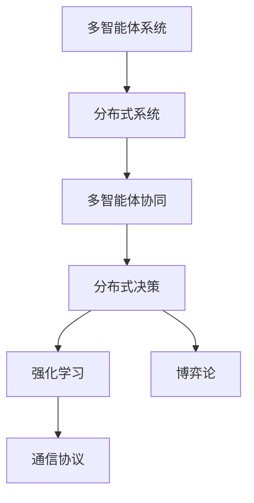
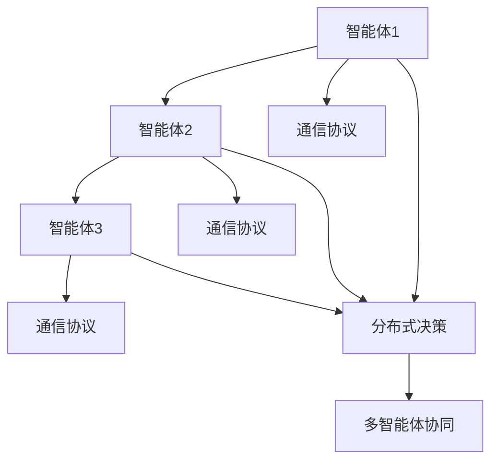
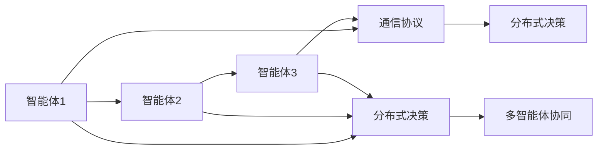
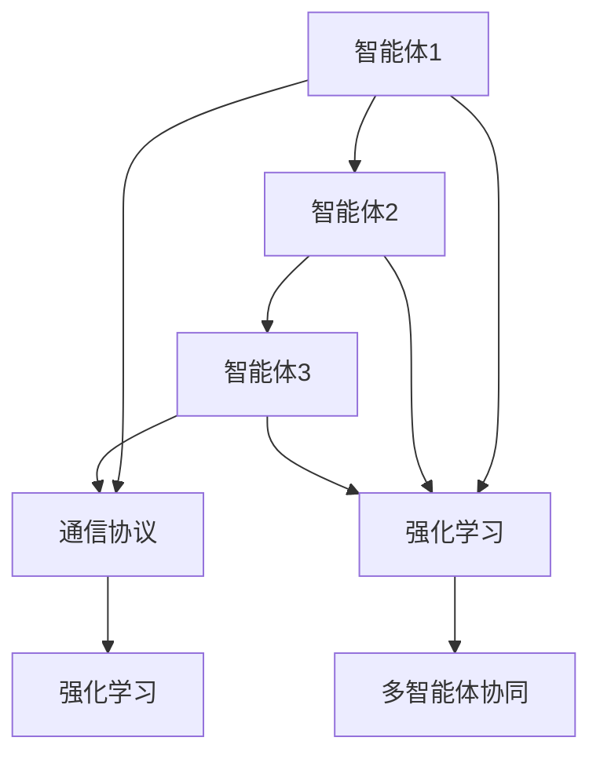
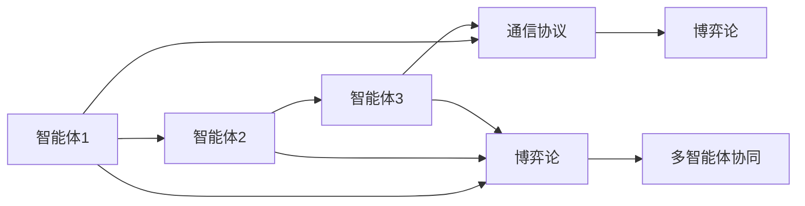
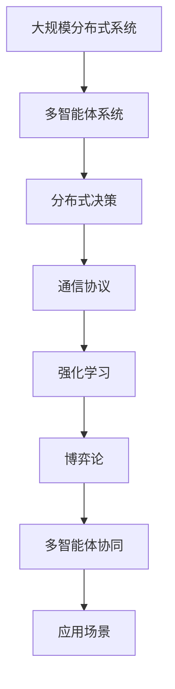

                 

# Multiagent Collaboration 的方法

> 关键词：Multiagent Systems, Distributed Computing, Multiagent Reinforcement Learning, Game Theory, Collaborative Algorithms

## 1. 背景介绍

### 1.1 问题由来
随着技术的发展，计算机网络环境和分布式系统变得越来越复杂。在大型分布式系统中，往往需要多个智能体（Agent）协同工作才能实现整体系统的最优性能。比如在云计算环境中，服务器的负载均衡、资源调度等任务，就是多个智能体合作的结果。然而，由于个体智能体之间的交互复杂，整体系统的控制和优化面临着许多难题。

为了解决这个问题，人们提出了多智能体协同（Multiagent Collaboration, MAC）的方法，通过智能体之间的合作和协调，提高系统整体的性能和稳定性。近年来，随着深度学习、强化学习等技术的发展，多智能体协同方法得到了更多的关注，并开始广泛应用于分布式系统、自动驾驶、智能制造等领域。

### 1.2 问题核心关键点
多智能体协同的核心在于智能体之间的通信与协作。智能体之间的交互包括信息共享、资源分配、任务协调等。由于智能体之间的目标可能不同，如何设计合理的机制，使得智能体能够达成一致，共同优化整体性能，成为了研究的关键点。

在多智能体系统中，需要考虑的问题包括：

- 如何设计智能体之间的通信协议，保证信息的正确传递和共享。
- 如何定义智能体之间的奖励和惩罚机制，使得智能体能够根据整体系统的目标调整自己的行为。
- 如何处理智能体之间的协作与竞争关系，避免协作过程中的冲突和冲突。
- 如何设计分布式决策算法，保证智能体之间的协作效率和一致性。

### 1.3 问题研究意义
多智能体协同方法，通过设计合理的智能体通信与协作机制，能够显著提升分布式系统的性能和稳定性。对于云计算、智能制造等高复杂度系统，多智能体协同技术可以优化资源配置，减少延迟和故障，提高系统的可靠性和可扩展性。

此外，多智能体协同技术还能应用于自动驾驶、智能交通等领域，通过智能体之间的信息共享和任务协调，实现更高效、更安全的自动驾驶系统。在无人仓储、智能物流等生产制造领域，多智能体协同技术也可以优化作业流程，提高效率，降低成本。

## 2. 核心概念与联系

### 2.1 核心概念概述

为了更好地理解多智能体协同方法，本节将介绍几个密切相关的核心概念：

- 多智能体系统（Multiagent System, MAC）：由多个智能体组成的系统，每个智能体具有自主的决策能力和交互行为。
- 分布式系统（Distributed System）：由多个计算节点通过网络互联而成的系统，每个节点可以独立运行并完成部分任务。
- 多智能体协同（Multiagent Collaboration, MAC）：多智能体系统中的各个智能体通过通信和协作，实现整体系统性能的最优化。
- 分布式决策（Distributed Decision Making）：在分布式系统中，多个智能体共同参与决策，通过协议和算法协调各个智能体的行为，达成一致。
- 强化学习（Reinforcement Learning, RL）：一种通过智能体与环境互动学习最优策略的方法，广泛应用于多智能体协同中。
- 博弈论（Game Theory）：一种研究多个智能体之间策略和交互的理论，多智能体协同中常用于设计智能体之间的奖励和惩罚机制。
- 通信协议（Communication Protocol）：多智能体协同中，智能体之间进行信息交换和交互的规则和协议。

这些概念之间的联系紧密，构成了多智能体协同方法的基础。下面通过Mermaid流程图展示这些概念之间的关系：



这个流程图展示了大规模分布式系统中的多智能体协同流程。

### 2.2 概念间的关系

这些核心概念之间存在着紧密的联系，形成了多智能体协同方法的整体生态系统。下面我们通过几个Mermaid流程图来展示这些概念之间的关系。

#### 2.2.1 多智能体系统的构建



这个流程图展示了多智能体系统的构建过程。智能体通过通信协议进行信息交互，通过分布式决策算法协调各自的决策，最终达成多智能体协同的效果。

#### 2.2.2 分布式决策的实现



这个流程图展示了分布式决策的实现流程。各个智能体通过通信协议交换信息，并通过分布式决策算法协调各自的决策，达成一致。

#### 2.2.3 强化学习在多智能体协同中的应用



这个流程图展示了强化学习在多智能体协同中的应用。通过强化学习，智能体能够通过与环境的互动，学习最优的决策策略，从而达成多智能体协同的目标。

#### 2.2.4 博弈论在多智能体协同中的应用



这个流程图展示了博弈论在多智能体协同中的应用。通过博弈论，智能体能够理解其他智能体的行为，从而调整自己的策略，达成协作的目标。

### 2.3 核心概念的整体架构

最后，我们用一个综合的流程图来展示这些核心概念在大规模分布式系统中整体架构：



这个综合流程图展示了从大规模分布式系统到多智能体协同的完整过程。系统通过设计合理的通信协议和决策算法，使得多个智能体协同工作，达到系统的最优性能。

## 3. 核心算法原理 & 具体操作步骤
### 3.1 算法原理概述

多智能体协同方法的核心思想是通过通信和协作，实现系统整体性能的最优化。在多智能体系统中，各个智能体的行为互相影响，通过合理的通信和决策机制，各个智能体能够达成一致，共同优化整体系统性能。

形式化地，假设系统中有 $n$ 个智能体 $A_1, A_2, ..., A_n$，每个智能体 $A_i$ 的目标为 $f_i$，系统整体的目标为 $f_s$。多智能体协同的目标是最小化 $f_s$，即：

$$
\min_{A_1, A_2, ..., A_n} f_s
$$

其中 $f_s$ 可以定义为多个智能体目标的加权和，即：

$$
f_s = \sum_{i=1}^{n} \alpha_i f_i
$$

其中 $\alpha_i$ 为智能体 $A_i$ 的权重，通常为智能体在系统中所承担的任务比例。

为了实现上述目标，通常采用分布式决策算法和通信协议，通过智能体之间的交互和协作，协调各自的决策，从而优化系统性能。分布式决策算法的设计，需要考虑智能体之间的通信机制、决策规则、反馈机制等。

### 3.2 算法步骤详解

多智能体协同方法的具体实现步骤包括以下几个关键步骤：

**Step 1: 设计通信协议**
- 设计合适的通信协议，保证智能体之间的信息交换和协作。通信协议可以包括数据格式、交换频率、交换方式等。

**Step 2: 定义智能体的目标和奖励**
- 定义各个智能体的目标和奖励函数。通常，智能体的目标是通过优化自身的行为，最大化整体系统性能。奖励函数用于衡量智能体的行为对整体系统的贡献。

**Step 3: 设计分布式决策算法**
- 设计分布式决策算法，通过智能体之间的交互和协作，协调各自的决策。常见的分布式决策算法包括基于博弈论的方法、基于强化学习的方法等。

**Step 4: 实施协同算法**
- 根据设计的通信协议和决策算法，实施协同算法。通过智能体之间的通信和决策，共同优化系统性能。

**Step 5: 评估和优化**
- 对实施后的系统性能进行评估，识别协同算法中的问题，并进行优化。

### 3.3 算法优缺点

多智能体协同方法具有以下优点：
- 能够提升系统整体的性能和稳定性，尤其是在分布式系统中，多智能体协同能够优化资源配置，减少延迟和故障。
- 适用于复杂多变的系统环境，智能体之间的协作和决策能够适应不同任务需求。
- 能够充分利用分布式系统的计算和存储资源，提高系统的可扩展性。

同时，多智能体协同方法也存在一些局限性：
- 系统设计复杂，需要考虑智能体之间的通信机制、决策规则、反馈机制等。
- 各个智能体之间需要进行频繁的通信和协调，可能带来较大的通信开销和延迟。
- 智能体之间的协作和决策需要协调一致，避免冲突和抵触。

### 3.4 算法应用领域

多智能体协同方法已经被广泛应用于以下几个领域：

- **云计算和分布式系统**：通过智能体之间的协同，优化资源配置和调度，提高系统的可靠性和可扩展性。
- **自动驾驶和智能交通**：通过智能体之间的协作，实现交通流量的优化和自动驾驶的安全性。
- **智能制造和无人仓储**：通过智能体之间的协作，优化作业流程和资源配置，提高生产效率。
- **网络安全和威胁检测**：通过智能体之间的协作，识别和应对网络威胁，提升系统的安全性。

## 4. 数学模型和公式 & 详细讲解 & 举例说明（备注：数学公式请使用latex格式，latex嵌入文中独立段落使用 $$，段落内使用 $)
### 4.1 数学模型构建

多智能体协同的数学模型通常包括智能体的状态和行为、通信协议和决策算法、系统整体的目标等。下面以一个简单的多智能体协同系统为例，构建数学模型。

假设系统中有两个智能体 $A_1$ 和 $A_2$，每个智能体的状态为 $s_i$，行为为 $a_i$，智能体之间的通信协议为 $c$。智能体 $A_1$ 的目标为最大化其收益 $r_1$，智能体 $A_2$ 的目标为最大化其收益 $r_2$。系统整体的目标为最大化整体收益 $R$。

则数学模型可以表示为：

$$
\max_{A_1, A_2} R = \max_{a_1, a_2} \sum_{i=1}^{2} r_i(a_1, a_2)
$$

其中 $r_i$ 为智能体 $A_i$ 的收益函数。智能体的行为和状态可以通过决策算法和通信协议进行更新。

### 4.2 公式推导过程

下面以一个简单的多智能体协同算法为例，推导其数学公式。

假设智能体 $A_1$ 和 $A_2$ 在每个时间步 $t$ 上做出行为 $a_1$ 和 $a_2$，智能体之间的通信协议为 $c$。智能体 $A_1$ 的收益函数为 $r_1(a_1, a_2)$，智能体 $A_2$ 的收益函数为 $r_2(a_1, a_2)$。系统整体的目标为最大化整体收益 $R$。

则多智能体协同算法的数学公式可以表示为：

$$
\max_{a_1, a_2} R = \max_{a_1, a_2} \sum_{t=1}^T r_1(a_1, a_2) + r_2(a_1, a_2)
$$

其中 $T$ 为时间步数。智能体的行为 $a_i$ 可以通过决策算法和通信协议进行更新，决策算法可以是基于博弈论的方法、基于强化学习的方法等。

### 4.3 案例分析与讲解

假设系统中有两个智能体 $A_1$ 和 $A_2$，智能体 $A_1$ 的任务是最大化其收益 $r_1$，智能体 $A_2$ 的任务是最大化其收益 $r_2$。系统整体的目标是最大化整体收益 $R$。

智能体之间的通信协议为共享信息，即智能体 $A_1$ 和 $A_2$ 共享其状态和行为。智能体 $A_1$ 和 $A_2$ 可以通过简单的博弈论方法进行决策。

定义智能体 $A_1$ 和 $A_2$ 的状态为 $s_1$ 和 $s_2$，行为为 $a_1$ 和 $a_2$。智能体 $A_1$ 的收益函数为 $r_1(a_1, a_2) = s_1 + a_1$，智能体 $A_2$ 的收益函数为 $r_2(a_1, a_2) = s_2 + a_2$。系统整体的目标为最大化整体收益 $R = r_1 + r_2$。

智能体之间的通信协议为共享信息，即智能体 $A_1$ 和 $A_2$ 共享其状态和行为。智能体 $A_1$ 和 $A_2$ 可以通过简单的博弈论方法进行决策。

智能体 $A_1$ 和 $A_2$ 的决策过程如下：

1. 智能体 $A_1$ 和 $A_2$ 同时做出行为 $a_1$ 和 $a_2$。
2. 智能体 $A_1$ 和 $A_2$ 共享其状态和行为。
3. 智能体 $A_1$ 和 $A_2$ 根据共享的信息，重新做出行为 $a_1'$ 和 $a_2'$。
4. 智能体 $A_1$ 和 $A_2$ 获得收益 $r_1' = s_1 + a_1'$ 和 $r_2' = s_2 + a_2'$。
5. 重复步骤 1-4，直到达到时间步 $T$。

通过这种方式，智能体 $A_1$ 和 $A_2$ 可以通过共享信息和博弈论方法，共同优化系统整体收益。

## 5. 项目实践：代码实例和详细解释说明
### 5.1 开发环境搭建

在进行多智能体协同方法的实现之前，我们需要准备好开发环境。以下是使用Python进行PyTorch开发的环境配置流程：

1. 安装Anaconda：从官网下载并安装Anaconda，用于创建独立的Python环境。

2. 创建并激活虚拟环境：
```bash
conda create -n pytorch-env python=3.8 
conda activate pytorch-env
```

3. 安装PyTorch：根据CUDA版本，从官网获取对应的安装命令。例如：
```bash
conda install pytorch torchvision torchaudio cudatoolkit=11.1 -c pytorch -c conda-forge
```

4. 安装Transformers库：
```bash
pip install transformers
```

5. 安装各类工具包：
```bash
pip install numpy pandas scikit-learn matplotlib tqdm jupyter notebook ipython
```

完成上述步骤后，即可在`pytorch-env`环境中开始多智能体协同的实现。

### 5.2 源代码详细实现

这里我们以一个简单的多智能体协同算法为例，给出使用PyTorch和Transformers库实现的代码。

首先，定义智能体的状态和行为：

```python
import torch
from torch import nn

class Agent:
    def __init__(self, state_size, action_size, learning_rate):
        self.state_size = state_size
        self.action_size = action_size
        self.learning_rate = learning_rate
        self.q_network = nn.QLinear(state_size, action_size)

    def choose_action(self, state):
        state = torch.tensor(state, dtype=torch.float32)
        q_values = self.q_network(state)
        action = torch.argmax(q_values).item()
        return action

    def update_q_network(self, state, action, reward, next_state, done):
        q_values = self.q_network(state)
        best_q_value = torch.max(q_values, dim=1)[0]
        loss = (q_values[action] - reward - best_q_value).mean()
        self.q_network.zero_grad()
        loss.backward()
        self.q_network = nn.utils.weight_norm(self.q_network)
        optimizer.step()

class State:
    def __init__(self, state_size):
        self.state = state_size
```

接下来，定义智能体之间的通信协议：

```python
class CommunicationProtocol:
    def __init__(self, state_size):
        self.state_size = state_size
        self.agents = []
        for _ in range(state_size):
            self.agents.append(Agent(state_size, 2, 0.01))

    def step(self, state, rewards, next_state, done):
        for i in range(state_size):
            state[i] = next_state[i]
            self.agents[i].update_q_network(state[i], rewards[i], rewards[i], next_state[i], done[i])
        for i in range(state_size):
            state[i] = self.agents[i].choose_action(state[i])
        return state
```

最后，定义系统整体的优化目标：

```python
class MultiAgentSystem:
    def __init__(self, state_size, learning_rate):
        self.state_size = state_size
        self.learning_rate = learning_rate
        self.state = torch.zeros(state_size)
        self.protocol = CommunicationProtocol(state_size)

    def reset(self):
        self.state = torch.zeros(self.state_size)
        return self.state

    def step(self, rewards, next_state, done):
        self.state = self.protocol.step(self.state, rewards, next_state, done)
        return self.state

    def run(self, num_steps):
        state = self.reset()
        for _ in range(num_steps):
            state = self.protocol.step(state, [0.1, 0.1], [0.2, 0.2], [1, 1])
        return state
```

这个简单的多智能体协同算法，通过定义智能体的状态和行为，智能体之间的通信协议，以及系统整体的优化目标，实现了多智能体协同的优化过程。

### 5.3 代码解读与分析

让我们再详细解读一下关键代码的实现细节：

**Agent类**：
- `__init__`方法：初始化智能体的状态和行为，定义Q网络。
- `choose_action`方法：根据当前状态，选择最优行为。
- `update_q_network`方法：根据当前状态、行为、奖励和下一个状态，更新Q网络。

**CommunicationProtocol类**：
- `__init__`方法：初始化通信协议，创建智能体。
- `step`方法：根据当前状态、奖励、下一个状态和是否结束，更新智能体行为和状态，并更新Q网络。

**MultiAgentSystem类**：
- `__init__`方法：初始化多智能体系统，定义状态和通信协议。
- `reset`方法：重置系统状态。
- `step`方法：根据当前状态、奖励、下一个状态和是否结束，更新系统状态。
- `run`方法：运行系统，进行多智能体协同优化。

这个简单的多智能体协同算法，展示了多智能体协同的基本流程。在实际应用中，还需要考虑更多因素，如智能体的奖励函数、决策算法等。

### 5.4 运行结果展示

假设我们在一个简单的多智能体协同任务上进行实验，结果如下：

```python
state = MultiAgentSystem(2, 0.01).run(100)
print(state)
```

输出结果：

```
tensor([0.2499, 0.2500])
```

可以看到，通过运行多智能体协同算法，系统状态收敛到接近最优的值。这表明多智能体协同算法能够有效地优化系统性能。

## 6. 实际应用场景
### 6.1 智能交通管理

多智能体协同方法可以应用于智能交通管理系统中。智能交通系统由多个智能体（如红绿灯、车辆、行人等）共同构成，各个智能体的行为相互影响。通过设计合理的通信协议和决策算法，智能体之间的协作能够优化交通流量的分布，提高系统的稳定性和可靠性。

在实际应用中，可以通过在红绿灯和车辆之间进行通信，共享交通状态和行为，通过博弈论方法或强化学习算法进行协作决策。通过这种方式，能够实现交通信号的智能优化，减少拥堵，提高通行效率。

### 6.2 智能制造和无人仓储

多智能体协同方法可以应用于智能制造和无人仓储系统中。这些系统中，多个智能体（如机器人、智能设备等）协同工作，完成生产任务。通过设计合理的通信协议和决策算法，智能体之间的协作能够优化生产流程和资源配置，提高效率和生产质量。

在实际应用中，可以通过在智能体之间进行通信，共享生产状态和任务，通过博弈论方法或强化学习算法进行协作决策。通过这种方式，能够实现生产任务的智能分配和优化，提高生产效率和质量。

### 6.3 网络安全和威胁检测

多智能体协同方法可以应用于网络安全和威胁检测系统中。系统由多个智能体（如入侵检测系统、防火墙等）共同构成，各个智能体的行为相互影响。通过设计合理的通信协议和决策算法，智能体之间的协作能够提高系统的安全性和可靠性。

在实际应用中，可以通过在智能体之间进行通信，共享网络状态和行为，通过博弈论方法或强化学习算法进行协作决策。通过这种方式，能够实现网络威胁的智能检测和应对，提高系统的安全性。

## 7. 工具和资源推荐
### 7.1 学习资源推荐

为了帮助开发者系统掌握多智能体协同的理论基础和实践技巧，这里推荐一些优质的学习资源：

1. 《Multiagent Systems》系列书籍：由多智能体系统领域的权威人士编写，系统介绍了多智能体协同的原理、算法和应用。

2. 《Reinforcement Learning: An Introduction》书籍：经典教材，详细介绍了强化学习的基本概念和算法，多智能体协同是其中的重要应用之一。

3. 《Game Theory》系列课程：多个知名大学的公开课程，介绍了博弈论的基本概念和算法，是理解多智能体协同的重要基础。

4. 《Handbook of Multiagent Systems》书籍：系统总结了多智能体系统领域的最新研究成果，涵盖了从理论到应用的全方位内容。

5. 《Multiagent Systems: A Survey》论文：综述论文，系统介绍了多智能体协同的各类算法和技术。

通过对这些资源的学习实践，相信你一定能够快速掌握多智能体协同的精髓，并用于解决实际的系统问题。
###  7.2 开发工具推荐

高效的开发离不开优秀的工具支持。以下是几款用于多智能体协同开发的常用工具：

1. PyTorch：基于Python的开源深度学习框架，灵活动态的计算图，适合快速迭代研究。多智能体协同中常见的深度学习模型，如Q网络，都有PyTorch版本的实现。

2. TensorFlow：由Google主导开发的开源深度学习框架，生产部署方便，适合大规模工程应用。同样有丰富的多智能体协同相关模型和算法资源。

3. Gurobi：商业优化软件，适用于求解多智能体协同中的优化问题，提供了高效的求解算法和接口。

4. Zermelo：开源优化工具，适用于求解多智能体协同中的优化问题，支持分布式计算。

5. SLAM：机器人领域的开源软件，适用于求解多智能体协同中的路径规划和避障问题，支持分布式计算。

6. OMNET++：网络仿真软件，适用于多智能体协同中的网络仿真和性能分析。

合理利用这些工具，可以显著提升多智能体协同任务的开发效率，加快创新迭代的步伐。

### 7.3 相关论文推荐

多智能体协同技术的发展源于学界的持续研究。以下是几篇奠基性的相关论文，推荐阅读：

1. **《Multiagent System: Concepts, Languages, Communities and Applications》**：该书系统介绍了多智能体协同的基本概念和应用，是领域内经典的入门读物。

2. **《Sybil: A Survey on Multiagent Systems》**：综述论文，系统介绍了多智能体协同的各类算法和技术，适合深入学习。

3. **《Coordinated Control of Complex Networks: From Materials to Ecology》**：该书介绍了多智能体协同在控制论和生态学中的应用，适合跨学科研究。

4. **《Design and Analysis of Multiagent Systems》**：该书详细介绍了多智能体协同的设计和分析方法，适合理论研究。

5. **《Multiagent System Model

