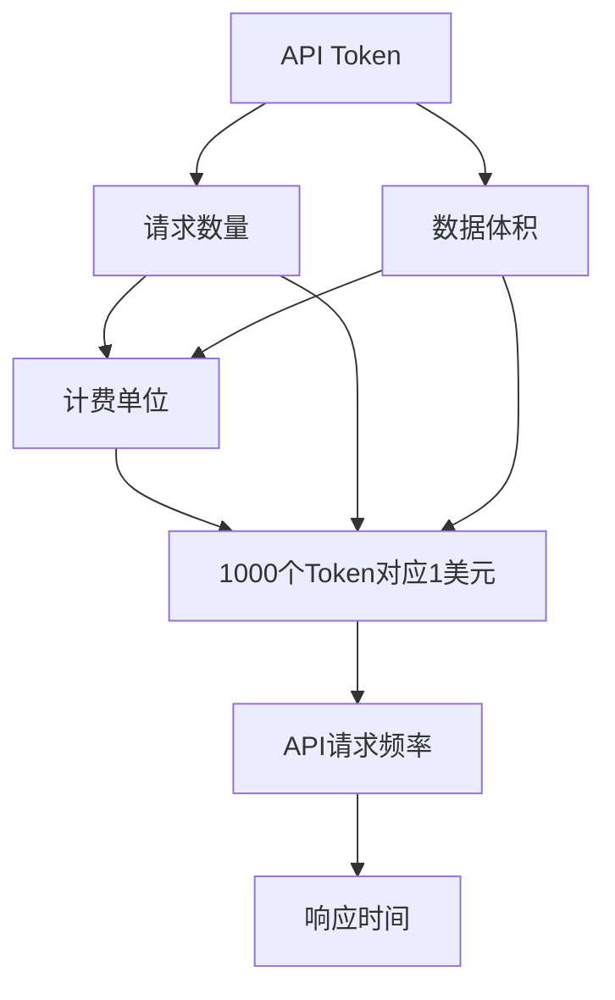
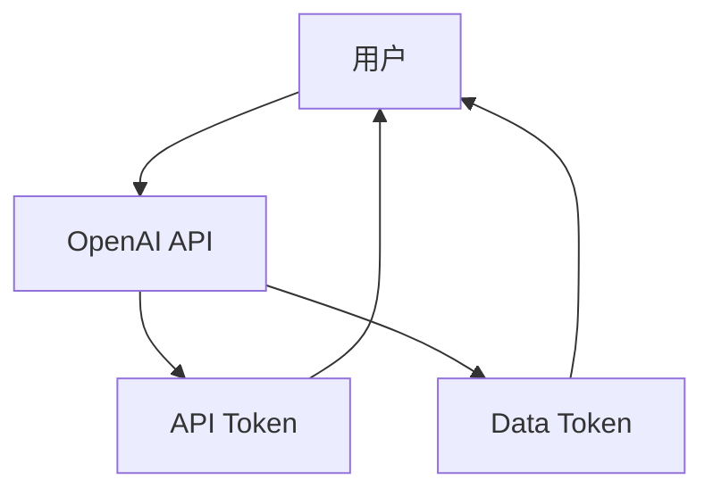
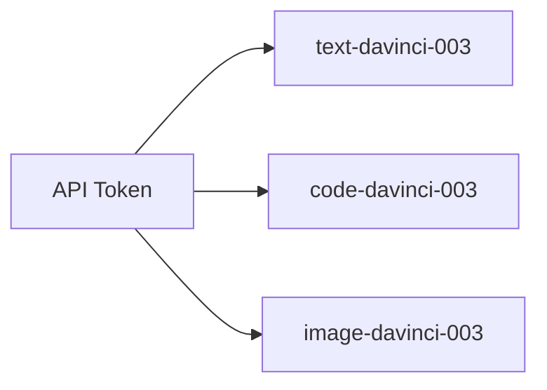
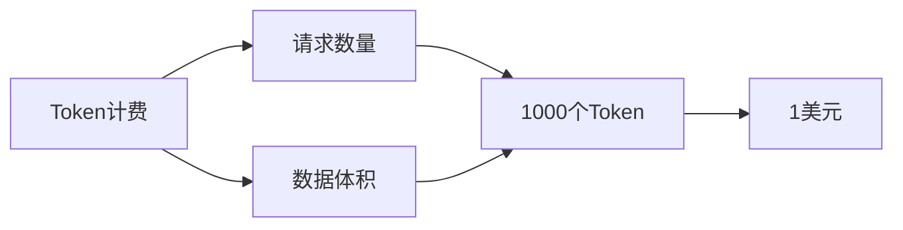

                 

# OpenAI Token 计费与计算

## 1. 背景介绍

### 1.1 问题由来
随着OpenAI的迅速崛起，其产品系列不断丰富，覆盖了从聊天机器人、代码生成、图像生成到各类高阶API等。在使用OpenAI产品进行深度交互时，OpenAI Token的计费机制始终是用户关注的重点。了解Token的计费与计算原理，对于优化计算资源配置、提升用户体验具有重要意义。

### 1.2 问题核心关键点
OpenAI的计费方式直接影响到用户对产品性能、性价比的认知。OpenAI的Token计费机制不仅反映了产品使用频率、资源消耗量，还影响着用户成本的控制和实际计算效率的优化。理解其计费原理和应用细节，有助于用户更好地管理和使用资源。

### 1.3 问题研究意义
1. 了解Token的计费机制，可以帮助用户合理预估使用成本，科学配置计算资源。
2. 揭示计算原理，有助于用户挖掘潜在的性能提升空间，优化资源利用效率。
3. 熟悉实际应用场景，有助于用户准确把握不同场景下的资源消耗情况，减少不必要的费用支出。

## 2. 核心概念与联系

### 2.1 核心概念概述

- **OpenAI Token**：OpenAI API提供的一种流量计量单位，用来衡量用户使用API的频率和资源消耗量。Token基于API请求的数量和大小进行计费，分为API Token和Data Token两种类型。
- **API Token**：用于追踪API请求的数量和数据大小。API Token根据请求数量和数据体积计算使用费用。
- **Data Token**：用于追踪API请求返回的数据体积。Data Token的计费基于返回的数据量，而非请求量。
- **计费单位**：OpenAI的计费基于使用过的Token数量，1000个Token对应1美元。
- **API类型**：OpenAI API包括文本生成、代码生成、图像生成等各类功能，不同API类型使用的Token计算方式略有不同。

为更好地理解OpenAI Token的计费与计算机制，本节将介绍几个密切相关的核心概念：

- **API请求频率**：指单位时间内发送给OpenAI服务器的API请求次数。
- **数据体积**：指API请求和返回的数据占用的字节数。
- **响应时间**：指API请求从发送到接收到响应的时间延迟。

这些概念之间的关系可以通过以下Mermaid流程图来展示：



这个流程图展示了Token与API请求数量、数据体积、API类型之间的逻辑关系。通过理解这些概念，我们可以更好地掌握OpenAI Token的计费与计算机制。

### 2.2 概念间的关系

这些核心概念之间存在着紧密的联系，形成了OpenAI Token计费与计算的完整生态系统。下面我们通过几个Mermaid流程图来展示这些概念之间的关系。

#### 2.2.1 OpenAI Token的使用流程



这个流程图展示了OpenAI Token的使用流程：
1. 用户使用OpenAI API，产生API Token。
2. 用户接收API返回的数据，产生Data Token。
3. Token数量作为计费依据，1000个Token对应1美元。

#### 2.2.2 不同类型的API Token



这个流程图展示了OpenAI的不同类型API Token的分配方式。不同类型的API Token对应不同类型的API使用情况。

#### 2.2.3 Token的计费和计算



这个流程图展示了Token计费和计算的基本原理。Token的计费基于请求数量和数据体积，计算单位为1000个Token对应1美元。

## 3. 核心算法原理 & 具体操作步骤

### 3.1 算法原理概述

OpenAI Token的计费与计算基于API请求数量和数据体积，采用多种收费标准和机制。具体来说，用户在使用OpenAI API时，会产生API请求和返回的数据，这些请求和数据都会被记录为Token，并根据Token数量进行计费。

- **API Token**：按照请求数量和数据体积进行计费，1000个Token对应1美元。
- **Data Token**：按照返回的数据体积进行计费，1000个Byte对应1个Token。

### 3.2 算法步骤详解

**步骤1: 获取API Token**
用户在使用OpenAI API时，需要首先申请一个API Token。API Token可用于追踪API请求的数量和数据体积，根据这些信息进行后续的计费。

**步骤2: 生成API请求和返回数据**
用户在API服务器发送请求并接收响应，产生API请求和返回的数据。API请求和数据都会被记录为Token，并根据Token数量进行计费。

**步骤3: 记录Token数量**
OpenAI API服务器根据API请求和返回的数据，自动生成Token。用户可以随时通过OpenAI的管理界面查看已使用的Token数量，并根据数量预估费用。

**步骤4: 计算费用**
根据使用的Token数量，OpenAI按1000个Token对应1美元的费率进行计费。用户可以基于此费率计算总费用，并合理安排计算资源的使用。

### 3.3 算法优缺点

OpenAI Token的计费与计算机制具有以下优点：
1. **透明公开**：Token数量和费率公开透明，便于用户理解和预估费用。
2. **按需计费**：根据实际使用情况计费，避免了固定月租的浪费。
3. **灵活配置**：用户可以根据自己的需求，灵活调整计算资源的使用量，降低成本。

同时，该机制也存在一些缺点：
1. **精度有限**：由于Token数量的统计是基于请求和数据体积的估算，精度可能存在一定误差。
2. **难以控制**：用户无法精确控制每个API的调用频率和数据体积，可能会造成费用超支。
3. **缺乏弹性**：部分高级API的Token消耗量较大，用户需要提前预估并合理配置资源。

### 3.4 算法应用领域

OpenAI Token的计费与计算机制广泛适用于各种NLP、机器学习、图像生成等领域的API应用，如：

- **文本生成**：通过API Token和Data Token计费，支持文本生成、对话、问答等任务。
- **代码生成**：根据代码生成API的使用情况，计算API请求和数据体积。
- **图像生成**：基于图像生成API的使用频率和数据体积，进行Token计费。
- **数据增强**：通过Data Token计费，支持数据增强、特征工程等任务。

除了上述常见应用外，OpenAI Token的计费机制也适用于各类定制化API服务，如金融风控、推荐系统等。

## 4. 数学模型和公式 & 详细讲解 & 举例说明

### 4.1 数学模型构建

OpenAI Token的计费与计算机制可以通过以下数学模型进行建模：

设API请求数量为 $N$，数据体积为 $V$，数据体积收费标准为 $c_v$，API请求收费标准为 $c_n$。令 $n$ 为1000，则有：

$$
Cost = \left\lceil \frac{N}{n} \right\rceil \times c_n + \left\lceil \frac{V}{v} \right\rceil \times c_v
$$

其中，$\lceil x \rceil$ 表示向上取整，确保Token数量的整数值。

### 4.2 公式推导过程

以OpenAI的Text API为例，假设API请求数量为 $N$，返回的数据体积为 $V$。根据OpenAI的收费标准，每个请求计费为0.05美元，每1000字节数据计费为0.01美元。则总费用为：

$$
Cost = \left\lceil \frac{N}{1000} \right\rceil \times 0.05 + \left\lceil \frac{V}{1000} \right\rceil \times 0.01
$$

简化后的公式为：

$$
Cost = \frac{N}{1000} \times 0.05 + \frac{V}{1000} \times 0.01
$$

该公式表明，总费用等于请求数量和数据体积的总和，且每个请求和字节数据都需要向上取整并计费。

### 4.3 案例分析与讲解

假设某用户在一天内使用OpenAI的Text API进行了50个请求，每个请求返回的数据体积为2000字节，则总费用为：

$$
Cost = \frac{50}{1000} \times 0.05 + \frac{2000 \times 50}{1000} \times 0.01 = 0.25 + 10 = 10.25\text{美元}
$$

这个案例展示了Token计费的基本计算过程，根据请求数量和数据体积，准确计算出总费用。

## 5. 项目实践：代码实例和详细解释说明

### 5.1 开发环境搭建

在进行OpenAI Token计费与计算的实践前，需要先准备好开发环境。以下是使用Python进行OpenAI API开发的环境配置流程：

1. 安装OpenAI Python SDK：
```bash
pip install openai
```

2. 创建并激活虚拟环境：
```bash
conda create -n openai python=3.8
conda activate openai
```

3. 安装相关依赖：
```bash
pip install requests beautifulsoup4
```

完成上述步骤后，即可在`openai`环境中开始实践。

### 5.2 源代码详细实现

下面我们以代码生成任务为例，给出使用OpenAI Python SDK进行Text API调用的代码实现。

```python
import openai

openai.api_key = 'YOUR_API_KEY'

def generate_text(prompt, max_tokens):
    response = openai.Completion.create(
        engine="text-davinci-003",
        prompt=prompt,
        max_tokens=max_tokens,
        temperature=0.7,
        n=1
    )
    return response.choices[0].text

prompt = "Please generate a Python function for calculating area of a rectangle."
max_tokens = 50
result = generate_text(prompt, max_tokens)
print(result)
```

### 5.3 代码解读与分析

让我们再详细解读一下关键代码的实现细节：

**openai API调用**：
- 首先，导入OpenAI Python SDK。
- 使用`openai.api_key`设置API密钥，确保API请求有效。
- 通过`openai.Completion.create`方法，调用Text API进行文本生成。
- 方法参数包括`engine`指定使用的模型，`prompt`定义输入提示，`max_tokens`指定生成的Token数量，`temperature`指定生成过程中的温度参数，`n`指定生成的选择数量。
- 最终返回生成结果的文本部分。

**结果输出**：
- 生成的代码输出打印到控制台，供用户使用。

### 5.4 运行结果展示

假设调用上述代码后，生成的Python函数代码如下：

```python
def calculate_area(length, width):
    return length * width
```

此代码展示了通过OpenAI API调用，成功生成并获取了一个计算矩形面积的Python函数，实际计算过程与Token计费无关，但实际调用API时会记录Token数量。

## 6. 实际应用场景

### 6.1 智能客服系统

在智能客服系统中，OpenAI Token的计费与计算机制有助于实时监控API使用情况，合理配置计算资源。系统根据客服请求的频率和数据体积，动态调整API调用量，以确保系统响应时间和计算效率。

### 6.2 个性化推荐系统

在个性化推荐系统中，OpenAI Token的计费机制用于记录推荐算法调用次数和返回数据体积，合理控制计算资源的消耗。根据推荐系统使用的频率和返回的数据量，合理配置API调用频率，避免过高的计算成本。

### 6.3 内容生成平台

内容生成平台如GPT-3、DALL·E等，均采用Token计费机制，用户可以根据实际使用情况，灵活调整API调用次数和数据体积，合理控制成本。

### 6.4 未来应用展望

随着OpenAI技术的不断进步，Token计费机制也将变得更加灵活和精细。未来可能引入更精确的流量计费方法，如基于事件计数、数据分布等更细粒度的计费方式，进一步提升用户体验和系统效率。

## 7. 工具和资源推荐

### 7.1 学习资源推荐

为了帮助开发者深入理解OpenAI Token的计费与计算机制，这里推荐一些优质的学习资源：

1. **OpenAI官方文档**：OpenAI的官方文档，详细介绍了API调用方式、计费机制、流量统计等功能。
2. **OpenAI开发者社区**：OpenAI的开发者社区，提供了丰富的开发资源、案例分析和技术讨论。
3. **NLP书籍**：如《深度学习自然语言处理》等，介绍了NLP技术的基本原理和OpenAI产品的使用方法。
4. **技术博客**：如OpenAI官方博客、DeepMind博客等，分享了最新的研究进展和技术洞见。

通过这些资源的学习，相信你能够更好地掌握OpenAI Token的计费与计算机制，并用于实际的应用开发。

### 7.2 开发工具推荐

OpenAI Token的计费与计算机制涉及API调用、流量统计等功能，以下是几款用于OpenAI开发的常用工具：

1. **Jupyter Notebook**：用于编写、运行和分享Python代码，是数据分析和科学计算的理想选择。
2. **GitHub**：用于版本控制和代码托管，方便团队协作和管理。
3. **Google Colab**：提供免费的GPU资源，支持Jupyter Notebook环境，便于快速开发和测试。
4. **Google BigQuery**：用于大数据处理和分析，可以与OpenAI API结合使用，处理大规模数据。
5. **AWS SageMaker**：提供云上深度学习框架，支持OpenAI API部署和调优。

合理利用这些工具，可以显著提升OpenAI Token的计费与计算开发效率，加速创新迭代的步伐。

### 7.3 相关论文推荐

OpenAI Token的计费与计算机制得益于学界的持续研究。以下是几篇奠基性的相关论文，推荐阅读：

1. **"Multi-Genre Stylization of Text, Art, and Music"**：介绍了OpenAI生成的多风格文本、艺术和音乐的技术原理，展示了其多样性和创造力。
2. **"Language Models are Unsupervised Multitask Learners"**：展示了语言模型的多任务学习能力，验证了其在高阶任务中的表现。
3. **"Generative Adversarial Nets"**：介绍了生成对抗网络（GAN）的基本原理和应用，展示了其生成高质量数据的潜力。
4. **"On Unsupervised Text Generation and Its Application to Characteristics of Stories"**：展示了无监督文本生成技术的应用场景，特别是在故事特性分析中的效果。

通过对这些前沿成果的学习，可以帮助研究者更好地理解OpenAI Token的计费与计算机制，激发更多的创新灵感。

除上述资源外，还有一些值得关注的前沿资源，帮助开发者紧跟OpenAI Token计费与计算技术的最新进展，例如：

1. **arXiv论文预印本**：人工智能领域最新研究成果的发布平台，包括大量尚未发表的前沿工作，学习前沿技术的必读资源。
2. **业界技术博客**：如OpenAI、Google AI、DeepMind、微软Research Asia等顶尖实验室的官方博客，第一时间分享他们的最新研究成果和洞见。
3. **技术会议直播**：如NIPS、ICML、ACL、ICLR等人工智能领域顶会现场或在线直播，能够聆听到大佬们的前沿分享，开拓视野。
4. **GitHub热门项目**：在GitHub上Star、Fork数最多的OpenAI相关项目，往往代表了该技术领域的发展趋势和最佳实践，值得去学习和贡献。
5. **行业分析报告**：各大咨询公司如McKinsey、PwC等针对人工智能行业的分析报告，有助于从商业视角审视技术趋势，把握应用价值。

总之，对于OpenAI Token的计费与计算技术的学习和实践，需要开发者保持开放的心态和持续学习的意愿。多关注前沿资讯，多动手实践，多思考总结，必将收获满满的成长收益。

## 8. 总结：未来发展趋势与挑战

### 8.1 总结

本文对OpenAI Token的计费与计算机制进行了全面系统的介绍。首先阐述了Token的计费与计算的基本原理和应用场景，明确了API请求和数据体积对计费的影响。其次，通过数学模型和公式推导，进一步深化了对Token计费机制的理解。最后，通过代码实例和实际应用场景分析，展示了Token计费与计算的具体实践过程。

通过本文的系统梳理，可以看到，OpenAI Token的计费与计算机制在实际应用中具有广泛的应用价值，能够有效控制和优化计算资源的配置。理解这一机制，对于科学配置计算资源、提升用户体验具有重要意义。

### 8.2 未来发展趋势

展望未来，OpenAI Token的计费与计算机制将呈现以下几个发展趋势：

1. **精度提升**：未来可能引入更精确的流量计费方法，如基于事件计数、数据分布等更细粒度的计费方式，进一步提升用户体验和系统效率。
2. **灵活配置**：用户可以根据自己的需求，灵活调整API调用次数和数据体积，降低成本。
3. **多种计量方式**：除了基于请求数量和数据体积的计费方式，可能引入更多元化的计量方式，如API请求响应时间、数据传输速率等。
4. **多维计费**：将API使用频率、数据体积、系统响应时间等多个维度进行综合计费，更全面地反映计算资源的消耗。

这些趋势凸显了OpenAI Token计费与计算机制的广阔前景。这些方向的探索发展，必将进一步提升OpenAI API的性能和应用范围，为人工智能技术落地应用提供更好的支持。

### 8.3 面临的挑战

尽管OpenAI Token的计费与计算机制已经取得了一定的进展，但在迈向更加智能化、普适化应用的过程中，它仍面临诸多挑战：

1. **精度和实时性**：由于Token数量的统计是基于请求和数据体积的估算，精度可能存在一定误差，且响应时间可能较长。如何提高精度和实时性，成为未来的一个重要研究方向。
2. **资源管理**：用户无法精确控制每个API的调用频率和数据体积，可能会造成费用超支。如何科学配置计算资源，降低超支风险，仍然是一大挑战。
3. **数据安全**：用户的API请求和返回数据涉及敏感信息，如何在计费过程中保护用户隐私，避免数据泄露，也是需要重点考虑的问题。

### 8.4 研究展望

面对OpenAI Token计费与计算所面临的挑战，未来的研究需要在以下几个方面寻求新的突破：

1. **引入机器学习技术**：利用机器学习算法，对API请求和返回数据进行分析和预测，提高计费的精度和实时性。
2. **优化API架构**：通过API架构的优化，减少响应时间和资源消耗，提高API的响应速度和可靠性。
3. **引入多维度计量方式**：除了基于请求数量和数据体积的计费方式，引入更多元化的计量方式，如API请求响应时间、数据传输速率等，全面反映计算资源的消耗。
4. **引入数据隐私保护机制**：在计费过程中，引入数据加密、匿名化等措施，保护用户隐私，避免数据泄露。

这些研究方向的探索，必将引领OpenAI Token计费与计算技术迈向更高的台阶，为构建更安全、可靠、高效的智能系统铺平道路。面向未来，OpenAI Token计费与计算技术还需要与其他人工智能技术进行更深入的融合，如知识表示、因果推理、强化学习等，多路径协同发力，共同推动人工智能技术的发展。只有勇于创新、敢于突破，才能不断拓展语言模型的边界，让智能技术更好地造福人类社会。

## 9. 附录：常见问题与解答

**Q1：如何降低OpenAI Token的使用成本？**

A: 降低OpenAI Token的使用成本，可以从以下几个方面入手：
1. 合理配置API调用频率，避免无谓的请求和数据传输。
2. 科学管理计算资源，使用更高效的算法和模型，减少资源消耗。
3. 利用缓存和预处理技术，减少API请求的频率和数据体积。
4. 关注API使用细节，避免不必要的请求和数据传输，减少资源浪费。

**Q2：OpenAI Token的计费单位是什么？**

A: OpenAI Token的计费单位是1000个Token对应1美元。这意味着，用户使用过的Token数量将直接决定总费用。

**Q3：OpenAI的API请求频率如何控制？**

A: 用户可以通过调整API请求的频率和数据体积来控制使用成本。例如，减少请求数量、优化数据传输效率等，可以有效控制资源消耗。

**Q4：如何提升OpenAI Token计费的精度和实时性？**

A: 提升Token计费的精度和实时性，可以考虑引入机器学习算法，对API请求和返回数据进行分析和预测，提高计费的精度和实时性。

**Q5：OpenAI的API响应时间如何计算？**

A: OpenAI的API响应时间是指从请求发送到接收到响应的时间延迟。API响应时间可以通过网络监测工具进行测量和优化。

总之，对于OpenAI Token的计费与计算技术的学习和实践，需要开发者保持开放的心态和持续学习的意愿。多关注前沿资讯，多动手实践，多思考总结，必将收获满满的成长收益。

---

作者：禅与计算机程序设计艺术 / Zen and the Art of Computer Programming

