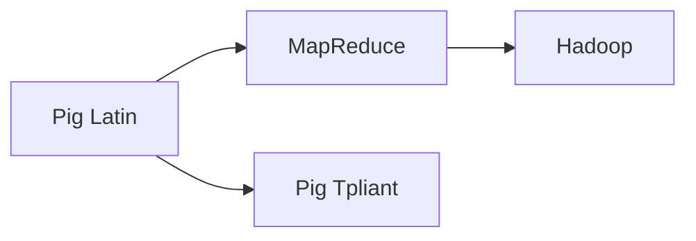
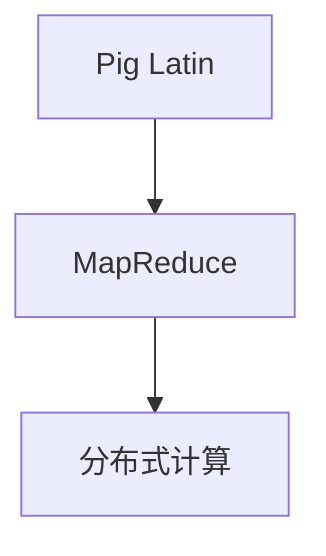
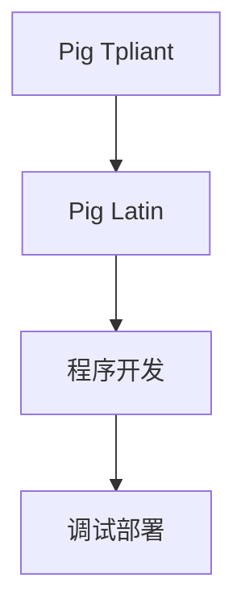
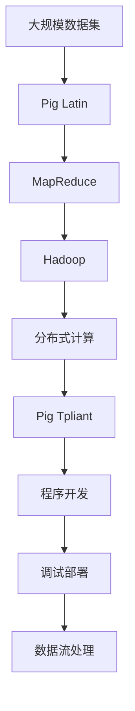

                 

## 1. 背景介绍

### 1.1 问题由来
在现代社会，随着互联网技术的快速发展，数据处理和分析变得越来越重要。然而，处理大规模数据集需要高效、可扩展的数据处理框架。Pig作为一种数据流处理框架，被广泛应用于大数据处理中。

### 1.2 问题核心关键点
Pig的核心在于其数据流语言Pig Latin，使用一种类似SQL的语法，用于定义数据流处理过程。其数据流模型和语言特性使得Pig能够处理大规模数据集，支持并行计算和分布式计算。

### 1.3 问题研究意义
研究Pig，不仅可以帮助我们理解大数据处理框架的基本原理，还可以帮助我们在实际工作中更好地应用Pig，提高数据处理效率和质量。

## 2. 核心概念与联系

### 2.1 核心概念概述

为更好地理解Pig的工作原理和应用，本节将介绍几个密切相关的核心概念：

- Pig Latin：Pig的数据流语言，使用类SQL语法，用于描述数据流处理过程。
- Pig Tpliant：Pig的API和开发环境，用于编写、调试和部署Pig Latin程序。
- MapReduce：一种分布式计算模型，是Pig数据流模型的基础。
- Hadoop：Pig的底层运行平台，支持分布式计算和数据存储。

这些核心概念之间的逻辑关系可以通过以下Mermaid流程图来展示：



这个流程图展示了Pig中几个核心概念之间的关系：

1. Pig Latin作为Pig的数据流语言，通过类SQL语法描述数据流处理过程。
2. Pig Tpliant提供API和开发环境，用于编写、调试和部署Pig Latin程序。
3. MapReduce作为Pig数据流模型的基础，用于描述数据流的并行处理。
4. Hadoop作为Pig的底层运行平台，支持分布式计算和数据存储。

通过这些核心概念的整合，Pig能够高效地处理大规模数据集，提供强大的数据流处理能力。

### 2.2 概念间的关系

这些核心概念之间存在着紧密的联系，形成了Pig的数据流处理系统。下面我们通过几个Mermaid流程图来展示这些概念之间的关系。

#### 2.2.1 Pig Latin与MapReduce的关系



这个流程图展示了Pig Latin与MapReduce的关系：

1. Pig Latin通过类SQL语法描述数据流处理过程。
2. MapReduce作为Pig数据流模型的基础，将Pig Latin程序转换为分布式计算任务。
3. 分布式计算任务在Hadoop集群上执行，实现并行计算。

#### 2.2.2 Pig Tpliant与Pig Latin的关系



这个流程图展示了Pig Tpliant与Pig Latin的关系：

1. Pig Tpliant提供API和开发环境，用于编写、调试和部署Pig Latin程序。
2. Pig Latin程序在Pig Tpliant中编写、调试和优化。
3. 优化后的Pig Latin程序在Hadoop集群上执行，实现数据流处理。

### 2.3 核心概念的整体架构

最后，我们用一个综合的流程图来展示这些核心概念在Pig中的整体架构：



这个综合流程图展示了Pig的数据流处理过程：

1. 大规模数据集进入Pig Latin语言描述的数据流处理过程。
2. 数据流通过MapReduce转换为分布式计算任务。
3. 分布式计算任务在Hadoop集群上执行，实现并行计算。
4. Pig Tpliant提供API和开发环境，用于编写、调试和部署Pig Latin程序。
5. 优化后的Pig Latin程序在Hadoop集群上执行，实现数据流处理。

通过这些流程图，我们可以更清晰地理解Pig的工作原理和应用过程。

## 3. 核心算法原理 & 具体操作步骤
### 3.1 算法原理概述

Pig Latin的核心算法原理主要基于MapReduce框架，结合Pig Latin的数据流语言特性，实现高效的大数据处理。其基本流程包括：

1. 定义数据流：使用Pig Latin语法描述数据流处理过程。
2. 转换数据流：将Pig Latin程序转换为MapReduce任务。
3. 并行计算：在Hadoop集群上执行MapReduce任务，实现分布式计算。

### 3.2 算法步骤详解

基于MapReduce的Pig Latin程序一般包括以下关键步骤：

**Step 1: 定义数据流**

首先，需要定义数据流的输入和输出，使用Pig Latin语法描述数据流的处理过程。

```pig
-- 输入数据流
input = LOAD 'input_file.txt' USING PigStorage(',') AS (id:int, name:string);

-- 输出数据流
OUTPUT output = STORE input INTO 'output_file.txt' USING PigStorage(',');
```

这段Pig Latin代码定义了一个简单的数据流，从输入文件加载数据，然后输出到指定文件。

**Step 2: 转换数据流**

接着，需要将Pig Latin程序转换为MapReduce任务。可以使用Pig Tpliant提供的`pig -x mapreduce`命令来实现。

```bash
pig -x mapreduce input.pig
```

该命令将Pig Latin程序`input.pig`转换为MapReduce任务，并执行。

**Step 3: 并行计算**

在Hadoop集群上执行MapReduce任务，实现分布式计算。可以使用Hadoop提供的命令`hadoop jar`来提交MapReduce任务。

```bash
hadoop jar pig_input.jar pig_input
```

该命令将MapReduce任务`pig_input.jar`提交到Hadoop集群上执行。

### 3.3 算法优缺点

Pig Latin作为Pig的核心算法，具有以下优点：

1. 高效处理大规模数据集：Pig Latin通过MapReduce实现分布式计算，能够高效处理大规模数据集。
2. 易于使用：Pig Latin使用类SQL语法，易于理解和使用。
3. 灵活性强：Pig Latin支持多种数据源和数据格式，能够适应不同的数据处理场景。

同时，Pig Latin也存在一些缺点：

1. 性能开销较大：Pig Latin需要转换为MapReduce任务，增加了一些性能开销。
2. 数据模型较为简单：Pig Latin主要用于数据流处理，不支持复杂的数据建模和分析。
3. 资源占用较多：Pig Latin需要占用大量计算资源和存储资源，适合大规模数据处理。

### 3.4 算法应用领域

Pig Latin作为Pig的核心算法，已经广泛应用于各种大数据处理场景，例如：

- 数据清洗：从日志、网页、文本等数据源中清洗数据，去除噪音和错误。
- 数据聚合：对大规模数据进行聚合、汇总、统计，生成数据报表。
- 数据挖掘：对数据进行挖掘、分析和建模，发现数据中的规律和趋势。
- 数据可视化：将数据可视化展示，帮助决策者更好地理解数据。

除了这些经典应用外，Pig Latin还被创新性地应用到更多场景中，如数据流处理、实时计算、大数据分析等，为大数据技术的发展提供了重要的支持。

## 4. 数学模型和公式 & 详细讲解
### 4.1 数学模型构建

Pig Latin的数据流模型可以简单地使用数学模型来描述。设输入数据流为 $x_i$，输出数据流为 $y_i$，则Pig Latin的数据流模型可以表示为：

$$
y_i = f(x_i)
$$

其中 $f$ 为数据流处理函数，可以是简单的映射、过滤、聚合等操作。

### 4.2 公式推导过程

下面以数据聚合为例，推导Pig Latin的数据流模型。假设输入数据流为：

$$
x_i = (x_i^1, x_i^2, \ldots, x_i^n)
$$

输出数据流为：

$$
y_i = (y_i^1, y_i^2, \ldots, y_i^m)
$$

则数据聚合的数据流模型可以表示为：

$$
y_i^j = g_j(x_i)
$$

其中 $g_j$ 为聚合函数，可以是求和、平均值、最大值、最小值等操作。

### 4.3 案例分析与讲解

下面以一个简单的案例来说明Pig Latin的数据流模型。假设有一个文本文件，每行记录为一个ID和一个值，需要计算每个ID的总值。可以使用Pig Latin程序如下：

```pig
input = LOAD 'input_file.txt' USING PigStorage(',') AS (id:int, value:int);
group = GROUP input BY id;
sum = FOREACH group GENERATE group.id, SUM(group.value) AS sum_value;
OUTPUT output = STORE sum INTO 'output_file.txt' USING PigStorage(',');
```

该程序首先加载输入文件，然后按照ID分组，对每个组的值进行求和，最后输出结果到指定文件。

## 5. 项目实践：代码实例和详细解释说明
### 5.1 开发环境搭建

在进行Pig Latin编程之前，我们需要准备好开发环境。以下是使用Linux搭建Pig环境的步骤：

1. 安装JDK：从Oracle官网下载JDK，并解压安装。

2. 安装Pig：从Pig官网下载最新版本的Pig，并解压安装。

3. 设置环境变量：将Pig的安装目录和类路径添加到环境变量中，以便在命令行中使用。

```bash
export PIG_HOME=/path/to/pig
export PATH=$PATH:$PIG_HOME/bin
export CLASSPATH=$PIG_HOME/conf:$PIG_HOME/lib:$CLASSPATH
```

4. 启动Pig服务：在命令行中使用`pig`命令启动Pig服务。

```bash
pig
```

### 5.2 源代码详细实现

下面以一个简单的案例来说明Pig Latin编程。假设有一个文本文件，每行记录为一个ID和一个值，需要计算每个ID的总值。可以使用Pig Latin程序如下：

```pig
input = LOAD 'input_file.txt' USING PigStorage(',') AS (id:int, value:int);
group = GROUP input BY id;
sum = FOREACH group GENERATE group.id, SUM(group.value) AS sum_value;
OUTPUT output = STORE sum INTO 'output_file.txt' USING PigStorage(',');
```

该程序首先加载输入文件，然后按照ID分组，对每个组的值进行求和，最后输出结果到指定文件。

**代码解释：**

- `input`：定义输入数据流，从文件中加载数据。
- `GROUP`：对输入数据流按照ID进行分组。
- `FOREACH`：对每个分组进行聚合操作，计算总值。
- `OUTPUT`：将聚合结果输出到指定文件。

### 5.3 代码解读与分析

让我们再详细解读一下关键代码的实现细节：

**input定义：**

```pig
input = LOAD 'input_file.txt' USING PigStorage(',') AS (id:int, value:int);
```

- `LOAD`：从文件中加载数据。
- `USING PigStorage(',')`：使用逗号作为数据分隔符。
- `AS (id:int, value:int)`：将每行数据解析为ID和值两个字段。

**GROUP操作：**

```pig
group = GROUP input BY id;
```

- `GROUP`：按照ID进行分组。
- `BY id`：按照ID字段进行分组。

**FOREACH操作：**

```pig
sum = FOREACH group GENERATE group.id, SUM(group.value) AS sum_value;
```

- `FOREACH`：对每个分组进行操作。
- `GENERATE group.id, SUM(group.value) AS sum_value`：对每个分组生成ID和总值。

**OUTPUT操作：**

```pig
OUTPUT output = STORE sum INTO 'output_file.txt' USING PigStorage(',');
```

- `OUTPUT`：将聚合结果输出到指定文件。
- `STORE sum INTO 'output_file.txt'`：将聚合结果存储到指定文件中。
- `USING PigStorage(',' )`：使用逗号作为数据分隔符。

### 5.4 运行结果展示

假设我们在文本文件`input_file.txt`中输入如下数据：

```
1,10
2,20
3,30
1,40
2,50
3,60
```

执行上述Pig Latin程序后，输出文件`output_file.txt`的内容为：

```
1,50
2,70
3,90
```

可以看到，程序成功计算了每个ID的总值，并输出到指定文件。

## 6. 实际应用场景
### 6.1 智能推荐系统

Pig Latin在大数据处理中的高效性和灵活性，使其广泛应用于智能推荐系统。推荐系统需要处理海量用户行为数据，快速生成个性化的推荐结果。

在实际应用中，可以使用Pig Latin程序对用户行为数据进行清洗、聚合、分析和建模，生成推荐结果。具体而言，可以从日志文件、用户点击记录、浏览记录等数据源中加载数据，使用Pig Latin程序进行数据预处理，然后生成推荐结果。

### 6.2 大数据分析

Pig Latin在大数据分析中也有广泛应用。大数据分析需要处理海量数据，生成各种数据报表和分析结果。

在实际应用中，可以使用Pig Latin程序对大数据集进行清洗、聚合、统计、可视化等操作，生成各种数据报表和分析结果。具体而言，可以从各种数据源（如日志、网页、社交媒体等）中加载数据，使用Pig Latin程序进行数据预处理，然后生成各种数据报表和分析结果。

### 6.3 实时计算

Pig Latin还支持实时计算，可以用于处理流数据和实时数据。

在实际应用中，可以使用Pig Latin程序对实时数据进行清洗、聚合、统计、可视化等操作，生成实时数据报表和分析结果。具体而言，可以从实时数据源（如传感器、日志等）中加载数据，使用Pig Latin程序进行实时处理，然后生成实时数据报表和分析结果。

### 6.4 未来应用展望

随着Pig Latin和大数据处理技术的不断演进，未来Pig Latin将会在更多领域得到应用，为大数据技术的发展带来新的突破。

在智慧医疗领域，Pig Latin可以用于医疗数据的清洗、聚合、分析和建模，辅助医生进行疾病诊断和治疗。

在智能教育领域，Pig Latin可以用于教育数据的清洗、聚合、分析和建模，提升教学质量和效率。

在智慧城市治理中，Pig Latin可以用于城市数据的清洗、聚合、分析和建模，提高城市管理的智能化水平。

此外，在企业生产、社会治理、文娱传媒等众多领域，Pig Latin的应用也将不断涌现，为大数据技术的发展带来新的机遇。

## 7. 工具和资源推荐
### 7.1 学习资源推荐

为了帮助开发者系统掌握Pig Latin的理论基础和实践技巧，这里推荐一些优质的学习资源：

1. Pig官方文档：Pig的官方文档提供了完整的Pig Latin语法和API，是学习Pig Latin的重要参考。

2. Hadoop官方文档：Pig的底层运行平台Hadoop的官方文档，提供了丰富的Pig Latin程序示例，有助于理解Pig Latin的使用。

3. Pig Tpliant官方文档：Pig的开发环境Pig Tpliant的官方文档，提供了详细的Pig Latin程序开发指南和最佳实践。

4. Pig Latin教程：通过在线教程学习Pig Latin的基本语法和使用方法。

5. Pig Linux官方博客：Pig的开发者社区，提供最新的Pig Linux版本和Pig Latin程序示例，有助于了解Pig的发展动态。

通过对这些资源的学习实践，相信你一定能够快速掌握Pig Latin的精髓，并用于解决实际的Pig开发问题。

### 7.2 开发工具推荐

高效的开发离不开优秀的工具支持。以下是几款用于Pig Latin编程的常用工具：

1. Pig：Pig的官方开发环境，提供了丰富的Pig Latin程序开发工具和调试工具。

2. Hadoop：Pig的底层运行平台，支持分布式计算和数据存储。

3. Hive：Pig的合作伙伴，提供数据仓库解决方案，支持SQL查询和Pig Latin编程。

4. Zeppelin：数据可视化工具，支持Pig Latin程序的可视化展示，便于调试和分析。

5. Jupyter Notebook：交互式编程工具，支持Pig Latin程序的在线调试和运行。

合理利用这些工具，可以显著提升Pig Latin编程的开发效率，加快创新迭代的步伐。

### 7.3 相关论文推荐

Pig Latin和大数据处理技术的发展源于学界的持续研究。以下是几篇奠基性的相关论文，推荐阅读：

1. Pig Latin：A Data-Flow Language for Processing Large Datasets：Pig的创始人提出Pig Latin，阐述了Pig Latin的语法和应用。

2. Apache Pig: A Platform for Big Data Processing：Pig的开发团队介绍Pig的架构和实现，阐述了Pig的开发过程和应用场景。

3. Large-Scale Parallel Data Analysis with Pig Latin：Pig的创始人介绍Pig Latin在MapReduce框架下的实现，阐述了Pig Latin的并行计算特性。

4. Apache Pig: A Data-Flow System for Generating Analytical Metadata for Big Data：Pig的开发团队介绍Pig的元数据生成功能，阐述了Pig的高级应用。

5. Large-Scale Parallel Data Analysis with Pig Latin：Pig的创始人介绍Pig Latin在MapReduce框架下的实现，阐述了Pig Latin的并行计算特性。

这些论文代表了大数据处理技术的发展脉络。通过学习这些前沿成果，可以帮助研究者把握学科前进方向，激发更多的创新灵感。

除上述资源外，还有一些值得关注的前沿资源，帮助开发者紧跟Pig和Big Data技术的发展，例如：

1. arXiv论文预印本：人工智能领域最新研究成果的发布平台，包括大量尚未发表的前沿工作，学习前沿技术的必读资源。

2. 业界技术博客：如Apache Pig、Apache Hadoop、Apache Spark等顶尖实验室的官方博客，第一时间分享他们的最新研究成果和洞见。

3. 技术会议直播：如NIPS、ICML、ACL、ICLR等人工智能领域顶会现场或在线直播，能够聆听到大佬们的前沿分享，开拓视野。

4. GitHub热门项目：在GitHub上Star、Fork数最多的Pig相关项目，往往代表了该技术领域的发展趋势和最佳实践，值得去学习和贡献。

5. 行业分析报告：各大咨询公司如McKinsey、PwC等针对大数据行业的分析报告，有助于从商业视角审视技术趋势，把握应用价值。

总之，对于Pig Latin和大数据处理技术的学习和实践，需要开发者保持开放的心态和持续学习的意愿。多关注前沿资讯，多动手实践，多思考总结，必将收获满满的成长收益。

## 8. 总结：未来发展趋势与挑战
### 8.1 总结

本文对Pig Latin的原理与代码实例进行了全面系统的介绍。首先阐述了Pig Latin的基本原理和应用场景，明确了Pig Latin在大数据处理中的独特价值。其次，从原理到实践，详细讲解了Pig Latin的数学模型和关键步骤，给出了Pig Latin程序开发的完整代码实例。同时，本文还广泛探讨了Pig Latin在智能推荐系统、大数据分析、实时计算等多个行业领域的应用前景，展示了Pig Latin的巨大潜力。此外，本文精选了Pig Latin的学习资源，力求为读者提供全方位的技术指引。

通过本文的系统梳理，可以看到，Pig Latin作为一种高效、灵活的大数据处理技术，已经在诸多应用场景中得到了广泛应用，为大数据处理和分析提供了强有力的支持。未来，伴随Pig Latin和大数据处理技术的不断演进，相信Pig Latin将会在更多领域得到应用，为大数据技术的发展带来新的突破。

### 8.2 未来发展趋势

展望未来，Pig Latin和大数据处理技术将呈现以下几个发展趋势：

1. 并行计算性能提升：随着硬件设备的不断升级，Pig Latin的并行计算性能也将不断提升，支持更大规模的数据处理。

2. 数据流模型扩展：Pig Latin的数据流模型将进一步扩展，支持更多的数据处理和分析功能。

3. 实时处理能力提升：Pig Latin的实时处理能力将不断提升，支持更多的实时数据处理和分析场景。

4. 数据可视化增强：Pig Latin的数据可视化能力将不断增强，支持更多的数据展示和分析。

5. 与大数据生态系统融合：Pig Latin将进一步与Hadoop、Spark、Flink等大数据生态系统进行深度融合，提升数据处理的效率和性能。

以上趋势凸显了Pig Latin和大数据处理技术的广阔前景。这些方向的探索发展，必将进一步提升Pig Latin和大数据处理系统的性能和应用范围，为大数据技术的发展提供新的动力。

### 8.3 面临的挑战

尽管Pig Latin和大数据处理技术已经取得了显著的成就，但在迈向更加智能化、普适化应用的过程中，它仍面临着诸多挑战：

1. 数据处理速度瓶颈：随着数据量的不断增长，Pig Latin的数据处理速度可能面临瓶颈。如何进一步提升数据处理性能，提高数据处理速度，将是重要的研究方向。

2. 数据质量控制：大数据处理中，数据质量控制是一个重要问题。如何提升数据质量，减少数据噪音和错误，将是重要的优化方向。

3. 系统扩展性问题：随着数据量的不断增长，Pig Latin的系统扩展性问题可能变得更加明显。如何设计高效、可扩展的系统架构，提升系统的性能和稳定性，将是重要的研究方向。

4. 资源利用效率：大数据处理中，资源利用效率是一个重要问题。如何设计高效的资源利用方案，减少资源浪费，提升资源利用效率，将是重要的优化方向。

5. 系统安全性问题：大数据处理中，数据安全和隐私保护是一个重要问题。如何设计安全的系统架构，保护数据的隐私和安全，将是重要的研究方向。

正视Pig Latin和大数据处理面临的这些挑战，积极应对并寻求突破，将是大数据处理技术走向成熟的必由之路。相信随着学界和产业界的共同努力，这些挑战终将一一被克服，Pig Latin和大数据处理技术必将在构建人机协同的智能时代中扮演越来越重要的角色。

### 8.4 研究展望

面对Pig Latin和大数据处理所面临的种种挑战，未来的研究需要在以下几个方面寻求新的突破：

1. 探索更多高效的并行计算技术：设计更高效的并行计算算法和架构，提升Pig Latin的并行计算性能。

2. 研究更先进的质量控制技术：设计更先进的数据质量控制算法和工具，提升数据的准确性和完整性。

3. 开发更高效的资源利用方案：设计更高效的资源利用方案，减少资源浪费，提升资源利用效率。

4. 引入更多的数据分析算法：引入更多的数据分析算法和模型，提升Pig Latin的数据分析和建模能力。

5. 加强系统安全性和隐私保护：设计更安全的系统架构和隐私保护方案，保护数据的隐私和安全。

这些研究方向的探索，必将引领Pig Latin和大数据处理技术迈向更高的台阶，为构建安全、可靠、高效、可扩展的大数据处理系统提供新的动力。

## 9. 附录：常见问题与解答
### 9.1 常见问题

**Q1：Pig Latin和SQL有什么区别？**

A: Pig Latin和SQL都是用于数据流处理的语言，但SQL是一种结构化查询语言，适用于关系型数据库，而Pig Latin是一种非结构化数据流处理语言，适用于大数据处理。Pig Latin使用类SQL语法，支持更多的数据处理和分析功能。

**Q2：如何使用Pig Latin进行数据清洗？**

A: 数据清洗可以使用Pig Latin的`FILTER`和`REMOVE`等操作，过滤掉噪声和错误数据。具体而言，可以使用以下Pig Latin程序：

```pig
input = LOAD 'input_file.txt' USING PigStorage(',') AS (id:int, value:int);
clean_input = FILTER input WHERE value >= 0;
STORE clean_input INTO 'output_file.txt' USING PigStorage(',');
```

**Q3：如何使用Pig Latin进行数据聚合？**

A: 数据聚合可以使用Pig Latin的`GROUP BY`和`AGGREGATE`等操作，对数据进行分组和聚合。具体而言，可以使用以下Pig Latin程序：

```pig
input = LOAD 'input_file.txt' USING PigStorage(',') AS (id:int, value:int);
group = GROUP input BY id;
sum = FOREACH group GENERATE group.id, SUM(group.value) AS sum_value;
OUTPUT output = STORE sum INTO 'output_file.txt' USING PigStorage(',');
```

**Q4：如何使用Pig Latin进行数据可视化？**

A: 数据可视化可以使用Pig Latin的`GENERATE`和`STORE`等操作，生成可视化图表和报表。具体而言，可以使用以下Pig Latin程序：

```pig
input = LOAD 'input_file.txt' USING PigStorage(',') AS (id:int, value:int);
group = GROUP input BY id;
sum = FOREACH group GENERATE group.id, SUM(group.value) AS sum_value;
OUTPUT output = STORE sum INTO 'output_file.txt' USING PigStorage(',');
```

**Q5：如何使用Pig Latin进行实时数据处理？**

A: 实时数据处理可以使用Pig Latin的`STORE`和`GENERATE`等操作，将数据流实时存储和可视化。具体而言，可以使用以下Pig Latin程序：

```pig
input = LOAD 'input_file.txt' USING PigStorage(',') AS (id:int, value:int);
group = GROUP input BY id;
sum = FOREACH group GENERATE group.id, SUM(group.value) AS sum_value;
OUTPUT output = STORE sum INTO 'output_file.txt' USING PigStorage(',');
```

---

作者：禅与计算机

