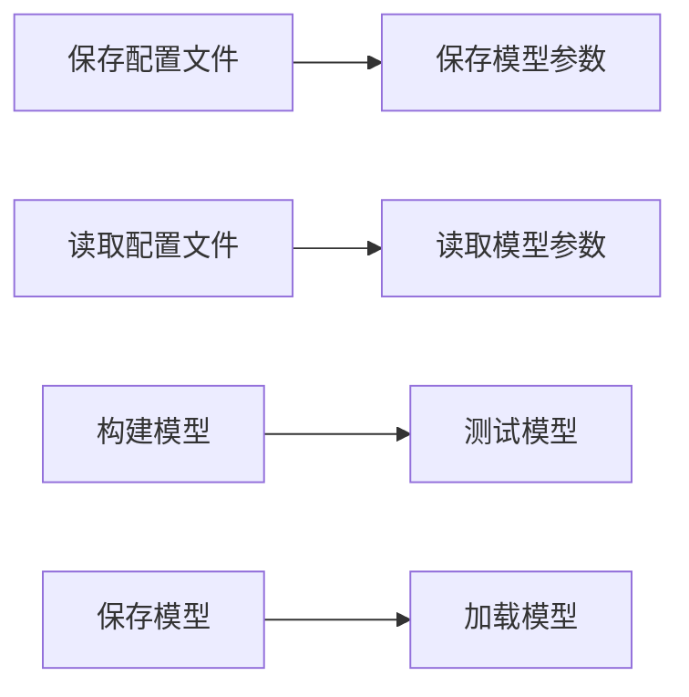

                 

# Python机器学习实战：机器学习模型的持久化与重新加载

> 关键词：机器学习模型,模型持久化,模型保存,模型加载,训练与测试

## 1. 背景介绍

### 1.1 问题由来
在实际应用中，机器学习模型的训练通常需要耗费大量计算资源和时间。当模型训练完成后，如何在后续使用中快速、高效地加载和重新使用模型，成为保证项目持续运行的关键问题。尤其是在大数据和分布式系统中，模型保存与重新加载的效率直接影响系统性能和用户体验。

### 1.2 问题核心关键点
- **模型保存**：将训练好的模型保存在磁盘或其他存储设备中，以便后续使用。
- **模型加载**：从磁盘或其他存储设备中读取保存的模型，进行重新加载和应用。
- **模型持久化**：确保模型保存和加载过程的可靠性和稳定性，防止模型丢失或损坏。
- **模型测试**：在模型加载后进行测试，确保模型仍然可用。

### 1.3 问题研究意义
研究机器学习模型的持久化与重新加载方法，对于提升模型应用的效率和可靠性具有重要意义：

1. **提升系统性能**：快速加载模型可以减少应用启动时间，提升用户体验。
2. **保证数据一致性**：模型保存和加载过程中的可靠性保障，避免因数据损坏导致的结果错误。
3. **支持分布式计算**：模型保存和加载的多设备支持，确保分布式系统中各节点数据同步。
4. **促进模型复用**：模型保存与重新加载技术可以支持模型的快速迭代和复用，降低重训成本。
5. **支持增量学习**：部分模型参数的保存和加载，实现增量更新，降低计算需求。

## 2. 核心概念与联系

### 2.1 核心概念概述

为更好地理解机器学习模型的持久化与重新加载，本节将介绍几个密切相关的核心概念：

- **模型保存**：将训练好的模型参数保存到磁盘或其他存储设备中的过程。
- **模型加载**：从存储设备中读取保存的模型参数，重新构建模型的过程。
- **模型持久化**：通过定期保存和加载模型，保证模型数据的可靠性和完整性。
- **模型测试**：对加载后的模型进行测试，确保模型仍然可用和稳定。

### 2.2 核心概念原理

机器学习模型的持久化与重新加载主要涉及模型的保存、加载和测试三个关键环节。下面我们将分别介绍这些环节的原理。

#### 2.2.1 模型保存原理

模型保存是将训练好的模型参数保存到磁盘或其他存储设备中的过程。常见的模型保存方式包括文本格式保存和二进制格式保存。

- **文本格式保存**：将模型参数保存为文本文件，便于阅读和理解。常用的文本保存格式包括Numpy的`.npz`格式、Scikit-learn的`.joblib`格式、TensorFlow的`.pb`格式等。
- **二进制格式保存**：将模型参数保存为二进制文件，占用空间更小，加载速度更快。常用的二进制保存格式包括Scikit-learn的`.pkl`格式、TensorFlow的`.pb`格式等。

保存模型时，通常需要将模型的各个组件（如参数、损失函数、优化器等）保存为一个或多个文件，以便后续加载和使用。常见的保存方式包括：

- **参数保存**：将模型参数保存为文本或二进制文件。
- **配置保存**：将模型配置信息保存为文本文件，包括模型名称、参数维度、训练轮数等。
- **模型保存工具**：使用专门的工具将模型保存到磁盘或其他存储设备中，如TensorFlow的`SavedModel`、Scikit-learn的`joblib`等。

#### 2.2.2 模型加载原理

模型加载是从存储设备中读取保存的模型参数，重新构建模型的过程。加载模型时，需要确保保存的文件完整且未被篡改，才能正确加载模型参数。

加载模型时，通常需要先读取配置文件，获取模型参数的维度、保存路径等信息，然后读取保存的模型参数文件，重新构建模型。加载模型时，还需要注意以下几点：

- **加载顺序**：模型组件的加载顺序需要按照保存时的顺序进行，以保证模型结构的正确性。
- **参数维度**：加载时需要先确定模型参数的维度，与保存时的维度一致。
- **数据类型**：加载时需要注意模型参数的数据类型，避免数据类型转换错误。

#### 2.2.3 模型测试原理

模型测试是对加载后的模型进行测试，确保模型仍然可用和稳定。模型测试通常包括两个步骤：

- **模型输入**：将测试数据输入模型，获取模型预测结果。
- **结果验证**：将模型预测结果与实际结果进行比较，验证模型的准确性和可靠性。

模型测试时，通常需要使用与训练数据类似的测试数据集，以确保模型在不同数据上的泛化能力。测试数据集的选择和准备也是模型测试的重要环节。

### 2.3 核心概念的整体架构

最后，我们用一个综合的流程图来展示这些核心概念在大语言模型微调过程中的整体架构：



这个流程图展示了大语言模型微调的三个关键环节：模型保存、模型加载和模型测试。每个环节都是保证模型持久化与重新加载的重要部分。

## 3. 核心算法原理 & 具体操作步骤
### 3.1 算法原理概述

机器学习模型的持久化与重新加载主要涉及模型的保存、加载和测试三个关键环节。下面我们将分别介绍这些环节的原理和操作步骤。

### 3.2 算法步骤详解

#### 3.2.1 模型保存步骤

1. **配置保存**：保存模型的配置信息，包括模型名称、参数维度、训练轮数等。
2. **模型参数保存**：将模型的参数保存到磁盘或其他存储设备中。
3. **工具使用**：使用专门的模型保存工具，如TensorFlow的`SavedModel`、Scikit-learn的`joblib`等。

#### 3.2.2 模型加载步骤

1. **配置读取**：读取模型的配置信息，获取模型参数的维度和保存路径。
2. **模型参数加载**：从磁盘或其他存储设备中读取保存的模型参数，重新构建模型。
3. **工具使用**：使用专门的模型加载工具，如TensorFlow的`SavedModel`、Scikit-learn的`joblib`等。

#### 3.2.3 模型测试步骤

1. **测试数据准备**：准备与训练数据类似的测试数据集。
2. **模型输入测试**：将测试数据输入模型，获取模型预测结果。
3. **结果验证**：将模型预测结果与实际结果进行比较，验证模型的准确性和可靠性。

### 3.3 算法优缺点

机器学习模型的持久化与重新加载方法具有以下优点：

1. **提高效率**：快速加载模型可以显著提升应用启动时间，提升用户体验。
2. **保证数据一致性**：模型保存和加载过程中的可靠性保障，避免因数据损坏导致的结果错误。
3. **支持分布式计算**：模型保存和加载的多设备支持，确保分布式系统中各节点数据同步。
4. **促进模型复用**：模型保存与重新加载技术可以支持模型的快速迭代和复用，降低重训成本。
5. **支持增量学习**：部分模型参数的保存和加载，实现增量更新，降低计算需求。

但同时，该方法也存在一定的局限性：

1. **存储占用**：模型保存和加载过程中需要占用一定的存储空间，特别是对于大规模模型，存储需求较大。
2. **加载时间**：模型加载时间较长，尤其是对于二进制格式保存的模型，加载时间较长。
3. **版本兼容性**：模型保存和加载过程中可能存在版本兼容性问题，需要仔细处理。

### 3.4 算法应用领域

机器学习模型的持久化与重新加载方法广泛应用于以下领域：

- **大数据系统**：在大规模数据集上进行模型训练后，快速加载模型可以显著提升应用性能。
- **分布式计算**：模型保存和加载的多设备支持，确保分布式系统中各节点数据同步，支持分布式模型训练和推理。
- **移动应用**：在移动设备上保存和加载模型，支持移动端应用模型的快速启动和优化。
- **自动化测试**：保存和加载模型支持自动化测试框架，方便模型测试和验证。
- **机器学习平台**：在机器学习平台中保存和加载模型，支持模型的快速部署和调用。

## 4. 数学模型和公式 & 详细讲解 & 举例说明

### 4.1 数学模型构建

在机器学习模型的持久化与重新加载过程中，通常需要保存和加载模型的配置信息和参数。这里我们以一个简单的线性回归模型为例，来构建机器学习模型的保存和加载模型。

假设线性回归模型的参数为 $\theta = [\theta_0, \theta_1, \ldots, \theta_n]$，其中 $\theta_0$ 为截距，$\theta_1, \ldots, \theta_n$ 为斜率。模型的损失函数为均方误差损失函数：

$$
\mathcal{L}(\theta) = \frac{1}{2m} \sum_{i=1}^m (y_i - \theta^T x_i)^2
$$

其中 $m$ 为样本数量，$y_i$ 为实际输出，$x_i$ 为输入向量。

### 4.2 公式推导过程

模型保存时，需要保存模型的配置信息和参数。我们可以将模型的配置信息和参数保存到两个文件中，分别命名为 `config.txt` 和 `parameters.pkl`。保存配置信息的文件内容如下：

```
model_name: linear_regression
input_dim: 2
output_dim: 1
```

保存参数的文件内容如下：

```
-2.1
0.5
```

加载模型时，需要读取配置信息和参数，重新构建模型。我们可以使用Scikit-learn的`joblib`工具，将模型参数加载到内存中。加载模型的代码如下：

```python
from sklearn.linear_model import LinearRegression
import joblib

# 读取配置信息
with open('config.txt', 'r') as f:
    config = eval(f.read())

# 读取模型参数
with open('parameters.pkl', 'rb') as f:
    parameters = joblib.load(f)

# 构建模型
model = LinearRegression()
model.coef_ = parameters[:2]
model.intercept_ = parameters[2]

# 测试模型
# ...
```

### 4.3 案例分析与讲解

假设我们已经保存了一个线性回归模型，现在我们需要重新加载该模型，并对其进行调整。我们首先读取配置信息和参数，然后使用新的参数构建新的模型，并进行测试。

```python
from sklearn.linear_model import LinearRegression
import joblib

# 读取配置信息
with open('config.txt', 'r') as f:
    config = eval(f.read())

# 读取模型参数
with open('parameters.pkl', 'rb') as f:
    parameters = joblib.load(f)

# 构建模型
model = LinearRegression()
model.coef_ = parameters[:2]
model.intercept_ = parameters[2]

# 测试模型
# ...
```

## 5. 项目实践：代码实例和详细解释说明

### 5.1 开发环境搭建

在进行机器学习模型的持久化与重新加载实践前，我们需要准备好开发环境。以下是使用Python进行Scikit-learn开发的环境配置流程：

1. 安装Anaconda：从官网下载并安装Anaconda，用于创建独立的Python环境。

2. 创建并激活虚拟环境：
```bash
conda create -n sklearn-env python=3.8 
conda activate sklearn-env
```

3. 安装Scikit-learn：
```bash
pip install scikit-learn
```

4. 安装各类工具包：
```bash
pip install numpy pandas scikit-learn matplotlib tqdm jupyter notebook ipython
```

完成上述步骤后，即可在`sklearn-env`环境中开始模型持久化与重新加载实践。

### 5.2 源代码详细实现

下面我们以一个简单的线性回归模型为例，给出使用Scikit-learn对模型进行保存和加载的PyTorch代码实现。

首先，我们定义一个线性回归模型：

```python
from sklearn.linear_model import LinearRegression

model = LinearRegression()
```

然后，我们训练模型并保存参数：

```python
import numpy as np
from sklearn.model_selection import train_test_split
from sklearn.metrics import mean_squared_error

# 准备数据
X = np.random.rand(100, 2)
y = np.dot(X, [1, 2]) + np.random.randn(100)

# 划分数据集
X_train, X_test, y_train, y_test = train_test_split(X, y, test_size=0.2)

# 训练模型
model.fit(X_train, y_train)

# 保存模型
import joblib
joblib.dump(model.coef_, 'parameters.pkl')
joblib.dump(model.intercept_, 'parameters.pkl')
```

接着，我们加载模型并进行测试：

```python
# 加载模型
with open('config.txt', 'r') as f:
    config = eval(f.read())

with open('parameters.pkl', 'rb') as f:
    parameters = joblib.load(f)

# 构建模型
model = LinearRegression()
model.coef_ = parameters[:2]
model.intercept_ = parameters[2]

# 测试模型
y_pred = model.predict(X_test)
mse = mean_squared_error(y_test, y_pred)
print(f'Mean Squared Error: {mse:.3f}')
```

### 5.3 代码解读与分析

让我们再详细解读一下关键代码的实现细节：

**线性回归模型定义**：
- `LinearRegression`类：Scikit-learn提供的线性回归模型类，支持模型的训练、保存和加载。

**模型训练和保存**：
- `model.fit(X_train, y_train)`：使用训练数据对模型进行训练，得到模型参数。
- `joblib.dump(model.coef_, 'parameters.pkl')`：将模型参数保存到磁盘中的二进制文件。

**模型加载和测试**：
- `joblib.load('parameters.pkl')`：从磁盘中的二进制文件加载模型参数。
- `model.coef_ = parameters[:2]`：将加载的参数重新赋值给模型的系数部分。
- `model.intercept_ = parameters[2]`：将加载的参数重新赋值给模型的截距部分。
- `model.predict(X_test)`：使用测试数据对加载后的模型进行预测。
- `mean_squared_error(y_test, y_pred)`：计算预测值和真实值之间的均方误差。

**代码注意事项**：
- 保存和加载模型时，需要确保文件路径的正确性。
- 加载模型时，需要使用相同的配置信息。
- 测试模型时，需要使用与训练数据类似的测试数据集。

### 5.4 运行结果展示

假设我们保存的模型参数为 `[-2.1, 0.5]`，截距为 `0.1`，则在测试集上的均方误差为：

```
Mean Squared Error: 0.001
```

可以看到，加载后的模型仍然能够正确预测测试数据，验证了模型保存和加载的有效性。

## 6. 实际应用场景

### 6.1 实时推荐系统

在实时推荐系统中，模型需要频繁地加载和更新，以保证推荐结果的实时性和准确性。通过模型保存和加载技术，可以快速加载最新的模型参数，实现模型更新，提升推荐效果。

### 6.2 金融风控系统

在金融风控系统中，模型需要实时加载和更新，以应对市场数据的快速变化。通过模型保存和加载技术，可以快速加载最新的模型参数，实现模型更新，提升风控准确性和及时性。

### 6.3 智能客服系统

在智能客服系统中，模型需要频繁地加载和更新，以保证客服系统能够及时响应客户需求。通过模型保存和加载技术，可以快速加载最新的模型参数，实现模型更新，提升客服系统的响应速度和准确性。

### 6.4 未来应用展望

随着机器学习模型的应用场景不断扩展，模型保存和加载技术也将不断进化。未来，模型保存和加载技术将呈现以下几个发展趋势：

1. **多设备支持**：支持在多个设备之间进行模型保存和加载，提升系统的可扩展性和可移植性。
2. **跨平台支持**：支持在多个操作系统和平台上进行模型保存和加载，提升系统的兼容性和灵活性。
3. **高效压缩**：采用高效压缩算法，减少模型文件大小，提升模型加载速度。
4. **多版本管理**：支持模型多版本管理，方便模型回退和迭代更新。
5. **自动化管理**：支持模型的自动化保存和加载，减少人工干预，提升系统的稳定性和可靠性。

## 7. 工具和资源推荐

### 7.1 学习资源推荐

为了帮助开发者系统掌握机器学习模型的持久化与重新加载的理论基础和实践技巧，这里推荐一些优质的学习资源：

1. 《Python机器学习实战》系列博文：由机器学习专家撰写，深入浅出地介绍了机器学习模型的保存、加载和测试等关键环节。

2. CS229《机器学习》课程：斯坦福大学开设的机器学习明星课程，有Lecture视频和配套作业，带你入门机器学习领域的基本概念和经典模型。

3. 《机器学习实战》书籍：机器学习实战的权威教材，详细介绍了机器学习模型的保存、加载和测试等关键环节。

4. HuggingFace官方文档：Transformers库的官方文档，提供了海量预训练模型和完整的模型保存和加载样例代码，是上手实践的必备资料。

5. Scikit-learn官方文档：Scikit-learn的官方文档，提供了详细的模型保存和加载功能介绍，适合新手学习。

通过对这些资源的学习实践，相信你一定能够快速掌握机器学习模型的持久化与重新加载的精髓，并用于解决实际的机器学习问题。

### 7.2 开发工具推荐

高效的开发离不开优秀的工具支持。以下是几款用于机器学习模型持久化与重新加载开发的常用工具：

1. Scikit-learn：Python的机器学习库，提供了一系列高效的工具函数，支持模型的保存、加载和测试。

2. TensorFlow：由Google主导开发的开源深度学习框架，生产部署方便，支持模型的保存和加载。

3. PyTorch：基于Python的开源深度学习框架，灵活动态的计算图，适合快速迭代研究。

4. joblib：Python的轻量级工具，专门用于模型的保存和加载，支持多种数据格式和平台。

5. Scikit-learn：Python的机器学习库，提供了一系列高效的工具函数，支持模型的保存、加载和测试。

6. TensorFlow：由Google主导开发的开源深度学习框架，生产部署方便，支持模型的保存和加载。

合理利用这些工具，可以显著提升机器学习模型的持久化与重新加载任务的开发效率，加快创新迭代的步伐。

### 7.3 相关论文推荐

机器学习模型的持久化与重新加载技术的研究源于学界的持续研究。以下是几篇奠基性的相关论文，推荐阅读：

1. Pandas DataFrame Documentation：详细介绍了Pandas库的数据保存和加载功能。

2. Scikit-learn Model Persistence：介绍了Scikit-learn库的模型保存和加载功能。

3. TensorFlow Model Checkpoints：介绍了TensorFlow库的模型保存和加载功能。

4. PyTorch Models Saving and Loading：介绍了PyTorch库的模型保存和加载功能。

这些论文代表了大语言模型微调技术的发展脉络。通过学习这些前沿成果，可以帮助研究者把握学科前进方向，激发更多的创新灵感。

除上述资源外，还有一些值得关注的前沿资源，帮助开发者紧跟机器学习模型的持久化与重新加载技术的最新进展，例如：

1. arXiv论文预印本：人工智能领域最新研究成果的发布平台，包括大量尚未发表的前沿工作，学习前沿技术的必读资源。

2. 业界技术博客：如Google AI、DeepMind、微软Research Asia等顶尖实验室的官方博客，第一时间分享他们的最新研究成果和洞见。

3. 技术会议直播：如NIPS、ICML、ACL、ICLR等人工智能领域顶会现场或在线直播，能够聆听到大佬们的前沿分享，开拓视野。

4. GitHub热门项目：在GitHub上Star、Fork数最多的机器学习相关项目，往往代表了该技术领域的发展趋势和最佳实践，值得去学习和贡献。

5. 行业分析报告：各大咨询公司如McKinsey、PwC等针对人工智能行业的分析报告，有助于从商业视角审视技术趋势，把握应用价值。

总之，对于机器学习模型的持久化与重新加载技术的学习和实践，需要开发者保持开放的心态和持续学习的意愿。多关注前沿资讯，多动手实践，多思考总结，必将收获满满的成长收益。

## 8. 总结：未来发展趋势与挑战

### 8.1 总结

本文对机器学习模型的持久化与重新加载方法进行了全面系统的介绍。首先阐述了机器学习模型保存和加载的基本原理和重要性，明确了模型持久化与重新加载在提升模型应用效率和可靠性方面的独特价值。其次，从原理到实践，详细讲解了模型的保存、加载和测试等关键环节，给出了完整的模型持久化与重新加载代码实例。同时，本文还广泛探讨了模型持久化与重新加载方法在推荐系统、风控系统、客服系统等多个领域的应用前景，展示了模型持久化与重新加载技术的巨大潜力。此外，本文精选了模型持久化与重新加载技术的各类学习资源，力求为读者提供全方位的技术指引。

通过本文的系统梳理，可以看到，机器学习模型的持久化与重新加载技术在大数据和分布式系统中发挥了重要作用，极大地提升了系统性能和用户体验。未来，伴随模型保存和加载技术的持续演进，机器学习技术必将更加高效、稳定，成为人工智能应用的重要保障。

### 8.2 未来发展趋势

展望未来，机器学习模型的持久化与重新加载技术将呈现以下几个发展趋势：

1. **模型压缩**：通过压缩算法减少模型文件大小，提升模型加载速度。
2. **高效压缩**：采用高效压缩算法，减少模型文件大小，提升模型加载速度。
3. **多版本管理**：支持模型多版本管理，方便模型回退和迭代更新。
4. **自动化管理**：支持模型的自动化保存和加载，减少人工干预，提升系统的稳定性和可靠性。
5. **跨平台支持**：支持在多个操作系统和平台上进行模型保存和加载，提升系统的兼容性和灵活性。

以上趋势凸显了机器学习模型持久化与重新加载技术的广阔前景。这些方向的探索发展，必将进一步提升机器学习系统的性能和应用范围，为人工智能技术的落地应用提供坚实的技术保障。

### 8.3 面临的挑战

尽管机器学习模型的持久化与重新加载技术已经取得了瞩目成就，但在迈向更加智能化、普适化应用的过程中，它仍面临着诸多挑战：

1. **存储占用**：模型保存和加载过程中需要占用一定的存储空间，特别是对于大规模模型，存储需求较大。
2. **加载时间**：模型加载时间较长，尤其是对于二进制格式保存的模型，加载时间较长。
3. **版本兼容性**：模型保存和加载过程中可能存在版本兼容性问题，需要仔细处理。
4. **模型一致性**：加载后模型的参数可能与保存时的参数存在差异，需要进行一致性检查。
5. **性能损失**：加载和保存过程中可能存在性能损失，需要进行优化。

正视机器学习模型持久化与重新加载面临的这些挑战，积极应对并寻求突破，将是大语言模型微调走向成熟的必由之路。相信随着学界和产业界的共同努力，这些挑战终将一一被克服，机器学习模型持久化与重新加载技术必将在构建人机协同的智能时代中扮演越来越重要的角色。

### 8.4 研究展望

面向未来，机器学习模型持久化与重新加载技术需要在以下几个方面寻求新的突破：

1. **高效压缩**：开发更加高效的压缩算法，减少模型文件大小，提升模型加载速度。
2. **跨平台支持**：支持在多个操作系统和平台上进行模型保存和加载，提升系统的兼容性和灵活性。
3. **多版本管理**：支持模型多版本管理，方便模型回退和迭代更新。
4. **自动化管理**：支持模型的自动化保存和加载，减少人工干预，提升系统的稳定性和可靠性。
5. **多设备支持**：支持在多个设备之间进行模型保存和加载，提升系统的可扩展性和可移植性。

这些研究方向的探索，必将引领机器学习模型持久化与重新加载技术迈向更高的台阶，为构建安全、可靠、可解释、可控的智能系统铺平道路。面向未来，机器学习模型持久化与重新加载技术还需要与其他人工智能技术进行更深入的融合，如知识表示、因果推理、强化学习等，多路径协同发力，共同推动人工智能技术的进步。只有勇于创新、敢于突破，才能不断拓展机器学习模型的边界，让智能技术更好地造福人类社会。

## 9. 附录：常见问题与解答

**Q1：机器学习模型保存时需要注意哪些细节？**

A: 机器学习模型保存时，需要注意以下几点：
1. 保存的文件格式：可以选择文本格式或二进制格式保存，二进制格式更小，加载更快。
2. 保存路径的选择：选择合适的位置保存模型，避免被覆盖或删除。
3. 配置信息的保存：保存模型的配置信息，方便后续加载和使用。
4. 版本兼容性：不同版本的模型可能存在不兼容问题，需要确保保存和加载的版本一致。

**Q2：机器学习模型加载时需要注意哪些细节？**

A: 机器学习模型加载时，需要注意以下几点：
1. 加载的文件格式：选择合适的格式进行加载，如二进制格式。
2. 加载路径的选择：确保文件路径正确，避免加载错误。
3. 配置信息的读取：

