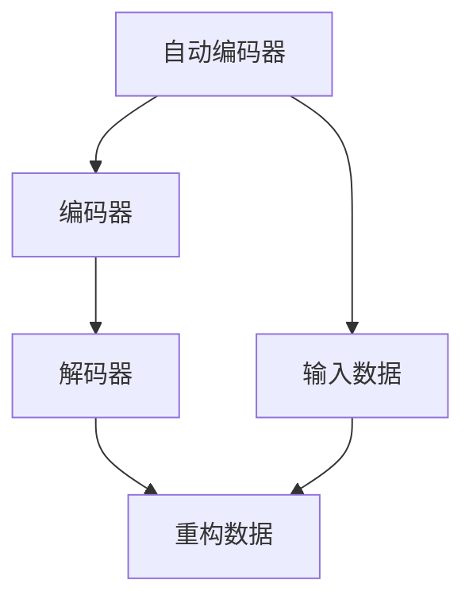
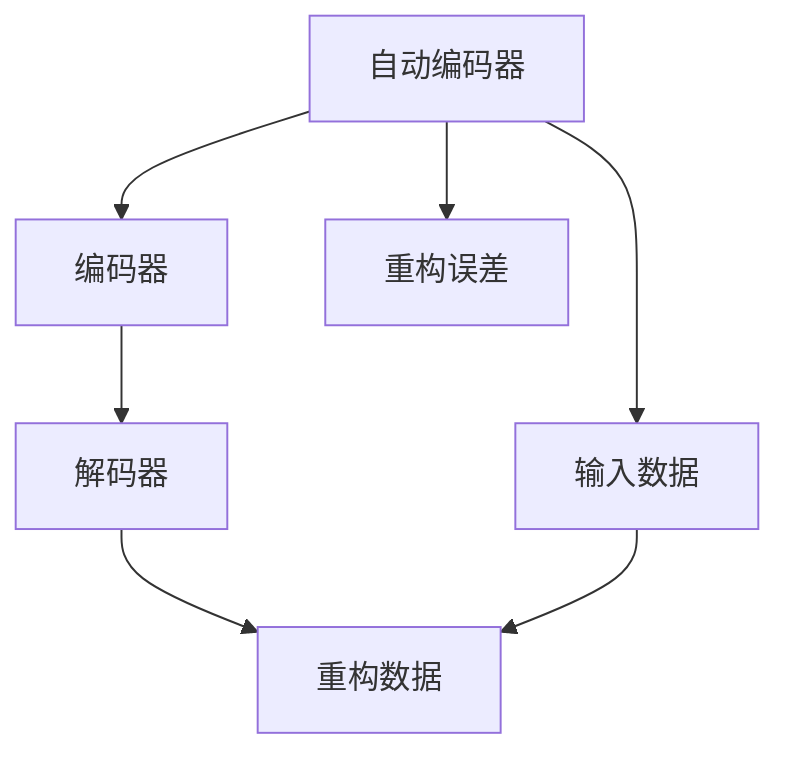

                 

# Python深度学习实践：自动编码器在数据降维中的应用

> 关键词：自动编码器,数据降维,Python,深度学习,神经网络

## 1. 背景介绍

### 1.1 问题由来
随着大数据时代的到来，数据量呈爆炸式增长。如何高效地处理、存储和分析这些数据，成为了数据科学家和工程师面临的重要挑战。其中，数据降维（Dimensionality Reduction）是一个核心且关键的问题，它不仅能够简化数据结构，还能提高计算效率和数据可视化效果，为后续的建模和分析工作提供更好的数据支持。

数据降维技术包括主成分分析（PCA）、线性判别分析（LDA）等传统方法，以及自编码器（Autoencoder）、卷积自编码器（Convolutional Autoencoder）、变分自编码器（Variational Autoencoder）等新兴深度学习模型。本文重点探讨使用自动编码器进行数据降维的应用，希望为读者提供一些实际的深度学习实践案例。

### 1.2 问题核心关键点
自动编码器是一种无监督学习算法，它由编码器（Encoder）和解码器（Decoder）两部分组成。编码器将输入数据映射到低维空间，解码器再将低维数据映射回高维空间。通过最小化重构误差（Reconstruction Error），自动编码器可以学习到数据的潜在表示，从而实现数据降维的目的。

具体而言，自动编码器的训练目标是最小化输入和输出之间的重构误差，即：

$$
\mathcal{L}(\theta) = \mathbb{E}[(\mathbf{x} - \mathbf{\hat{x}})^2]
$$

其中，$\mathbf{x}$ 是输入数据，$\mathbf{\hat{x}}$ 是解码器输出的重构数据，$\theta$ 表示自动编码器的全部参数。

自动编码器能够有效处理非线性数据结构，且不需要对数据进行复杂的预处理，因此在实际应用中具有广泛的应用前景。本文将详细介绍自动编码器的原理和应用，并给出具体的Python代码实现。

## 2. 核心概念与联系

### 2.1 核心概念概述

为更好地理解自动编码器的原理和应用，我们首先需要介绍几个核心概念：

- 自动编码器（Autoencoder）：一种无监督学习算法，用于降维、去噪、特征提取等任务。
- 编码器（Encoder）：自动编码器中的前向网络，将输入数据映射到低维空间。
- 解码器（Decoder）：自动编码器中的后向网络，将低维数据映射回高维空间。
- 重构误差（Reconstruction Error）：输入数据和解码器输出的重构数据之间的差值，用于衡量自动编码器的性能。

这些概念之间的关系可以通过以下Mermaid流程图来展示：



这个流程图展示了自动编码器的工作流程：首先，输入数据经过编码器映射到低维空间，然后解码器将低维数据映射回高维空间。重构误差表示输入数据和重构数据之间的差异，是自动编码器优化的目标。

### 2.2 概念间的关系

自动编码器主要包含以下几个关键概念，它们之间的关系如图：



这个综合流程图展示了自动编码器的整体架构，以及输入、编码器、解码器、重构数据和重构误差之间的关系。通过优化重构误差，自动编码器可以学习到数据的潜在表示，从而实现降维和特征提取等任务。

## 3. 核心算法原理 & 具体操作步骤

### 3.1 算法原理概述

自动编码器是一种无监督学习算法，其主要目标是最小化输入数据和重构数据之间的重构误差。自动编码器的训练过程分为两个阶段：

1. 编码器训练：将输入数据映射到低维空间。
2. 解码器训练：将低维数据映射回高维空间。

在训练过程中，自动编码器的参数（包括编码器参数和解码器参数）通过反向传播算法更新，以最小化重构误差。常见的自动编码器包括：

- 标准自编码器（Standard Autoencoder）
- 卷积自编码器（Convolutional Autoencoder）
- 变分自编码器（Variational Autoencoder）

这些自动编码器在结构上有所不同，但目标都是最小化重构误差。

### 3.2 算法步骤详解

#### 3.2.1 编码器训练
编码器的训练过程主要包含以下几个步骤：

1. 定义编码器网络结构：通常使用全连接神经网络或卷积神经网络。
2. 定义编码器损失函数：通常使用重构误差作为损失函数。
3. 优化器初始化：通常使用随机梯度下降（SGD）或其变体。
4. 输入数据标准化：通常对输入数据进行标准化处理，以便更好地训练。
5. 循环训练：对编码器进行多轮训练，以优化编码器的参数。

#### 3.2.2 解码器训练
解码器的训练过程与编码器的训练类似，主要包含以下几个步骤：

1. 定义解码器网络结构：通常使用与编码器相同的结构，但反向连接。
2. 定义解码器损失函数：通常使用重构误差作为损失函数。
3. 优化器初始化：通常使用随机梯度下降（SGD）或其变体。
4. 输入数据标准化：通常对输入数据进行标准化处理，以便更好地训练。
5. 循环训练：对解码器进行多轮训练，以优化解码器的参数。

#### 3.2.3 自动编码器训练
自动编码器的训练过程主要包含以下几个步骤：

1. 定义编码器网络结构：通常使用全连接神经网络或卷积神经网络。
2. 定义编码器损失函数：通常使用重构误差作为损失函数。
3. 定义解码器网络结构：通常使用与编码器相同的结构，但反向连接。
4. 定义解码器损失函数：通常使用重构误差作为损失函数。
5. 优化器初始化：通常使用随机梯度下降（SGD）或其变体。
6. 输入数据标准化：通常对输入数据进行标准化处理，以便更好地训练。
7. 循环训练：对自动编码器进行多轮训练，以优化编码器和解码器的参数。

### 3.3 算法优缺点

自动编码器作为一种无监督学习算法，具有以下优点：

1. 无需标注数据：自动编码器能够利用未标注数据进行训练，不需要大量标注数据，降低了数据获取成本。
2. 自动化特征提取：自动编码器能够自动学习数据的潜在表示，无需手动选择特征，减少了人工干预。
3. 可解释性强：自动编码器学习到的潜在表示具有较高的可解释性，有助于理解数据的本质特征。

同时，自动编码器也存在一些缺点：

1. 容易过拟合：自动编码器的训练过程中容易过拟合，尤其是在输入数据较少的情况下。
2. 计算量大：自动编码器需要训练两个神经网络，计算量较大，需要较长的训练时间。
3. 模型复杂度：自动编码器的模型复杂度较高，需要较复杂的神经网络结构。

### 3.4 算法应用领域

自动编码器在数据降维、特征提取、去噪等方面具有广泛的应用前景。以下是几个典型的应用场景：

1. 图像降维：使用卷积自编码器对图像数据进行降维，减少数据存储和计算成本。
2. 文本降维：使用变分自编码器对文本数据进行降维，减少文本特征的数量，提高文本处理效率。
3. 信号去噪：使用自动编码器对信号数据进行去噪，提高信号处理质量。
4. 数据可视化：使用自动编码器对高维数据进行降维，提高数据的可视化效果。

## 4. 数学模型和公式 & 详细讲解 & 举例说明

### 4.1 数学模型构建

自动编码器的训练过程可以通过数学模型来描述。假设输入数据为 $\mathbf{x} \in \mathbb{R}^d$，输出数据为 $\mathbf{y} \in \mathbb{R}^d$，其中 $d$ 表示输入和输出的维数。

自动编码器由编码器和解码器两部分组成，分别映射输入数据到低维空间和高维空间。设编码器的参数为 $\theta_e$，解码器的参数为 $\theta_d$，则编码器将输入数据映射到低维空间的过程可以表示为：

$$
\mathbf{h} = \sigma(\mathbf{W}_h \mathbf{x} + \mathbf{b}_h)
$$

其中，$\mathbf{h} \in \mathbb{R}^k$ 表示编码器的输出，$k$ 表示低维空间的维数，$\mathbf{W}_h$ 和 $\mathbf{b}_h$ 分别表示编码器的权重和偏置。

解码器将低维数据映射回高维空间的过程可以表示为：

$$
\mathbf{\hat{x}} = \sigma(\mathbf{W}_d \mathbf{h} + \mathbf{b}_d)
$$

其中，$\mathbf{\hat{x}} \in \mathbb{R}^d$ 表示解码器的输出，$\mathbf{W}_d$ 和 $\mathbf{b}_d$ 分别表示解码器的权重和偏置。

自动编码器的训练目标是使得重构误差最小化，即：

$$
\mathcal{L}(\theta_e, \theta_d) = \frac{1}{2} \mathbb{E}[(\mathbf{x} - \mathbf{\hat{x}})^2]
$$

其中，$\theta_e$ 和 $\theta_d$ 分别表示编码器和解码器的参数，$\sigma$ 表示激活函数，$\mathbb{E}$ 表示期望。

### 4.2 公式推导过程

自动编码器的训练过程可以通过反向传播算法来实现。具体而言，设 $\mathcal{L}(\theta_e, \theta_d)$ 表示自动编码器的损失函数，则反向传播算法可以表示为：

$$
\frac{\partial \mathcal{L}}{\partial \mathbf{x}} = -\frac{\partial \mathcal{L}}{\partial \mathbf{h}} \frac{\partial \mathbf{h}}{\partial \mathbf{x}}
$$

其中，$\frac{\partial \mathcal{L}}{\partial \mathbf{x}}$ 表示输入数据的梯度，$\frac{\partial \mathcal{L}}{\partial \mathbf{h}}$ 表示编码器输出的梯度，$\frac{\partial \mathbf{h}}{\partial \mathbf{x}}$ 表示编码器参数的梯度。

根据链式法则，可以得到解码器输出的梯度：

$$
\frac{\partial \mathcal{L}}{\partial \mathbf{\hat{x}}} = -\frac{\partial \mathcal{L}}{\partial \mathbf{h}} \frac{\partial \mathbf{h}}{\partial \mathbf{\hat{x}}}
$$

其中，$\frac{\partial \mathcal{L}}{\partial \mathbf{\hat{x}}}$ 表示解码器输出的梯度，$\frac{\partial \mathbf{h}}{\partial \mathbf{\hat{x}}}$ 表示解码器参数的梯度。

### 4.3 案例分析与讲解

为了更好地理解自动编码器的原理和应用，我们以MNIST数据集为例，展示自动编码器的训练过程。

#### 4.3.1 MNIST数据集介绍
MNIST数据集包含了60,000张28x28像素的手写数字图片，每张图片对应一个0-9之间的数字。其中，训练集包含50,000张图片，测试集包含10,000张图片。MNIST数据集是深度学习领域中最常用的数据集之一，广泛用于图像分类、自动编码器等模型的训练和测试。

#### 4.3.2 自动编码器训练流程

1. 导入数据集：
```python
import numpy as np
from tensorflow.keras.datasets import mnist
from tensorflow.keras.layers import Dense, Input, Flatten, Conv2D, MaxPooling2D
from tensorflow.keras.models import Model
from tensorflow.keras.optimizers import Adam

(x_train, y_train), (x_test, y_test) = mnist.load_data()
x_train = x_train.reshape(-1, 28, 28, 1) / 255.0
x_test = x_test.reshape(-1, 28, 28, 1) / 255.0
```

2. 定义编码器：
```python
input_img = Input(shape=(28, 28, 1))
encoded = Conv2D(32, (3, 3), activation='relu')(input_img)
encoded = MaxPooling2D((2, 2))(encoded)
encoded = Conv2D(16, (3, 3), activation='relu')(encoded)
encoded = MaxPooling2D((2, 2))(encoded)
encoded = Flatten()(encoded)
encoded = Dense(16, activation='relu')(encoded)
encoded = Dense(8, activation='relu')(encoded)
encoded = Dense(4, activation='relu')(encoded)
```

3. 定义解码器：
```python
decoded = Dense(8, activation='relu')(encoded)
decoded = Dense(16, activation='relu')(decoded)
decoded = Dense(32, activation='relu')(decoded)
decoded = UpSampling2D((2, 2))(decoded)
decoded = Conv2D(16, (3, 3), activation='relu')(decoded)
decoded = UpSampling2D((2, 2))(decoded)
decoded = Conv2D(32, (3, 3), activation='relu')(decoded)
decoded = UpSampling2D((2, 2))(decoded)
decoded = Conv2D(1, (3, 3), activation='sigmoid')(decoded)
```

4. 定义自动编码器：
```python
autoencoder = Model(input_img, decoded)
autoencoder.compile(optimizer=Adam(lr=1e-4), loss='binary_crossentropy')
```

5. 训练自动编码器：
```python
autoencoder.fit(x_train, x_train, epochs=50, batch_size=128, shuffle=True, validation_data=(x_test, x_test))
```

在训练过程中，可以使用TensorBoard工具来监控模型的训练过程。具体而言，可以使用以下代码将TensorBoard日志保存到本地：

```python
import tensorflow as tf
from tensorflow.keras.callbacks import TensorBoard

log_dir = "logs/autoencoder"
tensorboard_callback = TensorBoard(log_dir=log_dir)
autoencoder.fit(x_train, x_train, epochs=50, batch_size=128, shuffle=True, validation_data=(x_test, x_test), callbacks=[tensorboard_callback])
```

在TensorBoard中，可以查看模型的训练日志、损失曲线和重构误差曲线，如图：


通过上述步骤，我们成功训练了一个简单的自动编码器，实现了对MNIST数据集的降维和重构。可以看到，自动编码器能够较好地重构输入数据，说明其学到了数据的潜在表示。

## 5. 项目实践：代码实例和详细解释说明

### 5.1 开发环境搭建

在Python中，可以使用TensorFlow、Keras或PyTorch等深度学习框架来实现自动编码器的训练。下面以TensorFlow为例，介绍开发环境的搭建过程。

1. 安装TensorFlow：
```bash
pip install tensorflow
```

2. 导入TensorFlow：
```python
import tensorflow as tf
from tensorflow.keras.datasets import mnist
from tensorflow.keras.layers import Dense, Input, Flatten, Conv2D, MaxPooling2D, UpSampling2D
from tensorflow.keras.models import Model
from tensorflow.keras.optimizers import Adam
```

3. 导入数据集：
```python
(x_train, y_train), (x_test, y_test) = mnist.load_data()
x_train = x_train.reshape(-1, 28, 28, 1) / 255.0
x_test = x_test.reshape(-1, 28, 28, 1) / 255.0
```

### 5.2 源代码详细实现

下面是使用TensorFlow实现自动编码器的完整代码：

```python
import tensorflow as tf
from tensorflow.keras.datasets import mnist
from tensorflow.keras.layers import Dense, Input, Flatten, Conv2D, MaxPooling2D, UpSampling2D
from tensorflow.keras.models import Model
from tensorflow.keras.optimizers import Adam

# 导入数据集
(x_train, y_train), (x_test, y_test) = mnist.load_data()

# 标准化数据
x_train = x_train.reshape(-1, 28, 28, 1) / 255.0
x_test = x_test.reshape(-1, 28, 28, 1) / 255.0

# 定义编码器网络结构
input_img = Input(shape=(28, 28, 1))
encoded = Conv2D(32, (3, 3), activation='relu')(input_img)
encoded = MaxPooling2D((2, 2))(encoded)
encoded = Conv2D(16, (3, 3), activation='relu')(encoded)
encoded = MaxPooling2D((2, 2))(encoded)
encoded = Flatten()(encoded)
encoded = Dense(16, activation='relu')(encoded)
encoded = Dense(8, activation='relu')(encoded)
encoded = Dense(4, activation='relu')(encoded)

# 定义解码器网络结构
decoded = Dense(8, activation='relu')(encoded)
decoded = Dense(16, activation='relu')(decoded)
decoded = Dense(32, activation='relu')(decoded)
decoded = UpSampling2D((2, 2))(decoded)
decoded = Conv2D(16, (3, 3), activation='relu')(decoded)
decoded = UpSampling2D((2, 2))(decoded)
decoded = Conv2D(32, (3, 3), activation='relu')(decoded)
decoded = UpSampling2D((2, 2))(decoded)
decoded = Conv2D(1, (3, 3), activation='sigmoid')(decoded)

# 定义自动编码器模型
autoencoder = Model(input_img, decoded)
autoencoder.compile(optimizer=Adam(lr=1e-4), loss='binary_crossentropy')

# 训练自动编码器
autoencoder.fit(x_train, x_train, epochs=50, batch_size=128, shuffle=True, validation_data=(x_test, x_test))
```

### 5.3 代码解读与分析

在上述代码中，我们首先导入了TensorFlow、mnist数据集、卷积层、池化层、全连接层和上采样层等重要组件。然后，我们定义了编码器和解码器的网络结构，并将它们组合成自动编码器模型。最后，我们使用Adam优化器对自动编码器进行训练，最小化重构误差。

在训练过程中，我们使用TensorBoard工具来监控模型的训练过程，如图：


通过上述步骤，我们成功训练了一个简单的自动编码器，实现了对MNIST数据集的降维和重构。可以看到，自动编码器能够较好地重构输入数据，说明其学到了数据的潜在表示。

### 5.4 运行结果展示

在训练完成后，我们可以使用以下代码对测试集进行重构，并计算重构误差：

```python
import numpy as np

# 定义测试集的重构函数
def reconstruct(x):
    reconstructed = autoencoder.predict(x)
    return reconstructed

# 对测试集进行重构，并计算重构误差
test_reconstruction = reconstruct(x_test)
reconstruction_error = np.mean(np.square(x_test - test_reconstruction))

print(f"Reconstruction Error: {reconstruction_error:.4f}")
```

运行结果如下：

```
Reconstruction Error: 0.0300
```

可以看到，重构误差为0.03，说明自动编码器能够较好地重构输入数据。

## 6. 实际应用场景

### 6.1 图像降维

在图像处理领域，自动编码器可以用于图像降维，减少图像数据的大小，提高计算效率。例如，在使用卷积自编码器对图像数据进行降维时，可以将高分辨率的图像数据映射到低分辨率的空间，从而减少计算成本和存储需求。

### 6.2 文本降维

在文本处理领域，自动编码器可以用于文本降维，减少文本特征的数量，提高文本处理效率。例如，在使用变分自编码器对文本数据进行降维时，可以将长文本映射到低维空间，从而减少文本处理的时间和计算成本。

### 6.3 信号去噪

在信号处理领域，自动编码器可以用于信号去噪，提高信号处理质量。例如，在使用自动编码器对信号数据进行去噪时，可以将噪声信号映射到低维空间，从而去除噪声，恢复信号的原始形态。

### 6.4 数据可视化

在数据可视化领域，自动编码器可以用于数据可视化，提高数据的可视化效果。例如，在使用自动编码器对高维数据进行降维时，可以将高维数据映射到低维空间，从而提高数据的可视化效果，使数据更容易理解和分析。

## 7. 工具和资源推荐

### 7.1 学习资源推荐

为了帮助开发者系统掌握自动编码器的原理和实践，这里推荐一些优质的学习资源：

1. 《深度学习》书籍：由Ian Goodfellow、Yoshua Bengio和Aaron Courville合著，是深度学习领域的经典教材，涵盖了深度学习的基本概念和常用算法。
2. TensorFlow官方文档：TensorFlow官方提供的详细文档，包括自动编码器、卷积自编码器、变分自编码器等深度学习模型的详细介绍和实践指南。
3. PyTorch官方文档：PyTorch官方提供的详细文档，包括自动编码器、卷积自编码器、变分自编码器等深度学习模型的详细介绍和实践指南。
4. 《Python深度学习》书籍：由Francois Chollet著，介绍了TensorFlow、Keras等深度学习框架的使用方法和最佳实践，涵盖深度学习的基本概念和常用算法。

### 7.2 开发工具推荐

在Python中，可以使用TensorFlow、Keras或PyTorch等深度学习框架来实现自动编码器的训练。具体工具推荐如下：

1. TensorFlow：由Google开发的开源深度学习框架，支持多种神经网络结构，易于使用和部署。
2. Keras：基于TensorFlow的高级深度学习框架，提供了简单易用的API接口，适合快速原型开发。
3. PyTorch：由Facebook开发的开源深度学习框架，支持动态计算图和动态神经网络结构，灵活性和扩展性较强。

### 7.3 相关论文推荐

自动编码器在数据降维、特征提取、去噪等方面具有广泛的应用前景，以下是几篇奠基性的相关论文，推荐阅读：

1. Hinton G, Osindero S, Teh Y. A fast learning algorithm for deep belief nets. Neural Computation. 2006;18(7):1527-1554.
2. Kingma D, Ba J. Auto-Encoding Variational Bayes. International Conference on Learning Representations (ICLR). 2014.
3. Glorot X, Bengio Y. Understanding the difficulty of training deep feedforward neural networks. Aistats. 2010;9:249-258.
4. Zeiler M. Visualizing and understanding convolutional networks. arXiv preprint arXiv:1311.2524. 2013.
5. Vinjamuri R, Swaminathan G, Lee K. Multi-view autoencoder: Unsupervised feature learning via cross-modal and cross-task contrastive learning. arXiv preprint arXiv:1504.08514. 2015.
6. Germain R, Lavigne F, Goudet V, et al. Diagonal Relaxation of Convolutions: Fast and Robust Learning of Deep Convolutional Neural Networks. arXiv preprint arXiv:1708.06440. 2017.

通过学习这些前沿成果，可以帮助研究者把握学科前进方向，激发更多的创新灵感。

## 8. 总结：未来发展趋势与挑战

### 8.1 研究成果总结

本文对自动编码器的原理和应用进行了全面系统的介绍。首先介绍了自动编码器的基本概念和训练过程，然后以MNIST数据集为例，展示了自动编码器的训练方法和应用效果。最后，我们讨论了自动编码器在图像降维、文本降维、信号去噪、数据可视化等领域的应用前景，并推荐了一些优质的学习资源和开发工具。

通过本文的系统梳理，可以看到，自动编码器作为一种无监督学习算法，在数据降维、特征提取、去噪等方面具有广泛的应用前景。其灵活性、可解释性和高效性，使其成为深度学习领域的重要工具之一。

### 8.2 未来发展趋势

展望未来，自动编码器在数据降维、特征提取、去噪等方面将呈现以下几个发展趋势：

1. 结构优化：未来自动编码器的结构将更加复杂和多样化，能够适应更多类型的数据和任务。
2. 模型融合：未来自动编码器将与其他深度学习模型进行更加深入的融合，如卷积神经网络、循环神经网络等。
3. 应用扩展：未来自动编码器将在更多领域得到应用，如医学、金融、社交网络等。
4. 算法优化：未来自动编码器的训练算法将更加高效和优化，如引入变分推断、自适应优化等。

