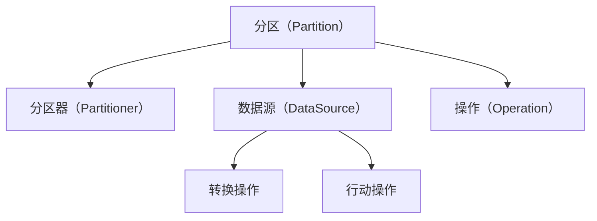

                 

# RDD 原理与代码实例讲解

## 1. 背景介绍

### 1.1 问题由来

在分布式计算领域，RDD（Resilient Distributed Dataset）是一种高效的数据抽象，支持在分布式环境中进行大规模数据的弹性处理。Apache Spark 通过 RDD 提供了快速、易用的并行计算框架，支持数据集的弹性分布和处理。在当今大数据时代，RDD 已成为进行大数据处理和分析的重要工具之一。

RDD 的基本思想是将数据集抽象为一系列分区的、不可变的、分布式的元素集合，这些元素可以被并行操作。RDD 通过延迟计算机制，可以在计算过程中延迟分配资源，从而最大化利用计算资源，提高计算效率。

### 1.2 问题核心关键点

RDD 的核心思想是将大规模数据集分解为一系列独立的、不可变的分区，每个分区都可以独立进行计算，并通过操作链的懒加载机制，实现高效的内存管理。RDD 支持多种数据源，包括文件、数据库、网络等，能够适应不同数据源和计算任务的需求。

RDD 的核心概念包括分区（Partition）、分区器（Partitioner）、数据源（DataSource）、操作（Operation）等。RDD 的操作可以分为两类：转换操作（Transformation）和行动操作（Action）。转换操作不会立即执行计算，而是将计算任务延迟到后期执行，以提高计算效率；行动操作则会立即执行计算，并将结果返回给用户。

### 1.3 问题研究意义

RDD 作为分布式计算的重要工具，在处理大规模数据方面具有显著优势。通过 RDD，用户可以高效地进行大规模数据集的并行处理，提高计算效率，降低计算成本。此外，RDD 支持多种数据源和计算任务，能够适应不同的数据处理需求，具有良好的通用性和可扩展性。

RDD 在多个领域得到了广泛应用，如大数据分析、机器学习、图计算、实时流处理等。在企业级应用中，RDD 已成为数据处理和分析的重要工具，为企业的数字化转型提供了强有力的技术支撑。

## 2. 核心概念与联系

### 2.1 核心概念概述

RDD 的核心概念包括：

- 分区（Partition）：RDD 中的分区是一个独立的、不可变的数据集。每个分区都包含一部分数据，可以在独立的计算节点上进行并行处理。
- 分区器（Partitioner）：分区器用于将数据集划分为若干个分区。常见的分区器包括哈希分区器（HashPartitioner）和范围分区器（RangePartitioner）。
- 数据源（DataSource）：数据源用于从外部存储系统中获取数据。常见的数据源包括 HDFS、本地文件系统、SQL 数据库等。
- 操作（Operation）：操作是对 RDD 数据集进行操作，可以分为转换操作和行动操作。转换操作包括 map、filter、reduceByKey 等；行动操作包括 count、collect、saveAsTextFile 等。

### 2.2 核心概念间的关系

这些核心概念之间的关系可以通过以下 Mermaid 流程图来展示：



这个流程图展示了 RDD 的基本组成及其之间的关系：

- 数据源：RDD 中的数据来源于外部存储系统，如 HDFS、本地文件系统等。
- 分区器：数据源中的数据被划分为若干个分区，每个分区都是一个独立的、不可变的数据集。
- 操作：对分区进行计算操作，可以包括转换操作和行动操作。
- 转换操作：对数据进行转换，如 map、filter 等。
- 行动操作：对数据进行操作，如 count、collect 等。

通过这些核心概念，RDD 实现了高效的大规模数据处理。接下来，我们将进一步深入探讨 RDD 的原理和实现细节。

## 3. 核心算法原理 & 具体操作步骤

### 3.1 算法原理概述

RDD 的核心算法原理包括延迟计算机制、分区机制、操作链机制等。

#### 3.1.1 延迟计算机制

RDD 的延迟计算机制是 RDD 最重要的特性之一。RDD 中的操作链不会立即执行计算，而是将计算任务延迟到后期执行，以提高计算效率。当用户对 RDD 进行 action 操作时，RDD 的计算任务才会被触发执行，从而避免了重复计算和资源浪费。

#### 3.1.2 分区机制

RDD 中的数据集被划分为若干个分区，每个分区都是一个独立的、不可变的数据集。分区机制使得 RDD 能够进行并行计算，从而提高计算效率。

#### 3.1.3 操作链机制

RDD 中的操作链包括一系列的转换操作和行动操作。转换操作不会立即执行计算，而是将计算任务延迟到后期执行；行动操作则会立即执行计算，并将结果返回给用户。这种操作链机制使得 RDD 可以高效地进行复杂的数据处理。

### 3.2 算法步骤详解

RDD 的操作可以分为转换操作和行动操作两类，下面分别介绍这两类操作的具体步骤。

#### 3.2.1 转换操作

转换操作包括 map、filter、reduceByKey 等。以 map 操作为例，其具体步骤如下：

1. 将输入 RDD 中的每个元素映射为新的元素，构成一个新的 RDD。
2. 对于每个分区，遍历其元素，将元素映射为新的元素，并将映射后的结果组成一个新的分区。
3. 返回新的 RDD。

#### 3.2.2 行动操作

行动操作包括 count、collect、saveAsTextFile 等。以 count 操作为例，其具体步骤如下：

1. 将输入 RDD 中的每个元素进行计数，得到每个元素的出现次数。
2. 将计数结果汇总为新的 RDD。
3. 返回计数结果。

### 3.3 算法优缺点

RDD 的优点包括：

- 高效计算：RDD 的延迟计算机制和操作链机制能够高效地进行大规模数据处理。
- 弹性分布：RDD 的分区机制使得数据能够弹性分布到多个计算节点上进行并行处理。
- 灵活操作：RDD 支持多种数据源和计算任务，能够适应不同的数据处理需求。

RDD 的缺点包括：

- 内存消耗：RDD 中的数据集是以内存为存储介质的，当数据集过大时，内存消耗可能会变得很大。
- 延迟执行：虽然 RDD 的延迟计算机制能够提高计算效率，但也会导致一些操作无法立即得到结果。

### 3.4 算法应用领域

RDD 在多个领域得到了广泛应用，如大数据分析、机器学习、图计算、实时流处理等。

- 大数据分析：RDD 可以对大规模数据进行高效处理，提取有价值的信息，帮助企业进行数据驱动的决策。
- 机器学习：RDD 可以高效地处理大规模数据集，进行特征工程、模型训练等任务，提升机器学习模型的性能。
- 图计算：RDD 支持有向无环图（DAG）的操作链机制，适合进行图计算。
- 实时流处理：RDD 可以对实时流数据进行高效处理，帮助企业进行实时数据分析和处理。

## 4. 数学模型和公式 & 详细讲解 & 举例说明

### 4.1 数学模型构建

RDD 的基本数学模型为：

$$ RDD = (\{(p_i, r_i)\}, P, O) $$

其中，$(p_i, r_i)$ 表示分区中的元素和其对应的元数据，$P$ 表示分区器，$O$ 表示操作链。

### 4.2 公式推导过程

以 map 操作为例，其数学模型可以表示为：

$$ RDD_{out} = (\{(p_i', r_i')\}, P', O' \cup O) $$

其中，$O' = \{(f, p_i', r_i')\}$ 表示 map 操作的应用链，$f$ 表示映射函数。

### 4.3 案例分析与讲解

假设有一个输入 RDD，包含若干个整数：

$$ RDD_{in} = \{(1, 1), (2, 2), (3, 3), (4, 4), (5, 5)\} $$

对其应用 map 操作，将每个整数加倍，得到一个新的 RDD：

$$ RDD_{out} = \{(2, 1), (4, 2), (6, 3), (8, 4), (10, 5)\} $$

## 5. 项目实践：代码实例和详细解释说明

### 5.1 开发环境搭建

在进行 RDD 实践前，我们需要准备好开发环境。以下是使用 PySpark 进行 RDD 开发的环境配置流程：

1. 安装 Apache Spark：从官网下载 Apache Spark，并按照官方文档进行安装。
2. 配置环境变量：设置 SPARK_HOME 和 PYSPARK_PYTHON，指定 Spark 的安装路径和 Python 解释器。
3. 创建 PySpark 环境：使用 pyspark 命令启动 PySpark 环境。

### 5.2 源代码详细实现

下面我们以一个简单的 RDD 转换操作为例，展示 RDD 的基本实现。

```python
from pyspark import SparkContext, SparkConf

conf = SparkConf().setAppName("RDD Practice").setMaster("local")
sc = SparkContext(conf=conf)

# 创建 RDD
data = [1, 2, 3, 4, 5]
rdd = sc.parallelize(data)

# 应用 map 操作
rdd_mapped = rdd.map(lambda x: x * 2)

# 打印结果
print(rdd_mapped.collect())
```

### 5.3 代码解读与分析

在上述代码中，我们首先创建了一个 Spark 环境，然后创建了一个包含整数 1 到 5 的 RDD，接着对 RDD 应用了 map 操作，将每个整数加倍，并最终打印出结果。

RDD 的实现依赖于 Spark 的分布式计算引擎。在创建 RDD 时，Spark 会根据数据集的大小和分区的数量，将数据集划分为若干个分区，并在不同的计算节点上进行并行处理。应用 map 操作时，Spark 会对每个分区进行遍历，对每个元素应用映射函数，并将映射后的结果组成一个新的分区，最后返回新的 RDD。

### 5.4 运行结果展示

运行上述代码，输出结果如下：

```
[2, 4, 6, 8, 10]
```

可以看到，RDD 中的每个元素都加倍了。

## 6. 实际应用场景

### 6.1 大数据分析

RDD 在大数据分析领域有着广泛的应用。例如，可以进行大规模数据集的聚合计算、数据挖掘、统计分析等任务。

以数据挖掘为例，可以使用 RDD 对大规模数据集进行并行计算，提取有价值的信息，如关联规则、聚类分析等。

### 6.2 机器学习

RDD 可以用于机器学习模型的训练和推理。在训练阶段，可以使用 RDD 进行特征提取、模型训练等任务；在推理阶段，可以使用 RDD 进行数据预处理、模型预测等任务。

例如，可以使用 RDD 进行大规模数据集的特征工程，生成训练样本和测试样本，并使用分布式机器学习算法进行模型训练。

### 6.3 图计算

RDD 支持有向无环图（DAG）的操作链机制，适合进行图计算。可以使用 RDD 对大规模图数据进行并行计算，提取图中的有价值信息，如中心性、路径分析等。

例如，可以使用 RDD 进行大规模图数据的遍历、搜索、计算等操作，提取图中的关键节点和路径，帮助企业进行数据驱动的决策。

### 6.4 实时流处理

RDD 可以对实时流数据进行高效处理，帮助企业进行实时数据分析和处理。

例如，可以使用 RDD 对实时数据进行实时统计、实时分析、实时预测等任务，帮助企业进行实时决策。

## 7. 工具和资源推荐

### 7.1 学习资源推荐

为了帮助开发者系统掌握 RDD 的理论基础和实践技巧，这里推荐一些优质的学习资源：

1. Apache Spark 官方文档：Apache Spark 提供了详细的官方文档，包括 RDD 的基本概念、API 接口、最佳实践等。
2. "Spark with Python" 书籍：本书介绍了如何使用 PySpark 进行 RDD 开发，包括 RDD 的基本概念、API 接口、开发技巧等。
3. "Data Science with Spark" 课程：由 Coursera 提供的在线课程，介绍了如何使用 Spark 进行数据处理、数据挖掘、机器学习等任务。
4. "Introduction to Distributed Algorithms" 课程：由斯坦福大学提供的在线课程，介绍了分布式计算的基本概念、算法原理等。
5. "Spark 实战" 博客：博客作者分享了大量的 Spark 开发经验，包括 RDD 的实践技巧、性能调优、问题排查等。

### 7.2 开发工具推荐

RDD 的开发工具主要包括 PySpark、Spark SQL 等。

- PySpark：PySpark 是 Python 版本的 Spark 接口，提供了简单易用的 API，适合 Python 开发者进行 RDD 开发。
- Spark SQL：Spark SQL 是 Spark 的 SQL 处理引擎，支持结构化数据和大数据 SQL 查询，适合进行数据处理和分析。

### 7.3 相关论文推荐

RDD 的开发和优化一直是研究的热点领域，以下是几篇相关的论文：

1. "Spark: Cluster Computing with Fault Tolerance"：Spark 的论文，介绍了 Spark 的分布式计算框架和容错机制。
2. "RDD: Resilient Distributed Datasets"：RDD 的论文，介绍了 RDD 的基本概念、API 接口、操作链机制等。
3. "Combiners for Large-Scale Data Processing"：Spark 的论文，介绍了如何使用 combiner 优化 RDD 的操作链。
4. "Optimizing Spark Data Pipeline for Data Pipeline"：Spark 的论文，介绍了如何使用优化策略提高 RDD 的性能。
5. "Distributed Computing for Big Data"：论文介绍了分布式计算的基本概念和原理，对 RDD 的发展具有重要的参考价值。

这些论文展示了 RDD 的发展历程和优化策略，有助于读者深入理解 RDD 的原理和实践技巧。

## 8. 总结：未来发展趋势与挑战

### 8.1 总结

本文对 RDD 的原理与代码实例进行了详细讲解。首先介绍了 RDD 的基本概念和原理，包括分区、分区器、数据源、操作等。然后通过具体的代码实例，展示了 RDD 的实现过程。最后探讨了 RDD 在实际应用中的场景和未来发展趋势。

RDD 作为分布式计算的重要工具，在处理大规模数据方面具有显著优势。通过 RDD，用户可以高效地进行大规模数据集的并行处理，提高计算效率，降低计算成本。RDD 在多个领域得到了广泛应用，如大数据分析、机器学习、图计算、实时流处理等。

### 8.2 未来发展趋势

RDD 的未来发展趋势包括：

- 高效计算：RDD 的延迟计算机制和操作链机制能够高效地进行大规模数据处理，未来将继续优化计算效率，提高数据处理速度。
- 弹性分布：RDD 的分区机制使得数据能够弹性分布到多个计算节点上进行并行处理，未来将继续优化分区策略，提高计算节点利用率。
- 灵活操作：RDD 支持多种数据源和计算任务，未来将继续扩展数据源和操作类型，支持更多数据处理需求。

### 8.3 面临的挑战

RDD 在实际应用中仍然面临一些挑战，包括：

- 内存消耗：RDD 中的数据集是以内存为存储介质的，当数据集过大时，内存消耗可能会变得很大。
- 延迟执行：虽然 RDD 的延迟计算机制能够提高计算效率，但也会导致一些操作无法立即得到结果。
- 性能优化：RDD 的性能优化是一个复杂的问题，需要结合具体应用场景进行优化。

### 8.4 研究展望

未来，RDD 的研究方向包括：

- 内存优化：如何优化内存消耗，提高 RDD 的计算效率和容错性。
- 操作链优化：如何优化操作链机制，提高 RDD 的性能和灵活性。
- 容错机制：如何优化 RDD 的容错机制，提高 RDD 的可靠性和稳定性。
- 多数据源支持：如何扩展 RDD 的数据源支持，支持更多数据处理需求。

总之，RDD 作为分布式计算的重要工具，在处理大规模数据方面具有显著优势。未来，RDD 将继续优化计算效率、分区策略和操作链机制，支持更多数据源和计算任务，为数据处理和分析提供更强大的支持。

## 9. 附录：常见问题与解答

**Q1：什么是 RDD？**

A: RDD 是 Apache Spark 中的一种分布式数据集，它将大规模数据集划分为若干个独立的、不可变的分区，能够在多个计算节点上进行并行计算。RDD 支持多种数据源和计算任务，能够适应不同的数据处理需求。

**Q2：RDD 的延迟计算机制是什么？**

A: RDD 的延迟计算机制是 RDD 最重要的特性之一。RDD 中的操作链不会立即执行计算，而是将计算任务延迟到后期执行，以提高计算效率。当用户对 RDD 进行 action 操作时，RDD 的计算任务才会被触发执行，从而避免了重复计算和资源浪费。

**Q3：RDD 的分区机制是什么？**

A: RDD 的分区机制将数据集划分为若干个独立的、不可变的数据集，每个分区都是一个独立的、不可变的数据集。分区机制使得 RDD 能够进行并行计算，从而提高计算效率。

**Q4：RDD 有哪些常见的操作？**

A: RDD 支持多种操作，包括转换操作和行动操作。常见的转换操作包括 map、filter、reduceByKey 等；常见的行动操作包括 count、collect、saveAsTextFile 等。

**Q5：如何使用 RDD 进行数据处理？**

A: 使用 RDD 进行数据处理，需要编写 RDD 的转换操作和行动操作。例如，可以使用 RDD 进行大规模数据集的聚合计算、数据挖掘、统计分析等任务。在编写 RDD 的代码时，需要注意操作的延迟计算机制和分区机制，以提高计算效率和并行计算能力。

---

作者：禅与计算机程序设计艺术 / Zen and the Art of Computer Programming

