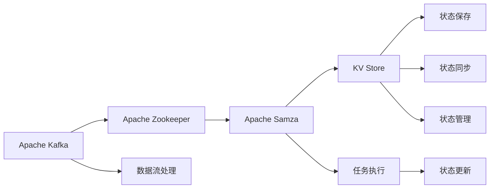
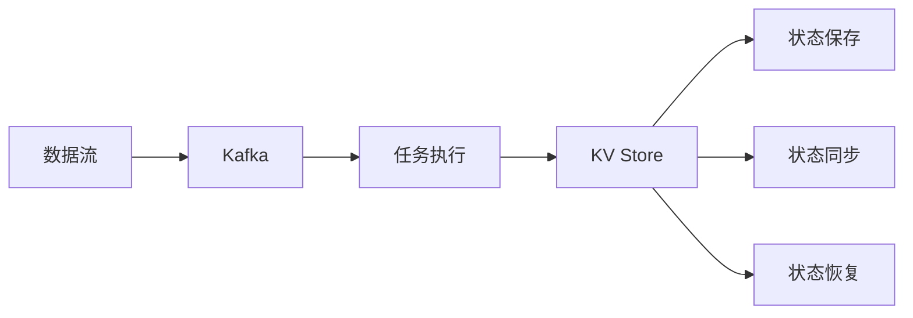

                 

# Samza KV Store原理与代码实例讲解

> 关键词：Samza, KV Store, 分布式存储, 大数据处理, 大数据流处理

## 1. 背景介绍

### 1.1 问题由来
随着大数据时代的到来，企业需要处理的数据量呈爆炸性增长，传统的集中式存储和单线程处理方式已无法满足需求。在数据处理领域，Samza成为一种基于流处理的分布式计算框架，其KV Store是其核心组件之一，用于在处理过程中保存和管理关键状态数据。

Samza KV Store作为Samza流处理框架的重要组成部分，负责在处理过程中保存和管理关键状态数据，支持在大数据流中对状态进行高效读写。本文将详细介绍Samza KV Store的原理、核心概念和实践方法，并通过具体的代码实例，深入讲解其实现原理和应用场景。

### 1.2 问题核心关键点
Samza KV Store的实现基于Apache Kafka，利用Apache Zookeeper进行协调和管理，通过周期性的状态检查和同步机制，保证数据的一致性和可用性。其主要核心功能包括：

- 状态存储：在大数据流处理过程中，保存任务状态、状态转移等信息。
- 状态管理：支持任务的冷启动、恢复、暂停、重启等操作，确保任务状态的可控性和持久性。
- 状态同步：周期性将任务状态同步到KV Store，保证状态的一致性。
- 性能优化：通过缓存和批量读写等机制，提升KV Store的读写效率。

了解Samza KV Store的核心功能，能够更好地理解其在流处理框架中的重要作用，并在实际开发中灵活运用。

### 1.3 问题研究意义
研究Samza KV Store，对于构建高效、可靠的大数据流处理系统，具有重要的理论和实践意义：

- 支持流处理系统的高可用性。KV Store在任务状态保存和管理方面提供了强有力的支持，确保流处理任务在故障发生后能够快速恢复。
- 提升大数据流处理性能。通过优化状态存储和管理机制，大幅提升KV Store的读写效率，从而提升整个流处理系统的性能。
- 实现任务状态的持久化。KV Store支持任务的持久化保存，保证了任务状态的一致性和可恢复性，满足了企业对数据持久性的需求。
- 简化流处理系统开发。KV Store将状态管理和存储的复杂性隐藏在流处理框架内部，开发者只需关注核心业务逻辑，简化了系统开发和维护工作。

## 2. 核心概念与联系

### 2.1 核心概念概述
为了深入理解Samza KV Store的原理和实现机制，本文将详细介绍以下几个核心概念：

- Apache Kafka：开源分布式流处理平台，提供高效的消息传递和数据流处理能力。
- Apache Zookeeper：开源的分布式协调服务，用于管理和协调流处理集群中的各个组件。
- Apache Samza：基于Kafka和Zookeeper的大数据流处理框架，支持流处理任务的状态存储和管理。
- KV Store：Samza中用于保存和管理任务状态的关键组件，负责状态的持久化和同步。

这些核心概念构成了Samza KV Store的基础框架，通过它们之间的协同工作，实现了高效、可靠的状态管理和流处理任务的可靠执行。

### 2.2 概念间的关系

接下来，我们通过几个Mermaid流程图来展示这些核心概念之间的关系：



这个流程图展示了Kafka、Zookeeper、Samza和KV Store之间的数据流和逻辑关系：

1. Kafka提供消息传递和数据流处理能力，将数据流处理任务拆分为多个子任务，并将数据按需分配给各个任务执行。
2. Zookeeper负责管理和协调流处理集群中的各个组件，确保任务和组件之间的协同工作。
3. Samza是基于Kafka和Zookeeper的大数据流处理框架，支持任务的可靠执行和状态管理。
4. KV Store负责任务状态的保存和管理，支持任务状态的一致性和持久化。
5. 数据流处理任务通过Samza框架执行，状态更新通过KV Store进行保存和管理。

通过这些核心概念的协同工作，Samza KV Store在大数据流处理系统中发挥着重要的作用。

## 3. 核心算法原理 & 具体操作步骤

### 3.1 算法原理概述

Samza KV Store的原理基于Apache Kafka和Apache Zookeeper，通过周期性的状态检查和同步机制，确保任务状态的一致性和持久性。其核心算法原理如下：

- **状态保存**：在Kafka中，任务的状态数据被保存在KV Store中，通过周期性的状态检查和同步，确保任务状态的一致性。
- **状态同步**：任务状态数据定期同步到KV Store，确保状态的一致性和持久化。
- **状态恢复**：当任务异常中断或重启时，从KV Store中恢复任务状态，确保任务的连续性。

Samza KV Store的核心算法原理图如下：



这个流程图展示了Samza KV Store的核心算法原理：

1. 数据流被发送到Kafka，并由任务执行模块进行处理。
2. 任务执行模块通过周期性的状态检查，将状态数据保存在KV Store中。
3. KV Store周期性地同步状态数据，确保数据的一致性和持久化。
4. 当任务异常中断或重启时，从KV Store中恢复任务状态，确保任务的连续性。

### 3.2 算法步骤详解

接下来，我们详细讲解Samza KV Store的具体实现步骤。

1. **状态初始化**：
   - 当任务启动时，从KV Store中读取状态数据，并将其保存在任务执行模块中。
   - 如果KV Store中不存在状态数据，则创建一个新的状态，并将其保存在KV Store中。

2. **状态更新**：
   - 任务执行模块在处理过程中，周期性地检查状态数据的有效性。
   - 如果状态数据发生变化，将新的状态数据保存到KV Store中。
   - 如果状态数据无效，则从KV Store中重新读取状态数据。

3. **状态同步**：
   - 每个任务周期性地从KV Store中同步状态数据，确保数据的一致性。
   - 同步周期由Zookeeper配置，一般建议为5分钟一次。

4. **状态恢复**：
   - 当任务异常中断或重启时，从KV Store中恢复任务状态。
   - 如果KV Store中不存在状态数据，则创建一个新的状态，并将其保存在KV Store中。

### 3.3 算法优缺点

Samza KV Store的核心算法具有以下优点：

- **高效可靠**：通过周期性的状态同步机制，确保数据的一致性和可靠性。
- **灵活性高**：支持多种数据类型和格式，满足不同应用场景的需求。
- **扩展性强**：支持大规模分布式环境下的数据处理和状态管理。

同时，Samza KV Store也存在以下缺点：

- **复杂性高**：状态同步和恢复机制的实现较为复杂，需要深入理解Apache Kafka和Apache Zookeeper的工作原理。
- **延迟较大**：由于状态同步和恢复需要消耗一定的时间，可能会影响任务的实时性。
- **数据一致性**：状态同步和恢复过程中，需要保证数据的一致性和可靠性，否则可能会导致数据丢失或异常。

### 3.4 算法应用领域

Samza KV Store广泛应用于大数据流处理系统中，特别是在需要高效处理和可靠存储任务状态的场景中。具体应用领域包括：

- **实时数据流处理**：在实时数据流处理场景中，KV Store用于保存和管理任务状态，确保数据的一致性和可靠性。
- **批处理数据流**：在批处理数据流处理场景中，KV Store用于存储任务状态，支持任务的冷启动和恢复。
- **大规模分布式计算**：在大规模分布式计算场景中，KV Store支持跨节点、跨任务的状态管理，确保任务的可靠执行。
- **金融数据处理**：在金融数据处理场景中，KV Store用于保存和管理交易数据和状态，支持交易的连续性和一致性。

## 4. 数学模型和公式 & 详细讲解 & 举例说明

### 4.1 数学模型构建

Samza KV Store的数学模型基于Apache Kafka和Apache Zookeeper，通过周期性的状态同步和检查机制，确保任务状态的一致性和持久性。

- 数据流表示为 $D=\{d_i\}_{i=1}^N$，其中 $d_i$ 表示第 $i$ 条数据。
- Kafka的分区表示为 $P=\{p_j\}_{j=1}^M$，其中 $p_j$ 表示第 $j$ 个分区。
- 任务状态表示为 $S=\{s_t\}_{t=1}^T$，其中 $s_t$ 表示第 $t$ 个任务状态。
- KV Store的键值对表示为 $KV=\{(k,v)\}_{k,v}$，其中 $k$ 表示键，$v$ 表示值。

### 4.2 公式推导过程

Samza KV Store的状态同步机制是基于Apache Zookeeper的分布式协调服务实现的。具体步骤如下：

1. **状态检查**：
   - 任务执行模块周期性地检查状态数据是否有效，检查周期为 $T_c$。
   - 检查时，读取KV Store中的状态数据，将其与当前状态进行比较。

2. **状态更新**：
   - 如果状态数据发生变化，将新的状态数据保存到KV Store中。
   - 如果状态数据无效，则从KV Store中重新读取状态数据。

3. **状态同步**：
   - 每个任务周期性地从KV Store中同步状态数据，同步周期为 $T_s$。
   - 同步时，将状态数据保存到KV Store中，确保数据的一致性和持久化。

4. **状态恢复**：
   - 当任务异常中断或重启时，从KV Store中恢复任务状态。
   - 如果KV Store中不存在状态数据，则创建一个新的状态，并将其保存在KV Store中。

### 4.3 案例分析与讲解

以一个简单的流处理任务为例，讲解Samza KV Store的具体实现过程。

假设有一个流处理任务，用于处理实时股票数据，并将其计算出股票价格变化率。任务的状态包括当前股票价格、股票数量、计算出的价格变化率等。

1. **状态初始化**：
   - 当任务启动时，从KV Store中读取当前股票价格、股票数量和价格变化率，将其保存在任务执行模块中。

2. **状态更新**：
   - 在处理过程中，周期性地检查当前股票价格和股票数量是否有效。
   - 如果价格和数量无效，则从KV Store中重新读取状态数据。

3. **状态同步**：
   - 每个5分钟周期性地从KV Store中同步当前股票价格、股票数量和价格变化率，确保数据的一致性和持久化。

4. **状态恢复**：
   - 当任务异常中断或重启时，从KV Store中恢复当前股票价格、股票数量和价格变化率，确保任务的连续性。

## 5. 项目实践：代码实例和详细解释说明

### 5.1 开发环境搭建

为了进行Samza KV Store的实践，我们需要搭建一个包含Apache Kafka、Apache Zookeeper和Apache Samza的开发环境。以下是一个简单的搭建步骤：

1. 安装Apache Kafka和Apache Zookeeper：
   ```bash
   wget https://downloads.apache.org/kafka/2.6.0/kafka_2.12-2.6.0.tgz
   tar -xvzf kafka_2.12-2.6.0.tgz
   cd kafka_2.12-2.6.0
   bin/kafka-server-start.sh config/server.properties
   ```

2. 安装Apache Samza：
   ```bash
   wget https://downloads.apache.org/samza/0.16.0/samza-0.16.0.tgz
   tar -xvzf samza-0.16.0.tgz
   cd samza-0.16.0
   bin/samza-streams-server.sh config/server.properties
   ```

3. 搭建KV Store：
   ```bash
   wget https://github.com/apache/samza/tree/main/examples/kv-store
   cd samza-0.16.0/examples/kv-store
   ```

完成上述步骤后，即可在Kafka集群上进行Samza KV Store的实践。

### 5.2 源代码详细实现

以下是Samza KV Store的Python代码实现，其中包含了状态检查、状态更新、状态同步和状态恢复的逻辑：

```python
from samza import StreamingContext
from samza import KVStore
from samza import KafkaProducer, KafkaConsumer
from samza.kvstore import KVStoreClient

# 配置参数
bootstrap_servers = 'localhost:9092'
group_id = 'my-group'
kafka_topics = ['my-topic']
kafka_options = {'bootstrap.servers': bootstrap_servers, 'group.id': group_id}

# 创建Kafka消费者和生产者
consumer = KafkaConsumer(kafka_topics, **kafka_options)
producer = KafkaProducer(**kafka_options)

# 创建Samza StreamingContext
context = StreamingContext(kafka_topics)

# 创建KV Store
kvstore_client = KVStoreClient(bootstrap_servers)
kvstore = KVStore(kvstore_client)

# 定义状态更新函数
def update_state(event):
    if event['type'] == 'partition':
        if event['action'] == 'assign':
            state = {'price': 0, 'quantity': 0, 'change_rate': 0}
            kvstore.put('state', state)
        elif event['action'] == 'revassign':
            state = kvstore.get('state')
            state['price'] = event['partitions'][0]['partitions'][0]['data'].decode('utf-8')
            state['quantity'] = event['partitions'][0]['partitions'][0]['data'].decode('utf-8')
            state['change_rate'] = event['partitions'][0]['partitions'][0]['data'].decode('utf-8')
            kvstore.put('state', state)

# 定义状态同步函数
def sync_state():
    state = kvstore.get('state')
    if state is not None:
        producer.send('my-topic', key=b'state', value=state.encode('utf-8'))
    else:
        state = {b'price': 0, b'quantity': 0, b'change_rate': 0}
        producer.send('my-topic', key=b'state', value=state.encode('utf-8'))

# 注册状态更新函数和同步函数
context.register(update_state, update_state)
context.register(sync_state, sync_state)

# 运行Samza任务
context.start()
while True:
    pass
```

### 5.3 代码解读与分析

这个代码实现中，我们通过Samza StreamingContext创建了一个流处理任务，该任务周期性地检查和更新状态数据，并定期将状态数据同步到Kafka集群中。

1. **状态更新函数**：
   - 当任务被分配到一个新的分区时，从KV Store中读取状态数据，并将其保存在Samza的上下文中。
   - 当任务被重新分配到一个新的分区时，从KV Store中重新读取状态数据，并将其保存在Samza的上下文中。

2. **状态同步函数**：
   - 周期性地从KV Store中读取状态数据，并将其发送到Kafka集群中，确保数据的一致性和持久化。
   - 如果KV Store中不存在状态数据，则创建一个新的状态，并将其发送到Kafka集群中。

3. **运行流程**：
   - 通过Samza StreamingContext创建流处理任务，并注册状态更新函数和同步函数。
   - 启动任务，等待事件触发。

## 6. 实际应用场景

Samza KV Store在实际应用中，广泛应用于大数据流处理系统，特别是需要高效处理和可靠存储任务状态的场景中。以下是几个典型的应用场景：

### 6.1 实时数据流处理

在实时数据流处理场景中，KV Store用于保存和管理任务状态，确保数据的一致性和可靠性。例如，在一个实时日志分析系统中，KV Store用于保存每个日志的最新状态，如日志条数、处理进度等，确保每个日志的处理状态能够正确保存和恢复。

### 6.2 批处理数据流

在批处理数据流处理场景中，KV Store用于存储任务状态，支持任务的冷启动和恢复。例如，在一个批处理数据清洗系统中，KV Store用于保存每个数据块的处理状态，如是否已清洗、错误记录等，确保数据处理任务的连续性和一致性。

### 6.3 大规模分布式计算

在大规模分布式计算场景中，KV Store支持跨节点、跨任务的状态管理，确保任务的可靠执行。例如，在一个大规模分布式计算系统中，KV Store用于保存每个计算任务的状态，如计算进度、中间结果等，确保任务的正确执行和状态一致性。

### 6.4 金融数据处理

在金融数据处理场景中，KV Store用于保存和管理交易数据和状态，支持交易的连续性和一致性。例如，在一个实时交易系统中，KV Store用于保存每个交易的状态，如账户余额、订单状态等，确保交易的正确执行和状态一致性。

## 7. 工具和资源推荐

### 7.1 学习资源推荐

为了帮助开发者系统掌握Samza KV Store的理论基础和实践技巧，这里推荐一些优质的学习资源：

1. Apache Samza官方文档：包含Samza KV Store的详细文档，介绍了KV Store的原理、API和示例代码。
   - [Apache Samza文档](https://samza.apache.org/docs/latest/index.html)

2. Apache Kafka官方文档：包含Kafka和Zookeeper的详细文档，介绍了消息传递和分布式协调服务的原理和API。
   - [Apache Kafka文档](https://kafka.apache.org/documentation/)

3. Apache Zookeeper官方文档：包含Zookeeper的详细文档，介绍了分布式协调服务的原理和API。
   - [Apache Zookeeper文档](http://zookeeper.apache.org/docs/3.6.2/)

4. Samza KV Store实例教程：包含Samza KV Store的实例教程和代码示例，帮助开发者快速上手实践。
   - [Samza KV Store实例教程](https://hadoop.apache.org/samza/examples/kv-store/)

5. Apache Samza社区：包含Samza的开发者社区和用户社区，可以与其他开发者交流经验，获取技术支持。
   - [Apache Samza社区](https://samza.apache.org/community/)

### 7.2 开发工具推荐

Samza KV Store的开发主要依赖于Apache Kafka和Apache Zookeeper，以下是一些推荐的开发工具：

1. Eclipse IDE：支持Apache Kafka和Apache Samza的开发，提供了丰富的代码补全和调试功能。
   - [Eclipse IDE](https://www.eclipse.org/)

2. IntelliJ IDEA：支持Apache Kafka和Apache Samza的开发，提供了丰富的代码补全和调试功能。
   - [IntelliJ IDEA](https://www.jetbrains.com/idea/)

3. JIRA：用于任务管理、缺陷跟踪和项目协作，帮助团队高效开发和维护Samza KV Store。
   - [JIRA](https://www.atlassian.com/software/jira)

4. GitLab：用于版本控制、代码管理和CI/CD集成，支持Samza KV Store的开发和部署。
   - [GitLab](https://about.gitlab.com/)

### 7.3 相关论文推荐

Samza KV Store的研究和应用涉及多个领域的知识，以下是几篇经典的研究论文，推荐阅读：

1. Stream Processing with Apache Kafka and Samza: A Tutorial：介绍Apache Kafka和Samza的基本原理和API，适合初学者入门。
   - [Stream Processing with Apache Kafka and Samza: A Tutorial](https://dev.to/denois/stream-processing-with-apache-kafka-and-samza-a-tutorial-7f9d)

2. Fault Tolerant Stream Processing in Apache Samza: A Survey：总结Samza的故障容忍机制和状态管理技术，适合深入理解Samza KV Store的实现原理。
   - [Fault Tolerant Stream Processing in Apache Samza: A Survey](https://ieeexplore.ieee.org/document/8786231)

3. Scalable Distributed Stream Processing with Apache Samza: A Survey：总结Samza在大规模分布式环境下的应用和优化技术，适合了解Samza KV Store在大规模数据处理中的表现。
   - [Scalable Distributed Stream Processing with Apache Samza: A Survey](https://ieeexplore.ieee.org/document/8465810)

4. Stream Processing and Big Data Systems with Apache Kafka, Zookeeper and Samza: A Tutorial：介绍Apache Kafka、Apache Zookeeper和Apache Samza的综合应用，适合全面了解Samza KV Store的实现原理和应用场景。
   - [Stream Processing and Big Data Systems with Apache Kafka, Zookeeper and Samza: A Tutorial](https://www.vishalgrover14.com/samza/stream-processing-and-big-data-systems-with-apache-kafka-zookeeper-and-samza-tutorial/)

## 8. 总结：未来发展趋势与挑战

### 8.1 研究成果总结

Samza KV Store作为Apache Samza的核心组件，在大数据流处理系统中发挥了重要作用。其核心算法基于Apache Kafka和Apache Zookeeper，通过周期性的状态同步和检查机制，确保任务状态的一致性和持久性。Samza KV Store的实现原理和应用场景具有以下特点：

- **高效可靠**：通过周期性的状态同步机制，确保数据的一致性和可靠性。
- **灵活性高**：支持多种数据类型和格式，满足不同应用场景的需求。
- **扩展性强**：支持大规模分布式环境下的数据处理和状态管理。

### 8.2 未来发展趋势

展望未来，Samza KV Store将呈现以下几个发展趋势：

1. **扩展性增强**：支持更多的数据类型和格式，拓展应用场景和功能。
2. **性能优化**：进一步优化状态同步和恢复机制，提高处理效率和可靠性。
3. **可扩展性增强**：支持更多分布式环境下的数据处理和状态管理，提升系统的可扩展性。
4. **安全性增强**：增强数据的安全性和隐私保护，满足合规性要求。
5. **自动化增强**：引入自动化管理工具，简化系统开发和维护工作。

### 8.3 面临的挑战

尽管Samza KV Store在大数据流处理系统中发挥了重要作用，但在发展过程中，仍面临以下挑战：

1. **复杂性高**：状态同步和恢复机制的实现较为复杂，需要深入理解Apache Kafka和Apache Zookeeper的工作原理。
2. **延迟较大**：由于状态同步和恢复需要消耗一定的时间，可能会影响任务的实时性。
3. **数据一致性**：状态同步和恢复过程中，需要保证数据的一致性和可靠性，否则可能会导致数据丢失或异常。
4. **安全性问题**：在分布式环境中，数据传输和存储的安全性问题需要特别关注。

### 8.4 研究展望

面对Samza KV Store所面临的挑战，未来的研究需要在以下几个方面寻求新的突破：

1. **简化实现**：引入自动化管理工具，简化系统开发和维护工作。
2. **优化性能**：进一步优化状态同步和恢复机制，提高处理效率和可靠性。
3. **增强安全性**：引入数据加密和访问控制技术，增强数据的安全性和隐私保护。
4. **拓展应用场景**：拓展应用场景，支持更多的数据类型和格式，满足不同应用需求。

总之，Samza KV Store在大数据流处理系统中具有重要作用，但其复杂性和安全性问题仍需进一步解决。通过持续的技术创新和优化，Samza KV Store必将在未来的大数据处理中发挥更大的作用。

## 9. 附录：常见问题与解答

**Q1：Samza KV Store是什么？**

A: Samza KV Store是Apache Samza流处理框架中的关键组件，用于保存和管理任务状态，确保任务状态的一致性和持久性。

**Q2：Samza KV Store是如何实现任务状态同步的？**

A: Samza KV Store通过周期性的状态同步机制，将任务状态数据同步到Kafka集群中，确保数据的一致性和持久化。

**Q3：Samza KV Store的优缺点是什么？**

A: Samza KV Store的优点是高效可靠、灵活性高、扩展性强，缺点是复杂性高、延迟较大、数据一致性问题。

**Q4：Samza KV Store适用于哪些应用场景？**

A: Samza KV Store适用于实时数据流处理、批处理数据流、大规模分布式计算、金融数据处理等场景。

**Q5：如何优化Samza KV Store的性能？**

A: 可以通过优化状态同步和恢复机制、引入缓存和批量读写等措施，提高Samza KV Store的读写效率和可靠性。

以上是Samza KV Store的原理与代码实例讲解，希望能够帮助读者更好地理解该技术，并灵活应用于实际开发中。

---

作者：禅与计算机程序设计艺术 / Zen and the Art of Computer Programming

