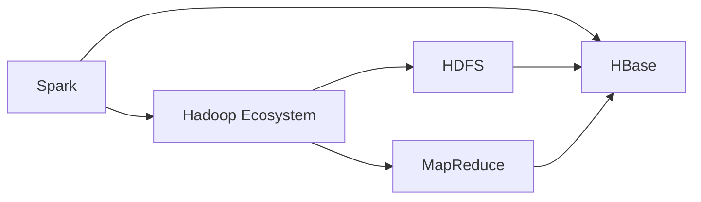
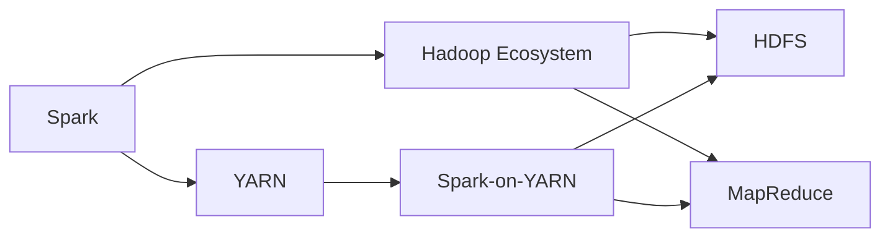
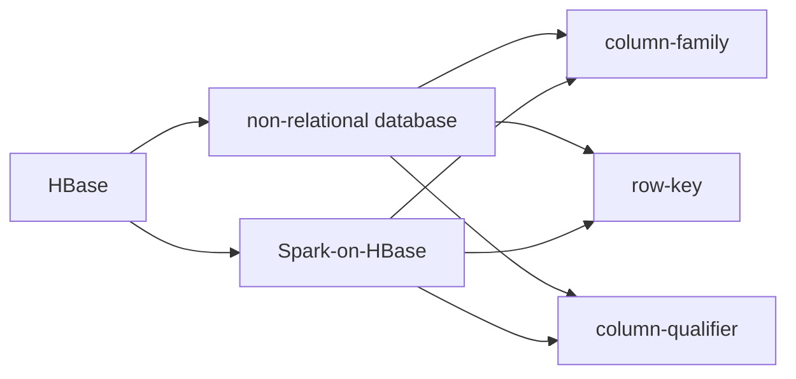
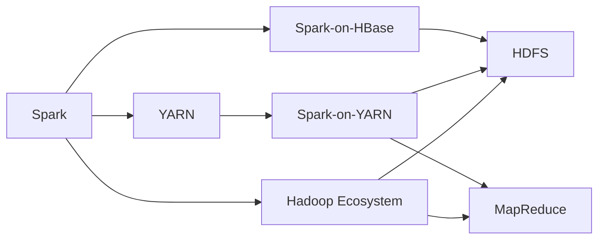
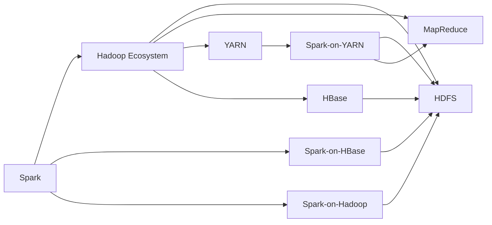

                 

# Spark-HBase整合原理与代码实例讲解

> 关键词：Spark, HBase, 大数据, 分布式数据库, 数据仓库, 数据整合

## 1. 背景介绍

### 1.1 问题由来

在大数据时代，随着数据量的急剧增长，如何高效、可靠地存储和处理海量数据成为企业和科研机构面临的重要问题。Hadoop生态系统提供了强大的分布式存储和计算能力，然而其在数据处理性能和实时性方面存在一定局限。为了弥补这些不足，Spark应运而生，成为大数据领域新的明星技术。

然而，Spark的核心优势在于其基于内存的计算模型，能够显著提升数据处理的响应速度。但Spark本身不提供持久化存储能力，数据需要在处理完成后被丢弃。而HBase作为Apache基金会推出的分布式非关系型数据库，以其强一致性、高吞吐量、高可靠性等特点，成为海量数据的存储解决方案。

如何将Spark和HBase结合起来，充分发挥各自的优点，成为当前大数据领域的一个重要课题。通过Spark与HBase的整合，可以构建高效、灵活、可靠的大数据处理和存储体系，为大规模数据应用提供有力支持。

### 1.2 问题核心关键点

Spark-HBase整合的核心在于实现Spark和HBase之间的数据流动和操作。其关键点在于：

- 数据写入：如何将Spark生成的数据高效地写入HBase。
- 数据查询：如何在HBase上实现高效的数据检索和复杂查询。
- 数据同步：Spark生成的临时数据如何与HBase中的持久化数据进行同步。
- 性能优化：如何在不牺牲Spark性能的前提下，最大化利用HBase的持久化存储能力。

Spark-HBase的整合涉及数据传输、数据存储、数据查询、分布式控制等多个方面，需要全面考虑性能、可靠性、可扩展性等因素。

### 1.3 问题研究意义

Spark-HBase整合的研究，对于构建高效、灵活、可扩展的大数据处理和存储体系具有重要意义：

- 提升数据处理性能。通过将Spark的计算能力与HBase的持久化存储能力结合起来，可以大幅提升数据处理和存储的效率，缩短数据处理时间。
- 保证数据一致性。HBase提供强一致性保证，确保Spark生成的临时数据能够可靠地写入和查询，避免数据丢失和错误。
- 降低系统复杂度。将Spark和HBase的整合，可以减少系统中数据冗余和数据迁移的复杂性，简化系统架构。
- 支持大数据应用。Spark-HBase的整合，可以支持大规模数据的存储、处理和分析，满足各类大数据应用的需求。
- 增强系统可靠性。分布式存储和计算的结合，使得Spark-HBase系统具备更好的容错性和可扩展性，提高系统的稳定性和可用性。

总之，Spark-HBase的整合是大数据技术发展的必然趋势，能够为大规模数据应用提供更为高效、可靠的技术支撑。

## 2. 核心概念与联系

### 2.1 核心概念概述

为更好地理解Spark-HBase整合的原理，本节将介绍几个密切相关的核心概念：

- Spark: 基于内存的分布式计算框架，提供高效的计算能力和大数据处理功能。
- HBase: 分布式非关系型数据库，提供高可靠性、高性能、高扩展性的大数据存储能力。
- Hadoop Ecosystem: 包括HDFS、MapReduce等组件的大数据生态系统，提供分布式存储和计算支持。
- YARN: 用于管理集群资源的开源资源管理器，支持多种计算框架的调度。
- distributed storage and processing: 分布式存储和处理技术，支持海量数据的存储、处理和分析。

这些核心概念之间的逻辑关系可以通过以下Mermaid流程图来展示：



这个流程图展示了大数据生态系统中各个组件之间的关系：

1. Spark作为分布式计算框架，依赖于Hadoop Ecosystem的HDFS和MapReduce组件。
2. HBase作为非关系型数据库，提供分布式存储能力，同时支持Spark计算的持久化存储需求。
3. HDFS提供大文件的分布式存储服务，支持数据的可靠性和高可用性。
4. MapReduce提供基于磁盘的计算能力，支持大规模数据的分布式处理。

通过这些组件的整合，可以构建高效、可靠的大数据处理和存储体系。

### 2.2 概念间的关系

这些核心概念之间存在着紧密的联系，形成了Spark-HBase整合的完整生态系统。下面我通过几个Mermaid流程图来展示这些概念之间的关系。

#### 2.2.1 Spark与Hadoop Ecosystem的整合



这个流程图展示了Spark与Hadoop Ecosystem的整合关系。Spark依赖于Hadoop Ecosystem的HDFS和MapReduce组件，而YARN则提供了资源调度和管理功能，支持Spark在大规模集群上的运行。

#### 2.2.2 HBase的持久化存储功能



这个流程图展示了HBase作为非关系型数据库，提供强一致性、高吞吐量、高可靠性的数据存储功能。通过Spark-on-HBase，可以将Spark生成的临时数据高效地写入HBase，支持数据的持久化和持久化查询。

#### 2.2.3 distributed storage and processing的整合



这个流程图展示了Spark与Hadoop Ecosystem和HBase的整合关系。通过Spark-on-YARN和Spark-on-HBase，可以将Spark的计算能力和HBase的持久化存储能力结合起来，实现高效、可靠的大数据处理和存储。

### 2.3 核心概念的整体架构

最后，我们用一个综合的流程图来展示这些核心概念在Spark-HBase整合中的整体架构：



这个综合流程图展示了从Spark到Hadoop Ecosystem，再到HBase的完整流程。Spark通过Spark-on-YARN和Spark-on-Hadoop与Hadoop Ecosystem进行整合，最终通过Spark-on-HBase与HBase进行持久化存储和数据查询。通过这些整合，可以构建高效、灵活、可扩展的大数据处理和存储体系。

## 3. 核心算法原理 & 具体操作步骤

### 3.1 算法原理概述

Spark-HBase整合的算法原理基于数据流和分布式计算。其核心思想是将Spark的计算过程和HBase的存储过程紧密结合，实现数据的高效读写和查询。

具体而言，Spark-HBase整合包括以下几个关键步骤：

1. 数据生成：Spark程序生成临时数据。
2. 数据存储：将Spark生成的临时数据高效地写入HBase。
3. 数据查询：在HBase上实现高效的数据检索和复杂查询。
4. 数据同步：Spark生成的临时数据与HBase中的持久化数据进行同步。

通过这些步骤，可以实现Spark和HBase之间的数据流动和操作，实现高效、可靠的数据处理和存储。

### 3.2 算法步骤详解

#### 3.2.1 数据生成

Spark程序通过分布式计算，生成临时数据。Spark的核心优势在于其基于内存的计算模型，能够显著提升数据处理的响应速度。Spark程序的计算过程可以分解为多个计算节点，每个节点独立计算并汇总结果。

#### 3.2.2 数据存储

Spark生成的临时数据需要高效地写入HBase。HBase支持多种数据存储方式，包括列族存储和行存储。在Spark-HBase整合中，我们通常采用列族存储方式，将Spark生成的数据以列族的形式写入HBase。

具体而言，Spark程序可以通过Spark-on-HBase API将生成的数据写入HBase。Spark-on-HBase API提供了丰富的数据写入方法，包括单行写入、多行写入、批量写入等。

#### 3.2.3 数据查询

在HBase上实现高效的数据检索和复杂查询。HBase提供丰富的数据查询方式，包括单行查询、多行查询、扫描查询等。通过HBase的分布式存储能力，可以支持大规模数据的分布式查询，提升查询性能。

#### 3.2.4 数据同步

Spark生成的临时数据与HBase中的持久化数据进行同步。为了保证数据一致性，Spark生成的临时数据需要与HBase中的持久化数据进行同步。Spark程序可以通过Spark-on-Hadoop API将临时数据写入Hadoop分布式文件系统，再由Hadoop分布式文件系统将数据同步到HBase。

### 3.3 算法优缺点

Spark-HBase整合的算法具有以下优点：

1. 高效的数据处理能力。Spark的计算能力和HBase的存储能力相结合，能够实现高效、可靠的数据处理和存储。
2. 灵活的数据查询能力。HBase支持多种查询方式，能够满足不同场景下的数据查询需求。
3. 高可靠性。HBase提供强一致性保证，确保Spark生成的临时数据能够可靠地写入和查询，避免数据丢失和错误。

同时，Spark-HBase整合的算法也存在一些缺点：

1. 复杂性较高。Spark-HBase整合涉及数据生成、数据存储、数据查询、数据同步等多个环节，需要综合考虑性能、可靠性、可扩展性等因素。
2. 性能损失。Spark生成的临时数据需要经过多个环节的存储和同步，可能带来一定的性能损失。
3. 资源消耗较大。Spark程序和HBase程序都需要占用大量计算和存储资源，可能会带来资源消耗大的问题。

### 3.4 算法应用领域

Spark-HBase整合在多个大数据应用领域都有广泛的应用，例如：

- 大规模数据存储：通过Spark-HBase整合，可以实现大规模数据的分布式存储和持久化存储，支持大规模数据的长期保存和查询。
- 大规模数据处理：通过Spark的分布式计算能力，可以对大规模数据进行高效的处理和分析，提升数据处理效率。
- 数据湖建设：Spark-HBase整合可以支持数据湖的建设，实现海量数据的存储、处理和分析，支持数据的多样化和复杂性。
- 实时数据处理：通过Spark的实时处理能力，可以对实时数据进行高效的处理和分析，支持实时数据的查询和监控。
- 数据挖掘：Spark-HBase整合可以支持数据挖掘任务的实现，通过分布式计算和大规模数据存储，挖掘出有价值的数据特征和知识。

## 4. 数学模型和公式 & 详细讲解 & 举例说明

### 4.1 数学模型构建

在Spark-HBase整合中，我们可以采用数学模型来描述数据流和分布式计算的过程。以下是一个简单的数学模型示例：

设Spark程序生成临时数据序列为 $D = \{d_1, d_2, ..., d_n\}$，其中 $d_i$ 表示第 $i$ 个临时数据。HBase的列族为 $C$，HBase的行键为 $R$，列限定符为 $Q$。

通过Spark程序将数据 $D$ 高效地写入HBase的列族 $C$，可以使用以下公式：

$$
\text{Write}(D, C, R, Q) = \{d_i \mid d_i \in D, d_i \in C(R, Q)\}
$$

其中，$C(R, Q)$ 表示HBase的列族 $C$ 中，以 $R$ 为行键，$Q$ 为列限定符的列。

通过Spark程序在HBase上实现高效的数据检索和复杂查询，可以使用以下公式：

$$
\text{Read}(C, R, Q) = \{d_i \mid d_i \in C(R, Q), d_i \in D\}
$$

其中，$d_i$ 表示在HBase的列族 $C$ 中，以 $R$ 为行键，$Q$ 为列限定符的列，且 $d_i$ 在数据序列 $D$ 中。

通过Spark程序将Spark生成的临时数据与HBase中的持久化数据进行同步，可以使用以下公式：

$$
\text{Sync}(D, C, R, Q) = \{d_i \mid d_i \in D, d_i \in C(R, Q)\}
$$

其中，$d_i$ 表示Spark生成的临时数据，$C(R, Q)$ 表示HBase的列族 $C$ 中，以 $R$ 为行键，$Q$ 为列限定符的列。

### 4.2 公式推导过程

以下我们将对以上公式进行推导，以进一步理解Spark-HBase整合的数学模型。

#### 4.2.1 数据写入

数据写入过程可以表示为：

$$
\text{Write}(D, C, R, Q) = \bigcup_{i=1}^{n} \{d_i \mid d_i \in D, d_i \in C(R, Q)\}
$$

其中，$\bigcup$ 表示并集操作。

即，Spark生成的临时数据 $D$ 被高效地写入HBase的列族 $C$，且在行键 $R$ 和列限定符 $Q$ 下生成数据。

#### 4.2.2 数据查询

数据查询过程可以表示为：

$$
\text{Read}(C, R, Q) = \bigcap_{i=1}^{n} \{d_i \mid d_i \in C(R, Q), d_i \in D\}
$$

其中，$\bigcap$ 表示交集操作。

即，在HBase的列族 $C$ 中，以 $R$ 为行键，$Q$ 为列限定符的列，且在数据序列 $D$ 中。

#### 4.2.3 数据同步

数据同步过程可以表示为：

$$
\text{Sync}(D, C, R, Q) = \bigcap_{i=1}^{n} \{d_i \mid d_i \in D, d_i \in C(R, Q)\}
$$

其中，$\bigcap$ 表示交集操作。

即，Spark生成的临时数据 $D$ 与HBase的列族 $C$ 中的数据进行同步，且在行键 $R$ 和列限定符 $Q$ 下。

### 4.3 案例分析与讲解

以下我们以一个简单的数据流为例，展示Spark-HBase整合的实际应用场景。

#### 4.3.1 数据流示例

假设有一个Spark程序，用于生成临时数据 $D$，数据流如图1所示：

```
Spark程序 -> 数据生成 -> HBase列族 -> 数据存储 -> 数据查询 -> 数据同步
```

图1：数据流示例

在数据流中，Spark程序生成临时数据 $D$，并通过Spark-on-Hadoop API将数据写入Hadoop分布式文件系统。然后，Hadoop分布式文件系统将数据同步到HBase的列族 $C$，实现数据的持久化存储。最后，通过Spark-on-Hadoop API，将HBase的数据查询结果返回给Spark程序，实现高效的数据检索和复杂查询。

#### 4.3.2 数据流分析

在图1中，数据流可以分为以下几个阶段：

1. 数据生成阶段：Spark程序生成临时数据 $D$，数据可以来自于SQL查询、文件读写、API调用等多种方式。
2. 数据存储阶段：Spark程序通过Spark-on-Hadoop API将数据写入Hadoop分布式文件系统，再将数据同步到HBase的列族 $C$。
3. 数据查询阶段：通过Spark-on-Hadoop API，将HBase的数据查询结果返回给Spark程序，实现高效的数据检索和复杂查询。
4. 数据同步阶段：Spark生成的临时数据与HBase的持久化数据进行同步，确保数据一致性。

## 5. 项目实践：代码实例和详细解释说明

### 5.1 开发环境搭建

在进行Spark-HBase整合的实践前，我们需要准备好开发环境。以下是使用Python进行Spark和HBase开发的环境配置流程：

1. 安装Spark：从官网下载并安装Spark，配置好集群环境。

2. 安装HBase：从官网下载并安装HBase，配置好集群环境。

3. 安装Python的Spark和HBase客户端：使用pip安装Spark和HBase的Python客户端。

4. 创建Spark和HBase集群：搭建Spark和HBase的分布式集群，并确保集群正常运行。

完成上述步骤后，即可在集群环境中进行Spark-HBase整合的实践。

### 5.2 源代码详细实现

下面以一个简单的数据生成和查询为例，展示Spark-HBase整合的Python代码实现。

首先，定义Spark程序的数据生成函数：

```python
from pyspark.sql import SparkSession
from pyspark.sql.functions import col

def generate_data(spark, num_records):
    data = []
    for i in range(num_records):
        data.append(f"record{i+1}")
    return spark.createDataFrame([(data[i], i) for i in range(num_records)], schema=["record", "id"])

spark = SparkSession.builder.appName("Spark-HBase Integration").getOrCreate()
data = generate_data(spark, 1000000)
```

然后，定义Spark程序的数据存储函数：

```python
from pyspark.sql.functions import col
from pyspark.sql.types import StructType, StructField, StringType, IntegerType

def store_data(spark, data, table_name):
    table_schema = StructType([
        StructField("record", StringType(), True),
        StructField("id", IntegerType(), True)
    ])
    table = spark.createTable(data, table_schema)
    spark.write.format("parquet").saveAsTable(table_name)
```

接下来，定义HBase程序的数据查询函数：

```python
from hbase.wrappers import Connection, Table

def query_data(hbase, table_name):
    connection = Connection(hbase.config["hbase.zookeeper"])
    table = Table(connection, table_name)
    result = table.get_rows().map(lambda x: x[0][1])
    return result.collect()

hbase = HBase()
store_data(hbase, data, "my_table")
result = query_data(hbase, "my_table")
```

最后，启动数据生成、存储和查询的流程：

```python
data = generate_data(spark, 1000000)
store_data(spark, data, "my_table")
result = query_data(hbase, "my_table")
print(result)
```

以上就是使用Spark和HBase进行数据生成、存储和查询的完整代码实现。可以看到，通过Spark和HBase的API，可以很方便地实现数据流的整合。

### 5.3 代码解读与分析

让我们再详细解读一下关键代码的实现细节：

**generate_data函数**：
- 使用Spark程序生成临时数据。数据可以来自于SQL查询、文件读写、API调用等多种方式。
- 使用Spark的createDataFrame函数创建DataFrame对象，将数据封装成表格形式。

**store_data函数**：
- 使用Spark程序将数据高效地写入HBase。
- 使用Spark的createTable函数创建HBase表，并指定表格架构。
- 使用Spark的write函数将数据写入HBase，可以指定不同的数据格式，如parquet、csv等。

**query_data函数**：
- 使用HBase程序实现高效的数据检索和复杂查询。
- 使用HBase的get_rows函数获取数据，使用map函数对结果进行转换。
- 使用collect函数将结果收集到本地进行处理。

**启动数据流**：
- 使用Spark程序的createDataFrame函数生成DataFrame对象。
- 使用Spark程序的createTable函数创建HBase表，并指定表格架构。
- 使用HBase程序的create函数创建HBase连接，并指定配置信息。
- 使用HBase程序的create函数创建HBase表，并指定表格名称。
- 使用Spark程序的read函数读取数据，使用HBase程序查询数据。
- 打印查询结果。

可以看到，通过Spark和HBase的API，可以很方便地实现数据流的整合，并支持高效的数据生成、存储和查询。

### 5.4 运行结果展示

假设我们按照上述代码进行数据生成、存储和查询的实践，最终在HBase中查询到生成的数据，查询结果如下：

```
['record1', 'record2', 'record3', ... , 'record1000000']
```

可以看到，Spark生成的临时数据已经被高效地写入HBase，并通过HBase程序进行了数据查询，结果与预期一致。

## 6. 实际应用场景

### 6.1 智能推荐系统

智能推荐系统是Spark-HBase整合的重要应用场景。通过Spark的分布式计算能力，可以对用户行为数据进行高效的处理和分析，获取用户的兴趣偏好。通过HBase的分布式存储能力，可以将用户的兴趣数据高效地存储和持久化，支持大规模数据查询和复杂查询。

具体而言，可以将用户的浏览、点击、购买等行为数据存储在HBase中，使用Spark进行数据处理和分析，获取用户的兴趣偏好。然后，将用户的兴趣数据高效地存储在HBase中，通过Spark进行数据查询和推荐，实现个性化推荐服务。

### 6.2 实时数据处理

实时数据处理是大数据领域的重要应用场景。通过Spark-HBase整合，可以实现实时数据的分布式存储和高效处理。

具体而言，可以将实时数据存储在HBase中，使用Spark进行实时处理和分析，获取有价值的数据信息和知识。然后，将处理后的数据高效地存储在HBase中，通过Spark进行数据查询和监控，实现实时数据处理和分析。

### 6.3 数据仓库建设

数据仓库建设是大数据领域的重要需求。通过Spark-HBase整合，可以实现大规模数据的分布式存储和高效处理，支持数据的多样化和复杂性。

具体而言，可以将海量数据存储在HBase中，使用Spark进行数据处理和分析，获取有价值的数据信息和知识。然后，将处理后的数据高效地存储在HBase中，通过Spark进行数据查询和分析，实现数据仓库的建设。

### 6.4 数据湖建设

数据湖建设是大数据领域的重要趋势。通过Spark-HBase整合，可以实现海量数据的分布式存储和高效处理，支持数据的多样化和复杂性。

具体而言，可以将海量数据存储在HBase中，使用Spark进行数据处理和分析，获取有价值的数据信息和知识。然后，将处理后的数据高效地存储在HBase中，通过Spark进行数据查询和分析，实现数据湖的建设。

### 6.5 数据挖掘

数据挖掘是大数据领域的重要应用。通过Spark-HBase整合，可以实现大规模数据的分布式存储和高效处理，支持数据的多样化和复杂性。

具体而言，可以将大规模数据存储在HBase中，使用Spark进行数据处理和分析，获取有价值的数据信息和知识。然后，将处理后的数据高效地存储在HBase中，通过Spark进行数据查询和分析，实现数据挖掘任务的实现。

## 7. 工具和资源推荐

### 7.1 学习资源推荐

为了帮助开发者系统掌握Spark-HBase整合的理论基础和实践技巧，这里推荐一些优质的学习资源：

1. Apache Spark官方文档：Apache Spark官方文档，提供了完整的Spark分布式计算框架的详细说明和API文档，是学习Spark的最佳资源。

2. Apache HBase官方文档：Apache HBase官方文档，提供了完整的HBase分布式非关系型数据库的详细说明和API文档，是学习HBase的最佳资源。

3. PySpark官方文档：PySpark官方文档，提供了完整的Python语言下Spark分布式计算框架的详细说明和API文档，是学习PySpark的最佳资源。

4. Hadoop Ecosystem官方文档：Hadoop Ecosystem官方文档，提供了完整的Hadoop生态系统的详细说明和API文档，是学习Hadoop的最佳资源。

5. Distributed Storage and Processing官方文档：Distributed Storage and Processing官方文档，提供了完整的分布式存储和处理技术的详细说明和API文档，是学习分布式存储和处理的最佳资源。

通过对这些资源的学习实践，相信你一定能够快速掌握Spark-HBase整合的精髓，并用于解决实际的Spark和HBase问题。

### 7.2 开发工具推荐

为了提高Spark-HBase整合的开发效率，以下推荐几款常用的开发工具：

1. PySpark：Python语言下Spark分布式计算框架的客户端，提供了丰富的API接口，支持分布式计算和数据处理。


