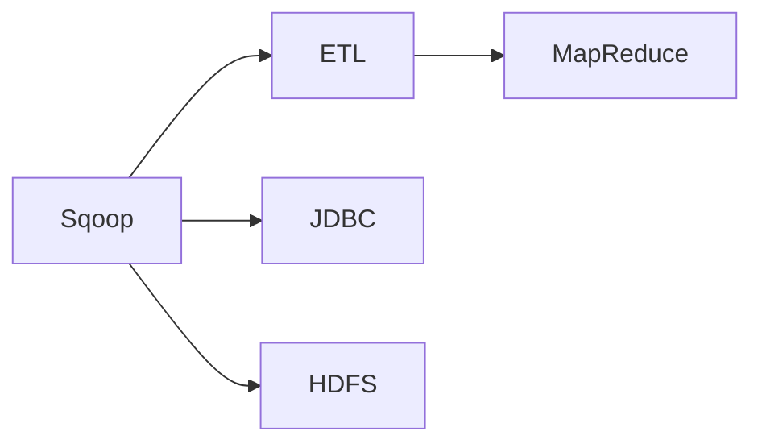

                 

## 1. 背景介绍

### 1.1 问题由来
随着大数据技术的发展，企业的数据规模迅速膨胀。在传统的关系型数据库（如MySQL、Oracle）中，如何高效地将大量数据从Hadoop生态系统导入和导出，成为了一个亟待解决的问题。Sqoop作为一个流行的数据导入/导出工具，可以有效地解决这一问题。

### 1.2 问题核心关键点
Sqoop是Hadoop的一个集成工具，可以将各种关系型数据库中的数据导入Hadoop系统，或者将Hadoop系统中的数据导出到各种关系型数据库。其核心思想是将结构化数据通过ETL（Extract, Transform, Load）的过程，转换为Hadoop系统中的分布式文件系统格式，实现数据的无缝集成。

### 1.3 问题研究意义
Sqoop在企业大数据集成和迁移中扮演着重要角色。通过Sqoop，企业可以高效地将数据从传统的数据库系统导入Hadoop集群，进行大规模数据分析和机器学习，同时也可以将分析结果导出到数据库，进行可视化展示和决策支持。因此，深入理解Sqoop的原理和使用方法，对企业的数据工程实践具有重要意义。

## 2. 核心概念与联系

### 2.1 核心概念概述

为更好地理解Sqoop的工作原理，本节将介绍几个密切相关的核心概念：

- **Sqoop**：Hadoop的集成工具，用于将数据在传统关系型数据库和Hadoop系统之间迁移。
- **ETL**：Extract, Transform, Load的过程，用于将结构化数据转换为适合Hadoop处理的数据格式。
- **JDBC**：Java Database Connectivity，用于与关系型数据库交互的标准API。
- **HDFS**：Hadoop分布式文件系统，用于存储Hadoop集群中的数据。
- **MapReduce**：Hadoop的核心编程模型，用于进行大规模数据处理。

### 2.2 概念间的关系

这些核心概念之间的逻辑关系可以通过以下Mermaid流程图来展示：



这个流程图展示了大语言模型的核心概念及其之间的关系：

1. Sqoop通过ETL过程，将数据从关系型数据库提取出来，并进行转换和加载到Hadoop集群。
2. Sqoop使用JDBC与关系型数据库交互，获取数据。
3. Sqoop将处理后的数据存储在Hadoop的HDFS中。
4. 在Hadoop集群中，使用MapReduce模型对数据进行分布式处理。

### 2.3 核心概念的整体架构

最后，我们用一个综合的流程图来展示这些核心概念在大数据集成中的整体架构：


这个综合流程图展示了从数据源到最终数据输出的完整过程。Sqoop作为数据迁移的桥梁，将数据从关系型数据库抽取出来，通过ETL过程进行转换和加载到Hadoop集群，最终使用MapReduce进行分布式处理，得到输出数据。

## 3. 核心算法原理 & 具体操作步骤
### 3.1 算法原理概述

Sqoop的核心原理是通过ETL过程，将结构化数据从关系型数据库迁移到Hadoop系统中。其基本流程如下：

1. 使用JDBC连接关系型数据库，读取数据。
2. 将数据转换为Hadoop系统能够处理的数据格式。
3. 将转换后的数据加载到Hadoop集群的HDFS中。

Sqoop的核心算法包括：

- 数据提取（Extract）：通过JDBC连接关系型数据库，读取数据。
- 数据转换（Transform）：将提取的数据转换为Hadoop系统中的数据格式。
- 数据加载（Load）：将转换后的数据加载到Hadoop集群中的HDFS。

### 3.2 算法步骤详解

以下是Sqoop的数据迁移过程的详细步骤：

**Step 1: 数据提取**

- 使用JDBC连接关系型数据库。
- 指定需要读取的数据表和字段。
- 设置读取的数据格式，如CSV、JSON等。

**Step 2: 数据转换**

- 将读取的数据转换为Hadoop系统中的数据格式。
- 进行数据清洗、转换、合并等操作。
- 设置数据的分区和分片策略，以便高效存储和处理。

**Step 3: 数据加载**

- 将转换后的数据加载到Hadoop集群中的HDFS中。
- 设置数据的文件格式，如TextFile、SequenceFile等。
- 启动MapReduce任务，对数据进行分布式处理。

### 3.3 算法优缺点

Sqoop作为大数据集成工具，具有以下优点：

- 支持多种关系型数据库的连接。
- 支持多种数据格式的转换。
- 支持MapReduce任务的分布式处理。

同时，Sqoop也存在以下缺点：

- 数据迁移速度较慢，特别是当数据量较大时。
- 对大数据量的数据迁移，可能导致内存不足的问题。
- 对数据转换的处理不够灵活，可能需要编写大量的脚本。

### 3.4 算法应用领域

Sqoop在企业大数据集成中具有广泛的应用，特别是在以下场景中：

- 数据迁移：将传统关系型数据库中的数据迁移到Hadoop集群中。
- 数据清洗：对数据进行清洗和预处理，以便进行后续的分析和处理。
- 数据集成：将来自不同来源的数据进行整合，形成统一的数据仓库。
- 数据可视化：将分析结果导出到数据库中，进行可视化展示和决策支持。

## 4. 数学模型和公式 & 详细讲解
### 4.1 数学模型构建

Sqoop的数据迁移过程可以抽象为以下数学模型：

假设关系型数据库中有 $N$ 条记录，每条记录包含 $M$ 个字段。Sqoop将这 $N$ 条记录转换为 $n$ 个文件，每个文件包含 $m$ 条记录。转换过程可以表示为：

$$
N = \frac{n \times m}{M}
$$

其中 $n$ 和 $m$ 分别为HDFS中的文件数和每条记录的字段数。

### 4.2 公式推导过程

根据上述数学模型，可以推导出以下公式：

$$
n = \frac{N \times M}{m}
$$

即，HDFS中的文件数 $n$ 等于关系型数据库中记录数 $N$ 乘以每条记录的字段数 $M$，除以每条记录在HDFS中的字段数 $m$。

### 4.3 案例分析与讲解

假设关系型数据库中有100,000条记录，每条记录包含5个字段，Sqoop将这100,000条记录转换为10个文件，每个文件包含10,000条记录。根据上述公式，可以计算出：

$$
n = \frac{100,000 \times 5}{10,000} = 10
$$

即，需要10个文件来存储这100,000条记录。每个文件包含10,000条记录，每条记录包含5个字段，转换为HDFS格式后，每个文件的大小为：

$$
文件大小 = \frac{10,000 \times 5}{m}
$$

假设每个字段的大小为1字节，则每个文件的大小为50KB。

## 5. 项目实践：代码实例和详细解释说明
### 5.1 开发环境搭建

在进行Sqoop的数据迁移实践前，我们需要准备好开发环境。以下是使用Java开发Sqoop的环境配置流程：

1. 安装Java JDK：从官网下载并安装Java JDK。
2. 安装Maven：从官网下载并安装Maven。
3. 安装Hadoop：从官网下载并安装Hadoop，并配置好环境变量。
4. 安装Sqoop：在Hadoop的安装目录中找到Sqoop的jar包，并将其配置到Hadoop的环境变量中。

完成上述步骤后，即可在Java环境中开始Sqoop的数据迁移实践。

### 5.2 源代码详细实现

以下是Sqoop将MySQL数据库中的数据导出到Hadoop集群的示例代码：

```java
import org.apache.hadoop.fs.Path;
import org.apache.hadoop.io.Text;
import org.apache.hadoop.mapreduce.Job;
import org.apache.hadoop.mapreduce.Mapper;
import org.apache.hadoop.mapreduce.Reducer;
import org.apache.hadoop.mapreduce.lib.input.FileInputFormat;
import org.apache.hadoop.mapreduce.lib.input.TextInputFormat;
import org.apache.hadoop.mapreduce.lib.output.FileOutputFormat;
import org.apache.hadoop.mapreduce.lib.output.TextOutputFormat;
import java.io.IOException;
import java.sql.*;

public class SqoopExportJob {
    public static class SqoopMapper extends Mapper<LongWritable, Text, Text, Text> {
        private final static int BUFFER_SIZE = 1024 * 4;
        private String[] columnNames;
        private PreparedStatement statement;

        @Override
        protected void setup(Context context) throws IOException, InterruptedException {
            Class.forName("com.mysql.jdbc.Driver");
            String url = "jdbc:mysql://localhost:3306/mydatabase";
            String user = "root";
            String password = "password";
            columnNames = context.getConfiguration().get("column_names", "").split(",");
            statement = context.getConfiguration().get("connection").contains("insert") ?
                null : DriverManager.getConnection(url, user, password).prepareStatement("SELECT " + String.join(", ", columnNames) + " FROM mytable");
        }

        @Override
        protected void map(LongWritable key, Text value, Context context) throws IOException, InterruptedException {
            if (statement != null) {
                ResultSet resultSet = statement.executeQuery(value.toString());
                while (resultSet.next()) {
                    String[] row = new String[columnNames.length];
                    for (int i = 0; i < columnNames.length; i++) {
                        row[i] = resultSet.getString(columnNames[i]);
                    }
                    context.write(new Text(row[0]), new Text(String.join("\t", row)));
                }
            }
        }

        @Override
        protected void cleanup(Context context) throws IOException, InterruptedException {
            if (statement != null) {
                statement.close();
            }
        }
    }

    public static class SqoopReducer extends Reducer<Text, Text, Text, Text> {
        @Override
        protected void reduce(Text key, Iterable<Text> values, Context context) throws IOException, InterruptedException {
            StringBuilder sb = new StringBuilder();
            for (Text value : values) {
                sb.append(value.toString());
                sb.append("\n");
            }
            context.write(new Text(key), new Text(sb.toString()));
        }
    }

    public static void main(String[] args) throws Exception {
        Configuration conf = new Configuration();
        Job job = Job.getInstance(conf, "SqoopExportJob");
        job.setJarByClass(SqoopExportJob.class);
        job.setMapperClass(SqoopMapper.class);
        job.setReducerClass(SqoopReducer.class);
        job.setOutputKeyClass(Text.class);
        job.setOutputValueClass(Text.class);
        FileInputFormat.addInputPath(job, new Path(args[0]));
        FileOutputFormat.setOutputPath(job, new Path(args[1]));
        job.waitForCompletion(true);
    }
}
```

### 5.3 代码解读与分析

让我们再详细解读一下关键代码的实现细节：

**SqoopMapper类**：
- `setup`方法：连接数据库，并获取需要读取的表和字段名。
- `map`方法：将读取的数据转换为Hadoop系统中的数据格式，并进行分片存储。
- `cleanup`方法：关闭数据库连接。

**SqoopReducer类**：
- `reduce`方法：将多个分片文件合并为一个文件。

### 5.4 运行结果展示

假设在Hadoop集群中的HDFS上已经存在一个名为`input`的文件夹，该文件夹包含MySQL数据库中的数据。使用以下命令启动Sqoop作业：

```bash
$ hadoop jar sqoop-job.jar com.example.SqoopExportJob input /output
```

启动后，Sqoop会读取`input`文件夹中的数据，并将其转换为Hadoop系统中的数据格式，存储在`/output`文件夹中。

## 6. 实际应用场景
### 6.1 数据迁移

Sqoop在数据迁移中具有广泛的应用。例如，将企业的历史数据从传统的关系型数据库（如MySQL、Oracle）迁移到Hadoop集群，可以更好地支持大数据分析、机器学习等任务。

### 6.2 数据清洗

Sqoop可以帮助企业对数据进行清洗和预处理，以便进行后续的分析和处理。例如，将来自不同来源的数据进行整合，形成统一的数据仓库。

### 6.3 数据可视化

Sqoop可以将分析结果导出到数据库中，进行可视化展示和决策支持。例如，将Hadoop集群中的分析结果导出到MySQL数据库，进行可视化展示，帮助企业进行决策。

### 6.4 未来应用展望

随着Hadoop生态系统的不断发展和完善，Sqoop的应用场景将更加广泛。未来，Sqoop有望支持更多种类的数据源和数据格式，提供更加灵活的数据转换和处理能力。同时，Sqoop也将与更多的大数据处理工具集成，如Hive、Spark等，形成完整的大数据处理生态系统。

## 7. 工具和资源推荐
### 7.1 学习资源推荐

为了帮助开发者系统掌握Sqoop的原理和使用方法，这里推荐一些优质的学习资源：

1. **《Hadoop生态系统全栈技术教程》**：该书详细介绍了Hadoop生态系统的各个组件，包括Sqoop的使用方法。
2. **《大数据技术权威指南》**：该书系统讲解了大数据技术的各个方面，包括Sqoop的数据迁移过程。
3. **《Sqoop实战》**：该书通过多个实际案例，深入讲解了Sqoop的使用方法和技巧。
4. **Hadoop官方文档**：Hadoop的官方文档包含了Sqoop的使用说明和配置方法，是学习Sqoop的重要参考。
5. **Sqoop官方文档**：Sqoop的官方文档详细介绍了Sqoop的使用方法和API接口，是学习Sqoop的必备资料。

通过对这些资源的学习实践，相信你一定能够快速掌握Sqoop的原理和使用方法，并用于解决实际的Hadoop数据迁移问题。

### 7.2 开发工具推荐

高效的开发离不开优秀的工具支持。以下是几款用于Sqoop开发和部署的工具：

1. **Maven**：Java开发项目的构建工具，用于管理依赖、编译、打包等任务。
2. **Hadoop**：Hadoop生态系统的核心组件，用于存储和处理大规模数据。
3. **Hive**：基于Hadoop的数据仓库系统，用于进行SQL查询和数据处理。
4. **Spark**：基于Hadoop的分布式计算框架，用于进行大数据处理和机器学习。
5. **JIRA**：项目管理工具，用于跟踪和管理Sqoop项目的任务和进度。

合理利用这些工具，可以显著提升Sqoop的数据迁移效率，加快创新迭代的步伐。

### 7.3 相关论文推荐

Sqoop在企业大数据集成中具有广泛的应用，以下是几篇奠基性的相关论文，推荐阅读：

1. **《Hadoop：下一代数据处理技术》**：该论文介绍了Hadoop的架构和设计思想，是学习Sqoop的必备参考资料。
2. **《大规模数据处理技术》**：该论文系统讲解了大数据处理技术的发展历程和未来趋势，是学习Sqoop的重要参考。
3. **《Sqoop在Hadoop生态系统中的应用》**：该论文详细介绍了Sqoop在大数据集成中的应用场景和使用方法。
4. **《Hadoop数据迁移技术》**：该论文深入探讨了Hadoop数据迁移的原理和实现方法，是学习Sqoop的宝贵参考资料。

这些论文代表了大数据技术的发展脉络。通过学习这些前沿成果，可以帮助研究者把握学科前进方向，激发更多的创新灵感。

除上述资源外，还有一些值得关注的前沿资源，帮助开发者紧跟大数据技术的最新进展，例如：

1. **arXiv论文预印本**：人工智能领域最新研究成果的发布平台，包括大量尚未发表的前沿工作，学习前沿技术的必读资源。
2. **业界技术博客**：如Hadoop、Spark等主流技术的官方博客，第一时间分享他们的最新研究成果和洞见。
3. **技术会议直播**：如HadoopCon、Spark Summit等大会现场或在线直播，能够聆听到技术大佬的前沿分享，开拓视野。
4. **GitHub热门项目**：在GitHub上Star、Fork数最多的Sqoop相关项目，往往代表了该技术领域的发展趋势和最佳实践，值得去学习和贡献。
5. **行业分析报告**：各大咨询公司如McKinsey、PwC等针对大数据行业的分析报告，有助于从商业视角审视技术趋势，把握应用价值。

总之，对于Sqoop的学习和实践，需要开发者保持开放的心态和持续学习的意愿。多关注前沿资讯，多动手实践，多思考总结，必将收获满满的成长收益。

## 8. 总结：未来发展趋势与挑战
### 8.1 总结

本文对Sqoop的数据迁移过程进行了全面系统的介绍。首先阐述了Sqoop的数据迁移背景和意义，明确了Sqoop在企业大数据集成中的重要价值。其次，从原理到实践，详细讲解了Sqoop的数学模型和算法过程，给出了数据迁移的完整代码实例。同时，本文还广泛探讨了Sqoop在不同场景中的应用，展示了Sqoop的广泛适用性。最后，本文精选了Sqoop的学习资源和开发工具，力求为读者提供全方位的技术指引。

通过本文的系统梳理，可以看到，Sqoop作为Hadoop生态系统的关键组件，在企业大数据集成中扮演着重要角色。通过Sqoop，企业可以高效地将数据从传统的关系型数据库迁移到Hadoop集群，进行大规模数据分析和机器学习，同时也可以将分析结果导出到数据库，进行可视化展示和决策支持。

### 8.2 未来发展趋势

展望未来，Sqoop在企业大数据集成中仍将发挥重要作用。其发展趋势包括：

1. **支持更多数据源和数据格式**：未来Sqoop有望支持更多种类的数据源和数据格式，如NoSQL数据库、JSON数据等，提供更加灵活的数据转换和处理能力。
2. **提升数据迁移速度**：通过优化算法和工具，提升Sqoop的数据迁移速度，减少内存和I/O瓶颈。
3. **与更多大数据处理工具集成**：Sqoop将与更多的大数据处理工具集成，如Hive、Spark等，形成完整的大数据处理生态系统。
4. **引入更多数据转换和清洗技术**：通过引入更多的数据转换和清洗技术，如数据去重、数据标准化等，提高数据的质量和可用性。
5. **支持更多的分布式计算框架**：未来Sqoop将支持更多的分布式计算框架，如Flink、Kafka等，提供更加灵活的数据处理能力。

### 8.3 面临的挑战

尽管Sqoop在企业大数据集成中取得了显著成果，但在未来发展过程中，仍面临以下挑战：

1. **数据迁移速度慢**：当数据量较大时，Sqoop的数据迁移速度较慢，可能会导致I/O瓶颈。
2. **内存不足问题**：对于大数据量的数据迁移，可能导致内存不足的问题，需要优化内存使用。
3. **数据转换复杂**：Sqoop的数据转换过程较为复杂，需要编写大量的脚本和配置文件。
4. **依赖Hadoop环境**：Sqoop的运行需要Hadoop环境，部署和管理相对复杂。
5. **技术演进速度快**：大数据技术发展迅速，Sqoop需要不断更新和改进，以跟上技术发展的步伐。

### 8.4 研究展望

面对Sqoop所面临的挑战，未来的研究需要在以下几个方面寻求新的突破：

1. **优化数据迁移速度**：通过优化算法和工具，提升Sqoop的数据迁移速度，减少内存和I/O瓶颈。
2. **优化内存使用**：通过改进数据转换和存储方式，优化内存使用，支持更多的大数据量迁移。
3. **简化数据转换过程**：引入更多的数据转换和清洗技术，简化数据转换过程，提高数据迁移效率。
4. **引入更多大数据处理工具**：Sqoop将与更多的大数据处理工具集成，形成完整的大数据处理生态系统。
5. **引入更多分布式计算框架**：支持更多的分布式计算框架，提供更加灵活的数据处理能力。

这些研究方向的探索，必将引领Sqoop走向更高的台阶，为企业的大数据集成提供更加高效、灵活的解决方案。

## 9. 附录：常见问题与解答

**Q1：Sqoop在数据迁移过程中如何保证数据的安全性和完整性？**

A: Sqoop通过以下方式保证数据的安全性和完整性：

1. 数据备份：在迁移前，对数据进行备份，以防止数据丢失。
2. 事务控制：Sqoop支持事务控制，确保数据迁移过程中的一致性和可靠性。
3. 数据校验：Sqoop在数据迁移过程中进行数据校验，确保数据的完整性和一致性。

**Q2：如何优化Sqoop的数据迁移速度？**

A: 可以通过以下方式优化Sqoop的数据迁移速度：

1. 增加并发度：通过配置Hadoop的并发度，提升数据迁移速度。
2. 优化数据格式：优化数据格式，减少数据转换和处理的时间。
3. 使用分布式计算框架：使用分布式计算框架，如Spark、Flink等，提高数据迁移效率。

**Q3：Sqoop在数据迁移过程中如何处理数据转换复杂问题？**

A: 可以通过以下方式处理Sqoop的数据转换复杂问题：

1. 使用脚本化配置：使用脚本化配置，简化数据转换过程。
2. 引入数据转换工具：引入数据转换工具，如ETL工具，提高数据转换的效率。
3. 引入更多的数据转换技术：引入更多的数据转换技术，如数据去重、数据标准化等，提高数据转换的质量和效率。

**Q4：Sqoop在Hadoop集群中的部署和管理有哪些注意事项？**

A: 在Hadoop集群中部署和管理Sqoop时，需要注意以下事项：

1. 环境配置：确保Hadoop环境配置正确，Sqoop能够正常运行。
2. 依赖管理：管理好Sqoop的依赖关系，避免依赖冲突。
3. 性能优化：优化Sqoop的性能，避免内存和I/O瓶颈。
4. 数据安全性：确保数据在迁移过程中的安全性，避免数据泄露和损坏。

**Q5：Sqoop的未来发展方向有哪些？**

A: Sqoop的未来发展方向包括：

1. 支持更多数据源和数据格式。
2. 提升数据迁移速度，优化内存使用。
3. 简化数据转换过程，提高数据迁移效率。
4. 引入更多分布式计算框架，提供更加灵活的数据处理能力。
5. 引入更多的数据转换和清洗技术，提高数据的质量和可用性。

这些未来发展方向将引领Sqoop走向更高的台阶，为企业的Big Data集成提供更加高效、灵活的解决方案。

---

作者：禅与计算机程序设计艺术 / Zen and the Art of Computer Programming

