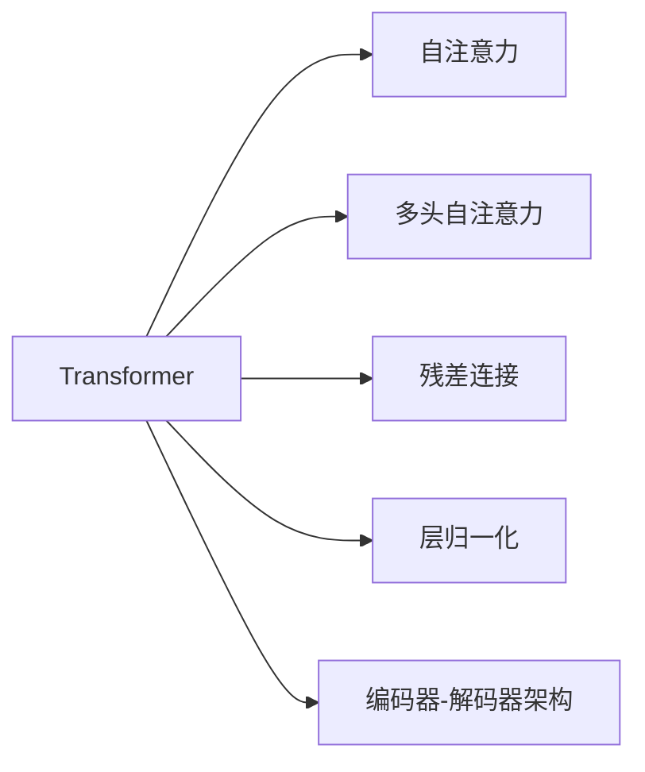

                 

# Transformer架构剖析

> 关键词：Transformer, 自注意力, 多头自注意力, 残差连接, 层归一化, 编码器-解码器架构

## 1. 背景介绍

### 1.1 问题由来

随着深度学习在计算机视觉、自然语言处理等领域的应用越来越广泛，传统的卷积神经网络（CNN）和循环神经网络（RNN）在处理长序列数据时遇到了一些挑战，如梯度消失、计算复杂度高、难以并行处理等。为了应对这些问题，研究者们提出了一些新的网络结构，其中最著名的是2017年发布的Transformer架构。

### 1.2 问题核心关键点

Transformer架构的关键点在于其自注意力机制和多头自注意力机制，这些机制使得Transformer能够处理长序列数据，并且具有并行计算的特性。Transformer架构的提出极大地推动了自然语言处理领域的发展，如机器翻译、文本生成、语音识别等任务都取得了显著的进展。

### 1.3 问题研究意义

研究Transformer架构，对于拓展深度学习的应用范围，提升计算机视觉、自然语言处理等领域的模型性能，加速人工智能技术的产业化进程，具有重要意义：

1. 提升模型性能。Transformer架构以其自注意力机制和多头自注意力机制，能够处理长序列数据，并且具有并行计算的特性，从而提升了模型在各种任务上的性能。
2. 通用适用。Transformer架构在计算机视觉、自然语言处理等多个领域都有广泛的应用，具有很强的通用性。
3. 参数高效。Transformer架构中，多头自注意力机制使用权重矩阵进行参数共享，从而降低了模型的参数量，提高了模型的训练和推理效率。
4. 模型复杂度低。Transformer架构中，残差连接和层归一化技术，使得模型具有更低的复杂度，更容易优化。
5. 适应性广。Transformer架构适用于各种序列数据处理任务，如机器翻译、文本生成、语音识别等，具有很强的适应性。

## 2. 核心概念与联系

### 2.1 核心概念概述

为更好地理解Transformer架构，本节将介绍几个密切相关的核心概念：

- Transformer：一种基于自注意力机制的神经网络架构，主要应用于自然语言处理领域。
- 自注意力（Self-Attention）：一种通过计算每个位置与其它位置的相关度来处理序列数据的技术。
- 多头自注意力（Multi-Head Self-Attention）：通过多个并行自注意力子层来同时处理多个特征子空间的自注意力机制。
- 残差连接（Residual Connection）：通过将输入和输出进行加和，来缓解模型在深层网络中的梯度消失问题。
- 层归一化（Layer Normalization）：通过归一化层输入的均值和方差，来加速模型收敛和减少内部协变量移位。
- 编码器-解码器架构（Encoder-Decoder Architecture）：一种常用的序列数据处理架构，其中编码器用于提取序列特征，解码器用于生成输出。

这些核心概念之间的逻辑关系可以通过以下Mermaid流程图来展示：



这个流程图展示了大语言模型微调过程中各个核心概念的关系和作用：

1. Transformer架构是整个模型的核心，通过自注意力机制和多头自注意力机制来处理序列数据。
2. 自注意力机制是Transformer的关键，它通过计算每个位置与其它位置的相关度，来捕捉序列中的依赖关系。
3. 多头自注意力机制通过多个并行自注意力子层，同时处理多个特征子空间的自注意力，提高了模型对序列特征的表示能力。
4. 残差连接和层归一化技术，使得模型在深层网络中仍然能够有效地进行梯度传递和收敛。
5. 编码器-解码器架构，适用于各种序列数据处理任务，如机器翻译、文本生成、语音识别等。

## 3. 核心算法原理 & 具体操作步骤

### 3.1 算法原理概述

Transformer架构的核心算法原理是自注意力机制和多头自注意力机制。自注意力机制通过计算序列中每个位置与其它位置的相关度，来捕捉序列中的依赖关系。多头自注意力机制通过多个并行自注意力子层，同时处理多个特征子空间的自注意力，提高了模型对序列特征的表示能力。

Transformer架构的编码器和解码器都由多个层（Layer）组成，每个层包含两个子层：多头自注意力子层和前馈神经网络（Feed-Forward Network）子层。编码器-解码器架构中的解码器还包含一个输出层和残差连接。

### 3.2 算法步骤详解

Transformer架构的编码器和解码器可以分别通过以下步骤进行计算：

**编码器计算步骤**：

1. 对输入序列进行编码，得到编码器输出。
2. 通过多头自注意力子层和前馈神经网络子层进行多层处理，得到编码器输出。
3. 对编码器输出进行残差连接和层归一化。
4. 将编码器输出和输入序列拼接，通过多个编码器层进行多次处理。
5. 对编码器输出进行层归一化，得到编码器最终输出。

**解码器计算步骤**：

1. 对输入序列进行编码，得到解码器输出。
2. 通过多头自注意力子层和前馈神经网络子层进行多层处理，得到解码器输出。
3. 对解码器输出进行残差连接和层归一化。
4. 将解码器输出和编码器输出拼接，通过多个解码器层进行多次处理。
5. 对解码器输出进行残差连接和层归一化，得到解码器最终输出。
6. 对解码器最终输出进行预测，得到输出序列。

### 3.3 算法优缺点

Transformer架构具有以下优点：

1. 处理长序列数据的能力强。自注意力机制和多头自注意力机制，使得Transformer能够处理长序列数据。
2. 并行计算能力强。Transformer架构中，每个位置的计算是相互独立的，因此可以通过并行计算加速计算过程。
3. 模型表达能力强。多头自注意力机制能够同时处理多个特征子空间，提高了模型对序列特征的表示能力。
4. 模型复杂度低。Transformer架构中，残差连接和层归一化技术，使得模型具有更低的复杂度，更容易优化。
5. 模型可解释性强。Transformer架构的每个层都包含多个子层，每个子层的处理过程都是可解释的。

同时，Transformer架构也存在一些缺点：

1. 需要大量标注数据。由于Transformer架构需要大量的标注数据进行训练，因此对于一些小数据集，模型的性能可能不尽如人意。
2. 计算资源需求高。Transformer架构需要大量的计算资源进行训练和推理，因此对于一些计算资源有限的环境，可能难以进行大模型的训练和推理。
3. 训练时间较长。由于Transformer架构的计算量较大，因此训练时间较长。
4. 存在梯度消失问题。由于Transformer架构的深度较大，因此存在梯度消失问题，需要进行一些优化策略来解决。

### 3.4 算法应用领域

Transformer架构在自然语言处理领域已经得到了广泛的应用，如机器翻译、文本生成、语音识别等任务，并且取得了显著的进展。除此之外，Transformer架构还应用于计算机视觉、音频处理等领域，如图像生成、视频处理、语音合成等任务。

Transformer架构的应用领域还包括：

1. 机器翻译：通过编码器和解码器，将一种语言的句子翻译成另一种语言的句子。
2. 文本生成：通过解码器，生成与输入序列相似的文本。
3. 语音识别：通过编码器和解码器，将音频信号转换为文本。
4. 图像生成：通过编码器和解码器，将输入图像生成新的图像。
5. 视频处理：通过编码器和解码器，对输入视频进行处理和生成。
6. 语音合成：通过编码器和解码器，将文本转换为音频信号。

## 4. 数学模型和公式 & 详细讲解 & 举例说明

### 4.1 数学模型构建

Transformer架构的数学模型构建主要包括以下几个步骤：

1. 输入序列 $x$ 表示为 $x=[x_1, x_2, ..., x_n]$，其中 $x_i$ 表示第 $i$ 个位置。
2. 输入序列经过嵌入层（Embedding Layer）映射为向量表示 $X=[x_1, x_2, ..., x_n] \in \mathbb{R}^{n \times d}$，其中 $d$ 表示嵌入维度。
3. 将输入序列 $X$ 进行多头自注意力处理，得到自注意力输出 $X_a=[x_a^1, x_a^2, ..., x_a^n] \in \mathbb{R}^{n \times d_a}$，其中 $d_a$ 表示多头自注意力子层输出的维度。
4. 对自注意力输出 $X_a$ 进行前馈神经网络处理，得到前馈输出 $X_f=[x_f^1, x_f^2, ..., x_f^n] \in \mathbb{R}^{n \times d_f}$，其中 $d_f$ 表示前馈神经网络子层输出的维度。
5. 对前馈输出 $X_f$ 进行残差连接和层归一化，得到编码器输出 $X_e=[x_e^1, x_e^2, ..., x_e^n] \in \mathbb{R}^{n \times d}$。

**解码器计算步骤**：

1. 对输入序列进行编码，得到解码器输出 $Y=[y_1, y_2, ..., y_n]$。
2. 对输入序列进行嵌入层映射，得到嵌入向量 $Y=[y_1, y_2, ..., y_n] \in \mathbb{R}^{n \times d}$。
3. 对嵌入向量 $Y$ 进行多头自注意力处理，得到自注意力输出 $Y_a=[y_a^1, y_a^2, ..., y_a^n] \in \mathbb{R}^{n \times d_a}$。
4. 对自注意力输出 $Y_a$ 进行前馈神经网络处理，得到前馈输出 $Y_f=[y_f^1, y_f^2, ..., y_f^n] \in \mathbb{R}^{n \times d_f}$。
5. 对前馈输出 $Y_f$ 进行残差连接和层归一化，得到解码器输出 $Y_d=[y_d^1, y_d^2, ..., y_d^n] \in \mathbb{R}^{n \times d}$。
6. 将解码器输出 $Y_d$ 和编码器输出 $X_e$ 拼接，通过多个解码器层进行多次处理。
7. 对解码器输出进行残差连接和层归一化，得到解码器最终输出 $Y_d=[y_d^1, y_d^2, ..., y_d^n] \in \mathbb{R}^{n \times d}$。
8. 对解码器最终输出进行预测，得到输出序列 $Y_o=[o_1, o_2, ..., o_n] \in \mathbb{R}^{n \times d_o}$，其中 $d_o$ 表示输出序列的维度。

### 4.2 公式推导过程

以下是Transformer架构中多头自注意力机制的公式推导过程：

1. 对输入序列 $x$ 进行嵌入层映射，得到嵌入向量 $X=[x_1, x_2, ..., x_n] \in \mathbb{R}^{n \times d}$。
2. 对嵌入向量 $X$ 进行线性变换，得到查询向量 $Q=[q_1, q_2, ..., q_n] \in \mathbb{R}^{n \times d_a}$，键向量 $K=[k_1, k_2, ..., k_n] \in \mathbb{R}^{n \times d_a}$，值向量 $V=[v_1, v_2, ..., v_n] \in \mathbb{R}^{n \times d_a}$。
3. 对查询向量 $Q$ 进行缩放，得到缩放查询向量 $Q_s=\sqrt{d_a}Q \in \mathbb{R}^{n \times d_a}$。
4. 对键向量 $K$ 进行转置和展开，得到键向量矩阵 $K^T=[k_1, k_2, ..., k_n] \in \mathbb{R}^{d_a \times n}$。
5. 计算查询向量与键向量矩阵的点积，得到注意力得分矩阵 $S=\frac{Q_s^TK^T}{\sqrt{d_a}} \in \mathbb{R}^{n \times n}$。
6. 对注意力得分矩阵 $S$ 进行softmax操作，得到注意力权重矩阵 $A=[a_1, a_2, ..., a_n] \in \mathbb{R}^{n \times n}$。
7. 对值向量 $V$ 进行转置和展开，得到值向量矩阵 $V=[v_1, v_2, ..., v_n] \in \mathbb{R}^{d_a \times n}$。
8. 对注意力权重矩阵 $A$ 进行转置和展开，得到注意力权重向量 $A_w=[a_1, a_2, ..., a_n] \in \mathbb{R}^{n \times d_a}$。
9. 对注意力权重向量 $A_w$ 与值向量矩阵 $V$ 进行矩阵乘法，得到注意力输出向量 $Z=[z_1, z_2, ..., z_n] \in \mathbb{R}^{n \times d_a}$。
10. 对注意力输出向量 $Z$ 进行线性变换，得到多头自注意力输出 $X_a=[x_a^1, x_a^2, ..., x_a^n] \in \mathbb{R}^{n \times d_a}$。

### 4.3 案例分析与讲解

**案例分析1：机器翻译**

机器翻译是Transformer架构最常见的应用场景之一。以中英文翻译为例，假设输入序列为 "I like coffee"，输出序列为 "我喜欢咖啡"。使用Transformer架构进行机器翻译的步骤如下：

1. 将输入序列进行嵌入层映射，得到嵌入向量 $X=[I, like, coffee] \in \mathbb{R}^{3 \times d}$。
2. 对嵌入向量 $X$ 进行多头自注意力处理，得到自注意力输出 $X_a=[x_a^1, x_a^2, x_a^3] \in \mathbb{R}^{3 \times d_a}$。
3. 对自注意力输出 $X_a$ 进行前馈神经网络处理，得到前馈输出 $X_f=[x_f^1, x_f^2, x_f^3] \in \mathbb{R}^{3 \times d_f}$。
4. 对前馈输出 $X_f$ 进行残差连接和层归一化，得到编码器输出 $X_e=[x_e^1, x_e^2, x_e^3] \in \mathbb{R}^{3 \times d}$。
5. 将编码器输出 $X_e$ 和输入序列 $X$ 拼接，通过多个编码器层进行多次处理，得到编码器最终输出 $X_o=[x_o^1, x_o^2, x_o^3] \in \mathbb{R}^{3 \times d}$。
6. 对编码器最终输出 $X_o$ 进行解码器计算，得到解码器输出 $Y_d=[y_d^1, y_d^2, y_d^3] \in \mathbb{R}^{3 \times d}$。
7. 对解码器输出进行残差连接和层归一化，得到解码器最终输出 $Y_d=[y_d^1, y_d^2, y_d^3] \in \mathbb{R}^{3 \times d}$。
8. 对解码器最终输出进行预测，得到输出序列 $Y_o=[o_1, o_2, o_3] \in \mathbb{R}^{3 \times d_o}$，其中 $d_o$ 表示输出序列的维度。
9. 对输出序列进行解码，得到机器翻译的结果 "我喜欢咖啡"。

**案例分析2：文本生成**

文本生成是Transformer架构的另一个常见应用场景。以生成文章标题为例，假设输入序列为 "AI technology is revolutionizing the world"，输出序列为 "AI technology revolutionizing the world"。使用Transformer架构进行文本生成的步骤如下：

1. 将输入序列进行嵌入层映射，得到嵌入向量 $X=[AI, technology, is, revolutionizing, the, world] \in \mathbb{R}^{7 \times d}$。
2. 对嵌入向量 $X$ 进行多头自注意力处理，得到自注意力输出 $X_a=[x_a^1, x_a^2, x_a^3, x_a^4, x_a^5, x_a^6, x_a^7] \in \mathbb{R}^{7 \times d_a}$。
3. 对自注意力输出 $X_a$ 进行前馈神经网络处理，得到前馈输出 $X_f=[x_f^1, x_f^2, x_f^3, x_f^4, x_f^5, x_f^6, x_f^7] \in \mathbb{R}^{7 \times d_f}$。
4. 对前馈输出 $X_f$ 进行残差连接和层归一化，得到编码器输出 $X_e=[x_e^1, x_e^2, x_e^3, x_e^4, x_e^5, x_e^6, x_e^7] \in \mathbb{R}^{7 \times d}$。
5. 将编码器输出 $X_e$ 和输入序列 $X$ 拼接，通过多个编码器层进行多次处理，得到编码器最终输出 $X_o=[x_o^1, x_o^2, x_o^3, x_o^4, x_o^5, x_o^6, x_o^7] \in \mathbb{R}^{7 \times d}$。
6. 对编码器最终输出 $X_o$ 进行解码器计算，得到解码器输出 $Y_d=[y_d^1, y_d^2, y_d^3, y_d^4, y_d^5, y_d^6, y_d^7] \in \mathbb{R}^{7 \times d}$。
7. 对解码器输出进行残差连接和层归一化，得到解码器最终输出 $Y_d=[y_d^1, y_d^2, y_d^3, y_d^4, y_d^5, y_d^6, y_d^7] \in \mathbb{R}^{7 \times d}$。
8. 对解码器最终输出进行预测，得到输出序列 $Y_o=[o_1, o_2, o_3, o_4, o_5, o_6, o_7] \in \mathbb{R}^{7 \times d_o}$，其中 $d_o$ 表示输出序列的维度。
9. 对输出序列进行解码，得到文本生成的结果 "AI technology revolutionizing the world"。

## 5. 项目实践：代码实例和详细解释说明

### 5.1 开发环境搭建

在进行Transformer架构的实践前，我们需要准备好开发环境。以下是使用Python进行TensorFlow开发的环境配置流程：

1. 安装Anaconda：从官网下载并安装Anaconda，用于创建独立的Python环境。

2. 创建并激活虚拟环境：
```bash
conda create -n tf-env python=3.8 
conda activate tf-env
```

3. 安装TensorFlow：根据CUDA版本，从官网获取对应的安装命令。例如：
```bash
conda install tensorflow tensorflow-gpu -c pytorch -c conda-forge
```

4. 安装各类工具包：
```bash
pip install numpy pandas scikit-learn matplotlib tqdm jupyter notebook ipython
```

完成上述步骤后，即可在`tf-env`环境中开始Transformer架构的实践。

### 5.2 源代码详细实现

下面我们以机器翻译任务为例，给出使用TensorFlow实现Transformer架构的代码实现。

首先，定义Transformer架构的编码器和解码器：

```python
import tensorflow as tf
import tensorflow.keras.layers as layers
import tensorflow.keras.models as models

class Transformer(tf.keras.Model):
    def __init__(self, num_layers, d_model, num_heads, dff, input_vocab_size, target_vocab_size, pe_input, pe_target, rate=0.1):
        super(Transformer, self).__init__()
        self.d_model = d_model
        self.num_layers = num_layers
        
        self.encoder = tf.keras.layers.Embedding(input_vocab_size, d_model)
        self.encoder_norm = layers.LayerNormalization(epsilon=1e-6)
        self.encoder_ff = self._make_ff(d_model, dff, rate)
        
        self.encoder_attn = MultiHeadAttention(num_heads, d_model)
        self.encoder_self_attn = MultiHeadAttention(num_heads, d_model)
        
        self.encoder_final = layers.Dense(target_vocab_size)
        
        self.decoder = tf.keras.layers.Embedding(target_vocab_size, d_model)
        self.decoder_norm = layers.LayerNormalization(epsilon=1e-6)
        self.decoder_ff = self._make_ff(d_model, dff, rate)
        
        self.decoder_attn = MultiHeadAttention(num_heads, d_model)
        self.decoder_self_attn = MultiHeadAttention(num_heads, d_model)
        
        self.decoder_final = layers.Dense(target_vocab_size)
        
    def call(self, inputs, training=False):
        x = self.encoder(inputs)
        x = self.encoder_norm(x)
        
        for i in range(self.num_layers):
            attn_output, attn_weights = self.encoder_attn(x, x, x, training=training)
            x = x + attn_output
            x = self.encoder_self_attn(x, x, x, training=training)
            x = self.encoder_ff(x)
            x = self.encoder_norm(x)
        
        y = self.decoder(inputs)
        y = self.decoder_norm(y)
        
        for i in range(self.num_layers):
            attn_output, attn_weights = self.decoder_attn(y, x, x, training=training)
            y = y + attn_output
            y = self.decoder_self_attn(y, y, y, training=training)
            y = self.decoder_ff(y)
            y = self.decoder_norm(y)
        
        y = self.decoder_final(y)
        
        return x, y, attn_weights

    def _make_ff(self, d_model, dff, rate):
        return tf.keras.Sequential([
            layers.Dense(dff, activation='relu'),
            layers.Dropout(rate),
            layers.Dense(d_model)
        ])
```

然后，定义MultiHeadAttention类，用于实现多头自注意力机制：

```python
class MultiHeadAttention(tf.keras.layers.Layer):
    def __init__(self, num_heads, d_model, dropout_rate=0.1):
        super(MultiHeadAttention, self).__init__()
        self.num_heads = num_heads
        self.d_model = d_model
        
        self.wq = tf.keras.layers.Dense(d_model)
        self.wk = tf.keras.layers.Dense(d_model)
        self.wv = tf.keras.layers.Dense(d_model)
        
        self.dense = tf.keras.layers.Dense(d_model)
        self.dropout = tf.keras.layers.Dropout(dropout_rate)
        
    def split_heads(self, x, batch_size):
        x = tf.reshape(x, (batch_size, -1, self.num_heads, self.d_model // self.num_heads))
        return tf.transpose(x, perm=[0, 2, 1, 3])
    
    def call(self, v, k, q, training=False):
        q = self.wq(q)
        k = self.wk(k)
        v = self.wv(v)
        
        q = self.split_heads(q, tf.shape(q)[0])
        k = self.split_heads(k, tf.shape(k)[0])
        v = self.split_heads(v, tf.shape(v)[0])
        
        scaled_attention_logits = tf.matmul(q, k, transpose_b=True) / tf.math.sqrt(tf.cast(self.d_model, tf.float32))
        attention_weights = tf.nn.softmax(scaled_attention_logits, axis=-1)
        attn_output = tf.matmul(attention_weights, v)
        
        attn_output = tf.transpose(attn_output, perm=[0, 2, 1, 3])
        attn_output = tf.reshape(attn_output, (tf.shape(attn_output)[0], -1, self.d_model))
        
        attn_output = self.dense(attn_output)
        attn_output = self.dropout(attn_output, training=training)
        
        return attn_output, attention_weights
```

最后，定义Transformer架构的训练和评估函数：

```python
def train_epoch(model, dataset, optimizer, batch_size):
    dataloader = tf.data.Dataset.from_tensor_slices(dataset)
    dataloader = dataloader.shuffle(buffer_size=10000).batch(batch_size).prefetch(tf.data.experimental.AUTOTUNE)
    
    model.train()
    
    total_loss = 0
    for i, (x, y) in enumerate(dataloader):
        with tf.GradientTape() as tape:
            x, y, _ = model(x, y, training=True)
            loss = self.loss_fn(x, y)
        
        grads = tape.gradient(loss, model.trainable_variables)
        optimizer.apply_gradients(zip(grads, model.trainable_variables))
        


