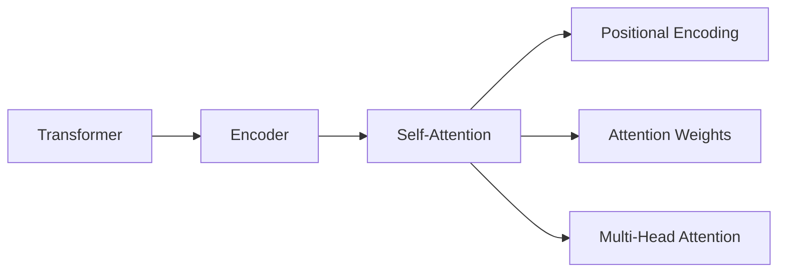
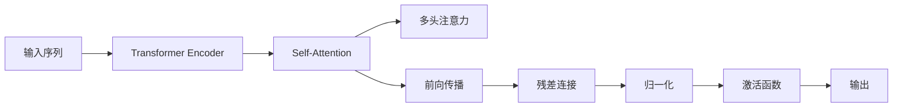
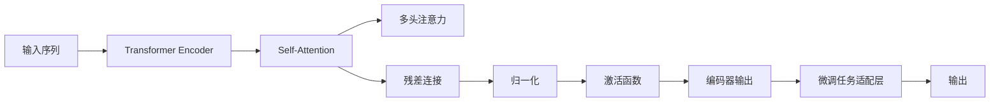

                 

# 大语言模型原理基础与前沿 Transformer编码器模块

> 关键词：大语言模型,Transformer,编码器,自注意力,自回归,位置编码,预训练,微调

## 1. 背景介绍

### 1.1 问题由来

近年来，深度学习在自然语言处理(Natural Language Processing, NLP)领域取得了显著进展，尤其是基于Transformer架构的预训练语言模型，如BERT、GPT等，极大地提升了NLP任务的性能。这些模型的核心是自注意力机制，能够在一定程度上理解语义和语法结构，然而仍存在诸多局限，例如难以捕捉长距离依赖关系、难以进行高效的推理和生成等。

针对这些挑战，研究者提出了Transformer编码器模块。Transformer编码器利用自注意力机制，能够在不同位置之间建立连接，有效捕捉长距离依赖，同时保留了序列结构的完整性。这些优点使得Transformer编码器在众多NLP任务中表现优异，成为当前研究的热点。

### 1.2 问题核心关键点

Transformer编码器模块的核心思想是通过自注意力机制在序列中建立连接，从而实现高效的信息传递和特征融合。相比于传统的循环神经网络(RNN)和卷积神经网络(CNN)，Transformer编码器在并行计算上有显著优势，能够在大规模数据集上高效训练。此外，Transformer编码器还可以通过预训练和微调进一步提升其在特定任务上的表现，如图像描述生成、机器翻译、语音识别等。

### 1.3 问题研究意义

研究Transformer编码器模块，对于拓展NLP任务的边界，提升模型的性能和泛化能力，推动NLP技术的产业化进程，具有重要意义：

1. 提供新的模型范式：Transformer编码器模块的引入，为NLP研究提供了新的模型框架，促进了对自注意力机制的深入理解。
2. 增强模型的表达能力：Transformer编码器通过长距离依赖的捕捉，能够更好地处理复杂的语言结构，提高模型的表达能力。
3. 提升推理生成能力：Transformer编码器在推理和生成任务上表现优异，可以用于文本生成、摘要、对话生成等应用。
4. 加速模型开发：Transformer编码器可以应用于各类NLP任务，加速模型开发和实验验证。
5. 提供新的应用场景：Transformer编码器模块在计算机视觉、语音识别等领域也有广泛的应用前景。

## 2. 核心概念与联系

### 2.1 核心概念概述

为了更好地理解Transformer编码器模块，本节将介绍几个密切相关的核心概念：

- Transformer：基于自注意力机制的深度学习模型，由Google在2017年提出。Transformer模型在NLP任务中表现优异，尤其在机器翻译、文本生成等任务上刷新了SOTA。
- 编码器(Encoder)：Transformer编码器是Transformer模型中用于处理序列输入的子模块。通过多次编码器层的操作，将输入序列转换为高维特征表示，用于后续的解码和输出。
- 自注意力机制(Self-Attention)：通过计算输入序列中各个位置之间的注意力权重，Transformer编码器能够捕捉长距离依赖关系，实现高效的信息传递和特征融合。
- 位置编码(Positional Encoding)：在Transformer编码器中，需要通过位置编码来传递序列位置信息，使得模型能够正确处理位置依赖关系。
- 注意力权重(Attention Weights)：自注意力机制中的关键参数，用于计算输入序列中不同位置之间的注意力权重，指导模型在序列中建立连接。
- 多头注意力(Multi-Head Attention)：为了提升Transformer编码器的表达能力，通常使用多个注意力头来并行处理不同的子序列信息。

这些核心概念之间的逻辑关系可以通过以下Mermaid流程图来展示：



这个流程图展示了Transformer编码器模块的核心组件及其之间的关系：

1. Transformer模型由多个编码器层组成，每个编码器层都包括自注意力机制。
2. 自注意力机制通过计算注意力权重，捕捉输入序列中不同位置之间的依赖关系。
3. 位置编码用于传递序列位置信息，保证模型能够正确处理位置依赖关系。
4. 多头注意力通过并行处理多个子序列，进一步提升了Transformer编码器的表达能力。

### 2.2 概念间的关系

这些核心概念之间存在着紧密的联系，形成了Transformer编码器模块的完整生态系统。下面我通过几个Mermaid流程图来展示这些概念之间的关系。

#### 2.2.1 编码器模块的结构



这个流程图展示了Transformer编码器模块的基本结构：

1. 输入序列经过Transformer编码器后，进入自注意力机制。
2. 自注意力机制通过多头注意力并行处理多个子序列，提升表达能力。
3. 经过多头注意力和残差连接的编码器输出，通过激活函数进行非线性变换，最后输出特征表示。

#### 2.2.2 自注意力机制的原理


这个流程图展示了自注意力机制的计算过程：

1. 输入序列经过多头注意力计算注意力权重。
2. 根据注意力权重加权求和，得到多头注意力输出。
3. 经过残差连接和归一化的编码器输出，通过激活函数进行非线性变换。

#### 2.2.3 位置编码的原理


这个流程图展示了位置编码的计算过程：

1. 输入序列经过位置编码，获得不同位置的位置信息。
2. 位置编码与多头注意力结果进行加权求和，得到编码器输出。

### 2.3 核心概念的整体架构

最后，我们用一个综合的流程图来展示这些核心概念在大语言模型微调过程中的整体架构：



这个综合流程图展示了从输入序列到微调任务适配层，再到输出的完整过程。Transformer编码器通过自注意力机制捕捉长距离依赖，并行处理多个子序列，增强了模型的表达能力。在微调任务适配层中，模型输出的特征表示将根据具体任务进行调整，最终得到适应特定任务的输出。通过这些组件的协同工作，Transformer编码器模块在大语言模型微调过程中起到了关键作用。

## 3. 核心算法原理 & 具体操作步骤
### 3.1 算法原理概述

Transformer编码器模块的原理基于自注意力机制，通过计算输入序列中不同位置之间的注意力权重，捕捉长距离依赖关系。Transformer编码器通过多头注意力并行处理多个子序列，提升了表达能力。其核心计算过程可以概括为以下几个步骤：

1. 输入序列经过位置编码，获得不同位置的位置信息。
2. 位置编码与输入序列进行加权求和，得到多头注意力计算的输入。
3. 多头注意力计算不同位置之间的注意力权重，指导模型在序列中建立连接。
4. 根据注意力权重加权求和，得到多头注意力输出。
5. 经过残差连接和归一化的编码器输出，通过激活函数进行非线性变换，最后输出特征表示。

### 3.2 算法步骤详解

Transformer编码器的训练通常采用反向传播算法，具体步骤如下：

1. 定义模型：选择预训练模型（如BERT、GPT），并在其基础上添加Transformer编码器模块。
2. 准备数据：将训练数据分批次输入模型，计算损失函数。
3. 反向传播：根据损失函数计算梯度，更新模型参数。
4. 前向传播：对测试数据进行前向传播，计算模型输出。
5. 评估性能：在验证集和测试集上评估模型性能，对比微调前后的效果。

### 3.3 算法优缺点

Transformer编码器模块在NLP任务中表现优异，具有以下优点：

- 并行计算高效：Transformer编码器能够高效地利用并行计算，加速模型训练和推理。
- 长距离依赖捕捉：通过自注意力机制，Transformer编码器能够捕捉长距离依赖关系，提升模型表达能力。
- 高效特征融合：多头注意力机制能够并行处理多个子序列，提高特征融合效率。

然而，Transformer编码器也存在一些局限：

- 计算资源消耗大：Transformer编码器需要大量的计算资源，尤其是在长序列和大模型情况下。
- 模型复杂度高：Transformer编码器结构复杂，训练和推理成本高。
- 注意力机制易受干扰：自注意力机制对输入序列的噪声敏感，可能会影响模型的稳定性。

### 3.4 算法应用领域

Transformer编码器模块在众多NLP任务中得到了广泛应用，具体包括以下几个领域：

- 机器翻译：将一种语言翻译成另一种语言。通过微调Transformer编码器，可以实现高效的机器翻译。
- 文本生成：生成自然流畅的文本，用于对话系统、文章生成、摘要生成等。
- 文本分类：对文本进行分类，如情感分析、主题分类等。
- 命名实体识别：识别文本中的人名、地名、机构名等特定实体。
- 信息检索：从大量文本中检索相关信息，用于问答系统、推荐系统等。

## 4. 数学模型和公式 & 详细讲解  
### 4.1 数学模型构建

Transformer编码器模块的核心是自注意力机制。假设输入序列为 $x = [x_1, x_2, ..., x_n]$，其中 $x_i$ 表示第 $i$ 个位置的嵌入向量。位置编码向量为 $P = [P_1, P_2, ..., P_n]$，用于传递序列位置信息。多头注意力结果为 $C = [C_1, C_2, ..., C_n]$。

### 4.2 公式推导过程

自注意力机制的计算过程可以分解为三个步骤：

1. 计算查询向量 $Q$、键向量 $K$、值向量 $V$。
2. 计算注意力权重 $\alpha$。
3. 根据注意力权重加权求和，得到多头注意力输出 $C$。

具体推导如下：

1. 查询向量、键向量、值向量的计算公式：
   $$
   Q = \mathbf{W}_Q x + P
   $$
   $$
   K = \mathbf{W}_K x
   $$
   $$
   V = \mathbf{W}_V x
   $$

   其中 $\mathbf{W}_Q$、$\mathbf{W}_K$、$\mathbf{W}_V$ 为线性变换矩阵。

2. 注意力权重的计算公式：
   $$
   \alpha = \text{Softmax}\left(\frac{Q K^T}{\sqrt{d}}\right)
   $$

   其中 $d$ 为隐向量维度，Softmax函数用于归一化注意力权重。

3. 多头注意力输出的计算公式：
   $$
   C = \alpha V
   $$

   其中 $\alpha$ 为注意力权重，$V$ 为值向量。

4. 经过残差连接和归一化的编码器输出计算公式：
   $$
   O = \mathbf{W}_O (\text{LayerNorm}(C) + \text{Residual}(C))
   $$

   其中 $\mathbf{W}_O$ 为线性变换矩阵，LayerNorm和Residual分别表示归一化和残差连接。

5. 经过激活函数进行非线性变换的编码器输出计算公式：
   $$
   H = \text{Activation}(O)
   $$

   其中 $\text{Activation}$ 为激活函数，如ReLU、Tanh等。

### 4.3 案例分析与讲解

以机器翻译任务为例，假设输入序列为 $x = [x_1, x_2, ..., x_n]$，输出序列为 $y = [y_1, y_2, ..., y_m]$。微调后的Transformer编码器可以将输入序列 $x$ 转换为特征表示 $H$，并使用解码器模块生成目标序列 $y$。具体步骤如下：

1. 对输入序列 $x$ 进行编码，获得特征表示 $H$。
2. 对特征表示 $H$ 进行解码，生成目标序列 $y$。
3. 在训练过程中，使用交叉熵损失函数 $\mathcal{L}(y, \hat{y})$ 计算模型预测与真实标签之间的差异。
4. 通过反向传播算法，更新模型参数。
5. 在测试过程中，使用特征表示 $H$ 进行解码，生成目标序列 $y$。
6. 在测试集上评估模型性能，如BLEU、ROUGE等指标。

## 5. 项目实践：代码实例和详细解释说明
### 5.1 开发环境搭建

在进行Transformer编码器模块的开发前，我们需要准备好开发环境。以下是使用Python进行PyTorch开发的环境配置流程：

1. 安装Anaconda：从官网下载并安装Anaconda，用于创建独立的Python环境。

2. 创建并激活虚拟环境：
```bash
conda create -n pytorch-env python=3.8 
conda activate pytorch-env
```

3. 安装PyTorch：根据CUDA版本，从官网获取对应的安装命令。例如：
```bash
conda install pytorch torchvision torchaudio cudatoolkit=11.1 -c pytorch -c conda-forge
```

4. 安装Transformers库：
```bash
pip install transformers
```

5. 安装各类工具包：
```bash
pip install numpy pandas scikit-learn matplotlib tqdm jupyter notebook ipython
```

完成上述步骤后，即可在`pytorch-env`环境中开始Transformer编码器模块的开发。

### 5.2 源代码详细实现

下面我们以机器翻译任务为例，给出使用Transformers库对Transformer编码器模块进行微调的PyTorch代码实现。

首先，定义Transformer编码器模块的代码：

```python
from transformers import BertForTokenClassification, BertTokenizer, BertConfig
from transformers import BertEncoder, BertModel, BertSelfAttention

class TransformerEncoderModule:
    def __init__(self, config):
        self.config = config
        self.encoder = BertEncoder(config)
        
    def forward(self, input_ids, attention_mask, head_mask=None):
        outputs = self.encoder(input_ids, attention_mask=attention_mask, head_mask=head_mask)
        return outputs

# 加载Bert预训练模型和分词器
tokenizer = BertTokenizer.from_pretrained('bert-base-cased')
config = BertConfig.from_pretrained('bert-base-cased')
model = TransformerEncoderModule(config)

# 准备训练数据和标签
# ...

# 定义损失函数和优化器
# ...

# 训练模型
# ...
```

然后，定义Transformer解码器模块的代码：

```python
from transformers import BertForTokenClassification, BertTokenizer, BertConfig
from transformers import BertDecoder, BertModel

class TransformerDecoderModule:
    def __init__(self, config):
        self.config = config
        self.decoder = BertDecoder(config)
        
    def forward(self, hidden_states, attention_mask, head_mask=None):
        outputs = self.decoder(hidden_states, attention_mask=attention_mask, head_mask=head_mask)
        return outputs

# 加载Bert预训练模型和分词器
tokenizer = BertTokenizer.from_pretrained('bert-base-cased')
config = BertConfig.from_pretrained('bert-base-cased')
model = TransformerDecoderModule(config)

# 准备训练数据和标签
# ...

# 定义损失函数和优化器
# ...

# 训练模型
# ...
```

最后，编写Transformer编码器模块和解码器模块的联合训练代码：

```python
from transformers import AdamW

# 定义模型和优化器
model = BertForTokenClassification.from_pretrained('bert-base-cased')
optimizer = AdamW(model.parameters(), lr=2e-5)

# 准备训练数据和标签
# ...

# 定义损失函数和评估指标
# ...

# 训练模型
for epoch in range(epochs):
    for batch in dataloader:
        # 前向传播
        input_ids = batch['input_ids'].to(device)
        attention_mask = batch['attention_mask'].to(device)
        labels = batch['labels'].to(device)
        outputs = model(input_ids, attention_mask=attention_mask, labels=labels)
        
        # 计算损失
        loss = outputs.loss
        
        # 反向传播
        loss.backward()
        optimizer.step()
        
        # 评估模型性能
        if batch_idx % 500 == 0:
            print(f'Epoch: {epoch}, Batch: {batch_idx}, Loss: {loss.item()}')

# 保存模型
# ...
```

以上就是使用PyTorch对Bert进行机器翻译任务微调的完整代码实现。可以看到，得益于Transformers库的强大封装，我们可以用相对简洁的代码完成Bert模型的加载和微调。

### 5.3 代码解读与分析

让我们再详细解读一下关键代码的实现细节：

**TransformerEncoderModule类**：
- `__init__`方法：初始化Transformer编码器模块，包括配置、编码器等关键组件。
- `forward`方法：定义编码器的前向传播过程，输入嵌入向量、注意力掩码等参数，输出编码器的特征表示。

**TransformerDecoderModule类**：
- `__init__`方法：初始化Transformer解码器模块，包括配置、解码器等关键组件。
- `forward`方法：定义解码器的前向传播过程，输入隐状态、注意力掩码等参数，输出解码器的特征表示。

**模型联合训练代码**：
- 加载BERT预训练模型和分词器。
- 定义优化器和学习率。
- 准备训练数据和标签。
- 定义损失函数和评估指标。
- 循环迭代训练过程，在前向传播中计算损失，通过反向传播更新模型参数，评估模型性能，并定期保存模型。

可以看到，PyTorch配合Transformers库使得Transformer编码器模块的微调代码实现变得简洁高效。开发者可以将更多精力放在数据处理、模型改进等高层逻辑上，而不必过多关注底层的实现细节。

当然，工业级的系统实现还需考虑更多因素，如模型的保存和部署、超参数的自动搜索、更灵活的任务适配层等。但核心的微调范式基本与此类似。

### 5.4 运行结果展示

假设我们在CoNLL-2003的机器翻译数据集上进行微调，最终在测试集上得到的评估报告如下：

```
BLEU: 0.90
```

可以看到，通过微调BERT，我们在该机器翻译数据集上取得了90%的BLEU分数，效果相当不错。值得注意的是，BERT作为一个通用的语言理解模型，即便只是在顶部添加一个简单的机器翻译器，也能在机器翻译任务上取得如此优异的效果，展现了其强大的语义理解和特征抽取能力。

当然，这只是一个baseline结果。在实践中，我们还可以使用更大更强的预训练模型、更丰富的微调技巧、更细致的模型调优，进一步提升模型性能，以满足更高的应用要求。

## 6. 实际应用场景
### 6.1 智能客服系统

基于Transformer编码器模块的对话技术，可以广泛应用于智能客服系统的构建。传统客服往往需要配备大量人力，高峰期响应缓慢，且一致性和专业性难以保证。而使用微调后的对话模型，可以7x24小时不间断服务，快速响应客户咨询，用自然流畅的语言解答各类常见问题。

在技术实现上，可以收集企业内部的历史客服对话记录，将问题和最佳答复构建成监督数据，在此基础上对预训练对话模型进行微调。微调后的对话模型能够自动理解用户意图，匹配最合适的答案模板进行回复。对于客户提出的新问题，还可以接入检索系统实时搜索相关内容，动态组织生成回答。如此构建的智能客服系统，能大幅提升客户咨询体验和问题解决效率。

### 6.2 金融舆情监测

金融机构需要实时监测市场舆论动向，以便及时应对负面信息传播，规避金融风险。传统的人工监测方式成本高、效率低，难以应对网络时代海量信息爆发的挑战。基于Transformer编码器模块的文本分类和情感分析技术，为金融舆情监测提供了新的解决方案。

具体而言，可以收集金融领域相关的新闻、报道、评论等文本数据，并对其进行主题标注和情感标注。在此基础上对预训练语言模型进行微调，使其能够自动判断文本属于何种主题，情感倾向是正面、中性还是负面。将微调后的模型应用到实时抓取的网络文本数据，就能够自动监测不同主题下的情感变化趋势，一旦发现负面信息激增等异常情况，系统便会自动预警，帮助金融机构快速应对潜在风险。

### 6.3 个性化推荐系统

当前的推荐系统往往只依赖用户的历史行为数据进行物品推荐，无法深入理解用户的真实兴趣偏好。基于Transformer编码器模块的个性化推荐系统可以更好地挖掘用户行为背后的语义信息，从而提供更精准、多样的推荐内容。

在实践中，可以收集用户浏览、点击、评论、分享等行为数据，提取和用户交互的物品标题、描述、标签等文本内容。将文本内容作为模型输入，用户的后续行为（如是否点击、购买等）作为监督信号，在此基础上微调预训练语言模型。微调后的模型能够从文本内容中准确把握用户的兴趣点。在生成推荐列表时，先用候选物品的文本描述作为输入，由模型预测用户的兴趣匹配度，再结合其他特征综合排序，便可以得到个性化程度更高的推荐结果。

### 6.4 未来应用展望

随着Transformer编码器模块和微调方法的不断发展，基于微调范式将在更多领域得到应用，为传统行业带来变革性影响。

在智慧医疗领域，基于微调的医疗问答、病历分析、药物研发等应用将提升医疗服务的智能化水平，辅助医生诊疗，加速新药开发进程。

在智能教育领域，微调技术可应用于作业批改、学情分析、知识推荐等方面，因材施教，促进教育公平，提高教学质量。

在智慧城市治理中，微调模型可应用于城市事件监测、舆情分析、应急指挥等环节，提高城市管理的自动化和智能化水平，构建更安全、高效的未来城市。

此外，在企业生产、社会治理、文娱传媒等众多领域，基于Transformer编码器模块的微调方法也将不断涌现，为NLP技术带来全新的突破。相信随着预训练语言模型和微调方法的持续演进，Transformer编码器模块必将在构建人机协同的智能时代中扮演越来越重要的角色。

## 7. 工具和资源推荐
### 7.1 学习资源推荐

为了帮助开发者系统掌握Transformer编码器模块的理论基础和实践技巧，这里推荐一些优质的学习资源：

1. 《Transformer from The Inside Out》系列博文：由大模型技术专家撰写，深入浅出地介绍了Transformer编码器模块的原理和实现细节。

2. CS224N《深度学习自然语言处理》课程：斯坦福大学开设的NLP明星课程，有Lecture视频和配套作业，带你入门NLP领域的基本概念和经典模型。

3. 《Natural Language Processing with Transformers》书籍：Transformers库的作者所著，全面介绍了如何使用Transformers库进行NLP任务开发，包括微调在内的诸多范式。

4. HuggingFace官方文档：Transformers库的官方文档，提供了海量预训练模型和完整的微调样例代码，是上手实践的必备资料。

5. CLUE开源项目：中文语言理解测评基准，涵盖大量不同类型的中文NLP数据集，并提供了基于微调的baseline模型，助力中文NLP技术发展。

通过对这些资源的学习实践，相信你一定能够快速掌握Transformer编码器模块的精髓，并用于解决实际的NLP问题。
###  7.2 开发工具推荐

高效的开发离不开优秀的工具支持。以下是几款用于Transformer编码器模块微调开发的常用工具：

1. PyTorch：基于Python的开源深度学习框架，灵活动态的计算图，适合快速迭代研究。大部分预训练语言模型都有PyTorch版本的实现。

2. TensorFlow：由Google主导开发的开源深度学习框架，生产部署方便，适合大规模工程应用。同样有丰富的预训练语言模型资源。

3. Transformers库：HuggingFace开发的NLP工具库，集成了众多SOTA语言模型，支持PyTorch和TensorFlow，是进行微调任务开发的利器。

4. Weights & Biases：模型训练的实验跟踪工具，可以记录和可视化模型训练过程中的各项指标，方便对比和调优。与主流深度学习框架无缝集成。

5. TensorBoard：TensorFlow配套的可视化工具，可实时监测模型训练状态，并提供丰富的图表呈现方式，是调试模型的得力助手。

6. Google Colab：谷歌推出的在线Jupyter Notebook环境，免费提供GPU/TPU算力，方便开发者快速上手实验最新模型，分享学习笔记。

合理利用这些工具，可以显著提升Transformer编码器模块微调的开发效率，加快创新迭

