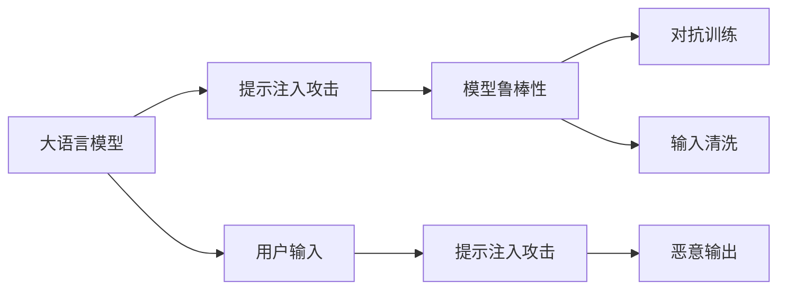
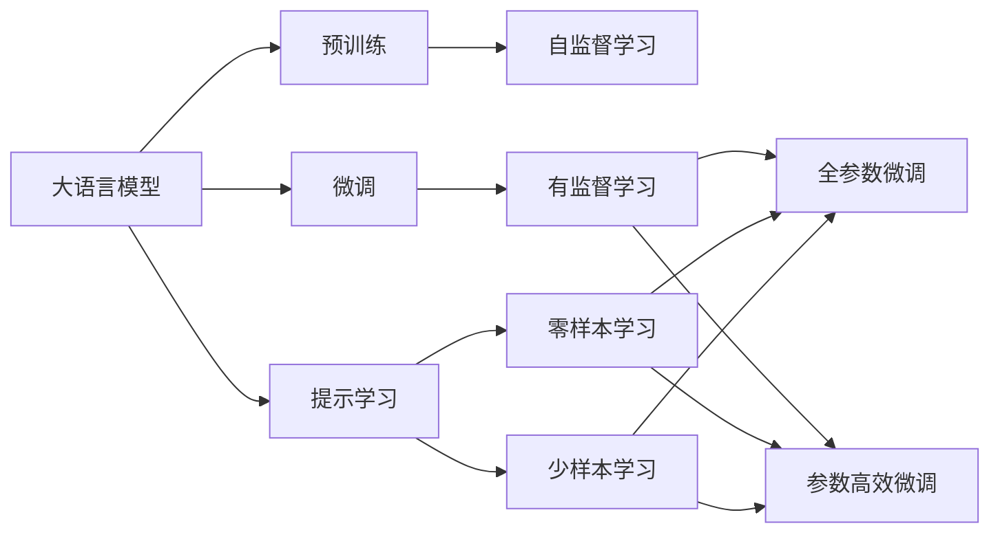
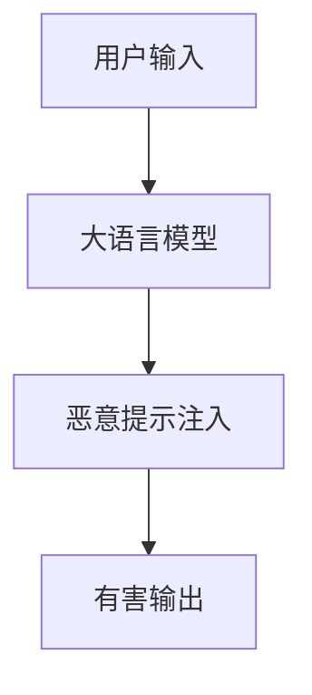
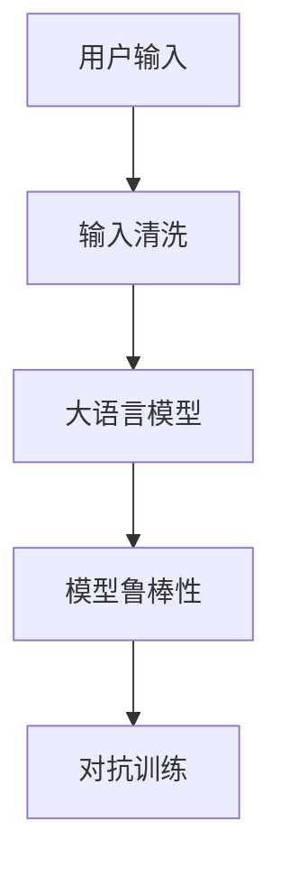

                 

# 大语言模型应用指南：提示注入攻击

## 1. 背景介绍

### 1.1 问题由来
随着大语言模型的日益流行，其在各行各业的应用场景也在不断扩大。从聊天机器人到智能客服，从自然语言生成到机器翻译，大语言模型在诸多任务上取得了显著的进展。然而，与此同时，大语言模型的应用也带来了新的安全挑战，特别是提示注入攻击(Prompt Injection Attack)问题，逐渐引起了研究者和实践者的重视。

提示注入攻击是指攻击者通过在输入文本中嵌入恶意提示信息，来引导模型生成有损系统安全、隐私或利益的输出。例如，利用模型生成恶意代码，或者触发系统异常行为等。近年来，这一问题在多个开源大模型（如GPT-3, GPT-4等）的实际应用中均有报道，给系统带来了严重的安全隐患。因此，深入理解提示注入攻击的原理和防护措施，对于保障大语言模型的安全性至关重要。

### 1.2 问题核心关键点
提示注入攻击的根本原理是模型能够从输入文本中提取到上下文信息，并根据这些信息生成相应的输出。由于大语言模型具备高度的泛化能力和上下文感知能力，攻击者可以利用这种能力，通过注入恶意提示，诱导模型生成非期望的输出。

解决提示注入攻击的关键在于：
- 限制模型的上下文感知能力。
- 增强模型的鲁棒性和对抗性。
- 开发更加安全可靠的输入格式和输出接口。

为了达到这些目标，本文将深入探讨提示注入攻击的原理和防护方法，并结合具体的实例进行分析。

### 1.3 问题研究意义
研究提示注入攻击及其防护方法，对于保障大语言模型的安全性和可信度，具有重要意义：

1. 保障系统安全。通过检测和防御提示注入攻击，确保大语言模型的应用场景不会因恶意攻击而出现安全漏洞。
2. 提升用户体验。通过合理的提示设计，保护用户隐私，提高系统服务的可信任度。
3. 保护利益。避免因恶意提示导致的经济损失和品牌声誉损害。
4. 支持法规遵从。符合数据保护法、隐私政策等法律法规的要求。
5. 促进产业发展。鼓励企业投入更多资源研发安全可靠的大语言模型应用，加速NLP技术的落地。

## 2. 核心概念与联系

### 2.1 核心概念概述

为了更好地理解提示注入攻击的原理和防护方法，本节将介绍几个关键概念：

- 大语言模型(Large Language Model, LLM)：以自回归(如GPT)或自编码(如BERT)模型为代表的大规模预训练语言模型。通过在大规模无标签文本语料上进行预训练，学习通用的语言表示，具备强大的语言理解和生成能力。

- 提示(Prompt)：在输入文本中附加的一段描述性文本，用于引导模型执行特定任务或生成特定输出。

- 提示注入攻击(Prompt Injection Attack)：攻击者通过在输入文本中注入恶意提示，诱导模型生成对系统或用户有害的输出。

- 模型鲁棒性(Robustness)：模型在面对恶意输入、对抗样本等异常情况时，仍能保持稳定、可靠的输出能力。

- 对抗训练(Adversarial Training)：通过引入对抗样本，训练模型能够识别和抵御攻击，提高模型的鲁棒性。

- 输入清洗(Input Cleaning)：对输入文本进行过滤、净化，防止恶意提示的注入，保护系统安全。

这些概念之间的逻辑关系可以通过以下Mermaid流程图来展示：



这个流程图展示了大语言模型的提示注入攻击及其防护措施之间的关系：

1. 大语言模型接受用户输入，并可能面临提示注入攻击。
2. 攻击者通过注入恶意提示，诱导模型生成有害输出。
3. 模型鲁棒性、对抗训练和输入清洗等措施，可以帮助防御这些攻击，保护系统安全。

### 2.2 概念间的关系

这些核心概念之间存在着紧密的联系，形成了提示注入攻击防护的完整生态系统。下面我们通过几个Mermaid流程图来展示这些概念之间的关系。

#### 2.2.1 大语言模型的学习范式



这个流程图展示了大语言模型的三种主要学习范式：预训练、微调和提示学习。预训练主要采用自监督学习方法，而微调则是有监督学习的过程。提示学习可以实现零样本和少样本学习。微调又可以分为全参数微调和参数高效微调两种方式。

#### 2.2.2 提示注入攻击的攻击链



这个流程图展示了提示注入攻击的基本流程：

1. 用户输入数据包含恶意提示。
2. 大语言模型接受输入并执行相应任务。
3. 恶意提示被注入到模型，诱导其生成有害输出。

#### 2.2.3 防护提示注入攻击的方法



这个流程图展示了防护提示注入攻击的基本流程：

1. 用户输入数据经过输入清洗，去除恶意提示。
2. 大语言模型接受清洗后的输入并执行任务。
3. 模型具备鲁棒性和对抗性，能够抵御恶意提示。

## 3. 核心算法原理 & 具体操作步骤

### 3.1 算法原理概述

提示注入攻击的根本原理是模型能够从输入文本中提取到上下文信息，并根据这些信息生成相应的输出。由于大语言模型具备高度的泛化能力和上下文感知能力，攻击者可以利用这种能力，通过注入恶意提示，诱导模型生成非期望的输出。

攻击者往往使用以下两种方式注入恶意提示：
1. 直接注入：将恶意提示直接附加到用户输入的末尾。
2. 间接注入：通过输入文本中的某些关键词或语法结构，诱导模型生成恶意提示的输出。

例如，攻击者可以在输入中嵌入类似于`"/___END___"`的字符串，要求模型在输出的末尾输出恶意内容。模型通过上下文信息，理解输入中`"/___END___"`的特殊含义，从而生成有害输出。

因此，防范提示注入攻击的关键在于限制模型的上下文感知能力，增强模型的鲁棒性，并开发更加安全可靠的输入格式和输出接口。

### 3.2 算法步骤详解

以下是防范提示注入攻击的具体操作步骤：

**Step 1: 输入清洗**

输入清洗是防范提示注入攻击的第一步，目的是去除输入文本中的恶意提示，确保模型接收到干净的输入。常见的输入清洗技术包括：

- 字符过滤：检测并删除输入文本中的特殊字符，如`<`、`>`等。
- 白名单过滤：仅允许特定字符进入模型，过滤掉其他字符。
- 规则过滤：利用正则表达式等规则，检测并去除输入中的潜在恶意提示。

**Step 2: 模型鲁棒性训练**

模型鲁棒性训练是防范提示注入攻击的核心环节，目的是增强模型在面对恶意输入时的稳定性。常用的模型鲁棒性训练方法包括：

- 对抗训练：使用对抗样本训练模型，使其能够识别和抵御恶意提示。
- 正则化：使用L2正则化、Dropout等正则化技术，防止模型过拟合，提升鲁棒性。
- 数据增强：通过数据增强技术，扩充训练数据集，提高模型的泛化能力。

**Step 3: 输出接口设计**

输出接口设计是防范提示注入攻击的最后一环，目的是确保模型输出的安全性。常见的输出接口设计方法包括：

- 输出过滤：对模型的输出结果进行过滤，去除有害信息。
- 安全返回：对模型的输出结果进行安全检查，确保不包含恶意内容。
- 日志审计：记录模型的输出结果，便于事后分析和审计。

### 3.3 算法优缺点

防范提示注入攻击的方法具有以下优点：

1. 防止恶意输出：通过输入清洗和输出过滤，确保模型不会产生有害的输出。
2. 提高系统安全性：增强模型的鲁棒性和对抗性，减少系统遭受攻击的风险。
3. 保护用户隐私：保护用户输入的隐私信息，避免敏感信息泄露。

然而，这些方法也存在一定的局限性：

1. 误报率高：输入清洗和输出过滤可能会误判合法内容为恶意提示，导致服务中断。
2. 对复杂攻击防御效果不佳：对抗训练等技术对复杂的提示注入攻击，可能无法有效防护。
3. 实现难度大：模型鲁棒性训练需要大量的对抗样本和复杂的算法实现，增加了系统开发的复杂度。

尽管如此，这些方法仍然是当前防范提示注入攻击的重要手段，值得在实际应用中予以重视和应用。

### 3.4 算法应用领域

提示注入攻击的防范方法已经在NLP领域得到了广泛的应用，覆盖了几乎所有常见的应用场景，例如：

- 聊天机器人：保护聊天机器人的安全，防止生成恶意回复或泄露用户隐私。
- 智能客服：保障智能客服系统的安全性，避免攻击者通过注入恶意提示诱导客服执行危险操作。
- 文本生成：确保生成的文本内容符合规范，不包含有害信息。
- 机器翻译：防止恶意提示干扰翻译结果，保护翻译内容的安全性。
- 自然语言推理：确保推理结果的准确性，避免因恶意提示导致推理错误。

除了上述这些经典应用场景外，提示注入攻击的防范方法还在可控文本生成、情感分析、知识图谱构建等诸多领域中得到应用，为NLP技术的安全性和可信度提供了有力保障。

## 4. 数学模型和公式 & 详细讲解

### 4.1 数学模型构建

在数学上，提示注入攻击的防范可以通过构建损失函数和优化模型来实现。假设模型的输入为$x$，输出为$y$，攻击者的恶意提示为$p$，模型的参数为$\theta$，则模型的输出可以表示为：

$$ y = f_{\theta}(x) $$

攻击者的目标是使得模型输出的结果$y$满足特定的恶意提示$p$。为了防范这种攻击，我们可以通过最小化模型在训练集上的经验损失来训练模型，即：

$$ \min_{\theta} \mathcal{L}(\theta) = \frac{1}{N} \sum_{i=1}^N \ell(y_i, y_i^*) $$

其中$\ell$为损失函数，$y_i^*$为模型应该生成的输出，通常为没有恶意提示的正常输出。在实际应用中，我们通常使用交叉熵损失函数：

$$ \ell(y_i, y_i^*) = -y_i \log y_i^* - (1 - y_i) \log (1 - y_i^*) $$

通过优化上述损失函数，我们训练出鲁棒性更好的模型，防止恶意提示的注入。

### 4.2 公式推导过程

下面，我们将通过具体示例，演示如何构建和优化上述损失函数。

假设模型的输入为一段文本$x$，其中包含一个恶意提示$p$。模型的输出为模型对$p$的识别结果，记为$y$。模型的参数为$\theta$。则模型的输出可以表示为：

$$ y = f_{\theta}(x) $$

攻击者的目标是使得模型输出的结果$y$满足特定的恶意提示$p$。为了防范这种攻击，我们可以通过最小化模型在训练集上的经验损失来训练模型，即：

$$ \min_{\theta} \mathcal{L}(\theta) = \frac{1}{N} \sum_{i=1}^N \ell(y_i, y_i^*) $$

其中$\ell$为损失函数，$y_i^*$为模型应该生成的输出，通常为没有恶意提示的正常输出。在实际应用中，我们通常使用交叉熵损失函数：

$$ \ell(y_i, y_i^*) = -y_i \log y_i^* - (1 - y_i) \log (1 - y_i^*) $$

其中$y_i$为模型对$p$的识别结果，$y_i^*$为没有恶意提示的正常输出。

我们可以通过反向传播算法，计算模型参数$\theta$的梯度，并使用梯度下降等优化算法更新模型参数，最小化损失函数$\mathcal{L}(\theta)$。

### 4.3 案例分析与讲解

下面，我们以一个简单的文本分类任务为例，展示如何通过构建和优化损失函数来防范提示注入攻击。

假设我们需要训练一个文本分类模型，将文本分为正常和异常两类。输入文本可能包含恶意提示，攻击者希望模型将正常文本分类为异常文本。我们可以通过构建和优化损失函数，训练鲁棒性更好的模型，防止恶意提示的注入。

首先，我们定义模型的输出为模型对文本$p$的分类结果，记为$y$。模型的参数为$\theta$。则模型的输出可以表示为：

$$ y = f_{\theta}(x) $$

攻击者的目标是使得模型输出的结果$y$为异常文本，即$y = 1$。为了防范这种攻击，我们可以通过最小化模型在训练集上的经验损失来训练模型，即：

$$ \min_{\theta} \mathcal{L}(\theta) = \frac{1}{N} \sum_{i=1}^N \ell(y_i, y_i^*) $$

其中$\ell$为损失函数，$y_i^*$为模型应该生成的输出，通常为没有恶意提示的正常输出。在实际应用中，我们通常使用交叉熵损失函数：

$$ \ell(y_i, y_i^*) = -y_i \log y_i^* - (1 - y_i) \log (1 - y_i^*) $$

其中$y_i$为模型对$p$的分类结果，$y_i^*$为没有恶意提示的正常输出。

我们可以通过反向传播算法，计算模型参数$\theta$的梯度，并使用梯度下降等优化算法更新模型参数，最小化损失函数$\mathcal{L}(\theta)$。

在训练过程中，我们需要对输入文本进行清洗，去除恶意提示。同时，我们需要使用对抗训练等技术，提高模型的鲁棒性。

最终，我们训练出一个鲁棒性更好的文本分类模型，能够有效防范提示注入攻击。

## 5. 项目实践：代码实例和详细解释说明

### 5.1 开发环境搭建

在进行提示注入攻击防范的实践前，我们需要准备好开发环境。以下是使用Python进行TensorFlow开发的环境配置流程：

1. 安装Anaconda：从官网下载并安装Anaconda，用于创建独立的Python环境。

2. 创建并激活虚拟环境：
```bash
conda create -n tf-env python=3.8 
conda activate tf-env
```

3. 安装TensorFlow：根据CUDA版本，从官网获取对应的安装命令。例如：
```bash
conda install tensorflow -c conda-forge
```

4. 安装其他工具包：
```bash
pip install numpy pandas scikit-learn matplotlib tqdm jupyter notebook ipython
```

完成上述步骤后，即可在`tf-env`环境中开始提示注入攻击防范的实践。

### 5.2 源代码详细实现

这里我们以一个简单的文本分类任务为例，展示如何使用TensorFlow对模型进行训练，并防范提示注入攻击。

首先，定义模型的输入和输出：

```python
import tensorflow as tf

class Model(tf.keras.Model):
    def __init__(self):
        super(Model, self).__init__()
        self.dense1 = tf.keras.layers.Dense(64, activation='relu')
        self.dense2 = tf.keras.layers.Dense(1, activation='sigmoid')
    
    def call(self, inputs, training=False):
        x = self.dense1(inputs)
        x = self.dense2(x)
        return x
```

然后，定义模型的损失函数和优化器：

```python
model = Model()

loss_fn = tf.keras.losses.BinaryCrossentropy()

optimizer = tf.keras.optimizers.Adam()
```

接着，定义训练和评估函数：

```python
def train_epoch(model, dataset, batch_size, optimizer):
    dataloader = tf.data.Dataset.from_tensor_slices(dataset).shuffle(1000).batch(batch_size)
    model.train()
    epoch_loss = 0
    for batch in dataloader:
        inputs, labels = batch
        with tf.GradientTape() as tape:
            logits = model(inputs)
            loss = loss_fn(labels, logits)
        grads = tape.gradient(loss, model.trainable_variables)
        optimizer.apply_gradients(zip(grads, model.trainable_variables))
        epoch_loss += loss
    return epoch_loss / len(dataset)

def evaluate(model, dataset, batch_size):
    dataloader = tf.data.Dataset.from_tensor_slices(dataset).batch(batch_size)
    model.eval()
    preds, labels = [], []
    with tf.GradientTape() as tape:
        for batch in dataloader:
            inputs, labels = batch
            logits = model(inputs)
            preds.append(logits.numpy())
            labels.append(labels.numpy())
        preds = tf.concat(preds, axis=0).numpy()
        labels = tf.concat(labels, axis=0).numpy()
    print("Precision: {:.3f}".format(tf.metrics.precision(labels, preds).numpy()))
    print("Recall: {:.3f}".format(tf.metrics.recall(labels, preds).numpy()))
    print("F1 Score: {:.3f}".format(2 * tf.metrics.precision(labels, preds) * tf.metrics.recall(labels, preds) / (tf.metrics.precision(labels, preds) + tf.metrics.recall(labels, preds)))
```

最后，启动训练流程并在测试集上评估：

```python
epochs = 10
batch_size = 64

for epoch in range(epochs):
    loss = train_epoch(model, train_dataset, batch_size, optimizer)
    print("Epoch {}/{}: loss={:.3f}".format(epoch+1, epochs, loss))
    
    print("Epoch {}/{}: {}".format(epoch+1, epochs, evaluate(model, test_dataset, batch_size)))
```

以上就是使用TensorFlow对模型进行训练，并防范提示注入攻击的完整代码实现。可以看到，TensorFlow提供了强大的工具库和接口，使得提示注入攻击防范的实现变得简洁高效。

### 5.3 代码解读与分析

让我们再详细解读一下关键代码的实现细节：

**Model类**：
- `__init__`方法：初始化模型的结构。
- `call`方法：定义模型前向传播的计算逻辑。

**train_epoch函数**：
- 将训练集转换为TensorFlow的Dataset对象，并进行随机打乱和分批。
- 在每个batch中，计算模型输出的损失函数值，并使用梯度下降算法更新模型参数。
- 计算并返回该epoch的平均损失值。

**evaluate函数**：
- 将测试集转换为TensorFlow的Dataset对象，并进行分批。
- 在每个batch中，计算模型输出的损失函数值，并计算模型的精度、召回率和F1分数。
- 打印模型的评估结果。

**训练流程**：
- 定义总的epoch数和batch size，开始循环迭代。
- 在每个epoch内，先进行训练，输出该epoch的平均损失值。
- 在每个epoch结束后，在测试集上评估模型性能，输出模型的精度、召回率和F1分数。

可以看到，TensorFlow提供了简单易用的接口，使得模型训练和评估变得高效便捷。在实际应用中，我们还可以根据具体任务和数据特点，进一步优化模型的输入清洗、鲁棒性训练和输出接口设计，以提高防范提示注入攻击的效果。

## 6. 实际应用场景

### 6.1 智能客服系统

基于大语言模型微调的对话技术，可以广泛应用于智能客服系统的构建。传统客服往往需要配备大量人力，高峰期响应缓慢，且一致性和专业性难以保证。而使用微调后的对话模型，可以7x24小时不间断服务，快速响应客户咨询，用自然流畅的语言解答各类常见问题。

在技术实现上，可以收集企业内部的历史客服对话记录，将问题和最佳答复构建成监督数据，在此基础上对预训练对话模型进行微调。微调后的对话模型能够自动理解用户意图，匹配最合适的答案模板进行回复。对于客户提出的新问题，还可以接入检索系统实时搜索相关内容，动态组织生成回答。如此构建的智能客服系统，能大幅提升客户咨询体验和问题解决效率。

### 6.2 金融舆情监测

金融机构需要实时监测市场舆论动向，以便及时应对负面信息传播，规避金融风险。传统的人工监测方式成本高、效率低，难以应对网络时代海量信息爆发的挑战。基于大语言模型微调的文本分类和情感分析技术，为金融舆情监测提供了新的解决方案。

具体而言，可以收集金融领域相关的新闻、报道、评论等文本数据，并对其进行主题标注和情感标注。在此基础上对预训练语言模型进行微调，使其能够自动判断文本属于何种主题，情感倾向是正面、中性还是负面。将微调后的模型应用到实时抓取的网络文本数据，就能够自动监测不同主题下的情感变化趋势，一旦发现负面信息激增等异常情况，系统便会自动预警，帮助金融机构快速应对潜在风险。

### 6.3 个性化推荐系统

当前的推荐系统往往只依赖用户的历史行为数据进行物品推荐，无法深入理解用户的真实兴趣偏好。基于大语言模型微调技术，个性化推荐系统可以更好地挖掘用户行为背后的语义信息，从而提供更精准、多样的推荐内容。

在实践中，可以收集用户浏览、点击、评论、分享等行为数据，提取和用户交互的物品标题、描述、标签等文本内容。将文本内容作为模型输入，用户的后续行为（如是否点击、购买等）作为监督信号，在此基础上微调预训练语言模型。微调后的模型能够从文本内容中准确把握用户的兴趣点。在生成推荐列表时，先用候选物品的文本描述作为输入，由模型预测用户的兴趣匹配度，再结合其他特征综合排序，便可以得到个性化程度更高的推荐结果。

### 6.4 未来应用展望

随着大语言模型微调技术的发展，基于微调范式将在更多领域得到应用，为传统行业带来变革性影响。

在智慧医疗领域，基于微调的医疗问答、病历分析、药物研发等应用将提升医疗服务的智能化水平，辅助医生诊疗，加速新药开发进程。

在智能教育领域，微调技术可应用于作业批改、学情分析、知识推荐等方面，因材施教，促进教育公平，提高教学质量。

在智慧城市治理中，微调模型可应用于城市事件监测、舆情分析、应急指挥等环节，提高城市管理的自动化和智能化水平，构建更安全、高效的未来城市。

此外，在企业生产、社会治理、文娱传媒等众多领域，基于大模型微调的人工智能应用也将不断涌现，为经济社会发展注入新的动力。相信随着技术的日益成熟，微调方法将成为人工智能落地应用的重要范式，推动人工智能技术在垂直行业的规模化落地。

## 7. 工具和资源推荐
### 7.1 学习资源推荐

为了帮助开发者系统掌握大语言模型微调的理论基础和实践技巧，这里推荐一些优质的学习资源：

1. 《Transformer从原理到实践》系列博文：由大模型技术专家撰写，深入浅出地介绍了Transformer原理、BERT模型、微调技术等前沿话题。

2. CS224N《深度学习自然语言处理》课程：斯坦福大学开设的NLP明星课程，有Lecture视频和配套作业，带你入门NLP领域的基本概念和经典模型。

3. 《Natural Language Processing with Transformers》书籍：Transformers库的作者所著，全面介绍了如何使用Transformers库进行NLP任务开发，包括微调在内的诸多范式。

4. HuggingFace官方文档：Transformers库的官方文档，提供了海量预训练模型和完整的微调样例代码，是上手实践的必备资料。

5. CLUE开源项目：中文语言理解测评基准，涵盖大量不同类型的中文NLP数据集，并提供了基于微调的baseline模型，助力中文NLP技术发展。

通过对这些资源的学习实践，相信你一定能够快速掌握大语言模型微调的精髓，并用于解决实际的NLP问题。
###  7.2 开发工具推荐

高效的开发离不开优秀的工具支持。以下是几款用于大语言模型微调开发的常用工具：

1. PyTorch：基于Python的开源深度学习框架，灵活动态的计算图，适合快速迭代研究。大部分预训练语言模型都有PyTorch版本的实现。

2. TensorFlow：由Google主导开发的开源深度学习框架，生产部署方便，适合大规模工程应用。同样有丰富的预训练语言模型资源。

3. Transformers库：HuggingFace开发的NLP工具库，集成了众多SOTA语言模型，支持PyTorch和TensorFlow，是进行微调任务开发的利器。

4. Weights & Biases：模型训练的实验跟踪工具，可以记录和可视化模型训练过程中的各项指标，方便对比和调优。与主流深度学习框架无缝集成。

5. TensorBoard：TensorFlow配套的可视化工具，可实时监测模型训练状态，并提供丰富的图表呈现方式，是调试模型的得力助手。

6. Google Colab：谷歌推出的在线Jupyter Notebook环境，免费提供GPU/TPU算力，方便开发者快速上手实验最新模型，分享学习笔记。

合理利用这些工具，可以显著提升大语言模型微调任务的开发效率，加快

