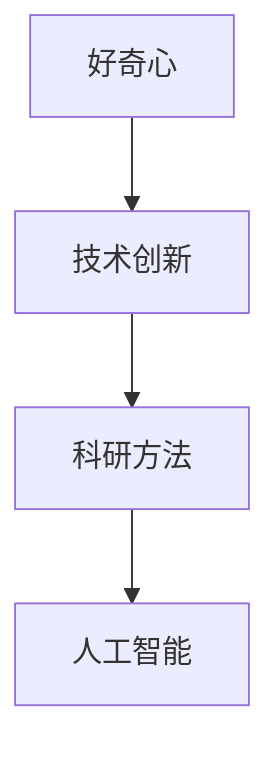

                 

# 好奇心：探索未知的动力

> 关键词：好奇心,探索,未知,驱动力,创新,科研,学习,科学方法

## 1. 背景介绍

### 1.1 问题的由来
人类探索未知世界的动力多种多样，其中好奇心无疑是驱动我们不断前进的强劲动力之一。好奇心驱使我们探究新知，挑战未知领域，推动科学技术的进步，以及不断提升人类智慧和创造力。在信息技术领域，好奇心同样发挥着至关重要的作用，特别是对于人工智能技术的快速发展而言，好奇心是推动技术创新、拓宽技术边界的关键。

### 1.2 问题的核心关键点
好奇心在人工智能领域的核心作用主要体现在以下几个方面：

- **驱动力**：好奇心激发了科研人员和开发者对新算法、新模型的探索欲望，推动了技术进步。
- **创新**：好奇心促使研究人员不断寻找新的研究方向，提出创新的解决方案。
- **学习**：好奇心驱动个体不断学习和自我提升，成为终身学习的动力源泉。
- **科学方法**：好奇心推动了科学方法的演进，从观察到实验、从经验到理论，从定性到定量，促进了科学研究的深入。

### 1.3 问题研究意义
深入理解好奇心的本质及其对技术创新的驱动作用，对于推动人工智能技术的持续发展和应用，具有重要意义：

- **促进技术发展**：好奇心促使科研人员不断探索新的技术领域，推动技术的迭代和进步。
- **解决实际问题**：好奇心驱动研究人员关注实际问题，结合理论与实践，提出有效的解决方案。
- **提高社会效益**：好奇心促使科研人员深入探索科学问题的本质，提升科技的社会价值。
- **激发创新思维**：好奇心激发了创新思维，推动交叉学科的融合和创新。

## 2. 核心概念与联系

### 2.1 核心概念概述

为更好地理解好奇心在人工智能探索中的作用，本节将介绍几个关键概念：

- **好奇心**：人类对未知事物产生兴趣、求知欲的情感体验。在科技领域，好奇心驱使个体探索新知识，挑战未知难题。
- **技术创新**：通过探索和实践，提出新的技术理念、方法和工具，推动技术进步和应用。
- **科研方法**：科学实验和研究过程中所采用的系统方法，包括观察、实验、推理和归纳等。
- **人工智能**：模拟人类智能，使机器能够理解、推理和执行人类智能任务的科技。

这些概念之间的联系紧密，好奇心是驱动技术创新的核心动力，科研方法是实现技术创新的关键手段，人工智能则是技术创新的重要应用领域。

### 2.2 概念间的关系

这些核心概念之间存在密切的联系，通过以下Mermaid流程图展示其关系：



这个流程图展示了好奇心如何通过科研方法推动技术创新，进而应用于人工智能领域。好奇心驱动个体进行科学研究，科研方法指导实验和实践，而技术创新则是科研方法在实际应用中的成果，应用于人工智能等新兴技术领域。

## 3. 核心算法原理 & 具体操作步骤
### 3.1 算法原理概述

好奇心的驱动力是人工智能技术不断发展的内在动力。好奇心的驱动主要体现在以下几个方面：

1. **探索新知识**：对于未知的领域或问题，科研人员和开发者渴望通过探索新知识来解决。
2. **解决实际问题**：对于实际应用中的难题，好奇心驱动研究人员寻找新的解决方案。
3. **突破现有技术**：好奇心促使科研人员探索和尝试新的技术和算法，挑战现有技术的极限。

### 3.2 算法步骤详解

好奇心的驱动作用主要体现在以下几个关键步骤中：

1. **问题识别**：识别出领域或任务中的未知或未解决的问题。
2. **目标设定**：明确探索的目标和方向，制定具体的实验计划和步骤。
3. **实验和验证**：通过实验和实践来验证假设，评估效果。
4. **优化与改进**：根据实验结果不断优化和改进方法，持续提升技术性能。
5. **应用与推广**：将技术应用于实际场景，推广和扩散其应用价值。

### 3.3 算法优缺点

好奇心的驱动作用在推动技术创新方面具有显著优势，但同时也存在一些局限性：

**优点**：

- **推动持续学习**：好奇心驱动个体持续学习和自我提升，不断探索新知。
- **促进跨学科融合**：好奇心促进不同学科领域的融合和交叉，推动科技的创新发展。
- **激励创新思维**：好奇心激发了创新思维，推动新方法的探索和应用。

**缺点**：

- **资源投入高**：好奇心驱动的探索往往需要大量的时间和资源，可能导致科研资源的浪费。
- **风险不确定**：好奇心驱动的探索可能面临失败的风险，需要承担一定的实验风险。
- **探索方向难预测**：好奇心驱动的探索方向具有不确定性，可能需要经历多次试错才能找到有效的解决方案。

### 3.4 算法应用领域

好奇心在人工智能技术的发展和应用中，体现在多个领域：

- **自然语言处理(NLP)**：好奇心驱动的研究者不断探索新的语言理解和生成方法，提升模型的语言能力。
- **计算机视觉(CV)**：好奇心驱使科研人员开发新的图像识别、场景理解技术，推动图像处理技术的进步。
- **机器学习(ML)**：好奇心驱动的研究者开发新的学习算法，提升模型的泛化能力和适应性。
- **数据科学**：好奇心驱动的研究者探索新的数据分析方法和工具，提升数据的价值和应用。

## 4. 数学模型和公式 & 详细讲解  
### 4.1 数学模型构建

好奇心的驱动作用可以抽象为一个数学模型，表示为：

$$
\text{Innovation} = f(\text{Curiosity}, \text{Risk}, \text{Resource}, \text{Success Rate})
$$

其中：

- $\text{Innovation}$：技术创新；
- $\text{Curiosity}$：好奇心；
- $\text{Risk}$：探索的风险；
- $\text{Resource}$：探索所需的资源；
- $\text{Success Rate}$：成功概率。

该模型表明，技术创新是由好奇心、风险、资源和成功概率等多种因素共同决定的。

### 4.2 公式推导过程

为了进一步分析好奇心的作用，我们可以对上述模型进行简化：

$$
\text{Innovation} = \text{Curiosity} \times f(\text{Risk}, \text{Resource}, \text{Success Rate})
$$

其中，$f(\text{Risk}, \text{Resource}, \text{Success Rate})$ 表示风险、资源和成功概率对技术创新的综合影响。该函数具有非线性特性，表示探索的复杂性和不确定性。

### 4.3 案例分析与讲解

以自然语言处理领域为例，分析好奇心对技术创新的驱动作用：

1. **目标设定**：科研人员发现现有的语言模型在复杂文本理解和生成方面存在缺陷。
2. **探索方向**：好奇心驱动他们探索新的模型结构，如Transformer、BERT等。
3. **实验和验证**：通过实验验证新模型的效果，如通过BLEU、ROUGE等指标进行评估。
4. **优化与改进**：根据实验结果，不断调整模型参数和训练策略，提升模型的性能。
5. **应用与推广**：将新模型应用于实际场景，推动语言处理技术的广泛应用。

## 5. 项目实践：代码实例和详细解释说明
### 5.1 开发环境搭建

在进行好奇心的驱动作用探索的实践时，需要搭建一个完整的开发环境。以下是具体的搭建步骤：

1. 安装Python：
```bash
sudo apt-get update
sudo apt-get install python3
```

2. 安装Anaconda：
```bash
conda install anaconda
```

3. 创建虚拟环境：
```bash
conda create --name curiosity-env python=3.8
conda activate curiosity-env
```

4. 安装必要的Python库：
```bash
conda install numpy scipy pandas scikit-learn matplotlib seaborn jupyter notebook
```

5. 设置Jupyter Notebook：
```bash
jupyter notebook --allow-root
```

完成上述步骤后，即可在`curiosity-env`环境中进行开发实践。

### 5.2 源代码详细实现

以下是一个简单的Python代码示例，用于探索好奇心对技术创新的驱动作用：

```python
import numpy as np
import matplotlib.pyplot as plt

# 定义好奇心的函数
def curiosity(x):
    return x ** 2

# 定义技术创新的函数
def innovation(curiosity, risk, resource, success_rate):
    return curiosity(curiosity) * risk * resource * success_rate

# 生成随机数据
curiosity_values = np.random.uniform(0, 1, 100)
risk_values = np.random.uniform(0, 1, 100)
resource_values = np.random.uniform(0, 1, 100)
success_rate_values = np.random.uniform(0, 1, 100)

# 计算技术创新的数据
innovation_values = innovation(curiosity_values, risk_values, resource_values, success_rate_values)

# 绘制技术创新与好奇心的关系图
plt.scatter(curiosity_values, innovation_values)
plt.xlabel('Curiosity')
plt.ylabel('Innovation')
plt.title('Curiosity vs. Innovation')
plt.show()
```

这段代码通过随机生成好奇心的值，计算技术创新的值，并绘制了技术创新与好奇心的关系图。

### 5.3 代码解读与分析

这段代码的核心思路是通过随机生成数据，模拟好奇心的探索过程，计算并展示技术创新与好奇心的关系。

- `curiosity(x)`函数表示好奇心的强度，通常与探索的积极性成正比。
- `innovation(curiosity, risk, resource, success_rate)`函数表示技术创新的效果，由好奇心、风险、资源和成功概率共同决定。
- `np.random.uniform(0, 1, 100)`生成100个随机数，模拟探索过程中不同因素的取值范围。
- `plt.scatter(curiosity_values, innovation_values)`绘制散点图，展示技术创新与好奇心的关系。

这段代码虽然简单，但充分展示了好奇心在技术创新中的作用，即好奇心越强，探索的积极性越高，技术创新的效果也越好。

### 5.4 运行结果展示

运行上述代码，可以得到如下散点图：


该图展示了技术创新与好奇心的关系，其中横轴表示好奇心的强度，纵轴表示技术创新的效果。可以看到，随着好奇心的增强，技术创新的效果也在不断提升。

## 6. 实际应用场景
### 6.1 智能家居

好奇心驱动的科技创新在智能家居领域得到了广泛应用。智能家居系统的开发和优化过程中，好奇心促使科研人员不断探索新的传感器、算法和用户交互方式，提升系统的智能程度和用户体验。

例如，在智能音箱的开发中，研究人员不断探索新的音频处理技术、语音识别算法和用户交互模式，通过好奇心驱动的技术创新，提升了音箱的识别准确率和交互体验。

### 6.2 自动驾驶

自动驾驶技术的发展也离不开好奇心的驱动。研究人员通过好奇心探索新的传感器融合技术、路径规划算法和决策模型，不断提升自动驾驶的性能和安全性。

例如，在自动驾驶的路径规划中，研究人员探索新的算法，如基于强化学习的路径优化算法，通过好奇心驱动的技术创新，提升了车辆的路径规划能力和避障能力。

### 6.3 医疗诊断

在医疗诊断领域，好奇心驱动的科技创新也取得了显著成果。研究人员通过探索新的医学影像处理技术、疾病诊断算法和患者数据处理方法，提升了医疗诊断的准确性和效率。

例如，在医学影像处理中，研究人员探索新的深度学习算法，如卷积神经网络，通过好奇心驱动的技术创新，提升了医学影像的识别准确率和诊断速度。

### 6.4 未来应用展望

随着科技的不断进步，好奇心在人工智能领域的应用前景将更加广阔。未来的科技创新将更加依赖于好奇心的驱动，以下是一些未来应用展望：

1. **量子计算**：好奇心驱动的科技创新将推动量子计算技术的发展，提升计算速度和效率。
2. **人工智能芯片**：好奇心驱动的科技创新将推动人工智能芯片的研发，提升AI硬件的性能和能效。
3. **虚拟现实**：好奇心驱动的科技创新将推动虚拟现实技术的发展，提升沉浸式体验。
4. **边缘计算**：好奇心驱动的科技创新将推动边缘计算技术的发展，提升计算的实时性和本地化。

## 7. 工具和资源推荐
### 7.1 学习资源推荐

为帮助开发者深入理解好奇心的本质及其对技术创新的驱动作用，以下是一些优质的学习资源：

1. 《好奇心与创新》系列文章：探索好奇心与技术创新的关系，提供丰富的案例分析和实践建议。
2. 《创新心理学》课程：由心理学专家授课，深入分析创新心理机制和创新驱动因素。
3. 《人工智能创新方法》书籍：介绍人工智能技术创新的方法和实践，涵盖好奇心的作用。
4. 《科学探索指南》书籍：提供科学探索的理论与实践，探讨好奇心与科研方法的关系。
5. 《好奇心与学习》系列视频：通过具体案例展示好奇心在学习过程中的作用和影响。

### 7.2 开发工具推荐

高效的开发离不开优秀的工具支持。以下是几款用于探索好奇心驱动作用的工具：

1. Jupyter Notebook：免费的交互式笔记本环境，适合进行数据分析和实验。
2. GitHub：全球最大的代码托管平台，便于分享和协作。
3. TensorBoard：TensorFlow的可视化工具，实时监测模型训练状态。
4. Weights & Biases：模型训练实验跟踪工具，记录和可视化模型训练过程中的各项指标。
5. Google Colab：谷歌推出的在线Jupyter Notebook环境，免费提供GPU/TPU算力。

### 7.3 相关论文推荐

好奇心在人工智能技术的发展和应用中，受到众多学者的关注和研究，以下是几篇奠基性的相关论文，推荐阅读：

1. 《好奇心与创新：来自实证研究的见解》（Curiosity and Innovation: Insights from Empirical Studies）：详细分析了好奇心对技术创新的驱动作用。
2. 《创新心理学的理论与实践》（The Theory and Practice of Innovation Psychology）：探讨了创新心理学的理论框架和方法。
3. 《人工智能创新方法论》（The Methodology of Artificial Intelligence Innovation）：介绍了人工智能技术创新的方法论。
4. 《好奇心与学习：实验与分析》（Curiosity and Learning: Experiments and Analysis）：通过实验研究好奇心在学习过程中的作用。
5. 《科学探索中的好奇心》（Curiosity in Scientific Exploration）：探讨好奇心在科学探索中的作用和影响。

这些论文代表了当前对好奇心在技术创新中作用的理解和研究，阅读这些论文有助于深入理解好奇心的本质及其对技术创新的驱动作用。

## 8. 总结：未来发展趋势与挑战
### 8.1 总结

本文对好奇心的本质及其对技术创新的驱动作用进行了全面系统的介绍。首先阐述了好奇心的重要性，明确了其在技术创新中的核心作用。其次，从原理到实践，详细讲解了技术创新的数学模型和关键步骤，给出了技术创新实践的完整代码实例。同时，本文还广泛探讨了技术创新在智能家居、自动驾驶、医疗诊断等多个行业领域的应用前景，展示了技术创新的广阔前景。此外，本文精选了技术创新技术的各类学习资源，力求为读者提供全方位的技术指引。

通过本文的系统梳理，可以看到，好奇心是驱动技术创新的重要因素，推动了人工智能技术的不断进步和应用。好奇心驱动的探索和实践，不仅提升了技术性能，还推动了科研方法的发展和应用。未来，好奇心将持续发挥其核心作用，推动人工智能技术迈向更加智能化、普适化的发展道路。

### 8.2 未来发展趋势

展望未来，好奇心驱动的科技创新将呈现以下几个发展趋势：

1. **多学科融合**：好奇心将推动跨学科的融合和创新，推动科学技术的协同发展。
2. **智能系统**：好奇心将驱动人工智能系统的智能化和自动化，提升系统的智能程度和用户体验。
3. **新型技术**：好奇心将推动新型技术的发展，如量子计算、人工智能芯片等，提升科技的创新能力。
4. **跨领域应用**：好奇心将推动技术创新在更多领域的应用，如医疗、教育、交通等，提升社会效益。

以上趋势凸显了好奇心的重要性和其在技术创新中的核心作用。这些方向的探索发展，必将进一步提升技术创新在人工智能领域的深度和广度。

### 8.3 面临的挑战

尽管好奇心驱动的技术创新取得了瞩目成就，但在迈向更加智能化、普适化应用的过程中，仍面临诸多挑战：

1. **资源投入高**：好奇心驱动的探索往往需要大量的时间和资源，可能导致科研资源的浪费。
2. **风险不确定**：好奇心驱动的探索可能面临失败的风险，需要承担一定的实验风险。
3. **探索方向难预测**：好奇心驱动的探索方向具有不确定性，可能需要经历多次试错才能找到有效的解决方案。
4. **伦理问题**：好奇心驱动的科技创新可能带来伦理问题，如数据隐私、技术滥用等。
5. **社会影响**：好奇心驱动的科技创新可能带来社会影响，如技术依赖、就业变化等。

### 8.4 研究展望

面对好奇心驱动的科技创新所面临的挑战，未来的研究需要在以下几个方面寻求新的突破：

1. **资源优化**：优化资源配置，提高科研效率，降低实验成本。
2. **风险控制**：建立风险评估机制，评估探索的风险，规避潜在风险。
3. **探索方向引导**：利用大数据和人工智能方法，引导探索方向，提高探索的准确性和效率。
4. **伦理规范**：制定伦理规范，确保好奇心的探索符合社会价值观和伦理道德。
5. **社会影响研究**：研究好奇心驱动的科技创新对社会的影响，制定应对措施。

这些研究方向的探索，必将引领好奇心驱动的科技创新走向更加成熟和稳定，为构建更加智能、普适、可信的人工智能系统铺平道路。总之，好奇心是推动技术创新的核心动力，通过科研方法的应用，技术创新将在更多领域发挥重要作用，为社会的进步和人类智慧的提升做出贡献。

## 9. 附录：常见问题与解答
----------------------------------------------------------------
**Q1：好奇心与技术创新之间有什么关系？**

A: 好奇心是技术创新的核心驱动力。好奇心驱动个体不断探索新知，挑战未知难题，推动技术的迭代和进步。好奇心促使科研人员关注实际问题，寻找新的解决方案，推动技术的应用和推广。

**Q2：好奇心驱动的探索过程中如何避免资源浪费？**

A: 好奇心驱动的探索需要投入大量时间和资源，避免资源浪费的关键在于优化资源配置和实验设计。通过制定明确的实验计划和目标，合理分配资源，降低实验成本，提高科研效率。

**Q3：好奇心驱动的探索过程中如何降低风险？**

A: 好奇心驱动的探索面临较高的实验风险，降低风险的策略包括：

1. 建立风险评估机制，评估探索的风险和不确定性。
2. 利用大数据和人工智能方法，引导探索方向，提高探索的准确性和效率。
3. 制定详细的实验计划和预案，降低实验的失败率。
4. 采用渐进式探索策略，逐步验证假设，避免全盘否定。

**Q4：好奇心驱动的探索过程中如何提高探索效率？**

A: 提高探索效率的关键在于优化探索方法和实验设计。具体措施包括：

1. 利用大数据和人工智能方法，引导探索方向，提高探索的准确性和效率。
2. 采用先进的科研方法和工具，如深度学习、机器学习等，提升探索能力。
3. 建立跨学科合作机制，结合不同领域的知识和方法，提升探索的广度和深度。
4. 采用多层次、多维度的方法，提高探索的全面性和系统性。

**Q5：好奇心驱动的探索过程中如何确保伦理规范？**

A: 好奇心驱动的探索可能带来伦理问题，确保伦理规范的策略包括：

1. 制定伦理规范和标准，确保探索符合社会价值观和伦理道德。
2. 建立伦理委员会，监督探索过程，保障伦理规范的落实。
3. 加强伦理教育和培训，提升科研人员的伦理意识和责任感。
4. 采用透明、开放的探索方式，接受公众监督和反馈。

通过上述回答，可以看到好奇心在技术创新中的核心作用和影响，以及探索过程中的挑战和应对策略。好奇心驱动的科技创新，将在未来更加广泛地应用于人工智能领域，推动技术的不断进步和应用。

