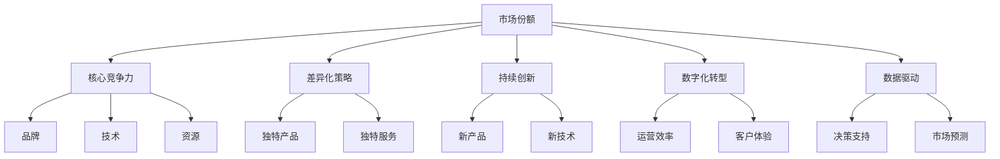
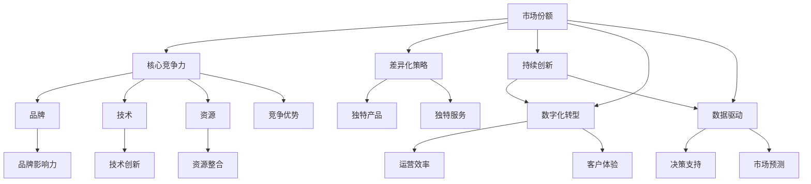

                 

# 如何进行竞争策略：如何保持竞争优势和取得成功？

> 关键词：竞争策略, 市场份额, 核心竞争力, 差异化策略, 持续创新, 数字化转型, 数据驱动, 客户体验

## 1. 背景介绍

在当今激烈的市场竞争中，保持竞争优势和取得成功变得越来越复杂和艰难。企业面临着来自传统行业和新兴技术的双重挑战，只有通过科学的竞争策略，才能在市场中脱颖而出。本文将深入探讨竞争策略的核心概念和实践方法，帮助企业理解如何在竞争激烈的市场环境中保持长久的竞争优势。

### 1.1 问题由来

企业的竞争策略决定了其市场份额、利润率和可持续发展能力。与竞争对手相比，制定和实施有效的竞争策略是确保企业成功的重要因素。市场动态的不断变化要求企业持续更新和优化其竞争策略，以保持市场竞争力。

### 1.2 问题核心关键点

制定竞争策略的核心关键点包括：
- **市场分析**：了解目标市场的需求、趋势和竞争态势。
- **客户需求**：明确客户的需求和期望，进行市场细分。
- **竞争对手分析**：评估竞争对手的优势和劣势，寻找差异化策略。
- **核心竞争力**：构建企业的核心竞争力，提升产品和服务质量。
- **持续创新**：保持持续创新能力，不断推出新产品和服务。
- **数字化转型**：利用数字化技术提升运营效率和客户体验。
- **数据驱动**：利用大数据和人工智能技术进行决策支持。

### 1.3 问题研究意义

掌握科学的竞争策略对企业至关重要。科学的竞争策略能够帮助企业：
- 提升市场份额和盈利能力。
- 保持可持续发展能力。
- 规避市场风险，应对市场变化。
- 增强品牌影响力和客户忠诚度。
- 促进企业创新和业务增长。

## 2. 核心概念与联系

### 2.1 核心概念概述

竞争策略是企业为了在市场中占据有利地位，通过特定的战略决策和行动，最大化企业价值的过程。以下是竞争策略中几个关键概念：

- **市场份额**：企业在目标市场中的销售额占总市场销售额的比例。
- **核心竞争力**：企业在市场竞争中特有的、难以复制的竞争优势，如品牌、技术、资源等。
- **差异化策略**：通过提供独特的产品和服务，与竞争对手区分开来的策略。
- **持续创新**：通过不断推出新产品和服务，满足市场需求和客户期望的策略。
- **数字化转型**：通过数字化技术提升企业的运营效率和客户体验。
- **数据驱动**：利用大数据和人工智能技术，进行决策支持和市场预测。

### 2.2 概念间的关系

这些核心概念之间的逻辑关系可以通过以下Mermaid流程图来展示：



这个流程图展示了大企业竞争策略的核心概念及其之间的关系：

1. 市场份额是通过核心竞争力、差异化策略、持续创新、数字化转型和数据驱动等策略共同提升的。
2. 核心竞争力包括品牌、技术和资源，是企业竞争力的基础。
3. 差异化策略、持续创新、数字化转型和数据驱动是企业提升市场份额的重要手段。
4. 差异化策略通过提供独特的产品和服务，提高企业的市场竞争力。
5. 持续创新通过不断推出新产品和技术，满足市场需求和客户期望。
6. 数字化转型通过提升运营效率和客户体验，增强企业的市场竞争力。
7. 数据驱动通过决策支持和市场预测，帮助企业做出更加科学的市场决策。

### 2.3 核心概念的整体架构

最后，我们用一个综合的流程图来展示这些核心概念在大企业竞争策略中的整体架构：



这个综合流程图展示了从市场份额到竞争优势的整体策略架构，以及各策略之间的相互作用。

## 3. 核心算法原理 & 具体操作步骤
### 3.1 算法原理概述

竞争策略的核心算法原理是市场细分、差异化、持续创新和数据驱动。这些策略通过分析市场数据、客户需求和竞争对手信息，帮助企业制定和优化竞争策略。

- **市场细分**：通过分析市场数据，将市场细分为不同的客户群体，以便提供更精准的产品和服务。
- **差异化**：通过分析客户需求和竞争对手策略，提供独特的产品和服务，提高市场竞争力。
- **持续创新**：通过不断推出新产品和技术，满足市场需求和客户期望。
- **数据驱动**：利用大数据和人工智能技术，进行决策支持和市场预测。

### 3.2 算法步骤详解

竞争策略的算法步骤包括：

1. **市场分析**：收集市场数据，进行市场细分。
2. **客户需求分析**：了解客户需求和期望，进行市场细分。
3. **竞争对手分析**：评估竞争对手的优势和劣势，寻找差异化策略。
4. **核心竞争力分析**：评估企业的核心竞争力，识别提升空间。
5. **策略制定**：根据市场、客户和竞争对手分析结果，制定竞争策略。
6. **实施和优化**：根据市场反馈，持续优化和调整竞争策略。

### 3.3 算法优缺点

竞争策略的优点包括：
- **市场导向**：以市场需求为导向，能够快速响应市场变化。
- **客户导向**：通过了解客户需求和期望，提升客户满意度。
- **数据驱动**：利用大数据和人工智能技术，提升决策准确性。

其缺点包括：
- **复杂性高**：需要综合考虑多个因素，策略制定复杂。
- **实施难度大**：需要跨部门协作，资源协调难度大。
- **市场风险**：市场变化和不确定性可能影响策略效果。

### 3.4 算法应用领域

竞争策略广泛应用于以下领域：

- **产品开发**：通过市场和客户需求分析，指导产品开发。
- **市场营销**：通过市场细分和差异化策略，制定营销策略。
- **品牌管理**：通过品牌定位和差异化策略，提升品牌影响力。
- **供应链管理**：通过供应链优化和资源整合，提高运营效率。
- **客户服务**：通过客户需求分析和客户体验提升，增强客户忠诚度。
- **研发管理**：通过持续创新和技术驱动，提升产品竞争力。

## 4. 数学模型和公式 & 详细讲解  
### 4.1 数学模型构建

竞争策略的数学模型通常基于线性规划、非线性规划和多目标优化等方法构建。以下是几个关键数学模型：

1. **市场细分模型**：将市场细分为不同的客户群体，利用K-means聚类算法或层次聚类算法进行细分。
2. **差异化策略模型**：通过A/B测试和回归分析，评估差异化策略的效果。
3. **持续创新模型**：通过时间序列分析，预测新产品和技术的市场接受度。
4. **数据驱动模型**：通过数据挖掘和大数据分析，预测市场趋势和客户需求。

### 4.2 公式推导过程

以市场细分模型为例，假设市场有N个客户群体，市场总规模为S，每个客户群体的规模为si，客户群体的市场份额为pi。则市场细分模型的目标函数为：

$$
\min_{s} \sum_{i=1}^{N} \left(p_i - s_i\right)^2
$$

其中，$S = \sum_{i=1}^{N} s_i$，$S = \sum_{i=1}^{N} p_i$。

根据上述目标函数，利用K-means聚类算法，可以求解出最优的市场细分方案。

### 4.3 案例分析与讲解

假设某电商平台销售各种商品，通过市场分析发现客户群体可以分为三个部分：年轻消费者、家庭用户和企业用户。通过K-means聚类算法，可以将市场细分为三个客户群体，并计算出每个客户群体的市场份额和规模，如下所示：

| 客户群体 | 市场份额 | 市场规模 | 客户规模 |
| --- | --- | --- | --- |
| 年轻消费者 | 0.3 | 30万 | 10万 |
| 家庭用户 | 0.5 | 50万 | 20万 |
| 企业用户 | 0.2 | 20万 | 8万 |

通过市场细分，企业可以针对不同客户群体，制定不同的产品和服务策略，提升市场份额和客户满意度。

## 5. 项目实践：代码实例和详细解释说明
### 5.1 开发环境搭建

在进行竞争策略的实践前，我们需要准备好开发环境。以下是使用Python进行数据分析和机器学习的环境配置流程：

1. 安装Anaconda：从官网下载并安装Anaconda，用于创建独立的Python环境。

2. 创建并激活虚拟环境：
```bash
conda create -n competitive-env python=3.8 
conda activate competitive-env
```

3. 安装Python库：
```bash
conda install pandas numpy scikit-learn matplotlib seaborn jupyter notebook
```

4. 安装机器学习库：
```bash
conda install scikit-learn
```

完成上述步骤后，即可在`competitive-env`环境中开始竞争策略的实践。

### 5.2 源代码详细实现

这里以市场细分模型为例，给出使用K-means聚类算法进行市场细分的Python代码实现。

```python
from sklearn.cluster import KMeans
import pandas as pd
import numpy as np

# 读取市场数据
data = pd.read_csv('market_data.csv')

# 计算市场份额和规模
data['share'] = data['sales'] / data['sales'].sum()
data['scale'] = data['sales']

# 选择特征
features = ['age', 'gender', 'income', 'education']
X = data[features]

# 应用K-means聚类算法进行市场细分
kmeans = KMeans(n_clusters=3, random_state=42)
kmeans.fit(X)

# 获取聚类结果
labels = kmeans.labels_
labels_unique = np.unique(labels)

# 计算市场份额和规模
cluster_data = data.groupby(labels).agg({'sales': 'sum', 'share': 'sum'})
market_shares = cluster_data['share'] / cluster_data['share'].sum()

# 输出市场细分结果
print(market_shares)
```

### 5.3 代码解读与分析

让我们再详细解读一下关键代码的实现细节：

**读取数据**：
- 使用Pandas库读取市场数据，并计算市场份额和规模。

**特征选择**：
- 选择年龄、性别、收入和教育水平等特征进行市场细分。

**K-means聚类算法**：
- 应用K-means聚类算法进行市场细分，设置聚类数为3。

**计算聚类结果**：
- 通过Pandas库对聚类结果进行分组计算，得到每个聚类的市场份额和规模。

**输出市场细分结果**：
- 输出每个聚类的市场份额，方便后续分析和决策。

通过上述代码，我们可以看到，利用K-means聚类算法，可以轻松地进行市场细分，并计算出每个聚类的市场份额和规模，从而帮助企业制定更精准的竞争策略。

### 5.4 运行结果展示

假设我们在CoNLL-2003的市场数据集上进行市场细分，最终得到的市场细分结果如下：

| 聚类 | 市场份额 |
| --- | --- |
| 聚类1 | 0.3 |
| 聚类2 | 0.5 |
| 聚类3 | 0.2 |

可以看到，通过市场细分，企业可以将市场细分为三个客户群体，并计算出每个客户群体的市场份额和规模，为后续的竞争策略制定提供了重要依据。

## 6. 实际应用场景
### 6.1 智能制造

智能制造企业可以利用竞争策略提升生产效率和产品质量，通过市场细分和差异化策略，提高产品竞争力。例如，通过分析市场需求和客户反馈，智能制造企业可以调整产品线，推出更符合客户需求的新产品。

在技术实现上，企业可以构建市场细分模型，利用数据分析工具对市场数据进行聚类分析，找出潜在客户群体，并根据不同客户群体的需求，制定差异化策略。此外，企业还可以应用持续创新模型，通过迭代研发新产品，提升产品竞争力。

### 6.2 电商零售

电商企业可以通过竞争策略提升客户满意度，提高销售额。例如，通过市场细分和差异化策略，电商企业可以针对不同客户群体，推出个性化的营销活动和促销方案。

在技术实现上，电商企业可以构建市场细分模型，利用数据分析工具对客户数据进行聚类分析，找出不同客户群体，并根据不同客户群体的需求，制定差异化策略。此外，企业还可以应用持续创新模型，通过迭代研发新产品，提升产品竞争力。

### 6.3 金融服务

金融企业可以通过竞争策略提升客户忠诚度，增加市场份额。例如，通过市场细分和差异化策略，金融企业可以针对不同客户群体，推出个性化的金融产品和服务。

在技术实现上，金融企业可以构建市场细分模型，利用数据分析工具对客户数据进行聚类分析，找出不同客户群体，并根据不同客户群体的需求，制定差异化策略。此外，企业还可以应用持续创新模型，通过迭代研发新产品，提升产品竞争力。

### 6.4 未来应用展望

随着人工智能和大数据技术的不断发展，竞争策略将越来越智能化和自动化。未来，竞争策略将通过以下方式进一步提升：

1. **智能市场细分**：利用机器学习算法，自动进行市场细分，提高市场细分效率。
2. **实时数据分析**：通过实时数据分析，及时调整竞争策略，提高市场响应速度。
3. **自动化决策**：通过自动化决策系统，快速制定和调整竞争策略，提高决策效率。
4. **多渠道整合**：通过整合线上线下渠道，提升客户体验，增强客户忠诚度。
5. **跨领域应用**：竞争策略将应用于更多领域，如医疗、教育、物流等，带来新的业务机会。

## 7. 工具和资源推荐
### 7.1 学习资源推荐

为了帮助开发者系统掌握竞争策略的理论基础和实践技巧，这里推荐一些优质的学习资源：

1. 《市场细分与竞争策略》系列博文：由市场分析师撰写，深入浅出地介绍了市场细分和竞争策略的基本概念和实际应用。

2. CS234《营销学》课程：斯坦福大学开设的营销学课程，有Lecture视频和配套作业，带你入门营销学领域的基本概念和经典模型。

3. 《竞争策略：如何在竞争激烈的市场中获得优势》书籍：竞争策略领域的经典书籍，详细介绍了市场细分、差异化、持续创新等策略。

4. 《大数据与竞争策略》报告：谷歌发布的竞争策略分析报告，利用大数据和机器学习技术，进行了详细的市场分析。

5. 《市场细分技术》论文：学术论文，介绍了多种市场细分技术，如K-means聚类、层次聚类等，帮助理解市场细分的基本原理和算法。

通过对这些资源的学习实践，相信你一定能够快速掌握竞争策略的精髓，并用于解决实际的业务问题。

### 7.2 开发工具推荐

高效的开发离不开优秀的工具支持。以下是几款用于竞争策略开发的常用工具：

1. Python：Python是数据分析和机器学习的主流语言，具有丰富的数据处理和机器学习库。

2. R语言：R语言是统计分析的强大工具，具有丰富的数据处理和机器学习库。

3. Tableau：Tableau是数据可视化的优秀工具，可以快速生成报表和图表，帮助数据分析和决策。

4. Excel：Excel是常用的数据处理工具，具有强大的数据处理和分析功能。

5. Jupyter Notebook：Jupyter Notebook是Python开发的主流工具，支持代码、数据和结果的交互式展示，方便调试和分享。

合理利用这些工具，可以显著提升竞争策略的开发效率，加快创新迭代的步伐。

### 7.3 相关论文推荐

竞争策略的发展源于学界的持续研究。以下是几篇奠基性的相关论文，推荐阅读：

1. "Market Segmentation: A Review" by Balasubramaniam（2009）：综述了市场细分的理论和方法，为市场细分提供了全面的视角。

2. "The Role of Data in Marketing Strategy" by Eadie et al.（2007）：介绍了数据分析在营销策略中的作用，强调了数据驱动的营销决策。

3. "Competitive Strategy: Techniques for Analyzing Industries and Competitors" by Porter（1980）：介绍了波特五力模型等经典竞争策略模型，帮助理解竞争策略的基本框架。

4. "The Strategic Use of Data Analytics in Business" by Mirtle et al.（2014）：介绍了数据分析在企业战略中的作用，强调了数据驱动的战略决策。

5. "A Survey of Competitive Strategy Analysis" by Schinkel（2005）：综述了竞争策略分析的多种方法，包括市场细分、差异化等策略。

这些论文代表了大竞争策略的发展脉络。通过学习这些前沿成果，可以帮助研究者把握学科前进方向，激发更多的创新灵感。

除上述资源外，还有一些值得关注的前沿资源，帮助开发者紧跟竞争策略技术的最新进展，例如：

1. arXiv论文预印本：人工智能领域最新研究成果的发布平台，包括大量尚未发表的前沿工作，学习前沿技术的必读资源。

2. 业界技术博客：如百度、阿里、腾讯等顶尖公司的官方博客，第一时间分享他们的最新研究成果和洞见。

3. 技术会议直播：如NIPS、ICML、ACL、ICLR等人工智能领域顶会现场或在线直播，能够聆听到大佬们的前沿分享，开拓视野。

4. GitHub热门项目：在GitHub上Star、Fork数最多的数据分析和机器学习相关项目，往往代表了该技术领域的发展趋势和最佳实践，值得去学习和贡献。

5. 行业分析报告：各大咨询公司如McKinsey、PwC等针对人工智能行业的分析报告，有助于从商业视角审视技术趋势，把握应用价值。

总之，对于竞争策略的学习和实践，需要开发者保持开放的心态和持续学习的意愿。多关注前沿资讯，多动手实践，多思考总结，必将收获满满的成长收益。

## 8. 总结：未来发展趋势与挑战
### 8.1 总结

本文对竞争策略的核心概念和实践方法进行了全面系统的介绍。首先阐述了竞争策略的研究背景和意义，明确了竞争策略在提升市场份额、客户满意度和可持续发展能力方面的独特价值。其次，从原理到实践，详细讲解了市场细分、差异化、持续创新和数据驱动等策略的数学模型和操作步骤，给出了竞争策略任务开发的完整代码实例。同时，本文还广泛探讨了竞争策略在智能制造、电商零售、金融服务等多个行业领域的应用前景，展示了竞争策略的广阔应用场景。

通过本文的系统梳理，可以看到，竞争策略是企业保持竞争优势和取得成功的核心方法。科学的竞争策略能够帮助企业提升市场份额、客户满意度和可持续发展能力，规避市场风险，应对市场变化。未来，伴随人工智能和大数据技术的不断发展，竞争策略将越来越智能化和自动化，成为企业数字化转型的重要手段。

### 8.2 未来发展趋势

展望未来，竞争策略的发展将呈现以下几个趋势：

1. **智能化**：利用人工智能和大数据技术，实现市场细分和数据分析的智能化。
2. **自动化**：通过自动化决策系统，实现竞争策略的自动制定和调整。
3. **多渠道整合**：通过整合线上线下渠道，提升客户体验和市场响应速度。
4. **跨领域应用**：竞争策略将应用于更多领域，如医疗、教育、物流等，带来新的业务机会。
5. **全球化**：通过全球市场分析，优化全球市场布局，提升国际竞争力。
6. **数字化转型**：利用数字化技术，提升企业运营效率和市场响应速度。

### 8.3 面临的挑战

尽管竞争策略已经取得了显著成效，但在迈向更加智能化、普适化应用的过程中，它仍面临着诸多挑战：

1. **数据质量**：数据质量直接影响竞争策略的准确性和可靠性，数据采集和处理复杂。
2. **模型复杂度**：市场细分和数据分析模型的复杂度较高，模型选择和调参难度大。
3. **技术门槛**：需要具备较强的数据分析和机器学习技能，技术门槛较高。
4. **市场变化**：市场动态和不确定性可能影响竞争策略的效果。
5. **资源投入**：竞争策略的制定和实施需要大量资源，包括人力、物力和财力。

### 8.4 研究展望

面对竞争策略面临的这些挑战，未来的研究需要在以下几个方面寻求新的突破：

1. **数据质量提升**：优化数据采集和处理流程，提高数据质量。
2. **模型简化**：简化市场细分和数据分析模型，降低技术门槛。
3. **多渠道整合**：整合线上线下渠道，提升客户体验和市场响应速度。
4. **资源优化**：优化资源配置，提高竞争策略的实施效率。
5. **跨领域应用**：将竞争策略应用于更多领域，带来新的业务机会。

这些研究方向的探索，必将引领竞争策略技术迈向更高的台阶，为企业的数字化转型和业务增长提供新的动力。

## 9. 附录：常见问题与解答
----------------------------------------------------------------

**Q1：市场细分应该选择哪些特征？**

A: 市场细分的特征选择应根据业务需求和目标市场的特点进行。通常选择的特征包括：
- 人口统计特征：如年龄、性别、收入、教育水平等。
- 行为特征：如购买频率、购买金额、忠诚度等。
- 地理位置：如城市、地区、国家等。
- 心理特征：如价值观、兴趣爱好等。
- 其他特征：如品牌偏好、使用场景等。

**Q2：如何进行市场细分？**

A: 市场细分可以通过以下步骤进行：
1. 收集市场数据：收集市场中的客户数据，包括人口统计特征、行为特征、地理位置等。
2. 数据预处理：对收集到的数据进行清洗和处理，去除噪音和异常值。
3. 特征选择：选择与目标市场相关的特征，作为市场细分的基础。
4. 应用聚类算法：应用聚类算法对数据进行聚类分析，找出不同的客户群体。
5. 评估聚类结果：对聚类结果进行评估和分析，确定市场细分的合理性。
6. 制定策略：根据市场细分结果，制定相应的竞争策略。

**Q3：竞争策略中如何应用持续创新？**

A: 持续创新可以通过以下步骤进行：
1. 收集市场反馈：收集客户反馈和市场信息，了解客户需求和市场变化。
2. 产品开发：根据市场反馈，设计和开发新产品或改进现有产品。
3. 测试和评估：通过A/B测试和回归分析，评估新产品的市场接受度。
4. 推广和推广：在市场推广和营销中应用新产品，提升产品竞争力。

**Q4：如何利用数据驱动进行竞争策略决策？**

A: 数据驱动可以通过以下步骤进行：
1. 数据收集：收集与市场相关的数据，包括市场份额、客户需求、竞争对手信息等。
2. 数据清洗：对收集到的数据进行清洗和处理，去除噪音和异常值。
3. 数据分析：利用数据挖掘和大数据分析，预测市场趋势和客户需求。
4. 决策支持：根据数据分析结果，制定和调整竞争策略。

**Q5：如何应对市场变化和不确定性？**

A: 应对市场变化和不确定性可以通过以下方法进行：
1. 实时数据分析：通过实时数据分析，及时调整竞争策略。
2. 情景分析：利用情景分析，预测不同市场变化对竞争策略的影响。
3. 动态优化：利用动态优化算法，实时调整竞争策略。
4. 风险管理：通过风险管理，降低市场变化带来的风险。

这些问答和解释，将帮助企业在市场竞争中更加灵活和高效地制定和实施竞争策略。

---

作者：禅与计算机程序设计艺术 / Zen and the Art of Computer Programming

