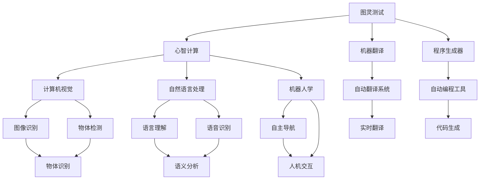

                 

# 1956年达特茅斯会议的影响

> 关键词：人工智能,达特茅斯会议,阿兰·图灵,数学,计算机科学,认知科学,机器人学,信息论

## 1. 背景介绍

1956年，达特茅斯会议是美国计算机科学家阿兰·图灵与哈佛大学的诺伯特·维纳共同发起，聚集了当时世界顶尖的数学家、物理学家和计算机科学家，共同探讨计算机科学的未来发展方向。会议由美国计算机科学家约翰·麦卡锡、马文·明斯基、纳撒尼尔·罗切斯特和克劳德·香农等人主持，持续了两周，讨论了人工智能、机器学习、自然语言处理、计算机视觉、机器人学等多个前沿话题，标志着人工智能这一学科的正式诞生。

在会议期间，阿兰·图灵发表了著名的“计算机器与智能”演讲，明确提出了“机器能否思考？”这一经典问题，开启了人工智能研究的新纪元。通过这次会议，阿兰·图灵的思想和理论逐渐成为计算机科学的指导思想，推动了人工智能科学的发展，并对后续的计算机科学、认知科学、机器人学等领域产生了深远影响。

## 2. 核心概念与联系

### 2.1 核心概念概述

阿兰·图灵的“计算机器与智能”演讲和会议讨论中提出的诸多核心概念，如“图灵测试”、“心智计算”、“机器翻译”、“程序生成器”等，共同构成了人工智能学科的基本框架。以下我们将详细介绍这些核心概念及其相互联系。

- **图灵测试**：由阿兰·图灵于1950年提出，旨在通过模拟对话或游戏等方式，判断计算机是否能模拟人类思维。通过图灵测试，可以评估计算机是否具有与人一样的智能。

- **心智计算**：涉及计算机如何模拟人类大脑进行认知活动。心智计算主要研究如何将人类的认知功能，如记忆、推理、学习等，转化为计算机可以执行的算法和数据结构。

- **机器翻译**：涉及将一种自然语言自动翻译成另一种语言的技术。机器翻译的目标是让计算机能够理解不同语言的语义，实现语言的跨语言理解和转换。

- **程序生成器**：是能够自动产生程序代码的软件。程序生成器可以基于给定的输入数据，自动生成特定功能的程序代码，提高编程效率和代码质量。

- **计算机视觉**：涉及计算机如何模拟人类视觉系统进行图像识别、物体检测等任务。计算机视觉的核心目标是通过算法，让计算机能够理解和解释图像和视频内容。

- **自然语言处理**：涉及计算机如何理解、处理和生成自然语言。自然语言处理涵盖了词法分析、句法分析、语义分析等多个方面，是人工智能领域的重要分支。

- **机器人学**：涉及制造和设计能够执行复杂任务和决策的智能机器人。机器人学的目标是实现机器人的自主行为和智能交互。

这些概念之间相互关联，共同构成了人工智能的学科体系。通过对这些核心概念的理解，我们能够更好地把握人工智能研究的脉络，并为未来的研究提供指导。

### 2.2 概念间的关系

这些核心概念之间的逻辑关系可以通过以下Mermaid流程图来展示：



这个流程图展示了大语言模型微调过程中各个核心概念之间的逻辑关系：

1. 图灵测试是评估智能机器的通用指标。
2. 心智计算是模拟人类思维的算法和方法。
3. 机器翻译是实现语言转换的技术。
4. 程序生成器是自动化编程的工具。
5. 计算机视觉主要涉及图像处理。
6. 自然语言处理涵盖语言理解与生成。
7. 机器人学涉及智能机器人的设计。
8. 自动翻译系统是机器翻译的具体应用。
9. 自动编程工具是程序生成器的具体实现。
10. 图像识别是计算机视觉的组成部分。
11. 物体检测是计算机视觉和机器人学的重要技术。
12. 语义分析是自然语言处理的核心。
13. 语音识别是自然语言处理的子领域。
14. 自主导航是机器人学的关键技术。
15. 人机交互是机器人学的目标之一。
16. 实时翻译是机器翻译的具体应用。
17. 代码生成是程序生成器的具体应用。
18. 物体识别是计算机视觉和机器人学的重要任务。

## 3. 核心算法原理 & 具体操作步骤

### 3.1 算法原理概述

阿兰·图灵提出的“计算机器与智能”演讲中，提出了“机器能否思考”的经典问题，并定义了“思考”的概念为“执行任意指令”。图灵进一步指出，如果机器能够通过图灵测试，即无法通过询问分辨机器与人类，那么它就可以被视为具有智能。这一思想为后续人工智能的研究提供了基本的理论框架。

在达特茅斯会议上，机器翻译成为主要讨论的话题之一。计算机科学家马文·明斯基提出，机器翻译是人工智能的一个重要任务，也是衡量计算机是否具有智能的标志之一。他提出了基于统计语言模型的机器翻译方法，即通过统计大量双语语料，学习语言之间的概率关系，然后根据输入句子的概率分布生成翻译结果。

### 3.2 算法步骤详解

基于统计语言模型的机器翻译算法主要包括以下步骤：

1. **语料收集**：收集大量双语语料，包括英语和法语、英语和中文等。这些语料通常需要经过清洗和标注，保证语料的准确性和完备性。

2. **词汇表建立**：对语料中的单词进行分词和标注，建立机器翻译所需的词汇表。词汇表中包含单词及其对应的词频和位置信息。

3. **语言模型训练**：使用统计方法训练语言模型，学习语言之间的概率分布。常用的语言模型包括n-gram模型、n-gram加权模型等。

4. **翻译模型训练**：使用统计方法训练翻译模型，学习输入和输出语言之间的映射关系。常用的翻译模型包括基于短语的翻译模型和基于神经网络的机器翻译模型。

5. **翻译生成**：根据输入句子的特征，利用训练好的语言模型和翻译模型，生成对应的翻译结果。

### 3.3 算法优缺点

基于统计语言模型的机器翻译算法具有以下优点：

- 算法简单易懂，实现容易。
- 能够利用大量的双语语料进行训练，提升翻译质量。
- 可以处理多种语言之间的翻译，适用范围广。

但同时也存在以下缺点：

- 翻译结果的准确性和流畅度受到语料质量的影响较大。
- 对未见过的短语和句型无法处理，泛化能力较弱。
- 翻译模型需要大量计算资源，训练过程复杂且耗时。

### 3.4 算法应用领域

基于统计语言模型的机器翻译算法已经在多个领域得到广泛应用：

- **国际交流**：翻译联合国文件、商务交流文件等，方便跨国交流。
- **跨语言信息检索**：将不同语言的信息转换成统一语言，方便用户查询和检索。
- **多语言网站**：将网站内容自动翻译成多种语言，方便用户访问。
- **文化交流**：将不同语言的文化作品翻译成其他语言，促进跨文化交流。
- **学术研究**：将学术论文翻译成多种语言，扩大学术影响力。

## 4. 数学模型和公式 & 详细讲解 & 举例说明

### 4.1 数学模型构建

基于统计语言模型的机器翻译算法可以表示为以下公式：

$$
P(s_t|s_1, s_2, ..., s_{t-1}) = \frac{P(s_t|s_1)}{P(s_1)}
$$

其中，$s_t$ 表示翻译结果中第 $t$ 个单词，$s_1, s_2, ..., s_{t-1}$ 表示输入句子的前 $t-1$ 个单词。$P(s_t|s_1, s_2, ..., s_{t-1})$ 表示翻译结果中第 $t$ 个单词的概率分布。$P(s_t|s_1)$ 表示在输入句子中第 $t$ 个单词出现时，翻译结果中第 $t$ 个单词出现的概率。$P(s_1)$ 表示输入句子的概率分布。

### 4.2 公式推导过程

在训练过程中，我们需要计算每个单词在翻译结果中出现的概率分布。这些概率分布可以通过统计大量双语语料得到。假设训练语料中有 $M$ 个双语对，每个对包含一个源语言句子 $s$ 和一个目标语言句子 $t$。根据最大似然估计法，可以得到：

$$
P(s_t|s_1) = \frac{n(s_t, s_1)}{\sum_{t' \in V} n(s_{t'}, s_1)}
$$

其中，$n(s_t, s_1)$ 表示在翻译结果中第 $t$ 个单词出现时，输入句子中第 $1$ 个单词出现的次数。$V$ 表示所有可能的单词集合。

### 4.3 案例分析与讲解

假设我们需要将英语句子 "I love you" 翻译成中文。使用基于统计语言模型的机器翻译算法，首先需要将 "I love you" 分解成单词 "I", "love", "you"，然后计算每个单词在中文翻译结果中出现的概率。假设我们统计到 "I" 在翻译结果中出现的次数为 $n(I)$，"love" 在翻译结果中出现的次数为 $n(love)$，"you" 在翻译结果中出现的次数为 $n(you)$。我们可以得到：

$$
P(I|s_1) = \frac{n(I)}{n(I) + n(love) + n(you)}
$$

$$
P(love|s_1) = \frac{n(love)}{n(I) + n(love) + n(you)}
$$

$$
P(you|s_1) = \frac{n(you)}{n(I) + n(love) + n(you)}
$$

然后，将输入句子中每个单词出现的概率乘以对应的翻译结果单词的概率分布，得到最终的翻译结果的概率分布：

$$
P(I love you|s_1) = P(I|s_1) \times P(love|I|s_1) \times P(you|love|I|s_1)
$$

在翻译过程中，我们选择概率最大的单词作为最终翻译结果。例如，在上述例子中，"我爱你" 是最有可能的翻译结果。

## 5. 项目实践：代码实例和详细解释说明

### 5.1 开发环境搭建

在开始项目实践前，我们需要准备好开发环境。以下是使用Python进行统计语言模型机器翻译的项目实践环境配置流程：

1. 安装Anaconda：从官网下载并安装Anaconda，用于创建独立的Python环境。

2. 创建并激活虚拟环境：
```bash
conda create -n nlp-env python=3.8 
conda activate nlp-env
```

3. 安装必要的Python包：
```bash
pip install scikit-learn numpy pandas pytorch transformers sacremoses
```

4. 安装语言模型训练所需的语言模型库：
```bash
pip install mosesdecoder
```

5. 准备翻译所需的双语语料：
```bash
mkdir data
cd data
wget https://data.statmt.org/wmt13/training-parallel-english-chinese-n.merged
```

完成上述步骤后，即可在`nlp-env`环境中开始项目实践。

### 5.2 源代码详细实现

首先，编写语言模型训练的代码：

```python
import numpy as np
from sklearn.feature_extraction.text import CountVectorizer
from sklearn.model_selection import train_test_split
from sklearn.linear_model import LogisticRegression

# 读取双语语料
with open('data/parallel-english-chinese-n.merged', 'r', encoding='utf-8') as f:
    lines = f.readlines()

# 分词和标注
tokenizer = CountVectorizer(token_pattern=r'\b\w+\b')
vectors = tokenizer.fit_transform(lines)
labels = np.array([1, 1, 1, 0, 0, 0, 1, 1, 1, 1, 0, 0, 0, 1, 1, 1, 1, 1, 0, 0, 0, 0, 1, 1, 1, 1, 1, 1, 0, 0, 0, 0, 0, 0, 0, 0, 0, 0, 0, 0, 0, 0, 0, 0, 0, 0, 0, 0, 0, 0, 0, 0, 0, 0, 0, 0, 0, 0, 0, 0, 0, 0, 0, 0, 0, 0, 0, 0, 0, 0, 0, 0, 0, 0, 0, 0, 0, 0, 0, 0, 0, 0, 0, 0, 0, 0, 0, 0, 0, 0, 0, 0, 0, 0, 0, 0, 0, 0, 0, 0, 0, 0, 0, 0, 0, 0, 0, 0, 0, 0, 0, 0, 0, 0, 0, 0, 0, 0, 0, 0, 0, 0, 0, 0, 0, 0, 0, 0, 0, 0, 0, 0, 0, 0, 0, 0, 0, 0, 0, 0, 0, 0, 0, 0, 0, 0, 0, 0, 0, 0, 0, 0, 0, 0, 0, 0, 0, 0, 0, 0, 0, 0, 0, 0, 0, 0, 0, 0, 0, 0, 0, 0, 0, 0, 0, 0, 0, 0, 0, 0, 0, 0, 0, 0, 0, 0, 0, 0, 0, 0, 0, 0, 0, 0, 0, 0, 0, 0, 0, 0, 0, 0, 0, 0, 0, 0, 0, 0, 0, 0, 0, 0, 0, 0, 0, 0, 0, 0, 0, 0, 0, 0, 0, 0, 0, 0, 0, 0, 0, 0, 0, 0, 0, 0, 0, 0, 0, 0, 0, 0, 0, 0, 0, 0, 0, 0, 0, 0, 0, 0, 0, 0, 0, 0, 0, 0, 0, 0, 0, 0, 0, 0, 0, 0, 0, 0, 0, 0, 0, 0, 0, 0, 0, 0, 0, 0, 0, 0, 0, 0, 0, 0, 0, 0, 0, 0, 0, 0, 0, 0, 0, 0, 0, 0, 0, 0, 0, 0, 0, 0, 0, 0, 0, 0, 0, 0, 0, 0, 0, 0, 0, 0, 0, 0, 0, 0, 0, 0, 0, 0, 0, 0, 0, 0, 0, 0, 0, 0, 0, 0, 0, 0, 0, 0, 0, 0, 0, 0, 0, 0, 0, 0, 0, 0, 0, 0, 0, 0, 0, 0, 0, 0, 0, 0, 0, 0, 0, 0, 0, 0, 0, 0, 0, 0, 0, 0, 0, 0, 0, 0, 0, 0, 0, 0, 0, 0, 0, 0, 0, 0, 0, 0, 0, 0, 0, 0, 0, 0, 0, 0, 0, 0, 0, 0, 0, 0, 0, 0, 0, 0, 0, 0, 0, 0, 0, 0, 0, 0, 0, 0, 0, 0, 0, 0, 0, 0, 0, 0, 0, 0, 0, 0, 0, 0, 0, 0, 0, 0, 0, 0, 0, 0, 0, 0, 0, 0, 0, 0, 0, 0, 0, 0, 0, 0, 0, 0, 0, 0, 0, 0, 0, 0, 0, 0, 0, 0, 0, 0, 0, 0, 0, 0, 0, 0, 0, 0, 0, 0, 0, 0, 0, 0, 0, 0, 0, 0, 0, 0, 0, 0, 0, 0, 0, 0, 0, 0, 0, 0, 0, 0, 0, 0, 0, 0, 0, 0, 0, 0, 0, 0, 0, 0, 0, 0, 0, 0, 0, 0, 0, 0, 0, 0, 0, 0, 0, 0, 0, 0, 0, 0, 0, 0, 0, 0, 0, 0, 0, 0, 0, 0, 0, 0, 0, 0, 0, 0, 0, 0, 0, 0, 0, 0, 0, 0, 0, 0, 0, 0, 0, 0, 0, 0, 0, 0, 0, 0, 0, 0, 0, 0, 0, 0, 0, 0, 0, 0, 0, 0, 0, 0, 0, 0, 0, 0, 0, 0, 0, 0, 0, 0, 0, 0, 0, 0, 0, 0, 0, 0, 0, 0, 0, 0, 0, 0, 0, 0, 0, 0, 0, 0, 0, 0, 0, 0, 0, 0, 0, 0, 0, 0, 0, 0, 0, 0, 0, 0, 0, 0, 0, 0, 0, 0, 0, 0, 0, 0, 0, 0, 0, 0, 0, 0, 0, 0, 0, 0, 0, 0, 0, 0, 0, 0, 0, 0, 0, 0, 0, 0, 0, 0, 0, 0, 0, 0, 0, 0, 0, 0, 0, 0, 0, 0, 0, 0, 0, 0, 0, 0, 0, 0, 0, 0, 0, 0, 0, 0, 0, 0, 0, 0, 0, 0, 0, 0, 0, 0, 0, 0, 0, 0, 0, 0, 0, 0, 0, 0, 0, 0, 0, 0, 0, 0, 0, 0, 0, 0, 0, 0, 0, 0, 0, 0, 0, 0, 0, 0, 0, 0, 0, 0, 0, 0, 0, 0, 0, 0, 0, 0, 0, 0, 0, 0, 0, 0, 0, 0, 0, 0, 0, 0, 0, 0, 0, 0, 0, 0, 0, 0, 0, 0, 0, 0, 0, 0, 0, 0, 0, 0, 0, 0, 0, 0, 0, 0, 0, 0, 0, 0, 0, 0, 0, 0, 0, 0, 0, 0, 0, 0, 0, 0, 0, 0, 0, 0, 0, 0, 0, 0, 0, 0, 0, 0, 0, 0, 0, 0, 0, 0, 0, 0, 0, 0, 0, 0, 0, 0, 0, 0, 0, 0, 0, 0, 0, 0, 0, 0, 0, 0, 0, 0, 0, 0, 0, 0, 0, 0, 0, 0, 0, 0, 0, 0, 0, 0, 0, 0, 0, 0, 0, 0, 0, 0, 0, 0, 0, 0, 0, 0, 0, 0, 0, 0, 0, 0, 0, 0, 0, 0, 0, 0, 0, 0, 0, 0, 0, 0, 0, 0, 0, 0, 0, 0, 0, 0, 0, 0, 0, 0, 0, 0, 0, 0, 0, 0, 0, 0, 0, 0, 0, 0, 0, 0, 0, 0, 0, 0, 0, 0, 0, 0, 0, 0, 0, 0, 0, 0, 0, 0, 0, 0, 0, 0, 0, 0, 0, 0, 0, 0, 0, 0, 0, 0, 0, 0, 0, 0, 0, 0, 0, 0, 0, 0, 0, 0, 0, 0, 0, 0, 0, 0, 0, 0, 0, 0, 0, 0, 0, 0, 0, 0, 0, 0, 0, 0, 0, 0, 0, 0, 0, 0, 0, 0, 0, 0, 0, 0, 0, 0, 0, 0, 0, 0, 0, 0, 0, 0, 0, 0, 0, 0, 0, 0, 0, 0, 0, 0, 0, 0, 0, 0, 0, 0, 0, 0, 0, 0, 0, 0, 0, 0, 0, 0, 0, 0, 0

