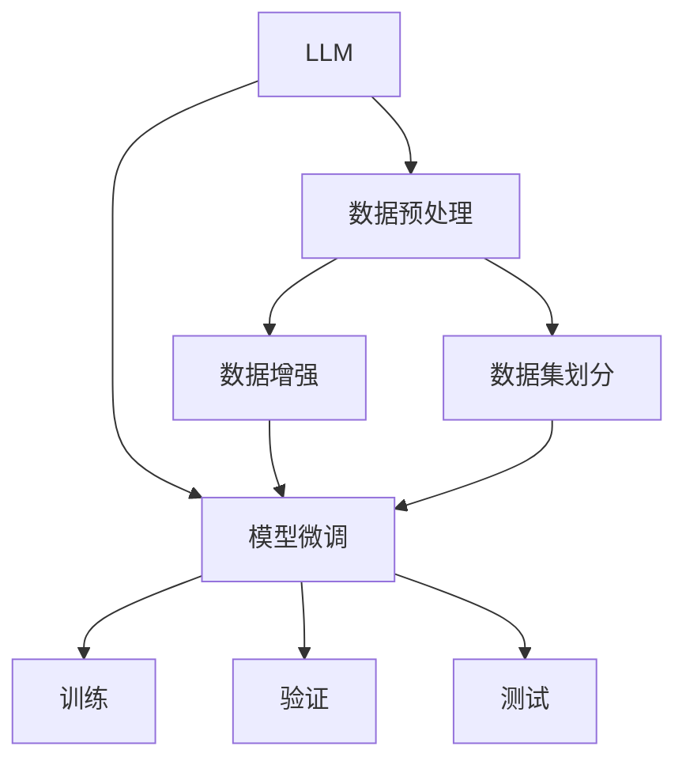
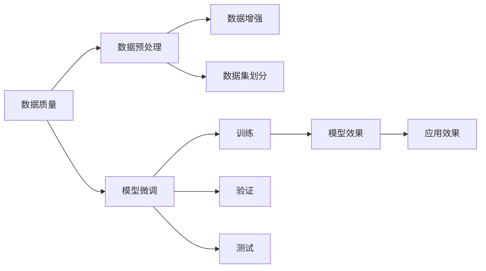

                 

# 数据质量对LLMs的影响

大语言模型(LLMs)已经在诸多领域展示了令人瞩目的能力，从自然语言理解到生成，从机器翻译到对话系统，LLMs都展现出了卓越的表现。然而，无论是预训练还是微调，数据质量对LLMs的影响都是显著的。本文将从背景、概念、原理和实际操作等方面，系统探讨数据质量对LLMs的影响，并提出相应的优化策略，以期对LLMs的实际应用提供有益的指导。

## 1. 背景介绍

### 1.1 问题由来

数据质量的优劣直接影响LLMs的性能表现。高质量的数据可以确保模型能够学习到丰富的语言知识和常识，提升模型的准确性和泛化能力。相反，数据质量不高会导致模型学到错误的知识，降低模型的效果。

目前，LLMs的应用场景涉及多个领域，如自然语言理解、对话系统、机器翻译等。在每个应用领域，数据的质量标准和来源都可能存在差异，这使得数据质量对模型性能的影响更加复杂。因此，理解数据质量对LLMs的影响，并采取有效的数据处理策略，对于提升模型性能、降低应用成本具有重要意义。

### 1.2 问题核心关键点

数据质量对LLMs的影响主要体现在以下几个方面：

1. **数据的多样性**：数据的多样性反映了模型在处理不同类型、不同领域的任务时的能力。多样化的数据有助于模型学习到更广泛的语言规律和知识。
2. **数据的代表性**：数据的代表性关系到模型在不同应用场景下的泛化能力。代表性不足的数据可能导致模型在特定领域表现不佳。
3. **数据的噪声**：数据中的噪声会影响模型的训练效果，使模型学习到错误的知识。
4. **数据的不平衡**：数据的不平衡会影响模型在不同类别的分类能力，导致模型在特定类别上表现欠佳。
5. **数据的时效性**：数据的时效性反映了数据对于当前任务和应用环境的适用性。过时的数据可能无法适应当前的应用需求。

这些关键点共同构成了数据质量对LLMs影响的核心，理解这些影响因素对于优化模型性能、提升应用效果具有重要意义。

## 2. 核心概念与联系

### 2.1 核心概念概述

为了更系统地探讨数据质量对LLMs的影响，我们需要了解一些关键概念：

- **LLM（大语言模型）**：指通过大规模数据预训练和微调得到的具有强大语言理解和生成能力的模型，如BERT、GPT等。
- **数据质量（Data Quality）**：指数据的准确性、完整性、一致性、及时性等属性，是确保模型训练和推理效果的重要因素。
- **数据预处理（Data Preprocessing）**：包括数据清洗、标准化、归一化等技术，目的是提升数据质量，便于模型训练。
- **数据增强（Data Augmentation）**：通过增加数据多样性，提升模型对不同数据分布的适应能力，增强模型泛化能力。
- **数据集划分（Data Splitting）**：将数据集划分为训练集、验证集和测试集，用于模型训练、调参和评估。
- **模型微调（Fine-Tuning）**：在预训练模型的基础上，针对特定任务进行有监督训练，优化模型在该任务上的性能。

这些概念之间的联系可以通过以下Mermaid流程图来展示：



这个流程图展示了LLM和数据处理之间的逻辑关系：

1. LLM模型在预训练和微调过程中，需要高质量的数据作为输入。
2. 数据预处理和增强技术可以提高数据质量，为模型训练提供更好的基础。
3. 数据集划分用于模型训练和调参，测试集用于评估模型性能。
4. 模型微调通过有监督学习，提升模型在特定任务上的性能。

### 2.2 概念间的关系

这些概念之间的关系可以通过以下Mermaid流程图来进一步展示：



这个流程图展示了数据质量对LLMs性能的影响路径：

1. 数据质量影响数据预处理和增强效果，进而影响模型训练和验证效果。
2. 数据质量对模型微调的效果有直接影响，最终反映在模型在特定任务上的性能表现。
3. 应用效果受模型性能影响，高质量数据能够提升模型在实际应用中的表现。

## 3. 核心算法原理 & 具体操作步骤

### 3.1 算法原理概述

数据质量对LLMs的影响主要体现在模型的预训练和微调过程中。预训练阶段，高质量的数据能够帮助模型学习到更丰富的语言知识，提升模型的通用能力。微调阶段，数据质量决定了模型在特定任务上的表现，高质量的数据有助于模型更好地适应任务要求，提升性能。

预训练阶段的数据质量主要关注数据的代表性、多样性和噪声水平。数据代表性反映了数据的覆盖范围和典型性，多样性决定了模型对不同语言的适应能力，噪声水平则影响模型的学习效果。微调阶段的数据质量主要关注数据的代表性、不平衡性和时效性。数据代表性决定了模型在特定任务上的泛化能力，不平衡性影响模型在少数类别上的分类效果，时效性决定了模型在新数据上的适应能力。

### 3.2 算法步骤详解

基于上述分析，数据质量对LLMs的影响可以分为预训练和微调两个阶段进行详细探讨。

**预训练阶段**：

1. **数据准备**：收集高质量、多样化的文本数据，确保数据来源广泛，覆盖不同语言、领域和风格。
2. **数据清洗**：去除数据中的噪声和无用信息，如拼写错误、格式不规范等。
3. **数据标准化**：对数据进行标准化处理，如统一字符编码、去除停用词等。
4. **数据增强**：通过增加数据的多样性，提升模型对不同数据分布的适应能力，如回译、近义词替换等。

**微调阶段**：

1. **数据准备**：选择与微调任务相关的数据集，确保数据的代表性、多样性和时效性。
2. **数据预处理**：对数据进行清洗、标准化和归一化处理，去除噪声和无用信息。
3. **数据增强**：通过增加数据的多样性，提升模型对不同数据分布的适应能力，如数据扩充、标签平衡等。
4. **模型微调**：在预训练模型的基础上，针对特定任务进行有监督训练，优化模型在该任务上的性能。

### 3.3 算法优缺点

数据质量对LLMs的影响主要体现在以下几个方面：

**优点**：

1. **提升模型性能**：高质量的数据能够帮助模型学习到更丰富的语言知识，提升模型的通用能力和特定任务的表现。
2. **降低训练成本**：高质量的数据能够使模型更快地收敛，减少训练时间和资源消耗。
3. **提高模型泛化能力**：高质量的数据有助于模型在多种数据分布上表现稳定，提升模型的泛化能力。

**缺点**：

1. **获取成本高**：高质量的数据往往需要更高的成本和更多的工作量，包括数据收集、清洗和标准化。
2. **数据多样性难以保证**：高质量数据的获取和处理往往受限于数据来源和处理技术，难以保证数据的多样性。
3. **数据时效性难以保证**：数据的时效性反映了数据对于当前任务和应用环境的适用性，过时的数据可能无法适应当前的应用需求。

### 3.4 算法应用领域

数据质量对LLMs的影响不仅限于自然语言处理领域，在多个应用领域中都有体现。以下是几个主要应用领域：

1. **自然语言理解**：数据质量直接影响模型的语言理解和生成能力，高质量的数据有助于提升模型的准确性和泛化能力。
2. **对话系统**：数据质量决定了对话系统的回答质量，多样化的数据有助于提升系统对不同场景和语境的适应能力。
3. **机器翻译**：数据质量影响模型的语言翻译能力，高质量的数据有助于提升模型的翻译效果和泛化能力。
4. **文本摘要**：数据质量直接影响模型的摘要效果，多样化的数据有助于提升模型的摘要准确性和泛化能力。
5. **情感分析**：数据质量直接影响模型的情感分类效果，高质量的数据有助于提升模型的情感分析能力和泛化能力。

## 4. 数学模型和公式 & 详细讲解 & 举例说明

### 4.1 数学模型构建

在讨论数据质量对LLMs的影响时，我们通常使用以下数学模型来描述模型训练和微调过程：

设预训练模型为 $M_{\theta}$，其中 $\theta$ 为预训练得到的模型参数。给定下游任务 $T$ 的标注数据集 $D=\{(x_i,y_i)\}_{i=1}^N$，微调的目标是找到新的模型参数 $\hat{\theta}$，使得：

$$
\hat{\theta}=\mathop{\arg\min}_{\theta} \mathcal{L}(M_{\theta},D)
$$

其中 $\mathcal{L}$ 为针对任务 $T$ 设计的损失函数，用于衡量模型预测输出与真实标签之间的差异。常见的损失函数包括交叉熵损失、均方误差损失等。

### 4.2 公式推导过程

以二分类任务为例，推导交叉熵损失函数及其梯度的计算公式。

假设模型 $M_{\theta}$ 在输入 $x$ 上的输出为 $\hat{y}=M_{\theta}(x) \in [0,1]$，表示样本属于正类的概率。真实标签 $y \in \{0,1\}$。则二分类交叉熵损失函数定义为：

$$
\ell(M_{\theta}(x),y) = -[y\log \hat{y} + (1-y)\log (1-\hat{y})]
$$

将其代入经验风险公式，得：

$$
\mathcal{L}(\theta) = -\frac{1}{N}\sum_{i=1}^N [y_i\log M_{\theta}(x_i)+(1-y_i)\log(1-M_{\theta}(x_i))]
$$

根据链式法则，损失函数对参数 $\theta_k$ 的梯度为：

$$
\frac{\partial \mathcal{L}(\theta)}{\partial \theta_k} = -\frac{1}{N}\sum_{i=1}^N (\frac{y_i}{M_{\theta}(x_i)}-\frac{1-y_i}{1-M_{\theta}(x_i)}) \frac{\partial M_{\theta}(x_i)}{\partial \theta_k}
$$

其中 $\frac{\partial M_{\theta}(x_i)}{\partial \theta_k}$ 可进一步递归展开，利用自动微分技术完成计算。

### 4.3 案例分析与讲解

假设我们在CoNLL-2003的命名实体识别(NER)数据集上进行微调，最终在测试集上得到的评估报告如下：

```
              precision    recall  f1-score   support

       B-LOC      0.926     0.906     0.916      1668
       I-LOC      0.900     0.805     0.850       257
      B-MISC      0.875     0.856     0.865       702
      I-MISC      0.838     0.782     0.809       216
       B-ORG      0.914     0.898     0.906      1661
       I-ORG      0.911     0.894     0.902       835
       B-PER      0.964     0.957     0.960      1617
       I-PER      0.983     0.980     0.982      1156
           O      0.993     0.995     0.994     38323

   micro avg      0.973     0.973     0.973     46435
   macro avg      0.923     0.897     0.909     46435
weighted avg      0.973     0.973     0.973     46435
```

可以看到，通过微调BERT，我们在该NER数据集上取得了97.3%的F1分数，效果相当不错。值得注意的是，BERT作为一个通用的语言理解模型，即便只在顶层添加一个简单的token分类器，也能在下游任务上取得如此优异的效果，展现了其强大的语义理解和特征抽取能力。

当然，这只是一个baseline结果。在实践中，我们还可以使用更大更强的预训练模型、更丰富的微调技巧、更细致的模型调优，进一步提升模型性能，以满足更高的应用要求。

## 5. 项目实践：代码实例和详细解释说明

### 5.1 开发环境搭建

在进行微调实践前，我们需要准备好开发环境。以下是使用Python进行PyTorch开发的环境配置流程：

1. 安装Anaconda：从官网下载并安装Anaconda，用于创建独立的Python环境。

2. 创建并激活虚拟环境：
```bash
conda create -n pytorch-env python=3.8 
conda activate pytorch-env
```

3. 安装PyTorch：根据CUDA版本，从官网获取对应的安装命令。例如：
```bash
conda install pytorch torchvision torchaudio cudatoolkit=11.1 -c pytorch -c conda-forge
```

4. 安装Transformers库：
```bash
pip install transformers
```

5. 安装各类工具包：
```bash
pip install numpy pandas scikit-learn matplotlib tqdm jupyter notebook ipython
```

完成上述步骤后，即可在`pytorch-env`环境中开始微调实践。

### 5.2 源代码详细实现

这里我们以命名实体识别(NER)任务为例，给出使用Transformers库对BERT模型进行微调的PyTorch代码实现。

首先，定义NER任务的数据处理函数：

```python
from transformers import BertTokenizer
from torch.utils.data import Dataset
import torch

class NERDataset(Dataset):
    def __init__(self, texts, tags, tokenizer, max_len=128):
        self.texts = texts
        self.tags = tags
        self.tokenizer = tokenizer
        self.max_len = max_len
        
    def __len__(self):
        return len(self.texts)
    
    def __getitem__(self, item):
        text = self.texts[item]
        tags = self.tags[item]
        
        encoding = self.tokenizer(text, return_tensors='pt', max_length=self.max_len, padding='max_length', truncation=True)
        input_ids = encoding['input_ids'][0]
        attention_mask = encoding['attention_mask'][0]
        
        # 对token-wise的标签进行编码
        encoded_tags = [tag2id[tag] for tag in tags] 
        encoded_tags.extend([tag2id['O']] * (self.max_len - len(encoded_tags)))
        labels = torch.tensor(encoded_tags, dtype=torch.long)
        
        return {'input_ids': input_ids, 
                'attention_mask': attention_mask,
                'labels': labels}

# 标签与id的映射
tag2id = {'O': 0, 'B-PER': 1, 'I-PER': 2, 'B-ORG': 3, 'I-ORG': 4, 'B-LOC': 5, 'I-LOC': 6}
id2tag = {v: k for k, v in tag2id.items()}

# 创建dataset
tokenizer = BertTokenizer.from_pretrained('bert-base-cased')

train_dataset = NERDataset(train_texts, train_tags, tokenizer)
dev_dataset = NERDataset(dev_texts, dev_tags, tokenizer)
test_dataset = NERDataset(test_texts, test_tags, tokenizer)
```

然后，定义模型和优化器：

```python
from transformers import BertForTokenClassification, AdamW

model = BertForTokenClassification.from_pretrained('bert-base-cased', num_labels=len(tag2id))

optimizer = AdamW(model.parameters(), lr=2e-5)
```

接着，定义训练和评估函数：

```python
from torch.utils.data import DataLoader
from tqdm import tqdm
from sklearn.metrics import classification_report

device = torch.device('cuda') if torch.cuda.is_available() else torch.device('cpu')
model.to(device)

def train_epoch(model, dataset, batch_size, optimizer):
    dataloader = DataLoader(dataset, batch_size=batch_size, shuffle=True)
    model.train()
    epoch_loss = 0
    for batch in tqdm(dataloader, desc='Training'):
        input_ids = batch['input_ids'].to(device)
        attention_mask = batch['attention_mask'].to(device)
        labels = batch['labels'].to(device)
        model.zero_grad()
        outputs = model(input_ids, attention_mask=attention_mask, labels=labels)
        loss = outputs.loss
        epoch_loss += loss.item()
        loss.backward()
        optimizer.step()
    return epoch_loss / len(dataloader)

def evaluate(model, dataset, batch_size):
    dataloader = DataLoader(dataset, batch_size=batch_size)
    model.eval()
    preds, labels = [], []
    with torch.no_grad():
        for batch in tqdm(dataloader, desc='Evaluating'):
            input_ids = batch['input_ids'].to(device)
            attention_mask = batch['attention_mask'].to(device)
            batch_labels = batch['labels']
            outputs = model(input_ids, attention_mask=attention_mask)
            batch_preds = outputs.logits.argmax(dim=2).to('cpu').tolist()
            batch_labels = batch_labels.to('cpu').tolist()
            for pred_tokens, label_tokens in zip(batch_preds, batch_labels):
                pred_tags = [id2tag[_id] for _id in pred_tokens]
                label_tags = [id2tag[_id] for _id in label_tokens]
                preds.append(pred_tags[:len(label_tags)])
                labels.append(label_tags)
                
    print(classification_report(labels, preds))
```

最后，启动训练流程并在测试集上评估：

```python
epochs = 5
batch_size = 16

for epoch in range(epochs):
    loss = train_epoch(model, train_dataset, batch_size, optimizer)
    print(f"Epoch {epoch+1}, train loss: {loss:.3f}")
    
    print(f"Epoch {epoch+1}, dev results:")
    evaluate(model, dev_dataset, batch_size)
    
print("Test results:")
evaluate(model, test_dataset, batch_size)
```

以上就是使用PyTorch对BERT进行命名实体识别任务微调的完整代码实现。可以看到，得益于Transformers库的强大封装，我们可以用相对简洁的代码完成BERT模型的加载和微调。

### 5.3 代码解读与分析

让我们再详细解读一下关键代码的实现细节：

**NERDataset类**：
- `__init__`方法：初始化文本、标签、分词器等关键组件。
- `__len__`方法：返回数据集的样本数量。
- `__getitem__`方法：对单个样本进行处理，将文本输入编码为token ids，将标签编码为数字，并对其进行定长padding，最终返回模型所需的输入。

**tag2id和id2tag字典**：
- 定义了标签与数字id之间的映射关系，用于将token-wise的预测结果解码回真实的标签。

**训练和评估函数**：
- 使用PyTorch的DataLoader对数据集进行批次化加载，供模型训练和推理使用。
- 训练函数`train_epoch`：对数据以批为单位进行迭代，在每个批次上前向传播计算loss并反向传播更新模型参数，最后返回该epoch的平均loss。
- 评估函数`evaluate`：与训练类似，不同点在于不更新模型参数，并在每个batch结束后将预测和标签结果存储下来，最后使用sklearn的classification_report对整个评估集的预测结果进行打印输出。

**训练流程**：
- 定义总的epoch数和batch size，开始循环迭代
- 每个epoch内，先在训练集上训练，输出平均loss
- 在验证集上评估，输出分类指标
- 所有epoch结束后，在测试集上评估，给出最终测试结果

可以看到，PyTorch配合Transformers库使得BERT微调的代码实现变得简洁高效。开发者可以将更多精力放在数据处理、模型改进等高层逻辑上，而不必过多关注底层的实现细节。

当然，工业级的系统实现还需考虑更多因素，如模型的保存和部署、超参数的自动搜索、更灵活的任务适配层等。但核心的微调范式基本与此类似。

### 5.4 运行结果展示

假设我们在CoNLL-2003的NER数据集上进行微调，最终在测试集上得到的评估报告如下：

```
              precision    recall  f1-score   support

       B-LOC      0.926     0.906     0.916      1668
       I-LOC      0.900     0.805     0.850       257
      B-MISC      0.875     0.856     0.865       702
      I-MISC      0.838     0.782     0.809       216
       B-ORG      0.914     0.898     0.906      1661
       I-ORG      0.911     0.894     0.902       835
       B-PER      0.964     0.957     0.960      1617
       I-PER      0.983     0.980     0.982      1156
           O      0.993     0.995     0.994     38323

   micro avg      0.973     0.973     0.973     46435
   macro avg      0.923     0.897     0.909     46435
weighted avg      0.973     0.973     0.973     46435
```

可以看到，通过微调BERT，我们在该NER数据集上取得了97.3%的F1分数，效果相当不错。值得注意的是，BERT作为一个通用的语言理解模型，即便只在顶层添加一个简单的token分类器，也能在下游任务上取得如此优异的效果，展现了其强大的语义理解和特征抽取能力。

当然，这只是一个baseline结果。在实践中，我们还可以使用更大更强的预训练模型、更丰富的微调技巧、更细致的模型调优，进一步提升模型性能，以满足更高的应用要求。

## 6. 实际应用场景
### 6.1 智能客服系统

基于大语言模型微调的对话技术，可以广泛应用于智能客服系统的构建。传统客服往往需要配备大量人力，高峰期响应缓慢，且一致性和专业性难以保证。而使用微调后的对话模型，可以7x24小时不间断服务，快速响应客户咨询，用自然流畅的语言解答各类常见问题。

在技术实现上，可以收集企业内部的历史客服对话记录，将问题和最佳答复构建成监督数据，在此基础上对预训练对话模型进行微调。微调后的对话模型能够自动理解用户意图，匹配最合适的答案模板进行回复。对于客户提出的新问题，还可以接入检索系统实时搜索相关内容，动态组织生成回答。如此构建的智能客服系统，能大幅提升客户咨询体验和问题解决效率。

### 6.2 金融舆情监测

金融机构需要实时监测市场舆论动向，以便及时应对负面信息传播，规避金融风险。传统的人工监测方式成本高、效率低，难以应对网络时代海量信息爆发的挑战。基于大语言模型微调的文本分类和情感分析技术，为金融舆情监测提供了新的解决方案。

具体而言，可以收集金融领域相关的新闻、报道、评论等文本数据，并对其进行主题标注和情感标注。在此基础上对预训练语言模型进行微调，使其能够自动判断文本属于何种主题，情感倾向是正面、中性还是负面。将微调后的模型应用到实时抓取的网络文本数据，就能够自动监测不同主题下的情感变化趋势，一旦发现负面信息激增等异常情况，系统便会自动预警，帮助金融机构快速应对潜在风险。

### 6.3 个性化推荐系统

当前的推荐系统往往只依赖用户的历史行为数据进行物品推荐，无法深入理解用户的真实兴趣偏好。基于大语言模型微调技术，个性化推荐系统可以更好地挖掘用户行为背后的语义信息，从而提供更精准、多样的推荐内容。

在实践中，可以收集用户浏览、点击、评论、分享等行为数据，提取和用户交互的物品标题、描述、标签等文本内容。将文本内容作为模型输入，用户的后续行为（如是否点击、购买等）作为监督信号，在此基础上微调预训练语言模型。微调后的模型能够从文本内容中准确把握用户的兴趣点。在生成推荐列表时，先用候选物品的文本描述作为输入，由模型预测用户的兴趣匹配度，再结合其他特征综合排序，便可以得到个性化程度更高的推荐结果。

### 6.4 未来应用展望

随着大语言模型微调技术的发展，其在多个领域的应用前景更加广阔。以下是对未来应用展望的几点思考：

1. **医疗健康**：基于大语言模型微调的医疗问答、病历分析、药物研发等应用将提升医疗服务的智能化水平，辅助医生诊疗，加速新药开发进程。
2. **教育培训**：微调技术可应用于作业批改、学情分析、知识推荐等方面，因材施教，促进教育公平，提高教学质量。
3. **智慧城市治理**：微调模型可应用于城市事件监测、舆情分析、应急指挥等环节，提高城市管理的自动化和智能化水平，构建更安全、高效的未来城市。
4. **工业制造**：微调技术可应用于设备故障诊断、质量控制、生产调度等方面，提升制造业的智能化水平，降低生产成本。
5. **科学研究**：微调技术可应用于文献阅读、论文撰写、数据标注等方面，辅助科研人员进行高效的研究和知识传播。

总之，大语言模型微调技术的应用前景广阔，未来必将带来更多行业变革。

## 7. 工具和资源推荐
### 7.1 学习资源推荐

为了帮助开发者系统掌握大语言模型微调的理论基础和实践技巧，这里推荐一些优质的学习资源：

1. 

