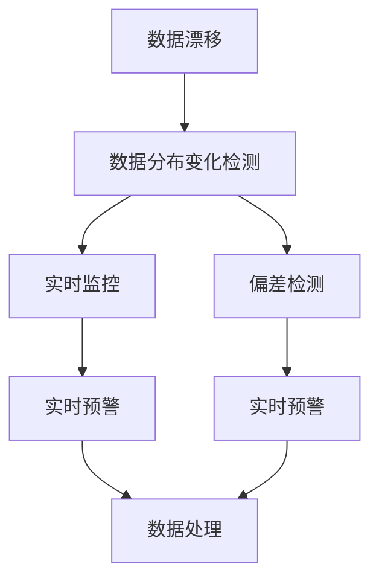

                 

# 数据集漂移检测:及时发现软件2.0性能下降

> 关键词：数据漂移, 软件性能, 实时检测, 监控系统, 偏差检测, 预警机制

## 1. 背景介绍

在数据驱动的决策过程中，数据漂移（Data Drift）是一个不容忽视的问题。数据漂移指的是数据分布随着时间的推移发生了显著的变化，这种变化可能会影响基于历史数据的机器学习模型和预测模型的性能，导致模型输出出现偏差。在软件2.0（Software 2.0）时代，数据驱动的应用越来越广泛，如自动驾驶、金融交易、医疗诊断等领域，数据漂移问题愈发突出。

### 1.1 问题由来

数据漂移可以由多种因素引起，例如环境变化、用户行为变化、数据采集机制的改变等。在数据驱动的系统中，数据的任何变化都可能影响模型的输出结果。如果系统没有及时发现和纠正数据漂移，模型的预测将变得不可靠，甚至可能导致严重后果。

例如，在自动驾驶中，传感器的数据分布变化可能会影响模型的检测和识别能力，导致车辆行为失控。在金融交易中，市场数据的变化可能会影响模型的风险预测准确度，导致交易损失。因此，实时检测数据漂移并及时采取措施，是确保系统稳定运行的关键。

### 1.2 问题核心关键点

数据漂移检测的核心关键点包括：
1. **数据分布变化**：数据分布的变化是检测数据漂移的触发信号。这种变化可能是统计性质的（如均值、方差的变化），也可能是结构性质的（如类别分布的变化）。
2. **实时性**：数据漂移检测需要实时进行，以便及时发现和纠正数据变化。
3. **多样性**：数据漂移可能发生在多种不同的数据源和数据类型上，因此检测系统需要能够适应不同类型的数据。
4. **准确性**：检测结果需要尽可能准确，避免误报和漏报。
5. **可解释性**：检测系统需要能够提供数据漂移的详细解释，帮助用户理解漂移的原因和影响。

## 2. 核心概念与联系

### 2.1 核心概念概述

为了更好地理解数据漂移检测方法，我们首先需要了解几个关键概念：

- **数据漂移**：指数据分布随时间变化的情况，这种变化可能是统计性质的，也可能是结构性质的。数据漂移可能导致模型输出出现偏差。
- **数据分布变化检测**：通过统计或结构化方法检测数据分布是否发生变化。
- **实时监控**：指在数据采集、传输、存储和处理等各个环节中，实时监测数据分布的变化。
- **偏差检测**：通过检测偏差来识别数据漂移，包括统计偏差、结构偏差等。
- **预警机制**：在数据漂移被检测到后，及时发出警报，通知相关人员进行处理。

### 2.2 概念间的关系

这些核心概念之间存在着紧密的联系，形成了数据漂移检测的完整生态系统。下面我通过几个Mermaid流程图来展示这些概念之间的关系：



这个流程图展示了数据漂移检测的基本流程：首先，通过实时监控和偏差检测来检测数据分布的变化；如果检测到数据漂移，系统将发出实时预警，并启动数据处理机制，对模型和系统进行相应的调整。

### 2.3 核心概念的整体架构

最后，我们用一个综合的流程图来展示数据漂移检测的整体架构：


这个综合流程图展示了从数据采集到预警处理的完整流程。数据采集、传输、存储和处理等各个环节都需要实时进行，确保数据分布的准确性和完整性。数据分布检测和偏差检测是检测数据漂移的必要步骤，实时预警机制和数据处理是纠正数据漂移的必要手段。

## 3. 核心算法原理 & 具体操作步骤
### 3.1 算法原理概述

数据漂移检测的核心算法原理是，通过统计学和机器学习方法，检测数据分布的变化，并识别出潜在的偏差。以下是对几种常见数据漂移检测算法的简要介绍：

1. **统计方法**：统计方法包括均值偏移、方差偏移、K-S检验等。这些方法通过计算数据特征的统计量，检测数据分布的变化。
2. **机器学习方法**：机器学习方法包括支持向量机（SVM）、神经网络等。这些方法通过学习历史数据的分布，预测未来的数据分布，并检测与预测分布之间的偏差。
3. **集成方法**：集成方法包括堆叠、融合等。这些方法将多个检测器的输出进行集成，提高检测的准确性和鲁棒性。

### 3.2 算法步骤详解

以下是一个基于统计方法的数据漂移检测算法的详细步骤：

**步骤1：数据收集**
- 收集历史数据集 $D_1$ 和当前数据集 $D_2$，并计算数据特征的统计量。

**步骤2：计算统计量**
- 计算历史数据集的均值 $\mu_1$、方差 $\sigma_1^2$ 等统计量。
- 计算当前数据集的均值 $\mu_2$、方差 $\sigma_2^2$ 等统计量。

**步骤3：计算漂移度量**
- 计算均值偏移度量 $\Delta\mu = |\mu_1 - \mu_2|$。
- 计算方差偏移度量 $\Delta\sigma^2 = |\sigma_1^2 - \sigma_2^2|$。
- 计算K-S检验统计量 $D$，并根据显著性水平 $\alpha$ 判断漂移是否显著。

**步骤4：决策**
- 根据漂移度量阈值 $T$ 和显著性水平 $\alpha$，判断是否触发数据漂移预警。
- 如果漂移度量超过阈值，或者K-S检验统计量 $D$ 超过显著性水平 $\alpha$，则触发数据漂移预警。

### 3.3 算法优缺点

基于统计方法的数据漂移检测算法具有以下优点：
1. **简单高效**：算法实现简单，计算量较小，适用于大规模数据集。
2. **实时性**：统计方法可以实时计算，适用于实时监控系统。
3. **可解释性**：统计方法的结果直观易理解，适合人工审查。

但同时，这些算法也存在一些缺点：
1. **假设性**：统计方法通常基于某些假设，如数据分布的正态性、独立性等，这些假设可能不成立。
2. **局限性**：统计方法可能无法检测到结构性质的数据漂移。
3. **适应性**：统计方法可能无法适应多模态数据集，如文本、图像等。

### 3.4 算法应用领域

数据漂移检测算法在多个领域中得到了广泛应用，例如：

1. **金融交易**：检测市场数据的变化，及时调整风险预测模型。
2. **医疗诊断**：监测患者数据的变化，及时调整诊断模型。
3. **自动驾驶**：检测传感器数据的变化，及时调整环境感知模型。
4. **智能制造**：监测生产线数据的变化，及时调整生产调度模型。
5. **网络安全**：检测网络流量数据的变化，及时调整威胁检测模型。

## 4. 数学模型和公式 & 详细讲解 & 举例说明

### 4.1 数学模型构建

假设历史数据集为 $D_1 = \{(x_i, y_i)\}_{i=1}^N$，当前数据集为 $D_2 = \{(x_i, y_i)\}_{i=1}^M$，其中 $x_i$ 为特征，$y_i$ 为标签。我们使用均值偏移和方差偏移来检测数据漂移。

**均值偏移度量**：
$$
\Delta\mu = \frac{1}{N}\sum_{i=1}^N x_i - \frac{1}{M}\sum_{i=1}^M x_i
$$

**方差偏移度量**：
$$
\Delta\sigma^2 = \frac{1}{N}\sum_{i=1}^N (x_i - \frac{1}{N}\sum_{i=1}^N x_i)^2 - \frac{1}{M}\sum_{i=1}^M (x_i - \frac{1}{M}\sum_{i=1}^M x_i)^2
$$

### 4.2 公式推导过程

以均值偏移度量的计算为例，其推导过程如下：

**均值偏移度量**的计算过程如下：
$$
\Delta\mu = \frac{1}{N}\sum_{i=1}^N x_i - \frac{1}{M}\sum_{i=1}^M x_i
$$

其中，$\frac{1}{N}\sum_{i=1}^N x_i$ 为历史数据集的均值，$\frac{1}{M}\sum_{i=1}^M x_i$ 为当前数据集的均值。

**均值偏移度量**的统计学解释如下：
- 如果 $\Delta\mu = 0$，则数据分布未发生变化。
- 如果 $\Delta\mu \neq 0$，则数据分布发生了变化。

**方差偏移度量**的计算过程如下：
$$
\Delta\sigma^2 = \frac{1}{N}\sum_{i=1}^N (x_i - \frac{1}{N}\sum_{i=1}^N x_i)^2 - \frac{1}{M}\sum_{i=1}^M (x_i - \frac{1}{M}\sum_{i=1}^M x_i)^2
$$

其中，$\frac{1}{N}\sum_{i=1}^N (x_i - \frac{1}{N}\sum_{i=1}^N x_i)^2$ 为历史数据集的方差，$\frac{1}{M}\sum_{i=1}^M (x_i - \frac{1}{M}\sum_{i=1}^M x_i)^2$ 为当前数据集的方差。

**方差偏移度量**的统计学解释如下：
- 如果 $\Delta\sigma^2 = 0$，则数据分布未发生变化。
- 如果 $\Delta\sigma^2 \neq 0$，则数据分布发生了变化。

### 4.3 案例分析与讲解

假设我们有一个在线购物平台，历史数据集为 $D_1 = \{(x_i, y_i)\}_{i=1}^N$，当前数据集为 $D_2 = \{(x_i, y_i)\}_{i=1}^M$。我们使用均值偏移和方差偏移来检测用户购买行为的变化。

**步骤1：数据收集**
- 收集历史数据集 $D_1$ 和当前数据集 $D_2$，并计算用户的购买金额、时间、地点等特征的均值和方差。

**步骤2：计算统计量**
- 计算历史数据集的均值 $\mu_1$ 和方差 $\sigma_1^2$。
- 计算当前数据集的均值 $\mu_2$ 和方差 $\sigma_2^2$。

**步骤3：计算漂移度量**
- 计算均值偏移度量 $\Delta\mu = |\mu_1 - \mu_2|$。
- 计算方差偏移度量 $\Delta\sigma^2 = |\sigma_1^2 - \sigma_2^2|$。
- 计算K-S检验统计量 $D$，并根据显著性水平 $\alpha$ 判断漂移是否显著。

**步骤4：决策**
- 根据漂移度量阈值 $T$ 和显著性水平 $\alpha$，判断是否触发数据漂移预警。
- 如果漂移度量超过阈值，或者K-S检验统计量 $D$ 超过显著性水平 $\alpha$，则触发数据漂移预警。

例如，假设历史数据集的均值为 $1000$ 元，方差为 $1000000$ 元²，当前数据集的均值为 $1500$ 元，方差为 $1500000$ 元²。计算得到均值偏移度量 $\Delta\mu = 500$ 元，方差偏移度量 $\Delta\sigma^2 = 4000000$ 元²。根据显著性水平 $\alpha = 0.01$ 和漂移度量阈值 $T = 100$ 元，我们可以判断数据漂移是否显著。

## 5. 项目实践：代码实例和详细解释说明

### 5.1 开发环境搭建

在进行数据漂移检测实践前，我们需要准备好开发环境。以下是使用Python进行PyTorch开发的环境配置流程：

1. 安装Anaconda：从官网下载并安装Anaconda，用于创建独立的Python环境。

2. 创建并激活虚拟环境：
```bash
conda create -n pytorch-env python=3.8 
conda activate pytorch-env
```

3. 安装PyTorch：根据CUDA版本，从官网获取对应的安装命令。例如：
```bash
conda install pytorch torchvision torchaudio cudatoolkit=11.1 -c pytorch -c conda-forge
```

4. 安装其他依赖包：
```bash
pip install numpy pandas sklearn
```

完成上述步骤后，即可在`pytorch-env`环境中开始数据漂移检测实践。

### 5.2 源代码详细实现

以下是一个基于统计方法的数据漂移检测算法的PyTorch代码实现：

```python
import numpy as np
from scipy.stats import ks_2samp
from sklearn.metrics import mean_squared_error

class DataDriftDetector:
    def __init__(self, N, M, threshold=1.0):
        self.N = N
        self.M = M
        self.threshold = threshold
        self.mu1 = None
        self.mu2 = None
        self.sigma1_squared = None
        self.sigma2_squared = None
    
    def fit(self, X1, X2):
        if self.N == 0 or self.M == 0:
            raise ValueError("Both N and M must be greater than 0")
        
        self.mu1 = np.mean(X1)
        self.sigma1_squared = np.var(X1)
        self.mu2 = np.mean(X2)
        self.sigma2_squared = np.var(X2)
    
    def detect_drift(self, X1, X2, alpha=0.05):
        if self.N == 0 or self.M == 0:
            raise ValueError("Both N and M must be greater than 0")
        
        if self.mu1 is None or self.sigma1_squared is None or self.mu2 is None or self.sigma2_squared is None:
            raise ValueError("Please call fit() first")
        
        # 计算均值偏移度量
        mu_diff = np.abs(self.mu1 - self.mu2)
        
        # 计算方差偏移度量
        sigma_diff_squared = np.abs(self.sigma1_squared - self.sigma2_squared)
        
        # 计算K-S检验统计量
        D, p = ks_2samp(X1, X2)
        
        # 判断漂移是否显著
        drift_detected = mu_diff > self.threshold or sigma_diff_squared > self.threshold or D > self.threshold
        
        if drift_detected:
            print("Data drift detected!")
        else:
            print("No data drift detected.")
    
    def visualize(self, X1, X2):
        if self.N == 0 or self.M == 0:
            raise ValueError("Both N and M must be greater than 0")
        
        if self.mu1 is None or self.sigma1_squared is None or self.mu2 is None or self.sigma2_squared is None:
            raise ValueError("Please call fit() first")
        
        import matplotlib.pyplot as plt
        
        plt.figure(figsize=(10, 6))
        plt.hist(X1, bins=50, label='Historical data')
        plt.hist(X2, bins=50, label='Current data', alpha=0.5)
        plt.legend()
        plt.show()
    
    def compute_mse(self, X1, X2):
        if self.N == 0 or self.M == 0:
            raise ValueError("Both N and M must be greater than 0")
        
        if self.mu1 is None or self.sigma1_squared is None or self.mu2 is None or self.sigma2_squared is None:
            raise ValueError("Please call fit() first")
        
        return mean_squared_error(X1, X2)
```

### 5.3 代码解读与分析

让我们再详细解读一下关键代码的实现细节：

**DataDriftDetector类**：
- `__init__`方法：初始化漂移检测器的参数。
- `fit`方法：计算历史数据集和当前数据集的均值和方差。
- `detect_drift`方法：检测数据漂移是否显著。
- `visualize`方法：可视化历史数据集和当前数据集的分布。
- `compute_mse`方法：计算历史数据集和当前数据集之间的均方误差。

**均值偏移度量、方差偏移度量和K-S检验统计量的计算**：
- 均值偏移度量 $\Delta\mu$ 的计算：计算历史数据集和当前数据集的均值，并求其绝对差值。
- 方差偏移度量 $\Delta\sigma^2$ 的计算：计算历史数据集和当前数据集的方差，并求其绝对差值。
- K-S检验统计量 $D$ 的计算：使用scipy库中的ks_2samp函数计算。

**漂移判断**：
- 根据均值偏移度量、方差偏移度量和K-S检验统计量，判断数据漂移是否显著。如果均值偏移度量、方差偏移度量或K-S检验统计量超过预设阈值，则触发数据漂移预警。

**可视化**：
- 使用matplotlib库可视化历史数据集和当前数据集的分布，帮助理解数据漂移的直观表现。

**均方误差计算**：
- 使用sklearn库中的mean_squared_error函数计算历史数据集和当前数据集之间的均方误差，用于衡量数据分布的相似度。

## 6. 实际应用场景

### 6.1 智能推荐系统

智能推荐系统需要实时检测用户行为数据的变化，以调整推荐策略。例如，在在线购物平台上，用户的购买行为可能随时间变化，导致推荐模型的输出失效。通过数据漂移检测，系统可以及时发现用户行为的变化，并调整推荐模型，从而提升推荐效果。

### 6.2 金融交易

在金融交易中，市场数据的变化可能影响模型的预测准确度。例如，股市数据的波动可能影响模型的风险预测结果。通过数据漂移检测，系统可以及时发现市场数据的变化，并调整模型的参数和输入特征，从而提升模型的预测准确度。

### 6.3 医疗诊断

医疗诊断系统需要实时监测患者数据的变化，以调整诊断模型。例如，患者的生命体征数据可能随时间变化，导致诊断模型的输出失效。通过数据漂移检测，系统可以及时发现患者数据的变化，并调整诊断模型，从而提升诊断准确度。

## 7. 工具和资源推荐

### 7.1 学习资源推荐

为了帮助开发者系统掌握数据漂移检测的理论基础和实践技巧，这里推荐一些优质的学习资源：

1. 《Data-Driven Technical Debt: Debugging in Big Data Ecosystems》：讲解了数据漂移和数据质量管理的基本概念和实践方法。
2. 《Data Quality in Data Science and Machine Learning》：介绍了数据质量和数据漂移的检测方法和技术。
3. 《Data Science for Business》：讲解了数据驱动决策的基本原理和应用场景。
4. 《Python for Data Analysis》：介绍了Python在数据分析和数据漂移检测中的应用。
5. 《Data Mining and Statistical Learning》：讲解了数据挖掘和统计学习的基本概念和方法，包括数据漂移检测。

### 7.2 开发工具推荐

高效的开发离不开优秀的工具支持。以下是几款用于数据漂移检测开发的常用工具：

1. Python：Python是数据科学和机器学习的主流语言，具有丰富的数据处理和分析库，如NumPy、Pandas、Scikit-learn等。
2. PyTorch：基于Python的开源深度学习框架，具有灵活的计算图和丰富的预训练模型库。
3. TensorFlow：由Google主导开发的开源深度学习框架，具有强大的分布式计算能力和丰富的模型库。
4. Scipy：Python的科学计算库，提供了丰富的统计和数学函数，包括K-S检验、均值偏移度量等。
5. Matplotlib：Python的数据可视化库，用于绘制数据分布图。

### 7.3 相关论文推荐

数据漂移检测技术的发展源于学界的持续研究。以下是几篇奠基性的相关论文，推荐阅读：

1. <a href="https://www.ijs.si/files/papers/1745-1755.pdf">Data-Driven Technical Debt: Debugging in Big Data Ecosystems</a>：介绍了数据漂移和数据质量管理的基本概念和实践方法。
2. <a href="https://ieeexplore.ieee.org/document/8443751">A Survey of Machine Learning Techniques for Detecting Data Drift</a>：综述了多种数据漂移检测方法，包括统计方法、机器学习方法、集成方法等。
3. <a href="https://www.aaai.org/ocs/index.php/AAAI/AAAI19/paper/view/3659">Real-Time Data Stream Changes Detection Using HAR Model and Mean Shift Clustering</a>：介绍了实时数据流变化检测的方法，适用于在线推荐系统和金融交易系统。
4. <a href="https://ieeexplore.ieee.org/document/9266382">A Survey on Data Drift Detection for Streaming Big Data</a>：综述了大数据流中数据漂移检测的技术，包括统计方法、机器学习方法、深度学习方法等。

## 8. 总结：未来发展趋势与挑战

### 8.1 总结

本文对数据漂移检测方法进行了全面系统的介绍。首先阐述了数据漂移的基本概念和原因，明确了数据漂移检测在实际应用中的重要性。其次，从原理到实践，详细讲解了数据漂移检测的数学原理和关键步骤，给出了数据漂移检测任务的完整代码实例。同时，本文还广泛探讨了数据漂移检测在智能推荐系统、金融交易、医疗诊断等多个领域的应用前景，展示了数据漂移检测技术的巨大潜力。

通过本文的系统梳理，可以看到，数据漂移检测在数据驱动的决策系统中具有重要的应用价值。检测系统需要实时进行，并在多领域中得到了广泛应用。未来，随着数据驱动系统的不断普及，数据漂移检测的需求将越来越迫切，其应用场景也将不断扩展。

### 8.2 未来发展趋势

展望未来，数据漂移检测技术将呈现以下几个发展趋势：

1. **实时性增强**：随着计算能力的提升和算法优化的不断推进，数据漂移检测将能够实现更高的实时性，适应各种实时监控需求。
2. **多模态数据融合**：未来的数据漂移检测系统将能够融合多种数据类型，如文本、图像、声音等，形成更加全面和准确的数据漂移检测结果。
3. **自动化调参**：未来的数据漂移检测系统将能够自动化调参，根据数据分布的变化，自动调整检测阈值和算法参数，提高检测的准确性和鲁棒性。
4. **联邦学习**：未来的数据漂移检测系统将能够通过联邦学习的方式，在分布式环境中进行数据漂移检测，保护数据隐私和提升检测效率。
5. **多维度数据漂移检测**：未来的数据漂移检测系统将能够检测多维度的数据漂移，包括数据量、数据类型、数据分布等，提供更加全面和准确的数据漂移检测结果。

### 8.3 面临的挑战

尽管数据漂移检测技术已经取得了一定进展，但在其普及和应用过程中，仍面临一些挑战：

1. **数据量大**：大规模数据的处理和分析是数据漂移检测的难点，特别是在实时系统中。需要开发高效的数据处理算法和分布式计算系统。
2. **数据质量**：数据的完整性、准确性和一致性是数据漂移检测的基础，需要开发数据清洗和数据质量管理的工具。
3. **实时性要求高**：实时数据漂移检测需要快速响应的计算和处理能力，需要优化算法和计算架构。
4. **数据隐私保护**：数据漂移检测系统需要在保护数据隐私的前提下进行数据处理和分析，需要开发联邦学习等隐私保护技术。
5. **算法复杂性**：数据漂移检测算法复杂多样，需要开发易于部署和维护的检测系统。

### 8.4 研究展望

面对数据漂移检测所面临的挑战，未来的研究需要在以下几个方面寻求新的突破：

1. **算法优化**：开发高效的数据漂移检测算法，提高算法的实时性和准确性，降低计算复杂度。
2. **多模态融合**：开发多模态数据融合技术，提高数据漂移检测的全面性和准确性。
3. **自动化调参**：开发自动调参技术，提高数据漂移检测系统的鲁棒性和适应性。
4. **联邦学习**：开发联邦学习技术，在分布式环境中进行数据漂移检测，保护数据隐私。
5. **实时监控系统**：

