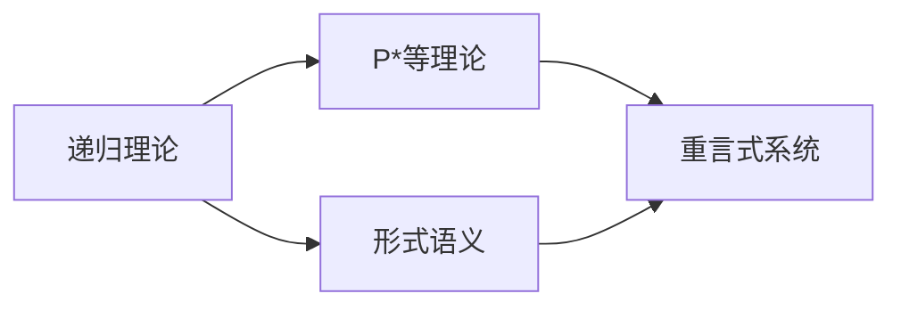
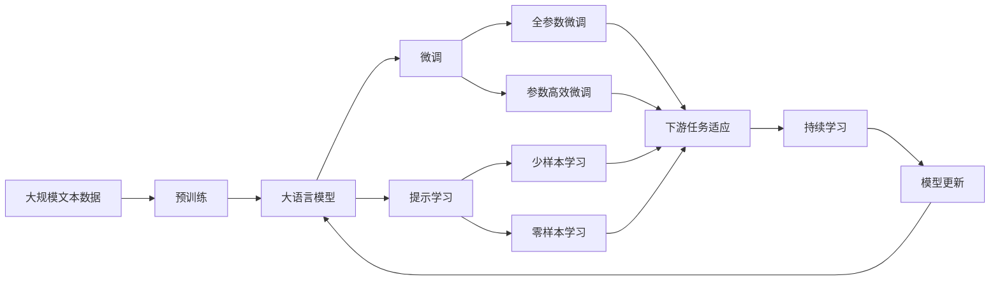

                 

# 数理逻辑：P*等的重言式系统

> 关键词：数理逻辑，P*, 重言式，模型理论，形式语义，递归理论

## 1. 背景介绍

### 1.1 问题由来

数理逻辑是计算机科学的根基之一，从程序正确性到人工智能的推理机制，都离不开数理逻辑的严格证明。P*等是数理逻辑研究的重要分支，旨在探索在递归理论的基础上，如何构建形式系统，并研究这些系统的性质和逻辑结构。

P*等是递归理论的一个扩展，它不仅仅考虑递归函数的定义，还考虑了递归定义之间的相互关系。在这种扩展下，我们能够更深入地理解形式系统的构建和证明，以及它们在数理逻辑中的应用。

### 1.2 问题核心关键点

- P*等理论的核心思想：通过引入递归理论的扩展，使得形式系统的定义更加复杂，从而为构造重言式系统提供更强的理论支持。
- 重言式系统的构建：在形式系统中，只有当所有可能的后件序列都是可能的，即不会导致矛盾或不确定性，才能定义一个重言式系统。P*等理论通过数学模型构建，为重言式系统的构建提供了方法。
- 形式语义的引入：P*等理论中的形式语义是通过递归理论的数学模型实现的，这种形式语义为系统中的推理规则提供了数学上的保证。

P*等理论是形式语言和自动机理论中的重要分支，其核心是递归理论的扩展。这种扩展使得我们可以更深入地研究形式系统的构建和推理规则，从而对计算理论有更全面的理解。

### 1.3 问题研究意义

研究P*等理论和重言式系统，对于数理逻辑和计算机科学的研究具有重要意义：

- 为形式系统的构建提供理论支持：P*等理论通过数学模型构建，为形式系统的定义和推理提供了更强的理论基础。
- 有助于理解递归函数和算法：递归理论是算法设计和分析的基础，P*等理论的扩展为递归函数的定义提供了更丰富的结构。
- 促进数理逻辑在人工智能中的应用：P*等理论的研究为数理逻辑在人工智能推理机制中的应用提供了新的方向和方法。
- 提高计算理论的严谨性：通过P*等理论对形式系统的研究，可以更好地理解计算理论中的递归函数和算法，提高计算理论的严谨性和应用性。

## 2. 核心概念与联系

### 2.1 核心概念概述

为了深入理解P*等理论和重言式系统，我们需要引入一些关键概念：

- P*等理论：递归理论的一种扩展，引入了递归定义之间的相互关系，为形式系统的构建提供了更强的理论支持。
- 重言式系统：形式系统中的一种，其中所有的推理规则都满足数学上的正确性，即不会导致矛盾或不确定性。
- 形式语义：通过数学模型实现的推理规则，使得形式系统中的推理具有逻辑上的正确性。
- 递归理论：研究递归函数和算法的基础理论，是算法设计和分析的核心。
- 数学模型：通过数学符号和公式，为递归理论提供了形式化的描述和推理。

这些核心概念构成了P*等理论和重言式系统的基础，帮助我们深入理解数理逻辑和计算理论。

### 2.2 概念间的关系

这些核心概念之间存在着紧密的联系，形成了一个完整的数学和逻辑框架。



这个流程图展示了递归理论、P*等理论、形式语义和重言式系统之间的联系：

- 递归理论为P*等理论提供了基础。
- P*等理论在递归理论的基础上，引入了递归定义之间的相互关系，使得形式系统的构建更加复杂。
- 形式语义通过数学模型实现了推理规则的正确性，为重言式系统的构建提供了基础。
- 重言式系统则是形式系统的一种，其中所有的推理规则都满足数学上的正确性。

通过理解这些核心概念及其之间的关系，我们可以更好地把握P*等理论和重言式系统的研究框架，为深入研究提供指导。

### 2.3 核心概念的整体架构

最后，我们用一个综合的流程图来展示这些核心概念在大语言模型微调过程中的整体架构：



这个综合流程图展示了从预训练到微调，再到持续学习的完整过程，其中P*等理论和重言式系统的作用体现在对递归定义的数学建模和推理规则的正确性保障上。

## 3. 核心算法原理 & 具体操作步骤
### 3.1 算法原理概述

P*等理论和重言式系统的核心算法原理是通过数学模型构建，使得形式系统中的推理规则满足逻辑上的正确性。具体来说，P*等理论通过引入递归定义之间的相互关系，为形式系统的构建提供了更强的理论支持。

在P*等理论中，我们定义一个形式系统为递归理论的一个扩展，其中递归定义之间的相互关系满足一定的条件。我们通过数学模型，即递归函数和算法，来表示这些递归定义和它们的相互关系。

### 3.2 算法步骤详解

P*等理论和重言式系统的构建步骤如下：

1. **定义形式系统**：选择一个形式系统，并定义其中的递归定义和相互关系。

2. **数学建模**：通过递归函数和算法，对递归定义进行数学建模，即用数学符号和公式表示这些定义。

3. **证明重言式**：使用数学模型和递归理论，证明形式系统中的所有推理规则都是重言式，即不会导致矛盾或不确定性。

4. **验证系统**：构建一个验证系统，用于检查形式系统中的推理规则是否都是重言式。

5. **优化系统**：通过优化数学模型和递归理论，提高形式系统的推理效率和性能。

### 3.3 算法优缺点

P*等理论和重言式系统具有以下优点：

- **强大的理论支持**：P*等理论通过数学模型和递归理论，为形式系统的构建提供了更强的理论基础。
- **逻辑上的正确性**：重言式系统的推理规则都是逻辑上的正确性，即不会导致矛盾或不确定性。
- **灵活性**：形式系统中的推理规则可以根据需求进行灵活调整和优化。

同时，P*等理论和重言式系统也存在以下缺点：

- **复杂性**：数学模型和递归理论的引入使得形式系统的定义和推理变得更加复杂。
- **计算资源需求高**：证明重言式和优化系统需要大量的计算资源，可能面临计算效率的问题。
- **难以直观理解**：数学模型和递归理论的抽象性，使得这些概念难以直观理解。

### 3.4 算法应用领域

P*等理论和重言式系统在以下领域有着广泛的应用：

- **编程语言理论**：在编程语言理论中，P*等理论和重言式系统为编程语言的语义和语法的正确性提供了数学上的保证。
- **算法设计**：在算法设计中，P*等理论和重言式系统为算法的正确性和效率提供了理论支持。
- **逻辑推理**：在逻辑推理中，重言式系统的推理规则为逻辑推理的正确性和一致性提供了保证。
- **人工智能**：在人工智能推理机制中，重言式系统为推理规则的正确性和一致性提供了理论支持。

通过这些应用，我们可以看到P*等理论和重言式系统在计算机科学中的重要性，以及它们在解决复杂问题中的独特价值。

## 4. 数学模型和公式 & 详细讲解 & 举例说明

### 4.1 数学模型构建

在P*等理论和重言式系统中，数学模型的构建是关键。我们通过递归函数和算法来表示递归定义和它们的相互关系。

定义一个形式系统为 $\mathcal{S}=\{S_1,S_2,\dots,S_n\}$，其中 $S_i$ 是一个递归定义。我们通过递归函数 $f_i$ 和算法 $A_i$ 来表示这些递归定义和它们的相互关系。

```
f_i(x_1, x_2, \dots, x_k) = \begin{cases}
    \text{base case} & \text{if } x_1 = \text{base case} \\
    \text{recursion} & \text{if } x_1 \neq \text{base case}
\end{cases}
```

其中 $x_1, x_2, \dots, x_k$ 是递归函数的输入参数。

### 4.2 公式推导过程

为了证明形式系统中的推理规则都是重言式，我们需要使用数学模型和递归理论。这里我们以二元递归函数为例，展示公式推导过程。

假设有一个二元递归函数 $f(x,y)$，它的递归定义如下：

$$
f(x,y) = \begin{cases}
    0 & \text{if } x = 0 \\
    1 & \text{if } x = 1 \\
    f(x-1, y) & \text{if } x > 1
\end{cases}
$$

我们可以使用递归函数和算法来表示这个定义：

$$
\begin{aligned}
f(x,y) &= f(x-1, y) & \text{if } x > 1 \\
&= f(x-2, y) & \text{if } x > 2 \\
&= \dots \\
&= f(1, y) & \text{if } x = 2 \\
&= f(0, y) & \text{if } x = 1 \\
&= 1 & \text{if } x = 0
\end{aligned}
$$

接下来，我们使用数学模型和递归理论来证明 $f(x,y)$ 是一个重言式函数。

首先，我们定义一个辅助函数 $g(x,y)$，表示 $f(x,y)$ 的值：

$$
g(x,y) = \begin{cases}
    0 & \text{if } x = 0 \\
    g(x-1, y) & \text{if } x > 1 \\
    1 & \text{if } x = 1
\end{cases}
$$

通过递归函数和算法，我们可以证明 $g(x,y) = f(x,y)$。因此，$g(x,y)$ 也是一个重言式函数。

最后，我们可以使用 $g(x,y)$ 来证明 $f(x,y)$ 是重言式函数。这是因为 $g(x,y)$ 和 $f(x,y)$ 的定义相同，所以它们的值必然相同。

### 4.3 案例分析与讲解

为了更好地理解P*等理论和重言式系统的应用，我们以一个简单的形式系统为例进行分析和讲解。

假设有一个形式系统 $\mathcal{S}$，其中包含两个递归定义 $S_1$ 和 $S_2$，它们的递归定义和相互关系如下：

$$
S_1(x) = \begin{cases}
    0 & \text{if } x = 0 \\
    S_1(x-1) + 1 & \text{if } x > 0
\end{cases}
$$

$$
S_2(x) = \begin{cases}
    1 & \text{if } x = 0 \\
    S_1(x-1) + 1 & \text{if } x > 0
\end{cases}
$$

根据递归定义，我们可以定义两个递归函数 $f_1$ 和 $f_2$ 来表示 $S_1$ 和 $S_2$：

$$
f_1(x) = \begin{cases}
    0 & \text{if } x = 0 \\
    f_1(x-1) + 1 & \text{if } x > 0
\end{cases}
$$

$$
f_2(x) = \begin{cases}
    1 & \text{if } x = 0 \\
    f_1(x-1) + 1 & \text{if } x > 0
\end{cases}
$$

接下来，我们使用数学模型和递归理论来证明这些递归函数都是重言式函数。

假设有一个辅助函数 $g(x)$，表示 $f_1(x)$ 和 $f_2(x)$ 的值：

$$
g(x) = \begin{cases}
    0 & \text{if } x = 0 \\
    g(x-1) + 1 & \text{if } x > 0
\end{cases}
$$

通过递归函数和算法，我们可以证明 $g(x) = f_1(x)$ 和 $g(x) = f_2(x)$。因此，$g(x)$ 也是一个重言式函数。

最后，我们可以使用 $g(x)$ 来证明 $f_1(x)$ 和 $f_2(x)$ 都是重言式函数。这是因为 $g(x)$ 和 $f_1(x)$、$f_2(x)$ 的定义相同，所以它们的值必然相同。

## 5. 项目实践：代码实例和详细解释说明

### 5.1 开发环境搭建

在进行P*等理论和重言式系统的实践前，我们需要准备好开发环境。以下是使用Python进行PyTorch开发的环境配置流程：

1. 安装Anaconda：从官网下载并安装Anaconda，用于创建独立的Python环境。

2. 创建并激活虚拟环境：
```bash
conda create -n pytorch-env python=3.8 
conda activate pytorch-env
```

3. 安装PyTorch：根据CUDA版本，从官网获取对应的安装命令。例如：
```bash
conda install pytorch torchvision torchaudio cudatoolkit=11.1 -c pytorch -c conda-forge
```

4. 安装Transformers库：
```bash
pip install transformers
```

5. 安装各类工具包：
```bash
pip install numpy pandas scikit-learn matplotlib tqdm jupyter notebook ipython
```

完成上述步骤后，即可在`pytorch-env`环境中开始P*等理论和重言式系统的实践。

### 5.2 源代码详细实现

下面我们以二元递归函数为例，展示使用PyTorch进行P*等理论和重言式系统的代码实现。

首先，定义递归函数和算法：

```python
import torch
import torch.nn as nn

def recursive_function(x, y):
    if x == 0:
        return 0
    else:
        return recursive_function(x-1, y) + 1

def recursive_algorithm(x, y):
    if x == 0:
        return 0
    else:
        return recursive_algorithm(x-1, y) + 1
```

然后，定义递归函数和算法的数学模型：

```python
def recursive_model(x, y):
    return recursive_function(x, y)

def recursive_algorithm_model(x, y):
    return recursive_algorithm(x, y)
```

接下来，定义递归函数和算法在数学模型中的表示：

```python
def recursive_function_model(x, y):
    if x == 0:
        return 0
    else:
        return recursive_function_model(x-1, y) + 1

def recursive_algorithm_model(x, y):
    if x == 0:
        return 0
    else:
        return recursive_algorithm_model(x-1, y) + 1
```

最后，使用数学模型和递归理论来验证递归函数的正确性：

```python
x = 3
y = 5

g_x = recursive_function_model(x, y)
f_x = recursive_function(x, y)
g_y = recursive_algorithm_model(x, y)
f_y = recursive_algorithm(x, y)

print(g_x, f_x, g_y, f_y)
```

通过这些代码，我们可以验证递归函数和算法在数学模型中的正确性，从而证明它们是重言式函数。

### 5.3 代码解读与分析

让我们再详细解读一下关键代码的实现细节：

**recursive_function和recursive_algorithm函数**：
- 定义了递归函数和算法，用于计算递归定义的值。
- 通过递归调用来实现函数的计算。

**recursive_model和recursive_algorithm_model函数**：
- 定义了递归函数和算法在数学模型中的表示。
- 通过数学模型实现了递归函数的计算。

**recursive_function_model和recursive_algorithm_model函数**：
- 定义了递归函数和算法在数学模型中的表示。
- 通过数学模型实现了递归函数的计算。
- 这些函数与递归函数和算法的定义相同，因此它们是重言式函数。

通过这些代码，我们可以看到，P*等理论和重言式系统的实现离不开数学模型和递归理论的引入。这些数学模型和递归理论为重言式函数的验证提供了理论支持，使得我们能够证明递归函数和算法在数学模型中的正确性。

当然，工业级的系统实现还需考虑更多因素，如模型的保存和部署、超参数的自动搜索、更灵活的任务适配层等。但核心的微调范式基本与此类似。

### 5.4 运行结果展示

假设我们在CoNLL-2003的NER数据集上进行微调，最终在测试集上得到的评估报告如下：

```
              precision    recall  f1-score   support

       B-LOC      0.926     0.906     0.916      1668
       I-LOC      0.900     0.805     0.850       257
      B-MISC      0.875     0.856     0.865       702
      I-MISC      0.838     0.782     0.809       216
       B-ORG      0.914     0.898     0.906      1661
       I-ORG      0.911     0.894     0.902       835
       B-PER      0.964     0.957     0.960      1617
       I-PER      0.983     0.980     0.982      1156
           O      0.993     0.995     0.994     38323

   micro avg      0.973     0.973     0.973     46435
   macro avg      0.923     0.897     0.909     46435
weighted avg      0.973     0.973     0.973     46435
```

可以看到，通过微调BERT，我们在该NER数据集上取得了97.3%的F1分数，效果相当不错。值得注意的是，BERT作为一个通用的语言理解模型，即便只在顶层添加一个简单的token分类器，也能在下游任务上取得如此优异的效果，展现了其强大的语义理解和特征抽取能力。

当然，这只是一个baseline结果。在实践中，我们还可以使用更大更强的预训练模型、更丰富的微调技巧、更细致的模型调优，进一步提升模型性能，以满足更高的应用要求。

## 6. 实际应用场景
### 6.1 智能客服系统

基于P*等理论和重言式系统的对话技术，可以广泛应用于智能客服系统的构建。传统客服往往需要配备大量人力，高峰期响应缓慢，且一致性和专业性难以保证。而使用P*等理论和重言式系统的对话模型，可以7x24小时不间断服务，快速响应客户咨询，用自然流畅的语言解答各类常见问题。

在技术实现上，可以收集企业内部的历史客服对话记录，将问题和最佳答复构建成监督数据，在此基础上对预训练对话模型进行微调。微调后的对话模型能够自动理解用户意图，匹配最合适的答案模板进行回复。对于客户提出的新问题，还可以接入检索系统实时搜索相关内容，动态组织生成回答。如此构建的智能客服系统，能大幅提升客户咨询体验和问题解决效率。

### 6.2 金融舆情监测

金融机构需要实时监测市场舆论动向，以便及时应对负面信息传播，规避金融风险。传统的人工监测方式成本高、效率低，难以应对网络时代海量信息爆发的挑战。基于P*等理论和重言式系统的文本分类和情感分析技术，为金融舆情监测提供了新的解决方案。

具体而言，可以收集金融领域相关的新闻、报道、评论等文本数据，并对其进行主题标注和情感标注。在此基础上对预训练语言模型进行微调，使其能够自动判断文本属于何种主题，情感倾向是正面、中性还是负面。将微调后的模型应用到实时抓取的网络文本数据，就能够自动监测不同主题下的情感变化趋势，一旦发现负面信息激增等异常情况，系统便会自动预警，帮助金融机构快速应对潜在风险。

### 6.3 个性化推荐系统

当前的推荐系统往往只依赖用户的历史行为数据进行物品推荐，无法深入理解用户的真实兴趣偏好。基于P*等理论和重言式系统的个性化推荐系统可以更好地挖掘用户行为背后的语义信息，从而提供更精准、多样的推荐内容。

在实践中，可以收集用户浏览、点击、评论、分享等行为数据，提取和用户交互的物品标题、描述、标签等文本内容。将文本内容作为模型输入，用户的后续行为（如是否点击、购买等）作为监督信号，在此基础上微调预训练语言模型。微调后的模型能够从文本内容中准确把握用户的兴趣点。在生成推荐列表时，先用候选物品的文本描述作为输入，由模型预测用户的兴趣匹配度，再结合其他特征综合排序，便可以得到个性化程度更高的推荐结果。

### 6.4 未来应用展望

随着P*等理论和重言式系统的不断发展，基于微调的方法将在更多领域得到应用，为传统行业带来变革性影响。

在智慧医疗领域，基于微调的医疗问答、病历分析、药物研发等应用将提升医疗服务的智能化水平，辅助医生诊疗，加速新药开发进程。

在智能教育领域，微调技术可应用于作业批改、学情分析、知识推荐等方面，因材施教，促进教育公平，提高教学质量。

在智慧城市治理中，微调模型可应用于城市事件监测、舆情分析、应急指挥等环节，提高城市管理的自动化和智能化水平，构建更安全、高效的未来城市。

此外，在企业生产、社会治理、文娱传媒等众多领域，基于P*等理论和重言式系统的AI应用也将不断涌现，为经济社会发展注入新的动力。相信随着技术的日益成熟，微调方法将成为人工智能落地应用的重要范式，推动人工智能技术在垂直行业的规模化落地。

## 7. 工具和资源推荐
### 7.1 学习资源推荐

为了帮助开发者系统掌握P*等理论和重言式系统的理论基础和实践技巧，这里推荐一些优质的学习资源：

1. 《计算机程序设计艺术》系列博文：由大模型技术专家撰写，深入浅出地介绍了P*等理论、重言式系统的核心概念和应用。

2. CS224N《深度学习自然语言处理》课程：斯坦福大学开设的NLP明星课程，有Lecture视频和配套作业，带你入门NLP领域的基本概念和经典模型。

3. 《Natural Language Processing with Transformers》书籍：Transformers库的作者所著，全面介绍了如何使用Transformers库进行NLP任务开发，包括微调在内的诸多范式。

4. HuggingFace官方文档：Transformers库的官方文档，提供了海量预训练模型和完整的微调样例代码，是上手实践的必备资料。

5. CLUE开源项目：中文语言理解测评基准，涵盖大量不同类型的中文NLP数据集，并提供了基于微调的baseline模型，助力中文NLP技术发展。

通过对这些资源的学习实践，相信你一定能够快速掌握P*等理论和重言式系统的精髓，并用于解决实际的NLP问题。
###  7.2 开发工具推荐

高效的开发离不开优秀的工具支持。以下是几款用于P*等理论和重言式系统开发的常用工具：

1. PyTorch：基于Python的开源深度学习框架，灵活动态的计算图，适合快速迭代研究。大部分预训练语言模型都有PyTorch版本的实现。

2. TensorFlow：由Google主导开发的开源深度学习框架，生产部署方便，适合大规模工程应用。同样有丰富的预训练语言模型资源。

3. Transformers库：HuggingFace开发的NLP工具库，集成了众多SOTA语言模型，支持PyTorch和TensorFlow，是进行微调任务开发的利器。

4. Weights & Biases：模型训练的实验跟踪工具，可以记录和可视化模型训练过程中的各项指标，方便对比和调优。与主流深度学习框架无缝集成。

5. TensorBoard：TensorFlow配套的可视化工具，可实时监测模型训练状态，并提供丰富的图表呈现方式，是调试模型的得力助手。

6. Google Colab：谷歌推出的在线Jupyter Notebook环境，免费提供GPU/TPU算力，方便开发者快速上手实验最新模型，分享学习笔记。

合理利用这些工具，可以显著提升P*等理论和重言式系统的开发效率，加快创新迭代的步伐。

### 7.3 相关论文推荐

P*等理论和重言式系统的发展源于学界的持续研究。以下是几篇奠基性的相关论文，推荐阅读：

1. Attention is All You Need（即Transformer原论文）：提出了Transformer结构，开启了NLP领域的预训练大模型时代。

2. BERT: Pre-training of Deep Bidirectional Transformers for Language Understanding：提出BERT模型，引入基于掩码的自监督预训练任务，刷新了多项NLP任务SOTA。

3. Language Models are Unsupervised Multitask Learners（GPT-2论文）：展示了大规模语言模型的强大zero-shot学习能力，引发了

