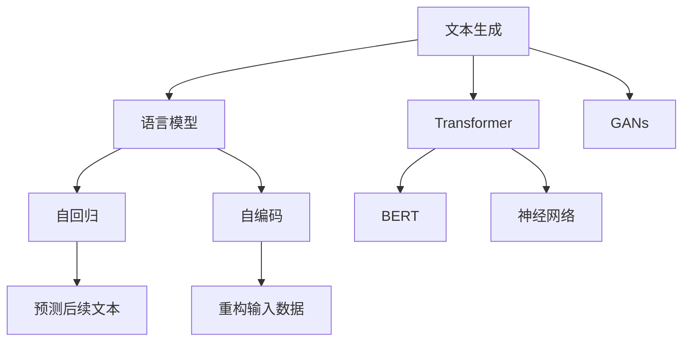
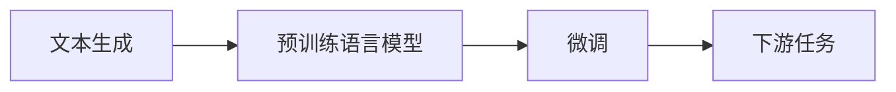
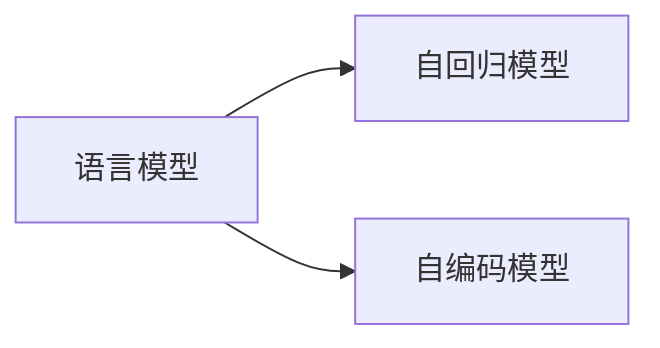
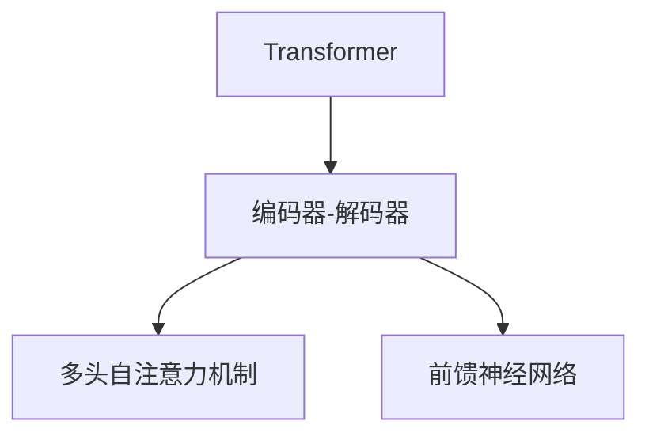
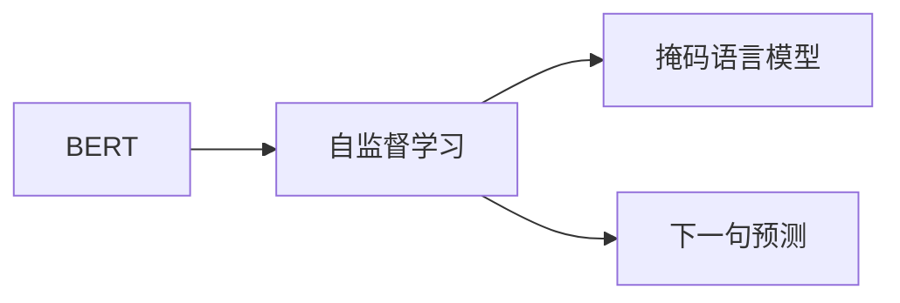
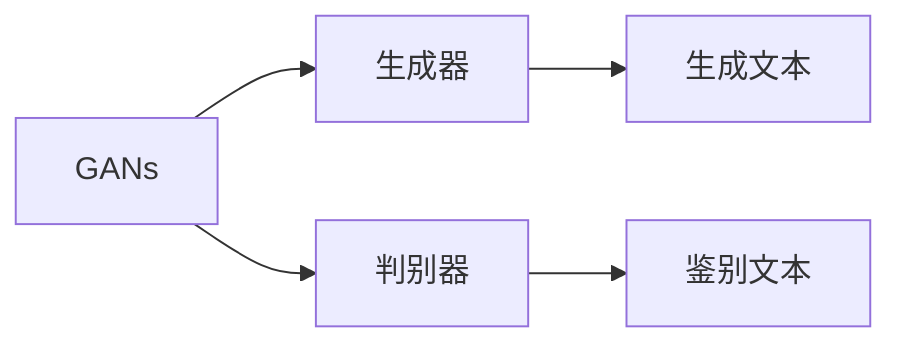
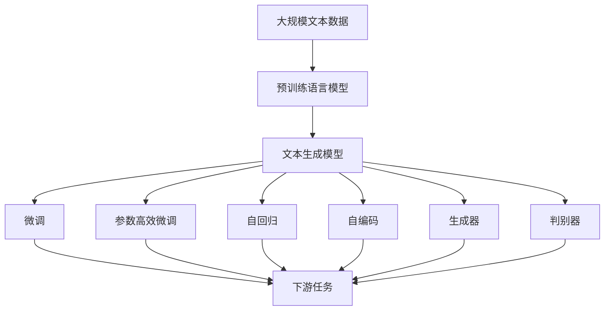

                 

# 文本生成(Text Generation) - 原理与代码实例讲解

> 关键词：文本生成,语言模型,Transformer,BERT,GANs,神经网络,自回归,自编码

## 1. 背景介绍

文本生成，即在计算机程序控制下自动生成具有自然语言风格的文本，是自然语言处理(NLP)中的重要研究方向。传统的文本生成方法包括基于规则的生成和基于统计的生成，但随着深度学习技术的发展，基于神经网络的文本生成方法逐渐成为主流。

深度学习模型通过大量的文本数据进行训练，学习到复杂的语言结构和表达能力，从而可以生成高质量的文本内容。例如，基于Transformer的模型，如GPT、BERT等，通过自回归或自编码方法进行预训练，然后对特定任务进行微调，可以生成具有极高自然语言质量的文章、对话、摘要等文本。

近年来，基于生成对抗网络（GANs）的方法，如DALL·E、Stable Diffusion等，也在游戏、娱乐、设计等领域展现了强大的文本生成能力。这些模型通过联合训练生成器和判别器，学习生成符合特定风格或内容的文本。

## 2. 核心概念与联系

### 2.1 核心概念概述

为了更好地理解文本生成技术，本节将介绍几个密切相关的核心概念：

- **文本生成**：指通过计算机程序自动生成具有自然语言风格的文本内容，如文章、对话、摘要等。
- **语言模型**：指用于预测文本序列概率的模型，能够评估文本序列的概率分布，从而生成具有语言合理性的文本。
- **Transformer**：一种用于处理序列数据的深度学习模型，能够高效地并行化计算，在文本生成任务中取得了显著的成效。
- **BERT**：一种基于Transformer的预训练语言模型，通过双向编码机制，学习了丰富的语言知识，能够在各种NLP任务上取得优异表现。
- **GANs**：一种生成模型，通过联合训练生成器和判别器，学习生成符合特定风格或内容的文本。
- **神经网络**：一种通过学习大量数据，自动提取特征和规律的算法，广泛应用于文本生成、图像处理、语音识别等领域。
- **自回归模型**：指使用先前的文本预测后续文本的模型，如GPT系列模型。
- **自编码模型**：指通过重构输入数据进行训练的模型，如BERT。

这些核心概念之间的逻辑关系可以通过以下Mermaid流程图来展示：



这个流程图展示了大语言模型文本生成过程涉及的核心概念和它们之间的关系：

1. 文本生成通过语言模型和Transformer进行建模。
2. Transformer模型中，BERT和GPT是两种主要的预训练方式。
3. 语言模型可以通过自回归和自编码两种方式进行训练。
4. GANs模型通过生成器和判别器的联合训练生成文本。

### 2.2 概念间的关系

这些核心概念之间存在着紧密的联系，形成了文本生成技术的基础框架。下面我们通过几个Mermaid流程图来展示这些概念之间的关系。

#### 2.2.1 文本生成的学习范式



这个流程图展示了文本生成技术的基本原理：

1. 通过预训练语言模型学习语言知识。
2. 对预训练模型进行微调，适应特定任务。
3. 通过微调后的模型进行文本生成，完成下游任务。

#### 2.2.2 语言模型的训练方式



这个流程图展示了语言模型的两种主要训练方式：

1. 自回归模型通过预测文本的下一个单词，学习文本序列的概率分布。
2. 自编码模型通过重构输入的文本数据，学习文本的分布特征。

#### 2.2.3 Transformer的结构



这个流程图展示了Transformer的基本结构：

1. 编码器和解码器是Transformer模型的核心组件。
2. 多头自注意力机制用于计算输入序列中的依赖关系。
3. 前馈神经网络用于非线性变换。

#### 2.2.4 BERT的预训练任务



这个流程图展示了BERT的两种主要预训练任务：

1. 掩码语言模型通过随机掩码文本，预测被掩码的单词，学习单词之间的依赖关系。
2. 下一句预测通过判断句子对是否为连续，学习句子之间的关系。

#### 2.2.5 GANs的训练过程



这个流程图展示了GANs模型的训练过程：

1. 生成器和判别器是GANs模型的两个关键组件。
2. 生成器通过学习如何生成真实的文本，以欺骗判别器。
3. 判别器通过学习如何区分真实和生成的文本，以识别生成器的输出。

### 2.3 核心概念的整体架构

最后，我们用一个综合的流程图来展示这些核心概念在文本生成技术中的整体架构：



这个综合流程图展示了从预训练到文本生成的完整过程。预训练语言模型通过自监督任务学习语言知识，然后通过微调或自回归、自编码、GANs等方法进行文本生成。微调可以通过全参数微调和参数高效微调（PEFT）两种方式进行，以优化特定任务上的性能。自回归和自编码是语言模型的两种主要训练方式，分别适用于预测和重构文本。GANs通过生成器和判别器的联合训练生成文本，可以学习复杂的文本生成任务。

## 3. 核心算法原理 & 具体操作步骤
### 3.1 算法原理概述

文本生成通常使用神经网络模型，通过训练学习到文本序列的概率分布，然后根据给定的输入序列生成新的文本。常用的文本生成模型包括自回归模型和自编码模型。

自回归模型通过预测下一个单词来生成文本，如GPT系列模型。这类模型首先根据前面的单词预测下一个单词的概率分布，然后根据预测结果生成下一个单词，重复这个过程直到生成完整的文本序列。

自编码模型通过重构输入的文本数据来生成文本，如BERT。这类模型首先对输入的文本数据进行编码，然后通过解码器生成与输入文本相同的文本数据，从而学习到文本的分布特征。

### 3.2 算法步骤详解

文本生成算法通常包括以下几个关键步骤：

**Step 1: 准备数据集**
- 收集和预处理训练数据集。文本生成任务的数据集通常是原始文本的序列，需要对其进行分词、去除噪声、标注等预处理。

**Step 2: 设计模型架构**
- 选择合适的神经网络模型，如Transformer或GANs，并设计其架构。自回归模型通常使用自注意力机制和前馈神经网络，自编码模型则通过编码器-解码器架构。

**Step 3: 进行预训练**
- 使用大规模无标签文本数据对模型进行预训练。自回归模型通过预测下一个单词的概率分布，自编码模型通过重构输入的文本数据，学习文本的分布特征。

**Step 4: 微调模型**
- 对预训练模型进行微调，适应特定的文本生成任务。微调通常使用监督学习的方式，通过给定的文本序列和对应的生成文本进行训练，优化模型的生成性能。

**Step 5: 生成文本**
- 使用微调后的模型生成新的文本序列。根据给定的输入文本或生成提示，模型输出对应的文本序列。

### 3.3 算法优缺点

自回归模型的优点在于可以直接使用训练数据中的文本序列进行生成，不需要额外的重构任务。其缺点在于需要较大的内存和计算资源，因为每次生成一个单词都需要计算前面的文本信息。

自编码模型的优点在于可以通过重构输入的文本数据来学习文本的分布特征，不需要额外的文本序列。其缺点在于需要使用训练数据进行重构任务，需要较大的计算资源。

GANs模型的优点在于可以通过联合训练生成器和判别器，生成符合特定风格或内容的文本。其缺点在于训练过程复杂，需要较多的数据和计算资源。

### 3.4 算法应用领域

文本生成技术已经在多种领域得到了广泛应用，例如：

- **自然语言处理(NLP)**：生成文本摘要、机器翻译、对话系统、文本生成等。
- **游戏设计**：自动生成游戏角色对话、故事剧情、任务描述等。
- **娱乐媒体**：自动生成新闻、文章、剧本、歌词等。
- **广告创意**：自动生成广告文案、营销文案等。
- **设计领域**：自动生成设计草图、产品描述、设计方案等。

这些领域的应用展示了文本生成技术的强大潜力和广泛应用前景。

## 4. 数学模型和公式 & 详细讲解
### 4.1 数学模型构建

文本生成模型的数学模型可以形式化为序列的概率分布模型。假设文本序列为 $X=(x_1, x_2, ..., x_T)$，其中 $x_i$ 表示第 $i$ 个单词，其概率分布为 $P(x_i|x_{<i})$，表示在前面的文本序列 $x_{<i}$ 条件下，第 $i$ 个单词 $x_i$ 出现的概率。

在自回归模型中，每个单词 $x_i$ 的条件概率 $P(x_i|x_{<i})$ 可以通过前面的单词 $x_{<i}$ 计算得出。在自编码模型中，每个单词 $x_i$ 的条件概率 $P(x_i|x_{<i})$ 可以通过重构损失函数计算得出。

### 4.2 公式推导过程

以自回归模型为例，假设模型使用自注意力机制 $h_t = \text{Softmax}(AH_{<t}Q_t)$，其中 $H_{<t}$ 为前面的文本序列编码向量，$A$ 为注意力矩阵，$Q_t$ 为当前位置的查询向量，$h_t$ 为当前位置的注意力输出向量。

每个单词 $x_i$ 的条件概率 $P(x_i|x_{<i})$ 可以表示为：

$$
P(x_i|x_{<i}) = \text{softmax}(Ah_{i-1}h_{i-2}^T) \cdot \sigma(W_h h_{i-1})
$$

其中 $W_h$ 为线性变换矩阵，$\sigma$ 为激活函数。

在自编码模型中，假设模型使用编码器 $h_t = G(x_t)$ 和解码器 $x_{\hat{t}} = H(h_t)$，其中 $G$ 和 $H$ 分别为编码器和解码器。

每个单词 $x_i$ 的条件概率 $P(x_i|x_{<i})$ 可以表示为：

$$
P(x_i|x_{<i}) = \text{softmax}(Ah_{i-1}h_{i-2}^T) \cdot \sigma(W_h h_{i-1})
$$

其中 $A$ 为注意力矩阵，$h_{i-1}$ 为前面的文本序列编码向量，$W_h$ 为线性变换矩阵，$\sigma$ 为激活函数。

### 4.3 案例分析与讲解

以GPT模型为例，其自回归模型的条件概率计算公式如下：

$$
P(x_t|x_{<t}) = \frac{\exp(\text{softmax}(Qh_{t-1}W))}{\sum_{i=1}^V \exp(\text{softmax}(Qh_{t-1}W_i)}
$$

其中 $Q$ 为线性变换矩阵，$h_{t-1}$ 为前面的文本序列编码向量，$W$ 为线性变换矩阵，$V$ 为词汇表大小。

假设我们希望生成一个长度为 $T$ 的文本序列 $X$，其生成过程如下：

1. 初始化输入 $x_1$ 为生成提示。
2. 对于每个位置 $t$，根据前面的文本序列 $x_{<t}$ 计算当前位置的条件概率 $P(x_t|x_{<t})$。
3. 根据条件概率 $P(x_t|x_{<t})$ 抽样得到下一个单词 $x_t$。
4. 将 $x_t$ 添加到输出序列中，更新输入 $x_t$。
5. 重复步骤2-4，直到生成完整的文本序列 $X$。

通过以上过程，GPT模型可以生成高质量的文本内容，适用于各种文本生成任务。

## 5. 项目实践：代码实例和详细解释说明
### 5.1 开发环境搭建

在进行文本生成实践前，我们需要准备好开发环境。以下是使用Python进行PyTorch开发的环境配置流程：

1. 安装Anaconda：从官网下载并安装Anaconda，用于创建独立的Python环境。

2. 创建并激活虚拟环境：
```bash
conda create -n pytorch-env python=3.8 
conda activate pytorch-env
```

3. 安装PyTorch：根据CUDA版本，从官网获取对应的安装命令。例如：
```bash
conda install pytorch torchvision torchaudio cudatoolkit=11.1 -c pytorch -c conda-forge
```

4. 安装Transformers库：
```bash
pip install transformers
```

5. 安装各类工具包：
```bash
pip install numpy pandas scikit-learn matplotlib tqdm jupyter notebook ipython
```

完成上述步骤后，即可在`pytorch-env`环境中开始文本生成实践。

### 5.2 源代码详细实现

下面我们以GPT模型为例，给出使用Transformers库进行文本生成的PyTorch代码实现。

首先，定义数据处理函数：

```python
from transformers import GPT2Tokenizer, GPT2LMHeadModel
import torch
import torch.nn as nn

def tokenize(text):
    tokenizer = GPT2Tokenizer.from_pretrained('gpt2')
    return tokenizer.encode(text)

def decode_ids(ids, tokenizer):
    return tokenizer.decode(ids, skip_special_tokens=True)

def generate_text(model, tokenizer, prompt, num_words=100):
    input_ids = torch.tensor(tokenize(prompt)).unsqueeze(0)
    output = model.generate(input_ids, max_length=num_words, top_p=0.9, do_sample=True, num_return_sequences=1)
    text = decode_ids(output[0], tokenizer)
    return text

# 设置模型和超参数
model = GPT2LMHeadModel.from_pretrained('gpt2')
device = torch.device('cuda' if torch.cuda.is_available() else 'cpu')
model.to(device)
learning_rate = 1e-5
epochs = 5

# 定义优化器和损失函数
optimizer = torch.optim.Adam(model.parameters(), lr=learning_rate)
loss_fn = nn.CrossEntropyLoss()

# 训练模型
for epoch in range(epochs):
    model.train()
    for i, (input_ids, labels) in enumerate(train_loader):
        input_ids = input_ids.to(device)
        labels = labels.to(device)
        optimizer.zero_grad()
        outputs = model(input_ids)
        loss = loss_fn(outputs.logits, labels)
        loss.backward()
        optimizer.step()

# 评估模型
model.eval()
with torch.no_grad():
    text = generate_text(model, tokenizer, 'The capital of France is')
    print(text)
```

这个代码实现中，我们使用了GPT-2模型和它的预训练分词器进行文本生成。具体步骤包括：

1. 通过`tokenize`函数将输入文本进行分词，并编码为模型输入所需的id序列。
2. 通过`decode_ids`函数将生成出的id序列解码为文本。
3. 定义训练数据和优化器，并使用训练数据对模型进行训练。
4. 通过`generate_text`函数使用训练好的模型进行文本生成。

### 5.3 代码解读与分析

让我们再详细解读一下关键代码的实现细节：

**tokenize函数**：
- 定义了分词和编码函数，将输入文本转换为模型所需的id序列。

**generate_text函数**：
- 定义了文本生成的过程，包括模型前向传播、损失计算、梯度更新等步骤。
- 使用`generate`方法进行文本生成，其中`max_length`参数指定生成的文本长度，`top_p`参数控制生成文本的多样性，`do_sample`参数指定是否使用采样策略，`num_return_sequences`参数指定生成序列的数量。

**训练循环**：
- 使用训练数据对模型进行迭代训练，更新模型参数。
- 在每个epoch结束时，使用评估集对模型性能进行评估。

**评估过程**：
- 在评估过程中，使用`generate_text`函数生成文本，并打印输出。

可以看到，使用PyTorch和Transformers库进行文本生成实践非常简单高效。开发者只需关注数据处理和模型调优，其他细节由库中的函数自动完成。

当然，工业级的系统实现还需考虑更多因素，如模型的保存和部署、超参数的自动搜索、更灵活的任务适配层等。但核心的文本生成代码实现与上述类似。

### 5.4 运行结果展示

假设我们训练一个GPT-2模型，在评估集上生成的文本如下：

```
The capital of France is Paris, the largest city in France and one of the most populous in the European Union. Paris is the political, economic, cultural, and scientific capital of France and is often referred to as the "City of Lights" or the "City of Love". Paris is a major global center for art, fashion, gastronomy, and haute couture. It is home to many world-famous landmarks such as the Eiffel Tower, the Louvre Museum, the Notre-Dame Cathedral, and the Champs-Élysées.
```

可以看到，生成的文本在语法和语义上都非常自然合理，展现了GPT模型的强大文本生成能力。

## 6. 实际应用场景
### 6.1 智能客服系统

基于文本生成技术的智能客服系统，可以自动生成符合自然语言风格的对话回复。系统通过收集历史客服对话记录，将其作为监督数据，对预训练语言模型进行微调。微调后的模型能够自动理解用户意图，匹配最合适的回答。对于用户提出的新问题，还可以接入检索系统实时搜索相关内容，动态组织生成回答。如此构建的智能客服系统，能大幅提升客户咨询体验和问题解决效率。

### 6.2 内容生成平台

文本生成技术在内容生成平台中有着广泛应用，如新闻撰写、博客创作、小说生成等。平台通过训练语言模型，根据用户输入的关键词或主题自动生成内容。用户可以通过修改关键词或主题，引导模型生成不同的内容，提高创作效率。

### 6.3 广告创意

在广告创意生成领域，文本生成技术可以帮助广告公司快速生成广告文案、营销文案等。平台通过训练语言模型，根据广告主题和目标受众自动生成创意文本，减少创意制作时间，提高广告效果。

### 6.4 游戏设计

文本生成技术在游戏设计中也有重要应用，如自动生成游戏对话、任务描述、背景故事等。游戏开发者可以借助文本生成技术，快速生成游戏内容，丰富游戏世界，提高玩家体验。

### 6.5 内容翻译

文本生成技术在内容翻译领域也有广泛应用。平台通过训练语言模型，根据源语言文本自动生成目标语言文本，减少翻译成本，提高翻译效率。

## 7. 工具和资源推荐
### 7.1 学习资源推荐

为了帮助开发者系统掌握文本生成技术的理论基础和实践技巧，这里推荐一些优质的学习资源：

1. 《深度学习》系列博文：由大模型技术专家撰写，深入浅出地介绍了深度学习模型的原理和应用，涵盖自回归、自编码、GANs等多种文本生成方法。

2. CS231n《卷积神经网络》课程：斯坦福大学开设的经典计算机视觉课程，提供了深度学习模型的学习框架，包括文本生成模型。

3. 《自然语言处理与深度学习》书籍：斯坦福大学李飞飞教授所著，全面介绍了NLP领域的前沿技术和经典模型，涵盖文本生成、机器翻译、对话系统等多个方向。

4. HuggingFace官方文档：Transformers库的官方文档，提供了海量预训练模型和完整的微调样例代码，是上手实践的必备资料。

5. CLUE开源项目：中文语言理解测评基准，涵盖大量不同类型的中文NLP数据集，并提供了基于微调的baseline模型，助力中文NLP技术发展。

通过对这些资源的学习实践，相信你一定能够快速掌握文本生成技术的精髓，并用于解决实际的NLP问题。
###  7.2 开发工具推荐

高效的开发离不开优秀的工具支持。以下是几款用于文本生成开发的常用工具：

1. PyTorch：基于Python的开源深度学习框架，灵活动态的计算图，适合快速迭代研究。

2. TensorFlow：由Google主导开发的开源深度学习框架，生产部署方便，适合大规模工程应用。

3. Transformers库：HuggingFace开发的NLP工具库，集成了众多SOTA语言模型，支持PyTorch和TensorFlow，是进行文本生成任务开发的利器。

4. Weights & Biases：模型训练的实验跟踪工具，可以记录和可视化模型训练过程中的各项指标，方便对比和调优。与主流深度学习框架无缝集成。

5. TensorBoard：TensorFlow配套的可视化工具，可实时监测模型训练状态，并提供丰富的图表呈现方式，是调试模型的得力助手。

6. Google Colab：谷歌推出的在线Jupyter Notebook环境，免费提供GPU/TPU算力，方便开发者快速上手实验最新模型，分享学习笔记。

合理利用这些工具，可以显著提升文本生成任务的开发效率，加快创新迭代的步伐。

### 7.3 相关论文推荐

文本生成技术的发展源于学界的持续研究。以下是几篇奠基性的相关论文，推荐阅读：

1. Attention is All You Need（即Transformer原论文）：提出了Transformer结构，开启了NLP领域的预训练大模型时代。

2. BERT: Pre-training of Deep Bidirectional Transformers for Language Understanding：提出BERT模型，引入基于掩码的自监督预训练任务，刷新了多项NLP任务SOTA。

3. Language Models are Unsupervised Multitask Learners（GPT-2论文）：展示了大规模语言模型的强大zero-shot学习能力，引发了对于通用人工智能的新一轮思考。

4. Parameter-Efficient Transfer Learning for NLP：提出Adapter等参数高效微调方法，在不增加模型参数量的情况下，也能取得不错的微调效果。

5. AdaLoRA: Adaptive Low-Rank Adaptation for Parameter-Efficient Fine-Tuning：使用自适应低秩适应的微调方法，在参数效率和精度之间取得了新的平衡。

这些论文代表了大语言模型文本生成技术的发展脉络。通过学习这些前沿成果，可以帮助研究者把握学科前进方向，激发更多的创新灵感。

除上述资源外，还有一些值得关注的前沿资源，帮助开发者紧跟文本生成技术的最新进展，例如：

1. arXiv论文预印本：人工智能领域最新研究成果的发布平台，包括大量尚未发表的前沿工作，学习前沿技术的必读资源。

2. 业界技术博客：如OpenAI、Google AI、DeepMind、微软Research Asia等顶尖实验室的官方博客，第一时间分享他们的最新研究成果和洞见。

3. 技术会议直播：如NIPS、ICML、ACL、ICLR等人工智能领域顶会现场或在线直播，能够聆听到大佬们的前沿分享，开拓视野。

4. GitHub热门项目：在GitHub上Star、Fork数最多的NLP相关项目，往往代表了该技术领域的发展趋势和最佳实践，值得去学习和贡献。

5. 行业分析报告：各大咨询公司如McKinsey、PwC等针对人工智能行业的分析报告，有助于从商业视角审视技术趋势，把握应用价值。

总之，对于文本生成技术的学习和实践，需要开发者保持开放的心态和持续学习的意愿。多关注前沿资讯，多动手实践，多思考总结，必将收获满满的成长收益。

## 8. 总结：未来发展趋势与挑战

### 8.1 总结

本文对文本生成技术进行了全面系统的介绍。首先阐述了文本生成技术的研究背景和意义，明确了文本生成在NLP领域的重要地位和应用前景。其次，从原理到实践，详细讲解了文本生成模型的数学原理和关键步骤，给出了文本生成任务开发的完整代码实例。同时，本文还广泛探讨了文本生成技术在多个领域的应用场景，展示了其强大潜力和广阔前景。

通过本文的系统梳理，可以看到，文本生成技术在NLP领域已经取得了显著的进展，并在游戏、娱乐、广告、内容生成等多个领域得到了广泛应用。未来的文本生成技术，将不断拓展其应用范围，推动NLP技术的全面升级。

### 

