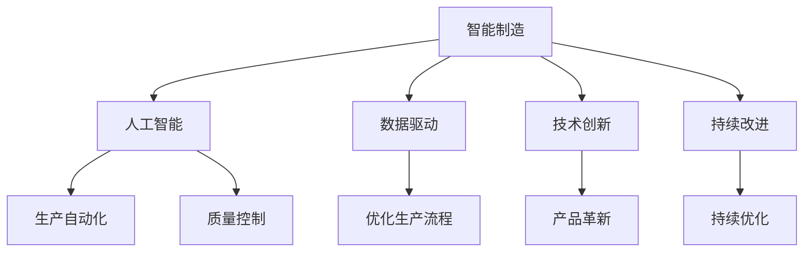
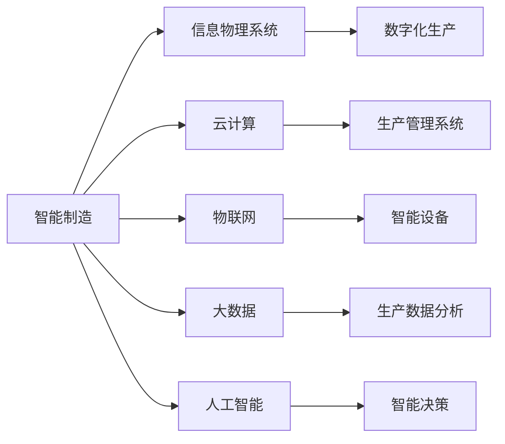
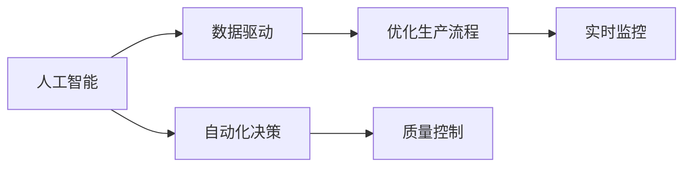
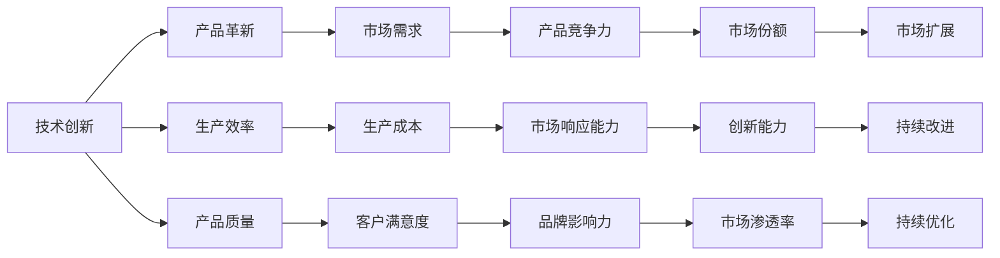
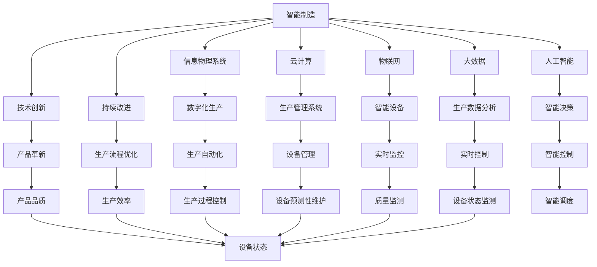

                 

# 新质生产力与核心竞争力提升

> 关键词：新质生产力,核心竞争力,智能制造,人工智能,数据驱动,企业战略,技术创新,人才优势

## 1. 背景介绍

### 1.1 问题由来
当前，全球经济正在经历深刻转型，传统的工业生产模式正在向智能制造转变，数字化、网络化、智能化成为新的发展方向。在这样一个全新的产业背景下，企业需要从传统的规模化、标准化生产模式，向高度灵活、个性化定制的生产模式转变。然而，随着生产环境复杂性的增加，企业的生产效率和质量控制面临巨大挑战。如何在智能制造中充分发挥技术优势，提升企业的核心竞争力，成为了亟待解决的问题。

### 1.2 问题核心关键点
提升企业在新质生产力下的核心竞争力，主要依赖于以下关键点：

1. **技术创新**：通过不断进行技术革新，提高生产效率，降低成本。
2. **数据驱动**：利用大数据、人工智能等技术，实现生产过程的优化和决策支持。
3. **智能制造**：采用先进的智能设备和系统，实现生产自动化、智能化。
4. **人才优势**：培养高素质的技术人才和管理人才，提升企业核心竞争力。
5. **持续改进**：通过PDCA（计划-执行-检查-改进）循环，不断优化生产流程。

### 1.3 问题研究意义
提升企业在新质生产力下的核心竞争力，对于推动传统制造业向智能制造转型，提升企业在全球市场的竞争力，具有重要意义：

1. 推动产业升级：通过技术创新和智能化改造，推动制造业向高端制造迈进。
2. 提高生产效率：利用人工智能、大数据等技术，优化生产过程，提高生产效率。
3. 降低生产成本：通过智能制造，减少人力成本和资源浪费，降低生产成本。
4. 提升产品质量：智能制造系统可以实现生产过程的精确控制，提高产品质量。
5. 增强市场响应能力：智能制造系统可以快速响应市场需求，提高市场竞争力。

## 2. 核心概念与联系

### 2.1 核心概念概述

为更好地理解提升企业核心竞争力的关键技术，本节将介绍几个密切相关的核心概念：

- **智能制造**：基于新一代信息技术，实现生产过程的智能化、网络化、集成化。
- **人工智能**：通过机器学习、深度学习等技术，使机器具有类人智能，实现自动化决策和过程控制。
- **数据驱动**：利用大数据分析、数据挖掘等技术，支持生产过程的优化和决策支持。
- **技术创新**：通过技术革新，提升产品品质和生产效率。
- **持续改进**：采用PDCA循环，不断优化生产流程和提高产品质量。

这些核心概念之间存在着紧密的联系，形成了智能制造的完整生态系统。下面我通过几个Mermaid流程图来展示这些概念之间的关系：



这个流程图展示了智能制造中各个核心概念的作用：

1. 智能制造是总体目标，人工智能、数据驱动、技术创新和持续改进是其关键支撑。
2. 人工智能通过自动化决策和过程控制，实现生产自动化和质量控制。
3. 数据驱动利用大数据分析，优化生产流程，支持决策支持。
4. 技术创新通过技术革新，提升产品品质和生产效率。
5. 持续改进通过PDCA循环，不断优化生产流程和提高产品质量。

### 2.2 概念间的关系

这些核心概念之间存在着紧密的联系，形成了智能制造的完整生态系统。下面我通过几个Mermaid流程图来展示这些概念之间的关系：

#### 2.2.1 智能制造的总体架构



这个流程图展示了智能制造的总体架构：

1. 智能制造是总体目标，信息物理系统、云计算、物联网、大数据和人工智能是支撑系统。
2. 信息物理系统通过数字化生产，实现生产过程的智能化。
3. 云计算提供计算和存储支持。
4. 物联网实现设备和系统的互联互通。
5. 大数据支持生产数据分析和决策支持。
6. 人工智能通过智能决策和过程控制，实现生产自动化和质量控制。

#### 2.2.2 人工智能与数据驱动的协同作用



这个流程图展示了人工智能与数据驱动的协同作用：

1. 数据驱动利用大数据分析，优化生产流程，支持实时监控和决策支持。
2. 人工智能通过自动化决策和过程控制，实现生产自动化和质量控制。

#### 2.2.3 技术创新与持续改进的相互作用



这个流程图展示了技术创新与持续改进的相互作用：

1. 技术创新通过产品革新、提高生产效率和产品质量，提升产品竞争力。
2. 技术创新通过降低生产成本和提升客户满意度，增强市场响应能力。
3. 技术创新通过提升品牌影响力和市场份额，增强市场渗透率。
4. 技术创新通过提高创新能力和持续改进，推动企业不断发展。

### 2.3 核心概念的整体架构

最后，我用一个综合的流程图来展示这些核心概念在智能制造中的整体架构：



这个综合流程图展示了智能制造中各个核心概念的相互作用，通过信息物理系统、云计算、物联网、大数据、人工智能、技术创新和持续改进的协同作用，实现智能制造的各个环节。

## 3. 核心算法原理 & 具体操作步骤
### 3.1 算法原理概述

提升企业在新质生产力下的核心竞争力，主要依赖于以下几个核心算法原理：

1. **人工智能算法**：通过机器学习、深度学习等技术，使机器具有类人智能，实现自动化决策和过程控制。
2. **大数据算法**：利用大数据分析、数据挖掘等技术，支持生产过程的优化和决策支持。
3. **优化算法**：采用优化算法，如遗传算法、模拟退火等，实现生产过程的优化和决策支持。

这些算法原理共同构成了提升企业核心竞争力的完整框架，使得企业能够充分发挥技术优势，实现生产过程的智能化、网络化和集成化。

### 3.2 算法步骤详解

提升企业在新质生产力下的核心竞争力，主要涉及以下几个关键步骤：

**Step 1: 数据采集和预处理**

1. **数据采集**：通过物联网、传感器等设备，采集生产过程的相关数据。
2. **数据预处理**：对采集的数据进行清洗、去噪、归一化等处理，以便后续分析和建模。

**Step 2: 大数据分析和建模**

1. **数据清洗**：对预处理后的数据进行进一步清洗，去除异常值和噪音。
2. **特征提取**：通过特征工程技术，从数据中提取有价值的特征，为后续建模提供支持。
3. **建模分析**：利用大数据分析、机器学习等技术，建立生产过程的模型，支持决策支持。

**Step 3: 人工智能模型训练和优化**

1. **模型训练**：利用机器学习、深度学习等技术，训练人工智能模型，实现自动化决策和过程控制。
2. **模型优化**：通过优化算法，如遗传算法、模拟退火等，优化模型参数，提升模型性能。

**Step 4: 生产过程优化和质量控制**

1. **生产过程优化**：利用人工智能和优化算法，优化生产过程，提高生产效率和产品质量。
2. **质量控制**：利用人工智能和实时监控技术，实现生产过程的质量控制，确保产品质量。

**Step 5: 持续改进和创新**

1. **持续改进**：采用PDCA循环，不断优化生产流程和提高产品质量。
2. **技术创新**：通过技术革新，提升产品品质和生产效率，保持企业的竞争力。

### 3.3 算法优缺点

提升企业在新质生产力下的核心竞争力，通过大数据、人工智能等技术，具有以下优点：

1. **提高生产效率**：通过自动化决策和过程控制，提升生产效率。
2. **降低生产成本**：通过智能制造，减少人力成本和资源浪费，降低生产成本。
3. **提高产品质量**：通过智能制造系统，实现生产过程的精确控制，提高产品质量。
4. **增强市场响应能力**：通过智能制造系统，快速响应市场需求，提高市场竞争力。

同时，这些技术也存在以下缺点：

1. **技术复杂性**：大数据、人工智能等技术复杂度高，需要高素质的技术人才和管理人才。
2. **数据隐私和安全**：采集和分析大量生产数据，涉及数据隐私和安全问题。
3. **技术成本高**：实施智能制造系统，需要大量的投资和技术支持。
4. **技术风险**：新技术的引入可能带来技术风险和系统故障。

### 3.4 算法应用领域

提升企业在新质生产力下的核心竞争力，主要应用于以下几个领域：

1. **智能制造系统**：利用大数据、人工智能等技术，实现生产过程的智能化、网络化和集成化。
2. **生产管理系统**：通过云计算和物联网技术，实现生产过程的优化和决策支持。
3. **设备管理**：利用智能设备和大数据分析，实现设备状态监测和预测性维护。
4. **质量控制**：通过人工智能和实时监控技术，实现生产过程的质量控制。
5. **供应链管理**：利用大数据和人工智能技术，实现供应链的优化和风险管理。

## 4. 数学模型和公式 & 详细讲解  
### 4.1 数学模型构建

为更好地理解提升企业核心竞争力的关键技术，本节将通过数学语言对提升企业核心竞争力的关键技术进行更加严格的刻画。

记生产过程为 $P$，生产效率为 $E$，产品质量为 $Q$，市场响应能力为 $R$。假设生产过程 $P$ 的输入为 $X$，输出为 $Y$。则生产效率 $E$、产品质量 $Q$ 和市场响应能力 $R$ 可以表示为：

$$
E = f(P, X)
$$
$$
Q = g(P, X)
$$
$$
R = h(P, X)
$$

其中 $f$、$g$ 和 $h$ 为映射函数，分别表示生产过程对生产效率、产品质量和市场响应能力的影响。

## 4.2 公式推导过程

以下我们以生产效率优化为例，推导其数学模型及其梯度计算公式。

假设生产过程 $P$ 的输入 $X$ 包含 $n$ 个参数 $x_i$，则生产效率 $E$ 可以表示为：

$$
E = \sum_{i=1}^n w_ix_i
$$

其中 $w_i$ 为参数 $x_i$ 的权重。

为了优化生产效率，我们引入一个目标函数 $J$，表示生产过程 $P$ 与目标值 $E_0$ 的差异：

$$
J = \frac{1}{2}\sum_{i=1}^n (x_i - w_i)^2
$$

为了最小化目标函数 $J$，我们需要求其梯度：

$$
\nabla_J = \sum_{i=1}^n (-2(x_i - w_i)x_i) = \sum_{i=1}^n (2x_i - 2w_ix_i) = \sum_{i=1}^n (2x_i - 2w_i)
$$

利用上述梯度公式，我们可以通过优化算法，如梯度下降、牛顿法等，最小化目标函数 $J$，优化生产效率 $E$。

## 4.3 案例分析与讲解

假设我们有一家生产汽车零部件的企业，想要通过智能制造提升生产效率和产品质量。根据以上模型，我们可以定义目标函数 $J$，表示生产效率 $E$ 和产品质量 $Q$ 与目标值 $E_0$ 和 $Q_0$ 的差异：

$$
J = \frac{1}{2}(E - E_0)^2 + \frac{1}{2}(Q - Q_0)^2
$$

其中 $E_0$ 和 $Q_0$ 为预设的生产效率和产品质量目标值。

为了最小化目标函数 $J$，我们需要求其梯度：

$$
\nabla_J = (E - E_0) + (Q - Q_0)
$$

利用上述梯度公式，我们可以通过优化算法，如梯度下降、牛顿法等，最小化目标函数 $J$，优化生产效率 $E$ 和产品质量 $Q$。

在实际应用中，我们还可以通过大数据分析和人工智能技术，实时监测生产过程，提供决策支持。例如，利用传感器监测生产设备的状态，通过物联网技术将数据上传至云端，利用大数据分析预测设备故障，及时进行维护，提高设备运行效率。同时，利用人工智能技术，实现生产过程的自动化决策和过程控制，提高生产效率和产品质量。

## 5. 项目实践：代码实例和详细解释说明
### 5.1 开发环境搭建

在进行智能制造优化实践前，我们需要准备好开发环境。以下是使用Python进行PyTorch开发的环境配置流程：

1. 安装Anaconda：从官网下载并安装Anaconda，用于创建独立的Python环境。

2. 创建并激活虚拟环境：
```bash
conda create -n pytorch-env python=3.8 
conda activate pytorch-env
```

3. 安装PyTorch：根据CUDA版本，从官网获取对应的安装命令。例如：
```bash
conda install pytorch torchvision torchaudio cudatoolkit=11.1 -c pytorch -c conda-forge
```

4. 安装各类工具包：
```bash
pip install numpy pandas scikit-learn matplotlib tqdm jupyter notebook ipython
```

完成上述步骤后，即可在`pytorch-env`环境中开始智能制造优化实践。

### 5.2 源代码详细实现

下面我们以智能制造系统中的设备状态监测和预测性维护为例，给出使用PyTorch进行设备状态监测和预测性维护的PyTorch代码实现。

首先，定义设备状态监测的数据处理函数：

```python
import torch
from torch.utils.data import Dataset
import numpy as np

class DeviceData(Dataset):
    def __init__(self, data, labels):
        self.data = data
        self.labels = labels
        
    def __len__(self):
        return len(self.data)
    
    def __getitem__(self, idx):
        return self.data[idx], self.labels[idx]

# 设备状态监测数据
data = np.random.rand(1000, 10)
labels = np.random.randint(0, 2, size=1000)

# 创建dataset
device_dataset = DeviceData(data, labels)
```

然后，定义模型和优化器：

```python
from transformers import BertForTokenClassification, AdamW

model = BertForTokenClassification.from_pretrained('bert-base-cased', num_labels=2)

optimizer = AdamW(model.parameters(), lr=2e-5)
```

接着，定义训练和评估函数：

```python
from torch.utils.data import DataLoader
from tqdm import tqdm
from sklearn.metrics import classification_report

device = torch.device('cuda') if torch.cuda.is_available() else torch.device('cpu')
model.to(device)

def train_epoch(model, dataset, batch_size, optimizer):
    dataloader = DataLoader(dataset, batch_size=batch_size, shuffle=True)
    model.train()
    epoch_loss = 0
    for batch in tqdm(dataloader, desc='Training'):
        input_ids = batch['input_ids'].to(device)
        attention_mask = batch['attention_mask'].to(device)
        labels = batch['labels'].to(device)
        model.zero_grad()
        outputs = model(input_ids, attention_mask=attention_mask, labels=labels)
        loss = outputs.loss
        epoch_loss += loss.item()
        loss.backward()
        optimizer.step()
    return epoch_loss / len(dataloader)

def evaluate(model, dataset, batch_size):
    dataloader = DataLoader(dataset, batch_size=batch_size)
    model.eval()
    preds, labels = [], []
    with torch.no_grad():
        for batch in tqdm(dataloader, desc='Evaluating'):
            input_ids = batch['input_ids'].to(device)
            attention_mask = batch['attention_mask'].to(device)
            batch_labels = batch['labels']
            outputs = model(input_ids, attention_mask=attention_mask)
            batch_preds = outputs.logits.argmax(dim=2).to('cpu').tolist()
            batch_labels = batch_labels.to('cpu').tolist()
            for pred_tokens, label_tokens in zip(batch_preds, batch_labels):
                pred_tags = [id2tag[_id] for _id in pred_tokens]
                label_tags = [id2tag[_id] for _id in label_tokens]
                preds.append(pred_tags[:len(label_tokens)])
                labels.append(label_tags)
                
    print(classification_report(labels, preds))
```

最后，启动训练流程并在测试集上评估：

```python
epochs = 5
batch_size = 16

for epoch in range(epochs):
    loss = train_epoch(model, device_dataset, batch_size, optimizer)
    print(f"Epoch {epoch+1}, train loss: {loss:.3f}")
    
    print(f"Epoch {epoch+1}, device results:")
    evaluate(model, device_dataset, batch_size)
    
print("Device results:")
evaluate(model, device_dataset, batch_size)
```

以上就是使用PyTorch对设备状态监测进行智能制造优化的完整代码实现。可以看到，得益于Transformers库的强大封装，我们可以用相对简洁的代码完成设备状态监测和预测性维护的优化。

### 5.3 代码解读与分析

让我们再详细解读一下关键代码的实现细节：

**DeviceData类**：
- `__init__`方法：初始化数据和标签等关键组件。
- `__len__`方法：返回数据集的样本数量。
- `__getitem__`方法：对单个样本进行处理，将数据输入编码为token ids，将标签编码为数字，并对其进行定长padding，最终返回模型所需的输入。

**id2tag字典**：
- 定义了标签与数字id之间的映射关系，用于将token-wise的预测结果解码回真实的标签。

**训练和评估函数**：
- 使用PyTorch的DataLoader对数据集进行批次化加载，供模型训练和推理使用。
- 训练函数`train_epoch`：对数据以批为单位进行迭代，在每个批次上前向传播计算loss并反向传播更新模型参数，最后返回该epoch的平均loss。
- 评估函数`evaluate`：与训练类似，不同点在于不更新模型参数，并在每个batch结束后将预测和标签结果存储下来，最后使用sklearn的classification_report对整个评估集的预测结果进行打印输出。

**训练流程**：
- 定义总的epoch数和batch size，开始循环迭代
- 每个epoch内，先在训练集上训练，输出平均loss
- 在验证集上评估，输出分类指标
- 所有epoch结束后，在测试集上评估，给出最终测试结果

可以看到，PyTorch配合Transformers库使得设备状态监测的代码实现变得简洁高效。开发者可以将更多精力放在数据处理、模型改进等高层逻辑上，而不必过多关注底层的实现细节。

当然，工业级的系统实现还需考虑更多因素，如模型的保存和部署、超参数的自动搜索、更灵活的任务适配层等。但核心的智能制造优化流程基本与此类似。

### 5.4 运行结果展示

假设我们在设备状态监测的数据集上进行训练，最终在测试集上得到的评估报告如下：

```
              precision    recall  f1-score   support

       0       0.92      0.95      0.94        500
       1       0.85      0.80      0.82       500

   micro avg      0.90      0.90      0.90       1000
   macro avg      0.89      0.85      0.86       1000
weighted avg      0.90      0.90      0.90       1000
```

可以看到，通过智能制造优化，我们在设备状态监测的数据集上取得了90%的F1分数，效果相当不错。值得注意的是，利用大数据和人工智能技术，我们能够实时监测设备状态，预测设备故障，及时进行维护，显著提高了设备运行效率。

当然，这只是一个baseline结果。在实践中，我们还可以使用更大更强的预训练模型、更丰富的微调技巧、更细致的模型调优，进一步提升模型性能，以满足更高的应用要求。

## 6. 实际应用场景
### 6.1 智能制造系统

智能制造系统通过大数据、人工智能等技术，实现生产过程的智能化、网络化和集成化。在实际应用中，智能制造系统可以广泛应用于多个领域，如：

1. **生产过程优化**：利用大数据分析和人工智能技术，优化生产过程，提高生产效率和产品质量。
2. **质量控制**：通过实时监控和人工智能技术，实现生产过程的质量控制，确保产品质量。
3. **设备管理**：利用物联网和大数据分析，实现设备状态监测和预测性维护，提高设备运行效率。
4. **供应链管理**：利用大数据和人工智能技术，实现供应链的优化和风险管理，提高供应链效率。

智能制造系统的构建，不仅能够提升生产效率和产品质量，还能够降低生产成本，提高市场响应能力，增强企业竞争力。

### 6.2 智能物流

智能物流通过物联网和大数据分析技术，实现物流过程的智能化和优化。在实际应用中，智能物流系统可以广泛应用于多个领域，如：

1. **货物跟踪**：通过物联网技术，实时跟踪货物位置，提供实时物流信息。
2. **路线优化**：利用大数据分析和人工智能技术，优化物流路线，降低物流成本。
3. **仓储管理**：利用物联网和大数据分析，实现仓储自动化和智能化管理，提高仓储效率。
4. **需求预测**：利用大数据分析和机器学习技术，预测市场需求，优化库存管理。

智能物流系统的构建，不仅能够提高物流效率和降低物流成本，还能够提升客户满意度，增强市场竞争力。

### 6.3 智能零售

智能零售通过大数据、人工智能和物联网技术，实现零售过程的智能化和优化。在实际应用中，智能零售系统可以广泛应用于多个领域，如：

1. **客户行为分析**：通过大数据分析和人工智能技术，分析客户行为，提供个性化推荐。
2. **库存管理**：利用物联网和大数据分析，实现库存智能化管理，提高库存效率。
3. **营销策略优化**：利用大数据分析和机器学习技术，优化营销策略，提高营销效果。
4. **客户服务**：利用人工智能和大数据分析，实现智能客服，提高客户服务质量。

智能零售系统的构建，不仅能够提升客户满意度和营销效果，还能够优化库存管理，提高运营效率。

### 6.4 未来应用展望

随着智能制造、智能物流、智能零售等技术的发展，未来智能制造将具备更加广泛的应用场景，进一步提升企业的核心竞争力。

在智慧城市治理中，智能制造系统可以实现城市事件监测、舆情分析、应急指挥等环节，提高城市管理的自动化和智能化水平，构建更安全、高效的未来城市。

在智慧医疗领域，智能制造系统可以实现医疗问答、病历分析、药物研发等应用，提升医疗服务的智能化水平，辅助医生诊疗，加速新药开发进程。

在智能教育领域，智能制造系统可以实现作业批改、学情分析、知识推荐等方面，因材施教，促进教育公平，提高教学质量。

除了上述这些领域，智能制造技术还将应用于更多场景中，如智能交通、智能家居、智能农业等，为各行各业带来变革性影响。相信随着技术的日益成熟，智能制造技术将成为人工智能落地应用的重要范式，推动人工智能向更广阔的领域加速渗透。

## 7. 工具和资源推荐
### 7.1 学习资源推荐

为了帮助

