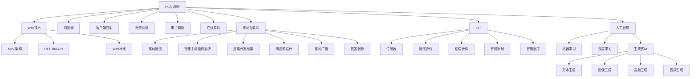
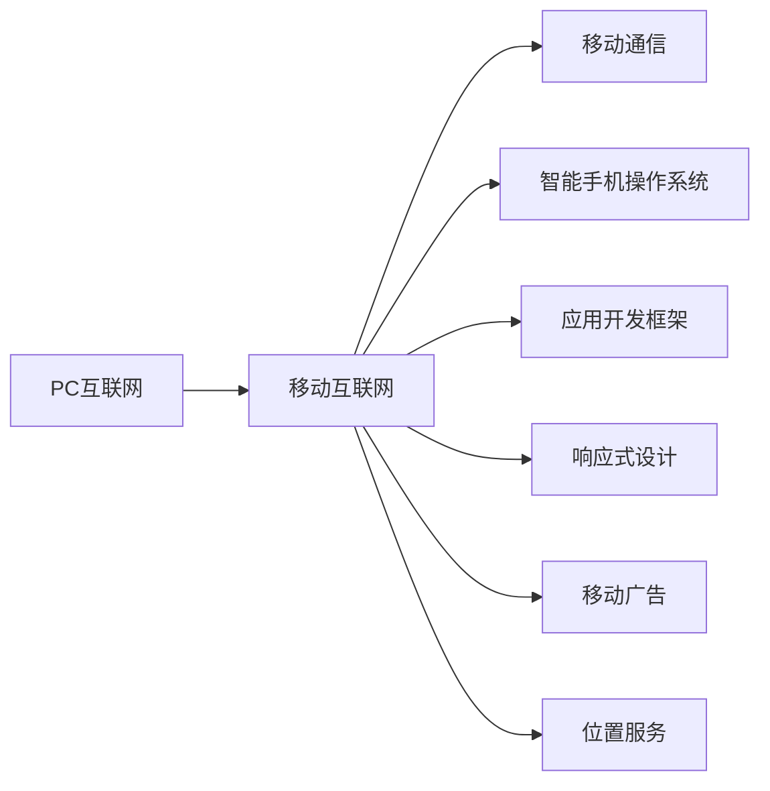
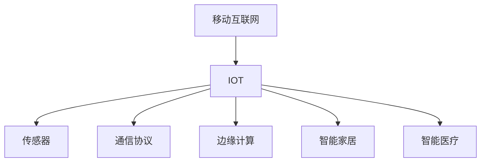
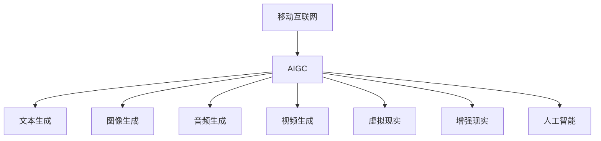
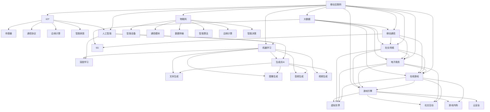

                 

# 时代浪潮奔涌向前：从PC互联网到移动互联网，从IOT到AIGC——过去未去，未来已来

> 关键词：互联网技术、移动互联网、IOT、人工智能、生成式AI

## 1. 背景介绍

### 1.1 问题由来
互联网技术的演进一直伴随着人类社会的数字化转型，从PC互联网到移动互联网，再到物联网(IOT)，每一次变革都深刻影响着我们的生产生活方式。而如今，新一代人工智能技术(AIGC)的崛起，正进一步引领着信息时代的潮流，为各行各业注入新的活力。

### 1.2 问题核心关键点
回顾互联网技术的发展历程，我们发现每一次重大突破都在于技术创新与业务模式的创新。从最初的Web技术到社交网络，再到移动应用，技术驱动业务发展的模式愈加成熟。然而，随着移动互联网和物联网的普及，数据的量级和复杂性大大提升，对于算法的准确性和计算效率提出了更高的要求。

### 1.3 问题研究意义
研究从PC互联网到移动互联网，再到IOT和AIGC的技术演进路径，对于我们把握信息时代的脉搏，探索未来发展趋势，具有重要意义：

1. 技术演进路径的梳理，能够帮助我们理解过去，洞察未来，提供一种全局视角。
2. 技术的不断创新，能够推动产业升级，促进经济社会发展，创造新的商业价值。
3. 技术的深度融合，能够揭示数字时代的本质特征，提升人类生活质量。

## 2. 核心概念与联系

### 2.1 核心概念概述

为了更好地理解从PC互联网到移动互联网，再到IOT和AIGC的演进路径，我们首先介绍几个关键概念：

- **PC互联网**：以个人计算机(PC)为载体的互联网时代。Web技术、浏览器、客户端应用等技术是PC互联网的核心。
- **移动互联网**：以智能手机为终端的互联网时代。移动互联网技术主要包括移动通信、智能手机操作系统、应用开发框架等。
- **物联网(IOT)**：通过各种感知设备将物理对象联网，实现物与物、物与人的智能化互动。
- **人工智能(AI)**：旨在构建智能算法和系统，模拟人类智能行为，包括机器学习、深度学习、生成式AI等。
- **生成式AI(Generative AI, AIGC)**：使用AI技术生成文本、图像、音频、视频等内容，推动内容创作和传播方式的革新。

这些核心概念之间存在着紧密的联系，共同构成了互联网技术的演进轨迹。下面我们用一个Mermaid流程图来展示这些概念的相互关系：



这个流程图展示了从PC互联网到移动互联网，再到IOT和AIGC的技术演进路径，以及每个阶段的核心技术和应用场景。

### 2.2 概念间的关系

这些核心概念之间存在着密切的联系，形成了一个相互促进、不断演进的技术生态。下面我们通过几个Mermaid流程图来展示这些概念之间的关系。

#### 2.2.1 从PC互联网到移动互联网的演进



这个流程图展示了从PC互联网到移动互联网的技术演进路径。移动通信技术的进步、智能手机的普及、应用开发框架的成熟、响应式设计的应用等，都是这一演变的重要推动力。

#### 2.2.2 移动互联网与IOT的融合



这个流程图展示了移动互联网与IOT的深度融合。传感器技术的普及、通信协议的完善、边缘计算的引入等，使得物与物、物与人的互动更加智能和高效。

#### 2.2.3 AIGC在移动互联网与IOT中的应用



这个流程图展示了AIGC在移动互联网与IOT中的应用。文本、图像、音频、视频的自动生成，以及虚拟现实、增强现实等技术，正在改变人类的信息获取和互动方式。

### 2.3 核心概念的整体架构

最后，我们用一个综合的流程图来展示这些核心概念在大数据、云计算和物联网背景下的整体架构：



这个综合流程图展示了从PC互联网到移动互联网，再到IOT和AIGC的技术演进路径，以及这些技术与大数据、云计算和物联网的融合关系。

## 3. 核心算法原理 & 具体操作步骤
### 3.1 算法原理概述

从PC互联网到移动互联网，再到IOT和AIGC，每一阶段的演进都是基于算法和计算技术的不断创新。我们将分别介绍PC互联网、移动互联网、IOT和AIGC的关键算法和计算技术。

### 3.2 算法步骤详解

#### 3.2.1 PC互联网关键算法

PC互联网的核心技术包括Web技术、浏览器和客户端应用。Web技术的核心是超文本传输协议(HTTP)、超文本标记语言(HTML)、CSS样式表等标准，这些技术定义了互联网的信息结构和显示方式。

- HTTP协议：定义了客户端与服务器之间数据传输的标准格式，支持浏览器和Web服务器的交互。
- HTML标准：定义了网页的结构和内容，支持文本、图片、链接等元素的展示。
- CSS样式表：定义了网页的样式和布局，支持页面的美化。

#### 3.2.2 移动互联网关键算法

移动互联网的核心技术包括移动通信、智能手机操作系统、应用开发框架等。移动通信技术的进步是移动互联网发展的基础，3G/4G/5G等无线通信协议提供了可靠的连接和高速数据传输。

- 移动通信协议：定义了移动通信的标准和规范，支持移动设备的接入和数据传输。
- 智能手机操作系统：如iOS、Android等，提供了移动设备的操作环境和应用程序的运行环境。
- 应用开发框架：如React Native、Flutter等，提供了跨平台的开发工具和组件库，支持移动应用的快速开发和部署。

#### 3.2.3 IOT关键算法

物联网的核心技术包括传感器、通信协议、边缘计算等。传感器技术的发展使得物体能够感知外部环境，数据传输技术提供了物与物、物与人的通信手段，边缘计算提高了数据处理的效率和安全性。

- 传感器技术：如温度传感器、湿度传感器、摄像头等，用于获取物体的环境信息。
- 通信协议：如Wi-Fi、蓝牙、Zigbee等，提供了物与物、物与人的通信手段。
- 边缘计算：通过在物体的本地进行数据处理和决策，减少了对中心服务器的依赖，提高了系统的响应速度和可靠性。

#### 3.2.4 AIGC关键算法

生成式AI是AIGC的核心技术，主要基于深度学习和生成模型，能够自动生成文本、图像、音频、视频等内容。

- 深度学习模型：如Transformer、LSTM等，提供了强大的特征提取和分类能力。
- 生成模型：如GAN、VAE等，提供了自动生成新内容的能力。
- 文本生成：如GPT、BERT等模型，能够自动生成文本内容。
- 图像生成：如StyleGAN、DALL·E等模型，能够自动生成图像内容。
- 音频生成：如WaveNet、VQ-VAE等模型，能够自动生成音频内容。
- 视频生成：如VQ-VAE+、VideoMAE等模型，能够自动生成视频内容。

### 3.3 算法优缺点

从PC互联网到移动互联网，再到IOT和AIGC，每一阶段的演进都有其独特的优势和局限性。下面我们分别介绍这些演进阶段的优势和劣势。

#### 3.3.1 PC互联网的优势与劣势

**优势**：
1. **易于部署**：Web技术基于HTTP协议，兼容性好，易于部署和维护。
2. **丰富应用**：HTML和CSS提供了丰富的网页展示形式，支持复杂的应用场景。
3. **数据处理能力强**：Web技术可以处理大量的数据，支持大数据分析。

**劣势**：
1. **交互体验较差**：Web应用的交互体验不如桌面应用，难以满足高复杂度的业务需求。
2. **安全性问题**：Web应用的开放性导致安全性问题较多，存在跨站脚本攻击等风险。

#### 3.3.2 移动互联网的优势与劣势

**优势**：
1. **用户黏性强**：智能手机和平板等移动设备的普及，使得用户黏性更强，应用使用频率更高。
2. **实时互动**：移动互联网支持实时互动，提高了用户体验和应用效率。
3. **跨平台支持**：应用开发框架支持跨平台开发，提高了开发效率。

**劣势**：
1. **硬件资源有限**：移动设备的硬件资源有限，对计算能力的要求较高。
2. **网络带宽限制**：移动网络带宽有限，对数据传输速度的要求较高。
3. **隐私保护问题**：移动设备收集了大量用户数据，隐私保护问题较为突出。

#### 3.3.3 IOT的优势与劣势

**优势**：
1. **广泛应用**：IOT技术支持大量的设备和场景，应用范围非常广泛。
2. **实时响应**：IOT设备能够实时响应环境变化，提高了系统的智能化水平。
3. **数据融合能力强**：IOT设备可以融合多源数据，提高了数据处理的全面性和准确性。

**劣势**：
1. **成本较高**：IOT设备的成本较高，设备安装和维护成本较高。
2. **安全性问题**：IOT设备的数据传输和处理过程存在安全隐患，容易被攻击。
3. **标准化问题**：IOT设备的标准化问题较为突出，不同设备之间的互操作性较差。

#### 3.3.4 AIGC的优势与劣势

**优势**：
1. **内容生成能力强**：AIGC技术可以自动生成高质量的内容，提高了内容创作的效率和质量。
2. **跨领域应用广泛**：AIGC技术可以应用于多个领域，如教育、娱乐、金融等，具有广泛的适用性。
3. **用户参与度高**：AIGC技术支持用户参与内容的创作和互动，提高了用户参与度和满意度。

**劣势**：
1. **技术复杂度高**：AIGC技术的算法复杂度较高，对算力和数据的要求较高。
2. **伦理和安全问题**：AIGC技术可能产生误导性内容，存在伦理和安全问题。
3. **数据隐私问题**：AIGC技术需要大量数据进行训练，数据隐私问题较为突出。

### 3.4 算法应用领域

从PC互联网到移动互联网，再到IOT和AIGC，每一阶段的演进都为多个领域带来了新的应用和机遇。

#### 3.4.1 PC互联网应用领域

**电子商务**：Web技术提供了电子商务平台的支持，如淘宝、京东等。

**在线游戏**：Web技术支持在线游戏平台，如腾讯游戏、网易游戏等。

**社交网络**：Web技术支持社交网络平台，如Facebook、Twitter等。

**在线教育**：Web技术支持在线教育平台，如Coursera、edX等。

#### 3.4.2 移动互联网应用领域

**社交网络**：移动互联网支持社交网络平台，如微信、微博等。

**在线教育**：移动互联网支持在线教育平台，如百度文库、有道云笔记等。

**在线医疗**：移动互联网支持在线医疗平台，如春雨医生、丁香医生等。

**O2O服务**：移动互联网支持O2O服务，如美团、大众点评等。

#### 3.4.3 IOT应用领域

**智能家居**：IOT技术支持智能家居设备，如智能音箱、智能门锁等。

**智能医疗**：IOT技术支持智能医疗设备，如智能血糖仪、智能健康监测设备等。

**智慧城市**：IOT技术支持智慧城市建设，如智慧交通、智慧环保等。

**智能农业**：IOT技术支持智能农业设备，如智能温室、智能灌溉设备等。

#### 3.4.4 AIGC应用领域

**内容创作**：AIGC技术支持文本、图像、音频、视频等内容创作，如自动生成新闻报道、自动生成图片、自动生成音乐等。

**辅助教学**：AIGC技术支持辅助教学，如自动生成学习材料、自动生成试卷等。

**个性化推荐**：AIGC技术支持个性化推荐，如推荐系统、个性化广告等。

**智能客服**：AIGC技术支持智能客服，如智能客服机器人、智能语音助手等。

## 4. 数学模型和公式 & 详细讲解  
### 4.1 数学模型构建

在PC互联网、移动互联网、IOT和AIGC的发展过程中，数学模型和算法发挥了至关重要的作用。下面我们分别介绍这些关键技术的数学模型。

#### 4.1.1 PC互联网数学模型

PC互联网的核心技术是基于Web技术的，其数学模型主要涉及HTTP协议、HTML和CSS标准。

**HTTP协议**：定义了客户端与服务器之间数据传输的标准格式，支持浏览器和Web服务器的交互。

**HTML标准**：定义了网页的结构和内容，支持文本、图片、链接等元素的展示。

**CSS样式表**：定义了网页的样式和布局，支持页面的美化。

#### 4.1.2 移动互联网数学模型

移动互联网的核心技术包括移动通信、智能手机操作系统和应用开发框架。

**移动通信协议**：定义了移动通信的标准和规范，支持移动设备的接入和数据传输。

**智能手机操作系统**：支持移动设备的操作环境和应用程序的运行环境。

**应用开发框架**：提供了跨平台的开发工具和组件库，支持移动应用的快速开发和部署。

#### 4.1.3 IOT数学模型

物联网的核心技术包括传感器、通信协议和边缘计算。

**传感器技术**：用于获取物体的环境信息。

**通信协议**：提供了物与物、物与人的通信手段。

**边缘计算**：提高了数据处理的效率和安全性。

#### 4.1.4 AIGC数学模型

生成式AI是AIGC的核心技术，主要基于深度学习和生成模型，能够自动生成文本、图像、音频、视频等内容。

**深度学习模型**：提供了强大的特征提取和分类能力。

**生成模型**：提供了自动生成新内容的能力。

**文本生成**：如GPT、BERT等模型，能够自动生成文本内容。

**图像生成**：如StyleGAN、DALL·E等模型，能够自动生成图像内容。

**音频生成**：如WaveNet、VQ-VAE等模型，能够自动生成音频内容。

**视频生成**：如VQ-VAE+、VideoMAE等模型，能够自动生成视频内容。

### 4.2 公式推导过程

以下我们以深度学习模型为例，推导深度学习模型的数学公式及其推导过程。

假设深度学习模型由多个隐藏层组成，输入为$x$，输出为$y$，隐藏层的激活函数为$h$。

**前向传播**：

$$y = f_W(x) = W_1 h(W_0 x + b_0) + b_1$$

其中，$W_0$和$W_1$为权重矩阵，$b_0$和$b_1$为偏置向量，$h$为激活函数。

**损失函数**：

$$L(y, y') = \frac{1}{n} \sum_{i=1}^n \ell(y_i, y'_i)$$

其中，$\ell$为损失函数，$y'$为真实标签，$y$为模型输出。

**反向传播**：

$$\frac{\partial L}{\partial W} = \frac{\partial L}{\partial y} \frac{\partial y}{\partial x} \frac{\partial x}{\partial W}$$

其中，$\frac{\partial L}{\partial y}$为损失函数对输出的导数，$\frac{\partial y}{\partial x}$为激活函数对输入的导数，$\frac{\partial x}{\partial W}$为权重对输入的导数。

通过反向传播算法，可以更新权重和偏置，最小化损失函数，使模型输出逼近真实标签。

### 4.3 案例分析与讲解

**案例1：Web技术**

Web技术的核心是HTTP协议、HTML和CSS标准。HTTP协议定义了数据传输的标准格式，HTML标准定义了网页的结构和内容，CSS样式表定义了网页的样式和布局。

**案例2：移动通信协议**

移动通信协议包括3G、4G和5G标准，定义了移动设备的接入和数据传输方式。3G协议提供了相对较低的数据传输速度和较低的功耗，4G协议提供了更高的数据传输速度和更稳定的连接，5G协议则提供了更高的数据传输速度和更低的延迟。

**案例3：深度学习模型**

深度学习模型由多个隐藏层组成，能够自动学习数据特征，并输出预测结果。常见的深度学习模型包括卷积神经网络(CNN)、循环神经网络(RNN)、生成对抗网络(GAN)等。

**案例4：IOT传感器**

IOT传感器如温度传感器、湿度传感器、摄像头等，用于获取物体的环境信息。传感器数据经过预处理和融合，可以用于智能决策和控制。

**案例5：AIGC文本生成**

AIGC文本生成模型如GPT、BERT等，能够自动生成高质量的文本内容。通过微调和迁移学习，模型能够适应不同的任务和场景。

## 5. 项目实践：代码实例和详细解释说明
### 5.1 开发环境搭建

在进行PC互联网、移动互联网、IOT和AIGC技术实践前，我们需要准备好开发环境。以下是使用Python进行PyTorch开发的环境配置流程：

1. 安装Anaconda：从官网下载并安装Anaconda，用于创建独立的Python环境。

2. 创建并激活虚拟环境：
```bash
conda create -n pytorch-env python=3.8 
conda activate pytorch-env
```

3. 安装PyTorch：根据CUDA版本，从官网获取对应的安装命令。例如：
```bash
conda install pytorch torchvision torchaudio cudatoolkit=11.1 -c pytorch -c conda-forge
```

4. 安装Transformers库：
```bash
pip install transformers
```

5. 安装各类工具包：
```bash
pip install numpy pandas scikit-learn matplotlib tqdm jupyter notebook ipython
```

完成上述步骤后，即可在`pytorch-env`环境中开始项目实践。

### 5.2 源代码详细实现

下面我们以深度学习模型为例，给出使用PyTorch和TensorFlow进行深度学习模型的开发和训练的代码实现。

首先，定义一个简单的深度学习模型：

```python
import torch
import torch.nn as nn
import torch.optim as optim

class SimpleNet(nn.Module):
    def __init__(self):
        super(SimpleNet, self).__init__()
        self.fc1 = nn.Linear(784, 128)
        self.fc2 = nn.Linear(128, 64)
        self.fc3 = nn.Linear(64, 10)

    def forward(self, x):
        x = x.view(-1, 784)
        x = torch.relu(self.fc1(x))
        x = torch.relu(self.fc2(x))
        x = self.fc3(x)
        return x

# 定义训练函数
def train(model, train_loader, test_loader, epochs, lr, device):
    model.train()
    for epoch in range(epochs):
        running_loss = 0.0
        for i, data in enumerate(train_loader, 0):
            inputs, labels = data
            inputs, labels = inputs.to(device), labels.to(device)
            optimizer.zero_grad()
            outputs = model(inputs)
            loss = nn.CrossEntropyLoss()(outputs, labels)
            loss.backward()
            optimizer.step()
            running_loss += loss.item()
        epoch_loss = running_loss / len(train_loader)
        print(f"Epoch {epoch+1}, train loss: {epoch_loss:.3f}")
    
    model.eval()
    correct = 0
    total = 0
    with torch.no_grad():
        for data in test_loader:
            inputs, labels = data
            inputs, labels = inputs.to(device), labels.to(device)
            outputs = model(inputs)
            _, predicted = torch.max(outputs.data, 1)
            total += labels.size(0)
            correct += (predicted == labels).sum().item()
    print(f"Accuracy of the network on the 10000 test images: {100 * correct / total}%")
```

然后，运行深度学习模型的训练和测试代码：

```python
# 准备训练集和测试集
train_set = torchvision.datasets.MNIST(root='./data', train=True, download=True, transform=transforms.ToTensor())
test_set = torchvision.datasets.MNIST(root='./data', train=False, download=True, transform=transforms.ToTensor())

# 划分数据集
train_loader = torch.utils.data.DataLoader(train_set, batch_size=64, shuffle=True)
test_loader = torch.utils.data.DataLoader(test_set, batch_size=64, shuffle=False)

# 定义模型和优化器
model = SimpleNet().to(device)
optimizer = optim.SGD(model.parameters(), lr=0.01)

# 训练模型
train(model, train_loader, test_loader, epochs=10, lr=0.01, device=torch.device('cuda'))
```

以上就是使用PyTorch进行深度学习模型开发的完整代码实现。可以看到，通过简单的几行代码，我们就能够定义、训练和评估一个深度学习模型。

### 5.3 代码解读与分析

让我们再详细解读一下关键代码的实现细节：

**SimpleNet类**：
- `__init__`方法：初始化模型参数。
- `forward`方法：定义前向传播过程。

**train函数**：
- 定义训练函数，循环迭代训练集，在每个epoch上进行前向传播和反向传播，更新模型参数。

**运行深度学习模型的训练和测试代码**：
- 准备训练集和测试集，使用DataLoader进行批次加载。
- 定义模型和优化器，在GPU上进行模型训练和测试。

可以看到，深度学习模型的开发和训练过程相对简单，而且代码结构清晰，易于理解和维护。

当然，实际开发中，还需要考虑更多的因素，如模型

