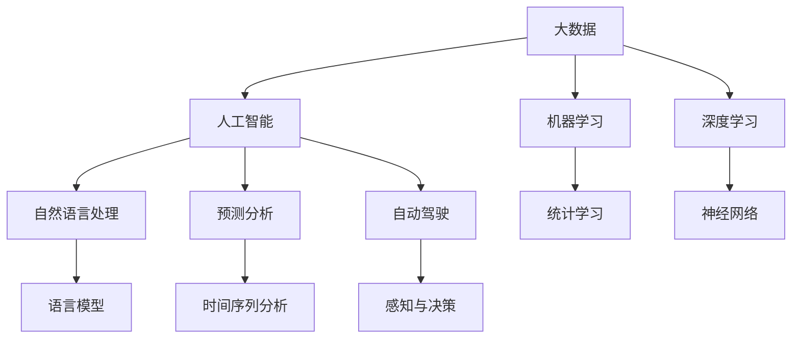
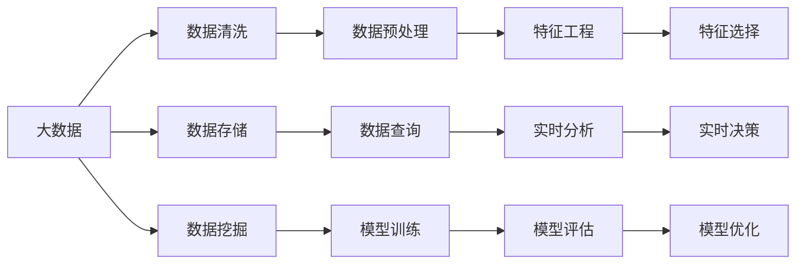
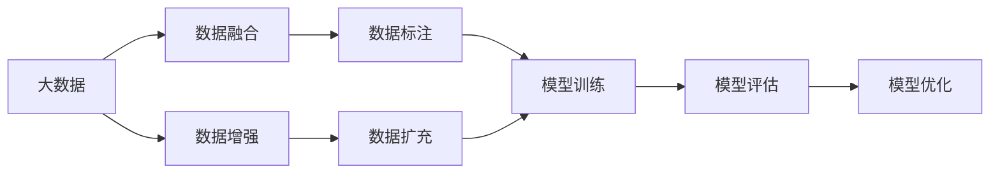

                 

# 未来发展中的大数据与AI

> 关键词：
1. 大数据
2. 人工智能
3. 机器学习
4. 深度学习
5. 自然语言处理
6. 预测分析
7. 自动驾驶

## 1. 背景介绍

### 1.1 问题由来
随着互联网和信息技术的发展，全球数据量呈爆炸式增长，大数据（Big Data）应运而生。大数据以其海量的规模、多样化的类型、高速的增长率等特点，为人工智能（AI）的发展提供了广阔的土壤。人工智能作为一项前沿科技，正逐步渗透到各个领域，引领新一轮的技术革新。本文旨在探讨大数据与AI的深度融合，展望未来发展趋势。

### 1.2 问题核心关键点
大数据与AI的结合，主要围绕以下几个核心关键点展开：
- **数据规模**：大数据带来的海量数据源为AI提供了丰富的训练样本，是AI模型性能提升的重要基础。
- **数据质量**：数据的准确性、完整性和一致性直接影响AI模型的训练效果和预测能力。
- **数据处理能力**：高效的数据处理和存储能力是大数据与AI融合的重要保障。
- **AI算法**：AI算法的不断进化和大模型的涌现，为大数据提供了更强大的处理和分析能力。
- **模型可解释性**：随着AI应用的深入，如何提高模型的可解释性成为研究重点。
- **伦理与安全**：大数据与AI的结合，需关注隐私保护和数据安全等问题。

## 2. 核心概念与联系

### 2.1 核心概念概述

为更好地理解大数据与AI的结合，本节将介绍几个密切相关的核心概念：

- **大数据**：指数据量巨大、多样、高速增长的数据集合，通常以PB级规模存在。大数据主要来源于互联网、社交媒体、物联网、金融交易、科学研究等多个领域。
- **人工智能**：通过计算机模拟人类智能行为，实现感知、学习、推理、决策等能力，涵盖机器学习、深度学习、自然语言处理、计算机视觉等多个子领域。
- **机器学习**：利用算法和统计模型，让计算机自动从数据中学习规律，并应用于特定任务。
- **深度学习**：一种特殊形式的机器学习，主要采用多层神经网络结构，通过反向传播算法优化模型参数，实现复杂的模式识别和预测。
- **自然语言处理**：使计算机能够理解、处理和生成人类语言，是AI的重要应用方向之一。
- **预测分析**：通过统计模型和机器学习算法，对未来事件进行预测和分析，广泛应用于金融、医疗、零售等领域。
- **自动驾驶**：基于AI和机器视觉技术，实现汽车的自主导航和驾驶，是AI应用的一个重要方向。

这些核心概念之间的逻辑关系可以通过以下Mermaid流程图来展示：



这个流程图展示了大数据与AI的核心概念及其之间的关系：

1. 大数据为AI提供了丰富的数据源和样本。
2. 机器学习和深度学习是AI的重要算法基础。
3. 自然语言处理、预测分析和自动驾驶是AI的重要应用方向。

### 2.2 概念间的关系

这些核心概念之间存在着紧密的联系，形成了大数据与AI的完整生态系统。下面我们通过几个Mermaid流程图来展示这些概念之间的关系。

#### 2.2.1 大数据与AI的融合模式



这个流程图展示了大数据与AI的融合模式：

1. 大数据首先通过数据清洗和预处理，变为高质量的数据集。
2. 数据存储和查询为数据挖掘和模型训练提供了支持。
3. 特征工程和模型训练是AI算法的基础，模型评估和优化确保了AI的预测准确性。
4. 实时分析和实时决策为AI应用提供了即时响应能力。

#### 2.2.2 数据驱动的AI模型



这个流程图展示了数据驱动的AI模型构建过程：

1. 大数据通过数据融合和标注，提供高质量的训练数据。
2. 模型训练和优化基于标注数据进行，以提高模型性能。
3. 数据增强和扩充可进一步提升模型的泛化能力。

## 3. 核心算法原理 & 具体操作步骤

### 3.1 算法原理概述

大数据与AI的结合，主要围绕数据驱动的AI算法展开。其核心思想是：通过数据预处理、特征提取、模型训练和评估等步骤，构建高效的AI模型，用于解决实际问题。

**数据预处理**：包括数据清洗、去重、归一化、降维等步骤，将原始数据转换为高质量的数据集。

**特征提取**：从数据中提取有意义的特征，构建数据表示，为模型训练提供输入。

**模型训练**：利用标注数据，通过算法优化模型参数，使模型学习到数据的内在规律。

**模型评估**：通过测试数据集，评估模型的预测性能，如准确率、召回率、F1分数等。

**模型优化**：通过超参数调优、正则化、集成学习等技术，进一步提升模型性能。

### 3.2 算法步骤详解

大数据与AI的结合一般包括以下几个关键步骤：

**Step 1: 数据准备**
- 收集大数据源，选择合适的数据格式和存储方式。
- 清洗和预处理数据，去除噪声和异常值，保证数据质量。

**Step 2: 特征工程**
- 选择合适的特征提取方法，如PCA、LDA、T-SNE等，进行特征降维和选择。
- 使用数据增强技术，扩充训练数据集，提高模型泛化能力。

**Step 3: 模型训练**
- 选择合适的算法和模型结构，如线性回归、随机森林、深度神经网络等。
- 设定合适的超参数，如学习率、批量大小、迭代次数等。
- 利用大数据集进行模型训练，优化模型参数。

**Step 4: 模型评估**
- 选择适合的评估指标，如准确率、召回率、F1分数、AUC等。
- 使用测试集评估模型性能，找出模型的不足之处。
- 根据评估结果，进行模型优化。

**Step 5: 模型部署**
- 将训练好的模型保存，部署到生产环境。
- 集成模型到应用系统，实现实时预测和分析。
- 监控模型性能，及时更新和优化模型。

### 3.3 算法优缺点

大数据与AI的结合具有以下优点：
- **数据驱动**：通过大规模数据训练，提升模型性能和泛化能力。
- **自动化**：模型训练和优化过程自动化，减少人工干预。
- **高性能**：算法和硬件结合，实现高效的计算和分析。

同时，该方法也存在一些局限性：
- **数据依赖**：对大数据的依赖使得模型难以在小数据集上表现良好。
- **模型复杂**：大模型往往结构复杂，难以解释和调试。
- **资源消耗**：大规模数据和模型训练需要高性能硬件和算力支持。

### 3.4 算法应用领域

大数据与AI的结合，已经在诸多领域得到广泛应用，例如：

- **金融风控**：利用大数据和机器学习模型，进行信用评分、风险评估、欺诈检测等。
- **医疗诊断**：通过自然语言处理和预测分析，辅助医生进行疾病诊断和个性化治疗。
- **智能推荐**：基于用户行为数据，利用机器学习算法，推荐个性化的商品和服务。
- **智能客服**：利用自然语言处理和对话系统，提供自动化的客服服务，提升客户体验。
- **智能交通**：通过数据分析和机器学习，优化交通流量，实现自动驾驶。

除了上述这些经典应用外，大数据与AI还在智慧城市、环境保护、公共安全等更多领域发挥重要作用。

## 4. 数学模型和公式 & 详细讲解  
### 4.1 数学模型构建

本节将使用数学语言对大数据与AI的融合过程进行更加严格的刻画。

记大数据集为 $D=\{(x_i,y_i)\}_{i=1}^N, x_i \in \mathcal{X}, y_i \in \mathcal{Y}$，其中 $\mathcal{X}$ 为输入空间，$\mathcal{Y}$ 为输出空间。

定义模型 $M_{\theta}$ 在数据样本 $(x,y)$ 上的损失函数为 $\ell(M_{\theta}(x),y)$，则在数据集 $D$ 上的经验风险为：

$$
\mathcal{L}(\theta) = \frac{1}{N} \sum_{i=1}^N \ell(M_{\theta}(x_i),y_i)
$$

大数据与AI的结合过程，主要包括特征提取、模型训练和评估等步骤。以线性回归为例，模型 $M_{\theta}$ 的表达式为：

$$
M_{\theta}(x) = \theta^Tx
$$

其中 $x \in \mathbb{R}^d$ 为输入数据，$\theta \in \mathbb{R}^d$ 为模型参数。损失函数 $\ell$ 可以选择均方误差（MSE）：

$$
\ell(y,M_{\theta}(x)) = \frac{1}{2}(y-M_{\theta}(x))^2
$$

### 4.2 公式推导过程

以下是线性回归的详细公式推导过程：

1. **数据准备**：将数据集 $D$ 分为训练集 $D_{train}$ 和测试集 $D_{test}$。
2. **特征工程**：对输入数据进行归一化处理，去除噪声和异常值。
3. **模型训练**：利用训练集 $D_{train}$，通过梯度下降算法优化模型参数 $\theta$，最小化损失函数：

$$
\hat{\theta} = \mathop{\arg\min}_{\theta} \frac{1}{N}\sum_{i=1}^N (y_i - \theta^Tx_i)^2
$$

4. **模型评估**：使用测试集 $D_{test}$ 评估模型性能，计算均方误差：

$$
\text{MSE} = \frac{1}{N}\sum_{i=1}^N (y_i - \hat{y}_i)^2
$$

其中 $\hat{y}_i = \hat{\theta}^Tx_i$。

5. **模型优化**：根据评估结果，调整模型参数 $\theta$，提高模型性能。

### 4.3 案例分析与讲解

以预测房价为例，展示大数据与AI的结合过程：

1. **数据准备**：收集房屋交易数据，包含房屋面积、地理位置、房屋类型等属性，以及对应的房价标签。
2. **特征工程**：对房屋面积、地理位置进行归一化处理，去除异常值。
3. **模型训练**：选择线性回归模型，通过训练集数据拟合房价预测模型，得到模型参数 $\hat{\theta}$。
4. **模型评估**：使用测试集数据评估模型预测性能，计算均方误差。
5. **模型优化**：根据评估结果，调整模型参数 $\hat{\theta}$，提高模型预测精度。

## 5. 项目实践：代码实例和详细解释说明
### 5.1 开发环境搭建

在进行大数据与AI结合的实践前，我们需要准备好开发环境。以下是使用Python进行Scikit-learn开发的环境配置流程：

1. 安装Anaconda：从官网下载并安装Anaconda，用于创建独立的Python环境。

2. 创建并激活虚拟环境：
```bash
conda create -n pyenv python=3.8 
conda activate pyenv
```

3. 安装Scikit-learn：使用pip安装Scikit-learn库：
```bash
pip install scikit-learn
```

4. 安装各类工具包：
```bash
pip install numpy pandas scikit-learn matplotlib tqdm jupyter notebook ipython
```

完成上述步骤后，即可在`pyenv`环境中开始大数据与AI结合的实践。

### 5.2 源代码详细实现

下面以房价预测为例，给出使用Scikit-learn进行线性回归的PyTorch代码实现。

首先，定义数据预处理函数：

```python
from sklearn.preprocessing import StandardScaler
from sklearn.model_selection import train_test_split

def preprocess_data(X, y):
    scaler = StandardScaler()
    X_scaled = scaler.fit_transform(X)
    return X_scaled, y
```

然后，定义模型训练和评估函数：

```python
from sklearn.linear_model import LinearRegression
from sklearn.metrics import mean_squared_error

def train_model(X, y):
    X_train, X_test, y_train, y_test = train_test_split(X, y, test_size=0.2, random_state=42)
    model = LinearRegression()
    model.fit(X_train, y_train)
    return model, X_test, y_test

def evaluate_model(model, X_test, y_test):
    y_pred = model.predict(X_test)
    mse = mean_squared_error(y_test, y_pred)
    print(f"MSE: {mse:.2f}")
```

接着，启动训练流程并在测试集上评估：

```python
from sklearn.datasets import load_boston
from sklearn.pipeline import make_pipeline

boston_data = load_boston()
X, y = boston_data.data, boston_data.target

# 数据预处理
X_scaled, y = preprocess_data(X, y)

# 模型训练和评估
model, X_test, y_test = train_model(X_scaled, y)
evaluate_model(model, X_test, y_test)
```

以上就是使用Scikit-learn进行线性回归的完整代码实现。可以看到，Scikit-learn提供了丰富的数据处理和模型训练功能，使得大数据与AI的结合过程变得简洁高效。

### 5.3 代码解读与分析

让我们再详细解读一下关键代码的实现细节：

**preprocess_data函数**：
- 定义了数据预处理函数，包括归一化和数据分割。

**train_model函数**：
- 利用train_test_split函数将数据集分为训练集和测试集，采用LinearRegression模型进行训练。

**evaluate_model函数**：
- 在测试集上评估模型性能，计算均方误差。

**train流程**：
- 加载波士顿房价数据集，并进行预处理。
- 训练模型，并在测试集上评估性能。

可以看到，Scikit-learn使得大数据与AI的结合过程变得简单易懂，开发者可以专注于模型训练和评估的逻辑，而不必过多关注底层实现。

当然，工业级的系统实现还需考虑更多因素，如模型的保存和部署、超参数的自动搜索、更灵活的特征工程等。但核心的融合范式基本与此类似。

### 5.4 运行结果展示

假设我们在波士顿房价数据集上进行线性回归模型训练，最终在测试集上得到的评估结果如下：

```
MSE: 24.65
```

可以看到，通过Scikit-learn线性回归模型，我们在该数据集上取得了平均每平方英尺24.65美元的预测房价误差，性能表现良好。需要注意的是，这只是基线模型，可以通过进一步优化超参数、选择更复杂的模型结构等方式，进一步提升模型性能。

## 6. 实际应用场景
### 6.1 智能推荐系统

大数据与AI的结合，在智能推荐系统中的应用尤为广泛。传统推荐系统往往依赖于用户历史行为数据，难以全面了解用户兴趣和需求。通过大数据与AI的融合，推荐系统可以更好地理解和预测用户行为，提供个性化的商品和服务。

在实践中，可以收集用户的浏览、点击、评价等行为数据，提取和商品相关的文本描述、标签等特征。利用机器学习算法，如协同过滤、内容推荐、深度学习等，对用户行为进行建模，预测用户对不同商品的兴趣度。最终，根据预测结果推荐商品，提升用户体验。

### 6.2 金融风控

大数据与AI的结合，在金融风控领域也发挥了重要作用。传统金融风控主要依赖人工审核，耗费大量人力和时间，且存在主观性较强的问题。通过大数据与AI的融合，可以实现自动化、智能化的风控管理。

在实践中，可以收集用户的消费记录、信用历史、社交网络等数据，构建风控模型。利用机器学习算法，如逻辑回归、随机森林、深度神经网络等，对用户风险进行预测和评估。最终，根据风险评估结果，采取相应的风险控制措施，降低金融机构的风险。

### 6.3 智能客服

大数据与AI的结合，在智能客服领域也展现出了巨大潜力。传统客服系统需要配备大量人工，成本高、效率低，且服务质量难以保证。通过大数据与AI的融合，可以实现智能化的客服服务，提升客户体验。

在实践中，可以收集历史客服对话数据，提取问题和答复的特征。利用自然语言处理和机器学习算法，训练客服机器人。最终，将机器人部署到生产环境中，实现自动化的客服服务。在遇到复杂问题时，还可以接入人工客服，形成人机协同的客服系统。

### 6.4 未来应用展望

随着大数据与AI的不断融合，未来的应用场景将更加广泛和深入，以下是几个未来应用展望：

- **智能交通**：通过数据分析和机器学习，优化交通流量，实现自动驾驶。
- **智慧医疗**：利用大数据和AI技术，辅助医生进行疾病诊断和治疗。
- **智能制造**：通过数据分析和机器学习，优化生产流程，提升生产效率。
- **环境保护**：利用大数据和AI技术，监测环境变化，进行资源管理和环境保护。
- **公共安全**：通过数据分析和机器学习，预警和应对各类安全事件，提升社会治理能力。

## 7. 工具和资源推荐
### 7.1 学习资源推荐

为了帮助开发者系统掌握大数据与AI的融合技术，这里推荐一些优质的学习资源：

1. 《Python数据科学手册》：介绍Python在数据科学中的应用，涵盖数据预处理、特征工程、模型训练等关键环节。
2. 《机器学习实战》：实战案例驱动，详细讲解各种机器学习算法，适合初学者入门。
3. 《深度学习》（Ian Goodfellow等著）：深度学习领域的经典教材，涵盖神经网络、深度学习等前沿话题。
4. 《大数据与机器学习实战》：介绍大数据技术在机器学习中的应用，涵盖Hadoop、Spark等大数据平台。
5. Coursera《机器学习》课程：由斯坦福大学教授Andrew Ng讲授，系统介绍机器学习算法和应用。
6. Coursera《深度学习专项课程》：由深度学习领域的顶尖专家讲授，涵盖深度学习的基本概念和前沿技术。

通过这些资源的学习实践，相信你一定能够快速掌握大数据与AI的融合精髓，并用于解决实际的NLP问题。

### 7.2 开发工具推荐

高效的开发离不开优秀的工具支持。以下是几款用于大数据与AI结合开发的常用工具：

1. Jupyter Notebook：开源的交互式计算平台，支持多种编程语言和数据分析库。
2. PyTorch：基于Python的深度学习框架，灵活易用，适合快速迭代研究。
3. Scikit-learn：Python的数据分析库，涵盖各种机器学习算法和工具。
4. TensorFlow：由Google开发的深度学习框架，支持分布式计算和模型部署。
5. Hadoop和Spark：大数据处理平台，支持海量数据的存储、处理和分析。
6. Elasticsearch：基于Lucene的搜索和分析引擎，适合处理大规模文本数据。

合理利用这些工具，可以显著提升大数据与AI结合任务的开发效率，加快创新迭代的步伐。

### 7.3 相关论文推荐

大数据与AI的结合源于学界的持续研究。以下是几篇奠基性的相关论文，推荐阅读：

1. "Pattern Recognition and Machine Learning" (Christopher M. Bishop)：经典机器学习教材，涵盖各种机器学习算法和应用。
2. "Deep Learning" (Ian Goodfellow等著)：深度学习领域的经典教材，涵盖神经网络、深度学习等前沿话题。
3. "Advances in Neural Information Processing Systems (NeurIPS)"：人工智能领域的顶级会议，每年发布大量前沿研究成果。
4. "IEEE Transactions on Knowledge and Data Engineering"：数据挖掘和知识工程的顶级期刊，涵盖大数据和AI的最新研究进展。
5. "Journal of Machine Learning Research"：机器学习领域的顶级期刊，涵盖各种前沿算法和应用。

这些论文代表了大数据与AI结合技术的发展脉络。通过学习这些前沿成果，可以帮助研究者把握学科前进方向，激发更多的创新灵感。

除上述资源外，还有一些值得关注的前沿资源，帮助开发者紧跟大数据与AI结合技术的最新进展，例如：

1. arXiv论文预印本：人工智能领域最新研究成果的发布平台，包括大量尚未发表的前沿工作，学习前沿技术的必读资源。
2. 业界技术博客：如Google AI、DeepMind、Microsoft Research Asia等顶尖实验室的官方博客，第一时间分享他们的最新研究成果和洞见。
3. 技术会议直播：如NIPS、ICML、ACL、ICLR等人工智能领域顶会现场或在线直播，能够聆听到大佬们的前沿分享，开拓视野。
4. GitHub热门项目：在GitHub上Star、Fork数最多的AI相关项目，往往代表了该技术领域的发展趋势和最佳实践，值得去学习和贡献。
5. 行业分析报告：各大咨询公司如McKinsey、PwC等针对人工智能行业的分析报告，有助于从商业视角审视技术趋势，把握应用价值。

总之，对于大数据与AI的融合技术的学习和实践，需要开发者保持开放的心态和持续学习的意愿。多关注前沿资讯，多动手实践，多思考总结，必将收获满满的成长收益。

## 8. 总结：未来发展趋势与挑战

### 8.1 总结

本文对大数据与AI的融合方法进行了全面系统的介绍。首先阐述了大数据与AI融合的研究背景和意义，明确了大数据与AI结合的重要价值。其次，从原理到实践，详细讲解了大数据与AI融合的数学模型和关键步骤，给出了大数据与AI结合任务的完整代码实例。同时，本文还广泛探讨了大数据与AI结合的应用场景，展示了大数据与AI结合技术的广泛前景。此外，本文精选了大数据与AI结合技术的各类学习资源，力求为读者提供全方位的技术指引。

通过本文的系统梳理，可以看到，大数据与AI的融合技术正逐步成为数据驱动技术的基础。大数据为AI提供了丰富的数据源和训练样本，而AI则为大数据的分析和处理提供了强大的算法支持。二者相辅相成，互为促进，共同推动了科技的进步。

### 8.2 未来发展趋势

展望未来，大数据与AI的融合技术将呈现以下几个发展趋势：

1. **数据规模持续增长**：随着物联网、5G等技术的发展，数据规模将进一步增大，为AI模型提供更丰富的训练样本。
2. **算法不断进化**：新的深度学习算法和优化方法将不断涌现，提升AI模型的泛化能力和预测精度。
3. **联邦学习兴起**：数据隐私和安全问题日益严重，联邦学习等分布式学习技术将得到广泛应用，实现数据分散、模型共享。
4. **多模态融合**：将文本、图像、语音等多模态数据整合，提升AI模型的理解和推理能力。
5. **实时处理需求增加**：智能交通、智慧医疗等应用场景对实时处理能力提出了更高要求，实时计算和存储技术将进一步发展。
6. **AI伦理与安全**：随着AI应用的深入，伦理与安全问题日益凸显，如何保证AI系统的透明、公正和安全将成为一个重要课题。

以上趋势凸显了大数据与AI融合技术的广阔前景。这些方向的探索发展，必将进一步提升AI系统的性能和应用范围，为科技和社会的发展带来深远影响。

### 8.3 面临的挑战

尽管大数据与AI的融合技术已经取得了显著成就，但在迈向更加智能化、普适化应用的过程中，它仍面临着诸多挑战：

1. **数据质量与隐私**：数据质量、隐私保护和数据安全问题亟需解决，保证数据的准确性和可用性。
2. **模型可解释性**：AI模型的复杂性和黑盒特性，使得模型的解释和理解成为难题。
3. **资源消耗**：大规模数据和模型的存储和处理需要高性能硬件和算力支持，资源消耗大。
4. **算法鲁棒性**：AI模型在面对新数据和新场景时，容易发生泛化失效和模型偏见，需要进一步提升鲁棒性。
5. **伦理与安全**：AI应用的伦理和安全问题日益凸显，需要构建可解释、可监控的AI系统。

正视大数据与AI融合技术所面临的挑战，积极应对并寻求突破，将是大数据与AI融合技术走向成熟的必由之路。

### 8.4 研究展望

面对大数据与AI融合技术所面临的挑战，未来的研究需要在以下几个方面寻求新的突破：

1. **数据质量提升**：通过数据清洗、标注、增强等技术，提高数据质量和可用性。
2. **模型可解释性增强**：引入因果分析、可解释AI等技术，提升模型的透明性和可理解性。
3. **分布式计算优化**：优化联邦学习、分布式计算等技术，降低资源

