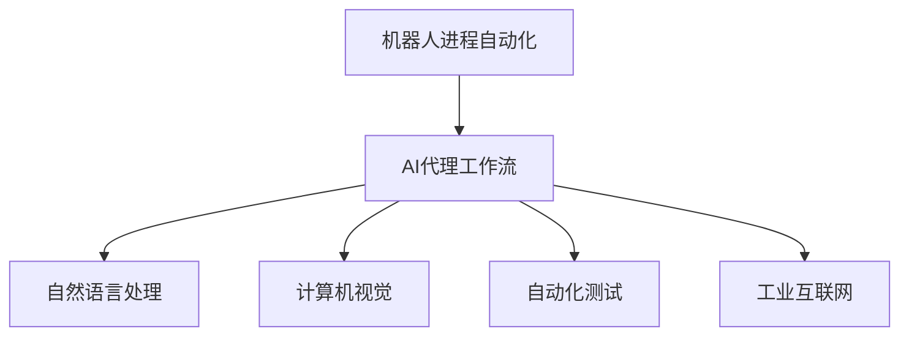
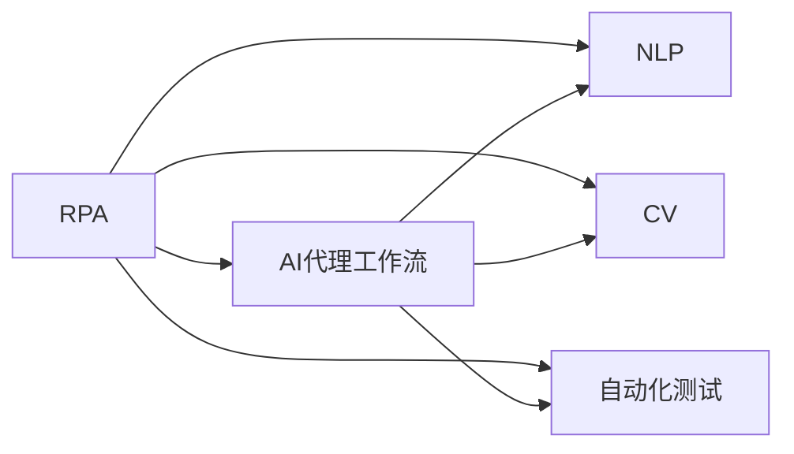
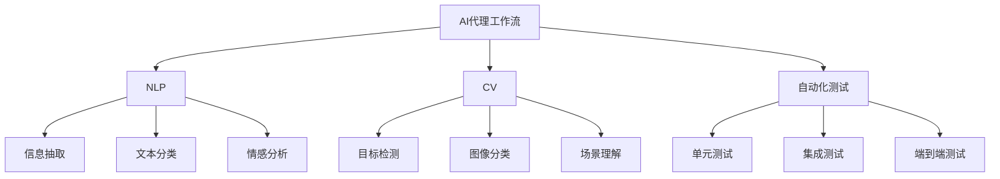
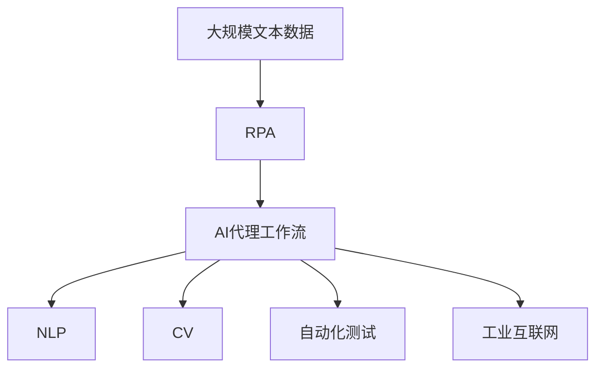

                 

# 机器人进程自动化(RPA)与AI代理工作流的融合

> 关键词：机器人进程自动化(RPA), AI代理工作流, 自然语言处理(NLP), 计算机视觉(CV), 自动化测试, 工业互联网

## 1. 背景介绍

### 1.1 问题由来
随着企业数字化转型的加速，业务流程的自动化已成为提升效率、降低成本的重要手段。传统的规则驱动自动化（Robotic Process Automation, RPA）通过录制和模拟人工操作，可以实现流程的自动化。然而，面对复杂的业务规则和不断变化的业务场景，RPA的灵活性和适应性受到了限制。

与此同时，人工智能（AI）技术的快速发展，特别是自然语言处理（NLP）和计算机视觉（CV）等技术，为解决复杂业务场景的自动化问题提供了新的解决方案。AI代理工作流（AI-Driven Process Automation, AIPA）结合了RPA的执行能力和AI的智能决策，能够在复杂多变的业务环境中，实现更高的自动化程度和灵活性。

### 1.2 问题核心关键点
AI代理工作流结合了RPA和AI的技术优势，能够自动化处理复杂业务任务。其核心在于：
- 自然语言处理（NLP）：理解和处理文本数据，自动从文档中提取结构化信息。
- 计算机视觉（CV）：处理图像和视频数据，自动识别和理解场景内容。
- 自动化测试：测试驱动开发，自动化执行测试用例，验证软件功能。
- 工业互联网：通过物联网（IoT）和云计算等技术，实现数据的实时采集和处理。

这些技术集成在一个统一的工作流管理平台中，能够实现复杂的业务自动化，提升整体效率和质量。

### 1.3 问题研究意义
研究RPA与AI代理工作流的融合方法，对于提升企业业务流程自动化水平，降低人力成本，加速数字化转型具有重要意义：

1. **提升效率**：通过智能决策和自动化执行，大幅度提升业务处理速度和准确性。
2. **降低成本**：减少人工操作，优化资源配置，降低运营成本。
3. **增强灵活性**：结合AI技术，提升对复杂业务场景的适应能力，减少人工干预。
4. **提高质量**：通过智能检测和纠正机制，减少人为错误，提升业务质量。
5. **促进创新**：支持企业快速响应市场变化，推动业务创新。
6. **推动数字化**：通过自动化和智能化技术，加速企业数字化转型的进程。

## 2. 核心概念与联系

### 2.1 核心概念概述

为更好地理解RPA与AI代理工作流的融合方法，本节将介绍几个密切相关的核心概念：

- 机器人进程自动化(RPA)：通过软件机器人自动执行重复性、规则性的业务操作，如数据录入、报表生成、发票处理等。RPA通常使用图形化拖拽界面，易于部署和使用。
- AI代理工作流(AI-Driven Process Automation)：结合AI技术，如NLP、CV、自动化测试等，提升RPA的智能化和自动化水平。AI代理工作流能够自动处理复杂的业务逻辑，适应多变的业务环境。
- 自然语言处理(NLP)：处理和理解自然语言文本，包括文本分类、情感分析、信息抽取等。
- 计算机视觉(CV)：处理和理解图像和视频数据，包括目标检测、图像识别、场景理解等。
- 自动化测试：自动化执行测试用例，验证软件功能，如单元测试、集成测试、端到端测试等。
- 工业互联网：通过IoT和云计算等技术，实现数据的实时采集和处理，支持智能决策和自动化执行。

这些核心概念之间的逻辑关系可以通过以下Mermaid流程图来展示：



这个流程图展示了大语言模型微调过程中各个核心概念之间的关系：

1. RPA提供了执行自动化任务的能力。
2. AI代理工作流结合了NLP、CV、自动化测试等技术，提升了RPA的智能化水平。
3. 工业互联网提供了实时数据和云计算支持，支持智能决策和自动化执行。

### 2.2 概念间的关系

这些核心概念之间存在着紧密的联系，形成了复杂的业务自动化生态系统。下面我们通过几个Mermaid流程图来展示这些概念之间的关系。

#### 2.2.1 RPA与AI代理工作流的融合



这个流程图展示了RPA与AI代理工作流之间的关系。RPA提供了执行自动化任务的能力，而AI代理工作流结合了NLP、CV、自动化测试等技术，提升了RPA的智能化水平。

#### 2.2.2 AI代理工作流的主要技术



这个流程图展示了AI代理工作流中的主要技术。NLP、CV、自动化测试等技术在AI代理工作流中各自发挥作用，通过信息抽取、文本分类、情感分析、目标检测、图像分类、场景理解、单元测试、集成测试、端到端测试等技术手段，提升RPA的智能化水平。

### 2.3 核心概念的整体架构

最后，我们用一个综合的流程图来展示这些核心概念在大语言模型微调过程中的整体架构：



这个综合流程图展示了从预处理到最终执行的整体流程。大规模文本数据通过RPA进行初步处理，然后由AI代理工作流结合NLP、CV、自动化测试等技术，进行进一步的自动化处理，最终通过工业互联网技术实现数据驱动的智能决策和执行。

## 3. 核心算法原理 & 具体操作步骤
### 3.1 算法原理概述

RPA与AI代理工作流的融合方法，其核心在于结合RPA的执行能力和AI的智能决策，实现复杂业务场景的自动化处理。具体来说，AI代理工作流包括以下几个关键步骤：

1. **数据预处理**：收集和整理业务数据，清洗和格式化数据，准备输入AI模型。
2. **文本分析和处理**：使用NLP技术，如信息抽取、文本分类、情感分析等，从文本数据中提取有价值的信息。
3. **图像处理和理解**：使用CV技术，如图像识别、目标检测、场景理解等，从图像和视频数据中提取有价值的信息。
4. **自动化测试和验证**：使用自动化测试技术，自动执行测试用例，验证软件功能。
5. **决策和执行**：根据提取的信息和业务规则，使用AI模型进行智能决策，驱动RPA执行任务。
6. **反馈和优化**：收集任务执行结果，进行反馈和优化，不断提升系统性能。

### 3.2 算法步骤详解

以下是RPA与AI代理工作流的融合算法的详细步骤：

**Step 1: 数据预处理**

数据预处理是融合算法的第一步。具体步骤包括：

1. **数据收集**：从业务系统中收集相关数据，如订单信息、客户信息、财务报表等。
2. **数据清洗**：去除重复、错误、不完整的数据，确保数据质量。
3. **数据标准化**：将数据格式标准化，如统一时间格式、货币单位等。
4. **数据分割**：将数据分割为训练集、验证集和测试集，确保模型在未见过的数据上表现良好。

**Step 2: 文本分析和处理**

文本分析和处理是融合算法的核心步骤之一。具体步骤包括：

1. **文本预处理**：分词、去除停用词、词干提取等文本预处理技术，提高数据质量。
2. **信息抽取**：使用NLP技术，如命名实体识别（NER）、关系抽取等，从文本中提取结构化信息。
3. **文本分类**：使用文本分类技术，将文本数据分类为不同的业务场景，如客户投诉、订单处理、财务报告等。
4. **情感分析**：使用情感分析技术，判断文本数据中的情感倾向，如积极、消极、中性等。

**Step 3: 图像处理和理解**

图像处理和理解是融合算法的另一个核心步骤。具体步骤包括：

1. **图像预处理**：图像去噪、缩放、裁剪等预处理技术，提高图像质量。
2. **目标检测**：使用CV技术，如YOLO、SSD等，识别和定位图像中的目标对象。
3. **图像分类**：使用图像分类技术，将图像数据分类为不同的业务场景，如产品图片、车辆图片等。
4. **场景理解**：使用场景理解技术，判断图像数据中的场景内容，如室内、室外、日间、夜间等。

**Step 4: 自动化测试和验证**

自动化测试和验证是融合算法的关键步骤之一。具体步骤包括：

1. **测试用例设计**：根据业务需求，设计测试用例，覆盖各种业务场景。
2. **自动化测试执行**：使用自动化测试工具，自动执行测试用例，验证软件功能。
3. **测试结果分析**：分析测试结果，判断软件功能的正确性，识别问题和漏洞。
4. **测试用例优化**：根据测试结果，优化测试用例，提高测试覆盖率。

**Step 5: 决策和执行**

决策和执行是融合算法的最后一步。具体步骤包括：

1. **智能决策**：根据提取的信息和业务规则，使用AI模型进行智能决策，如是否批准订单、是否处理投诉等。
2. **任务执行**：根据智能决策，驱动RPA执行任务，如自动填写表单、自动发送邮件、自动生成报表等。
3. **任务反馈**：收集任务执行结果，进行反馈和优化，不断提升系统性能。

### 3.3 算法优缺点

RPA与AI代理工作流的融合方法具有以下优点：

1. **高效性**：结合RPA的执行能力和AI的智能决策，实现复杂业务场景的自动化处理，大幅度提升处理速度。
2. **准确性**：AI模型能够处理复杂的业务逻辑，提高任务执行的准确性，减少人为错误。
3. **灵活性**：AI代理工作流能够适应多变的业务环境，支持动态业务规则的变更。
4. **可扩展性**：RPA和AI技术可以独立部署，支持系统扩展和功能升级。

然而，这种方法也存在一些缺点：

1. **数据依赖性**：依赖高质量的业务数据，数据收集和清洗难度较大。
2. **模型复杂性**：需要构建和训练复杂的AI模型，技术实现难度较大。
3. **技术成本**：需要投入较高的技术资源和资金，构建和维护复杂系统。
4. **集成难度**：需要整合多种技术和系统，集成难度较大。

### 3.4 算法应用领域

RPA与AI代理工作流的融合方法，已在多个领域得到应用，具体包括：

1. **金融行业**：自动化处理银行业务，如客户开户、贷款审批、交易结算等。
2. **制造业**：自动化处理生产流程，如物料管理、质量检测、库存管理等。
3. **物流行业**：自动化处理物流业务，如订单管理、路线规划、仓储管理等。
4. **医疗行业**：自动化处理医疗业务，如病历管理、患者管理、药品管理等。
5. **零售行业**：自动化处理销售业务，如库存管理、客户服务、销售分析等。
6. **政府行业**：自动化处理政府业务，如公文处理、市民服务、案件审批等。

## 4. 数学模型和公式 & 详细讲解  
### 4.1 数学模型构建

RPA与AI代理工作流的融合算法涉及多个步骤，每一步都需要构建相应的数学模型。以下对几个核心步骤的数学模型进行详细讲解。

**Step 1: 数据预处理**

数据预处理的数学模型包括：

1. **数据清洗模型**：使用数据清洗技术，去除重复、错误、不完整的数据。
2. **数据标准化模型**：使用标准化技术，统一数据格式，如时间格式、货币单位等。
3. **数据分割模型**：使用分割技术，将数据分为训练集、验证集和测试集，确保模型泛化能力。

**Step 2: 文本分析和处理**

文本分析和处理的数学模型包括：

1. **文本预处理模型**：使用文本预处理技术，如分词、去除停用词、词干提取等，提高数据质量。
2. **信息抽取模型**：使用NLP技术，如命名实体识别（NER）、关系抽取等，从文本中提取结构化信息。
3. **文本分类模型**：使用文本分类技术，将文本数据分类为不同的业务场景。
4. **情感分析模型**：使用情感分析技术，判断文本数据中的情感倾向。

**Step 3: 图像处理和理解**

图像处理和理解的数学模型包括：

1. **图像预处理模型**：使用图像预处理技术，如去噪、缩放、裁剪等，提高图像质量。
2. **目标检测模型**：使用CV技术，如YOLO、SSD等，识别和定位图像中的目标对象。
3. **图像分类模型**：使用图像分类技术，将图像数据分类为不同的业务场景。
4. **场景理解模型**：使用场景理解技术，判断图像数据中的场景内容。

**Step 4: 自动化测试和验证**

自动化测试和验证的数学模型包括：

1. **测试用例设计模型**：根据业务需求，设计测试用例，覆盖各种业务场景。
2. **自动化测试执行模型**：使用自动化测试工具，自动执行测试用例，验证软件功能。
3. **测试结果分析模型**：分析测试结果，判断软件功能的正确性，识别问题和漏洞。
4. **测试用例优化模型**：根据测试结果，优化测试用例，提高测试覆盖率。

**Step 5: 决策和执行**

决策和执行的数学模型包括：

1. **智能决策模型**：根据提取的信息和业务规则，使用AI模型进行智能决策。
2. **任务执行模型**：根据智能决策，驱动RPA执行任务。
3. **任务反馈模型**：收集任务执行结果，进行反馈和优化，不断提升系统性能。

### 4.2 公式推导过程

以下是几个核心步骤的数学公式推导：

**数据预处理**

1. **数据清洗模型**：
   $$
   D_{clean} = \{d | d \in D, \text{isClean}(d) = \text{True}\}
   $$
   其中，$D$为原始数据集，$D_{clean}$为清洗后的数据集，$\text{isClean}(d)$为数据清洗函数。

2. **数据标准化模型**：
   $$
   D_{standard} = \{d | d \in D, \text{normalize}(d) = \text{True}\}
   $$
   其中，$\text{normalize}(d)$为数据标准化函数。

3. **数据分割模型**：
   $$
   D_{train} = \{d | d \in D_{clean}, \text{isTrain}(d) = \text{True}\}
   $$
   $$
   D_{valid} = \{d | d \in D_{clean}, \text{isTrain}(d) = \text{False}, \text{isValidation}(d) = \text{True}\}
   $$
   $$
   D_{test} = \{d | d \in D_{clean}, \text{isTrain}(d) = \text{False}, \text{isValidation}(d) = \text{False}\}
   $$
   其中，$\text{isTrain}(d)$、$\text{isValidation}(d)$、$\text{isTest}(d)$分别为数据是否为训练集、验证集和测试集的判断函数。

**文本分析和处理**

1. **文本预处理模型**：
   $$
   T_{processed} = \{w | w = \text{process}(t), t \in T\}
   $$
   其中，$T$为原始文本集，$T_{processed}$为预处理后的文本集，$\text{process}(t)$为文本预处理函数。

2. **信息抽取模型**：
   $$
   E = \{(e, t) | t \in T_{processed}, e = \text{extract}(t)\}
   $$
   其中，$e$为提取的信息，$t$为对应的文本。

3. **文本分类模型**：
   $$
   C = \{(c, t) | t \in T_{processed}, c = \text{classify}(t)\}
   $$
   其中，$c$为文本的分类标签，$t$为对应的文本。

4. **情感分析模型**：
   $$
   S = \{(s, t) | t \in T_{processed}, s = \text{sentiment}(t)\}
   $$
   其中，$s$为文本的情感标签，$t$为对应的文本。

**图像处理和理解**

1. **图像预处理模型**：
   $$
   I_{processed} = \{i | i = \text{process}(i), i \in I\}
   $$
   其中，$I$为原始图像集，$I_{processed}$为预处理后的图像集，$\text{process}(i)$为图像预处理函数。

2. **目标检测模型**：
   $$
   O = \{(o, i) | i \in I_{processed}, o = \text{detect}(i)\}
   $$
   其中，$o$为目标对象，$i$为对应的图像。

3. **图像分类模型**：
   $$
   C = \{(c, i) | i \in I_{processed}, c = \text{classify}(i)\}
   $$
   其中，$c$为图像的分类标签，$i$为对应的图像。

4. **场景理解模型**：
   $$
   S = \{(s, i) | i \in I_{processed}, s = \text{scene}(i)\}
   $$
   其中，$s$为场景标签，$i$为对应的图像。

**自动化测试和验证**

1. **测试用例设计模型**：
   $$
   U = \{(u, t) | t \in T_{processed}, u = \text{generate}(t)\}
   $$
   其中，$u$为测试用例，$t$为对应的文本。

2. **自动化测试执行模型**：
   $$
   R = \{(r, u) | u \in U, r = \text{execute}(u)\}
   $$
   其中，$r$为测试结果，$u$为对应的测试用例。

3. **测试结果分析模型**：
   $$
   A = \{(a, r) | r \in R, a = \text{analyze}(r)\}
   $$
   其中，$a$为测试结果的分析结果，$r$为对应的测试结果。

4. **测试用例优化模型**：
   $$
   U_{optimized} = \{(u | \text{optimize}(u) = \text{True}, u \in U\}
   $$
   其中，$\text{optimize}(u)$为测试用例优化函数。

**决策和执行**

1. **智能决策模型**：
   $$
   D = \{(d, t) | t \in T_{processed}, d = \text{decide}(t)\}
   $$
   其中，$d$为智能决策结果，$t$为对应的文本。

2. **任务执行模型**：
   $$
   E = \{(e, d) | d \in D, e = \text{execute}(d)\}
   $$
   其中，$e$为执行结果，$d$为对应的智能决策结果。

3. **任务反馈模型**：
   $$
   F = \{(f, e) | e \in E, f = \text{feedback}(e)\}
   $$
   其中，$f$为反馈结果，$e$为对应的执行结果。

### 4.3 案例分析与讲解

为了更好地理解RPA与AI代理工作流的融合方法，我们以一个具体案例进行详细讲解。

**案例：自动化处理发票处理**

假设某公司需要自动化处理大量发票，包括发票扫描、数据提取、校验、审核和生成报表等步骤。

1. **数据预处理**：
   - 收集和整理电子发票数据，清洗和格式化数据，确保数据质量。
   - 将数据标准化，统一时间格式和货币单位。
   - 将数据分割为训练集、验证集和测试集，确保模型泛化能力。

2. **文本分析和处理**：
   - 使用OCR技术，将纸质发票扫描成电子文档。
   - 使用NLP技术，从电子文档中提取发票信息，如发票号、日期、金额、供应商等。
   - 使用情感分析技术，判断发票的合法性和真实性，判断是否存在异常情况。

3. **图像处理和理解**：
   - 使用CV技术，对发票进行预处理，如去噪、缩放、裁剪等。
   - 使用目标检测技术，识别和定位发票上的关键信息。
   - 使用图像分类技术，判断发票的类别和类型。

4. **自动化测试和验证**：
   - 设计测试用例，覆盖各种发票类型和异常情况。
   - 使用自动化测试工具，自动执行测试用例，验证发票数据和信息是否正确。
   - 分析测试结果，判断发票数据的正确性和合法性，识别和修正错误数据。

5. **决策和执行**：
   - 使用AI模型，根据发票信息进行智能决策，判断发票是否合法。
   - 驱动RPA执行任务，自动填写发票信息、校验发票数据、审核发票合法性、生成报表等。
   - 收集执行结果，进行反馈和优化，不断提升系统性能。

## 5. 项目实践：代码实例和详细解释说明
### 5.1 开发环境搭建

在进行RPA与AI代理工作流的融合实践前，我们需要准备好开发环境。以下是使用Python进行PyTorch开发的环境配置流程：

1. 安装Anaconda：从官网下载并安装Anaconda，用于创建独立的Python环境。

2. 创建并激活虚拟环境：
```bash
conda create -n rpaai-env python=3.8 
conda activate rpaai-env
```

3. 安装PyTorch：根据CUDA版本，从官网获取对应的安装命令。例如：
```bash
conda install pytorch torchvision torchaudio cudatoolkit=11.1 -c pytorch -c conda-forge
```

4. 安装Transformer库：
```bash
pip install transformers
```

5. 安装各类工具包：
```bash
pip install numpy pandas scikit-learn matplotlib tqdm jupyter notebook ipython
```

完成上述步骤后，即可在`rpaai-env`环境中开始RPA与AI代理工作流的融合实践。

### 5.2 源代码详细实现

这里我们以处理发票处理任务为例，给出使用Transformers库对BERT模型进行微调的PyTorch代码实现。

首先，定义发票处理任务的数据处理函数：

```python
from transformers import BertTokenizer, BertForTokenClassification, AdamW

class InvoiceData(Dataset):
    def __init__(self, invoices, labels, tokenizer, max_len=128):
        self.invoices = invoices
        self.labels = labels
        self.tokenizer = tokenizer
        self.max_len = max_len
        
    def __len__(self):
        return len(self.invoices)
    
    def __getitem__(self, item):
        invoice = self.invoices[item]
        label = self.labels[item]
        
        encoding = self.tokenizer(invoice, return_tensors='pt', max_length=self.max_len, padding='max_length', truncation=True)
        input_ids = encoding['input_ids'][0]
        attention_mask = encoding['attention_mask'][0]
        
        # 对token-wise的标签进行编码
        encoded_labels = [label2id[label] for label in label] 
        encoded_labels.extend([label2id['O']] * (self.max_len - len(encoded_labels)))
        labels = torch.tensor(encoded_labels, dtype=torch.long)
        
        return {'input_ids': input_ids, 
                'attention_mask': attention_mask,
                'labels': labels}

# 标签与id的映射
label2id = {'O': 0, '合法': 1}
id2label = {v: k for k, v in label2id.items()}

# 创建dataset
tokenizer = BertTokenizer.from_pretrained('bert-base-cased')

train_dataset = InvoiceData(train_invoices, train_labels, tokenizer)
dev_dataset = InvoiceData(dev_invoices, dev_labels, tokenizer)
test_dataset = InvoiceData(test_invoices, test_labels, tokenizer)
```

然后，定义模型和优化器：

```python
model = BertForTokenClassification.from_pretrained('bert-base-cased', num_labels=len(label2id))

optimizer = AdamW

