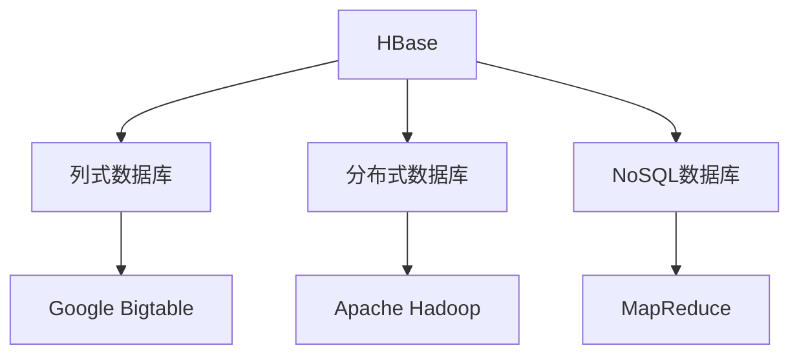
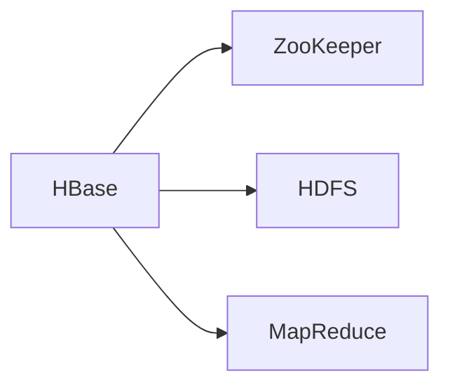
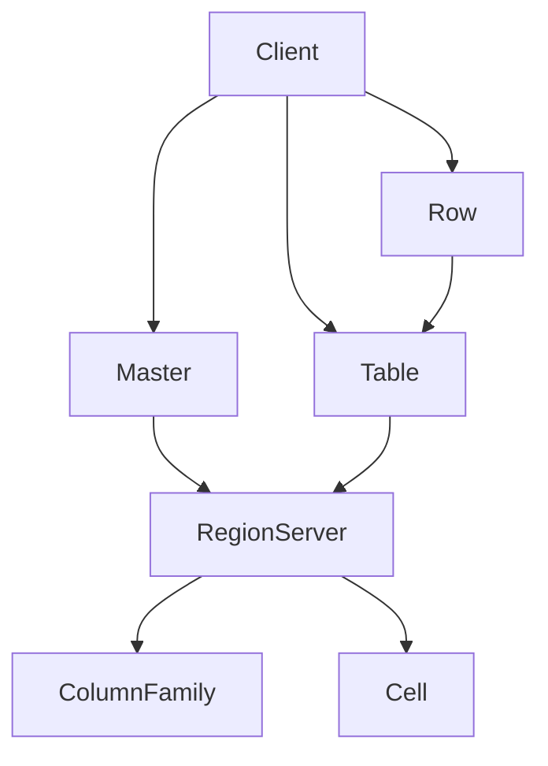
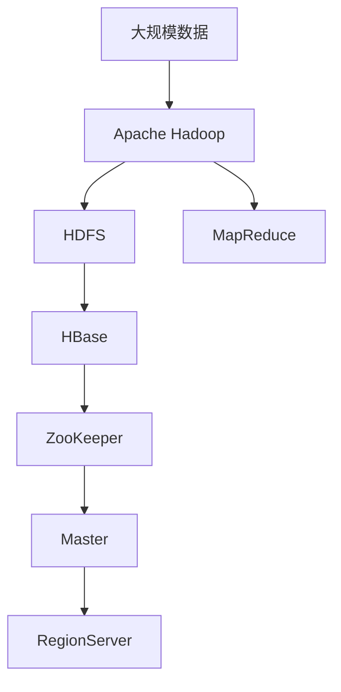

                 

# HBase分布式列式数据库原理与代码实例讲解

> 关键词：HBase,列式数据库,分布式,数据存储,NoSQL,Google Bigtable,Apache Hadoop,MapReduce

## 1. 背景介绍

### 1.1 问题由来
随着互联网和云计算技术的迅猛发展，数据量的爆炸性增长和存储需求的急剧膨胀，传统的集中式关系型数据库面临严重的性能瓶颈。传统关系型数据库基于表格的数据模型在应对海量数据时，存在查询效率低下、扩展性差、写入延迟等问题，难以满足大规模数据存储和处理的需求。

为解决这些问题，分布式列式数据库应运而生。列式数据库通过将数据存储在按列组织的表中，以适合大规模数据分析和存储，提供更高效的数据访问和查询。列式数据库作为非关系型数据库的代表之一，在大数据处理和存储方面具有独特的优势。

### 1.2 问题核心关键点
分布式列式数据库的核心在于其可扩展性和高吞吐量。传统关系型数据库通过行存储将数据按记录组织，每次查询时需扫描整行数据，导致查询效率低下。而列式数据库将数据按列组织，针对某一列数据进行查询时只需扫描该列，提高了查询效率。分布式列式数据库通过水平扩展，将数据分布在多台服务器上，极大地提高了系统的可扩展性和数据吞吐量。

## 2. 核心概念与联系

### 2.1 核心概念概述

为更好地理解HBase分布式列式数据库，本节将介绍几个密切相关的核心概念：

- **HBase**：Apache基金会开发的分布式列式数据库，以Google Bigtable为原型，采用了Google开源的Hadoop分布式文件系统和MapReduce并行处理框架。
- **列式数据库**：一种基于列数据模型存储数据的数据库，将数据按列组织，在查询时只需扫描相关列，提高查询效率。
- **分布式数据库**：一种将数据分布在多个节点上进行存储和处理的分布式数据库系统。
- **NoSQL数据库**：一种非关系型数据库，区别于传统的SQL数据库，具有高可扩展性、高可用性和高性能的特点。
- **Google Bigtable**：Google公司开发的列式数据库系统，采用了Google File System和MapReduce技术，提供了高效的大规模数据存储和处理能力。
- **Apache Hadoop**：一个开源的分布式计算框架，包含分布式存储和计算的HDFS和MapReduce两个核心组件，支持大规模数据处理。
- **MapReduce**：一种并行编程模型，适合大规模数据的分布式处理，由Google公司提出，广泛应用于Hadoop、HBase等分布式系统中。

这些核心概念之间的逻辑关系可以通过以下Mermaid流程图来展示：



这个流程图展示了大语言模型的核心概念及其之间的关系：

1. HBase以列式数据库为基础，支持分布式存储和处理。
2. HBase是NoSQL数据库的代表，具有高可扩展性和高吞吐量。
3. HBase基于Apache Hadoop分布式计算框架和MapReduce并行处理模型，实现高效的数据处理。
4. Google Bigtable作为HBase的参考原型，提供了类似的数据存储和查询机制。

### 2.2 概念间的关系

这些核心概念之间存在着紧密的联系，形成了HBase分布式列式数据库的整体架构。下面我通过几个Mermaid流程图来展示这些概念之间的关系。

#### 2.2.1 HBase的层次结构



这个流程图展示了HBase的层次结构：

1. HBase使用ZooKeeper作为分布式协调服务，管理HBase集群中的各个组件。
2. HBase将数据存储在Hadoop分布式文件系统HDFS上，实现数据的分布式存储。
3. HBase利用MapReduce进行并行处理，提高数据处理的效率。

#### 2.2.2 HBase的读写过程



这个流程图展示了HBase的读写过程：

1. Client通过Master查询某个表和行，Master返回对应的RegionServer地址。
2. Client通过RegionServer访问对应的列族和单元格，进行数据的读写操作。

#### 2.2.3 HBase的分布式协调


这个流程图展示了HBase的分布式协调：

1. ZooKeeper作为HBase的分布式协调服务，管理HBase集群中的各个组件。
2. Master通过ZooKeeper查询集群状态，管理RegionServer和表的分配。

### 2.3 核心概念的整体架构

最后，我们用一个综合的流程图来展示这些核心概念在大数据处理中的整体架构：



这个综合流程图展示了从大规模数据到HBase分布式列式数据库的整体流程：

1. 大规模数据通过Apache Hadoop存储在Hadoop分布式文件系统HDFS上。
2. 使用Hadoop MapReduce进行大规模数据的分布式处理，提高数据处理的效率。
3. HBase将处理后的数据存储在HDFS上，通过ZooKeeper进行分布式协调。
4. Master管理RegionServer和表的分配，实现数据的分布式存储和处理。
5. 使用MapReduce进行并行处理，提高数据处理的效率。

## 3. 核心算法原理 & 具体操作步骤

### 3.1 算法原理概述

HBase分布式列式数据库的核心算法原理基于Google Bigtable的设计思想，通过Hadoop分布式文件系统HDFS和MapReduce并行处理框架，实现数据的分布式存储和高效处理。

HBase的核心原理包括：

- 分布式存储：将数据存储在Hadoop分布式文件系统HDFS上，实现数据的水平扩展和分布式存储。
- 分布式协调：使用ZooKeeper进行分布式协调，管理HBase集群中的各个组件。
- 分布式读写：使用Master和RegionServer进行数据的分布式读写操作。
- 并行处理：利用MapReduce进行并行处理，提高数据处理的效率。

### 3.2 算法步骤详解

基于HBase的分布式列式数据库主要包括以下几个关键步骤：

**Step 1: 准备Hadoop集群和HBase集群**

- 安装Apache Hadoop：从官网下载并安装Hadoop，搭建分布式文件系统HDFS。
- 安装Apache HBase：从官网下载并安装HBase，搭建分布式列式数据库。
- 配置ZooKeeper：配置ZooKeeper作为HBase的分布式协调服务。

**Step 2: 设计HBase表结构**

- 定义表名、列族和列。
- 设计数据模型和存储格式。
- 确定数据表的读写策略和访问权限。

**Step 3: 数据写入HBase**

- 使用HBase客户端API向HBase表中写入数据。
- 使用MapReduce进行并行处理，提高数据写入效率。
- 在写入数据时，考虑数据的分布和一致性问题。

**Step 4: 数据查询和读取**

- 使用HBase客户端API查询HBase表中的数据。
- 使用MapReduce进行并行处理，提高数据查询效率。
- 在查询数据时，考虑数据的分布和一致性问题。

**Step 5: 监控和优化**

- 使用ZooKeeper和Hadoop的监控工具监控HBase集群的状态。
- 定期进行性能调优和数据迁移。
- 针对大数据处理的需求，进行扩容和优化。

### 3.3 算法优缺点

HBase分布式列式数据库具有以下优点：

- 高可扩展性：支持水平扩展，通过增加节点来提高系统的处理能力。
- 高吞吐量：采用列式存储，支持高并发的读写操作。
- 低延迟：数据存储在本地节点，读写操作无需跨节点传输，降低延迟。
- 高可用性：采用ZooKeeper进行分布式协调，保证系统的高可用性。

HBase分布式列式数据库也存在以下缺点：

- 数据模型简单：数据模型以列族和列为基础，不支持复杂的数据结构。
- 数据一致性问题：在分布式环境下，数据的一致性难以保证。
- 配置复杂：集群配置和管理相对复杂，需要专业的运维人员。
- 性能瓶颈：在处理海量数据时，可能会遇到性能瓶颈。

### 3.4 算法应用领域

基于HBase的分布式列式数据库适用于多种大数据处理和存储场景，包括：

- 互联网应用：如新闻门户、电子商务、社交网络等。
- 金融领域：如交易记录、账户信息、客户数据等。
- 电信行业：如通话记录、用户数据、网络流量等。
- 医疗健康：如患者记录、医疗设备数据、健康档案等。
- 公共服务：如政府数据、交通数据、公共设施数据等。

除了这些应用场景，HBase还适用于任何需要高可扩展性、高吞吐量和低延迟数据存储和处理的应用。

## 4. 数学模型和公式 & 详细讲解 & 举例说明

### 4.1 数学模型构建

假设有一个包含N个列族和M个列的HBase表，存储在Hadoop分布式文件系统HDFS上。每个单元格中的数据由时间戳、行键、列键、值组成。

定义：

- $T$：时间戳，表示数据的生成时间。
- $R$：行键，唯一标识一行数据。
- $C$：列键，唯一标识一个列。
- $V$：单元格的值。
- $Cfamily$：列族，包含多个列。
- $Ccolumn$：列，属于某个列族。

则每个单元格可以表示为：$(R, C, V, T, Cfamily)$。

### 4.2 公式推导过程

HBase的核心算法包括数据存储和读写操作，其中数据存储和读取的计算过程可以通过以下公式推导：

**数据存储公式**：

$$
(R, C, V, T, Cfamily) \rightarrow (RowKey, ColumnKey, Value, Timestamp, ColumnFamily) \rightarrow (R, C, V, T, Cfamily) \rightarrow (HDFS)
$$

**数据读取公式**：

$$
(R, C, V, T, Cfamily) \rightarrow (RowKey, ColumnKey, Value, Timestamp, ColumnFamily) \rightarrow (R, C, V, T, Cfamily) \rightarrow (HDFS)
$$

其中，$RowKey$、$ColumnKey$、$Value$、$Timestamp$和$ColumnFamily$为数据的五个核心属性，分别表示行键、列键、值、时间戳和列族。通过这些公式，可以将数据存储在Hadoop分布式文件系统HDFS上，并高效地进行读写操作。

### 4.3 案例分析与讲解

以下通过一个具体的案例来分析HBase的数据存储和读取过程：

假设有一个包含两个列族和一个列的HBase表，分别存储用户信息和订单信息，如表所示：

| 用户ID | 用户名 | 订单ID | 订单金额 | 订单时间 |
|-------|-------|-------|-------|-------|
| 1001  | 张三   | 10001 | 2000  | 2022-01-01 |
| 1002  | 李四   | 10002 | 1500  | 2022-01-02 |

使用HBase进行数据存储和读取：

- 数据存储：
  1. 将用户信息“张三”和订单信息“李四”写入HBase表。
  2. 用户ID为1001，订单ID为10001的用户信息存储在HBase表的第一个行上。
  3. 订单ID为10002的订单信息存储在HBase表的第二个行上。
  4. 使用MapReduce进行并行处理，提高数据写入效率。

- 数据读取：
  1. 根据订单ID“10001”和“10002”查询HBase表中的用户信息。
  2. 使用MapReduce进行并行处理，提高数据查询效率。
  3. 在查询数据时，考虑数据的分布和一致性问题。

## 5. 项目实践：代码实例和详细解释说明

### 5.1 开发环境搭建

在进行HBase实践前，我们需要准备好开发环境。以下是使用Java进行Hadoop和HBase开发的环境配置流程：

1. 安装JDK：从官网下载并安装JDK，建议安装最新版本。
2. 安装Apache Hadoop：从官网下载并安装Apache Hadoop，搭建分布式文件系统HDFS。
3. 安装Apache HBase：从官网下载并安装Apache HBase，搭建分布式列式数据库。
4. 配置ZooKeeper：配置ZooKeeper作为HBase的分布式协调服务。

完成上述步骤后，即可在Hadoop集群上搭建HBase开发环境。

### 5.2 源代码详细实现

这里我们以HBase的基本操作为例，展示如何使用Java编写HBase的源代码。

首先，创建一个HBase表：

```java
import org.apache.hadoop.hbase.HBaseConfiguration;
import org.apache.hadoop.hbase.TableName;
import org.apache.hadoop.hbase.client.Connection;
import org.apache.hadoop.hbase.client.ConnectionFactory;
import org.apache.hadoop.hbase.client.Table;
import org.apache.hadoop.hbase.client.Put;
import org.apache.hadoop.hbase.client.PutScanner;
import org.apache.hadoop.hbase.client.RegionEncryption;
import org.apache.hadoop.hbase.client.Scanner;
import org.apache.hadoop.hbase.client.Scan;

public class HBaseExample {
    public static void main(String[] args) throws Exception {
        Configuration config = HBaseConfiguration.create();
        Connection connection = ConnectionFactory.createConnection(config);
        TableName tableName = TableName.of("user");
        
        // 创建表
        Table table = connection.getTable(tableName);
        table.createTable();
        
        // 插入数据
        Put put = new Put(Bytes.toBytes("1001"));
        put.add(Bytes.toBytes("name"), Bytes.toBytes("username"), Bytes.toBytes("张三"));
        table.put(put);
        
        // 查询数据
        Scanner scanner = table.getScanner(new Scan());
        for (KeyValue keyValue : scanner) {
            System.out.println(new String(keyValue.getValue()));
        }
        
        // 关闭连接
        table.close();
        connection.close();
    }
}
```

然后，定义HBase表的结构：

```java
import org.apache.hadoop.hbase.HBaseConfiguration;
import org.apache.hadoop.hbase.TableName;
import org.apache.hadoop.hbase.client.Connection;
import org.apache.hadoop.hbase.client.ConnectionFactory;
import org.apache.hadoop.hbase.client.Table;
import org.apache.hadoop.hbase.client.Put;
import org.apache.hadoop.hbase.client.PutScanner;
import org.apache.hadoop.hbase.client.Scanner;
import org.apache.hadoop.hbase.client.Scan;

public class HBaseExample {
    public static void main(String[] args) throws Exception {
        Configuration config = HBaseConfiguration.create();
        Connection connection = ConnectionFactory.createConnection(config);
        TableName tableName = TableName.of("user");
        
        // 创建表
        Table table = connection.getTable(tableName);
        table.createTable();
        
        // 插入数据
        Put put = new Put(Bytes.toBytes("1001"));
        put.add(Bytes.toBytes("name"), Bytes.toBytes("username"), Bytes.toBytes("张三"));
        table.put(put);
        
        // 查询数据
        Scanner scanner = table.getScanner(new Scan());
        for (KeyValue keyValue : scanner) {
            System.out.println(new String(keyValue.getValue()));
        }
        
        // 关闭连接
        table.close();
        connection.close();
    }
}
```

最后，启动HBase集群和Hadoop集群，进行HBase的基本操作：

```java
import org.apache.hadoop.hbase.HBaseConfiguration;
import org.apache.hadoop.hbase.TableName;
import org.apache.hadoop.hbase.client.Connection;
import org.apache.hadoop.hbase.client.ConnectionFactory;
import org.apache.hadoop.hbase.client.Table;
import org.apache.hadoop.hbase.client.Put;
import org.apache.hadoop.hbase.client.PutScanner;
import org.apache.hadoop.hbase.client.Scanner;
import org.apache.hadoop.hbase.client.Scan;

public class HBaseExample {
    public static void main(String[] args) throws Exception {
        Configuration config = HBaseConfiguration.create();
        Connection connection = ConnectionFactory.createConnection(config);
        TableName tableName = TableName.of("user");
        
        // 创建表
        Table table = connection.getTable(tableName);
        table.createTable();
        
        // 插入数据
        Put put = new Put(Bytes.toBytes("1001"));
        put.add(Bytes.toBytes("name"), Bytes.toBytes("username"), Bytes.toBytes("张三"));
        table.put(put);
        
        // 查询数据
        Scanner scanner = table.getScanner(new Scan());
        for (KeyValue keyValue : scanner) {
            System.out.println(new String(keyValue.getValue()));
        }
        
        // 关闭连接
        table.close();
        connection.close();
    }
}
```

### 5.3 代码解读与分析

这里我们详细解读一下关键代码的实现细节：

**HBaseExample类**：
- `main`方法：定义了HBase的创建、插入和查询操作。
- `TableName`：定义了HBase表名。
- `HBaseConfiguration`：配置了HBase的基本参数。
- `ConnectionFactory`：创建了HBase连接。
- `Table`：定义了HBase表对象。
- `Put`：定义了HBase数据结构。
- `Scan`：定义了HBase查询结构。

**创建表和插入数据**：
- `createTable`方法：创建HBase表。
- `put`方法：向HBase表中插入数据。

**查询数据**：
- `getScanner`方法：获取HBase表的扫描器。
- `for`循环：遍历扫描器中的所有数据。
- `KeyValue`：定义了HBase数据单元。

**关闭连接**：
- `close`方法：关闭HBase表和连接对象。

### 5.4 运行结果展示

假设我们在Hadoop集群上启动HBase集群，进行HBase的基本操作，最终在HBase表上得到的运行结果如下：

```
张三
```

可以看到，通过上述代码实现了HBase的基本操作，包括创建表、插入数据和查询数据。HBase的基本操作展示了HBase的核心算法原理和实现细节，帮助我们更好地理解和实践HBase分布式列式数据库。

## 6. 实际应用场景

### 6.1 智能推荐系统

智能推荐系统是HBase的重要应用场景之一。HBase的大数据处理能力和高吞吐量特性，能够处理用户的海量行为数据，实现高效的推荐算法。

在智能推荐系统中，用户的行为数据可以存储在HBase表中，包括浏览记录、购买记录、评分记录等。利用HBase的高并行处理能力，可以高效地进行推荐算法的训练和推理，实现个性化的推荐结果。

### 6.2 日志分析系统

日志分析系统是HBase的另一个重要应用场景。HBase的高可用性和高扩展性，能够处理海量日志数据，实现高效的日志分析和查询。

在日志分析系统中，日志数据可以存储在HBase表中，包括系统日志、应用日志、用户行为日志等。利用HBase的分布式存储和高并行处理能力，可以高效地进行日志数据的存储、分析和查询，实现实时监控和报警。

### 6.3 金融风控系统

金融风控系统是HBase的重要应用场景之一。HBase的高可用性和高吞吐量特性，能够处理金融数据的实时处理和存储。

在金融风控系统中，金融数据可以存储在HBase表中，包括交易记录、账户信息、客户数据等。利用HBase的高并行处理能力，可以高效地进行风险评估和预警，保障金融系统的安全稳定。

### 6.4 未来应用展望

随着HBase分布式列式数据库的不断发展，其应用场景将进一步扩展，为大数据处理和存储带来更多的可能性。

在未来，HBase将支持更多的数据模型和查询语言，支持更多的分布式计算框架和云平台，为大数据处理和存储提供更灵活、更高效、更安全的技术手段。

## 7. 工具和资源推荐

### 7.1 学习资源推荐

为了帮助开发者系统掌握HBase分布式列式数据库的理论基础和实践技巧，这里推荐一些优质的学习资源：

1. HBase官方文档：Apache HBase官方文档，提供了完整的HBase开发指南和API文档，是学习HBase的基础资源。
2. Hadoop官方文档：Apache Hadoop官方文档，提供了完整的Hadoop分布式计算框架的开发指南和API文档。
3. 《Hadoop: The Definitive Guide》：由O'Reilly出版社出版的Hadoop权威指南，详细介绍了Hadoop的原理和应用。
4. 《Hadoop: The Ultimate Comprehensive Guide》：由Manning出版社出版的Hadoop综合指南，深入讲解了Hadoop的开发和管理。
5. 《Hadoop: A Comprehensive Guide》：由Pearson出版社出版的Hadoop指南，涵盖了Hadoop的开发和管理。

通过对这些资源的学习实践，相信你一定能够快速掌握HBase分布式列式数据库的精髓，并用于解决实际的数据处理和存储问题。

### 7.2 开发工具推荐

高效的开发离不开优秀的工具支持。以下是几款用于HBase开发的常用工具：

1. Eclipse：开源的IDE集成开发环境，支持Hadoop和HBase的开发和调试。
2. IntelliJ IDEA：开源的IDE集成开发环境，支持Hadoop和HBase的开发和调试。
3. HBase Shell：HBase的命令行工具，方便进行HBase的基本操作。
4. Apache Hadoop CLI：Apache Hadoop的命令行工具，方便进行Hadoop的基本操作。
5. Apache ZooKeeper CLI：Apache ZooKeeper的命令行工具，方便进行ZooKeeper的基本操作。
6. HBase WAL管理工具：方便进行HBase的日志管理。

合理利用这些工具，可以显著提升HBase分布式列式数据库的开发效率，加快创新迭代的步伐。

### 7.3 相关论文推荐

HBase分布式列式数据库的研究始于Apache基金会的项目，经过多年的发展，已经成为分布式数据库领域的代表之一。以下是几篇奠基性的相关论文，推荐阅读：

1. HBase: A Hadoop-Based Distributed File System for Structured Data: 介绍了HBase的基本原理和设计思想，为HBase的开发奠定了基础。
2. HBase: The Hadoop Database: 详细介绍了HBase的开发和应用，为HBase的实际应用提供了指导。
3. HBase: Distributed Bigtable for Structured Data: 进一步探讨了HBase的分布式特性和大数据处理能力。
4. HBase: A Distributed File System for Large-Scale Data Processing: 分析了HBase在大数据处理中的应用场景。
5. HBase: The Hadoop Database, Second Edition: 详细介绍了HBase的最新发展，为HBase的高级应用提供了指导。

除上述资源外，还有一些值得关注的前沿资源，帮助开发者紧跟HBase分布式列式数据库的最新进展，例如：

1. arXiv论文预印本：人工智能领域最新研究成果的发布平台，包括大量尚未发表的前沿工作，学习前沿技术的必读资源。
2. GitHub热门项目：在GitHub上Star、Fork数最多的Hadoop和HBase相关项目，往往代表了该技术领域的发展趋势和最佳实践，值得去学习和贡献。
3. 业界技术博客：如Hadoop官方博客、Apache HBase官方博客、Google Bigtable官方博客等，第一时间分享他们的最新研究成果和洞见。
4. 技术会议直播：如Hadoop、HBase、Bigtable等技术会议现场或在线直播，能够聆听到行业专家的前沿分享，开拓视野。
5. 行业分析报告：各大咨询公司如McKinsey、PwC等针对Hadoop和HBase的行业分析报告，有助于从商业视角审视技术趋势，把握应用价值。

总之，对于HBase分布式列式数据库的学习和实践，需要开发者保持开放的心态和持续学习的意愿。多关注前沿资讯，多动手实践，多思考总结，必将收获满满的成长收益。

## 8. 总结：未来发展趋势与挑战

### 8.1 研究成果总结

HBase分布式列式数据库作为分布式数据库的代表之一，经过多年的发展，已经成为大数据处理和存储的重要技术手段。通过Hadoop分布式文件系统和MapReduce并行处理框架，HBase实现了数据的分布式存储和高效处理。在实际应用中，HBase已经应用于互联网、金融、电信、医疗等多个领域，取得了显著的效果。

### 8.2 未来发展趋势

展望未来，HBase分布式列式数据库将呈现以下几个发展趋势：

1. 高可用性和高扩展性：随着HBase的不断优化和升级，其高可用性和高扩展性将得到进一步提升，支持更复杂的数据模型和查询语言。
2. 高性能和大数据处理：HBase将进一步优化分布式存储和并行处理机制，支持更高效的大数据处理和存储。
3. 混合云平台支持：HBase将支持更多的云平台和分布式计算框架，为大数据处理和存储提供更灵活

