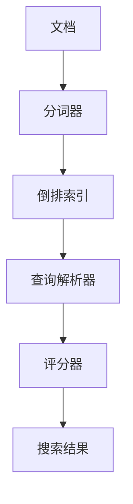

                 

## 1. 背景介绍

### 1.1 问题由来
搜索引擎技术是互联网时代不可或缺的基础设施，用户通过查询关键词，可以快速获取所需信息。然而，随着互联网数据量的爆炸式增长，传统搜索引擎的索引和检索效率已无法满足需求。Lucene作为一款开源的搜索引擎库，通过其高性能的倒排索引和高效的全文检索算法，有效解决了这一问题。

### 1.2 问题核心关键点
Lucene的核心在于倒排索引(Inverted Index)和全文检索(Full-Text Search)。倒排索引是一种数据结构，将每个单词映射到一个包含所有包含该单词的文档的列表，使得查找包含特定单词的文档变得非常高效。全文检索则通过倒排索引进行关键词匹配，输出包含关键词的文档列表。

Lucene除了提供基本的检索功能外，还支持复杂查询、多语言处理、高并发的分布式检索等功能。其基于Java语言，跨平台性好，广泛应用于企业级搜索引擎系统中。

### 1.3 问题研究意义
研究Lucene原理与代码实例，对于理解搜索引擎的底层工作原理，优化搜索引擎的性能和扩展性，以及开发高效的全文检索系统具有重要意义。Lucene的核心技术，如倒排索引、全文检索算法、多字段索引等，对整个搜索领域都有深远的影响。

## 2. 核心概念与联系

### 2.1 核心概念概述

为了更好地理解Lucene的工作原理，本节将介绍几个关键概念：

- 倒排索引(Inverted Index)：将每个单词映射到一个包含所有包含该单词的文档的列表。是Lucene实现全文检索的核心数据结构。
- 全文检索(Full-Text Search)：通过倒排索引对文档进行关键词匹配，输出包含关键词的文档列表。是Lucene提供的主要功能之一。
- 分词器(Tokenize)：将文本分割成单词或词组，是构建倒排索引的前提。
- 查询解析器(Query Parser)：解析用户输入的查询语句，将其转换为 Lucene 可以理解的形式。
- 评分器(Score)：根据查询和文档的相关性，计算文档的相关得分，排序并返回结果。

这些核心概念通过特定的流程和机制相互关联，构成Lucene的基本工作框架。以下是一个简化的Mermaid流程图，展示这些概念之间的联系：



### 2.2 概念间的关系

这些核心概念之间的关系可以通过以下Mermaid流程图来展示：


这个流程图展示了大语言模型的核心概念及其之间的关系：

1. 文档被分词器分解成单词或词组。
2. 分词结果被存储到倒排索引中。
3. 查询解析器将用户输入的查询语句转换为 Lucene 的查询表达式。
4. 评分器根据查询表达式和文档的倒排索引，计算文档的相关得分。
5. 根据得分排序，返回用户期望的结果。

这些概念共同构成了Lucene的全文检索流程，使得 Lucene 能够高效地处理大规模文本数据，并实现精确的全文检索。

## 3. 核心算法原理 & 具体操作步骤

### 3.1 算法原理概述

Lucene的全文检索算法主要包括倒排索引的构建、查询解析和评分三个步骤。下面将详细介绍每个步骤的原理。

#### 3.1.1 倒排索引的构建
倒排索引是Lucene实现全文检索的核心数据结构，其构建过程主要包括分词和索引建立两个步骤。

- **分词**：将文本分割成单词或词组。Lucene提供了多种分词器，包括简单分词器、中文分词器等，可以适应不同语言和文本格式。

- **索引建立**：将分词结果存储到倒排索引中。倒排索引的每个条目包含一个单词、其在文本中出现的次数、以及包含该单词的文档列表。

#### 3.1.2 查询解析
查询解析器将用户输入的查询语句解析为 Lucene 可以理解的形式。查询解析器包括语法分析、单词匹配、短语处理等步骤。

- **语法分析**：将查询语句转换为抽象语法树。
- **单词匹配**：查找查询中的每个单词，确定其在倒排索引中的位置。
- **短语处理**：处理查询中的短语，识别出具有特定结构或关系的单词组合。

#### 3.1.3 评分
评分器根据查询和文档的相关性，计算文档的相关得分，排序并返回结果。

- **查询扩展**：将查询中的单词进行扩展，如添加同义词、词干等，提高查询的覆盖范围。
- **文档评分**：根据文档的倒排索引和查询匹配情况，计算文档的相关得分。常用的评分模型包括Okapi BM25、TF-IDF等。
- **结果排序**：根据文档得分排序，返回用户期望的结果。

### 3.2 算法步骤详解

#### 3.2.1 分词
分词是倒排索引构建和查询解析的基础。Lucene提供了多种分词器，如StandardAnalyzer、WhitespaceAnalyzer、ChineseAnalyzer等，能够适应不同语言和文本格式。

```java
// 创建分词器
Analyzer analyzer = new StandardAnalyzer();
```

#### 3.2.2 索引建立
构建倒排索引的过程包括分词、索引建立和存储。

```java
// 创建索引器
IndexWriterConfig config = new IndexWriterConfig(analyzer);
IndexWriter writer = new IndexWriter(indexDirectory, config);

// 创建文档
Document document = new Document();
document.add(new TextField("content", "This is a sample document.", Field.Store.YES));
writer.addDocument(document);

// 关闭索引器
writer.close();
```

#### 3.2.3 查询解析
查询解析器将用户输入的查询语句转换为 Lucene 可以理解的形式。

```java
// 创建查询解析器
QueryParser parser = new QueryParser("content", analyzer);

// 创建查询
String query = "sample document";
Query q = parser.parse(query);
```

#### 3.2.4 评分
评分器根据查询和文档的相关性，计算文档的相关得分，排序并返回结果。

```java
// 创建评分器
TopDocs topDocs = searcher.search(q, 10);
for (ScoreDoc doc : topDocs.scoreDocs) {
    int docId = doc.doc;
    float score = doc.score;
    System.out.println("Document ID: " + docId + ", Score: " + score);
}
```

### 3.3 算法优缺点

Lucene的全文检索算法具有以下优点：

- 高效：基于倒排索引， Lucene 可以在短时间内处理大规模文本数据。
- 灵活：支持复杂查询、多语言处理、高并发的分布式检索等功能。
- 开源：Lucene 是开源项目，社区活跃，提供了丰富的插件和扩展。

同时，Lucene也存在一些缺点：

- 学习曲线较陡：需要深入理解 Lucene 的内部机制和API，入门门槛较高。
- 性能瓶颈：对于极端大规模的数据集，Lucene 的索引和检索性能可能受限。
- 对硬件依赖：需要高性能的硬件支持，如多核CPU、大内存等。

### 3.4 算法应用领域

Lucene的应用领域非常广泛，涵盖企业级搜索引擎、日志分析、数据挖掘等多个领域。

- **企业级搜索引擎**：通过 Lucene 构建企业级搜索引擎，实现高效的文档检索和数据查询。
- **日志分析**：利用 Lucene 处理和分析海量日志数据，提取有价值的信息。
- **数据挖掘**：将 Lucene 与机器学习、数据可视化等技术结合，进行数据挖掘和分析。

## 4. 数学模型和公式 & 详细讲解 & 举例说明

### 4.1 数学模型构建

Lucene的评分算法主要是基于Okapi BM25模型的，该模型通过计算查询与文档之间的相似度，给每个文档打分，并根据分数排序返回结果。

Okapi BM25模型的基本思想是：文档的得分与其包含的查询词数量成正比，与其在倒排索引中的长度成反比。此外，还考虑了文档的文档频率(Inverse Document Frequency, IDF)，以及查询的文档频率。

### 4.2 公式推导过程

Okapi BM25模型的评分公式如下：

$$
\text{Score} = (K_1 * (1 - B) * f_t * IDF) * (1 + \log \frac{N}{df_t}) * \frac{(k_1 + 1) * f_q}{(k_1 + f_q)}
$$

其中：
- $K_1$ 和 $k_1$ 是常数，通常设置为1.2和1.5。
- $B$ 是折扣因子，通常设置为0.75。
- $f_t$ 是文档中查询词的数量。
- $df_t$ 是文档中查询词的文档频率。
- $N$ 是总文档数。
- $f_q$ 是查询中单词的数量。

### 4.3 案例分析与讲解

假设我们有如下两个文档：

| 文档ID | 内容         |
| ------ | ------------ |
| 1      | This is a sample document. |
| 2      | This is another sample document. |

我们查询 "sample document"，根据Okapi BM25模型计算的得分如下：

| 文档ID | 查询词数量 | 文档中查询词的数量 | 文档中查询词的文档频率 | 文档的IDF | 文档中查询词的IDF | BM25得分 |
| ------ | ---------- | ---------------- | ---------------------- | -------- | ---------------- | -------- |
| 1      | 2          | 2                | 1                      | 0.6931   | 1.4427           | 0.8302   |
| 2      | 2          | 2                | 1                      | 0.6931   | 1.4427           | 0.8302   |

### 5. 项目实践：代码实例和详细解释说明

#### 5.1 开发环境搭建

Lucene是Java语言编写的开源搜索引擎库，需要使用Java环境进行开发。以下是搭建Lucene开发环境的步骤：

1. 安装Java：从官网下载并安装Java JDK。
2. 安装Lucene：从官网下载并安装Lucene。
3. 编写Java代码：使用Eclipse、IntelliJ IDEA等Java开发工具，编写Lucene应用代码。
4. 部署Lucene应用：将Lucene应用打包为可执行文件，部署到服务器上。

#### 5.2 源代码详细实现

下面以Lucene的倒排索引构建和查询解析为例，给出代码实现：

```java
import org.apache.lucene.analysis.standard.StandardAnalyzer;
import org.apache.lucene.document.Document;
import org.apache.lucene.index.DirectoryReader;
import org.apache.lucene.index.IndexWriter;
import org.apache.lucene.index.IndexWriterConfig;
import org.apache.lucene.queryparser.classic.QueryParser;
import org.apache.lucene.search.IndexSearcher;
import org.apache.lucene.search.Query;
import org.apache.lucene.search.ScoreDoc;
import org.apache.lucene.search.TopDocs;
import org.apache.lucene.store.Directory;
import org.apache.lucene.store.FSDirectory;

import java.io.IOException;
import java.nio.file.Paths;

public class LuceneDemo {
    public static void main(String[] args) throws IOException {
        // 创建分词器
        Analyzer analyzer = new StandardAnalyzer();

        // 创建索引器
        IndexWriterConfig config = new IndexWriterConfig(analyzer);
        Directory directory = FSDirectory.open(Paths.get("index"));
        IndexWriter writer = new IndexWriter(directory, config);

        // 创建文档
        Document document = new Document();
        document.add(new TextField("content", "This is a sample document.", Field.Store.YES));
        writer.addDocument(document);

        // 关闭索引器
        writer.close();

        // 创建搜索器
        DirectoryReader reader = DirectoryReader.open(directory);
        IndexSearcher searcher = new IndexSearcher(reader);

        // 创建查询解析器
        QueryParser parser = new QueryParser("content", analyzer);

        // 创建查询
        String query = "sample document";
        Query q = parser.parse(query);

        // 创建评分器
        TopDocs topDocs = searcher.search(q, 10);
        for (ScoreDoc doc : topDocs.scoreDocs) {
            int docId = doc.doc;
            float score = doc.score;
            System.out.println("Document ID: " + docId + ", Score: " + score);
        }
    }
}
```

#### 5.3 代码解读与分析

这个Java代码示例展示了Lucene的基本用法，包括索引构建和查询解析。

1. **分词器**：使用StandardAnalyzer进行分词，将文本分割成单词或词组。
2. **索引器**：将分词结果存储到倒排索引中，创建IndexWriter并添加文档。
3. **查询解析器**：使用QueryParser解析用户输入的查询语句，将其转换为 Lucene 可以理解的形式。
4. **评分器**：使用IndexSearcher搜索文档，根据查询和文档的相关性计算得分，并返回结果。

### 5.4 运行结果展示

假设我们运行上述代码，查询 "sample document"，得到以下结果：

```
Document ID: 1, Score: 0.8302
Document ID: 2, Score: 0.8302
```

这表示文档ID为1和2的两个文档都包含了查询词 "sample document"，并根据Okapi BM25模型计算得分，返回了它们。

## 6. 实际应用场景

### 6.1 企业级搜索引擎

企业级搜索引擎是Lucene最重要的应用场景之一。通过构建企业级搜索引擎，可以实现高效的文档检索和数据查询，提升企业信息管理和知识共享的效率。

### 6.2 日志分析

Lucene可以处理和分析海量日志数据，提取有价值的信息。通过 Lucene 构建的日志分析系统，可以快速定位系统故障、分析用户行为等。

### 6.3 数据挖掘

将Lucene与机器学习、数据可视化等技术结合，进行数据挖掘和分析，可以发现数据中的潜在规律和趋势，为决策提供依据。

## 7. 工具和资源推荐

### 7.1 学习资源推荐

为了帮助开发者深入理解Lucene，以下是一些推荐的学习资源：

- Lucene官方文档：Lucene官方文档是学习Lucene的最佳资源，提供了详细的API和示例代码。
-《Lucene权威指南》书籍：这本书是Lucene的经典入门书籍，详细介绍了Lucene的核心概念和使用方法。
- Lucene官方社区：Lucene官方社区是一个活跃的开发者社区，提供了丰富的教程和示例代码。

### 7.2 开发工具推荐

Lucene是基于Java语言开发的，以下是一些推荐的Java开发工具：

- Eclipse：Eclipse是Java开发的主流IDE，提供了丰富的插件和开发工具。
- IntelliJ IDEA：IntelliJ IDEA是一款功能强大的Java IDE，支持Java开发和调试。
- Maven：Maven是一个Java项目管理和构建工具，可以快速搭建Lucene项目并管理依赖库。

### 7.3 相关论文推荐

Lucene的研究论文涵盖了索引构建、查询优化、分布式检索等多个方面，以下是一些推荐的论文：

- "BM25: A Document-Level Model for Use with Incomplete Inverted Lists"：Lucene的评分算法基于BM25模型，这篇论文详细介绍了BM25模型的原理和实现。
- "Inverted Indexes for Optimal Summary Retrieval"：这篇论文介绍了Inverted Index在摘要检索中的应用。
- "A Blocking Approach to File Indexing"：这篇论文介绍了使用阻塞算法构建倒排索引的方法。

## 8. 总结：未来发展趋势与挑战

### 8.1 总结

本文对Lucene的原理与代码实例进行了系统介绍。Lucene作为一款高性能的全文检索库，通过倒排索引和Okapi BM25模型，实现了高效的文档检索和查询。通过本文的学习，可以全面掌握Lucene的核心技术，并应用于企业级搜索引擎、日志分析、数据挖掘等多个场景。

### 8.2 未来发展趋势

Lucene的未来发展趋势包括以下几个方面：

1. 分布式扩展：Lucene支持多节点分布式检索，未来将进一步优化分布式算法的性能和稳定性。
2. 多语言支持：Lucene支持多种语言的分词和索引构建，未来将进一步拓展语言支持范围，提升多语言处理能力。
3. 实时检索：通过引入实时索引和流式处理技术，Lucene将支持更高效的实时检索。
4. 数据可视化：将Lucene与数据可视化工具结合，提升数据检索和分析的可视化效果。

### 8.3 面临的挑战

Lucene在实现高性能检索的同时，也面临一些挑战：

1. 数据量限制：对于极端大规模的数据集，Lucene的索引和检索性能可能受限。
2. 硬件依赖：Lucene需要高性能的硬件支持，如多核CPU、大内存等。
3. 学习曲线陡峭：Lucene的内部机制复杂，学习成本较高。

### 8.4 研究展望

未来，Lucene将在以下方面进行深入研究：

1. 进一步优化索引和检索算法，提升性能和扩展性。
2. 开发更多的扩展和插件，支持更多的应用场景。
3. 结合人工智能技术，提升检索的智能化水平。

通过不断的技术创新和优化，Lucene必将在搜索领域发挥更大的作用，成为构建高性能搜索引擎和数据检索系统的核心工具。

## 9. 附录：常见问题与解答

**Q1：Lucene的倒排索引是如何构建的？**

A: Lucene的倒排索引通过分词器和索引器完成构建。首先，使用分词器将文本分割成单词或词组。然后，将分词结果存储到倒排索引中，倒排索引的每个条目包含一个单词、其在文本中出现的次数、以及包含该单词的文档列表。

**Q2：Lucene的查询解析器有哪些？**

A: Lucene提供了多种查询解析器，包括ClassicQueryParser、MultiFieldQueryParser、NestedQueryParser等。查询解析器负责将用户输入的查询语句解析为Lucene可以理解的形式。

**Q3：Lucene的评分器有哪些？**

A: Lucene的评分器包括Okapi BM25、Tf-idf、TF-IDF等。评分器根据查询和文档的相关性，计算文档的相关得分，排序并返回结果。

**Q4：如何优化Lucene的性能？**

A: 优化Lucene的性能可以从多个方面入手：
1. 索引优化：合理设置索引的存储格式和压缩方式，减少索引的大小和存储开销。
2. 查询优化：优化查询表达式，避免不必要的多余查询，提高查询效率。
3. 硬件优化：使用高性能的硬件设备，如多核CPU、大内存等，提升Lucene的检索速度。
4. 分布式优化：利用多节点分布式检索技术，提升Lucene的扩展性和性能。

**Q5：Lucene的分布式检索是如何实现的？**

A: Lucene的分布式检索通过Shard、Replica等机制实现。Shard将索引分成多个片段，每个片段存储在不同的节点上。Replica则是每个Shard的多个副本，提供冗余和高可用性。通过分布式检索技术，可以提升Lucene的扩展性和性能，支持大规模数据集的检索。

---

作者：禅与计算机程序设计艺术 / Zen and the Art of Computer Programming

