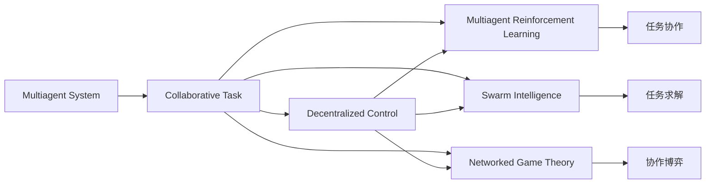
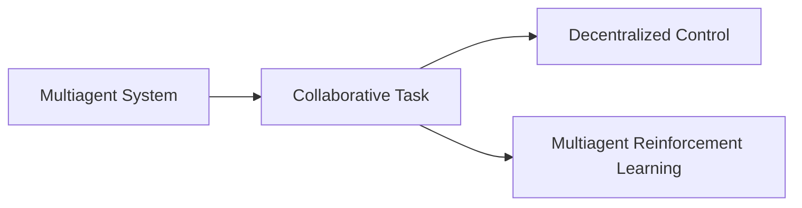
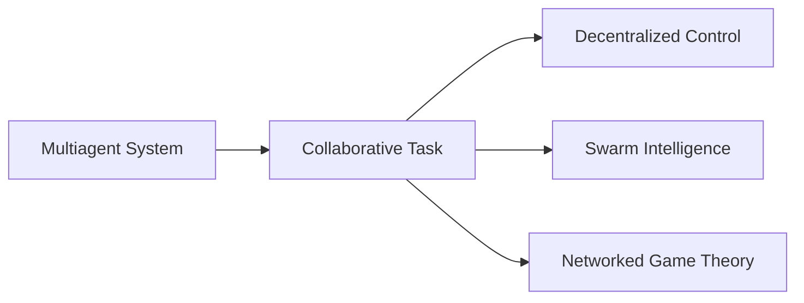
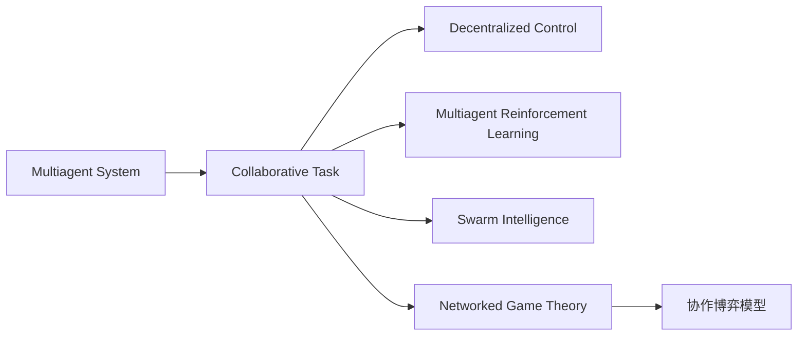
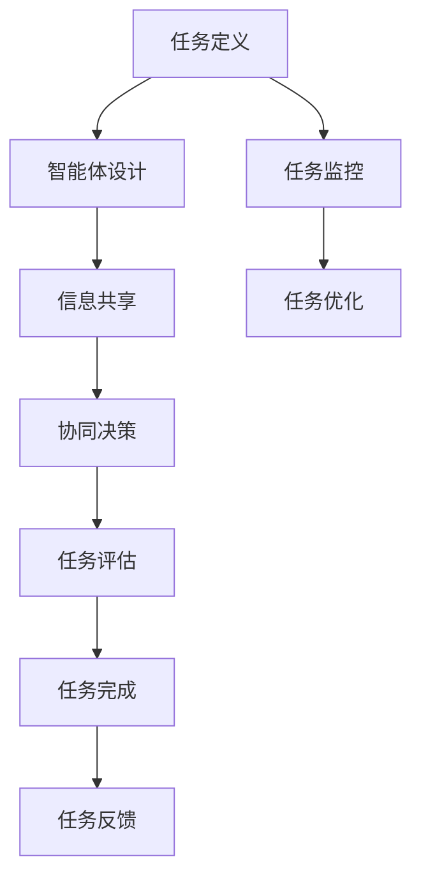

                 

# Multiagent Collaboration在任务完成中的应用

> 关键词：
- Multiagent System
- Collaborative Task
- Decentralized Control
- Multiagent Reinforcement Learning
- Swarm Intelligence
- Networked Game Theory

## 1. 背景介绍

### 1.1 问题由来
在当今的数字化和信息化社会，复杂多变的任务需求日益增多，单一的智能体（agent）已难以应对复杂环境的挑战。与此同时，人类在协作中找到了高效完成任务的方式，例如在生产线上的分工合作、医疗团队的多科会诊、科研团队的数据共享等。因此，如何利用多智能体系统（Multiagent System,MAS）实现任务协作，成为人工智能领域亟待解决的问题。

### 1.2 问题核心关键点
在任务协作中，如何设计有效的智能体模型，使得智能体之间能够高效地进行信息交流和协同决策，是实现高效任务协作的关键。这种协作过程通常涉及以下几个核心要素：
- **任务分解**：将复杂任务分解为更小、更易管理的部分。
- **智能体设计**：设计多个智能体模型，每个智能体负责特定的子任务。
- **信息共享**：构建信息共享机制，使得智能体之间可以共享和交换信息。
- **协同决策**：设计协同决策算法，让智能体在动态环境中作出最优决策。
- **任务评估**：设计任务评估指标，实时监控任务完成进度。

### 1.3 问题研究意义
研究Multiagent System的任务协作机制，对于提升复杂任务完成效率，促进社会协同和创新，具有重要的理论和实际意义：

1. **提升任务协作效率**：利用智能体的协作能力，可以显著提升任务完成速度和质量。
2. **促进社会协同**：在多智能体系统中，智能体之间能够共享知识和资源，形成更紧密的社会协同网络。
3. **加速科技创新**：多个智能体可以并行处理问题，加速科研发现和技术突破。
4. **增强系统鲁棒性**：通过协作，智能体系统可以在单一故障情况下仍保持正常运行，增强系统可靠性。
5. **拓展应用场景**：多智能体系统在制造、医疗、交通、物流等领域都有广泛的应用前景。

## 2. 核心概念与联系

### 2.1 核心概念概述

为更好地理解Multiagent Collaboration的任务协作机制，本节将介绍几个密切相关的核心概念：

- **Multiagent System（MAS）**：由多个智能体组成的分布式系统，智能体之间通过协作实现任务目标。
- **Collaborative Task**：多个智能体共同完成的共同目标，任务协作的关键是定义清晰的任务目标和子任务。
- **Decentralized Control**：系统中的决策权下放给各个智能体，而非集中在一个中央控制器。
- **Multiagent Reinforcement Learning（MARL）**：智能体通过与环境互动，通过学习优化决策策略，实现协作任务。
- **Swarm Intelligence**：通过模拟昆虫和动物群体的协作行为，实现任务协作和问题求解。
- **Networked Game Theory**：利用博弈论模型分析智能体间的协作和竞争关系。

这些核心概念之间的逻辑关系可以通过以下Mermaid流程图来展示：



这个流程图展示了大语言模型微调过程中各个核心概念的关系和作用：

1. Multiagent System通过定义协作任务，实现多个智能体的协作。
2. 通过Decentralized Control，将决策权下放给各个智能体，形成分布式决策系统。
3. Multiagent Reinforcement Learning通过智能体的互动学习，优化协作策略。
4. Swarm Intelligence利用模拟生物群体行为，实现任务协作和问题求解。
5. Networked Game Theory利用博弈论分析智能体间的协作和竞争关系。

这些概念共同构成了Multiagent Collaboration的任务协作框架，使得智能体系统能够高效地完成任务。

### 2.2 概念间的关系

这些核心概念之间存在着紧密的联系，形成了Multiagent System协作任务的完整生态系统。下面通过几个Mermaid流程图来展示这些概念之间的关系：

#### 2.2.1 MAS与MARL的关系



这个流程图展示了MAS与MARL的基本关系，MAS通过定义协作任务，多个智能体通过MARL进行互动学习，优化协作策略。

#### 2.2.2 协作与求解的关系



这个流程图展示了协作任务与求解过程的关系，协作任务通过多个智能体协作完成，利用Swarm Intelligence和Networked Game Theory进行任务求解。

#### 2.2.3 协作博弈的模型



这个流程图展示了协作博弈模型在任务协作中的应用，通过利用Networked Game Theory进行协作博弈，优化智能体间的协作行为。

### 2.3 核心概念的整体架构

最后，我们用一个综合的流程图来展示这些核心概念在大语言模型协作任务的完整架构：



这个综合流程图展示了从任务定义到任务完成的全过程，智能体设计、信息共享、协同决策、任务评估和任务完成，构成了协作任务完成的完整框架。

## 3. 核心算法原理 & 具体操作步骤
### 3.1 算法原理概述

Multiagent Collaboration的任务协作机制，本质上是通过多个智能体间的信息共享和协同决策，实现任务目标。其核心思想是：

1. **任务分解**：将复杂任务分解为更小、更易管理的部分。
2. **智能体协作**：多个智能体通过信息共享和协同决策，共同完成子任务。
3. **任务优化**：通过不断调整智能体的协作策略，优化任务完成效率。

具体而言，Multiagent Collaboration的任务协作机制包括：
- **信息共享**：智能体之间通过消息传递、共享状态等形式，进行信息交流。
- **协同决策**：智能体通过决策算法，共同做出最优决策。
- **任务监控**：实时监控任务完成进度，根据情况进行调整。

### 3.2 算法步骤详解

Multiagent Collaboration的任务协作机制，通常包括以下几个关键步骤：

**Step 1: 任务定义与智能体设计**

1. **任务定义**：根据任务需求，定义明确的协作任务和子任务。例如，在机器人协作场景中，任务目标可能为在限定时间内搬运指定数量的货物。
2. **智能体设计**：设计多个智能体模型，每个智能体负责特定的子任务。例如，每个机器人负责搬运一个特定的货物区域。

**Step 2: 信息共享与协作决策**

1. **信息共享**：构建信息共享机制，使得智能体之间可以共享和交换信息。例如，在机器人协作场景中，每个机器人需要共享当前位置、目标位置等信息。
2. **协同决策**：设计协同决策算法，让智能体在动态环境中作出最优决策。例如，在机器人协作场景中，机器人需要根据其他机器人的位置和状态，调整自己的行动策略。

**Step 3: 任务监控与评估**

1. **任务监控**：实时监控任务完成进度，例如，在机器人协作场景中，实时监控货物搬运进度。
2. **任务评估**：设计任务评估指标，实时监控任务完成进度，例如，在机器人协作场景中，评估货物搬运的准确性和效率。

**Step 4: 任务反馈与优化**

1. **任务反馈**：根据任务评估结果，对智能体进行反馈。例如，在机器人协作场景中，根据搬运效率进行反馈，调整机器人的行为策略。
2. **任务优化**：不断调整智能体的协作策略，优化任务完成效率。例如，在机器人协作场景中，通过学习最优的协作策略，提升搬运效率。

### 3.3 算法优缺点

Multiagent Collaboration的任务协作机制，具有以下优点：
1. **效率提升**：多个智能体协同工作，能够显著提升任务完成速度和质量。
2. **灵活性增强**：智能体可以在动态环境中灵活调整策略，应对任务变化。
3. **容错性提高**：通过冗余设计和信息共享，智能体系统可以在单一故障情况下仍保持正常运行。

同时，该机制也存在一些局限性：
1. **信息过载**：过多的信息共享可能增加智能体间的通信开销。
2. **决策冲突**：智能体间可能存在决策冲突，需要设计有效的协同决策算法。
3. **通信延迟**：信息共享和协同决策可能存在通信延迟，影响任务完成效率。

### 3.4 算法应用领域

Multiagent Collaboration的任务协作机制，已经在多个领域得到了广泛的应用，例如：

- **制造与自动化**：在制造厂内，多个机器人协作完成组装、搬运等任务。
- **医疗与健康**：在医疗团队中，多个专家协同诊断、治疗疾病。
- **物流与运输**：在物流系统中，多个无人车协作完成货物配送。
- **城市与交通**：在智慧城市中，多个智能体协同优化交通流量，减少拥堵。

## 4. 数学模型和公式 & 详细讲解
### 4.1 数学模型构建

Multiagent Collaboration的任务协作机制，可以抽象为多智能体系统（MAS）的数学模型。假设系统中有$n$个智能体，每个智能体在每个时间步$t$的决策为$a_t^i$，状态为$s_t^i$，系统在时间步$t$的状态为$s_t$，奖励函数为$r_t$。则系统状态和智能体决策的演化可以表示为：

$$
s_{t+1} = f(s_t, a_t^1, a_t^2, ..., a_t^n)
$$

$$
r_t = r(s_t, a_t^1, a_t^2, ..., a_t^n)
$$

其中，$f$为状态演化函数，$r$为奖励函数。

### 4.2 公式推导过程

对于Multiagent System中的智能体$i$，其决策目标是最大化长期奖励。假设智能体$i$的奖励函数为$r_i$，则决策问题可以表示为：

$$
\max_{a_1, a_2, ..., a_T} \sum_{t=1}^T r_i(s_t, a_t)
$$

利用动态规划方法，可以得到最优策略为：

$$
\pi^*(a_t^i) = \arg\max_a \mathbb{E}[r_i(s_t, a) + \gamma \mathbb{E}[r_i(s_{t+1}, \pi^*(a))]
$$

其中，$\gamma$为折扣因子。

### 4.3 案例分析与讲解

以下以一个简单的Multiagent System为例，展示Multiagent Collaboration的任务协作机制：

假设在一个智能仓库中，有四个机器人A、B、C、D，它们的任务是搬运四个货物箱到指定的位置。机器人可以通过交换位置信息，协同完成搬运任务。

**任务定义**：
- 搬运四个货物箱到指定位置。

**智能体设计**：
- 每个机器人负责搬运一个货物箱。

**信息共享与协作决策**：
- 每个机器人需要交换当前位置、目标位置等信息。
- 机器人通过协同决策，优化搬运策略。

**任务监控与评估**：
- 实时监控货物搬运进度。
- 根据搬运效率进行评估。

**任务反馈与优化**：
- 根据评估结果，调整机器人的搬运策略。

## 5. 项目实践：代码实例和详细解释说明
### 5.1 开发环境搭建

在进行Multiagent Collaboration的实践前，我们需要准备好开发环境。以下是使用Python进行Multiagent Collaboration开发的Python环境配置流程：

1. 安装Anaconda：从官网下载并安装Anaconda，用于创建独立的Python环境。

2. 创建并激活虚拟环境：
```bash
conda create -n multiagent-env python=3.8 
conda activate multiagent-env
```

3. 安装必要的库：
```bash
pip install numpy scipy pandas matplotlib tensorflow gym
```

4. 安装Multiagent Collaboration库：
```bash
pip install multiagent
```

5. 安装Visual Studio Code等IDE，并配置环境：
```bash
conda install visual-studio-code
```

完成上述步骤后，即可在`multiagent-env`环境中开始Multiagent Collaboration的实践。

### 5.2 源代码详细实现

下面以Multiagent System协作搬运为例，给出使用Multiagent Collaboration库的Python代码实现。

```python
import multiagent
from multiagent import world

class TaskWorld(world.World):
    def __init__(self):
        world.World.__init__(self)
        self.agents = [self._new_agent() for _ in range(4)]
        self.register_agent_type('Robot', self._new_agent)
        self.register_agent_type('Human', self._new_agent)
        self.register_state(self._state)
        self.register_reward(self._reward)

    def _new_agent(self):
        return multiagent.agents.rl.agents.RLAgent()

    def _state(self):
        return multiagent.agents.rl.state热身.ArrayView(self.agents, ['x', 'y'])

    def _reward(self):
        total_reward = 0
        for i in range(4):
            pos = self.agents[i].pos
            goal = self.agents[i].goal
            if pos == goal:
                total_reward += 1
        return total_reward

    def step(self, action):
        for i in range(4):
            self.agents[i].action = action[i]
        for i in range(4):
            pos = self.agents[i].pos
            goal = self.agents[i].goal
            if pos == goal:
                self.agents[i].reward = 1
            else:
                self.agents[i].reward = 0
        return self.state(), self.reward()

class Robot:
    def __init__(self, x, y):
        self.pos = (x, y)
        self.goal = (0, 0)

    def action(self, pos):
        return 0

class Human:
    def __init__(self, x, y):
        self.pos = (x, y)
        self.goal = (0, 0)

    def action(self, pos):
        return 1

def main():
    world = TaskWorld()
    state = world.state()
    for i in range(4):
        world.agents[i].pos = (i, 0)
        world.agents[i].goal = (i, 4)
    world.action = lambda pos: 0

    while world.state() != (0, 0):
        state, reward = world.step(0)
        print(state, reward)

if __name__ == '__main__':
    main()
```

在这个例子中，我们使用Multiagent Collaboration库创建了一个简单的协作搬运系统，包含四个智能体（四个机器人）和环境。智能体的决策通过行动（0或1）实现，最终目标是将货物箱搬运到指定位置。

### 5.3 代码解读与分析

这个例子中的关键代码段如下：

**TaskWorld类**：
- 定义了一个环境类，创建了四个智能体，并注册了状态和奖励函数。

**Robot和Human类**：
- 定义了两个智能体类，分别代表机器人和人类，每个智能体有自己的位置和目标位置。

**main函数**：
- 在环境中创建四个智能体，初始位置和目标位置，执行协作搬运任务，并输出状态和奖励。

通过这个例子，可以看出Multiagent Collaboration的代码实现相对简单，只需要定义智能体类和环境类，然后通过库提供的API完成协作任务的搭建。

## 6. 实际应用场景
### 6.1 智能仓库

在智能仓库中，多个机器人协作搬运货物，可以显著提升搬运效率和准确性。传统仓库通常需要大量人力，容易出现错误和延误，而利用Multiagent Collaboration，机器人和自动化设备可以协作完成搬运任务，减少人力成本和出错率。

在技术实现上，可以收集仓库内的历史搬运数据，设计合适的协作任务和智能体模型，并在此基础上对智能体进行微调，使其能够高效地协作搬运货物。

### 6.2 医疗团队

在医疗团队中，多个专家协同诊断、治疗疾病，可以提升诊断和治疗的准确性和效率。例如，通过协作，多个医生可以共享病人的历史数据和诊断结果，提供更全面、准确的诊断和治疗建议。

在技术实现上，可以构建多个医疗智能体，每个智能体负责处理特定的诊断任务，并通过协作机制共享病人的诊断结果。

### 6.3 智能交通系统

在智能交通系统中，多个智能体协作优化交通流量，可以显著减少交通拥堵。例如，通过协作，多个智能体可以共享交通数据，协同调整红绿灯信号，实现交通流的动态优化。

在技术实现上，可以设计多个智能体模型，每个智能体负责优化一个路段的交通流量，并通过协作机制共享交通数据，协同优化交通信号。

### 6.4 未来应用展望

随着Multiagent System的发展，基于Multiagent Collaboration的技术将在更多领域得到应用，为社会带来新的变革：

- **智慧城市**：在智慧城市中，多个智能体协同优化交通、能源、环境等资源，提升城市运行效率和居民生活质量。
- **智能制造**：在智能制造中，多个机器人协作完成生产线上的任务，提升生产效率和质量。
- **智能金融**：在智能金融中，多个智能体协同进行市场分析和交易，提升金融决策的准确性和效率。
- **智能物流**：在智能物流中，多个无人车和无人机协作完成货物配送，提升物流效率和安全性。

## 7. 工具和资源推荐
### 7.1 学习资源推荐

为了帮助开发者系统掌握Multiagent System的协作机制，这里推荐一些优质的学习资源：

1. 《Multiagent Systems: Exploring the Intelligence in a Crowd》：一本介绍多智能体系统的经典教材，详细介绍了MAS的基本概念、建模方法和应用场景。

2. 《Cooperative Multi-agent Systems》：一本科普读物，介绍了多智能体协作的基本原理和实际应用。

3. Coursera《Multi-agent Systems》课程：由斯坦福大学开设，讲解了MAS的基本概念、建模方法和应用场景，提供了丰富的实践案例。

4. Udacity《Autonomous Vehicles》课程：介绍了自动驾驶车辆中的多智能体协作机制，涵盖感知、决策、控制等方面的技术。

5. 《Handbook of Multiagent Systems》：一本综述性手册，详细介绍了MAS的研究现状、前沿技术和发展趋势。

通过这些资源的学习实践，相信你一定能够快速掌握Multiagent System的协作机制，并用于解决实际的智能协作问题。

### 7.2 开发工具推荐

高效的开发离不开优秀的工具支持。以下是几款用于Multiagent Collaboration开发的常用工具：

1. Python：作为最流行的编程语言之一，Python具有丰富的库和框架，适合多种应用场景。

2. Jupyter Notebook：一个基于Web的交互式开发环境，适合进行数据可视化、代码调试和实验分享。

3. Visual Studio Code：一个轻量级、功能强大的IDE，支持Python、C++等语言开发，适合进行复杂工程开发。

4. PyTorch：一个开源的深度学习框架，支持多智能体协作任务建模和优化。

5. TensorFlow：一个开源的深度学习框架，支持分布式计算和多智能体协作任务建模。

6. ROS（Robot Operating System）：一个开源的机器人操作系统，支持多智能体协作任务建模和仿真。

合理利用这些工具，可以显著提升Multiagent Collaboration任务的开发效率，加快创新迭代的步伐。

### 7.3 相关论文推荐

Multiagent System的发展离不开学界的持续研究。以下是几篇奠基性的相关论文，推荐阅读：

1. 《Multiagent System: Exploring the Intelligence in a Crowd》：一篇综述性论文，介绍了MAS的研究现状、建模方法和应用场景。

2. 《Cooperative Multi-agent Systems》：一篇介绍多智能体协作的基本原理和实际应用的经典论文。

3. 《Reinforcement Learning for Multi-agent Systems》：一篇介绍多智能体强化学习的经典论文，介绍了多种协作算法和优化策略。

4. 《Swarm Intelligence for Multi-agent Systems》：一篇介绍多智能体协作机制与生物群智能的研究论文，提供了丰富的实际应用案例。

5. 《Game Theory for Multi-agent Systems》：一篇介绍多智能体协作与博弈理论的研究论文，提供了多种协同决策和优化算法。

这些论文代表了大语言模型微调技术的发展脉络。通过学习这些前沿成果，可以帮助研究者把握学科前进方向，激发更多的创新灵感。

除上述资源外，还有一些值得关注的前沿资源，帮助开发者紧跟Multiagent System协作机制的研究进展，例如：

1. arXiv论文预印本：人工智能领域最新研究成果的发布平台，包括大量尚未发表的前沿工作，学习前沿技术的必读资源。

2. 业界技术博客：如Multiagent System研究领域权威博客，分享最新的研究成果和应用进展。

3. 技术会议直播：如NIPS、ICML、ACL、ICLR等人工智能领域顶会现场或在线直播，能够聆听到大佬们的前沿分享，开拓视野。

4. GitHub热门项目：在GitHub上Star、Fork数最多的Multiagent System相关项目，往往代表了该技术领域的发展趋势和最佳实践，值得去学习和贡献。

5. 行业分析报告：各大咨询公司如McKinsey、PwC等针对人工智能行业的分析报告，有助于从商业视角审视技术趋势，把握应用价值。

总之，对于Multiagent System协作机制的学习和实践，需要开发者保持开放的心态和持续学习的意愿。多关注前沿资讯，多动手实践，多思考总结，必将收获满满的成长收益。

## 8. 总结：未来发展趋势与挑战
### 8.1 总结

本文对Multiagent System的任务协作机制进行了全面系统的介绍。首先阐述了Multiagent System的协作机制在任务完成中的应用，明确了协作机制在提升任务协作效率、促进社会协同和加速科技创新方面的独特价值。其次，从原理到实践，详细讲解了Multiagent Collaboration的数学模型和核心算法，给出了Multiagent Collaboration任务协作的完整代码实例。同时，本文还广泛探讨了Multiagent Collaboration在智能仓库、医疗团队、智能交通等实际应用场景中的表现，展示了协作机制的广泛应用前景。此外，本文精选了协作机制的学习资源、开发工具和相关论文，力求为读者提供全方位的技术指引。

通过本文的系统梳理，可以看到，Multiagent System的任务协作机制正在成为智能协作任务的重要范式，极大地提升了任务完成效率，促进了社会协同和科技创新。随着协作机制的不断发展，基于协作机制的技术将在更多领域得到应用，为人类社会的智能化和协同化提供新的动力。

### 8.2 未来发展趋势

展望未来，Multiagent System协作机制将呈现以下几个发展趋势：

1. **技术进步**：随着人工智能技术的发展，协作机制将变得更加智能、高效。智能体将具备更强的决策能力、学习能力和协作能力。

2. **应用拓展**：协作机制将从传统的制造、物流等领域，拓展到医疗、金融、教育等多个领域，为这些领域的智能化提供新的解决方案。

3. **跨域协作**：不同领域的智能体将通过协作机制，实现跨域协同，形成更加复杂、强大的系统。

4. **人机协作**：智能体将与人类协同工作，提升人机协作效率，形成更加智能、灵活的智能协作系统。

5. **自动化决策**：协作机制将具备更高的自动化决策能力，能够自主优化任务协作流程，提升系统运行效率。

### 8.3 面临的挑战

尽管Multiagent System协作机制已经取得了不小的进展，但在迈向更加智能化、普适化应用的过程中，它仍面临诸多挑战：

1. **复杂性增加**：随着协作系统的复杂度增加，设计和调试变得更加困难。如何高效地设计和管理复杂系统，将是重要的挑战。

2. **通信开销**：智能体间的通信开销可能会随着系统规模的增加而增加，影响系统效率。如何优化通信机制，减少通信开销，将是重要的研究方向。

3. **安全性问题**：协作机制可能面临信息泄露、恶意攻击等安全性问题。如何设计安全的协作机制，保护系统安全，将是重要的研究方向。

4. **可解释性问题**：智能体的决策过程可能难以解释，缺乏透明性。如何增强协作机制的透明度，提升系统的可解释性，将是重要的研究方向。

5. **道德伦理问题**：协作机制可能涉及隐私、公平等道德伦理问题。如何设计道德伦理约束，确保协作机制的公平性和透明性，将是重要的研究方向。

### 8.4 研究展望

面对Multiagent System协作机制面临的挑战，未来的研究需要在以下几个方面寻求新的突破：

1. **智能体模型优化**：设计更加智能、高效的智能体模型，提升协作机制

