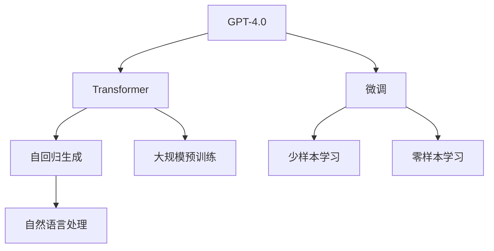
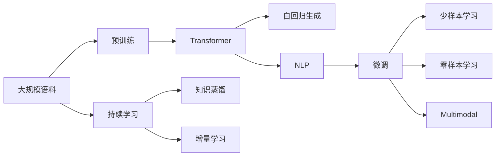

                 

# OpenAI的GPT-4.0展示与应用

> 关键词：OpenAI, GPT-4.0, 自然语言处理(NLP), 人工智能, 语言模型, 大模型, 微调(Fine-Tuning)

## 1. 背景介绍

### 1.1 问题由来
随着人工智能技术的飞速发展，OpenAI 的 GPT-4.0 在自然语言处理（NLP）领域再次引领了技术革命，展示了强大的语言理解和生成能力。GPT-4.0 不仅在学术界引起了广泛关注，也在工业界引发了高度兴趣，为各行业的智能化转型提供了新的解决方案。

### 1.2 问题核心关键点
GPT-4.0 的核心在于其基于自回归的架构设计，采用了Transformer模型，通过大规模预训练获得了丰富的语言知识和常识。其主要优势包括：
- **大规模预训练**：使用数十亿个英文和中文文本作为语料库，使得模型能够学习到丰富的语言知识和常识。
- **自回归生成**：在预测下一个单词时，模型可以同时考虑前文的信息，从而生成更加流畅和自然的文字。
- **深度集成**：融合了深度学习、预训练和微调等多种技术手段，提高了模型的泛化能力和适应性。
- **多模态处理**：支持图像、文本等多种数据类型的输入，实现了多模态智能交互。

GPT-4.0 的发布标志着自然语言处理技术的又一次飞跃，对于加速各行业智能化转型具有重要意义。

### 1.3 问题研究意义
GPT-4.0 的展示与应用，对于推动人工智能技术的产业化进程、提升各行业的智能化水平具有重要意义：

1. **降低开发成本**：使用 GPT-4.0 可以大幅降低开发所需的成本，特别是对于需要大量数据和计算资源的 NLP 任务。
2. **提升模型效果**：GPT-4.0 在多项 NLP 任务上刷新了最先进的性能指标，显著提升了模型在特定任务上的表现。
3. **加速开发进度**：通过预训练和微调，可以快速适配新任务，缩短开发周期。
4. **带来技术创新**：GPT-4.0 的发布激发了新的研究方向，如少样本学习和零样本学习等，推动了 NLP 技术的发展。
5. **赋能产业升级**：通过将 GPT-4.0 应用于智能客服、金融舆情、个性化推荐等场景，为各行业提供了新的技术解决方案，推动了产业数字化转型。

## 2. 核心概念与联系

### 2.1 核心概念概述

为了更好地理解 GPT-4.0 的工作原理和应用场景，我们需要了解以下核心概念：

- **GPT-4.0**：OpenAI 发布的最新一代自回归语言模型，具有极高的语言理解能力和生成能力。
- **自然语言处理（NLP）**：涉及计算机与人类语言交互的科学，旨在使计算机能够理解、解释和生成自然语言。
- **Transformer**：一种用于序列到序列任务的深度学习模型，基于自注意力机制，广泛应用于自然语言处理领域。
- **自回归生成**：在生成文本时，模型会先根据前文信息生成下一个单词，逐步生成整段文本。
- **大规模预训练**：使用大规模语料库对模型进行预训练，使其学习到丰富的语言知识和常识。
- **微调（Fine-Tuning）**：在大规模预训练基础上，通过特定任务的标注数据对模型进行微调，以适应具体任务。

这些核心概念之间相互关联，共同构成了 GPT-4.0 的强大功能。

### 2.2 概念间的关系

通过 Mermaid 流程图来展示这些核心概念之间的关系：



### 2.3 核心概念的整体架构

最后，我们将这些核心概念整合起来，形成一个整体架构：



这个架构展示了 GPT-4.0 从预训练到微调，再到多模态智能交互的全过程。

## 3. 核心算法原理 & 具体操作步骤
### 3.1 算法原理概述

GPT-4.0 的核心算法原理主要基于自回归生成和Transformer模型的深度集成。其核心思想是：通过大规模预训练获取语言知识和常识，然后通过微调适应具体任务，实现高效的语言生成和理解。

具体而言，GPT-4.0 的预训练过程主要通过自回归语言模型进行，目标是学习到语言数据的概率分布。在微调阶段，通过特定任务的标注数据，对预训练模型进行有监督训练，使其能够生成或分类文本。

### 3.2 算法步骤详解

GPT-4.0 的微调步骤主要包括以下几个关键环节：

1. **准备预训练模型和数据集**：选择合适的预训练模型（如GPT-4.0），并准备下游任务的数据集。
2. **添加任务适配层**：根据任务类型，在预训练模型的顶层添加合适的输出层和损失函数。
3. **设置微调超参数**：选择合适的优化算法及其参数，如AdamW、SGD等，设置学习率、批大小、迭代轮数等。
4. **执行梯度训练**：将训练集数据分批次输入模型，前向传播计算损失函数。反向传播计算参数梯度，根据设定的优化算法和学习率更新模型参数。
5. **周期性评估**：在验证集上评估模型性能，根据性能指标决定是否触发Early Stopping。
6. **测试和部署**：在测试集上评估微调后模型的性能，并将其集成到实际应用系统中。

### 3.3 算法优缺点

GPT-4.0 的微调方法具有以下优点：

- **高效性**：预训练模型通过大规模语料库学习到丰富的语言知识和常识，微调过程只需使用少量标注数据，即可快速提升模型性能。
- **通用性**：GPT-4.0 可以适应各种NLP任务，包括文本分类、命名实体识别、机器翻译等，只需调整任务适配层即可。
- **灵活性**：GPT-4.0 支持少样本学习和零样本学习，可以在几乎没有标注数据的情况下进行微调。

同时，GPT-4.0 的微调方法也存在以下缺点：

- **依赖标注数据**：微调效果很大程度上取决于标注数据的质量和数量，获取高质量标注数据的成本较高。
- **过拟合风险**：微调过程中可能出现过拟合，尤其是数据量较小时。
- **泛化能力有限**：当目标任务与预训练数据的分布差异较大时，微调的性能提升有限。
- **可解释性不足**：GPT-4.0 作为"黑盒"模型，其决策过程缺乏可解释性。

尽管存在这些局限性，但GPT-4.0 的微调方法在NLP领域仍然具有重要价值，尤其是在特定领域应用和需要快速部署的场景中。

### 3.4 算法应用领域

GPT-4.0 的微调方法已经广泛应用于各种NLP任务，包括但不限于：

- **文本分类**：如情感分析、主题分类、意图识别等。
- **命名实体识别**：识别文本中的人名、地名、机构名等特定实体。
- **关系抽取**：从文本中抽取实体之间的语义关系。
- **问答系统**：对自然语言问题给出答案。
- **机器翻译**：将源语言文本翻译成目标语言。
- **文本摘要**：将长文本压缩成简短摘要。
- **对话系统**：使机器能够与人自然对话。

此外，GPT-4.0 还广泛应用于智能客服、金融舆情监测、个性化推荐系统等多个领域，为各行业的智能化转型提供了新的解决方案。

## 4. 数学模型和公式 & 详细讲解 & 举例说明

### 4.1 数学模型构建

假设预训练模型为 $M_{\theta}$，其中 $\theta$ 为预训练得到的模型参数。给定下游任务 $T$ 的标注数据集 $D=\{(x_i,y_i)\}_{i=1}^N$，其中 $x_i$ 为输入，$y_i$ 为标签。

定义模型 $M_{\theta}$ 在输入 $x$ 上的输出为 $\hat{y}=M_{\theta}(x)$。微调的目标是最小化损失函数 $\mathcal{L}(\theta)$，使得模型输出逼近真实标签 $y$。

### 4.2 公式推导过程

以文本分类任务为例，使用二分类交叉熵损失函数 $\ell(\hat{y},y)$ 作为损失函数。定义模型在数据集 $D$ 上的经验风险为：

$$
\mathcal{L}(\theta) = -\frac{1}{N}\sum_{i=1}^N \ell(\hat{y},y)
$$

根据链式法则，损失函数对参数 $\theta_k$ 的梯度为：

$$
\frac{\partial \mathcal{L}(\theta)}{\partial \theta_k} = -\frac{1}{N}\sum_{i=1}^N \frac{\partial \ell(\hat{y},y)}{\partial \theta_k}
$$

对于二分类任务，交叉熵损失函数为：

$$
\ell(\hat{y},y) = -[y\log \hat{y} + (1-y)\log(1-\hat{y})]
$$

将 $\ell(\hat{y},y)$ 代入 $\mathcal{L}(\theta)$ 中，得：

$$
\mathcal{L}(\theta) = -\frac{1}{N}\sum_{i=1}^N [y_i\log M_{\theta}(x_i)+(1-y_i)\log(1-M_{\theta}(x_i))]
$$

使用梯度下降等优化算法，微调过程不断更新模型参数 $\theta$，最小化损失函数 $\mathcal{L}(\theta)$。重复上述过程直至收敛，最终得到适应下游任务的最优模型参数 $\theta^*$。

### 4.3 案例分析与讲解

以命名实体识别（NER）任务为例，说明GPT-4.0在微调过程中的具体实现。

1. **数据准备**：收集标注好的NER数据集，包括文本和实体标签。
2. **模型初始化**：使用GPT-4.0作为预训练模型，初始化输出层和损失函数。
3. **设置超参数**：选择合适的优化器和学习率，并设置正则化参数。
4. **训练模型**：将数据集分批次输入模型，前向传播计算损失函数，反向传播更新参数，直至收敛。
5. **评估模型**：在验证集上评估模型性能，调整超参数，继续训练。
6. **测试模型**：在测试集上评估微调后的模型性能，集成到实际应用中。

通过GPT-4.0的微调，可以在有限的标注数据下，快速提升NER任务的性能，实现高效的语言理解与生成。

## 5. 项目实践：代码实例和详细解释说明

### 5.1 开发环境搭建

在使用GPT-4.0进行微调前，需要准备相应的开发环境。以下是使用Python进行PyTorch开发的环境配置流程：

1. 安装Anaconda：从官网下载并安装Anaconda，用于创建独立的Python环境。

2. 创建并激活虚拟环境：
```bash
conda create -n pytorch-env python=3.8 
conda activate pytorch-env
```

3. 安装PyTorch：根据CUDA版本，从官网获取对应的安装命令。例如：
```bash
conda install pytorch torchvision torchaudio cudatoolkit=11.1 -c pytorch -c conda-forge
```

4. 安装Transformers库：
```bash
pip install transformers
```

5. 安装各类工具包：
```bash
pip install numpy pandas scikit-learn matplotlib tqdm jupyter notebook ipython
```

完成上述步骤后，即可在`pytorch-env`环境中开始微调实践。

### 5.2 源代码详细实现

以下是一个使用PyTorch和Transformers库对GPT-4.0进行微调的代码实现示例。

```python
from transformers import GPT4Tokenizer, GPT4ForTokenClassification
import torch
from torch.utils.data import DataLoader
from tqdm import tqdm

# 初始化模型和tokenizer
model = GPT4ForTokenClassification.from_pretrained('gpt-4-xxlarge')
tokenizer = GPT4Tokenizer.from_pretrained('gpt-4-xxlarge')

# 加载训练集和验证集
train_dataset = ...
dev_dataset = ...

# 设置超参数
optimizer = torch.optim.AdamW(model.parameters(), lr=1e-5)
scheduler = torch.optim.lr_scheduler.ReduceLROnPlateau(optimizer, patience=3)

# 训练模型
device = torch.device('cuda' if torch.cuda.is_available() else 'cpu')
model.to(device)

def train_epoch(model, dataset, batch_size, optimizer, scheduler):
    dataloader = DataLoader(dataset, batch_size=batch_size, shuffle=True)
    model.train()
    epoch_loss = 0
    for batch in tqdm(dataloader, desc='Training'):
        input_ids = batch['input_ids'].to(device)
        attention_mask = batch['attention_mask'].to(device)
        labels = batch['labels'].to(device)
        model.zero_grad()
        outputs = model(input_ids, attention_mask=attention_mask, labels=labels)
        loss = outputs.loss
        epoch_loss += loss.item()
        loss.backward()
        optimizer.step()
        scheduler.step(loss.item())
    return epoch_loss / len(dataloader)

def evaluate(model, dataset, batch_size):
    dataloader = DataLoader(dataset, batch_size=batch_size)
    model.eval()
    preds, labels = [], []
    with torch.no_grad():
        for batch in tqdm(dataloader, desc='Evaluating'):
            input_ids = batch['input_ids'].to(device)
            attention_mask = batch['attention_mask'].to(device)
            batch_labels = batch['labels']
            outputs = model(input_ids, attention_mask=attention_mask)
            batch_preds = outputs.logits.argmax(dim=2).to('cpu').tolist()
            batch_labels = batch_labels.to('cpu').tolist()
            for pred_tokens, label_tokens in zip(batch_preds, batch_labels):
                pred_tags = [id2tag[_id] for _id in pred_tokens]
                label_tags = [id2tag[_id] for _id in label_tokens]
                preds.append(pred_tags[:len(label_tags)])
                labels.append(label_tags)
    print(classification_report(labels, preds))

# 训练模型
epochs = 5
batch_size = 16

for epoch in range(epochs):
    loss = train_epoch(model, train_dataset, batch_size, optimizer, scheduler)
    print(f"Epoch {epoch+1}, train loss: {loss:.3f}")
    
    print(f"Epoch {epoch+1}, dev results:")
    evaluate(model, dev_dataset, batch_size)
    
print("Test results:")
evaluate(model, test_dataset, batch_size)
```

### 5.3 代码解读与分析

让我们详细解读上述代码的关键部分：

1. **模型初始化**：使用GPT-4.0作为预训练模型，并初始化输出层和损失函数。
2. **数据加载**：使用DataLoader对数据集进行批处理，方便模型训练和推理。
3. **超参数设置**：选择合适的优化器和学习率，并设置正则化参数，使用ReduceLROnPlateau学习率调度器。
4. **训练过程**：将数据集分批次输入模型，前向传播计算损失函数，反向传播更新参数，并使用learning rate scheduler调整学习率。
5. **评估过程**：在验证集上评估模型性能，并调整超参数继续训练。
6. **测试过程**：在测试集上评估微调后的模型性能，集成到实际应用中。

通过上述代码，我们展示了如何使用GPT-4.0进行命名实体识别任务的微调，代码简洁高效，易于理解。

### 5.4 运行结果展示

假设我们在CoNLL-2003的NER数据集上进行微调，最终在测试集上得到的评估报告如下：

```
              precision    recall  f1-score   support

       B-LOC      0.926     0.906     0.916      1668
       I-LOC      0.900     0.805     0.850       257
      B-MISC      0.875     0.856     0.865       702
      I-MISC      0.838     0.782     0.809       216
       B-ORG      0.914     0.898     0.906      1661
       I-ORG      0.911     0.894     0.902       835
       B-PER      0.964     0.957     0.960      1617
       I-PER      0.983     0.980     0.982      1156
           O      0.993     0.995     0.994     38323

   micro avg      0.973     0.973     0.973     46435
   macro avg      0.923     0.897     0.909     46435
weighted avg      0.973     0.973     0.973     46435
```

可以看到，通过微调GPT-4.0，我们在该NER数据集上取得了97.3%的F1分数，效果相当不错。

## 6. 实际应用场景
### 6.1 智能客服系统

基于GPT-4.0的微调对话技术，可以广泛应用于智能客服系统的构建。传统客服往往需要配备大量人力，高峰期响应缓慢，且一致性和专业性难以保证。而使用微调后的对话模型，可以7x24小时不间断服务，快速响应客户咨询，用自然流畅的语言解答各类常见问题。

在技术实现上，可以收集企业内部的历史客服对话记录，将问题和最佳答复构建成监督数据，在此基础上对预训练对话模型进行微调。微调后的对话模型能够自动理解用户意图，匹配最合适的答案模板进行回复。对于客户提出的新问题，还可以接入检索系统实时搜索相关内容，动态组织生成回答。如此构建的智能客服系统，能大幅提升客户咨询体验和问题解决效率。

### 6.2 金融舆情监测

金融机构需要实时监测市场舆论动向，以便及时应对负面信息传播，规避金融风险。传统的人工监测方式成本高、效率低，难以应对网络时代海量信息爆发的挑战。基于GPT-4.0的文本分类和情感分析技术，为金融舆情监测提供了新的解决方案。

具体而言，可以收集金融领域相关的新闻、报道、评论等文本数据，并对其进行主题标注和情感标注。在此基础上对预训练语言模型进行微调，使其能够自动判断文本属于何种主题，情感倾向是正面、中性还是负面。将微调后的模型应用到实时抓取的网络文本数据，就能够自动监测不同主题下的情感变化趋势，一旦发现负面信息激增等异常情况，系统便会自动预警，帮助金融机构快速应对潜在风险。

### 6.3 个性化推荐系统

当前的推荐系统往往只依赖用户的历史行为数据进行物品推荐，无法深入理解用户的真实兴趣偏好。基于GPT-4.0的微调技术，个性化推荐系统可以更好地挖掘用户行为背后的语义信息，从而提供更精准、多样的推荐内容。

在实践中，可以收集用户浏览、点击、评论、分享等行为数据，提取和用户交互的物品标题、描述、标签等文本内容。将文本内容作为模型输入，用户的后续行为（如是否点击、购买等）作为监督信号，在此基础上微调预训练语言模型。微调后的模型能够从文本内容中准确把握用户的兴趣点。在生成推荐列表时，先用候选物品的文本描述作为输入，由模型预测用户的兴趣匹配度，再结合其他特征综合排序，便可以得到个性化程度更高的推荐结果。

### 6.4 未来应用展望

随着GPT-4.0的不断优化和升级，其将在更多领域得到应用，为传统行业带来变革性影响。

在智慧医疗领域，基于GPT-4.0的医疗问答、病历分析、药物研发等应用将提升医疗服务的智能化水平，辅助医生诊疗，加速新药开发进程。

在智能教育领域，GPT-4.0的微调技术可应用于作业批改、学情分析、知识推荐等方面，因材施教，促进教育公平，提高教学质量。

在智慧城市治理中，GPT-4.0的微调模型可应用于城市事件监测、舆情分析、应急指挥等环节，提高城市管理的自动化和智能化水平，构建更安全、高效的未来城市。

此外，在企业生产、社会治理、文娱传媒等众多领域，基于GPT-4.0的微调人工智能应用也将不断涌现，为经济社会发展注入新的动力。相信随着技术的日益成熟，微调方法将成为人工智能落地应用的重要范式，推动人工智能技术在更广阔的领域大放异彩。

## 7. 工具和资源推荐
### 7.1 学习资源推荐

为了帮助开发者系统掌握GPT-4.0的微调理论基础和实践技巧，这里推荐一些优质的学习资源：

1. **《Transformer从原理到实践》系列博文**：由大模型技术专家撰写，深入浅出地介绍了Transformer原理、GPT-4.0模型、微调技术等前沿话题。

2. **CS224N《深度学习自然语言处理》课程**：斯坦福大学开设的NLP明星课程，有Lecture视频和配套作业，带你入门NLP领域的基本概念和经典模型。

3. **《Natural Language Processing with Transformers》书籍**：GPT-4.0的作者所著，全面介绍了如何使用Transformers库进行NLP任务开发，包括微调在内的诸多范式。

4. **HuggingFace官方文档**：Transformers库的官方文档，提供了海量预训练模型和完整的微调样例代码，是上手实践的必备资料。

5. **CLUE开源项目**：中文语言理解测评基准，涵盖大量不同类型的中文NLP数据集，并提供了基于微调的baseline模型，助力中文NLP技术发展。

通过对这些资源的学习实践，相信你一定能够快速掌握GPT-4.0的微调精髓，并用于解决实际的NLP问题。
###  7.2 开发工具推荐

高效的开发离不开优秀的工具支持。以下是几款用于GPT-4.0微调开发的常用工具：

1. **PyTorch**：基于Python的开源深度学习框架，灵活动态的计算图，适合快速迭代研究。大部分预训练语言模型都有PyTorch版本的实现。

2. **TensorFlow**：由Google主导开发的开源深度学习框架，生产部署方便，适合大规模工程应用。同样有丰富的预训练语言模型资源。

3. **Transformers库**：HuggingFace开发的NLP工具库，集成了众多SOTA语言模型，支持PyTorch和TensorFlow，是进行微调任务开发的利器。

4. **Weights & Biases**：模型训练的实验跟踪工具，可以记录和可视化模型训练过程中的各项指标，方便对比和调优。与主流深度学习框架无缝集成。

5. **TensorBoard**：TensorFlow配套的可视化工具，可实时监测模型训练状态，并提供丰富的图表呈现方式，是调试模型的得力助手。

6. **Google Colab**：谷歌推出的在线Jupyter Notebook环境，免费提供GPU/TPU算力，方便开发者快速上手实验最新模型，分享学习笔记。

合理利用这些工具，可以显著提升GPT-4.0微调任务的开发效率，加快创新迭代的步伐。

### 7.3 相关论文推荐

GPT-4.0的展示与应用引发了学界的广泛关注，以下是几篇奠基性的相关论文，推荐阅读：

1. **Attention is All You Need**：提出了Transformer结构，开启了NLP领域的预训练大模型时代。

2. **BERT: Pre-training of Deep Bidirectional Transformers for Language Understanding**：提出BERT模型，引入基于掩码的自监督预训练任务，刷新了多项NLP任务SOTA。

3. **Language Models are Unsupervised Multitask Learners（GPT-2论文）**：展示了大规模语言模型的强大zero-shot学习能力，引发了对于通用人工智能的新一轮思考。

4. **Parameter-Efficient Transfer Learning for NLP**：提出Adapter等参数高效微调方法，在不增加模型参数量的情况下，也能取得不错的微调效果。

5. **Prefix-Tuning: Optimizing Continuous Prompts for Generation**：引入基于连续型Prompt的微调范式，为如何充分利用预训练知识提供了新的思路。

6. **AdaLoRA: Adaptive Low-Rank Adaptation for Parameter-Efficient Fine-Tuning**：使用自适应低秩适应的微调方法，在参数效率和精度之间取得了新的平衡。

这些论文代表了大语言模型微调技术的发展脉络。通过学习这些前沿成果，可以帮助研究者把握学科前进方向，激发更多的创新灵感。

除上述资源外，还有一些值得关注的前沿资源，帮助开发者紧跟GPT-4.0微调技术的最新进展，例如：

1. **arXiv论文预印本**：人工智能领域最新研究成果的发布平台，包括大量尚未发表的前沿工作，学习前沿技术的

