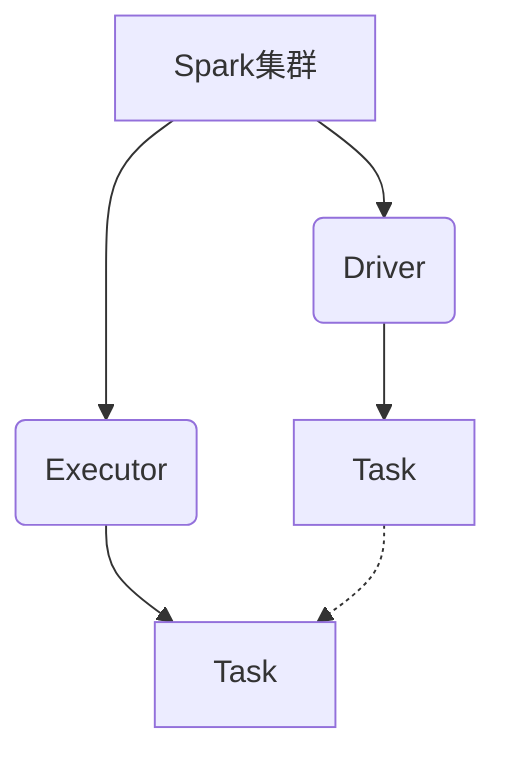

# Spark Executor原理与代码实例讲解

## 1. 背景介绍

### 1.1 问题的由来

在大数据时代，数据量的快速增长使得传统的单机计算模式已经无法满足现代数据处理的需求。为了解决这一问题,Apache Spark作为一种新兴的大数据处理框架应运而生。Spark基于内存计算,能够显著提高数据处理的效率,并且支持多种编程语言,使其具有广泛的适用性。

在Spark集群中,Executor扮演着至关重要的角色。它是Spark中实际执行任务的工作节点,负责运行分配给它的任务,并将计算结果返回给驱动程序。Executor的性能和资源利用率直接影响着整个Spark应用的运行效率。因此,深入理解Spark Executor的原理和实现机制对于优化Spark应用程序的性能至关重要。

### 1.2 研究现状

目前,已有一些研究人员对Spark Executor进行了相关研究,主要集中在以下几个方面:

1. **Executor资源管理**:研究如何更好地管理和分配Executor的计算资源,如CPU、内存等,以提高资源利用率。

2. **Executor故障恢复**:探讨在Executor发生故障时如何快速恢复任务,确保应用程序的可靠性。

3. **Executor任务调度**:研究如何优化Executor任务的调度策略,以提高整体计算效率。

4. **Executor性能优化**:探索各种优化技术,如代码优化、数据本地性等,以提升Executor的计算性能。

然而,现有研究大多侧重于某一个具体方面,缺乏对Spark Executor整体原理和实现的系统性介绍和分析。

### 1.3 研究意义

深入理解Spark Executor的原理和实现机制对于以下几个方面具有重要意义:

1. **性能优化**:掌握Executor的工作原理,有助于开发人员更好地优化Spark应用程序的性能,提高计算效率。

2. **故障排查**:当Spark应用程序出现异常时,了解Executor的实现细节有助于快速定位和解决问题。

3. **框架扩展**:对Spark Executor的深入理解有利于开发人员扩展和定制Spark框架,以满足特定的业务需求。

4. **知识积累**:研究Spark Executor的原理和实现有助于开发人员深化对分布式计算框架的理解,积累宝贵的经验。

### 1.4 本文结构

本文将从以下几个方面全面介绍Spark Executor的原理和实现:

1. 核心概念与联系
2. 核心算法原理与具体操作步骤
3. 数学模型和公式详细讲解与案例分析
4. 项目实践:代码实例和详细解释说明
5. 实际应用场景
6. 工具和资源推荐
7. 总结:未来发展趋势与挑战
8. 附录:常见问题与解答

## 2. 核心概念与联系

在深入探讨Spark Executor的原理和实现之前,我们需要先了解一些核心概念及其之间的联系。

1. **Spark集群(Spark Cluster)**: Spark采用主从架构,由一个驱动程序(Driver)和多个执行程序(Executor)组成。

2. **驱动程序(Driver)**: 驱动程序是Spark应用程序的主入口点,负责创建SparkContext,分析、优化和执行Spark作业。

3. **执行程序(Executor)**: 执行程序是Spark集群中实际执行任务的工作节点。它们负责运行分配给它们的任务,并将计算结果返回给驱动程序。

4. **任务(Task)**: 任务是Spark应用程序的基本执行单元。驱动程序将应用程序逻辑划分为多个任务,并将这些任务分发给执行程序执行。

5. **SparkContext**: SparkContext是Spark应用程序与Spark集群之间的入口点,用于创建RDD(Resilient Distributed Dataset)和广播变量等。

6. **RDD(Resilient Distributed Dataset)**: RDD是Spark的核心数据结构,代表一个不可变、可分区、可并行计算的数据集合。

在Spark应用程序中,驱动程序负责创建SparkContext,并将应用程序逻辑划分为多个任务。这些任务被分发给执行程序执行,执行程序运行任务并将结果返回给驱动程序。整个过程由SparkContext协调和管理。

## 3. 核心算法原理与具体操作步骤

### 3.1 算法原理概述

Spark Executor的核心算法原理可以概括为以下几个方面:

1. **任务调度**: Spark采用延迟调度策略,即在真正需要计算RDD分区时才进行任务调度。这种策略可以避免不必要的计算,提高效率。

2. **数据本地性**: Spark会尽可能将任务调度到存储有相应数据的节点上,以减少数据传输开销。

3. **容错机制**: Spark通过RDD的lineage(血统)机制,可以在出现故障时重新计算丢失的数据分区,从而实现容错。

4. **内存管理**: Spark采用统一的内存管理机制,可以在执行内存和存储内存之间动态分配资源,提高内存利用率。

5. **任务执行**: 执行程序通过启动多个线程来并行执行任务,充分利用CPU资源。

### 3.2 算法步骤详解

Spark Executor的工作流程可以概括为以下几个步骤:

1. **启动执行程序**: 当Spark应用程序启动时,Spark集群管理器(如YARN或Standalone)会在工作节点上启动执行程序进程。

2. **注册执行程序**: 启动后,执行程序会向驱动程序注册自己,并等待任务分配。

3. **任务分发**: 驱动程序根据数据位置等因素,将任务分发给合适的执行程序。

4. **任务执行**: 执行程序接收到任务后,会启动多个线程并行执行任务。

5. **结果返回**: 任务执行完成后,执行程序会将结果返回给驱动程序。

6. **容错处理**: 如果执行程序发生故障,驱动程序会根据RDD的lineage重新计算丢失的数据分区。

7. **资源释放**: 应用程序执行完成后,执行程序会释放占用的资源,并退出。

在整个过程中,执行程序与驱动程序之间通过网络进行通信,交换任务和结果数据。执行程序还会定期向驱动程序发送心跳信号,以维持与驱动程序的连接。

### 3.3 算法优缺点

Spark Executor的算法设计具有以下优点:

1. **高效**: 通过延迟调度、数据本地性等策略,可以提高计算效率,减少不必要的数据传输。

2. **容错性强**: 基于RDD的lineage机制,可以在出现故障时重新计算丢失的数据分区,确保应用程序的可靠性。

3. **资源利用率高**: 统一的内存管理机制和多线程执行任务可以充分利用计算资源。

4. **易于扩展**: Spark的设计具有良好的扩展性,可以方便地添加新的执行程序来扩展集群规模。

然而,Spark Executor的算法也存在一些缺点:

1. **启动开销**: 启动执行程序需要一定的时间开销,对于短任务来说,这部分开销可能会占据较大比例。

2. **内存压力**: 如果内存配置不当,可能会导致内存不足或浪费,影响应用程序的性能。

3. **调度开销**: 在大规模集群中,任务调度的开销可能会变得较大,影响整体效率。

4. **数据倾斜**: 由于数据分布不均匀,可能会导致某些执行程序负载过重,而其他执行程序负载较轻,造成资源利用不均衡。

### 3.4 算法应用领域

Spark Executor的算法设计适用于以下领域:

1. **大数据处理**: Spark Executor可以高效地处理大规模数据集,适用于各种大数据应用场景,如日志分析、推荐系统等。

2. **机器学习**: Spark提供了MLlib机器学习库,Executor可以高效地执行各种机器学习算法,如分类、聚类等。

3. **流式计算**: Spark Streaming可以实时处理数据流,Executor可以高效地执行流式计算任务。

4. **图计算**: Spark提供了GraphX图计算库,Executor可以高效地执行图算法,如PageRank、连通分量等。

5. **交互式分析**: Spark SQL和Spark DataFrame提供了交互式分析能力,Executor可以高效地执行SQL查询和数据转换操作。

总的来说,Spark Executor的算法设计使其适用于各种需要高效、容错、可扩展的大数据处理场景。

## 4. 数学模型和公式详细讲解与举例说明

在Spark Executor的实现中,涉及到一些数学模型和公式,用于优化资源分配、任务调度等方面。本节将详细介绍这些数学模型和公式,并通过案例分析进行讲解。

### 4.1 数学模型构建

#### 4.1.1 资源分配模型

Spark Executor需要合理地分配CPU和内存资源,以确保应用程序的高效运行。资源分配模型可以用以下公式表示:

$$
\begin{aligned}
\max \quad & U(R_c, R_m) \
\text{s.t.} \quad & R_c \leq C_c \
& R_m \leq C_m \
& R_c, R_m \geq 0
\end{aligned}
$$

其中:

- $U(R_c, R_m)$是资源利用率函数,表示在分配$R_c$个CPU核心和$R_m$GB内存时的资源利用效率。
- $C_c$和$C_m$分别表示集群中可用的CPU核心数和内存容量。
- $R_c$和$R_m$分别表示分配给Executor的CPU核心数和内存容量。

目标是在满足集群资源约束的前提下,最大化资源利用率函数$U(R_c, R_m)$,从而实现资源的最优分配。

#### 4.1.2 任务调度模型

Spark Executor需要合理地调度任务,以提高数据本地性和负载均衡。任务调度模型可以用以下公式表示:

$$
\begin{aligned}
\min \quad & \sum_{i=1}^{n} \sum_{j=1}^{m} c_{ij} x_{ij} \
\text{s.t.} \quad & \sum_{j=1}^{m} x_{ij} = 1, \quad \forall i \
& \sum_{i=1}^{n} x_{ij} \leq k_j, \quad \forall j \
& x_{ij} \in \{0, 1\}, \quad \forall i, j
\end{aligned}
$$

其中:

- $n$是任务数量,$m$是Executor数量。
- $c_{ij}$表示将第$i$个任务分配给第$j$个Executor的代价,可以根据数据本地性、负载等因素计算。
- $x_{ij}$是决策变量,当第$i$个任务分配给第$j$个Executor时取值为1,否则为0。
- $k_j$是第$j$个Executor可以执行的最大任务数。

目标是最小化总的任务分配代价,同时满足每个任务只能分配给一个Executor,以及每个Executor的任务数不超过其最大容量的约束。

### 4.2 公式推导过程

#### 4.2.1 资源分配模型推导

资源分配模型的目标函数$U(R_c, R_m)$可以根据具体的应用场景和优化目标进行定义。例如,如果我们希望最大化CPU和内存的利用率,可以定义$U(R_c, R_m) = \alpha \frac{R_c}{C_c} + (1 - \alpha) \frac{R_m}{C_m}$,其中$\alpha$是CPU和内存权重系数。

另一种常见的做法是将资源利用率函数定义为应用程序的吞吐量或执行时间等性能指标的函数,例如$U(R_c, R_m) = f(R_c, R_m)$,其中$f$是一个基于实际测量数据构建的性能模型。

在确定了目标函数后,我们可以使用约束优化技术,如拉格朗日乘数法或KKT条件