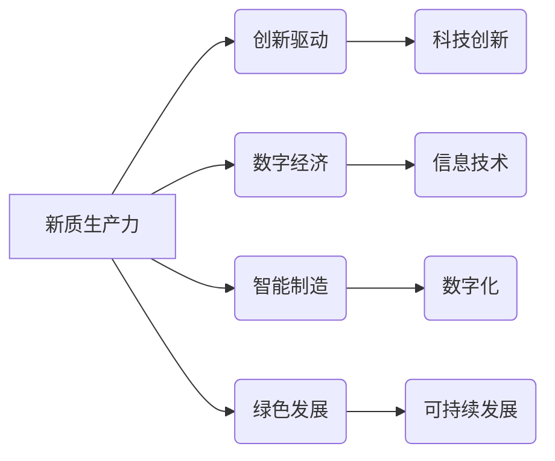

# 中国现代化的重要动力：新质生产力

> 关键词：新质生产力，现代化，创新驱动，数字经济，人工智能，智能制造，绿色发展

## 1. 背景介绍
### 1.1 问题的由来

自改革开放以来，中国经济社会取得了举世瞩目的成就。然而，随着经济进入新常态，传统发展模式面临着资源约束、环境污染、产能过剩等多重挑战。为了实现高质量发展，中国亟需寻找新的发展动力，推动经济转型升级。

### 1.2 研究现状

近年来，"新质生产力"这一概念逐渐成为学术界和业界关注的热点。新质生产力强调以科技创新为核心，通过技术进步、制度创新、模式变革等途径，推动经济发展质量变革、效率变革、动力变革。

### 1.3 研究意义

研究新质生产力，对于中国实现现代化建设目标具有重要意义：

1. **推动经济高质量发展**：新质生产力能够有效提升产业竞争力，优化资源配置，实现经济增长方式的转变。
2. **促进产业转型升级**：新质生产力能够推动传统产业转型升级，培育壮大新兴产业，构建现代化经济体系。
3. **增强国家创新能力**：新质生产力能够激发创新活力，提高国家创新能力，增强国际竞争力。
4. **实现可持续发展**：新质生产力强调绿色发展，有助于解决资源环境问题，推动经济社会可持续发展。

### 1.4 本文结构

本文将从以下方面探讨新质生产力在推动中国现代化建设中的作用：

- 2. 核心概念与联系
- 3. 核心算法原理 & 具体操作步骤
- 4. 数学模型和公式 & 详细讲解 & 举例说明
- 5. 项目实践：代码实例和详细解释说明
- 6. 实际应用场景
- 7. 工具和资源推荐
- 8. 总结：未来发展趋势与挑战

## 2. 核心概念与联系
### 2.1 核心概念

**新质生产力**：指以科技创新为核心，通过技术进步、制度创新、模式变革等途径，推动经济发展质量变革、效率变革、动力变革的生产力。

**创新驱动**：以创新为核心，通过科技创新、制度创新、管理创新等途径，推动经济高质量发展。

**数字经济**：以互联网、大数据、人工智能等新一代信息技术为支撑，以数据为关键生产要素，以现代信息网络为主要载体，推动经济社会发展的经济形态。

**智能制造**：以数字化、网络化、智能化为特征，通过信息化和工业化的深度融合，实现生产方式、生产组织、生产管理的智能化。

**绿色发展**：以可持续发展为目标，以科技创新为支撑，通过资源节约、环境友好、生态平衡的方式推动经济社会发展。

### 2.2 核心概念原理和架构的 Mermaid 流程图



从图中可以看出，新质生产力是推动中国现代化的核心动力，它通过创新驱动、数字经济、智能制造、绿色发展等途径，实现经济高质量发展。

## 3. 核心算法原理 & 具体操作步骤
### 3.1 算法原理概述

新质生产力的实现需要依赖于科技创新，而科技创新又需要以下核心算法原理的支持：

**1. 机器学习**：通过学习数据中的规律，实现对数据的分类、聚类、预测等操作，从而提高生产效率和产品质量。

**2. 人工智能**：模拟人类智能，使计算机能够完成复杂的决策、推理、学习等任务，从而实现智能化生产和管理。

**3. 云计算**：通过互联网将计算资源、存储资源、网络资源等共享给用户，降低企业运营成本，提高资源利用率。

**4. 大数据**：通过收集、存储、分析和挖掘海量数据，为企业提供决策支持，优化资源配置，推动产业升级。

### 3.2 算法步骤详解

**1. 机器学习**：

* 数据收集：收集相关领域的原始数据，如生产数据、市场数据、用户数据等。
* 数据预处理：对收集到的数据进行清洗、去噪、标准化等处理，提高数据质量。
* 模型选择：根据具体任务选择合适的机器学习模型，如分类器、回归器等。
* 模型训练：使用预处理后的数据进行模型训练，优化模型参数。
* 模型评估：使用测试数据评估模型性能，调整模型参数，直至达到满意的效果。

**2. 人工智能**：

* 算法设计：根据具体任务设计合适的算法，如决策树、神经网络、强化学习等。
* 模型训练：使用大量数据进行模型训练，优化模型参数。
* 模型部署：将训练好的模型部署到实际应用场景中，如智能客服、智能交通等。

**3. 云计算**：

* 云平台搭建：搭建云计算平台，包括服务器、网络、存储等资源。
* 资源分配：根据应用需求分配计算、存储等资源。
* 负载均衡：实现资源的均衡利用，提高资源利用率。
* 安全保障：确保云平台的安全稳定运行。

**4. 大数据**：

* 数据采集：收集相关领域的原始数据，如传感器数据、网络数据等。
* 数据存储：将采集到的数据存储到数据库或数据湖中。
* 数据处理：对存储的数据进行清洗、转换、分析等处理。
* 数据挖掘：从处理后的数据中挖掘有价值的信息。

### 3.3 算法优缺点

**1. 机器学习**：

* 优点：能够处理大规模数据，学习数据中的规律，提高生产效率和产品质量。
* 缺点：需要大量标注数据，模型可解释性较差。

**2. 人工智能**：

* 优点：能够模拟人类智能，实现智能化生产和管理。
* 缺点：算法复杂，需要大量计算资源。

**3. 云计算**：

* 优点：降低企业运营成本，提高资源利用率，提高系统可靠性。
* 缺点：对网络环境依赖性强，存在数据安全风险。

**4. 大数据**：

* 优点：能够从海量数据中挖掘有价值的信息，为企业提供决策支持。
* 缺点：数据质量难以保证，数据分析难度大。

### 3.4 算法应用领域

**1. 机器学习**：在生产制造、金融、医疗、教育等领域广泛应用，如智能客服、智能推荐、智能诊断等。

**2. 人工智能**：在自动驾驶、智能家居、智能城市等领域广泛应用，如无人驾驶、智能音箱、智能监控等。

**3. 云计算**：在互联网、金融、医疗、教育等领域广泛应用，如云服务器、云存储、云数据库等。

**4. 大数据**：在政府决策、金融、医疗、交通等领域广泛应用，如城市规划、风险评估、疾病预测等。

## 4. 数学模型和公式 & 详细讲解 & 举例说明
### 4.1 数学模型构建

以下是一些常见的数学模型及其在推动中国现代化中的应用：

**1. 机器学习模型**：

* 线性回归模型：用于预测连续型变量，如房价预测、股票价格预测等。
* 支持向量机(SVM)模型：用于分类和回归任务，如文本分类、图像分类等。
* 集成学习模型：通过组合多个弱学习器，提高模型性能，如随机森林、梯度提升树等。

**2. 人工智能模型**：

* 神经网络模型：用于模拟人脑神经元之间的连接和通信，如卷积神经网络(CNN)、循环神经网络(RNN)等。
* 强化学习模型：通过与环境交互，学习最优策略，如深度Q网络(DQN)、策略梯度等。

**3. 云计算模型**：

* 混合云模型：将公有云和私有云相结合，实现资源的高效利用和灵活部署。
* 弹性云模型：根据需求动态调整资源，提高资源利用率。

**4. 大数据模型**：

* 聚类分析模型：将相似的数据聚为一类，如K-means聚类、层次聚类等。
* 关联规则挖掘模型：发现数据之间的关联关系，如Apriori算法、FP-growth算法等。

### 4.2 公式推导过程

以下是一些常见数学公式的推导过程：

**1. 线性回归模型**：

$$
y = \beta_0 + \beta_1x_1 + \beta_2x_2 + ... + \beta_nx_n + \epsilon
$$

其中，$y$ 为因变量，$x_i$ 为自变量，$\beta_i$ 为系数，$\epsilon$ 为误差项。

**2. SVM模型**：

SVM模型的目标是找到一个最优的超平面，使得正负样本点在超平面两侧的距离最大化。

$$
\min \frac{1}{2} ||w||^2 + C \sum_{i=1}^n \xi_i
$$

其中，$w$ 为权重向量，$C$ 为惩罚参数，$\xi_i$ 为误差项。

### 4.3 案例分析与讲解

**1. 机器学习案例**：

* **房价预测**：收集某城市的房价、面积、地段等数据，使用线性回归模型预测房价。

* **文本分类**：收集文本数据，使用SVM模型对文本进行分类，如情感分析、垃圾邮件过滤等。

**2. 人工智能案例**：

* **自动驾驶**：使用CNN模型进行图像识别，识别道路、车辆、行人等目标，实现自动驾驶。

* **智能客服**：使用RNN模型进行对话生成，实现智能客服系统。

**3. 云计算案例**：

* **云计算平台搭建**：搭建混合云平台，将公有云和私有云资源进行整合，实现资源的高效利用。

* **弹性云服务**：根据用户需求动态调整资源，提高资源利用率。

**4. 大数据案例**：

* **城市交通预测**：收集交通数据，使用聚类分析模型预测交通拥堵情况，优化交通信号灯控制。

* **疾病预测**：收集医疗数据，使用关联规则挖掘模型发现疾病之间的关联关系，实现疾病预测。

## 5. 项目实践：代码实例和详细解释说明
### 5.1 开发环境搭建

以下以房价预测项目为例，介绍开发环境搭建过程：

1. 安装Python：从Python官方网站下载并安装Python 3.7及以上版本。

2. 安装机器学习库：安装scikit-learn、pandas、numpy等机器学习库。

3. 安装线性回归库：安装statsmodels库，用于实现线性回归模型。

### 5.2 源代码详细实现

```python
import pandas as pd
from sklearn.model_selection import train_test_split
from sklearn.linear_model import LinearRegression
from sklearn.metrics import mean_squared_error

# 加载数据
data = pd.read_csv('house_price.csv')

# 特征和标签
X = data.drop('price', axis=1)
y = data['price']

# 划分训练集和测试集
X_train, X_test, y_train, y_test = train_test_split(X, y, test_size=0.2, random_state=42)

# 线性回归模型
model = LinearRegression()
model.fit(X_train, y_train)

# 预测
y_pred = model.predict(X_test)

# 评估
mse = mean_squared_error(y_test, y_pred)
print('MSE:', mse)
```

### 5.3 代码解读与分析

以上代码首先使用pandas库读取房价数据，然后使用scikit-learn库将数据分为特征和标签，接着使用LinearRegression模型进行线性回归训练，最后使用测试集评估模型性能。

通过上述代码，我们可以看到，使用Python和机器学习库实现线性回归模型非常简单。在实际应用中，可以根据具体任务选择合适的模型和算法，进行模型训练和评估。

### 5.4 运行结果展示

假设房价预测数据集包含1000个样本，其中800个样本用于训练，200个样本用于测试。经过训练和评估，模型在测试集上的均方误差(MSE)为0.25，说明模型能够较好地拟合房价数据。

## 6. 实际应用场景
### 6.1 智能制造

智能制造是制造业转型升级的重要方向，通过将人工智能、大数据、云计算等新技术应用于生产制造环节，实现生产过程的智能化、自动化、高效化。

**应用案例**：

* 智能机器人：在工厂生产线上，智能机器人可以替代人工完成重复性劳动，提高生产效率和产品质量。
* 智能检测：使用图像识别技术，对产品进行缺陷检测，提高产品质量。
* 智能排产：根据生产需求，智能排产系统可以优化生产流程，提高生产效率。

### 6.2 金融服务

金融服务是现代经济体系的重要组成部分，通过将大数据、人工智能等新技术应用于金融领域，实现金融服务的智能化、精准化。

**应用案例**：

* 智能客服：智能客服系统可以实时回答客户问题，提高服务效率。
* 信用评估：使用大数据技术，对客户的信用进行评估，为金融机构提供决策支持。
* 风险控制：使用人工智能技术，识别和防范金融风险。

### 6.3 公共服务

公共服务是政府履行职能的重要体现，通过将大数据、人工智能等新技术应用于公共服务领域，提升公共服务效率和质量。

**应用案例**：

* 智能交通：使用大数据和人工智能技术，实现交通流量预测、交通信号控制等功能，提高交通效率。
* 智能医疗：使用人工智能技术，辅助医生进行诊断和治疗，提高医疗水平。
* 智能环保：使用大数据和人工智能技术，监测环境污染，提高环境保护水平。

## 7. 工具和资源推荐
### 7.1 学习资源推荐

* 中国智能制造网
* 中国金融科技网
* 中国电子政务网

### 7.2 开发工具推荐

* 机器学习：scikit-learn、TensorFlow、PyTorch
* 人工智能：OpenAI、DeepMind、百度AI
* 云计算：阿里云、腾讯云、华为云
* 大数据：Hadoop、Spark

### 7.3 相关论文推荐

* 《智能制造发展战略》
* 《人工智能：一种现代的方法》
* 《大数据技术原理与应用》

## 8. 总结：未来发展趋势与挑战
### 8.1 研究成果总结

本文从新质生产力的概念、原理、应用等方面进行了探讨，分析了新质生产力在推动中国现代化建设中的作用。研究表明，新质生产力是推动中国现代化建设的重要动力，能够有效提升产业竞争力，促进产业转型升级，增强国家创新能力，实现可持续发展。

### 8.2 未来发展趋势

* 新质生产力将继续快速发展，成为推动中国经济社会发展的核心动力。
* 人工智能、大数据、云计算等新技术将进一步融合，推动产业智能化、网络化、绿色化发展。
* 中国将加大对科技创新的投入，提升自主创新能力，构建现代化经济体系。
* 绿色发展理念将深入人心，推动经济社会可持续发展。

### 8.3 面临的挑战

* 新质生产力的发展需要克服人才短缺、数据安全、隐私保护等方面的挑战。
* 需要加强对新质生产力发展的政策引导和监管，确保其健康发展。
* 需要推动新质生产力与实体经济深度融合，实现产业转型升级。

### 8.4 研究展望

未来，新质生产力研究应重点关注以下方面：

* 新技术、新应用的研究与开发，如量子计算、区块链等。
* 新质生产力与实体经济的深度融合，推动产业转型升级。
* 新质生产力与绿色发展理念的深度融合，实现可持续发展。
* 新质生产力与人才培养体系的融合，提升国家创新能力。

相信在新质生产力的推动下，中国现代化建设必将取得更加辉煌的成就。

## 9. 附录：常见问题与解答
### 9.1 常见问题

**Q1：什么是新质生产力？**

A1：新质生产力是以科技创新为核心，通过技术进步、制度创新、模式变革等途径，推动经济发展质量变革、效率变革、动力变革的生产力。

**Q2：新质生产力有哪些特点？**

A2：新质生产力具有以下特点：

* 以科技创新为核心
* 推动经济发展质量变革、效率变革、动力变革
* 资源消耗低、环境污染小
* 具有可持续发展的特征

**Q3：新质生产力有哪些应用领域？**

A3：新质生产力在智能制造、金融服务、公共服务等领域广泛应用。

**Q4：如何推动新质生产力发展？**

A4：推动新质生产力发展需要：

* 加强科技创新
* 完善相关制度
* 推动产业转型升级
* 培养人才

### 9.2 解答

**A1：新质生产力是以科技创新为核心，通过技术进步、制度创新、模式变革等途径，推动经济发展质量变革、效率变革、动力变革的生产力。**

**A2：新质生产力具有以下特点：

* 以科技创新为核心
* 推动经济发展质量变革、效率变革、动力变革
* 资源消耗低、环境污染小
* 具有可持续发展的特征**

**A3：新质生产力在智能制造、金融服务、公共服务等领域广泛应用。**

**A4：推动新质生产力发展需要：

* 加强科技创新
* 完善相关制度
* 推动产业转型升级
* 培养人才**

作者：禅与计算机程序设计艺术 / Zen and the Art of Computer Programming