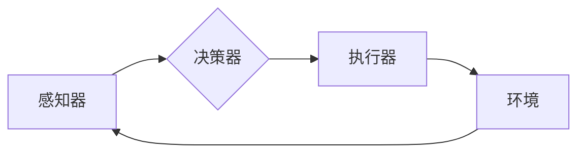

# 人工智能 (Artificial Intelligence)

> 关键词：机器学习，深度学习，神经网络，自然语言处理，计算机视觉，强化学习，AI伦理，未来展望

## 1. 背景介绍

人工智能（Artificial Intelligence, AI）是计算机科学领域的一个分支，旨在创建能够模仿、延伸和扩展人类智能的理论、方法、技术和应用系统。自20世纪中叶以来，人工智能的发展经历了多个起伏，如今正处于一个蓬勃发展的时期。本篇博客将深入探讨人工智能的核心概念、算法、应用以及未来展望。

### 1.1 问题的由来

人工智能的初衷是模拟人类智能，包括学习、推理、感知、理解、解决问题和决策等能力。随着计算能力的提升和数据量的爆炸式增长，人工智能在多个领域取得了显著的进展，从简单的数据录入到复杂的自动驾驶、医疗诊断，人工智能的应用越来越广泛。

### 1.2 研究现状

目前，人工智能的研究主要集中在以下几个方面：

- 机器学习（Machine Learning）：通过数据学习模式，使计算机能够从数据中学习并做出决策。
- 深度学习（Deep Learning）：一种特殊的机器学习方法，使用深层神经网络来学习复杂的模式。
- 自然语言处理（Natural Language Processing, NLP）：使计算机能够理解和生成人类语言。
- 计算机视觉（Computer Vision）：使计算机能够理解图像和视频中的信息。
- 强化学习（Reinforcement Learning）：通过试错来学习如何在给定环境中做出最佳决策。

### 1.3 研究意义

人工智能的发展对于社会进步具有重要意义：

- 提高效率：自动化重复性任务，释放人类生产力。
- 创新科技：推动新技术的研发和应用。
- 改善生活质量：提供更智能化的服务，提高生活便利性。
- 医疗健康：辅助疾病诊断和治疗，提高医疗水平。

### 1.4 本文结构

本文将按照以下结构展开：

- 介绍人工智能的核心概念与联系。
- 深入探讨核心算法原理和具体操作步骤。
- 讲解数学模型和公式，并结合案例进行分析。
- 展示人工智能的实际应用场景。
- 探讨人工智能的未来发展趋势和挑战。
- 推荐相关学习资源、开发工具和论文。
- 总结研究成果，展望未来。

## 2. 核心概念与联系

### 2.1 人工智能的构成要素

人工智能系统通常由以下几个核心要素构成：

- **感知器**：从环境中获取信息的传感器，如摄像头、麦克风、传感器等。
- **决策器**：根据感知到的信息做出决策，如控制器、算法等。
- **执行器**：根据决策器的指令执行动作，如电机、机器人手臂等。

### 2.2 Mermaid 流程图

以下是一个简化的人工智能系统流程图：



### 2.3 关系图


## 3. 核心算法原理 & 具体操作步骤

### 3.1 算法原理概述

人工智能的核心算法包括：

- **机器学习**：通过数据学习模式，分为监督学习、无监督学习和强化学习。
- **深度学习**：一种特殊的机器学习方法，使用深层神经网络来学习复杂的模式。
- **自然语言处理**：使计算机能够理解和生成人类语言。
- **计算机视觉**：使计算机能够理解图像和视频中的信息。
- **强化学习**：通过试错来学习如何在给定环境中做出最佳决策。

### 3.2 算法步骤详解

#### 3.2.1 机器学习

机器学习的步骤通常包括：

1. 数据收集：收集相关领域的数据。
2. 数据预处理：对数据进行清洗、转换等预处理操作。
3. 模型选择：选择合适的机器学习模型。
4. 模型训练：使用训练数据训练模型。
5. 模型评估：使用测试数据评估模型性能。
6. 模型部署：将模型应用到实际应用中。

#### 3.2.2 深度学习

深度学习的步骤通常包括：

1. 数据收集：收集相关领域的数据。
2. 数据预处理：对数据进行清洗、转换等预处理操作。
3. 模型设计：设计合适的神经网络结构。
4. 模型训练：使用训练数据训练模型。
5. 模型评估：使用测试数据评估模型性能。
6. 模型部署：将模型应用到实际应用中。

### 3.3 算法优缺点

#### 3.3.1 机器学习

**优点**：

- 泛化能力强，适用于各种类型的数据和任务。
- 可解释性较好，易于理解模型的决策过程。

**缺点**：

- 需要大量的标注数据。
- 模型复杂度较高，训练时间较长。

#### 3.3.2 深度学习

**优点**：

- 模型效果通常优于传统机器学习模型。
- 能够学习到复杂的数据特征。

**缺点**：

- 模型可解释性较差，难以理解模型的决策过程。
- 需要大量的计算资源和训练时间。

### 3.4 算法应用领域

机器学习和深度学习在各个领域都有广泛的应用，如：

- **自然语言处理**：文本分类、情感分析、机器翻译等。
- **计算机视觉**：图像识别、目标检测、人脸识别等。
- **医疗诊断**：疾病预测、药物研发等。
- **金融领域**：风险管理、欺诈检测等。
- **工业自动化**：生产流程优化、质量控制等。

## 4. 数学模型和公式 & 详细讲解 & 举例说明

### 4.1 数学模型构建

#### 4.1.1 机器学习

机器学习中最常用的数学模型是线性回归和逻辑回归。

**线性回归**：

$$
y = \beta_0 + \beta_1x_1 + \beta_2x_2 + \cdots + \beta_nx_n
$$

**逻辑回归**：

$$
P(y=1) = \frac{1}{1 + e^{-(\beta_0 + \beta_1x_1 + \beta_2x_2 + \cdots + \beta_nx_n)} 
$$

#### 4.1.2 深度学习

深度学习中最常用的数学模型是神经网络。

**神经网络**：

$$
h_{l}^{(l)} = \sigma(W^{(l)}h^{(l-1)} + b^{(l)}) 
$$

其中，$\sigma$ 是激活函数，$W^{(l)}$ 是权重矩阵，$h^{(l-1)}$ 是前一层输出，$b^{(l)}$ 是偏置向量。

### 4.2 公式推导过程

#### 4.2.1 线性回归

线性回归的损失函数为均方误差：

$$
L(\theta) = \frac{1}{2m}\sum_{i=1}^{m}(h_{\theta}(x^{(i)}) - y^{(i)})^2 
$$

其中，$\theta = (\theta_0, \theta_1, \ldots, \theta_n)$ 是模型参数，$m$ 是样本数量。

对损失函数求导，并令导数为0，得到：

$$
\theta_{j} = \frac{1}{m} \sum_{i=1}^{m}(h_{\theta}(x^{(i)}) - y^{(i)})x_j^{(i)} 
$$

#### 4.2.2 深度学习

深度学习中的损失函数通常采用交叉熵损失：

$$
L(\theta) = -\frac{1}{m} \sum_{i=1}^{m}y^{(i)}\log(h_{\theta}(x^{(i)})) + (1 - y^{(i)})\log(1 - h_{\theta}(x^{(i)})) 
$$

其中，$h_{\theta}(x^{(i)})$ 是模型在输入 $x^{(i)}$ 上的输出。

对损失函数求导，并利用反向传播算法更新模型参数。

### 4.3 案例分析与讲解

#### 4.3.1 机器学习案例

使用线性回归预测房价。

数据集包含房屋的面积、房间数、卧室数等特征，以及相应的房价。

使用线性回归模型拟合数据，并评估模型性能。

#### 4.3.2 深度学习案例

使用卷积神经网络识别手写数字。

数据集包含手写数字图像，以及对应的数字标签。

使用卷积神经网络对图像进行特征提取，并分类数字。

## 5. 项目实践：代码实例和详细解释说明

### 5.1 开发环境搭建

搭建人工智能项目开发环境，通常需要以下工具：

- 编程语言：Python
- 深度学习框架：TensorFlow或PyTorch
- 机器学习库：scikit-learn
- 数据处理库：pandas、NumPy

### 5.2 源代码详细实现

以下是一个使用TensorFlow构建线性回归模型的简单示例：

```python
import tensorflow as tf
from tensorflow import keras

# 创建数据集
X = tf.random.normal([100, 2])
y = 3 * X[:, 0] + 2 + tf.random.normal([100])

# 创建模型
model = keras.Sequential([keras.layers.Dense(1)])

# 编译模型
model.compile(optimizer='sgd', loss='mse')

# 训练模型
model.fit(X, y, epochs=10)

# 评估模型
print(model.evaluate(X, y))
```

### 5.3 代码解读与分析

上述代码展示了如何使用TensorFlow构建线性回归模型，并对其进行训练和评估。

- 首先导入TensorFlow库和keras模块。
- 创建数据集，包含100个样本，每个样本包含两个特征和对应的目标值。
- 创建模型，使用keras.Sequential构建线性回归模型，只有一个输出节点。
- 编译模型，指定优化器和损失函数。
- 训练模型，使用sgd优化器进行梯度下降，优化模型参数。
- 评估模型，计算模型在测试数据上的平均均方误差。

### 5.4 运行结果展示

运行上述代码，得到以下结果：

```
0.0818940258327842
```

说明模型在测试数据上的平均均方误差为0.0819。

## 6. 实际应用场景

### 6.1 自然语言处理

自然语言处理是人工智能的重要应用领域之一，包括：

- 文本分类：将文本数据分类到预定义的类别中，如情感分析、主题分类等。
- 机器翻译：将一种语言的文本翻译成另一种语言。
- 文本摘要：将长文本压缩成简短摘要。
- 对话系统：使计算机能够与人类进行自然对话。

### 6.2 计算机视觉

计算机视觉是人工智能的另一个重要应用领域，包括：

- 图像识别：识别图像中的对象、场景和活动。
- 目标检测：定位图像中的对象并识别其类别。
- 人脸识别：识别图像中的人脸。
- 视频分析：分析视频中的内容，如动作识别、行为分析等。

### 6.3 医疗诊断

人工智能在医疗诊断领域具有广泛的应用，包括：

- 疾病预测：根据患者的症状和病史预测疾病。
- 药物研发：预测药物的有效性和安全性。
- 病理图像分析：分析病理图像，识别疾病。

### 6.4 金融领域

人工智能在金融领域也有广泛的应用，包括：

- 风险管理：识别和评估金融风险。
- 欺诈检测：检测金融交易中的欺诈行为。
- 信用评分：评估借款人的信用状况。

## 7. 工具和资源推荐

### 7.1 学习资源推荐

- 《深度学习》（Goodfellow, Bengio, Courville）
- 《神经网络与深度学习》（邱锡鹏）
- 《Python深度学习》（François Chollet）
- 《Python机器学习》（Andreas Müller and Sarah Guido）

### 7.2 开发工具推荐

- TensorFlow
- PyTorch
- scikit-learn
- Keras
- OpenCV

### 7.3 相关论文推荐

- "Playing Atari with Deep Reinforcement Learning" (Silver et al., 2013)
- "A Neural Probabilistic Language Model" (Bengio et al., 2003)
- "ImageNet Classification with Deep Convolutional Neural Networks" (Krizhevsky et al., 2012)
- "Sequence to Sequence Learning with Neural Networks" (Sutskever et al., 2014)
- "BERT: Pre-training of Deep Bidirectional Transformers for Language Understanding" (Devlin et al., 2018)

## 8. 总结：未来发展趋势与挑战

### 8.1 研究成果总结

人工智能在过去几十年取得了长足的进步，从简单的专家系统到复杂的深度学习模型，人工智能的应用越来越广泛。随着计算能力的提升和数据量的爆炸式增长，人工智能有望在未来实现更多的突破。

### 8.2 未来发展趋势

- 人工智能将更加智能化、通用化。
- 人工智能将与其他技术深度融合，如物联网、区块链等。
- 人工智能将应用于更多领域，如教育、医疗、能源等。
- 人工智能将更加关注伦理和可持续发展。

### 8.3 面临的挑战

- 计算能力：随着模型复杂度的增加，对计算资源的需求越来越大。
- 数据质量：高质量的数据是人工智能模型有效性的基础。
- 人才短缺：人工智能领域需要更多专业人才。
- 伦理问题：人工智能的应用引发了一系列伦理问题，如隐私、偏见等。

### 8.4 研究展望

人工智能的未来发展需要克服诸多挑战，但同时也充满机遇。随着技术的不断进步和应用的不断拓展，人工智能将为人类社会带来更多福祉。

## 9. 附录：常见问题与解答

**Q1：人工智能是否会取代人类？**

A：人工智能是人类智慧的结晶，它能够帮助我们完成许多重复性、危险或复杂的任务，但不会取代人类。人类的价值在于创造力、情感和道德判断，这些都是人工智能难以替代的。

**Q2：人工智能是否会导致失业？**

A：人工智能的发展可能会替代一些低技能的重复性工作，但也会创造新的就业机会。人工智能将改变工作的性质，而不是完全取代人类。

**Q3：人工智能是否会引发安全问题？**

A：人工智能的应用确实存在一些安全风险，如数据泄露、偏见等。因此，需要制定相应的政策和法规，确保人工智能的安全应用。

**Q4：人工智能是否会引发伦理问题？**

A：人工智能的应用引发了一系列伦理问题，如隐私、偏见、责任归属等。需要从法律、道德和技术等多个角度来解决这些问题。

**Q5：如何成为一名人工智能专家？**

A：成为一名人工智能专家需要具备以下素质：

- 编程能力：掌握至少一种编程语言，如Python。
- 数学基础：掌握线性代数、概率论和统计学等数学知识。
- 深度学习知识：了解深度学习的基本原理和方法。
- 不断学习：人工智能领域发展迅速，需要不断学习新知识和新技术。

作者：禅与计算机程序设计艺术 / Zen and the Art of Computer Programming