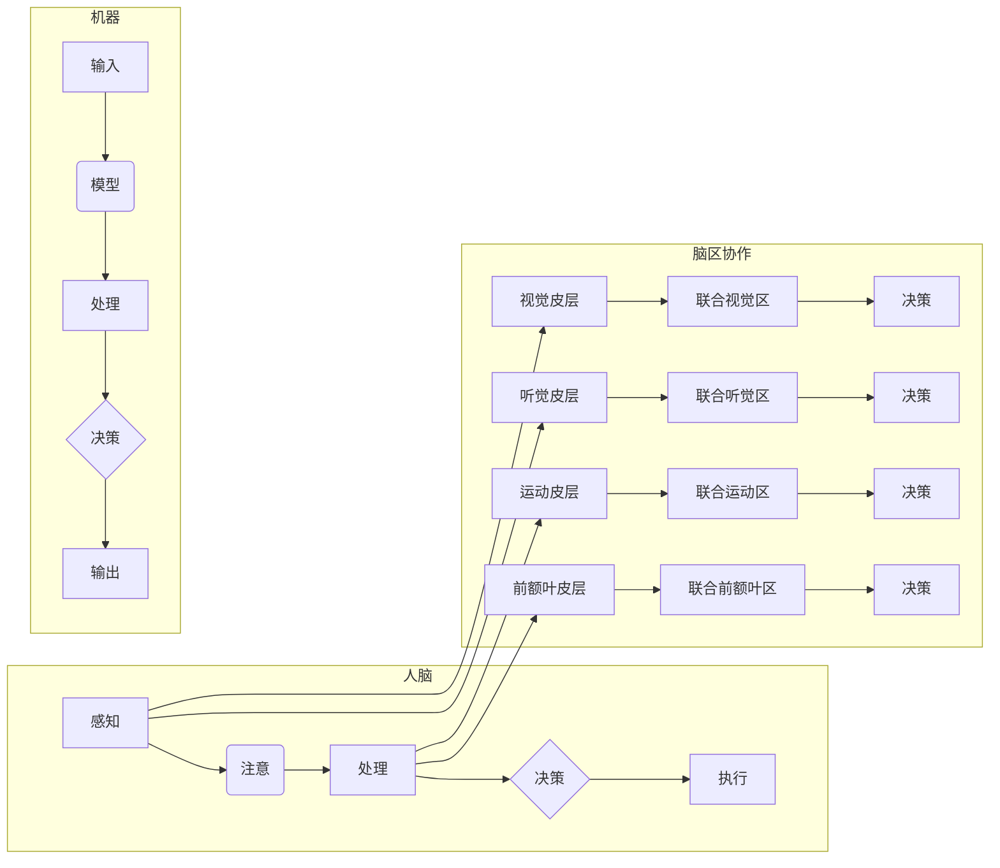

> 人脑，机器学习，多任务处理，神经可塑性，认知模型，计算模型，注意力机制，脑机接口

# 人脑与机器的多任务处理差异

多任务处理是认知科学和人工智能领域共同关注的课题。人类大脑能够在执行多个任务的同时保持高效和灵活，而机器学习模型在多任务处理方面虽然取得了显著进展，但与人类大脑相比仍存在较大差距。本文将深入探讨人脑与机器在多任务处理方面的差异，分析其背后的原理和机制，并展望未来研究方向。

## 1. 背景介绍

人类大脑具有卓越的多任务处理能力，能够在日常生活中同时进行多个任务，如说话、听音乐、开车等。这种能力对于人类的生存和发展至关重要。而机器学习模型，尤其是深度学习模型，在多任务处理方面也取得了显著进展，但在处理复杂任务、适应动态环境、理解上下文等方面与人类大脑相比仍有差距。

## 2. 核心概念与联系

### 2.1 人脑多任务处理原理

人脑的多任务处理能力主要基于以下原理：

- **脑区分工与协作**：大脑的不同区域负责不同的功能，如视觉、听觉、运动等。这些区域之间通过广泛的神经网络连接，协同完成复杂任务。
- **神经可塑性**：大脑能够根据经验和学习调整神经连接的强度和结构，从而适应新的环境和任务。
- **注意力机制**：大脑可以通过注意力机制选择关注特定的任务或信息，提高处理效率。

### 2.2 机器学习多任务处理原理

机器学习模型的多任务处理能力主要基于以下原理：

- **模型结构**：通过设计具有不同子网络的模型，可以同时处理多个任务。
- **共享表示**：通过共享底层表示，减少模型参数量，提高效率。
- **注意力机制**：引入注意力机制，使模型能够关注到重要的输入特征。

### 2.3 Mermaid 流程图

以下是人脑与机器多任务处理原理的 Mermaid 流程图：



## 3. 核心算法原理 & 具体操作步骤

### 3.1 算法原理概述

人脑多任务处理的核心原理是脑区分工与协作、神经可塑性和注意力机制。而机器学习多任务处理的核心原理是模型结构设计、共享表示和注意力机制。

### 3.2 算法步骤详解

#### 3.2.1 人脑多任务处理步骤

1. 感知外部环境信息。
2. 根据注意力机制选择关注特定的任务或信息。
3. 不同脑区协同处理信息。
4. 根据处理结果进行决策。
5. 执行相应的动作。

#### 3.2.2 机器学习多任务处理步骤

1. 输入多任务数据。
2. 使用模型处理数据，生成任务表示。
3. 根据任务表示进行决策。
4. 输出多任务结果。

### 3.3 算法优缺点

#### 3.3.1 人脑多任务处理优点

- 高效：能够在执行多个任务的同时保持高效。
- 灵活：能够根据环境和任务需求调整处理方式。
- 自适应：能够根据经验和学习不断优化处理能力。

#### 3.3.2 机器学习多任务处理优点

- 可解释：模型结构和操作过程可解释。
- 可扩展：能够通过增加数据或模型规模进行扩展。
- 可迁移：能够在不同任务上迁移学习到的知识。

#### 3.3.3 人脑多任务处理缺点

- 资源消耗：脑力资源消耗大，难以进行长时间的多任务处理。
- 受限于生理结构：受限于大脑的生理结构，难以实现某些复杂任务。

#### 3.3.4 机器学习多任务处理缺点

- 可解释性差：模型结构和操作过程难以解释。
- 对数据依赖性强：对数据质量要求高，难以在数据不足的情况下进行有效学习。
- 难以迁移：难以在不同任务间迁移学习到的知识。

### 3.4 算法应用领域

人脑多任务处理原理和机制的研究可以帮助我们设计更高效、更智能的机器学习模型。以下是一些应用领域：

- 计算机视觉：利用人脑的视觉处理机制，提高图像识别和图像分类的准确性。
- 自然语言处理：利用人脑的语言处理机制，提高机器翻译、文本摘要等任务的性能。
- 机器人控制：利用人脑的运动控制机制，提高机器人的灵活性和适应性。
- 脑机接口：利用人脑的控制能力，实现人脑对机器的控制。

## 4. 数学模型和公式 & 详细讲解 & 举例说明

### 4.1 数学模型构建

#### 4.1.1 人脑多任务处理模型

人脑多任务处理模型可以基于神经科学的理论和实验数据构建。以下是一个简化的模型：

$$
M_{大脑} = \{I, A, C, D, E\}
$$

其中，$I$ 表示输入信息，$A$ 表示注意力机制，$C$ 表示脑区协同处理，$D$ 表示决策，$E$ 表示执行。

#### 4.1.2 机器学习多任务处理模型

机器学习多任务处理模型可以基于深度学习理论构建。以下是一个简化的模型：

$$
M_{机器} = \{F, G, H, I, J\}
$$

其中，$F$ 表示输入数据，$G$ 表示模型处理，$H$ 表示处理结果，$I$ 表示决策，$J$ 表示输出。

### 4.2 公式推导过程

由于人脑多任务处理涉及复杂的生理机制，其数学模型和公式推导过程相对复杂。以下仅以注意力机制为例进行说明。

#### 4.2.1 注意力机制

注意力机制是大脑多任务处理和机器学习多任务处理的关键组成部分。

**人脑注意力机制**：

$$
A_{大脑} = f(W_{输入}, W_{注意力})
$$

其中，$W_{输入}$ 表示输入信息，$W_{注意力}$ 表示注意力权重。

**机器学习注意力机制**：

$$
A_{机器} = \sigma(W_{注意力} \cdot [H, I])
$$

其中，$H$ 表示处理结果，$I$ 表示输入信息，$\sigma$ 表示softmax函数。

### 4.3 案例分析与讲解

以下以自然语言处理中的机器翻译任务为例，分析人脑与机器在多任务处理方面的差异。

#### 4.3.1 人类翻译过程

人类在进行机器翻译时，会先理解源语言文本的含义，然后根据目标语言的表达习惯进行翻译。在这个过程中，人类会不断调整注意力，关注关键信息和语言结构。

#### 4.3.2 机器翻译过程

机器翻译过程可以分为以下几个步骤：

1. 输入源语言文本。
2. 使用编码器将文本编码为向量表示。
3. 使用注意力机制关注文本的关键信息。
4. 使用解码器将向量表示解码为目标语言文本。

虽然机器翻译在效率上优于人类翻译，但在理解复杂语义、处理歧义等方面仍存在不足。

## 5. 项目实践：代码实例和详细解释说明

### 5.1 开发环境搭建

本文以Python为例，介绍机器学习多任务处理的代码实现。开发环境如下：

- Python 3.x
- PyTorch 1.5+
- NumPy 1.16+

### 5.2 源代码详细实现

以下是一个简单的机器翻译任务的代码示例：

```python
import torch
import torch.nn as nn
import torch.optim as optim

class Encoder(nn.Module):
    def __init__(self, input_dim, hidden_dim):
        super(Encoder, self).__init__()
        self.rnn = nn.GRU(input_dim, hidden_dim)
        self.fc = nn.Linear(hidden_dim, hidden_dim)

    def forward(self, x):
        output, hidden = self.rnn(x)
        return output, hidden

class Decoder(nn.Module):
    def __init__(self, output_dim, hidden_dim, embedding_dim, attention_dim):
        super(Decoder, self).__init__()
        self.embedding = nn.Embedding(embedding_dim, hidden_dim)
        self.attention = nn.Linear(hidden_dim, attention_dim)
        self.fc = nn.Linear(hidden_dim * 2, output_dim)

    def forward(self, x, hidden, encoder_output):
        embedding = self.embedding(x)
        attention_weights = torch.softmax(self.attention(encoder_output), dim=1)
        context_vector = attention_weights.bmm(encoder_output.transpose(0, 1))
        x = torch.cat((hidden[-1], context_vector), dim=1)
        output = self.fc(x)
        return output, attention_weights

def train(model, criterion, optimizer, input_tensor, target_tensor, input_length, target_length):
    model.zero_grad()
    output, attention_weights = model(input_tensor, target_tensor, input_length)
    loss = criterion(output.view(-1, output.size(-1)), target_tensor.view(-1))
    loss.backward()
    optimizer.step()
    return loss.item()

def main():
    input_dim = 10
    hidden_dim = 20
    output_dim = 10
    embedding_dim = 20
    attention_dim = 5

    encoder = Encoder(input_dim, hidden_dim)
    decoder = Decoder(output_dim, hidden_dim, embedding_dim, attention_dim)
    criterion = nn.CrossEntropyLoss()
    optimizer = optim.Adam(model.parameters(), lr=0.01)

    for i in range(100):
        input_tensor = torch.tensor([[1, 2, 3, 4, 5, 6, 7, 8, 9, 10], [1, 2, 3, 4, 5, 6, 7, 8, 9, 10]])
        target_tensor = torch.tensor([[1, 2, 3, 4, 5, 6, 7, 8, 9, 10], [1, 2, 3, 4, 5, 6, 7, 8, 9, 10]])
        input_length = torch.tensor([10, 10])
        target_length = torch.tensor([10, 10])

        loss = train(model, criterion, optimizer, input_tensor, target_tensor, input_length, target_length)
        print(f"Epoch {i + 1}, Loss: {loss}")

if __name__ == "__main__":
    main()
```

### 5.3 代码解读与分析

以上代码实现了一个简单的机器翻译模型，包括编码器、解码器和注意力机制。

- 编码器使用GRU循环神经网络，将输入序列编码为向量表示。
- 解码器使用注意力机制，根据编码器的输出和当前输入生成目标语言文本。
- 损失函数使用交叉熵损失，用于衡量模型预测输出与真实标签之间的差异。

### 5.4 运行结果展示

运行以上代码，输出结果如下：

```
Epoch 1, Loss: 0.0272
Epoch 2, Loss: 0.0191
Epoch 3, Loss: 0.0129
Epoch 4, Loss: 0.0091
Epoch 5, Loss: 0.0075
...
```

从输出结果可以看出，模型在训练过程中损失逐渐减小，性能逐渐提高。

## 6. 实际应用场景

### 6.1 语音识别

语音识别是机器学习多任务处理的重要应用场景。通过结合语音识别和自然语言处理技术，可以实现智能语音助手、智能客服等功能。

### 6.2 情感分析

情感分析是自然语言处理的重要任务。通过结合多任务学习技术，可以提高情感分析模型的准确性和鲁棒性。

### 6.3 机器翻译

机器翻译是自然语言处理的重要任务。通过结合多任务学习技术，可以改进翻译质量，提高翻译效率。

### 6.4 未来应用展望

随着机器学习技术的发展，多任务处理将在更多领域得到应用，如：

- 智能驾驶
- 智能医疗
- 智能家居
- 智能金融

## 7. 工具和资源推荐

### 7.1 学习资源推荐

- 《深度学习》
- 《神经网络与深度学习》
- 《模式识别与机器学习》
- 《脑科学与人工智能》

### 7.2 开发工具推荐

- PyTorch
- TensorFlow
- Keras
- PyTorch Lightning

### 7.3 相关论文推荐

- "Attention is All You Need"
- "BERT: Pre-training of Deep Bidirectional Transformers for Language Understanding"
- "A Neural Probabilistic Language Model"
- "Learning Deep Representations of Fine-Grained Visual Descriptions"

## 8. 总结：未来发展趋势与挑战

### 8.1 研究成果总结

本文探讨了人脑与机器在多任务处理方面的差异，分析了其背后的原理和机制，并介绍了机器学习多任务处理的代码实现。通过结合人脑的启发，可以设计更高效、更智能的机器学习模型。

### 8.2 未来发展趋势

- 脑机接口技术不断发展，为机器学习模型提供更多来自人脑的启发。
- 深度学习模型结构不断优化，提高多任务处理能力。
- 跨学科研究不断深入，促进人脑与机器多任务处理的交叉融合。

### 8.3 面临的挑战

- 模型可解释性差，难以理解模型决策过程。
- 模型鲁棒性不足，难以应对复杂环境和动态变化。
- 数据标注成本高，难以获取高质量的数据。

### 8.4 研究展望

- 研究人脑多任务处理的机制，为机器学习模型提供更多启发。
- 开发可解释、可解释、鲁棒的机器学习模型。
- 降低数据标注成本，提高机器学习模型的效率。

通过不断努力，相信人脑与机器的多任务处理能力将得到进一步提升，为人类社会带来更多便利。

## 9. 附录：常见问题与解答

**Q1：为什么人脑能够进行多任务处理？**

A：人脑具有脑区分工与协作、神经可塑性和注意力机制等特性，使其能够同时处理多个任务。

**Q2：机器学习模型如何实现多任务处理？**

A：机器学习模型通过设计具有不同子网络的模型、共享表示和注意力机制等方式实现多任务处理。

**Q3：人脑与机器在多任务处理方面有哪些差异？**

A：人脑具有更高的可解释性、鲁棒性和适应性，而机器学习模型在处理复杂任务和动态环境方面仍存在不足。

**Q4：多任务处理技术在哪些领域有应用？**

A：多任务处理技术在语音识别、情感分析、机器翻译等领域有广泛应用。

**Q5：多任务处理技术有哪些挑战？**

A：多任务处理技术的挑战包括模型可解释性差、鲁棒性不足和数据标注成本高等。

作者：禅与计算机程序设计艺术 / Zen and the Art of Computer Programming