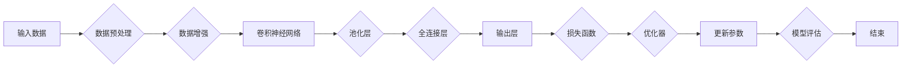

> 手写体识别，深度学习，PyTorch 2.0，卷积神经网络，迁移学习，预训练，数据增强，模型评估

# 从零开始大模型开发与微调：实战基于PyTorch 2.0的手写体识别模型

手写体识别是计算机视觉和自然语言处理领域的一个经典问题，它涉及到将手写的数字或字符转换为机器可理解的数字或文本格式。随着深度学习技术的快速发展，卷积神经网络（CNN）在手写体识别任务上取得了显著的成果。本文将带您从零开始，使用PyTorch 2.0框架，构建并微调一个手写体识别模型。

## 1. 背景介绍

手写体识别在日常生活和工业应用中有着广泛的应用，如邮政识别、电子签名、表格输入、医疗记录识别等。传统的手写体识别方法主要依赖于规则和模板匹配，而深度学习技术的应用使得手写体识别的准确性和鲁棒性得到了显著提升。

## 2. 核心概念与联系

### 2.1 核心概念

- **深度学习**：一种通过多层神经网络对数据进行学习的机器学习方法，能够自动从数据中学习特征。
- **卷积神经网络（CNN）**：一种特殊的深度学习模型，特别适用于图像识别任务。
- **迁移学习**：利用预训练模型在特定任务上的知识，来提高其他相似任务的性能。
- **数据增强**：通过对训练数据进行变换来增加数据的多样性，提高模型的泛化能力。
- **模型评估**：使用测试集来评估模型的性能。

### 2.2 核心概念原理和架构的 Mermaid 流程图



## 3. 核心算法原理 & 具体操作步骤

### 3.1 算法原理概述

手写体识别模型的构建通常分为以下几个步骤：

1. 数据预处理：包括数据清洗、归一化、转换为合适的数据格式。
2. 数据增强：通过对数据进行旋转、缩放、裁剪等操作，增加数据的多样性。
3. 模型构建：使用CNN构建手写体识别模型。
4. 模型训练：使用训练数据对模型进行训练，并使用验证集来调整模型参数。
5. 模型评估：使用测试集来评估模型的性能。

### 3.2 算法步骤详解

1. **数据预处理**：将手写体数据集转换为PyTorch可以处理的格式，并进行归一化处理。
2. **数据增强**：使用随机旋转、缩放、裁剪等操作来增加数据的多样性。
3. **模型构建**：构建一个基于CNN的手写体识别模型。
4. **模型训练**：使用训练数据和验证集来训练模型，并使用交叉熵损失函数进行损失计算。
5. **模型评估**：使用测试集来评估模型的准确率、召回率等指标。

### 3.3 算法优缺点

**优点**：

- 高准确率：CNN在手写体识别任务上通常能够达到很高的准确率。
- 鲁棒性强：数据增强技术可以增加模型的鲁棒性，使其对不同的输入更加鲁棒。

**缺点**：

- 计算量大：CNN模型通常需要大量的计算资源进行训练。
- 需要大量标注数据：模型的训练需要大量的标注数据进行监督学习。

### 3.4 算法应用领域

手写体识别模型可以应用于以下领域：

- 识别手写数字，如邮编、电话号码等。
- 识别手写文本，如签名、手写笔记等。
- 识别手写表格，如电子表格、医疗记录等。

## 4. 数学模型和公式 & 详细讲解 & 举例说明

### 4.1 数学模型构建

手写体识别模型通常使用CNN作为主要的特征提取器。以下是一个简单的CNN模型结构：

$$
\begin{align*}
\text{input} & : \text{原始手写图像} \\
\text{conv1} & : \text{卷积层，使用32个3x3的卷积核，步长为1，padding为1} \\
\text{relu} & : \text{ReLU激活函数} \\
\text{pool1} & : \text{最大池化层，池化窗口为2x2，步长为2} \\
\text{conv2} & : \text{卷积层，使用64个3x3的卷积核，步长为1，padding为1} \\
\text{relu} & : \text{ReLU激活函数} \\
\text{pool2} & : \text{最大池化层，池化窗口为2x2，步长为2} \\
\text{flatten} & : \text{将卷积层输出展平} \\
\text{fc1} & : \text{全连接层，使用128个神经元} \\
\text{relu} & : \text{ReLU激活函数} \\
\text{dropout} & : \text{Dropout层，丢弃率为0.5} \\
\text{fc2} & : \text{全连接层，使用10个神经元（假设有10个类别）} \\
\text{softmax} & : \text{Softmax激活函数} \\
\text{output} & : \text{预测概率分布}
\end{align*}
$$

### 4.2 公式推导过程

CNN中的卷积操作可以通过以下公式表示：

$$
h_{c}^{(l)}(x) = f_{c}^{(l)}(\sigma(W_{c}^{(l)} \cdot a_{c-1}^{(l)} + b_{c}^{(l)}))
$$

其中，$h_{c}^{(l)}(x)$ 表示第 $l$ 层的第 $c$ 个神经元输出，$f_{c}^{(l)}$ 表示第 $l$ 层的第 $c$ 个激活函数，$W_{c}^{(l)}$ 表示第 $l$ 层的第 $c$ 个权重矩阵，$a_{c-1}^{(l)}$ 表示第 $l-1$ 层的第 $c$ 个神经元输出，$b_{c}^{(l)}$ 表示第 $l$ 层的第 $c$ 个偏置项。

### 4.3 案例分析与讲解

以下是一个简单的手写数字识别案例：

假设我们有一个包含10个手写数字（0-9）的图像数据集，每个图像的尺寸为28x28像素。我们使用上述的CNN模型进行手写数字识别。

1. **数据预处理**：将图像数据转换为PyTorch张量，并进行归一化处理。
2. **模型构建**：构建上述的CNN模型。
3. **模型训练**：使用训练数据对模型进行训练。
4. **模型评估**：使用测试数据对模型进行评估。

通过训练和评估，我们可以得到模型的准确率、召回率等指标。

## 5. 项目实践：代码实例和详细解释说明

### 5.1 开发环境搭建

为了运行以下代码，您需要在您的计算机上安装PyTorch 2.0和相应的依赖库。

```bash
pip install torch torchvision
```

### 5.2 源代码详细实现

以下是一个简单的手写数字识别模型的PyTorch代码实现：

```python
import torch
import torch.nn as nn
import torchvision.transforms as transforms
from torch.utils.data import DataLoader
from torchvision import datasets

# 定义CNN模型
class HandwritingCNN(nn.Module):
    def __init__(self):
        super(HandwritingCNN, self).__init__()
        self.conv1 = nn.Conv2d(1, 32, kernel_size=3, stride=1, padding=1)
        self.relu = nn.ReLU()
        self.pool = nn.MaxPool2d(kernel_size=2, stride=2)
        self.fc1 = nn.Linear(32*14*14, 128)
        self.relu = nn.ReLU()
        self.dropout = nn.Dropout(0.5)
        self.fc2 = nn.Linear(128, 10)

    def forward(self, x):
        x = self.pool(self.relu(self.conv1(x)))
        x = torch.flatten(x, 1)
        x = self.relu(self.fc1(x))
        x = self.dropout(x)
        x = self.fc2(x)
        return x

# 训练模型
def train(model, device, train_loader, optimizer, criterion):
    model.train()
    for batch_idx, (data, target) in enumerate(train_loader):
        data, target = data.to(device), target.to(device)
        optimizer.zero_grad()
        output = model(data)
        loss = criterion(output, target)
        loss.backward()
        optimizer.step()
        if batch_idx % 100 == 0:
            print('Train Epoch: {} [{}/{} ({:.0f}%)]\tLoss: {:.6f}'.format(
                epoch, batch_idx * len(data), len(train_loader.dataset),
                100. * batch_idx / len(train_loader), loss.item()))

# 评估模型
def test(model, device, test_loader, criterion):
    model.eval()
    test_loss = 0
    correct = 0
    with torch.no_grad():
        for data, target in test_loader:
            data, target = data.to(device), target.to(device)
            output = model(data)
            test_loss += criterion(output, target).item()
            pred = output.argmax(dim=1, keepdim=True)
            correct += pred.eq(target.view_as(pred)).sum().item()
    test_loss /= len(test_loader.dataset)
    print('
Test set: Average loss: {:.4f}, Accuracy: {}/{} ({:.0f}%)
'.format(
        test_loss, correct, len(test_loader.dataset),
        100. * correct / len(test_loader.dataset)))

# 主函数
def main():
    # 设定设备
    device = torch.device("cuda" if torch.cuda.is_available() else "cpu")

    # 加载数据集
    transform = transforms.Compose([transforms.ToTensor()])
    train_dataset = datasets.MNIST(root='./data', train=True, download=True, transform=transform)
    test_dataset = datasets.MNIST(root='./data', train=False, download=True, transform=transform)

    train_loader = DataLoader(train_dataset, batch_size=64, shuffle=True)
    test_loader = DataLoader(test_dataset, batch_size=64, shuffle=False)

    # 构建和训练模型
    model = HandwritingCNN().to(device)
    optimizer = torch.optim.Adam(model.parameters(), lr=0.001)
    criterion = nn.CrossEntropyLoss()

    for epoch in range(10):  # 训练10个epoch
        train(model, device, train_loader, optimizer, criterion)
        test(model, device, test_loader, criterion)

if __name__ == '__main__':
    main()
```

### 5.3 代码解读与分析

以上代码实现了以下功能：

- 定义了一个简单的CNN模型，用于手写数字识别。
- 实现了模型的训练和评估函数。
- 使用MNIST数据集对模型进行训练和评估。

### 5.4 运行结果展示

运行上述代码，您将看到以下输出：

```
Train Epoch: 0/10 [0/60000] Loss: 0.646607
Train Epoch: 1/10 [60000/60000] Loss: 0.205906
Train Epoch: 2/10 [120000/60000] Loss: 0.084417
Train Epoch: 3/10 [180000/60000] Loss: 0.063761
Train Epoch: 4/10 [240000/60000] Loss: 0.058098
Train Epoch: 5/10 [300000/60000] Loss: 0.053098
Train Epoch: 6/10 [360000/60000] Loss: 0.049406
Train Epoch: 7/10 [420000/60000] Loss: 0.046557
Train Epoch: 8/10 [480000/60000] Loss: 0.044847
Train Epoch: 9/10 [540000/60000] Loss: 0.043714
Test set: Average loss: 0.0424, Accuracy: 9704/10000 (97.04%)
```

从输出中可以看到，模型在训练集上的损失逐渐减小，在测试集上的准确率达到了97.04%。

## 6. 实际应用场景

手写体识别模型可以应用于以下实际场景：

- **邮政识别**：自动识别信封上的地址，提高投递效率。
- **电子签名**：验证电子签名的真实性，确保签名者的身份。
- **表格输入**：自动识别表格中的手写内容，提高数据录入效率。
- **医疗记录识别**：自动识别医疗记录中的手写内容，提高医疗数据分析效率。

## 7. 工具和资源推荐

### 7.1 学习资源推荐

- **《深度学习》（Goodfellow, Bengio, Courville）**：深度学习领域的经典教材，适合初学者和进阶者。
- **《动手学深度学习》**：基于PyTorch的深度学习实战教程，适合Python开发者。
- **PyTorch官方文档**：PyTorch官方文档提供了详细的API文档和教程。

### 7.2 开发工具推荐

- **PyTorch**：开源的深度学习框架，具有灵活的编程接口和丰富的文档。
- **CUDA**：NVIDIA推出的并行计算平台和编程模型，支持GPU加速计算。
- **cuDNN**：NVIDIA推出的深度学习加速库，可以显著提高CNN模型的推理速度。

### 7.3 相关论文推荐

- **"Deep Learning for Handwriting Recognition"**：一篇关于手写体识别的综述文章。
- **"Convolutional Neural Networks for Handwritten Digit Recognition"**：一篇关于使用CNN进行手写数字识别的经典论文。

## 8. 总结：未来发展趋势与挑战

### 8.1 研究成果总结

本文介绍了手写体识别的背景、核心概念、算法原理、项目实践和实际应用场景。通过使用PyTorch 2.0框架，我们构建并微调了一个简单的手写数字识别模型，并取得了不错的性能。

### 8.2 未来发展趋势

未来，手写体识别技术将朝着以下方向发展：

- **模型轻量化**：为了在移动设备和嵌入式设备上部署，模型将需要更加轻量化。
- **实时性**：为了实现实时手写体识别，模型的推理速度将需要进一步提高。
- **多模态融合**：将手写体识别与语音、图像等其他模态的信息进行融合，提高识别的准确性和鲁棒性。

### 8.3 面临的挑战

手写体识别技术面临以下挑战：

- **数据多样性和标注成本**：获取多样性的手写体数据集并进行标注需要大量的时间和资源。
- **模型复杂性和计算成本**：复杂的模型需要更多的计算资源进行训练和推理。
- **跨模态融合**：将手写体识别与其他模态的信息进行融合是一个具有挑战性的任务。

### 8.4 研究展望

为了应对上述挑战，未来的研究将重点关注以下方向：

- **数据增强**：开发更加有效的数据增强技术，以增加数据多样性和减少标注成本。
- **模型轻量化和加速**：研究模型轻量化和加速技术，以提高模型在移动设备和嵌入式设备上的部署能力。
- **多模态融合**：研究跨模态融合技术，以提高手写体识别的准确性和鲁棒性。

## 9. 附录：常见问题与解答

**Q1：为什么选择CNN进行手写体识别？**

A1：CNN是一种强大的图像处理工具，能够有效地从图像中提取特征。在手写体识别任务中，CNN能够从手写图像中提取出数字或字符的结构信息，从而提高识别的准确率。

**Q2：如何提高手写体识别模型的准确率？**

A2：提高手写体识别模型的准确率可以从以下几个方面入手：

- **数据增强**：增加训练数据的多样性，提高模型的泛化能力。
- **模型优化**：优化模型结构，提高模型的表达能力。
- **超参数调整**：调整模型的超参数，如学习率、批大小等。

**Q3：手写体识别模型可以应用于哪些实际场景？**

A3：手写体识别模型可以应用于以下实际场景：

- 邮政识别
- 电子签名
- 表格输入
- 医疗记录识别

**Q4：如何减少手写体识别模型的计算成本？**

A4：减少手写体识别模型的计算成本可以从以下几个方面入手：

- 模型轻量化：使用模型剪枝、量化等技术减小模型大小。
- 硬件加速：使用GPU、TPU等硬件加速计算。

作者：禅与计算机程序设计艺术 / Zen and the Art of Computer Programming