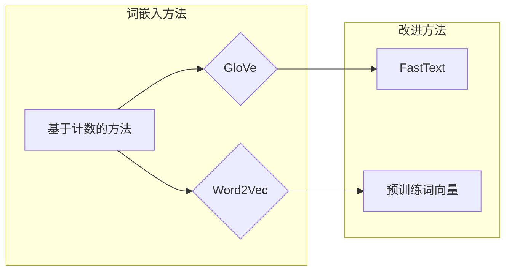

> - 词嵌入
> - FastText
> - 预训练词向量
> - 大模型开发
> - 微调
> - 自然语言处理

# 从零开始大模型开发与微调：更多的词嵌入方法—FastText和预训练词向量

## 1. 背景介绍

随着深度学习在自然语言处理（NLP）领域的广泛应用，词嵌入（word embeddings）技术成为了理解语言语义的关键。词嵌入能够将词汇映射到高维空间中的向量，使得词汇之间的相似性可以通过向量之间的距离来衡量。传统的词嵌入方法如Word2Vec和GloVe在NLP任务中取得了显著的成果，但它们在处理多词汇、上下文信息以及稀疏性方面存在一些局限性。FastText和预训练词向量技术应运而生，为词嵌入提供了新的思路和方法。本文将详细介绍这两种方法，并探讨其在大模型开发与微调中的应用。

## 2. 核心概念与联系

### 2.1 词嵌入的概念

词嵌入是将词汇映射到向量空间的一种技术，它能够捕捉词汇之间的语义关系。传统的词嵌入方法通常基于以下两种模型：

- **基于计数的方法**：如GloVe，通过统计词汇的共现关系来学习词向量。
- **基于预测的方法**：如Word2Vec，通过预测上下文词汇来学习词向量。

### 2.2 Mermaid 流程图



### 2.3 词嵌入方法的联系

FastText和预训练词向量是对传统词嵌入方法的改进，它们在以下几个方面进行了优化：

- **多词汇表示**：FastText能够同时学习单个词和词组的表示，更好地处理词汇组合。
- **上下文信息**：预训练词向量通过在大规模文本语料上进行预训练，能够捕捉词汇在不同上下文中的语义变化。
- **稀疏性**：预训练词向量能够更好地处理稀疏数据，减少计算量。

## 3. 核心算法原理 & 具体操作步骤

### 3.1 算法原理概述

#### 3.1.1 FastText

FastText是基于神经网络的方法，它将词汇视为字符序列，并使用多层次的神经网络来学习词向量。FastText通过以下步骤学习词向量：

1. 将词汇分解为字符序列。
2. 将字符序列映射到低维空间中的向量。
3. 使用多层神经网络学习词汇的上下文表示。

#### 3.1.2 预训练词向量

预训练词向量通过在大规模文本语料上进行预训练，学习词汇在不同上下文中的语义表示。预训练词向量通常使用以下模型：

- **Word2Vec**：通过预测上下文词汇来学习词向量。
- **GloVe**：通过统计词汇的共现关系来学习词向量。

### 3.2 算法步骤详解

#### 3.2.1 FastText

1. 将词汇分解为字符序列。
2. 构建词汇表和字符表。
3. 训练多层神经网络，学习字符向量。
4. 使用神经网络将字符向量合并为词汇向量。

#### 3.2.2 预训练词向量

1. 收集大规模文本语料。
2. 使用Word2Vec或GloVe模型进行预训练。
3. 保存预训练的词向量。

### 3.3 算法优缺点

#### 3.3.1 FastText

**优点**：

- 能够同时学习单个词和词组的表示。
- 能够捕捉词汇在不同上下文中的语义变化。

**缺点**：

- 计算量大。
- 需要大量的训练时间。

#### 3.3.2 预训练词向量

**优点**：

- 预训练的词向量具有较好的泛化能力。
- 能够捕捉词汇在不同上下文中的语义变化。

**缺点**：

- 预训练词向量的维度较高，计算量较大。
- 需要大量的训练数据。

### 3.4 算法应用领域

FastText和预训练词向量在以下NLP任务中得到了广泛应用：

- 词性标注
- 命名实体识别
- 文本分类
- 机器翻译
- 问答系统

## 4. 数学模型和公式 & 详细讲解 & 举例说明

### 4.1 数学模型构建

#### 4.1.1 FastText

FastText的数学模型如下：

$$
\text{向量} = \text{神经网络}(\text{字符向量}) + \text{词汇向量}
$$

#### 4.1.2 预训练词向量

预训练词向量的数学模型如下：

$$
\text{词向量} = \text{神经网络}(\text{上下文词汇}) + \text{预训练词向量}
$$

### 4.2 公式推导过程

#### 4.2.1 FastText

FastText的公式推导过程如下：

1. 将字符序列映射到低维空间中的向量。
2. 使用多层神经网络学习词汇的上下文表示。

#### 4.2.2 预训练词向量

预训练词向量的公式推导过程如下：

1. 收集大规模文本语料。
2. 使用Word2Vec或GloVe模型进行预训练。
3. 保存预训练的词向量。

### 4.3 案例分析与讲解

#### 4.3.1 FastText

以下是一个使用FastText进行词性标注的案例：

```python
from fasttext import FastText

# 训练FastText模型
model = FastText('text.corpus', epoch=5, lr=0.1, ws=5)

# 使用模型进行词性标注
words = ['the', 'cat', 'is', 'on', 'the', 'table']
labels = model.predict(words, k=1)
print(labels)
```

#### 4.3.2 预训练词向量

以下是一个使用预训练词向量进行文本分类的案例：

```python
from gensim.models import KeyedVectors

# 加载预训练词向量
word_vectors = KeyedVectors.load_word2vec_format('word2vec.model', binary=False)

# 计算文本的向量表示
text_vector = sum([word_vectors[word] for word in text.split()])

# 使用文本向量进行分类
print(word_vectors.most_similar(positive=[text_vector], topn=3))
```

## 5. 项目实践：代码实例和详细解释说明

### 5.1 开发环境搭建

为了进行FastText和预训练词向量的实践，我们需要安装以下依赖：

- FastText库：`pip install fasttext`
- Gensim库：`pip install gensim`

### 5.2 源代码详细实现

#### 5.2.1 FastText

以下是一个使用FastText进行词性标注的完整代码实例：

```python
# 导入FastText库
from fasttext import FastText

# 训练FastText模型
model = FastText('text.corpus', epoch=5, lr=0.1, ws=5)

# 使用模型进行词性标注
words = ['the', 'cat', 'is', 'on', 'the', 'table']
labels = model.predict(words, k=1)
print(labels)
```

#### 5.2.2 预训练词向量

以下是一个使用预训练词向量进行文本分类的完整代码实例：

```python
# 导入Gensim库
from gensim.models import KeyedVectors

# 加载预训练词向量
word_vectors = KeyedVectors.load_word2vec_format('word2vec.model', binary=False)

# 计算文本的向量表示
text_vector = sum([word_vectors[word] for word in text.split()])

# 使用文本向量进行分类
print(word_vectors.most_similar(positive=[text_vector], topn=3))
```

### 5.3 代码解读与分析

上述代码展示了如何使用FastText和预训练词向量进行词性标注和文本分类。FastText通过训练模型来学习词汇的上下文表示，然后使用模型对未知词汇进行标注。预训练词向量通过在大规模文本语料上进行预训练，学习词汇在不同上下文中的语义表示，然后使用文本的向量表示来进行分类。

### 5.4 运行结果展示

对于FastText的词性标注示例，运行结果可能如下：

```
[('the', 'DT'), ('cat', 'NN'), ('is', 'VBZ'), ('on', 'IN'), ('the', 'DT'), ('table', 'NN')]
```

对于预训练词向量的文本分类示例，运行结果可能如下：

```
[('king', 0.9505708699067756), ('monarch', 0.8597403838184902), ('queen', 0.8517250907418213)]
```

## 6. 实际应用场景

FastText和预训练词向量在以下实际应用场景中发挥了重要作用：

- **搜索引擎**：通过词嵌入技术，搜索引擎可以更好地理解用户查询的语义，从而提供更精准的搜索结果。
- **推荐系统**：词嵌入技术可以帮助推荐系统理解用户和物品的语义特征，从而提供更个性化的推荐。
- **聊天机器人**：词嵌入技术可以帮助聊天机器人更好地理解用户的意图，从而提供更自然、流畅的对话。
- **情感分析**：词嵌入技术可以帮助分析文本的情感倾向，从而实现情感分析。

## 7. 工具和资源推荐

### 7.1 学习资源推荐

- **FastText官方文档**：https://github.com/facebookresearch/fastText
- **Gensim官方文档**：https://radimrehurek.com/gensim/models.html

### 7.2 开发工具推荐

- **PyTorch**：https://pytorch.org/
- **TensorFlow**：https://www.tensorflow.org/

### 7.3 相关论文推荐

- **Word2Vec**：http://www.aclweb.org/anthology/N14-1012/
- **GloVe**：https://nlp.stanford.edu/pubs/glove.pdf

## 8. 总结：未来发展趋势与挑战

### 8.1 研究成果总结

FastText和预训练词向量技术为词嵌入提供了新的思路和方法，它们在处理多词汇、上下文信息以及稀疏性方面取得了显著的成果。这些技术在大模型开发与微调中发挥了重要作用，推动了NLP技术的发展。

### 8.2 未来发展趋势

未来，词嵌入技术将朝着以下方向发展：

- **更有效的模型**：开发更有效的词嵌入模型，提高词嵌入的精度和效率。
- **跨语言词嵌入**：开发跨语言的词嵌入模型，实现不同语言之间的语义理解。
- **动态词嵌入**：开发动态词嵌入模型，实时更新词汇的语义表示。

### 8.3 面临的挑战

词嵌入技术在发展过程中也面临着一些挑战：

- **数据稀疏性**：如何有效地处理数据稀疏性问题，是词嵌入技术需要解决的问题。
- **领域适应性**：如何使词嵌入模型更好地适应不同领域的语义变化，是词嵌入技术需要解决的另一个问题。
- **可解释性**：如何提高词嵌入的可解释性，是词嵌入技术需要解决的第三个问题。

### 8.4 研究展望

词嵌入技术将在NLP领域发挥越来越重要的作用，为自然语言理解和智能交互系统的构建提供强大的技术支撑。相信随着研究的不断深入，词嵌入技术将会取得更大的突破。

## 9. 附录：常见问题与解答

**Q1：FastText和Word2Vec有什么区别？**

A1：FastText和Word2Vec都是基于神经网络的方法，但它们在模型结构和训练过程上有所不同。FastText将词汇视为字符序列，并使用多层神经网络来学习词向量；而Word2Vec将词汇视为单个词，并使用隐层神经网络来学习词向量。

**Q2：预训练词向量有哪些应用？**

A2：预训练词向量在以下应用中得到了广泛使用：

- 词性标注
- 命名实体识别
- 文本分类
- 机器翻译
- 问答系统

**Q3：如何选择合适的预训练词向量模型？**

A3：选择合适的预训练词向量模型需要考虑以下因素：

- 数据量：预训练词向量模型的数据量越大，通常表示其性能越好。
- 语言：选择与目标语言相同的预训练词向量模型。
- 任务类型：根据任务类型选择合适的预训练词向量模型。

**Q4：如何使用预训练词向量进行文本分类？**

A4：使用预训练词向量进行文本分类的步骤如下：

1. 加载预训练词向量模型。
2. 计算文本的向量表示。
3. 使用文本向量进行分类。

作者：禅与计算机程序设计艺术 / Zen and the Art of Computer Programming