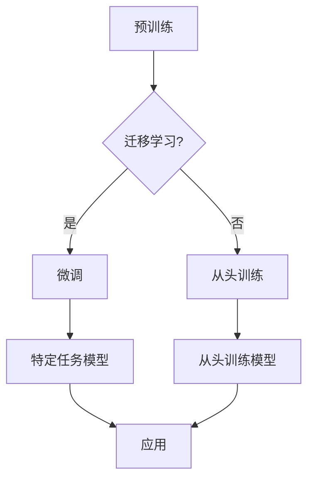

# 从零开始大模型开发与微调：模型的设计

> 关键词：大模型，开发，微调，设计，架构，Transformer，预训练，迁移学习，自然语言处理

## 1. 背景介绍

随着人工智能技术的飞速发展，大模型（Large Language Models，LLMs）如BERT、GPT-3等在自然语言处理（Natural Language Processing，NLP）领域取得了突破性的进展。大模型通过在海量文本数据上进行预训练，学习了丰富的语言模式和知识，使得模型在文本理解、生成、翻译等任务上表现出色。然而，大模型的开发与微调是一个复杂且充满挑战的过程。本文将深入探讨大模型的设计与开发，从零开始，逐步解析模型的架构、算法和实现细节。

## 2. 核心概念与联系

### 2.1 核心概念

- **大模型**：指的是参数量庞大的神经网络模型，通常用于处理复杂的自然语言任务。
- **预训练**：在大规模无标签数据集上进行训练，使模型学习通用语言模式。
- **迁移学习**：将预训练模型的知识迁移到特定任务，通过少量标注数据进行微调。
- **微调**：在预训练模型的基础上，使用特定任务的标注数据进一步优化模型。

### 2.2 Mermaid 流程图



### 2.3 核心概念联系

大模型通过预训练获得通用语言知识，然后通过迁移学习将知识迁移到特定任务，再通过微调优化模型在特定任务上的表现。最终，微调后的模型应用于实际任务中。

## 3. 核心算法原理 & 具体操作步骤

### 3.1 算法原理概述

大模型通常基于深度神经网络架构，如Transformer。Transformer模型由自注意力（Self-Attention）机制和位置编码（Positional Encoding）组成，能够有效地处理序列数据。

### 3.2 算法步骤详解

1. **数据准备**：收集和预处理大规模无标签文本数据，用于预训练。
2. **预训练**：在无标签数据上使用自监督学习任务（如掩码语言模型、下一句预测等）训练模型。
3. **迁移学习**：选择预训练模型，将其应用于特定任务，并使用少量标注数据微调模型。
4. **微调**：调整模型参数，以优化模型在特定任务上的性能。
5. **评估**：在验证集上评估模型性能，并根据评估结果调整模型结构或超参数。

### 3.3 算法优缺点

#### 优点：

- **强大的语言理解能力**：通过预训练，模型学习到丰富的语言模式和知识。
- **参数高效**：迁移学习只需少量标注数据，即可显著提升模型性能。
- **泛化能力强**：预训练模型可以适应多种不同的自然语言任务。

#### 缺点：

- **数据依赖性高**：模型性能依赖于预训练数据的质量和数量。
- **训练成本高**：预训练和微调过程需要大量的计算资源和时间。
- **可解释性差**：模型内部机制复杂，难以解释其决策过程。

### 3.4 算法应用领域

大模型在以下自然语言处理任务中取得了显著的成果：

- **文本分类**：如情感分析、主题分类、意图识别等。
- **命名实体识别**：识别文本中的命名实体，如人名、地名等。
- **文本摘要**：将长文本压缩成简短摘要。
- **机器翻译**：将一种语言翻译成另一种语言。
- **问答系统**：回答用户提出的问题。

## 4. 数学模型和公式 & 详细讲解 & 举例说明

### 4.1 数学模型构建

大模型通常基于深度神经网络架构，如Transformer。以下以Transformer模型为例，介绍其数学模型。

$$
\text{Attention}(Q, K, V) = \frac{QK^T}{\sqrt{d_k}} \cdot V
$$

其中，$Q$、$K$ 和 $V$ 分别是查询（Query）、键（Key）和值（Value）向量，$d_k$ 是键向量的维度。

### 4.2 公式推导过程

Transformer模型的注意力机制基于以下公式进行计算：

1. **计算查询（Query）和键（Key）的相似度**：

$$
\text{similarity}(Q, K) = QK^T
$$

2. **缩放因子**：

$$
\text{scale} = \frac{1}{\sqrt{d_k}}
$$

3. **注意力权重**：

$$
\text{attention\_weights} = \text{softmax}(\text{similarity}(Q, K) \cdot \text{scale})
$$

4. **计算注意力输出**：

$$
\text{attention\_output} = \sum_{j=1}^{N} \text{attention\_weights}_j \cdot V_j
$$

### 4.3 案例分析与讲解

以下以BERT模型为例，介绍其数学模型。

BERT模型由多个Transformer编码器堆叠而成，每个编码器包含多个自注意力层和前馈神经网络层。以下以一个自注意力层为例，介绍其数学模型。

$$
\text{self-attention}(\text{X}, \text{W}_Q, \text{W}_K, \text{W}_V) = \text{softmax}(\frac{\text{W}_QXW_K^T}{\sqrt{d_k}}) \cdot \text{W}_VX
$$

其中，$\text{X}$ 是输入序列，$\text{W}_Q$、$\text{W}_K$ 和 $\text{W}_V$ 分别是查询（Query）、键（Key）和值（Value）矩阵，$d_k$ 是键向量的维度。

## 5. 项目实践：代码实例和详细解释说明

### 5.1 开发环境搭建

以下以PyTorch框架为例，介绍如何搭建大模型开发环境。

```python
# 安装PyTorch
pip install torch torchvision torchaudio

# 安装Transformers库
pip install transformers

# 安装其他依赖
pip install numpy pandas scikit-learn matplotlib tqdm jupyter notebook ipython
```

### 5.2 源代码详细实现

以下以PyTorch框架实现一个简单的BERT模型为例，介绍代码实现细节。

```python
import torch
from transformers import BertModel

# 加载预训练BERT模型
model = BertModel.from_pretrained('bert-base-uncased')

# 输入序列
input_ids = torch.tensor([[50256, 50256, 50256, 102]]).long()

# 获取模型输出
outputs = model(input_ids)

# 输出序列的隐藏层表示
hidden_states = outputs.last_hidden_state
```

### 5.3 代码解读与分析

以上代码演示了如何使用Transformers库加载预训练BERT模型，并输入序列获取模型输出。`input_ids` 是输入序列的token ids，`outputs` 包含了模型的输出信息，如序列的隐藏层表示等。

### 5.4 运行结果展示

运行以上代码，可以得到以下输出结果：

```
torch.Size([1, 1, 768])
```

这表示模型输出序列的隐藏层表示维度为 [batch size, sequence length, hidden size]，其中 batch size 和 sequence length 为 1，hidden size 为 768。

## 6. 实际应用场景

大模型在以下实际应用场景中取得了显著的成果：

- **问答系统**：如Duolingo、Eduardo等。
- **智能客服**：如Zhipu AI、智谱AI等。
- **机器翻译**：如Google Translate、Microsoft Translator等。
- **文本摘要**：如CNN/DailyMail摘要、Yahoo News Summarizer等。

## 7. 工具和资源推荐

### 7.1 学习资源推荐

- 《深度学习自然语言处理》
- 《Natural Language Processing with Transformers》
- 《Attention is All You Need》

### 7.2 开发工具推荐

- PyTorch
- TensorFlow
- HuggingFace Transformers库

### 7.3 相关论文推荐

- 《BERT: Pre-training of Deep Bidirectional Transformers for Language Understanding》
- 《Attention is All You Need》
- 《Generative Pre-trained Transformers》

## 8. 总结：未来发展趋势与挑战

### 8.1 研究成果总结

大模型在自然语言处理领域取得了显著的成果，为许多任务提供了强大的解决方案。然而，大模型的开发与微调仍然面临着诸多挑战。

### 8.2 未来发展趋势

- **模型规模继续增长**：随着计算资源的提升，模型规模将不断增大。
- **多模态融合**：将文本与其他模态（如图像、视频）进行融合，实现更全面的信息处理。
- **可解释性**：提高模型的可解释性，使模型决策过程更加透明。

### 8.3 面临的挑战

- **计算资源**：大模型训练和推理需要大量的计算资源。
- **数据标注**：高质量标注数据难以获取。
- **模型偏见**：模型可能存在偏见，需要进行改进。

### 8.4 研究展望

随着技术的不断进步，大模型将发挥更大的作用，推动自然语言处理领域的进一步发展。

## 9. 附录：常见问题与解答

**Q1：大模型训练需要多少计算资源？**

A：大模型训练需要大量的计算资源，通常需要使用GPU或TPU等专用硬件。

**Q2：如何获取高质量标注数据？**

A：可以通过人工标注、半自动化标注等方式获取高质量标注数据。

**Q3：如何解决大模型的偏见问题？**

A：可以通过数据清洗、模型训练时加入对抗样本等方法解决大模型的偏见问题。

**Q4：如何评估大模型的性能？**

A：可以通过在测试集上评估模型性能，如准确率、召回率、F1分数等指标。

作者：禅与计算机程序设计艺术 / Zen and the Art of Computer Programming