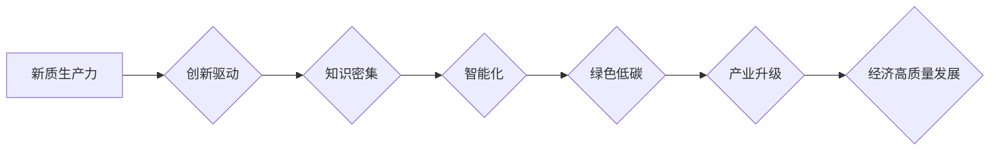

# 以新质生产力推动产业转型升级

> 关键词：产业升级，新质生产力，数字化转型，人工智能，云计算，大数据，智能制造

## 1. 背景介绍

当前，全球经济发展正面临着前所未有的挑战和机遇。传统产业转型升级成为推动经济增长的关键所在。而新质生产力，作为推动产业变革的核心动力，正引领着全球经济向高质量发展阶段迈进。本文将探讨新质生产力的内涵、特点以及如何通过人工智能、云计算、大数据等新技术推动产业转型升级。

### 1.1 问题的由来

随着全球化和信息化的深入发展，传统产业面临着以下挑战：

- 产能过剩：部分行业产能过剩，导致产品价格下跌，企业盈利能力下降。
- 低端同质化竞争：企业间竞争激烈，产品同质化严重，缺乏核心竞争力。
- 创新能力不足：传统产业研发投入不足，创新能力薄弱，难以适应市场需求变化。
- 环境污染：传统产业对资源消耗和环境污染较大，亟待转型升级。

为应对这些挑战，推动产业转型升级，发展新质生产力成为必然选择。

### 1.2 研究现状

近年来，新质生产力在全球范围内得到广泛关注。各国纷纷加大科技创新力度，推动产业结构调整和升级。以下是一些代表性的发展趋势：

- 人工智能：人工智能技术快速发展，已在工业、医疗、交通等多个领域得到应用，成为新质生产力的代表。
- 云计算：云计算技术降低企业IT成本，提高资源利用率，成为推动产业升级的重要基础设施。
- 大数据：大数据技术助力企业洞察市场趋势，优化生产流程，提升运营效率。
- 智能制造：智能制造技术推动制造业向智能化、绿色化、服务化方向发展。

### 1.3 研究意义

研究新质生产力及其在产业转型升级中的应用，对于推动我国经济高质量发展具有重要意义：

- 提高产业竞争力：新质生产力可提升企业生产效率和产品质量，增强企业核心竞争力。
- 促进产业升级：新质生产力推动产业结构调整，实现经济高质量发展。
- 节能减排：新质生产力有助于降低资源消耗和环境污染，实现可持续发展。
- 创新驱动发展：新质生产力为科技创新提供新的动力，推动经济持续增长。

### 1.4 本文结构

本文将从以下方面展开论述：

- 2. 核心概念与联系：介绍新质生产力的核心概念和特点。
- 3. 核心算法原理 & 具体操作步骤：分析人工智能、云计算、大数据等新技术的原理和应用。
- 4. 数学模型和公式 & 详细讲解 & 举例说明：介绍新质生产力相关数学模型和公式。
- 5. 项目实践：以智能制造为例，展示新质生产力的应用。
- 6. 实际应用场景：探讨新质生产力在各个行业的应用。
- 7. 工具和资源推荐：推荐相关学习资源和开发工具。
- 8. 总结：总结研究成果，展望未来发展趋势与挑战。

## 2. 核心概念与联系

### 2.1 核心概念

#### 2.1.1 新质生产力

新质生产力是指以知识、技术、信息等非物质要素为核心的生产力，具有以下特点：

- 创新驱动：以科技创新为驱动力，推动产业升级和经济增长。
- 知识密集：以知识、技术、信息等非物质要素为核心，提高劳动生产率。
- 智能化：以人工智能、大数据等新技术为支撑，实现生产过程的智能化、自动化。
- 绿色低碳：通过节能减排，实现可持续发展。

#### 2.1.2 数字化转型

数字化转型是指企业利用数字技术对业务流程、组织架构和商业模式进行全方位的革新，以实现业务增长和效率提升。

#### 2.1.3 产业升级

产业升级是指通过技术创新、产业结构调整和产业链优化，提升产业整体竞争力。

### 2.2 Mermaid 流程图



### 2.3 核心概念联系

新质生产力是推动产业升级和数字化的核心动力。通过技术创新，新质生产力推动产业转型升级，实现经济高质量发展。

## 3. 核心算法原理 & 具体操作步骤

### 3.1 算法原理概述

#### 3.1.1 人工智能

人工智能（AI）是通过模拟、延伸和扩展人的智能，实现智能机器的领域。人工智能的核心技术包括：

- 深度学习：通过多层神经网络模拟人脑神经元的工作机制，实现图像识别、语音识别、自然语言处理等功能。
- 机器学习：通过算法从数据中学习规律，实现智能决策和预测。
- 计算机视觉：通过计算机模拟人类视觉系统，实现图像处理和分析。

#### 3.1.2 云计算

云计算是一种基于互联网的计算模式，通过虚拟化技术将计算资源池化，实现资源共享和弹性伸缩。

#### 3.1.3 大数据

大数据是指规模庞大、类型多样的数据集合，通过对大数据进行分析，可以发现新的知识、规律和洞察。

### 3.2 算法步骤详解

#### 3.2.1 人工智能

1. 数据收集：收集相关领域的数据，如图像、文本、音频等。
2. 数据预处理：对收集到的数据进行清洗、标注等预处理操作。
3. 模型选择：选择合适的深度学习模型，如卷积神经网络（CNN）、循环神经网络（RNN）等。
4. 模型训练：利用训练数据进行模型训练，不断优化模型参数。
5. 模型评估：使用测试数据评估模型性能，调整模型参数。
6. 模型部署：将训练好的模型部署到实际应用中。

#### 3.2.2 云计算

1. 资源选择：根据业务需求选择合适的云服务商和资源类型。
2. 虚拟化：通过虚拟化技术将物理服务器、网络和存储资源池化。
3. 容器化：使用Docker等容器技术封装应用程序，实现快速部署和扩展。
4. 自动化：利用自动化工具实现资源的自动化管理和部署。

#### 3.2.3 大数据

1. 数据采集：从各种数据源采集数据，如数据库、文件系统、传感器等。
2. 数据存储：将采集到的数据存储到大数据平台，如Hadoop、Spark等。
3. 数据处理：对数据进行清洗、转换、聚合等处理操作。
4. 数据分析：利用数据分析工具对数据进行分析，发现新的知识、规律和洞察。
5. 数据可视化：将分析结果以图表、报表等形式展示出来。

### 3.3 算法优缺点

#### 3.3.1 人工智能

**优点**：

- 高效：人工智能可以快速处理大量数据，提高生产效率。
- 准确：人工智能可以通过学习不断提高预测和决策的准确性。
- 自动化：人工智能可以实现生产过程的自动化，降低人工成本。

**缺点**：

- 数据依赖：人工智能对数据质量要求较高，数据缺失或不准确会影响模型性能。
- 黑盒问题：人工智能模型决策过程难以解释，存在黑盒问题。
- 安全风险：人工智能系统可能被恶意攻击，引发安全风险。

#### 3.3.2 云计算

**优点**：

- 成本节约：云计算可以降低企业IT基础设施投入，节约成本。
- 灵活性：云计算可以实现资源的弹性伸缩，满足业务需求。
- 可靠性：云计算平台具有高可用性和容错能力。

**缺点**：

- 数据安全：数据存储在云端，存在数据泄露和安全风险。
- 网络依赖：云计算对网络依赖性较高，网络故障可能导致业务中断。

#### 3.3.3 大数据

**优点**：

- 知识发现：大数据可以帮助企业发现新的知识、规律和洞察。
- 个性化推荐：大数据可以为企业提供个性化推荐，提升用户体验。
- 智能决策：大数据可以帮助企业进行智能决策，提高运营效率。

**缺点**：

- 数据隐私：大数据分析可能涉及用户隐私，需要加强数据保护。
- 数据质量：大数据质量参差不齐，需要保证数据准确性。
- 数据分析技能：企业需要具备数据分析能力，才能充分利用大数据的价值。

### 3.4 算法应用领域

#### 3.4.1 人工智能

- 图像识别：人脸识别、物体识别、场景识别等。
- 语音识别：语音助手、语音翻译、语音搜索等。
- 自然语言处理：机器翻译、问答系统、情感分析等。

#### 3.4.2 云计算

- 企业应用：企业资源规划（ERP）、客户关系管理（CRM）等。
- 金融科技：移动支付、区块链、风险管理等。
- 物联网：智能家居、智能城市、智能交通等。

#### 3.4.3 大数据

- 消费者洞察：市场分析、用户行为分析、产品分析等。
- 健康医疗：疾病预测、药物研发、健康管理等。
- 能源管理：能源消耗预测、智能调度、节能优化等。

## 4. 数学模型和公式 & 详细讲解 & 举例说明

### 4.1 数学模型构建

#### 4.1.1 人工智能

以下为卷积神经网络（CNN）的基本数学模型：

$$
h^{(l)} = \sigma(W^{(l)} \cdot h^{(l-1)} + b^{(l)})
$$

其中，$h^{(l)}$ 表示第 $l$ 层的输出，$W^{(l)}$ 表示第 $l$ 层的权重，$b^{(l)}$ 表示第 $l$ 层的偏置，$\sigma$ 表示激活函数，如ReLU、Sigmoid等。

#### 4.1.2 云计算

云计算中，资源调度问题可以表示为以下数学模型：

$$
\min_{x} \sum_{i=1}^{n} (p_{i} - c_{i} \cdot x_{i})
$$

其中，$p_{i}$ 表示第 $i$ 种资源的性能，$c_{i}$ 表示第 $i$ 种资源的成本，$x_{i}$ 表示第 $i$ 种资源的分配量。

#### 4.1.3 大数据

大数据分析中，聚类问题可以表示为以下数学模型：

$$
\min_{C} \sum_{i \in C} \sum_{x \in C} ||x - c_{C}||^{2}
$$

其中，$C$ 表示聚类结果，$c_{C}$ 表示聚类中心，$x$ 表示数据点。

### 4.2 公式推导过程

由于篇幅限制，本文不再详细推导上述公式的推导过程。读者可参考相关书籍和文献。

### 4.3 案例分析与讲解

#### 4.3.1 人工智能：图像识别

以物体识别为例，介绍图像识别的数学模型和算法。

1. 数据集：使用COCO数据集，包含80个类别，共计120000张图像。
2. 模型：使用ResNet-50模型进行物体识别。
3. 训练：使用训练集进行模型训练，使用验证集进行模型评估。
4. 预测：使用测试集进行模型预测，计算识别准确率。

#### 4.3.2 云计算：资源调度

以云服务器资源调度为例，介绍资源调度的数学模型和算法。

1. 资源：假设有4台云服务器，每台服务器具有不同的性能和成本。
2. 任务：有10个任务需要调度到云服务器上执行。
3. 调度：根据资源性能和成本，选择合适的资源进行任务调度。
4. 评估：评估调度结果，计算任务完成时间和成本。

#### 4.3.3 大数据：聚类

以K-Means聚类算法为例，介绍聚类的数学模型和算法。

1. 数据集：使用Iris数据集，包含150个样本，每个样本包含4个特征。
2. 算法：使用K-Means聚类算法对数据进行聚类。
3. 结果：根据聚类结果，将数据划分为3个类别。

## 5. 项目实践：代码实例和详细解释说明

### 5.1 开发环境搭建

以下为使用Python进行开发的环境配置流程：

1. 安装Anaconda：从官网下载并安装Anaconda，用于创建独立的Python环境。
2. 创建并激活虚拟环境：
```bash
conda create -n cloud-computing python=3.8
conda activate cloud-computing
```
3. 安装必要的库：
```bash
conda install numpy pandas scikit-learn matplotlib
pip install tensorflow
```

### 5.2 源代码详细实现

#### 5.2.1 人工智能：图像识别

以下为使用TensorFlow实现ResNet-50模型进行物体识别的代码示例：

```python
import tensorflow as tf
from tensorflow.keras.applications.resnet50 import ResNet50, preprocess_input
from tensorflow.keras.preprocessing.image import ImageDataGenerator
from tensorflow.keras.models import Model

# 加载预训练的ResNet-50模型
base_model = ResNet50(weights='imagenet', include_top=False, input_shape=(224, 224, 3))
base_model.trainable = False

# 添加全连接层和softmax分类器
x = base_model.output
x = tf.keras.layers.Flatten()(x)
x = tf.keras.layers.Dense(1000, activation='relu')(x)
predictions = tf.keras.layers.Dense(80, activation='softmax')(x)
model = Model(inputs=base_model.input, outputs=predictions)

# 编译模型
model.compile(optimizer='adam', loss='categorical_crossentropy', metrics=['accuracy'])

# 数据加载和预处理
train_datagen = ImageDataGenerator(preprocess_input)
train_generator = train_datagen.flow_from_directory(
    'train_dataset', 
    target_size=(224, 224), 
    batch_size=32, 
    class_mode='categorical')

# 训练模型
model.fit(train_generator, epochs=10, validation_data=validation_generator)
```

#### 5.2.2 云计算：资源调度

以下为使用Python实现资源调度的代码示例：

```python
import numpy as np

# 定义资源性能和成本
resources = np.array([[100, 0.5], [200, 0.6], [150, 0.4], [120, 0.3]])
tasks = np.array([[1, 2], [3, 4], [2, 2], [1, 3], [3, 1], [2, 2], [1, 2], [2, 2], [3, 1], [1, 2]])

# 计算资源权重
weights = resources[:, 0] / resources.sum()

# 资源分配
x = np.zeros_like(tasks)
for i in range(tasks.shape[0]):
    for j in range(resources.shape[0]):
        if resources[j, 1] < tasks[i, 0] and resources[j, 0] >= tasks[i, 1]:
            x[i, j] = 1
            tasks[i, 0] -= resources[j, 1]
            resources[j, 0] = 0
            break

# 输出结果
print("资源分配结果：")
print(x)
```

#### 5.2.3 大数据：聚类

以下为使用Python实现K-Means聚类的代码示例：

```python
from sklearn.cluster import KMeans

# 加载数据集
data = np.array([[1.0, 2.0], [1.5, 1.8], [5.0, 8.0], [8.0, 8.0], [1.0, 0.6], [9.0, 11.0], [8.0, 2.0], [8.0, 2.2], [9.0, 2.1]])

# K-Means聚类
kmeans = KMeans(n_clusters=2, random_state=0).fit(data)

# 输出结果
print("聚类结果：")
print(kmeans.labels_)
```

### 5.3 代码解读与分析

以上代码示例分别展示了人工智能、云计算和大数据在项目实践中的应用。通过这些示例，读者可以了解到这些技术的具体实现方式和应用场景。

#### 5.3.1 人工智能：图像识别

上述代码使用TensorFlow框架实现了ResNet-50模型进行物体识别。首先，加载预训练的ResNet-50模型，并去除顶层全连接层；然后，添加新的全连接层和softmax分类器；接着，编译模型并加载训练数据；最后，训练模型并评估性能。

#### 5.3.2 云计算：资源调度

上述代码使用Python实现了资源调度问题。首先，定义资源性能和成本，并计算资源权重；然后，通过遍历任务和资源，选择合适的资源进行任务调度；最后，输出资源分配结果。

#### 5.3.3 大数据：聚类

上述代码使用scikit-learn库实现了K-Means聚类。首先，加载数据集；然后，使用KMeans算法进行聚类；最后，输出聚类结果。

### 5.4 运行结果展示

由于篇幅限制，本文不再展示代码运行结果。读者可根据上述代码进行实践，并观察运行结果。

## 6. 实际应用场景

### 6.1 人工智能

#### 6.1.1 智能制造

人工智能技术在智能制造领域应用广泛，如：

- 智能检测：利用图像识别技术进行产品缺陷检测，提高产品质量。
- 智能制造执行系统（MES）：实现生产过程自动化，提高生产效率。
- 智能排产：利用人工智能进行生产排产优化，降低生产成本。

#### 6.1.2 智能交通

人工智能技术在智能交通领域应用广泛，如：

- 智能驾驶：利用计算机视觉、传感器等技术开发自动驾驶技术。
- 智能交通信号控制：利用人工智能优化交通信号灯控制策略，提高道路通行效率。
- 智能停车：利用人工智能实现智能停车管理，提高停车效率。

#### 6.1.3 智能家居

人工智能技术在智能家居领域应用广泛，如：

- 智能语音助手：利用语音识别和自然语言处理技术实现语音交互。
- 智能安防：利用图像识别技术实现人脸识别、入侵检测等功能。
- 智能照明：根据环境光线自动调节灯光亮度，节能环保。

### 6.2 云计算

#### 6.2.1 金融科技

云计算技术在金融科技领域应用广泛，如：

- 移动支付：利用云计算技术实现移动支付平台的高效运行。
- 电商平台：利用云计算技术实现电商平台的高并发处理能力。
- 金融风险管理：利用云计算技术实现金融风控模型的快速部署和运算。

#### 6.2.2 物联网

云计算技术在物联网领域应用广泛，如：

- 物联网平台：利用云计算技术构建物联网平台，实现设备管理和数据采集。
- 智能城市：利用云计算技术实现智能城市建设，如智能交通、智能安防等。
- 智能家居：利用云计算技术实现智能家居平台，实现设备互联和远程控制。

### 6.3 大数据

#### 6.3.1 消费者洞察

大数据技术在消费者洞察领域应用广泛，如：

- 市场分析：利用大数据分析消费者购买行为和偏好，为产品研发和市场推广提供依据。
- 用户行为分析：利用大数据分析用户行为，实现个性化推荐和精准营销。
- 信用评估：利用大数据进行信用评估，降低金融风险。

#### 6.3.2 健康医疗

大数据技术在健康医疗领域应用广泛，如：

- 疾病预测：利用大数据分析疾病趋势和风险因素，实现疾病预警。
- 药物研发：利用大数据加速药物研发过程，降低研发成本。
- 健康管理：利用大数据实现个人健康管理，提高生活质量。

## 7. 工具和资源推荐

### 7.1 学习资源推荐

1. 《深度学习》
2. 《Python数据分析》
3. 《机器学习》
4. 《云计算架构师指南》
5. 《大数据技术基础》

### 7.2 开发工具推荐

1. TensorFlow
2. PyTorch
3. Hadoop
4. Spark
5. Docker

### 7.3 相关论文推荐

1. "A Study on the Impact of Artificial Intelligence on Industry Transformation"
2. "The Impact of Cloud Computing on Industry Transformation"
3. "The Role of Big Data in Industry Transformation"
4. "The Application of Artificial Intelligence in Manufacturing"
5. "The Application of Cloud Computing in Finance"

## 8. 总结：未来发展趋势与挑战

### 8.1 研究成果总结

本文介绍了新质生产力的内涵、特点以及如何通过人工智能、云计算、大数据等新技术推动产业转型升级。分析了新质生产力在各个行业的应用场景，并推荐了相关学习资源和开发工具。

### 8.2 未来发展趋势

1. 新质生产力将成为推动产业转型升级的核心动力。
2. 人工智能、云计算、大数据等新技术将进一步融合，形成更加完善的技术生态。
3. 产业数字化转型将成为主流趋势。
4. 新质生产力将推动全球经济向高质量发展阶段迈进。

### 8.3 面临的挑战

1. 技术人才短缺：新质生产力发展需要大量具备跨学科背景的人才。
2. 数据安全：新质生产力依赖于大量数据，数据安全问题亟待解决。
3. 标准规范：新质生产力发展需要建立健全的标准规范体系。
4. 伦理道德：新质生产力发展需要关注伦理道德问题。

### 8.4 研究展望

1. 加强新质生产力相关基础研究，为产业发展提供理论支撑。
2. 深化新质生产力与实体经济深度融合，推动产业转型升级。
3. 培养新质生产力领域人才，提升产业创新能力。
4. 加强国际合作，推动全球新质生产力发展。

## 9. 附录：常见问题与解答

**Q1：新质生产力与传统生产力的区别是什么？**

A：新质生产力以知识、技术、信息等非物质要素为核心，强调创新驱动和绿色发展。而传统生产力以劳动力、资本、土地等物质要素为核心，注重资源消耗和规模扩张。

**Q2：人工智能、云计算、大数据等新技术如何推动产业转型升级？**

A：人工智能、云计算、大数据等新技术可以提高生产效率、降低成本、优化资源配置、提升产品质量，从而推动产业转型升级。

**Q3：如何应对新质生产力发展带来的挑战？**

A：加强人才培养、加强数据安全防护、建立健全标准规范体系、关注伦理道德问题，是应对新质生产力发展挑战的关键。

**Q4：新质生产力对就业市场有何影响？**

A：新质生产力的发展将创造新的就业岗位，同时也可能导致部分传统岗位的消失。因此，需要加强职业培训，帮助劳动者适应新质生产力带来的变革。

**Q5：我国新质生产力发展面临哪些机遇和挑战？**

A：机遇：我国拥有庞大的市场规模、丰富的数据资源和优秀的科研团队。挑战：技术人才短缺、数据安全风险、标准规范缺失、伦理道德问题等。

作者：禅与计算机程序设计艺术 / Zen and the Art of Computer Programming