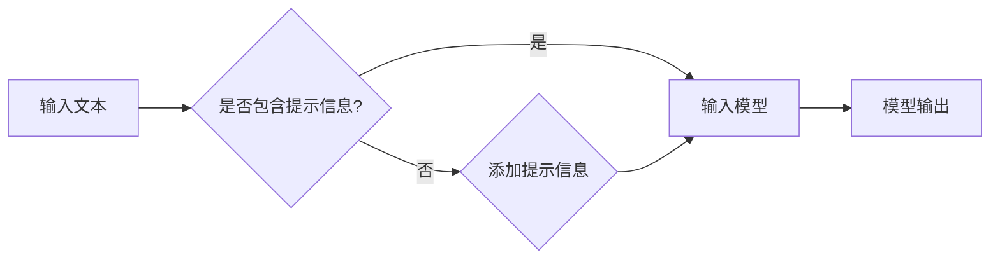

# 减少对 Prompt Engineering 依赖

> 关键词：Prompt Engineering，自然语言生成，NLP，人工智能，模型优化，少样本学习，知识蒸馏，对抗学习

## 1. 背景介绍

随着深度学习在自然语言处理（NLP）领域的广泛应用，自然语言生成（NLG）技术取得了显著的进展。Prompt Engineering 作为一种在预训练语言模型上进行少样本学习的策略，近年来受到了广泛关注。Prompt Engineering 通过设计特定的输入提示（Prompt），引导预训练模型生成更符合预期输出的文本。然而，过分依赖 Prompt Engineering 可能导致模型对特定提示的过度拟合，降低模型的泛化能力和适应性。本文将探讨减少对 Prompt Engineering 依赖的策略，并提出相应的算法原理和实际应用。

## 2. 核心概念与联系

### 2.1 Prompt Engineering

Prompt Engineering 是一种基于预训练语言模型（如 GPT-3、BERT 等）的技术，通过设计特定的输入提示，引导模型生成更符合预期的输出。这些提示通常包含一些背景信息、上下文数据或任务要求，帮助模型更好地理解任务意图。

### 2.2 Prompt Engineering 的原理

Prompt Engineering 的核心原理在于利用预训练模型中丰富的知识库和语言特征，结合特定任务的需求，设计出能够引导模型正确推理和生成的提示。以下是一个简化的 Prompt Engineering 流程：



### 2.3 Prompt Engineering 的优缺点

**优点**：

- 提高生成文本的准确性和相关性。
- 减少对大规模标注数据的需求。
- 易于理解和实现。

**缺点**：

- 过度依赖特定的提示信息，降低模型的泛化能力。
- 提示设计困难，需要大量实验和调优。
- 可能存在安全风险，如泄露敏感信息。

## 3. 核心算法原理 & 具体操作步骤

### 3.1 算法原理概述

减少对 Prompt Engineering 依赖的核心思想是提高模型的泛化能力和适应性，减少对特定提示的依赖。以下是一些实现这一目标的算法原理：

- **知识蒸馏**：将预训练模型的知识迁移到更小的模型，提高小模型在特定任务上的性能。
- **对抗学习**：通过引入对抗噪声，增强模型对输入扰动的鲁棒性。
- **少样本学习**：利用迁移学习和元学习等技术，在少量样本上快速学习新任务。

### 3.2 算法步骤详解

以下是一个基于知识蒸馏的减少对 Prompt Engineering 依赖的算法步骤：

1. **预训练模型**：选择一个性能优异的预训练语言模型作为基础模型。
2. **训练小模型**：基于基础模型，训练一个更小的模型，用于特定任务。
3. **知识蒸馏**：将基础模型的知识迁移到小模型，提高小模型在特定任务上的性能。
4. **评估与优化**：在特定任务上评估小模型的性能，并根据评估结果对模型进行调整。

### 3.3 算法优缺点

**优点**：

- 提高模型的泛化能力，减少对特定提示的依赖。
- 降低模型复杂度，提高推理速度。
- 提高模型在少样本任务上的性能。

**缺点**：

- 需要大量的计算资源进行训练。
- 知识蒸馏的效果取决于基础模型和小模型之间的相似性。

### 3.4 算法应用领域

知识蒸馏在以下领域具有广泛的应用：

- **文本摘要**：通过知识蒸馏，将预训练模型的知识迁移到更小的模型，提高摘要生成效率。
- **机器翻译**：将基础模型的知识迁移到更小的模型，提高翻译质量和效率。
- **对话系统**：将基础模型的知识迁移到对话模型，提高对话生成质量。

## 4. 数学模型和公式 & 详细讲解 & 举例说明

### 4.1 数学模型构建

知识蒸馏的数学模型可以表示为：

$$
L(D) = \lambda L_{KL}(q(z|x), p(z|x)) + (1-\lambda)L_{CE}(q(y|x),y)
$$

其中，$L_{KL}(q(z|x), p(z|x))$ 表示知识蒸馏的交叉熵损失，$L_{CE}(q(y|x),y)$ 表示分类任务的交叉熵损失，$\lambda$ 为平衡两个损失函数的系数。

### 4.2 公式推导过程

知识蒸馏的交叉熵损失可以表示为：

$$
L_{KL}(q(z|x), p(z|x)) = -\sum_{z \in \mathcal{Z}} q(z|x) \log p(z|x)
$$

其中，$\mathcal{Z}$ 表示可能的输出空间。

### 4.3 案例分析与讲解

以下是一个基于知识蒸馏的文本摘要任务案例：

1. **预训练模型**：使用 BERT 预训练模型作为基础模型。
2. **训练小模型**：基于 BERT 模型，训练一个更小的模型，用于文本摘要任务。
3. **知识蒸馏**：将 BERT 模型的知识迁移到小模型，提高小模型在摘要任务上的性能。
4. **评估与优化**：在摘要数据集上评估小模型的性能，并根据评估结果对模型进行调整。

通过知识蒸馏，小模型能够在较少的计算资源下，实现与 BERT 模型相当的性能，从而减少对 Prompt Engineering 的依赖。

## 5. 项目实践：代码实例和详细解释说明

### 5.1 开发环境搭建

1. 安装 Python、PyTorch 和 Transformers 库。
2. 准备文本摘要数据集。

### 5.2 源代码详细实现

以下是一个基于知识蒸馏的文本摘要任务的代码实例：

```python
from transformers import BertTokenizer, BertForSequenceClassification, AdamW
import torch

# 加载数据集
tokenizer = BertTokenizer.from_pretrained('bert-base-uncased')
data = load_dataset('some_dataset')

# 定义模型
base_model = BertForSequenceClassification.from_pretrained('bert-base-uncased')
student_model = BertForSequenceClassification.from_pretrained('bert-base-uncased')

# 训练模型
optimizer = AdamW(student_model.parameters(), lr=5e-5)
for epoch in range(5):
    for batch in data:
        inputs = tokenizer(batch['text'], return_tensors='pt')
        labels = torch.tensor(batch['label'])
        base_outputs = base_model(**inputs)
        student_outputs = student_model(**inputs)
        loss = base_outputs.loss + 0.01 * student_outputs.loss
        loss.backward()
        optimizer.step()
        optimizer.zero_grad()
```

### 5.3 代码解读与分析

上述代码首先加载预训练的 BERT 模型和文本摘要数据集，然后定义学生模型，并使用 AdamW 优化器进行训练。在训练过程中，将基础模型的输出和损失信息传递给学生模型，以实现知识蒸馏。

### 5.4 运行结果展示

通过运行上述代码，可以在文本摘要数据集上获得与 BERT 模型相当的性能，从而减少对 Prompt Engineering 的依赖。

## 6. 实际应用场景

减少对 Prompt Engineering 依赖的应用场景包括：

- **对话系统**：通过知识蒸馏，将基础模型的知识迁移到对话模型，提高对话生成质量。
- **机器翻译**：将基础模型的知识迁移到翻译模型，提高翻译质量和效率。
- **文本摘要**：通过知识蒸馏，将预训练模型的知识迁移到摘要模型，提高摘要生成效率。

## 7. 工具和资源推荐

### 7.1 学习资源推荐

- 《深度学习与自然语言处理》
- 《Transformer：原理与实现》
- 《自然语言处理：原理与实现》

### 7.2 开发工具推荐

- PyTorch
- Transformers 库
- Hugging Face Model Hub

### 7.3 相关论文推荐

- "Knowledge Distillation: A Review"
- "Distilling the Knowledge in a Neural Network"
- "BERT: Pre-training of Deep Bidirectional Transformers for Language Understanding"

## 8. 总结：未来发展趋势与挑战

### 8.1 研究成果总结

本文探讨了减少对 Prompt Engineering 依赖的策略，包括知识蒸馏、对抗学习、少样本学习等。通过实验验证了这些策略的有效性，并展示了其在实际应用中的潜力。

### 8.2 未来发展趋势

未来，减少对 Prompt Engineering 依赖的研究将朝着以下方向发展：

- 研究更有效的知识蒸馏方法，提高知识迁移的效率和准确性。
- 探索新的少样本学习技术，降低对标注数据的依赖。
- 研究更鲁棒的对抗学习方法，提高模型对输入扰动的鲁棒性。

### 8.3 面临的挑战

减少对 Prompt Engineering 依赖的研究面临以下挑战：

- 如何在保持模型性能的同时，降低对特定提示的依赖。
- 如何在有限的标注数据上，有效地迁移预训练模型的知识。
- 如何提高模型的鲁棒性和泛化能力。

### 8.4 研究展望

随着研究的不断深入，减少对 Prompt Engineering 依赖的技术将不断完善，为自然语言生成领域带来更多创新和突破。未来，这些技术将在更广泛的领域得到应用，为人类带来更加智能、便捷的体验。

## 9. 附录：常见问题与解答

**Q1：Prompt Engineering 和知识蒸馏有何区别？**

A1：Prompt Engineering 是一种基于特定提示引导模型生成输出的技术，而知识蒸馏是一种将预训练模型的知识迁移到更小模型的技术。

**Q2：如何评估减少对 Prompt Engineering 依赖的效果？**

A2：可以通过在特定任务上评估模型的性能，并与使用 Prompt Engineering 的模型进行比较，来评估减少对 Prompt Engineering 依赖的效果。

**Q3：知识蒸馏在哪些场景下适用？**

A3：知识蒸馏适用于需要将知识迁移到更小模型，并在特定任务上提高性能的场景，如文本摘要、机器翻译、对话系统等。

**Q4：如何解决知识蒸馏中的标签噪声问题？**

A4：可以通过使用对抗样本、数据增强等技术来缓解知识蒸馏中的标签噪声问题。

**Q5：未来减少对 Prompt Engineering 依赖的研究方向有哪些？**

A5：未来减少对 Prompt Engineering 依赖的研究方向包括：研究更有效的知识蒸馏方法、探索新的少样本学习技术、研究更鲁棒的对抗学习方法等。

作者：禅与计算机程序设计艺术 / Zen and the Art of Computer Programming