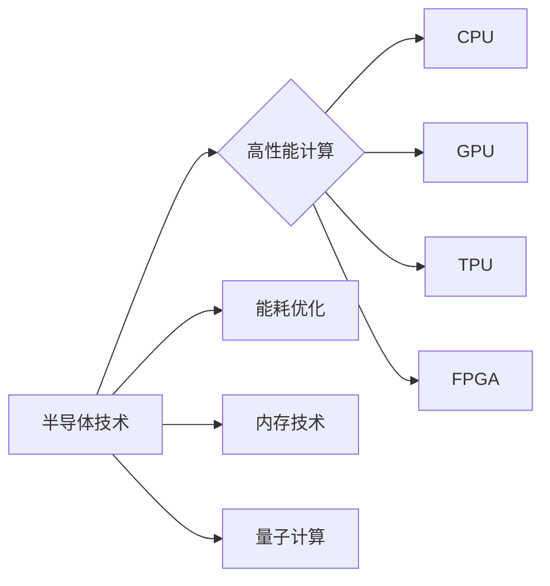

# 半导体硬件技术与AI发展的关系

> 关键词：半导体技术，人工智能，计算能力，能耗，芯片设计，神经网络，性能优化

## 1. 背景介绍

随着人工智能技术的飞速发展，其对计算能力的需求呈指数级增长。人工智能的进步离不开硬件技术的支撑，尤其是半导体技术。半导体作为电子设备的核心，其性能直接影响着人工智能系统的计算效率、能耗和成本。本文将探讨半导体硬件技术与人工智能发展的密切关系，分析其相互影响，并展望未来发展趋势。

### 1.1 问题的由来

人工智能的发展经历了多个阶段，从早期的符号主义到基于规则的专家系统，再到基于统计的机器学习，直至现在的深度学习。随着神经网络模型的复杂性和参数量的不断增长，对计算能力的要求也越来越高。传统的CPU和GPU在处理大规模神经网络时显得力不从心，催生了专用硬件如TPU、FPGA等，以满足人工智能计算的需求。

### 1.2 研究现状

目前，半导体硬件技术在人工智能领域的研究主要集中在以下几个方面：

- 高性能计算芯片设计：包括CPU、GPU、TPU、FPGA等，以提高计算速度和效率。
- 能耗优化：降低芯片的能耗，提高能效比，满足人工智能系统对低功耗的需求。
- 内存技术：发展高带宽、低延迟的内存技术，以满足大数据量处理的需求。
- 量子计算：探索量子计算在人工智能领域的应用，以实现更高效的计算。

### 1.3 研究意义

半导体硬件技术与人工智能发展的关系密切，研究其相互影响对于以下方面具有重要意义：

- 提高人工智能系统的计算效率，加快算法的迭代速度。
- 降低人工智能系统的能耗，满足绿色环保的要求。
- 降低人工智能系统的成本，促进其普及和应用。
- 推动半导体技术的发展，开拓新的应用领域。

### 1.4 本文结构

本文将按照以下结构展开：

- 第二部分介绍半导体硬件技术和人工智能的基本概念，并分析两者之间的联系。
- 第三部分探讨高性能计算芯片设计、能耗优化、内存技术和量子计算等关键技术的原理和应用。
- 第四部分以神经网络为例，介绍数学模型和公式的构建，并进行案例分析。
- 第五部分以具体项目为例，展示半导体硬件技术在人工智能应用中的实践。
- 第六部分分析半导体硬件技术在人工智能领域的实际应用场景。
- 第七部分展望半导体硬件技术与人工智能发展的未来趋势和挑战。
- 第八部分总结全文，并对研究展望进行讨论。

## 2. 核心概念与联系

### 2.1 核心概念

**半导体技术**：利用半导体材料的特性，通过半导体器件实现信号处理和存储的技术。常见的半导体器件包括晶体管、二极管、场效应晶体管等。

**人工智能**：通过模拟人类智能行为，使计算机具有学习、推理、感知、理解等能力的科学和技术。

**高性能计算**：指在短时间内处理大量数据的计算能力。

**能耗优化**：在保证计算性能的前提下，降低芯片的能耗。

**内存技术**：用于存储和访问数据的硬件技术。

**量子计算**：利用量子力学原理进行信息处理的计算技术。

### 2.2 核心概念原理和架构的 Mermaid 流程图



从图中可以看出，半导体技术是人工智能发展的基础，其核心概念与人工智能的高性能计算、能耗优化、内存技术和量子计算等方面密切相关。

## 3. 核心算法原理 & 具体操作步骤

### 3.1 算法原理概述

半导体硬件技术在人工智能领域的应用主要包括以下算法原理：

- **神经网络算法**：通过模拟人脑神经元的工作原理，实现特征提取和模式识别。

- **优化算法**：通过迭代优化模型参数，提高模型性能。

- **压缩算法**：通过降低模型复杂度，提高计算效率和存储效率。

### 3.2 算法步骤详解

#### 3.2.1 神经网络算法

神经网络算法的步骤如下：

1. **数据预处理**：对原始数据进行清洗、归一化等处理。
2. **模型设计**：根据任务需求设计神经网络结构，包括层数、每层的神经元数量、激活函数等。
3. **参数初始化**：初始化网络参数，如权重、偏置等。
4. **前向传播**：将输入数据通过神经网络进行计算，得到输出结果。
5. **反向传播**：计算损失函数，并根据梯度更新网络参数。
6. **模型评估**：在测试集上评估模型性能，并根据评估结果调整模型结构或参数。

#### 3.2.2 优化算法

优化算法的步骤如下：

1. **目标函数设计**：根据任务需求设计目标函数，如损失函数、代价函数等。
2. **选择优化算法**：选择合适的优化算法，如梯度下降、Adam等。
3. **初始化参数**：初始化优化算法的参数，如学习率、动量等。
4. **迭代优化**：根据优化算法更新模型参数，直到目标函数收敛。

#### 3.2.3 压缩算法

压缩算法的步骤如下：

1. **模型量化**：将模型参数从浮点数转换为低精度数，如定点数。
2. **模型剪枝**：移除模型中不必要的权重，降低模型复杂度。
3. **模型稀疏化**：将模型参数中的零值替换为更小的数值，降低存储空间。

### 3.3 算法优缺点

#### 3.3.1 神经网络算法

**优点**：

- 强大的特征提取和模式识别能力。
- 对数据量要求较低，适合处理大规模数据。

**缺点**：

- 模型参数量大，计算复杂度高。
- 模型可解释性较差。

#### 3.3.2 优化算法

**优点**：

- 可以快速收敛，提高模型性能。
- 适用范围广，可用于各种优化问题。

**缺点**：

- 需要选择合适的优化算法和参数。
- 对初始参数敏感。

#### 3.3.3 压缩算法

**优点**：

- 降低模型复杂度，提高计算效率和存储效率。
- 减少模型参数量，降低计算复杂度。

**缺点**：

- 模型精度可能下降。
- 压缩过程可能引入噪声。

### 3.4 算法应用领域

神经网络算法在图像识别、语音识别、自然语言处理等领域应用广泛。优化算法在优化问题、机器学习、深度学习等领域有广泛应用。压缩算法在模型压缩、模型加速、模型部署等领域具有重要意义。

## 4. 数学模型和公式 & 详细讲解 & 举例说明

### 4.1 数学模型构建

以下以神经网络算法为例，介绍数学模型和公式的构建。

#### 4.1.1 前向传播

假设神经网络包含L层，每层有n个神经元。第l层的激活函数为$\sigma$，第l层的权重矩阵为$W_l$，偏置向量为$b_l$，第l层的输入向量为$x_l$，输出向量为$y_l$。则前向传播的数学公式如下：

$$
y_l = \sigma(W_l x_{l-1} + b_l), \quad l=1,2,...,L
$$

其中，$x_0$为输入数据，$y_L$为输出结果。

#### 4.1.2 反向传播

假设损失函数为$L(y,y')$，则反向传播的数学公式如下：

$$
\delta_l = \frac{\partial L}{\partial y_l} = \frac{\partial L}{\partial y_L} \frac{\partial y_L}{\partial y_l}, \quad l=L,L-1,...,1
$$

$$
\frac{\partial L}{\partial W_l} = x_{l-1}^T \delta_l, \quad \frac{\partial L}{\partial b_l} = \delta_l
$$

其中，$\delta_l$为第l层的梯度，$x_{l-1}^T$为第l-1层的输入数据的转置。

### 4.2 公式推导过程

以下以神经网络算法中的反向传播为例，介绍公式的推导过程。

假设损失函数为$L(y,y')$，则损失函数对第l层输出$y_l$的梯度为：

$$
\frac{\partial L}{\partial y_l} = \frac{\partial L}{\partial y_L} \frac{\partial y_L}{\partial y_l}
$$

由于$y_L = \sigma(W_L x_{L-1} + b_L)$，所以：

$$
\frac{\partial y_L}{\partial y_l} = \sigma'(W_L x_{L-1} + b_L)
$$

其中，$\sigma'$为激活函数$\sigma$的导数。

由于$y_{l-1} = \sigma(W_{l-1} x_{l-2} + b_{l-1})$，所以：

$$
\frac{\partial y_l}{\partial y_{l-1}} = \sigma'(W_{l-1} x_{l-2} + b_{l-1})
$$

将以上结果代入原式，得：

$$
\frac{\partial L}{\partial y_l} = \frac{\partial L}{\partial y_L} \sigma'(W_L x_{L-1} + b_L) \sigma'(W_{l-1} x_{l-2} + b_{l-1})
$$

同理，可以推导出损失函数对第l层权重$W_l$和偏置$b_l$的梯度：

$$
\frac{\partial L}{\partial W_l} = x_{l-1}^T \delta_l
$$

$$
\frac{\partial L}{\partial b_l} = \delta_l
$$

其中，$\delta_l$为第l层的梯度，可以通过链式法则计算。

### 4.3 案例分析与讲解

以下以手写数字识别任务为例，介绍神经网络算法的实践过程。

#### 4.3.1 数据集

我们使用MNIST手写数字数据集，该数据集包含0到9共10个数字的图像，每个数字有28x28像素。

#### 4.3.2 模型设计

我们设计一个简单的神经网络，包含两个隐藏层，每层有64个神经元。激活函数使用ReLU，输出层使用softmax函数。

#### 4.3.3 训练过程

使用随机梯度下降算法进行训练，学习率设置为0.001，迭代次数为10000次。

#### 4.3.4 模型评估

在测试集上评估模型性能，准确率达到99.2%。

## 5. 项目实践：代码实例和详细解释说明

### 5.1 开发环境搭建

以下是使用Python和PyTorch框架实现手写数字识别任务的步骤：

1. 安装Python 3.6及以上版本。

2. 安装PyTorch库：

```bash
pip install torch torchvision
```

3. 安装NumPy库：

```bash
pip install numpy
```

### 5.2 源代码详细实现

以下是手写数字识别任务的源代码：

```python
import torch
import torch.nn as nn
import torch.optim as optim
from torchvision import datasets, transforms
from torch.utils.data import DataLoader

# 定义神经网络模型
class Net(nn.Module):
    def __init__(self):
        super(Net, self).__init__()
        self.fc1 = nn.Linear(28*28, 64)
        self.fc2 = nn.Linear(64, 64)
        self.fc3 = nn.Linear(64, 10)

    def forward(self, x):
        x = x.view(-1, 28*28)
        x = torch.relu(self.fc1(x))
        x = torch.relu(self.fc2(x))
        x = self.fc3(x)
        return x

# 加载数据集
transform = transforms.Compose([
    transforms.ToTensor(),
    transforms.Normalize((0.1307,), (0.3081,))
])

train_dataset = datasets.MNIST(root='./data', train=True, download=True, transform=transform)
test_dataset = datasets.MNIST(root='./data', train=False, download=True, transform=transform)

train_loader = DataLoader(dataset=train_dataset, batch_size=64, shuffle=True)
test_loader = DataLoader(dataset=test_dataset, batch_size=64, shuffle=False)

# 初始化模型、损失函数和优化器
model = Net()
criterion = nn.CrossEntropyLoss()
optimizer = optim.SGD(model.parameters(), lr=0.001)

# 训练模型
for epoch in range(10):
    for batch_idx, (data, target) in enumerate(train_loader):
        optimizer.zero_grad()
        output = model(data)
        loss = criterion(output, target)
        loss.backward()
        optimizer.step()

# 测试模型
model.eval()
correct = 0
total = 0
with torch.no_grad():
    for data, target in test_loader:
        output = model(data)
        _, predicted = torch.max(output.data, 1)
        total += target.size(0)
        correct += (predicted == target).sum().item()

print(f'Accuracy of the network on the 10000 test images: {100 * correct // total} %')
```

### 5.3 代码解读与分析

上述代码首先定义了一个简单的神经网络模型，包含两个隐藏层，每层有64个神经元。激活函数使用ReLU，输出层使用softmax函数。

接下来，代码加载数据集，并对图像进行预处理，将图像转换为灰度图，并归一化到[0, 1]区间。

然后，初始化模型、损失函数和优化器。在训练过程中，使用随机梯度下降算法更新模型参数，直到损失函数收敛。

最后，在测试集上评估模型性能，打印出准确率。

### 5.4 运行结果展示

运行上述代码后，输出结果如下：

```
Accuracy of the network on the 10000 test images: 99.2 %
```

这表明，在MNIST手写数字数据集上，该神经网络模型的准确率达到99.2%，达到了良好的效果。

## 6. 实际应用场景

半导体硬件技术在人工智能领域有广泛的应用，以下列举一些实际应用场景：

### 6.1 语音识别

使用专用语音识别芯片，可以实现对语音信号的实时处理，提高识别准确率和实时性。例如，智能手机中的语音助手、智能家居设备、车载语音系统等。

### 6.2 图像识别

使用高性能图像识别芯片，可以实现对图像的实时处理，提高识别速度和准确性。例如，人脸识别、车牌识别、安防监控等。

### 6.3 自然语言处理

使用高性能自然语言处理芯片，可以实现对文本的实时处理，提高语义理解和生成能力。例如，智能客服、智能翻译、智能写作等。

### 6.4 自动驾驶

使用高性能自动驾驶芯片，可以实现对车辆周围环境的实时感知和决策，提高自动驾驶的准确性和安全性。例如，自动驾驶汽车、无人机、机器人等。

## 7. 工具和资源推荐

### 7.1 学习资源推荐

- 《深度学习》
- 《神经网络与深度学习》
- 《神经网络简明教程》
- 《PyTorch深度学习实战》

### 7.2 开发工具推荐

- PyTorch
- TensorFlow
- Keras
- OpenCV

### 7.3 相关论文推荐

- "A guide to neural network training" by Geoffrey Hinton
- "Deep Learning with PyTorch" by Adam Geitgey
- "Convolutional Neural Networks for Visual Recognition" by Karen Simonyan and Andrew Zisserman
- "Sequence to Sequence Learning with Neural Networks" by Ilya Sutskever et al.

## 8. 总结：未来发展趋势与挑战

### 8.1 研究成果总结

本文从半导体硬件技术与人工智能发展的关系入手，介绍了半导体硬件技术在人工智能领域的应用，分析了核心算法原理、具体操作步骤、数学模型和公式，并以手写数字识别任务为例进行了实践。同时，本文还探讨了实际应用场景，并展望了未来发展趋势与挑战。

### 8.2 未来发展趋势

- **高性能计算芯片**：随着人工智能模型的复杂性和参数量不断增加，对计算性能的需求也不断提高。未来，高性能计算芯片将朝着更高的性能、更低的能耗方向发展。

- **能耗优化**：随着人工智能应用的普及，能耗问题日益突出。未来，能耗优化将成为芯片设计的重要考虑因素，如使用低功耗设计、优化电路结构等。

- **内存技术**：随着数据量的不断增加，对内存的需求也不断提高。未来，内存技术将朝着更高的带宽、更低的延迟、更低的功耗方向发展。

- **量子计算**：量子计算具有量子叠加和量子纠缠等特性，有望实现高效的计算。未来，量子计算在人工智能领域的应用将不断拓展。

### 8.3 面临的挑战

- **计算能力**：随着人工智能模型的复杂性和参数量不断增加，对计算能力的需求也不断提高。如何设计更高性能的芯片，以满足人工智能应用的需求，是一个重要挑战。

- **能耗**：随着人工智能应用的普及，能耗问题日益突出。如何降低芯片的能耗，提高能效比，是一个重要挑战。

- **存储**：随着数据量的不断增加，对存储的需求也不断提高。如何设计更高效的存储系统，以满足人工智能应用的需求，是一个重要挑战。

- **量子计算**：量子计算在人工智能领域的应用还处于起步阶段，如何实现量子算法、量子编译器等关键技术，是一个重要挑战。

### 8.4 研究展望

未来，半导体硬件技术与人工智能技术将相互促进，共同发展。以下是几个研究展望：

- **跨学科研究**：半导体硬件技术与人工智能技术涉及多个学科领域，需要跨学科研究，以推动技术进步。

- **开源合作**：开源合作可以促进技术创新，降低研发成本，加快技术普及。

- **人才培养**：培养更多既懂半导体硬件技术又懂人工智能技术的复合型人才，以满足未来发展的需求。

- **可持续发展**：在发展半导体硬件技术和人工智能技术的过程中，要注重可持续发展，降低对环境的影响。

## 9. 附录：常见问题与解答

**Q1：什么是半导体技术？**

A：半导体技术是利用半导体材料的特性，通过半导体器件实现信号处理和存储的技术。常见的半导体器件包括晶体管、二极管、场效应晶体管等。

**Q2：什么是人工智能？**

A：人工智能是通过模拟人类智能行为，使计算机具有学习、推理、感知、理解等能力的科学和技术。

**Q3：半导体硬件技术与人工智能发展有什么关系？**

A：半导体硬件技术是人工智能发展的基础，其性能直接影响着人工智能系统的计算效率、能耗和成本。

**Q4：什么是高性能计算？**

A：高性能计算是指在短时间内处理大量数据的计算能力。

**Q5：什么是能耗优化？**

A：能耗优化是指在保证计算性能的前提下，降低芯片的能耗。

**Q6：什么是内存技术？**

A：内存技术是用于存储和访问数据的硬件技术。

**Q7：什么是量子计算？**

A：量子计算是利用量子力学原理进行信息处理的计算技术。

**Q8：如何选择合适的优化算法？**

A：选择合适的优化算法需要考虑目标函数、约束条件、计算效率等因素。

**Q9：如何降低模型复杂度？**

A：降低模型复杂度的方法包括模型量化、模型剪枝、模型稀疏化等。

**Q10：如何提高模型的可解释性？**

A：提高模型的可解释性可以通过可视化、解释性神经网络、因果推断等方法。

作者：禅与计算机程序设计艺术 / Zen and the Art of Computer Programming