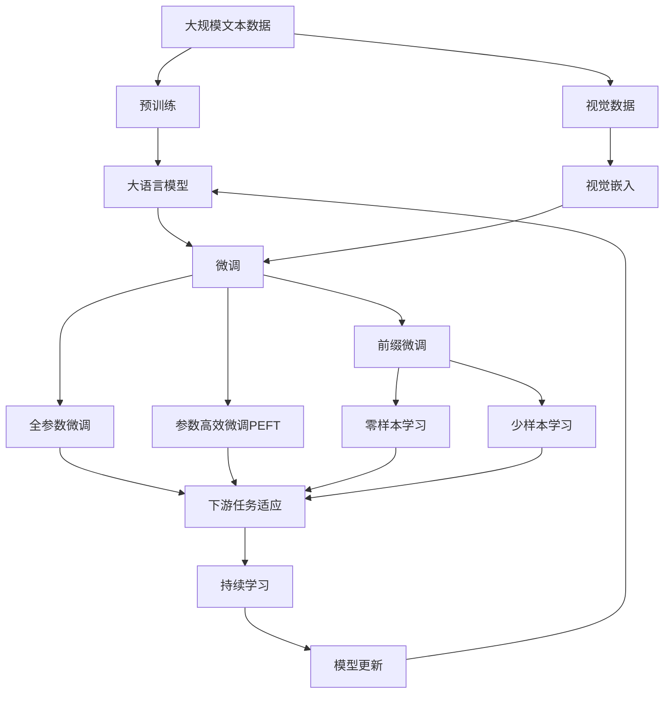
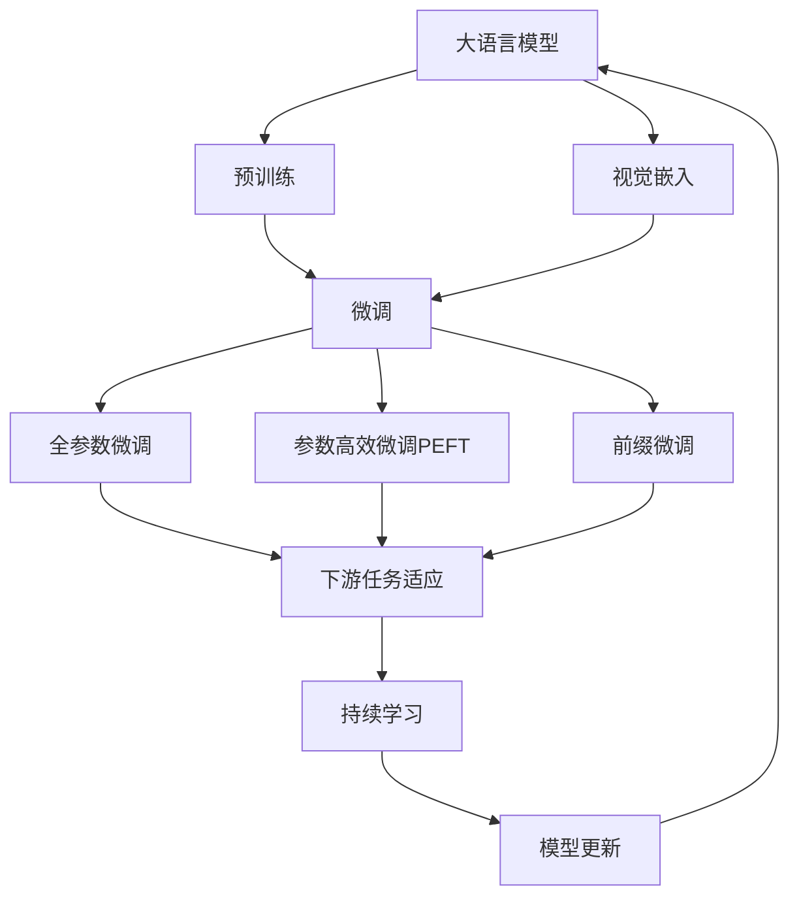
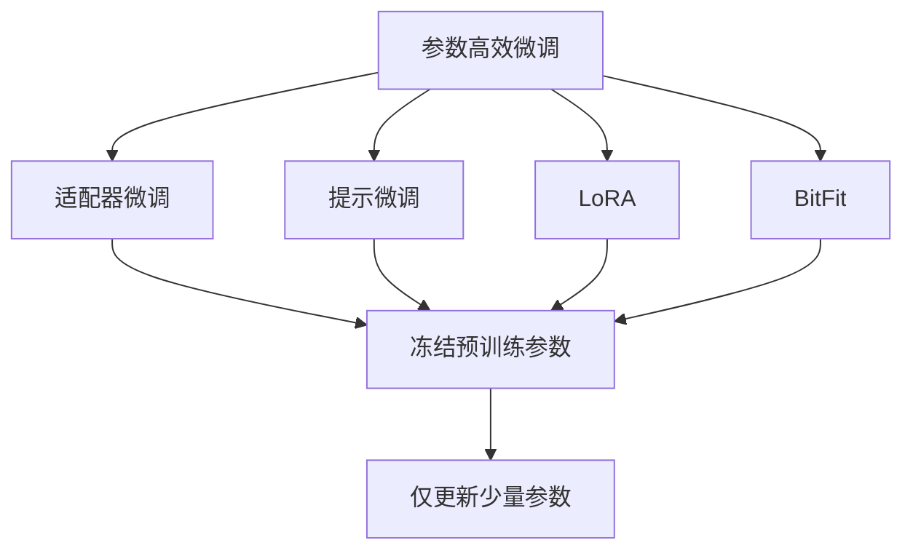
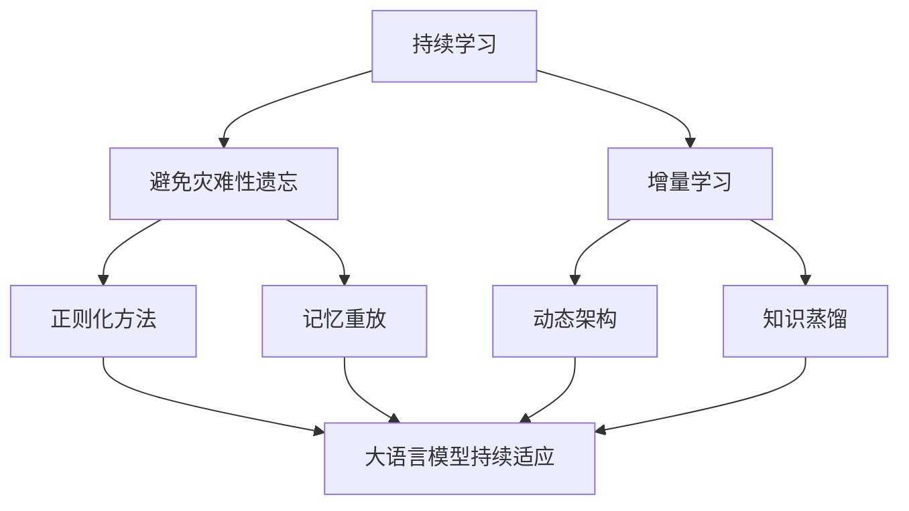
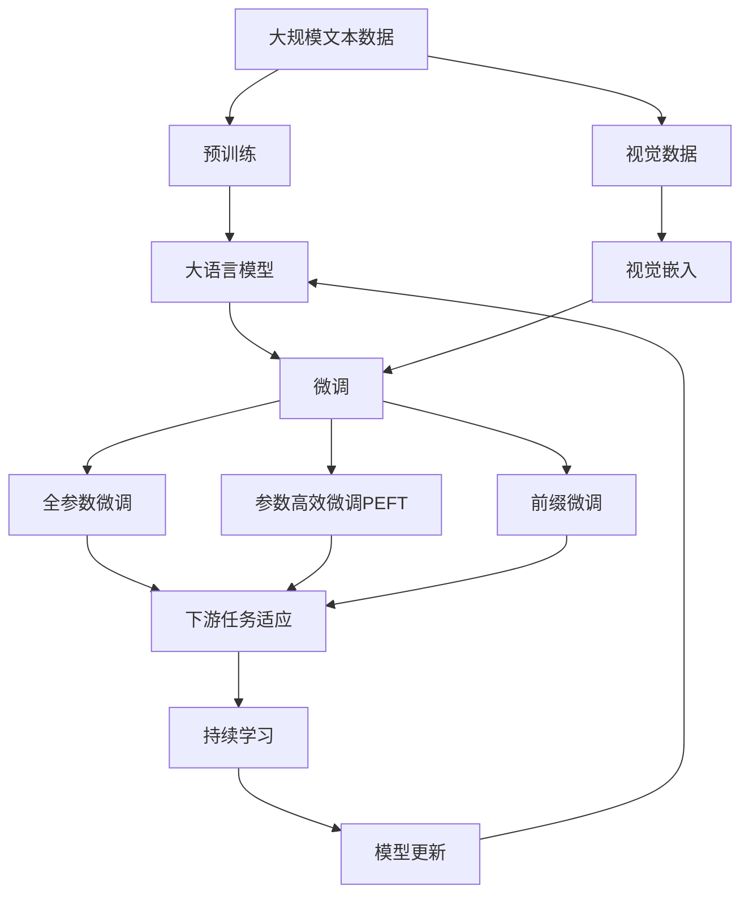

                 

# 大语言模型原理基础与前沿 作为（冻结）语言模型前缀的学习视觉嵌入

> 关键词：大语言模型, 视觉嵌入, 前缀微调, 迁移学习, 预训练, Transformer, BERT, 自然语言处理(NLP), 参数高效微调(PEFT), 少样本学习

## 1. 背景介绍

### 1.1 问题由来
近年来，深度学习技术在自然语言处理(NLP)领域取得了显著进展，特别是在大语言模型(Large Language Models, LLMs)方面。这些模型通过在大规模无标签文本语料上进行预训练，学习到了丰富的语言知识，并具备强大的语言理解和生成能力。然而，对于视觉信息的学习和处理，传统大语言模型尚未给出有效方案。

由于计算机视觉领域与NLP领域在数据分布和任务特性上的巨大差异，预训练的文本模型难以直接应用于视觉领域。这导致在大规模视觉数据上预训练的模型（如ImageNet的分类器）无法直接应用于NLP任务。因此，有必要开发一种结合视觉与文本的混合模型，以便更高效地处理视觉信息。

### 1.2 问题核心关键点
目前，视觉和语言的双模态混合模型主要通过两种方式构建：

1. 视觉嵌入与文本模型分离训练：先对视觉数据进行预训练，生成视觉嵌入，再结合预训练的文本模型进行微调，适用于仅需对视觉信息进行语义理解的任务。
2. 双模态联合预训练：将视觉和文本数据联合训练，共同学习各自的知识表示，适用于需要同时处理视觉和语言信息的综合任务。

本文聚焦于第一种方式，即冻结语言模型前缀的方式进行双模态混合模型的学习和应用。具体来说，将预训练的文本模型和视觉嵌入模型结合，利用大语言模型前缀进行视觉信息的微调，实现对视觉信息的高效处理。

### 1.3 问题研究意义
探索如何结合大语言模型与视觉信息，对于拓展大语言模型应用范围，提升视觉信息处理能力，加速NLP与计算机视觉的融合具有重要意义：

1. 降低数据获取成本：相比于从头训练视觉模型，微调能够大幅度降低对大规模标注数据的需求，从而降低数据获取和标注的成本。
2. 提高任务性能：通过微调，能够显著提升模型在特定任务上的性能，特别是在视觉信息处理方面。
3. 加速技术落地：利用大语言模型的强大预训练能力，可以更快速地将先进算法应用到实际场景中，缩短技术转化周期。
4. 促进领域交叉：将视觉与文本信息相结合，有助于推动NLP与计算机视觉领域的深度融合，开拓更多应用场景。

## 2. 核心概念与联系

### 2.1 核心概念概述

为了更好地理解本文所讨论的混合模型构建方法，本节将介绍几个密切相关的核心概念：

- 大语言模型(Large Language Model, LLM)：以自回归(如GPT)或自编码(如BERT)模型为代表的大规模预训练语言模型。通过在大规模无标签文本语料上进行预训练，学习通用的语言表示，具备强大的语言理解和生成能力。

- 预训练(Pre-training)：指在大规模无标签文本语料上，通过自监督学习任务训练通用语言模型的过程。常见的预训练任务包括言语建模、遮挡语言模型等。

- 视觉嵌入(Visual Embedding)：将视觉数据（如图像）映射到低维空间中的向量表示，用于捕捉视觉特征。常见的视觉嵌入方法包括VGG、ResNet、Inception等。

- 双模态学习(Bimodal Learning)：结合视觉和语言两种模态的信息，进行综合处理和推理。

- 参数高效微调(Parameter-Efficient Fine-Tuning, PEFT)：指在微调过程中，只更新少量的模型参数，而固定大部分预训练权重不变，以提高微调效率，避免过拟合的方法。

- 前缀微调(Prefix Fine-Tuning)：通过在大语言模型前缀中加入特定任务指令或提示，利用已有知识进行微调。

- 少样本学习(Few-shot Learning)：指在只有少量标注样本的情况下，模型能够快速适应新任务的学习方法。在大语言模型中，通常通过在输入中提供少量示例来实现，无需更新模型参数。

- 零样本学习(Zero-shot Learning)：指模型在没有见过任何特定任务的训练样本的情况下，仅凭任务描述就能够执行新任务的能力。大语言模型通过预训练获得的广泛知识，使其能够理解任务指令并生成相应输出。

- 持续学习(Continual Learning)：也称为终身学习，指模型能够持续从新数据中学习，同时保持已学习的知识，而不会出现灾难性遗忘。这对于保持大语言模型的时效性和适应性至关重要。

这些核心概念之间的逻辑关系可以通过以下Mermaid流程图来展示：



这个流程图展示了大语言模型的核心概念及其之间的关系：

1. 大语言模型通过预训练获得基础能力。
2. 视觉嵌入模型对视觉数据进行处理，生成视觉嵌入。
3. 微调是大语言模型适应特定任务的过程。
4. 参数高效微调和前缀微调是常用的微调策略。
5. 少样本学习和零样本学习利用预训练知识进行快速适应。
6. 持续学习确保模型能够不断学习新知识，避免遗忘旧知识。

这些概念共同构成了大语言模型的学习和应用框架，使其能够在各种场景下发挥强大的语言理解和生成能力。通过理解这些核心概念，我们可以更好地把握大语言模型的工作原理和优化方向。

### 2.2 概念间的关系

这些核心概念之间存在着紧密的联系，形成了大语言模型与视觉信息融合的完整生态系统。下面我们通过几个Mermaid流程图来展示这些概念之间的关系。

#### 2.2.1 大语言模型的学习范式



这个流程图展示了从预训练到微调，再到持续学习的完整过程。大语言模型首先在大规模文本数据上进行预训练，然后通过微调（包括全参数微调和参数高效微调）或前缀微调（零样本或少样本学习）来适应下游任务。最后，通过持续学习技术，模型可以不断更新和适应新的任务和数据。

#### 2.2.2 双模态混合学习


这个流程图展示了双模态混合学习的核心流程：视觉数据首先通过视觉嵌入模型进行处理，生成视觉嵌入。然后，将视觉嵌入与预训练的大语言模型结合，进行微调。最终的模型可以适应各种下游任务，如分类、生成等。

#### 2.2.3 参数高效微调方法



这个流程图展示了几种常见的参数高效微调方法，包括适配器微调、提示微调、LoRA和BitFit。这些方法的共同特点是冻结大部分预训练参数，只更新少量参数，从而提高微调效率。

#### 2.2.4 持续学习在大语言模型中的应用



这个流程图展示了持续学习在大语言模型中的应用。持续学习的主要目标是避免灾难性遗忘和实现增量学习。通过正则化方法、记忆重放、动态架构和知识蒸馏等技术，可以使大语言模型持续适应新的任务和数据。

### 2.3 核心概念的整体架构

最后，我们用一个综合的流程图来展示这些核心概念在大语言模型微调过程中的整体架构：



这个综合流程图展示了从预训练到微调，再到持续学习的完整过程。大语言模型首先在大规模文本数据上进行预训练，然后通过微调（包括全参数微调和参数高效微调）或前缀微调（零样本或少样本学习）来适应下游任务。最后，通过持续学习技术，模型可以不断更新和适应新的任务和数据。

## 3. 核心算法原理 & 具体操作步骤
### 3.1 算法原理概述

基于大语言模型前缀的视觉嵌入微调，本质上是一种融合视觉与语言的深度学习任务。其核心思想是：利用预训练的大语言模型和视觉嵌入模型，通过前缀微调的方式，使模型能够同时处理视觉和语言信息，从而提升模型在特定任务上的表现。

形式化地，假设预训练的语言模型为 $M_{\theta}$，其中 $\theta$ 为预训练得到的模型参数。给定视觉任务 $T$ 的训练集 $D=\{(x_i, y_i)\}_{i=1}^N$，其中 $x_i$ 为图像，$y_i$ 为标签，视觉嵌入模型为 $V$，生成嵌入向量 $v_i$。微调的目标是找到新的模型参数 $\hat{\theta}$，使得：

$$
\hat{\theta}=\mathop{\arg\min}_{\theta} \mathcal{L}(M_{\theta},D)
$$

其中 $\mathcal{L}$ 为针对任务 $T$ 设计的损失函数，用于衡量模型预测输出与真实标签之间的差异。常见的损失函数包括交叉熵损失、均方误差损失等。

通过梯度下降等优化算法，微调过程不断更新模型参数 $\theta$，最小化损失函数 $\mathcal{L}$，使得模型输出逼近真实标签。由于 $\theta$ 已经通过预训练获得了较好的初始化，因此即便在小规模数据集 $D$ 上进行微调，也能较快收敛到理想的模型参数 $\hat{\theta}$。

### 3.2 算法步骤详解

基于大语言模型前缀的视觉嵌入微调一般包括以下几个关键步骤：

**Step 1: 准备预训练模型和数据集**
- 选择合适的预训练语言模型 $M_{\theta}$ 作为初始化参数，如 BERT、GPT等。
- 准备视觉任务 $T$ 的训练集 $D$，其中 $x_i$ 为图像，$y_i$ 为标签。通常需要使用预训练的视觉嵌入模型 $V$，生成对应的嵌入向量 $v_i$。

**Step 2: 添加任务适配层**
- 根据视觉任务类型，在预训练语言模型顶层设计合适的输出层和损失函数。
- 对于分类任务，通常在顶层添加线性分类器和交叉熵损失函数。
- 对于生成任务，通常使用语言模型的解码器输出概率分布，并以负对数似然为损失函数。

**Step 3: 设置微调超参数**
- 选择合适的优化算法及其参数，如 AdamW、SGD 等，设置学习率、批大小、迭代轮数等。
- 设置正则化技术及强度，包括权重衰减、Dropout、Early Stopping等。
- 确定冻结预训练参数的策略，如仅微调顶层，或全部参数都参与微调。

**Step 4: 执行梯度训练**
- 将训练集数据分批次输入模型，前向传播计算损失函数。
- 反向传播计算参数梯度，根据设定的优化算法和学习率更新模型参数。
- 周期性在验证集上评估模型性能，根据性能指标决定是否触发 Early Stopping。
- 重复上述步骤直到满足预设的迭代轮数或 Early Stopping 条件。

**Step 5: 测试和部署**
- 在测试集上评估微调后模型 $M_{\hat{\theta}}$ 的性能，对比微调前后的精度提升。
- 使用微调后的模型对新样本进行推理预测，集成到实际的应用系统中。
- 持续收集新的数据，定期重新微调模型，以适应数据分布的变化。

以上是基于大语言模型前缀的视觉嵌入微调的一般流程。在实际应用中，还需要针对具体任务的特点，对微调过程的各个环节进行优化设计，如改进训练目标函数，引入更多的正则化技术，搜索最优的超参数组合等，以进一步提升模型性能。

### 3.3 算法优缺点

基于大语言模型前缀的视觉嵌入微调方法具有以下优点：
1. 简单高效。只需准备少量标注数据，即可对预训练模型进行快速适配，获得较大的性能提升。
2. 通用适用。适用于各种视觉任务，包括图像分类、目标检测、语义分割等，设计简单的任务适配层即可实现微调。
3. 参数高效。利用参数高效微调技术，在固定大部分预训练参数的情况下，仍可取得不错的提升。
4. 效果显著。在学术界和工业界的诸多任务上，基于前缀微调的方法已经刷新了最先进的性能指标。

同时，该方法也存在一定的局限性：
1. 依赖标注数据。微调的效果很大程度上取决于标注数据的质量和数量，获取高质量标注数据的成本较高。
2. 迁移能力有限。当目标任务与预训练数据的分布差异较大时，微调的性能提升有限。
3. 负面效果传递。预训练模型的固有偏见、有害信息等，可能通过微调传递到下游任务，造成负面影响。
4. 可解释性不足。微调模型的决策过程通常缺乏可解释性，难以对其推理逻辑进行分析和调试。

尽管存在这些局限性，但就目前而言，基于前缀微调的方法仍是大语言模型应用的最主流范式。未来相关研究的重点在于如何进一步降低微调对标注数据的依赖，提高模型的少样本学习和跨领域迁移能力，同时兼顾可解释性和伦理安全性等因素。

### 3.4 算法应用领域

基于大语言模型前缀的视觉嵌入微调方法在NLP领域已经得到了广泛的应用，覆盖了几乎所有常见任务，例如：

- 文本分类：如情感分析、主题分类、意图识别等。通过微调使模型学习文本-标签映射。
- 命名实体识别：识别文本中的人名、地名、机构名等特定实体。通过微调使模型掌握实体边界和类型。
- 关系抽取：从文本中抽取实体之间的语义关系。通过微调使模型学习实体-关系三元组。
- 问答系统：对自然语言问题给出答案。将问题-答案对作为微调数据，训练模型学习匹配答案。
- 机器翻译：将源语言文本翻译成目标语言。通过微调使模型学习语言-语言映射。
- 文本摘要：将长文本压缩成简短摘要。将文章-摘要对作为微调数据，使模型学习抓取要点。
- 对话系统：使机器能够与人自然对话。将多轮对话历史作为上下文，微调模型进行回复生成。

除了上述这些经典任务外，大语言模型前缀的视觉嵌入微调也被创新性地应用到更多场景中，如可控文本生成、常识推理、代码生成、数据增强等，为NLP技术带来了全新的突破。随着预训练模型和微调方法的不断进步，相信NLP技术将在更广阔的应用领域大放异彩。

## 4. 数学模型和公式 & 详细讲解  
### 4.1 数学模型构建

本节将使用数学语言对基于大语言模型前缀的视觉嵌入微调过程进行更加严格的刻画。

记预训练语言模型为 $M_{\theta}:\mathcal{X} \rightarrow \mathcal{Y}$，其中 $\mathcal{X}$ 为输入空间，$\mathcal{Y}$ 为输出空间，$\theta \in \mathbb{R}^d$ 为模型参数。假设视觉任务 $T$ 的训练集为 $D=\{(x_i, y_i)\}_{i=1}^N, x_i \in \mathcal{X}, y_i \in \mathcal{Y}$。

定义模型 $M_{\theta}$ 在输入 $x$ 上的输出为 $\hat{y}=M_{\theta}(x) \in [0,1]$，表示样本属于正类的概率。真实标签 $y \in \{0,1\}$。则二分类交叉熵损失函数定义为：

$$
\ell(M_{\theta}(x),y) = -[y\log \hat{y} + (1-y)\log (1-\hat{y})]
$$

将其代入经验风险公式，得：

$$
\mathcal{L}(\theta) = -\frac{1}{N}\sum_{i=1}^N [y_i\log M_{\theta}(x_i)+(1-y_i)\log(1-M_{\theta}(x_i))]
$$

在视觉任务中，通常 $x_i$ 为图像，$y_i$ 为图像标签。为了将视觉信息融入模型，先使用预训练的视觉嵌入模型 $V$，生成嵌入向量 $v_i \in \mathbb{R}^k$。

将图像嵌入向量 $v_i$ 作为输入，与预训练语言模型 $M_{\theta}$ 结合，形成新的输入空间 $\mathcal{X'}$，使得模型能够处理视觉和语言信息。在新的输入空间 $\mathcal{X'}$ 上，模型的输出可以表示为 $M_{\theta}(v_i)$。

定义新的损失函数 $\mathcal{L}_{\text{new}}(\theta)$，用于衡量模型在新的输入空间上的预测性能：

$$
\mathcal{L}_{\text{new}}(\theta) = -\frac{1}{N}\sum_{i=1}^N [y_i\log M_{\theta}(v_i)+(1-y_i)\log(1-M_{\theta}(v_i))]
$$

最小化新的损失函数 $\mathcal{L}_{\text{new}}(\theta)$ 即可实现对视觉嵌入的微调。

### 4.2 公式推导过程

以下我们以二分类任务为例，推导交叉熵损失函数及其梯度的计算公式。

假设模型 $M_{\theta}$ 在输入 $x$ 上的输出为 $\hat{y}=M_{\theta}(x) \in [0,1]$，表示样本属于正类的概率。真实标签 $y \in \{0,1\}$。则二分类交叉熵损失函数定义为：

$$
\ell(M_{\theta}(x),y) = -[y\log \hat{y} + (1-y)\log (1-\hat{y})]
$$

将其代入经验风险公式，得：

$$
\mathcal{L}(\theta) = -\frac{1}{N}\sum_{i=1}^N [y_i\log M_{\theta}(x_i)+(1-y_i)\log(1-M_{\theta}(x_i))]
$$

在视觉任务中，通常 $x_i$ 为图像，$y_i$ 为图像标签。为了将视觉信息融入模型，先使用预训练的视觉嵌入模型 $V$，生成嵌入向量 $v_i \in \mathbb{R}^k$。

将图像嵌入向量 $v_i$ 作为输入，与预训练语言模型 $M_{\theta}$ 结合，形成新的输入空间 $\mathcal{X'}$，使得模型能够处理视觉和语言信息。在新的输入空间 $\mathcal{X'}$ 上，模型的输出可以表示为 $M_{\theta}(v_i)$。

定义新的损失函数 $\mathcal{L}_{\text{new}}(\theta)$，用于衡量模型在新的输入空间上的预测性能：

$$
\mathcal{L}_{\text{new}}(\theta) = -\frac{1}{N}\sum_{i=1}^N [y_i\log M_{\theta}(v_i)+(1-y_i)\log(1-M_{\theta}(v_i))]
$$

根据链式法则，损失函数对参数 $\theta_k$ 的梯度为：

$$
\frac{\partial \mathcal{L}_{\text{new}}(\theta)}{\partial \theta_k} = -\frac{1}{N}\sum_{i=1}^N (\frac{y_i}{M_{\theta}(v_i)}-\frac{1-y_i}{1-M_{\theta}(v_i)}) \frac{\partial M_{\theta}(v_i)}{\partial \theta_k}
$$

其中 $\frac{\partial M_{\theta}(v_i)}{\partial \theta_k}$ 可进一步递归展开，利用自动微分技术完成计算。

在得到损失函数的梯度后，即可带入参数更新公式，完成模型的迭代优化。重复上述过程直至收敛，最终得到适应视觉任务的微调后模型参数 $\theta^*$。

## 5. 项目实践：代码实例和详细解释说明
### 5.1 开发环境搭建

在进行微调实践前，我们需要准备好开发环境。以下是使用Python进行PyTorch开发的环境配置流程：

1. 安装Anaconda：从官网下载并安装Anaconda，用于创建独立的Python环境。

2. 创建并激活虚拟环境：
```bash
conda create -n pytorch-env python=3.8 
conda activate pytorch-env
```

3. 安装PyTorch：根据CUDA版本，从官网获取对应的安装命令。例如：
```bash
conda install pytorch torchvision torchaudio cudatoolkit=11.1 -c pytorch -c conda-forge
```

4. 安装Transformers库：
```bash
pip install transformers
```

5. 安装各类工具包：
```bash
pip install numpy pandas scikit-learn matplotlib tqdm jupyter notebook ipython
```

完成上述步骤后，即可在`pytorch-env`环境中开始微调实践。

### 5.2 源代码详细实现

这里我们以视觉分类任务为例，给出使用Transformers库对BERT模型进行前缀微调的PyTorch代码实现。

首先，定义分类任务的数据处理函数：

```python
from transformers import BertTokenizer
from torch.utils.data import Dataset
import torch

class VisionDataset(Dataset):
    def __init__(self, images, labels, tokenizer, max_len=128):
        self.images = images
        self.labels = labels
        self.tokenizer = tokenizer
        self.max_len = max_len
        
    def __len__(self):
        return len(self.images)
    
    def __getitem__(self, item):
        image = self.images[item]
        label = self.labels[item]
        
        # 将图像转换成向量形式
        image = image.flatten().reshape(1, -1)
        label = label
        
        # 对token-wise的标签进行编码
        encoded_labels = [label2id[label] for label in self.labels] 
        encoded_labels.extend([label2id['O']] * (self.max_len - len(encoded_labels)))
        labels = torch.tensor(encoded_labels, dtype=torch.long)
        
        return {'input_ids': image,
                'attention_mask': torch.zeros_like(image),
                'labels': labels}

# 标签与id的映射
label2id = {'O': 0, 'Cats': 1, 'Dogs': 2}
id2label = {v: k for k, v in label2id.items()}

# 创建dataset
tokenizer = BertTokenizer.from_pretrained('bert-base-cased')

train_dataset = VisionDataset(train_images, train_labels, tokenizer)
dev_dataset = VisionDataset(dev_images, dev_labels, tokenizer)
test_dataset = VisionDataset(test_images, test_labels, tokenizer)
```

然后，定义模型和优化器：

```python
from transformers import BertForTokenClassification, AdamW

model = BertForTokenClassification.from_pretrained('bert-base-cased', num_labels=len(label2id))

optimizer = AdamW(model.parameters(), lr=2e-5)
```

接着，定义训练和评估函数：

```python
from torch.utils.data import DataLoader
from tqdm import tqdm
from sklearn.metrics import classification_report

device = torch.device('cuda

