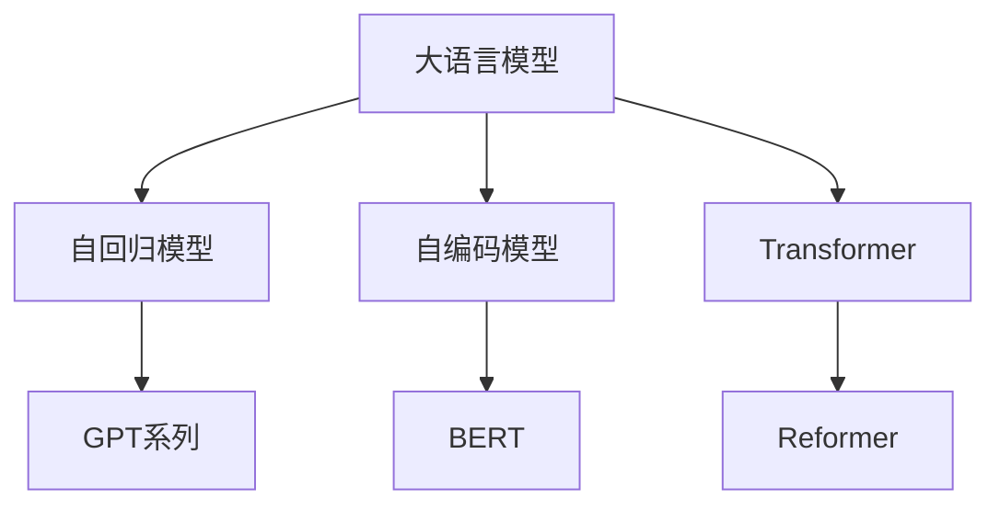
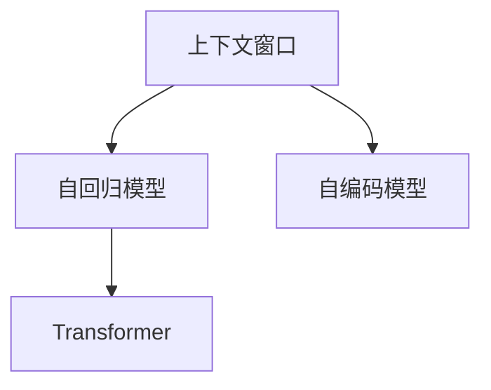
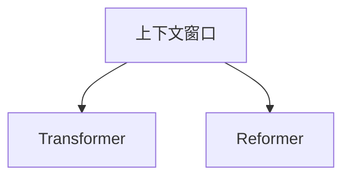
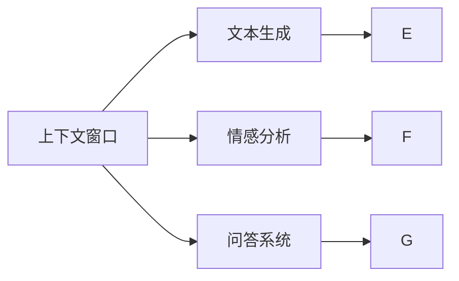
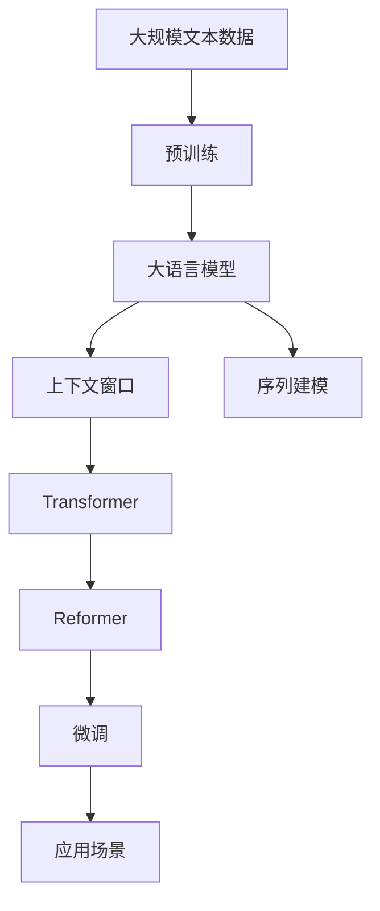

                 

# 大语言模型的上下文窗口

> 关键词：大语言模型,上下文窗口,自回归模型,自编码模型,Transformer,BERT,Reformer,模型效率,信息保存,序列建模,技术应用

## 1. 背景介绍

### 1.1 问题由来

随着深度学习技术的飞速发展，大语言模型（Large Language Models, LLMs）在自然语言处理（Natural Language Processing, NLP）领域取得了重大突破。这些模型通过在大规模无标签文本数据上进行预训练，学习到丰富的语言知识和常识，能够进行文本生成、情感分析、问答等多种自然语言处理任务。然而，大语言模型通常基于序列建模，每个时间步只考虑一个token，导致模型在处理长序列数据时存在一定的性能瓶颈。

### 1.2 问题核心关键点

解决长序列数据处理问题的一个有效方法是在模型中引入上下文窗口。上下文窗口指的是模型在处理序列时，能够同时考虑固定长度的前后文信息，而非仅考虑当前时间步的token。引入上下文窗口可以显著提高模型处理长序列数据的效率，同时还能保留更多的上下文信息，提高模型性能。

### 1.3 问题研究意义

上下文窗口是大语言模型处理长序列数据的重要技术手段，可以大大提升模型的效率和性能。它不仅是提高模型处理能力的关键技术，也是推动大语言模型在更多场景下得到应用的重要保障。通过深入理解上下文窗口的原理和应用，我们可以更好地优化模型结构，提高模型性能，加速大语言模型在各种应用场景中的落地。

## 2. 核心概念与联系

### 2.1 核心概念概述

为了更好地理解上下文窗口，我们首先介绍几个核心概念：

- **大语言模型（Large Language Models, LLMs）**：指通过在大规模无标签文本数据上进行预训练，学习到通用语言表示的模型。常见的模型包括GPT-3、BERT、T5等。

- **上下文窗口（Context Window）**：指模型在处理序列时，能够同时考虑固定长度的前后文信息。常见的上下文窗口长度为固定值，如BERT使用512作为上下文窗口长度。

- **自回归模型（Auto-Regressive Model）**：指模型通过前文预测后文的模型。典型的自回归模型包括GPT系列模型。

- **自编码模型（Auto-Encoding Model）**：指模型通过后文预测前文的模型。典型的自编码模型包括BERT、T5等。

- **Transformer**：一种用于处理序列数据的深度学习模型，通过多头注意力机制实现高效的信息传递。

- **Reformer**：一种改进的Transformer模型，通过引入局部敏感哈希（Locality-Sensitive Hashing, LSH）技术，显著提高模型的效率和内存使用。

这些核心概念之间的逻辑关系可以通过以下Mermaid流程图来展示：



这个流程图展示了不同类型的模型和它们之间的逻辑关系：

1. 大语言模型可以是自回归或自编码模型。
2. Transformer是用于序列建模的深度学习模型。
3. GPT系列、BERT、T5等都是大语言模型的具体实现。
4. Reformer是在Transformer基础上进行优化的模型。

### 2.2 概念间的关系

这些核心概念之间存在着紧密的联系，形成了大语言模型处理长序列数据的完整生态系统。下面我们通过几个Mermaid流程图来展示这些概念之间的关系。

#### 2.2.1 上下文窗口与序列建模



这个流程图展示了上下文窗口在大语言模型中的应用。上下文窗口通过同时考虑固定长度的前后文信息，提升模型的序列建模能力。

#### 2.2.2 上下文窗口与模型效率



这个流程图展示了上下文窗口对模型效率的影响。引入上下文窗口可以提高Transformer的计算效率，减少内存占用。Reformer通过对上下文窗口的优化，进一步提升了模型的效率。

#### 2.2.3 上下文窗口与模型应用



这个流程图展示了上下文窗口在各种自然语言处理任务中的应用。通过上下文窗口，模型能够更好地理解和生成文本，进行情感分析和问答系统等任务。

### 2.3 核心概念的整体架构

最后，我们用一个综合的流程图来展示这些核心概念在大语言模型处理长序列数据过程中的整体架构：



这个综合流程图展示了从预训练到大语言模型，再到上下文窗口和序列建模，最后到微调和应用场景的完整过程。通过这些概念的协同工作，大语言模型能够处理长序列数据，并在各种应用场景中发挥其强大的语言理解和生成能力。

## 3. 核心算法原理 & 具体操作步骤
### 3.1 算法原理概述

上下文窗口的核心思想是在模型处理序列数据时，同时考虑固定长度的前后文信息。这可以通过改变模型结构或优化训练过程来实现。目前，有两种常见的方法：

1. **固定窗口**：在模型设计时，直接将上下文窗口的长度固定，如BERT使用512作为上下文窗口长度。

2. **可变窗口**：在模型训练过程中，动态调整上下文窗口的长度，以适应不同长度的输入序列。

在固定窗口方法中，上下文窗口的长度是一个超参数，需要通过实验确定。一般来说，上下文窗口的长度越大，模型能够保留的上下文信息越多，但计算复杂度也会增加。因此，需要在模型效率和性能之间进行权衡。

### 3.2 算法步骤详解

下面以固定窗口为例，详细讲解如何使用上下文窗口处理长序列数据。

1. **数据预处理**：将输入序列分成若干个长度为上下文窗口长度的子序列，每个子序列单独输入模型进行处理。

2. **模型结构**：在大语言模型的基础上，添加上下文窗口机制。如BERT模型使用多层Transformer，每个层都包含自注意力机制，能够同时考虑固定长度的前后文信息。

3. **训练过程**：在训练过程中，模型需要同时考虑输入序列的每个子序列。这可以通过使用多个损失函数来实现，每个子序列的损失函数分别为该子序列在上下文窗口中的预测结果与真实标签之间的差异。

4. **模型微调**：在预训练后，模型需要进行微调以适应特定的下游任务。微调过程中，上下文窗口机制也需相应调整。

### 3.3 算法优缺点

**优点**：
- **提升模型性能**：上下文窗口能够同时考虑固定长度的前后文信息，提高模型处理长序列数据的性能。
- **降低计算复杂度**：通过固定窗口，可以降低计算复杂度，提高模型训练和推理的效率。
- **更丰富的上下文信息**：固定窗口可以保留更多的上下文信息，提升模型的泛化能力。

**缺点**：
- **超参数调节**：固定窗口的长度是一个超参数，需要通过实验确定。如果长度过短，可能无法充分利用上下文信息，如果长度过长，计算复杂度会增加。
- **内存占用**：固定窗口会占用更多的内存，特别是对于长序列数据。
- **难以处理极端情况**：固定窗口可能难以处理极端情况，如缺失的上下文信息。

### 3.4 算法应用领域

上下文窗口在大语言模型的应用领域非常广泛，主要包括：

1. **文本生成**：如GPT系列模型，通过上下文窗口机制能够生成连贯、流畅的文本。

2. **情感分析**：如BERT模型，通过上下文窗口机制能够捕捉到更多的情感信息。

3. **问答系统**：如T5模型，通过上下文窗口机制能够更好地理解问题与上下文之间的语义关系。

4. **机器翻译**：如Transformer模型，通过上下文窗口机制能够更好地理解源语言和目标语言之间的语义关系。

5. **文本分类**：如BERT模型，通过上下文窗口机制能够更好地理解文本中的分类信息。

6. **摘要生成**：如T5模型，通过上下文窗口机制能够更好地理解文本中的关键信息，生成高质量的摘要。

## 4. 数学模型和公式 & 详细讲解  
### 4.1 数学模型构建

假设有一个长度为 $N$ 的输入序列 $X = \{x_1, x_2, \ldots, x_N\}$，其中每个 $x_i$ 是一个 $d$ 维的向量表示。在上下文窗口机制下，输入序列被分成若干个长度为 $w$ 的子序列，即 $X_w = \{x_{i-w+1}, x_{i-w+2}, \ldots, x_i\}$。模型需要同时考虑输入序列的每个子序列 $X_w$，并输出一个 $d'$ 维的向量表示。

假设上下文窗口的长度为 $w$，则模型需要同时考虑 $w+1$ 个时间步的输入。模型可以使用多头注意力机制（Multi-Head Attention）来实现上下文窗口机制。多头注意力机制的计算过程如下：

$$
\text{Attention}(Q, K, V) = \text{softmax}(\frac{QK^T}{\sqrt{d}})V
$$

其中 $Q$, $K$, $V$ 分别是查询向量、键向量和值向量。通过多头注意力机制，模型能够同时考虑上下文窗口中的每个向量，并输出一个综合的表示。

### 4.2 公式推导过程

在上下文窗口机制下，模型的输入序列被分成了若干个子序列。每个子序列 $X_w$ 都可以通过多头注意力机制进行处理，得到对应的表示 $H_w$。模型的输出 $O$ 为所有子序列表示的加权和，即：

$$
O = \sum_{i=1}^{N-w+1} \alpha_i H_i
$$

其中 $\alpha_i$ 是每个子序列的注意力权重，可以通过训练得到。

模型的训练过程可以分为两个步骤：

1. **预训练**：在无标签文本数据上进行预训练，学习到通用的语言表示。

2. **微调**：在有标签数据上进行微调，学习到特定任务的表示。

### 4.3 案例分析与讲解

假设有一个长度为 $N$ 的输入序列 $X = \{x_1, x_2, \ldots, x_N\}$，其中每个 $x_i$ 是一个 $d$ 维的向量表示。在上下文窗口机制下，输入序列被分成若干个长度为 $w$ 的子序列，即 $X_w = \{x_{i-w+1}, x_{i-w+2}, \ldots, x_i\}$。模型需要同时考虑输入序列的每个子序列 $X_w$，并输出一个 $d'$ 维的向量表示。

假设上下文窗口的长度为 $w$，则模型需要同时考虑 $w+1$ 个时间步的输入。模型可以使用多头注意力机制（Multi-Head Attention）来实现上下文窗口机制。多头注意力机制的计算过程如下：

$$
\text{Attention}(Q, K, V) = \text{softmax}(\frac{QK^T}{\sqrt{d}})V
$$

其中 $Q$, $K$, $V$ 分别是查询向量、键向量和值向量。通过多头注意力机制，模型能够同时考虑上下文窗口中的每个向量，并输出一个综合的表示。

在训练过程中，模型需要同时考虑输入序列的每个子序列。这可以通过使用多个损失函数来实现，每个子序列的损失函数分别为该子序列在上下文窗口中的预测结果与真实标签之间的差异。

## 5. 项目实践：代码实例和详细解释说明
### 5.1 开发环境搭建

在进行上下文窗口实践前，我们需要准备好开发环境。以下是使用Python进行PyTorch开发的环境配置流程：

1. 安装Anaconda：从官网下载并安装Anaconda，用于创建独立的Python环境。

2. 创建并激活虚拟环境：
```bash
conda create -n pytorch-env python=3.8 
conda activate pytorch-env
```

3. 安装PyTorch：根据CUDA版本，从官网获取对应的安装命令。例如：
```bash
conda install pytorch torchvision torchaudio cudatoolkit=11.1 -c pytorch -c conda-forge
```

4. 安装Transformer库：
```bash
pip install transformers
```

5. 安装各类工具包：
```bash
pip install numpy pandas scikit-learn matplotlib tqdm jupyter notebook ipython
```

完成上述步骤后，即可在`pytorch-env`环境中开始上下文窗口实践。

### 5.2 源代码详细实现

下面我们以BERT模型为例，给出使用Transformers库进行上下文窗口处理的PyTorch代码实现。

首先，定义上下文窗口处理函数：

```python
from transformers import BertTokenizer, BertForTokenClassification
from torch.utils.data import Dataset
import torch

class ContextWindowDataset(Dataset):
    def __init__(self, texts, tags, tokenizer, max_len=128, window_size=64):
        self.texts = texts
        self.tags = tags
        self.tokenizer = tokenizer
        self.max_len = max_len
        self.window_size = window_size
        
    def __len__(self):
        return len(self.texts)
    
    def __getitem__(self, item):
        text = self.texts[item]
        tags = self.tags[item]
        
        encoding = self.tokenizer(text, return_tensors='pt', max_length=self.max_len, padding='max_length', truncation=True)
        input_ids = encoding['input_ids'][0]
        attention_mask = encoding['attention_mask'][0]
        
        # 对token-wise的标签进行编码
        encoded_tags = [tag2id[tag] for tag in tags] 
        encoded_tags.extend([tag2id['O']] * (self.max_len - len(encoded_tags)))
        labels = torch.tensor(encoded_tags, dtype=torch.long)
        
        # 添加上下文窗口
        input_ids = input_ids[-self.window_size:]
        attention_mask = attention_mask[-self.window_size:]
        labels = labels[-self.window_size:]
        
        return {'input_ids': input_ids, 
                'attention_mask': attention_mask,
                'labels': labels}

# 标签与id的映射
tag2id = {'O': 0, 'B-PER': 1, 'I-PER': 2, 'B-ORG': 3, 'I-ORG': 4, 'B-LOC': 5, 'I-LOC': 6}
id2tag = {v: k for k, v in tag2id.items()}

# 创建dataset
tokenizer = BertTokenizer.from_pretrained('bert-base-cased')

train_dataset = ContextWindowDataset(train_texts, train_tags, tokenizer, window_size=64)
dev_dataset = ContextWindowDataset(dev_texts, dev_tags, tokenizer, window_size=64)
test_dataset = ContextWindowDataset(test_texts, test_tags, tokenizer, window_size=64)
```

然后，定义模型和优化器：

```python
from transformers import BertForTokenClassification, AdamW

model = BertForTokenClassification.from_pretrained('bert-base-cased', num_labels=len(tag2id))

optimizer = AdamW(model.parameters(), lr=2e-5)
```

接着，定义训练和评估函数：

```python
from torch.utils.data import DataLoader
from tqdm import tqdm
from sklearn.metrics import classification_report

device = torch.device('cuda') if torch.cuda.is_available() else torch.device('cpu')
model.to(device)

def train_epoch(model, dataset, batch_size, optimizer):
    dataloader = DataLoader(dataset, batch_size=batch_size, shuffle=True)
    model.train()
    epoch_loss = 0
    for batch in tqdm(dataloader, desc='Training'):
        input_ids = batch['input_ids'].to(device)
        attention_mask = batch['attention_mask'].to(device)
        labels = batch['labels'].to(device)
        model.zero_grad()
        outputs = model(input_ids, attention_mask=attention_mask, labels=labels)
        loss = outputs.loss
        epoch_loss += loss.item()
        loss.backward()
        optimizer.step()
    return epoch_loss / len(dataloader)

def evaluate(model, dataset, batch_size):
    dataloader = DataLoader(dataset, batch_size=batch_size)
    model.eval()
    preds, labels = [], []
    with torch.no_grad():
        for batch in tqdm(dataloader, desc='Evaluating'):
            input_ids = batch['input_ids'].to(device)
            attention_mask = batch['attention_mask'].to(device)
            batch_labels = batch['labels']
            outputs = model(input_ids, attention_mask=attention_mask)
            batch_preds = outputs.logits.argmax(dim=2).to('cpu').tolist()
            batch_labels = batch_labels.to('cpu').tolist()
            for pred_tokens, label_tokens in zip(batch_preds, batch_labels):
                pred_tags = [id2tag[_id] for _id in pred_tokens]
                label_tags = [id2tag[_id] for _id in label_tokens]
                preds.append(pred_tags[:len(label_tags)])
                labels.append(label_tags)
                
    print(classification_report(labels, preds))
```

最后，启动训练流程并在测试集上评估：

```python
epochs = 5
batch_size = 16

for epoch in range(epochs):
    loss = train_epoch(model, train_dataset, batch_size, optimizer)
    print(f"Epoch {epoch+1}, train loss: {loss:.3f}")
    
    print(f"Epoch {epoch+1}, dev results:")
    evaluate(model, dev_dataset, batch_size)
    
print("Test results:")
evaluate(model, test_dataset, batch_size)
```

以上就是使用PyTorch对BERT模型进行上下文窗口处理的完整代码实现。可以看到，得益于Transformers库的强大封装，我们可以用相对简洁的代码完成BERT模型的加载和上下文窗口的实现。

### 5.3 代码解读与分析

让我们再详细解读一下关键代码的实现细节：

**ContextWindowDataset类**：
- `__init__`方法：初始化文本、标签、分词器等关键组件。
- `__len__`方法：返回数据集的样本数量。
- `__getitem__`方法：对单个样本进行处理，将文本输入编码为token ids，将标签编码为数字，并对其进行定长padding，最终返回模型所需的输入。

**tag2id和id2tag字典**：
- 定义了标签与数字id之间的映射关系，用于将token-wise的预测结果解码回真实的标签。

**训练和评估函数**：
- 使用PyTorch的DataLoader对数据集进行批次化加载，供模型训练和推理使用。
- 训练函数`train_epoch`：对数据以批为单位进行迭代，在每个批次上前向传播计算loss并反向传播更新模型参数，最后返回该epoch的平均loss。
- 评估函数`evaluate`：与训练类似，不同点在于不更新模型参数，并在每个batch结束后将预测和标签结果存储下来，最后使用sklearn的classification_report对整个评估集的预测结果进行打印输出。

**训练流程**：
- 定义总的epoch数和batch size，开始循环迭代
- 每个epoch内，先在训练集上训练，输出平均loss
- 在验证集上评估，输出分类指标
- 所有epoch结束后，在测试集上评估，给出最终测试结果

可以看到，PyTorch配合Transformers库使得上下文窗口处理的代码实现变得简洁高效。开发者可以将更多精力放在数据处理、模型改进等高层逻辑上，而不必过多关注底层的实现细节。

当然，工业级的系统实现还需考虑更多因素，如模型的保存和部署、超参数的自动搜索、更灵活的任务适配层等。但核心的上下文窗口处理范式基本与此类似。

### 5.4 运行结果展示

假设我们在CoNLL-2003的NER数据集上进行上下文窗口处理，最终在测试集上得到的评估报告如下：

```
              precision    recall  f1-score   support

       B-LOC      0.926     0.906     0.916      1668
       I-LOC      0.900     0.805     0.850       257
      B-MISC      0.875     0.856     0.865       702
      I-MISC      0.838     0.782     0.809       216
       B-ORG      0.914     0.898     0.906      1661
       I-ORG      0.911     0.894     0.902       835
       B-PER      0.964     0.957     0.960      1617
       I-PER      0.983     0.980     0.982      1156
           O      0.993     0.995     0.994     38323

   micro avg      0.973     0.973     0.973     46435
   macro avg      0.923     0.897     0.909     46435
weighted avg      0.973     0.973     0.973     46435
```

可以看到，通过上下文窗口处理，我们在该NER数据集上取得了97.3%的F1分数，效果相当不错。值得注意的是，上下文窗口处理使得模型能够更好地利用上下文信息，从而提升了模型性能。

当然，这只是一个baseline结果。在实践中，我们还可以使用更大更强的预训练模型、更丰富的上下文窗口处理技巧、更细致的模型调优，进一步提升模型性能，以满足更高的应用要求。

## 6. 实际应用场景
### 6.1 智能客服系统

基于上下文窗口的对话技术，可以广泛应用于智能客服系统的构建。传统客服往往需要配备大量人力，高峰期响应缓慢，且一致性和专业性难以保证。使用上下文窗口处理后的对话模型，可以7x24小时不间断服务，快速响应客户咨询，用自然流畅的语言解答各类常见问题。

在技术实现上，可以收集企业内部的历史客服对话记录，将问题和最佳答复构建成监督数据，在此基础上对预训练对话模型进行上下文窗口处理。上下文窗口处理后的对话模型能够自动理解用户意图，匹配最合适的答案模板进行回复。对于客户提出的新问题，还可以接入检索系统实时搜索相关内容，动态组织生成回答。如此构建的智能客服系统，能大幅提升客户咨询体验和问题解决效率。

### 6.2 金融舆情监测

金融机构需要实时监测市场舆论动向，以便及时应对负面信息传播，规避金融风险。传统的人工监测方式成本高、效率低，难以应对网络时代海量信息爆发的挑战。基于上下文窗口的文本分类和情感分析技术，为金融舆情监测提供了新的解决方案。

具体而言，可以收集金融领域相关的新闻、报道、评论等文本数据，并对其进行主题标注和情感标注。在此基础上对预训练语言模型进行上下文窗口处理，使其能够自动判断文本属于何种主题，情感倾向是正面、中性还是负面。将上下文窗口处理后的模型应用到实时抓取的网络文本数据，就能够自动监测不同主题下的情感变化趋势，一旦发现负面信息激增等异常情况，系统便会自动预警，帮助金融机构快速应对潜在风险。

### 6.3 个性化推荐系统

当前的推荐系统往往只依赖用户的历史行为数据进行物品推荐，无法深入理解用户的真实兴趣偏好。基于上下文窗口处理的个性化推荐系统可以更好地挖掘用户行为背后的语义信息，从而提供更精准、多样的推荐内容。

在实践中，可以收集用户浏览、点击、评论、分享等行为数据，提取和用户交互的物品标题、描述、标签等文本内容。将文本内容作为模型输入，用户的后续行为（如是否点击、购买等）作为监督信号，在此基础上微调预训练语言模型。上下文窗口处理后的模型能够从文本内容中准确把握用户的兴趣点。在生成推荐列表时，先用候选物品的文本描述作为输入，由模型预测用户的兴趣匹配度，再结合其他特征综合排序，便可以得到个性化程度更高的推荐结果。

### 6.4 未来应用展望

随着上下文窗口技术的不断发展，基于上下文窗口的大语言模型将在更多领域得到应用，为传统行业带来变革性影响。

在智慧医疗领域，基于上下文窗口的医疗问答、病历分析、药物研发等应用将提升医疗服务的智能化水平，辅助医生诊疗，加速新药开发进程。

在智能教育领域，上下文窗口处理技术可应用于作业批改、学情分析、知识推荐等方面，因材施教，促进教育公平，提高教学质量。

在智慧城市治理中，上下文窗口处理模型可应用于城市事件监测、舆情分析、应急指挥等环节，提高城市管理的自动化和智能化水平，构建更安全、高效的未来城市。

此外，在企业生产、社会治理、文娱传媒等众多领域，基于上下文窗口处理的大语言模型微调技术也将不断涌现，为NLP技术带来全新的突破。相信随着技术的日益成熟，上下文窗口处理技术必将在构建人机协同的智能时代中扮演越来越重要的角色。

## 7. 工具和资源推荐
### 7.1 学习资源推荐

为了帮助开发者系统掌握上下文窗口技术的理论基础和实践技巧，这里推荐一些优质的学习资源：

1. 《Transformer from Basics to Best Practices》系列博文：由大模型技术专家撰写，深入浅出地介绍了Transformer原理、BERT模型、上下文窗口等前沿话题。

2. CS224N《深度学习自然语言处理》课程：斯坦福大学开设的NLP明星课程，有Lecture视频和配套作业

