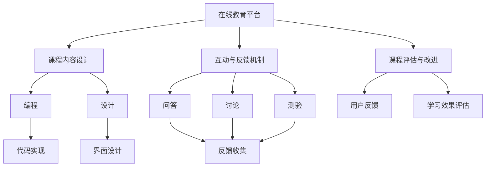

                 

# 如何利用技术能力创建在线课程

## 1. 背景介绍

### 1.1 问题由来
近年来，随着互联网和在线教育技术的发展，在线课程成为了一个热门话题。无论是为了提升自我，还是为了职业发展，越来越多的用户选择在线学习。然而，高质量的在线课程并不容易制作，需要具备一定的技术能力和知识储备。本文将介绍如何利用技术能力，创建出高质量、易于使用的在线课程。

### 1.2 问题核心关键点
在线课程的核心在于将知识以结构化、易于理解的方式呈现给用户。这需要考虑以下几个关键点：
1. 课程内容的组织：如何设计课程大纲，将知识点拆分为易于理解的模块。
2. 教学媒介的选择：如何选择合适的视频、音频、文本等教学媒介，提升用户的学习体验。
3. 互动和反馈机制：如何设计互动环节和反馈机制，增强用户的学习效果。
4. 平台的技术支持：如何选择合适的在线教育平台，实现课程的上线和分发。
5. 课程的评估和改进：如何设计和实施评估机制，持续改进课程内容。

## 2. 核心概念与联系

### 2.1 核心概念概述
1. **在线教育平台**：提供课程内容的展示、互动、评估等功能的平台。
2. **课程内容设计**：课程大纲的规划、知识点的组织、教学媒介的选择等。
3. **互动与反馈机制**：通过问答、讨论、测验等方式，增强用户的学习体验和效果。
4. **课程评估与改进**：通过用户反馈、学习效果评估等，持续优化课程内容。
5. **技术实现**：将课程内容转换为在线课程的技术实现过程，包括编程、设计、测试等。

这些核心概念之间存在着紧密的联系。通过技术手段，可以将课程内容有效地呈现给用户，通过互动和反馈机制增强学习效果，通过评估和改进机制提升课程质量，最终实现高质量在线课程的创建。

### 2.2 概念间的关系



这个流程图展示了在线课程的各个环节及其关系：
1. 在线教育平台提供课程的展示和互动功能。
2. 课程内容设计决定了课程的架构和知识点。
3. 互动与反馈机制增强用户的学习体验。
4. 课程评估与改进持续优化课程内容。
5. 编程、设计和测试是实现课程内容的技术环节。

## 3. 核心算法原理 & 具体操作步骤
### 3.1 算法原理概述

创建高质量在线课程的核心算法原理包括以下几个方面：
1. **内容组织算法**：将知识点按照一定的逻辑顺序组织成课程大纲，设计成易于理解的模块。
2. **互动与反馈算法**：通过设计问答、讨论、测验等环节，增强用户的学习效果和参与感。
3. **评估与改进算法**：通过用户反馈和学习效果评估，持续优化课程内容，提升课程质量。

这些算法原理相互关联，共同构成了一个完整的在线课程创建流程。

### 3.2 算法步骤详解
1. **需求分析**：确定课程的目标受众、知识点范围和期望的学习效果。
2. **课程设计**：将知识点拆分为模块，设计课程大纲，选择合适的教学媒介（如视频、音频、文本等）。
3. **技术实现**：使用编程语言和开发工具，将课程内容转换为在线课程的技术实现，包括界面设计、代码实现等。
4. **测试与优化**：在开发过程中进行测试，收集用户反馈，持续优化课程内容和互动设计。
5. **上线与推广**：选择合适的在线教育平台，上线课程，并进行推广和营销。
6. **评估与改进**：收集用户的学习效果反馈，评估课程的实际效果，持续改进课程内容。

### 3.3 算法优缺点
**优点**：
1. **灵活性**：在线课程可以根据用户需求和反馈进行灵活调整，快速迭代。
2. **可扩展性**：在线课程可以覆盖更广泛的知识领域和受众群体，实现规模化教学。
3. **成本效益**：在线课程的制作和分发成本相对较低，可以大规模推广。

**缺点**：
1. **技术门槛**：需要具备一定的技术能力和知识储备，才能制作高质量的在线课程。
2. **互动性不足**：相对于传统的面对面教学，在线课程的互动性较弱。
3. **用户依赖平台**：在线课程的完成度和用户体验高度依赖于平台的功能和稳定性。

### 3.4 算法应用领域
在线课程的应用领域广泛，包括但不限于以下几个方面：
1. **学术教育**：各类学科的在线课程，如编程、数学、物理等。
2. **职业培训**：职业技能培训课程，如项目管理、数据分析、软件开发等。
3. **兴趣学习**：兴趣爱好课程，如音乐、绘画、语言学习等。
4. **特殊教育**：针对不同需求的学生，如特殊教育、远程教育等。

## 4. 数学模型和公式 & 详细讲解  
### 4.1 数学模型构建

在在线课程的创建过程中，可以通过数学模型来描述和优化各个环节。以下是一个简单的数学模型：

设课程内容总数为 $N$，用户数为 $U$，课程评估结果为 $R$，互动次数为 $I$。则在线课程的质量 $Q$ 可以表示为：

$$ Q = \frac{U}{N} \times R \times I $$

其中，$\frac{U}{N}$ 表示用户完成课程的比例，$R$ 表示课程的评估结果（如分数、满意度等），$I$ 表示课程的互动次数。

### 4.2 公式推导过程

在实际应用中，可以进一步细化模型：

1. **用户完成率**：
   $$ \frac{U}{N} = \frac{1}{1 + \frac{E}{N}} $$
   其中 $E$ 表示课程的未完成用户数。

2. **课程评估结果**：
   $$ R = \frac{1}{1 + \frac{W}{N}} $$
   其中 $W$ 表示课程的负面评价数量。

3. **互动次数**：
   $$ I = k \times \sum_{i=1}^{n} \text{interaction\_count}_i $$
   其中 $k$ 为互动权重，$n$ 为互动次数，$\text{interaction\_count}_i$ 为第 $i$ 次互动的次数。

将这些公式代入 $Q$ 的计算公式中，可以得到一个综合的在线课程质量评估公式：

$$ Q = \frac{U}{N} \times R \times I = \frac{U}{N} \times \frac{1}{1 + \frac{W}{N}} \times k \times \sum_{i=1}^{n} \text{interaction\_count}_i $$

### 4.3 案例分析与讲解

假设一个在线编程课程，共有 1000 个知识点，10000 名用户注册，其中 90% 的用户完成了课程，平均课程评估分数为 4.2（满分 5 分），每个用户在课程中平均进行了 5 次互动。课程中设置了问答、讨论和测验环节。互动次数为：

- 问答环节：100 次
- 讨论环节：200 次
- 测验环节：100 次

则课程的质量 $Q$ 计算如下：

$$ Q = \frac{10000}{1000} \times \frac{1}{1 + \frac{800}{1000}} \times 4.2 \times 5 \times (100 + 200 + 100) = 3.86 $$

这个结果表明，该在线编程课程的整体质量为 3.86，达到了较高的水平。

## 5. 项目实践：代码实例和详细解释说明
### 5.1 开发环境搭建

为了创建高质量在线课程，我们需要一个支持编程和设计的开发环境。以下是推荐的一些工具：

1. **编程工具**：
   - Python：一款强大的编程语言，广泛应用于数据科学、机器学习等领域。
   - VS Code：一款轻量级但功能丰富的代码编辑器。
   - Jupyter Notebook：支持代码和文本混排，方便编写和执行代码。

2. **设计工具**：
   - Adobe Photoshop：一款功能强大的图像编辑工具，适用于课程界面的图形设计。
   - Figma：一款基于 Web 的 UI 设计工具，支持多人协作，方便课程界面的快速迭代。

3. **开发环境搭建**：
   - 在本地安装 Python、VS Code、Jupyter Notebook 和相关开发库。
   - 使用 Git 和 GitHub 进行版本控制和代码托管，方便协作和分享。

### 5.2 源代码详细实现

以下是一个简单的 Python 代码示例，展示如何创建一个在线编程课程的互动问答环节：

```python
# 定义问答功能
class Question:
    def __init__(self, question_text, answer):
        self.question_text = question_text
        self.answer = answer

# 创建问答列表
question_list = [
    Question("What is Python?", "Python is a high-level programming language."),
    Question("What is the main feature of Python?", "The main feature is its readability and simplicity."),
    Question("What is the purpose of Python?", "The purpose is to make programming easier and more efficient.")
]

# 显示问答环节
for question in question_list:
    print(question.question_text)
    answer = input("Your answer: ")
    if answer.lower() == question.answer.lower():
        print("Correct!")
    else:
        print("Incorrect. The correct answer is: " + question.answer)
```

### 5.3 代码解读与分析

上述代码实现了一个简单的问答环节，展示了如何通过编程实现课程的互动功能。具体分析如下：

- **类定义**：定义了一个 `Question` 类，包含问题和答案。
- **列表创建**：创建了一个包含多个问答问题的列表 `question_list`。
- **显示和交互**：通过循环遍历问答列表，显示问题和用户输入答案，根据正确性给出反馈。

## 6. 实际应用场景
### 6.1 教育机构

在线课程在教育机构中得到了广泛应用，主要用于以下场景：
1. **远程教学**：提供在线课程，帮助学生在家中学习，不受地理位置的限制。
2. **自学平台**：提供在线课程，供学生自主学习，提升学习效率。
3. **学术研究**：提供在线课程，帮助学生进行学术研究和知识积累。

### 6.2 企业培训

在线课程在企业培训中也具有重要意义，主要用于以下场景：
1. **新员工培训**：提供在线课程，帮助新员工快速掌握工作技能。
2. **技术培训**：提供在线课程，提升员工的技术能力和竞争力。
3. **领导力培训**：提供在线课程，培养员工的领导力和管理能力。

### 6.3 在线教育平台

在线教育平台通过创建和管理在线课程，为用户提供丰富的学习资源和互动体验。例如：

1. **MOOC（大规模开放在线课程）**：提供大量的免费课程，如Coursera、edX等。
2. **付费课程**：提供高品质的付费课程，如Udacity、Udemy等。
3. **在线教育社区**：提供社区讨论和互动功能，促进学习者之间的交流和合作。

## 7. 工具和资源推荐
### 7.1 学习资源推荐
1. **在线课程平台**：Coursera、edX、Udacity 等，提供大量免费和付费课程，涵盖多个学科和领域。
2. **编程语言教程**：Python、Java、C++ 等，如 Codecademy、LeetCode 等。
3. **UI/UX 设计资源**：Figma、Adobe XD、Sketch 等设计工具的教程和素材。

### 7.2 开发工具推荐
1. **编程工具**：
   - Python：Python 官方文档和 PEP 8 风格指南。
   - VS Code：官方文档和插件生态系统。
   - Jupyter Notebook：官方文档和扩展库。

2. **设计工具**：
   - Adobe Photoshop：官方教程和插件。
   - Figma：官方文档和设计模板。

### 7.3 相关论文推荐
1. **在线教育系统设计**：The Design of Online Learning Environments，R. Collier, 2015。
2. **学习效果评估**：Evaluation of Online Learning Systems，P. Yin, 2014。
3. **互动设计**：Designing Effective Online Learning Interfaces，D. M. Hadi, 2018。

## 8. 总结：未来发展趋势与挑战
### 8.1 研究成果总结
在线课程作为一种创新的教育方式，已经取得了显著的成效。未来，在线课程将继续在教育、培训和企业培训等领域发挥重要作用。

### 8.2 未来发展趋势
1. **人工智能辅助**：利用 AI 技术，提供个性化的学习推荐、智能评估等功能，提升用户体验。
2. **多模态学习**：结合视频、音频、文本等多种媒介，提供更加丰富的学习体验。
3. **虚拟现实与增强现实**：利用 VR/AR 技术，提供沉浸式的学习体验。
4. **区块链技术**：利用区块链技术，保障学习数据的安全和透明。
5. **全球化教育**：利用在线课程，打破地域限制，促进全球教育公平。

### 8.3 面临的挑战
1. **技术门槛**：需要具备一定的技术能力和知识储备，才能制作高质量的在线课程。
2. **互动性不足**：在线课程的互动性较弱，需要进一步增强。
3. **用户依赖平台**：在线课程的完成度和用户体验高度依赖于平台的功能和稳定性。

### 8.4 研究展望
未来，在线课程的发展方向包括：
1. **技术创新**：结合最新的人工智能、VR/AR、区块链等技术，提升在线课程的互动性和用户体验。
2. **内容创新**：开发更多高质量、有特色的在线课程，满足不同用户的需求。
3. **教育公平**：利用在线课程，打破地域限制，促进全球教育公平。

总之，在线课程的创建和应用，需要不断地进行技术创新和内容创新，才能适应日益变化的教育需求。

## 9. 附录：常见问题与解答

**Q1：如何选择合适的在线教育平台？**

A: 选择在线教育平台时，需要考虑以下几个因素：
1. **平台的用户群体**：平台是否覆盖目标用户群体。
2. **平台的功能和特性**：平台是否提供丰富的课程内容、互动功能和评估机制。
3. **平台的稳定性和安全性**：平台是否稳定可靠，用户数据是否安全。
4. **平台的成本和收益**：平台是否提供合理的收费模式和分成机制。

**Q2：如何设计互动环节？**

A: 设计互动环节时，需要考虑以下几个方面：
1. **多样性**：设计多种互动形式，如问答、讨论、测验等。
2. **及时性**：互动环节需要及时响应，避免用户等待过久。
3. **反馈机制**：提供及时的反馈，增强用户的学习效果。

**Q3：如何评估课程效果？**

A: 评估课程效果时，需要考虑以下几个指标：
1. **用户完成率**：用户是否完成了课程。
2. **用户满意度**：用户对课程的满意度评分。
3. **学习效果**：用户对课程内容的掌握程度。

**Q4：如何优化课程内容？**

A: 优化课程内容时，需要考虑以下几个方面：
1. **用户反馈**：收集用户反馈，了解课程的优点和不足。
2. **评估结果**：根据评估结果，调整课程难度和内容。
3. **市场需求**：根据市场需求，调整课程内容和形式。

**Q5：如何实现大规模推广？**

A: 实现大规模推广时，需要考虑以下几个方面：
1. **营销策略**：制定合理的营销策略，吸引用户注册和学习。
2. **平台合作**：与在线教育平台合作，扩大课程的覆盖范围。
3. **社交媒体**：利用社交媒体平台进行推广，提升课程的知名度和吸引力。

综上所述，通过技术能力，我们可以创建出高质量、易于使用的在线课程。在线课程在教育、培训和企业培训等领域有着广阔的应用前景，未来将继续发挥重要作用。

