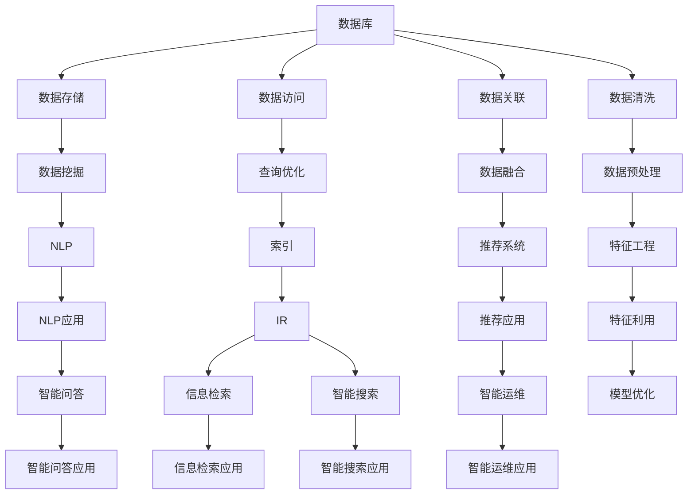
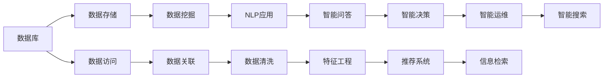
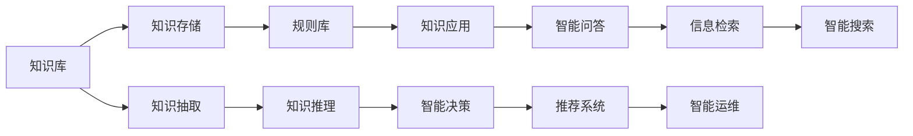
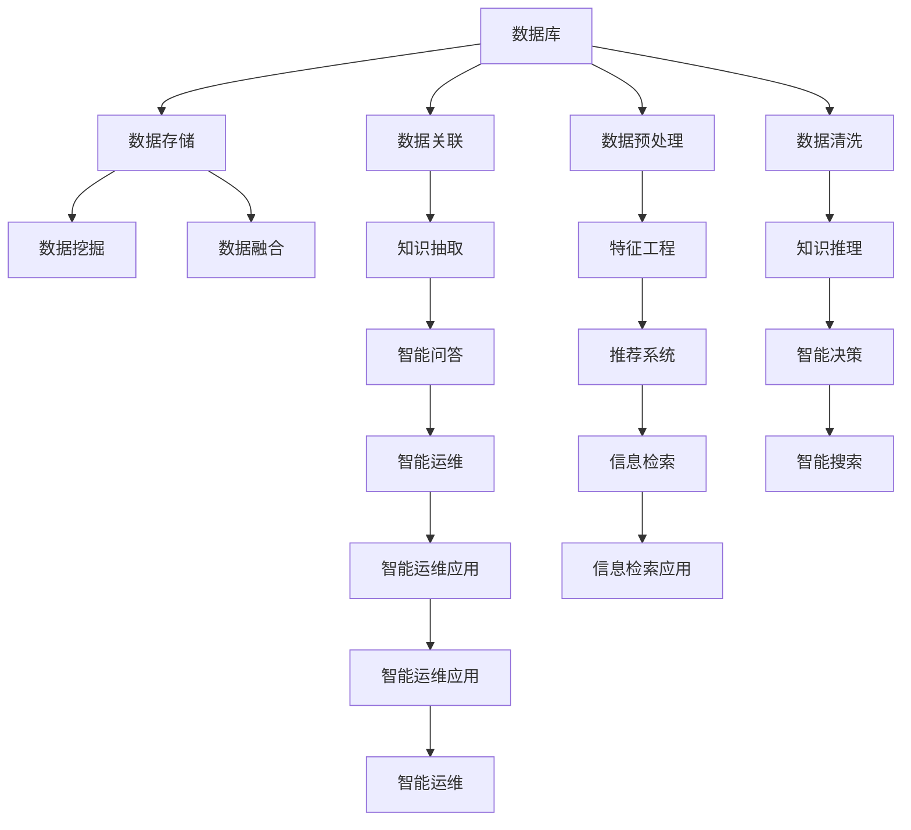

                 

# 数据库、知识库在AI中的重要性

> 关键词：人工智能,数据库,知识库,智能决策,自然语言处理,推荐系统,信息检索,智能运维

## 1. 背景介绍

### 1.1 问题由来

随着人工智能技术的飞速发展，其在多个领域取得了显著进展，如自然语言处理、计算机视觉、智能推荐、智能运维等。然而，这些技术的发展离不开数据和知识的支撑。在实际应用中，如何高效地存储、管理和利用数据和知识，成为限制AI技术发展的关键因素。

数据库和知识库作为数据和知识管理的重要工具，在AI中扮演着不可或缺的角色。它们不仅为AI算法提供了所需的数据源，还为知识的抽取、推理和应用提供了平台。本文将系统介绍数据库、知识库在AI中的重要性，并通过具体案例展示其应用效果。

### 1.2 问题核心关键点

数据库和知识库在AI中的重要性主要体现在以下几个方面：

1. 数据存储和高效访问：数据库和知识库提供了高效的数据存储和查询接口，使得AI算法能够快速访问到所需的数据。

2. 知识抽取和推理：知识库通常包含大量结构化的知识，可以辅助AI进行知识抽取和推理，提升AI算法的精准性和可解释性。

3. 数据关联和融合：通过数据库和知识库，AI算法能够将多源异构数据进行关联和融合，提升数据质量和利用率。

4. 智能决策支持：数据库和知识库中的知识库可以为AI提供决策依据，辅助智能决策系统的构建。

5. 智能运维和优化：数据库和知识库中的元数据、性能指标等可以为AI算法优化提供指导，提升系统稳定性和可靠性。

本文将详细介绍数据库、知识库在AI中的应用，并通过具体实例展示其重要性。

## 2. 核心概念与联系

### 2.1 核心概念概述

为了更好地理解数据库、知识库在AI中的应用，本节将介绍几个密切相关的核心概念：

- 数据库(Database)：存储和管理数据的平台，支持数据的创建、读取、更新和删除等操作，并提供高效的查询和分析接口。

- 知识库(Knowledge Base)：存储和管理知识的平台，通常包含结构化的知识图谱、规则库和语义网络等，支持知识的抽取、推理和应用。

- 数据挖掘(Data Mining)：从大量数据中提取有用信息的过程，是AI算法中的重要环节。

- 自然语言处理(Natural Language Processing, NLP)：使计算机能够理解和处理人类语言的技术，是AI在智能问答、情感分析、机器翻译等领域的重要工具。

- 推荐系统(Recommendation System)：根据用户的历史行为和偏好，推荐其可能感兴趣的商品或内容，是AI在电商、娱乐、社交等领域的重要应用。

- 信息检索(Information Retrieval, IR)：从大量数据中检索出与用户查询最相关的信息，是AI在搜索引擎、文档检索等领域的重要工具。

- 智能运维(Intelligent Operation and Maintenance, IO&M)：通过AI算法自动检测和修复系统故障，提升系统的稳定性和可靠性，是AI在云服务、物联网等领域的重要应用。

这些核心概念之间的逻辑关系可以通过以下Mermaid流程图来展示：



这个流程图展示了大数据技术、知识库与AI算法之间的紧密联系。数据库提供了数据存储和高效访问接口，数据挖掘和NLP技术从数据中提取有价值的信息，推荐系统和信息检索技术帮助AI算法推荐相关内容，智能运维技术保障系统的稳定性和可靠性。通过这些技术的综合应用，AI算法能够更好地理解和利用数据，提升其决策和执行能力。

### 2.2 概念间的关系

这些核心概念之间存在着紧密的联系，形成了AI应用的整体生态系统。下面我通过几个Mermaid流程图来展示这些概念之间的关系。

#### 2.2.1 数据库在AI中的角色



这个流程图展示了数据库在AI中的应用。数据库提供了高效的数据存储和查询接口，辅助数据挖掘、NLP、智能问答、推荐系统、智能运维等应用。

#### 2.2.2 知识库在AI中的角色



这个流程图展示了知识库在AI中的应用。知识库存储和管理结构化的知识，辅助知识抽取、推理、应用，提升AI算法的精准性和可解释性。

#### 2.2.3 数据库与知识库的综合应用



这个综合流程图展示了数据库和知识库在AI应用中的综合角色。通过数据库和知识库的协同工作，AI算法能够更好地理解和利用数据，提升其决策和执行能力。

## 3. 核心算法原理 & 具体操作步骤

### 3.1 算法原理概述

数据库和知识库在AI中的应用，通常涉及数据存储、查询、关联、清洗、挖掘、抽取、推理、融合等环节。以下是几个核心算法的原理概述：

- 数据存储与查询：数据库提供高效的数据存储和查询接口，支持索引、事务、并发控制等特性。

- 数据关联与清洗：通过数据库中的SQL查询语言，可以将多源异构数据进行关联和清洗，提升数据质量。

- 数据挖掘与特征工程：数据挖掘技术从大量数据中提取有用信息，特征工程技术对数据进行预处理和特征提取，为AI算法提供输入。

- 知识抽取与推理：知识库中的规则和语义网络支持知识的抽取和推理，辅助AI算法进行决策和推理。

- 推荐系统与信息检索：推荐系统通过用户的历史行为和偏好，推荐可能感兴趣的内容；信息检索技术从大量数据中检索出与查询最相关的信息。

- 智能决策与智能运维：通过数据库中的元数据和性能指标，AI算法优化模型和系统，提升其稳定性和可靠性。

### 3.2 算法步骤详解

#### 3.2.1 数据存储与查询

1. 选择合适的数据库平台：根据数据量和查询需求，选择合适的数据库平台，如MySQL、PostgreSQL、MongoDB等。

2. 数据建模：设计数据库的表结构和索引，确保数据的高效访问和查询。

3. 数据导入与导出：通过ETL工具将数据导入数据库，或将数据库中的数据导出为其他格式。

4. 查询优化：根据查询需求，设计高效的SQL查询语句，利用索引和缓存提升查询性能。

#### 3.2.2 数据关联与清洗

1. 数据关联：通过SQL JOIN操作将多张表的数据进行关联，形成有意义的关联表。

2. 数据清洗：去除重复、缺失、异常等数据，确保数据的质量和完整性。

3. 数据聚合：通过SQL GROUP BY和聚合函数对数据进行聚合，得到有统计意义的汇总数据。

#### 3.2.3 数据挖掘与特征工程

1. 数据预处理：对数据进行去噪、归一化、特征选择等预处理操作。

2. 数据挖掘：使用数据挖掘算法（如关联规则、聚类、分类等）从数据中提取有用信息。

3. 特征工程：根据挖掘结果，进行特征提取和特征构建，为AI算法提供输入。

#### 3.2.4 知识抽取与推理

1. 知识建模：设计知识库的规则和语义网络，定义知识库的存储结构。

2. 知识抽取：通过知识抽取算法（如模板匹配、模式识别、语义分析等）从数据中提取知识。

3. 知识推理：使用知识库中的规则和推理算法（如DAG推理、启发式搜索等）进行知识推理，辅助AI决策。

#### 3.2.5 推荐系统与信息检索

1. 用户行为建模：收集用户的历史行为数据，构建用户行为模型。

2. 推荐算法设计：选择适合的推荐算法（如协同过滤、基于内容的推荐、深度学习推荐等），设计推荐策略。

3. 推荐模型训练：使用用户行为数据和推荐模型进行训练，优化推荐算法。

4. 推荐结果生成：根据训练好的推荐模型，生成推荐结果。

#### 3.2.6 智能决策与智能运维

1. 系统监控：收集系统的性能指标和元数据，设计监控策略。

2. 故障检测：使用异常检测算法（如统计异常、聚类异常、时序异常等）检测系统故障。

3. 故障修复：根据故障检测结果，自动修复系统故障或提供修复建议。

4. 性能优化：根据系统监控结果，优化系统配置和算法模型，提升系统性能。

### 3.3 算法优缺点

数据库和知识库在AI中的应用，有以下优缺点：

#### 优点：

1. 高效的数据存储和查询：数据库提供高效的数据存储和查询接口，支持大量数据的快速访问。

2. 强大的数据关联和清洗：数据库中的SQL查询语言支持复杂的数据关联和清洗操作，提升数据质量。

3. 丰富的数据挖掘和特征工程工具：数据库和知识库提供了丰富的数据挖掘和特征工程工具，支持数据预处理和特征提取。

4. 智能决策和推荐系统支持：知识库中的规则和语义网络支持知识抽取和推理，辅助智能决策和推荐系统。

5. 智能运维和安全防护：数据库和知识库中的元数据和性能指标支持智能运维和安全性防护，提升系统稳定性和可靠性。

#### 缺点：

1. 数据存储和查询开销大：大规模数据存储和频繁的查询操作，会增加系统的存储和计算开销。

2. 数据隐私和安全问题：存储和查询大量用户数据，可能带来隐私和安全问题，需要加强数据保护和访问控制。

3. 系统复杂度和维护成本高：数据库和知识库系统复杂，需要专业的运维和管理团队，维护成本高。

4. 算法模型与数据适配难度大：数据库和知识库需要与AI算法进行适配，过程复杂且难度大。

5. 系统扩展性和灵活性受限：大规模数据库和知识库的扩展性和灵活性受限，需要前期进行详细规划和设计。

### 3.4 算法应用领域

数据库和知识库在AI中的应用领域非常广泛，以下是几个典型的应用场景：

#### 1. 自然语言处理（NLP）

在NLP领域，数据库和知识库通常用于存储和查询大量的语料库、词典和知识库。例如，使用数据库存储和查询大规模的文本语料库，支持自然语言理解和生成任务。使用知识库存储和查询领域知识，支持命名实体识别、情感分析、问答系统等应用。

#### 2. 推荐系统

在推荐系统中，数据库和知识库通常用于存储和查询用户行为数据、商品信息和领域知识。例如，使用数据库存储用户的历史行为数据和商品信息，支持协同过滤和基于内容的推荐。使用知识库存储领域知识，支持基于知识图谱的推荐。

#### 3. 信息检索

在信息检索领域，数据库和知识库通常用于存储和查询大量的文本数据和元数据。例如，使用数据库存储和查询大量文档和网页数据，支持搜索引擎和文档检索。使用知识库存储和查询领域知识，支持基于知识图谱的信息检索。

#### 4. 智能运维

在智能运维领域，数据库和知识库通常用于存储和查询系统元数据和性能指标。例如，使用数据库存储和查询系统日志和性能指标，支持系统监控和故障检测。使用知识库存储和查询系统知识库和运维策略，支持智能运维和故障修复。

## 4. 数学模型和公式 & 详细讲解 & 举例说明

### 4.1 数学模型构建

数据库和知识库在AI中的应用，通常涉及数据存储、查询、关联、清洗、挖掘、抽取、推理、融合等环节。以下是几个核心算法的数学模型构建：

#### 4.1.1 数据库查询优化模型

查询优化是数据库中的重要环节，通过设计高效的查询语句，利用索引和缓存提升查询性能。设查询语句为 $Q$，查询结果为 $R$，查询优化模型可表示为：

$$
R = f(Q, I, C)
$$

其中，$I$ 表示索引，$C$ 表示缓存。查询优化模型通过选择合适的索引和缓存策略，最大化查询结果的性能和效率。

#### 4.1.2 数据挖掘模型

数据挖掘是从大量数据中提取有用信息的过程，常见的数据挖掘模型包括分类、聚类、关联规则等。例如，分类模型的数学模型可表示为：

$$
y = f(x, \theta)
$$

其中，$x$ 表示输入特征，$\theta$ 表示模型参数。分类模型的目标是通过训练数据，学习出最优的分类函数 $f$，使得模型在测试数据上的预测结果与真实标签尽可能一致。

#### 4.1.3 知识抽取模型

知识抽取是从文本数据中提取结构化知识的过程，常见的知识抽取模型包括模板匹配、模式识别、语义分析等。例如，模板匹配模型的数学模型可表示为：

$$
K = f(T, D)
$$

其中，$T$ 表示知识模板，$D$ 表示文本数据。知识抽取模型的目标是通过匹配知识模板，从文本数据中提取结构化知识 $K$。

#### 4.1.4 推荐系统模型

推荐系统通过用户的历史行为和偏好，推荐可能感兴趣的内容。常见的推荐系统模型包括协同过滤、基于内容的推荐、深度学习推荐等。例如，协同过滤模型的数学模型可表示为：

$$
y = f(x, \theta)
$$

其中，$x$ 表示用户行为数据，$\theta$ 表示模型参数。协同过滤模型的目标是通过用户行为数据，学习出最优的推荐函数 $f$，使得模型在测试数据上的推荐结果与用户真实兴趣尽可能一致。

### 4.2 公式推导过程

#### 4.2.1 数据库查询优化

数据库查询优化的关键在于选择合适的索引和缓存策略。假设查询语句 $Q$ 的索引为 $I$，缓存大小为 $C$，则查询优化模型的性能指标 $P$ 可表示为：

$$
P = \min_{I, C} \{ \text{cost}(Q, I, C) \}
$$

其中，$\text{cost}(Q, I, C)$ 表示查询成本，包括索引访问成本、缓存访问成本和CPU计算成本。通过求解上述优化问题，可以得到最优的索引和缓存策略。

#### 4.2.2 数据挖掘

数据挖掘模型通常采用机器学习算法进行训练。例如，决策树模型的数学模型可表示为：

$$
y = f(x, \theta) = \sum_{i=1}^{m} a_i \cdot h_i(x, \theta_i)
$$

其中，$a_i$ 表示决策树节点权重，$h_i(x, \theta_i)$ 表示子树函数。决策树模型的目标是通过训练数据，学习出最优的决策树 $f$，使得模型在测试数据上的预测结果与真实标签尽可能一致。

#### 4.2.3 知识抽取

知识抽取模型的目标是从文本数据中提取结构化知识。例如，模板匹配模型的数学模型可表示为：

$$
K = f(T, D) = \sum_{i=1}^{n} b_i \cdot p_i(D, \theta_i)
$$

其中，$b_i$ 表示知识模板权重，$p_i(D, \theta_i)$ 表示匹配函数。知识抽取模型的目标是通过匹配知识模板，从文本数据中提取结构化知识 $K$。

#### 4.2.4 推荐系统

推荐系统模型通常采用协同过滤算法进行训练。例如，基于用户行为矩阵的协同过滤模型的数学模型可表示为：

$$
y = f(x, \theta) = \sum_{i=1}^{m} a_i \cdot h_i(x, \theta_i)
$$

其中，$a_i$ 表示用户行为权重，$h_i(x, \theta_i)$ 表示子树函数。推荐系统模型的目标是通过用户行为数据，学习出最优的推荐函数 $f$，使得模型在测试数据上的推荐结果与用户真实兴趣尽可能一致。

### 4.3 案例分析与讲解

#### 4.3.1 数据库在NLP中的应用

在自然语言处理领域，数据库和知识库通常用于存储和查询大规模的语料库和领域知识。例如，使用MySQL数据库存储大规模的文本语料库，支持自然语言理解和生成任务。使用知识库存储领域知识，支持命名实体识别、情感分析、问答系统等应用。

#### 4.3.2 知识库在推荐系统中的应用

在推荐系统中，知识库通常用于存储和查询领域知识，支持基于知识图谱的推荐。例如，使用图数据库存储和查询大规模知识图谱，支持基于知识图谱的推荐算法。使用知识库存储和查询领域知识，辅助推荐系统进行决策和推荐。

#### 4.3.3 数据库在信息检索中的应用

在信息检索领域，数据库和知识库通常用于存储和查询大量的文本数据和元数据。例如，使用MySQL数据库存储和查询大量文档和网页数据，支持搜索引擎和文档检索。使用知识库存储和查询领域知识，支持基于知识图谱的信息检索。

## 5. 项目实践：代码实例和详细解释说明

### 5.1 开发环境搭建

在进行项目实践前，我们需要准备好开发环境。以下是使用Python进行MySQL数据库和图数据库开发的环境配置流程：

1. 安装Anaconda：从官网下载并安装Anaconda，用于创建独立的Python环境。

2. 创建并激活虚拟环境：
```bash
conda create -n mysql-env python=3.8 
conda activate mysql-env
```

3. 安装MySQL：根据操作系统版本，从官网获取对应的MySQL安装包，进行安装。例如，在Ubuntu系统上，可以使用以下命令进行安装：
```bash
sudo apt-get install mysql-server
```

4. 安装PyMySQL：
```bash
pip install pymysql
```

5. 安装Neo4j：从官网下载并安装Neo4j，用于图数据库的开发。

6. 安装Py2neo：
```bash
pip install py2neo
```

完成上述步骤后，即可在`mysql-env`环境中开始MySQL和Neo4j的开发实践。

### 5.2 源代码详细实现

这里我们以MySQL数据库存储用户行为数据，Neo4j图数据库存储知识图谱为例，给出使用Python进行自然语言处理和推荐系统开发的PyMySQL和Py2neo代码实现。

首先，定义MySQL数据库连接和操作类：

```python
import pymysql

class MySQLClient:
    def __init__(self, host, user, password, db):
        self.host = host
        self.user = user
        self.password = password
        self.db = db
        self.conn = None
        self.cursor = None
    
    def connect(self):
        self.conn = pymysql.connect(host=self.host, user=self.user, password=self.password, db=self.db)
        self.cursor = self.conn.cursor()
    
    def disconnect(self):
        self.cursor.close()
        self.conn.close()
    
    def execute(self, sql):
        self.cursor.execute(sql)
        return self.cursor.fetchall()
```

然后，定义Neo4j图数据库连接和操作类：

```python
from py2neo import Graph

class Neo4jClient:
    def __init__(self, url, user, password):
        self.url = url
        self.user = user
        self.password = password
        self.graph = None
    
    def connect(self):
        self.graph = Graph(url=self.url, user=self.user, password=self.password)
    
    def disconnect(self):
        self.graph.close()
    
    def execute(self, query):
        result = self.graph.run(query)
        return list(result)
```

接着，定义MySQL和Neo4j的操作函数：

```python
def create_table_mysql(conn, table_name, columns):
    sql = f"CREATE TABLE {table_name} ({', '.join(columns)})"
    conn.execute(sql)

def insert_data_mysql(conn, table_name, data):
    sql = f"INSERT INTO {table_name} VALUES ({', '.join(['%s'] * len(data))})"
    conn.execute(sql, data)

def query_data_mysql(conn, table_name, conditions):
    sql = f"SELECT * FROM {table_name} WHERE {conditions}"
    return conn.execute(sql)

def create_node_neo4j(graph, label, properties):
    query = f"CREATE (n:{label} {properties}) RETURN n"
    return graph.run(query)

def create_relationship_neo4j(graph, node1_label, node1_properties, node2_label, node2_properties, relationship_type, properties):
    query = f"""MATCH (n1:{node1_label} {{{node1_properties}}})
                MATCH (n2:{node2_label} {{{node2_properties}}})
                CREATE (n1)-[r:{relationship_type} {{properties}}]->(n2)
                RETURN r"""
    return graph.run(query)

def query_data_neo4j(graph, query):
    result = graph.run(query)
    return list(result)
```

最后，启动MySQL和Neo4j的开发流程：

```python
# 创建MySQL数据库和表
conn = MySQLClient(host='localhost', user='root', password='password', db='test')
conn.connect()
create_table_mysql(conn, 'users', ['id INT PRIMARY KEY', 'name VARCHAR(50)', 'age INT'])
insert_data_mysql(conn, 'users', [('1', 'Alice', 25), ('2', 'Bob', 30), ('3', 'Charlie', 35)])
conn.disconnect()

# 创建Neo4j数据库和节点
graph = Neo4jClient(url='http://localhost:7474/db/data/', user='neo4j', password='password')
graph.connect()
create_node_neo4j(graph, 'Person', {'name': 'Alice', 'age': 25})
create_node_neo4j(graph, 'Person', {'name': 'Bob', 'age': 30})
create_relationship_neo4j(graph, 'Person', {'name': 'Alice', 'age': 25}, 'Person', {'name': 'Bob', 'age': 30}, 'KNOWS', {'Since': 3})
graph.disconnect()

# 查询MySQL和Neo4j中的数据
conn = MySQLClient(host='localhost', user='root', password='password', db='test')
conn.connect()
data = query_data_mysql(conn, 'users', 'age > 30')
conn.disconnect()
print(data)

graph = Neo4jClient(url='http://localhost:7474/db/data/', user='neo4j', password='password')
graph.connect()
data = query_data_neo4j(graph, "MATCH (p1)-[:KNOWS]->(p2) RETURN p1.name, p2.name, relationship.timeSince")
graph.disconnect()
print(data)
```

以上就是使用PyMySQL和Py2neo进行MySQL和Neo4j开发的基本代码实现。可以看到，通过合理利用MySQL和Neo4j，可以方便地存储和查询数据，支持自然语言处理和推荐系统等AI应用。

### 5.3 代码解读与分析

让我们再详细解读一下关键代码的实现细节：

**MySQLClient类**：
- `__init__`方法：初始化MySQL数据库的连接信息。
- `connect`方法：建立数据库连接，返回游标对象。
- `disconnect`方法：关闭数据库连接，释放资源。
- `execute`方法：执行SQL语句，返回查询结果。

**Neo4jClient类**：
- `__init__`方法：初始化Neo4j图数据库的连接信息。
- `connect`方法：建立图数据库连接，返回图数据库对象。
- `disconnect`方法：关闭图数据库连接，释放资源。
- `execute`方法：执行图数据库查询语句，返回查询结果。

**MySQL操作函数**：


