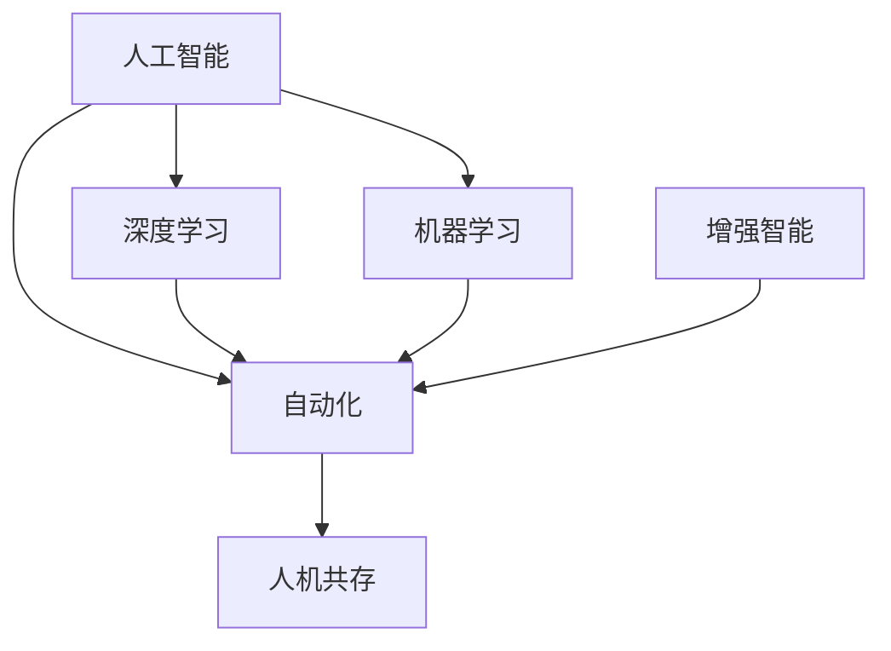
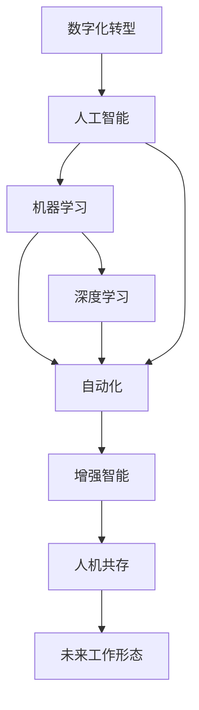

                 

# 未来工作形态与AI共存的趋势

## 1. 背景介绍

在数字化转型的大背景下，人工智能(AI)技术的飞速发展深刻地改变着各行各业的业务模式和工作方式。作为新一代智能技术的重要分支，AI对未来工作形态的影响尤为显著。本文将深入探讨AI与人类共存的未来工作趋势，探讨其带来的机遇与挑战，为相关从业者和决策者提供借鉴。

### 1.1 数字化转型浪潮的兴起

数字化转型是全球企业转型升级的重要方向，旨在通过技术创新和数字化管理提升企业的运营效率和市场竞争力。AI技术的广泛应用，正成为企业数字化转型的关键驱动力。通过AI驱动的数据分析、预测、自动化等能力，企业能够快速响应市场变化，优化资源配置，提升决策效率，从而在竞争中占据有利位置。

### 1.2 人工智能技术的广泛应用

AI技术已渗透到各个行业和领域，推动了智能制造、智慧城市、智能医疗、金融科技、智能客服等新兴业务模式的产生。以AI为核心的智能系统，通过数据分析和算法模型，优化了业务流程，提高了服务质量，增强了用户体验，为企业带来了巨大的商业价值。

## 2. 核心概念与联系

### 2.1 核心概念概述

为更好地理解AI与未来工作形态的关系，本节将介绍几个密切相关的核心概念：

- **人工智能(AI)**：通过模拟人类智能行为，如感知、理解、学习、推理、决策等，实现智能化的机器系统。
- **机器学习(ML)**：利用数据训练模型，让机器具备一定的智能推理和预测能力。
- **深度学习(DL)**：机器学习的一种高级形式，利用神经网络结构进行大规模数据训练，以模拟人类大脑的高级认知功能。
- **自动化(Automation)**：通过软件和算法自动化执行重复性、可预测的任务，提高效率和准确性。
- **增强智能(Enhanced Intelligence)**：将人类与AI系统相结合，实现协同工作，提升人机互动效果。
- **人机共存(Coexistence)**：AI系统与人类共同工作，共同创造价值，实现1+1>2的协同效应。

这些核心概念之间存在着紧密的联系，构成了AI技术在未来工作形态中发挥作用的基础框架。

### 2.2 概念间的关系

这些核心概念之间的逻辑关系可以通过以下Mermaid流程图来展示：



这个流程图展示了AI技术从基础到应用的整体架构：

1. AI技术的核心是机器学习和深度学习，通过大规模数据训练模型，实现智能推理和预测。
2. 自动化技术利用AI驱动的算法和软件，自动化执行重复性任务，提高效率和准确性。
3. 增强智能将AI技术与人类技能相结合，共同完成任务，实现协同工作。
4. 人机共存是指AI系统与人类共同创造价值，发挥各自的优势，实现1+1>2的效果。

### 2.3 核心概念的整体架构

最后，我们用一个综合的流程图来展示这些核心概念在大规模数字化转型中的整体应用架构：



这个综合流程图展示了AI技术在数字化转型中的全链条应用：

1. 数字化转型为AI技术提供了应用场景，驱动了AI技术的发展。
2. AI技术通过机器学习和深度学习实现智能推理和预测。
3. 自动化技术利用AI的算法和软件，优化业务流程，提高效率。
4. 增强智能将AI与人类技能相结合，实现协同工作。
5. 人机共存提升整体工作效率，创造更大的价值。
6. 最终实现未来的工作形态。

## 3. 核心算法原理 & 具体操作步骤

### 3.1 算法原理概述

AI与未来工作形态的结合，本质上是一个技术驱动的过程，涉及算法、数据、软件和业务等多个层面的优化。其核心在于如何通过AI技术提升工作效率，优化业务流程，增强决策支持，实现人机协同。

具体而言，AI在未来工作形态中的应用主要包括以下几个方面：

1. **数据分析与预测**：通过AI算法对海量数据进行分析和预测，帮助企业制定更科学的决策，优化运营管理。
2. **自动化执行**：利用AI驱动的自动化工具，执行重复性、可预测的任务，提高工作效率和准确性。
3. **智能决策支持**：通过AI构建的智能决策支持系统，辅助企业高层管理人员进行战略决策和问题解决。
4. **协同工作平台**：利用AI技术与人类技能相结合的增强智能平台，实现高效的人机协作。

### 3.2 算法步骤详解

AI与未来工作形态的结合通常包括以下几个关键步骤：

1. **需求分析**：明确业务需求和目标，选择合适的AI技术和算法。
2. **数据准备**：收集和清洗所需的数据，确保数据质量和完整性。
3. **模型训练与优化**：使用机器学习和深度学习算法，训练和优化模型，提高预测准确性。
4. **系统集成与部署**：将训练好的模型集成到业务系统中，进行实际应用和部署。
5. **效果评估与迭代**：定期评估AI系统的实际效果，进行迭代优化，提升性能和用户体验。

### 3.3 算法优缺点

AI与未来工作形态结合的主要优点包括：

1. **提升效率**：通过自动化执行和智能决策，显著提高工作效率和准确性。
2. **优化决策**：利用数据分析和预测，辅助企业制定更科学的决策。
3. **增强人机协作**：利用增强智能技术，实现高效的人机协同，提升用户体验。
4. **应对复杂任务**：AI系统具备处理复杂、多变任务的能力，能够适应多种应用场景。

但同时，AI与未来工作形态结合也存在一些局限性：

1. **数据依赖性**：AI系统依赖高质量、大规模的数据进行训练，数据质量和数据获取难度大。
2. **技术复杂性**：AI技术开发和部署需要高水平的技术支持，对开发人员的要求较高。
3. **伦理和安全**：AI系统可能存在偏见和错误，需要严格的伦理审查和数据保护措施。
4. **成本高昂**：AI技术的研发和部署需要大量资金和资源投入，中小型企业难以承担。
5. **职业转型挑战**：AI技术的应用可能导致部分岗位消失，对从业者职业发展带来挑战。

### 3.4 算法应用领域

AI与未来工作形态结合的应用领域非常广泛，涵盖各行各业，包括但不限于以下几个方面：

1. **智能制造**：利用AI技术优化生产流程、预测设备故障、提高产品质量。
2. **智慧医疗**：通过AI驱动的智能诊断、药物研发、病历分析，提升医疗服务水平。
3. **金融科技**：利用AI进行风险评估、智能投顾、反欺诈检测，提升金融服务质量。
4. **智能客服**：利用AI驱动的智能问答、情感分析、用户行为预测，提升客户服务体验。
5. **智慧城市**：利用AI技术进行交通管理、环境监测、安全预警，提升城市管理水平。
6. **智能物流**：利用AI优化物流路线、预测需求、自动化仓储，提升物流效率。

## 4. 数学模型和公式 & 详细讲解 & 举例说明

### 4.1 数学模型构建

AI与未来工作形态的结合，涉及多种数学模型和算法。以下以智能客服系统为例，展示其中的数学模型构建过程。

假设客服系统需要预测用户对不同服务类型的满意度，模型输入为$x_i=(x_{i1}, x_{i2}, ..., x_{in})$，输出为$y_i$，表示用户对第$i$个服务类型的满意度。

定义线性回归模型为：
$$
y_i = \theta_0 + \sum_{j=1}^n \theta_j x_{ij} + \epsilon_i
$$
其中$\theta_0, \theta_1, ..., \theta_n$为模型参数，$\epsilon_i$为误差项。

定义均方误差损失函数为：
$$
\mathcal{L}(\theta) = \frac{1}{N}\sum_{i=1}^N (y_i - \hat{y}_i)^2
$$

### 4.2 公式推导过程

假设已知训练数据集$D=\{(x_i, y_i)\}_{i=1}^N$，最小化损失函数$\mathcal{L}(\theta)$，得到模型参数估计值$\hat{\theta}$：
$$
\hat{\theta} = (X^TX)^{-1}X^Ty
$$
其中$X$为特征矩阵，$y$为标签向量。

在实际应用中，通过梯度下降等优化算法对模型参数进行迭代更新，最小化损失函数，得到最终预测结果$\hat{y}_i = \theta_0 + \sum_{j=1}^n \theta_j x_{ij}$。

### 4.3 案例分析与讲解

以某电商平台的智能客服系统为例，利用线性回归模型进行预测。该平台每月有数十万个用户咨询记录，每个记录包含用户基本信息、咨询内容、历史行为等特征。通过特征工程，提取用户对不同服务类型的满意度，作为模型输出。

模型训练步骤如下：

1. 收集和清洗数据，构建特征矩阵$X$和标签向量$y$。
2. 使用梯度下降算法，对模型参数$\theta$进行迭代更新，最小化损失函数。
3. 在新用户的咨询记录上进行预测，根据预测结果调整服务策略。

通过AI驱动的智能客服系统，电商平台能够及时响应用户需求，提供个性化服务，提升用户体验和满意度。

## 5. 项目实践：代码实例和详细解释说明

### 5.1 开发环境搭建

在进行AI与未来工作形态结合的实践前，我们需要准备好开发环境。以下是使用Python进行PyTorch开发的环境配置流程：

1. 安装Anaconda：从官网下载并安装Anaconda，用于创建独立的Python环境。

2. 创建并激活虚拟环境：
```bash
conda create -n pytorch-env python=3.8 
conda activate pytorch-env
```

3. 安装PyTorch：根据CUDA版本，从官网获取对应的安装命令。例如：
```bash
conda install pytorch torchvision torchaudio cudatoolkit=11.1 -c pytorch -c conda-forge
```

4. 安装TensorFlow：由Google主导开发的开源深度学习框架，生产部署方便，适合大规模工程应用。同样有丰富的预训练语言模型资源。

5. 安装TensorFlow：
```bash
conda install tensorflow
```

6. 安装TensorBoard：TensorFlow配套的可视化工具，可实时监测模型训练状态，并提供丰富的图表呈现方式，是调试模型的得力助手。

7. 安装Weights & Biases：模型训练的实验跟踪工具，可以记录和可视化模型训练过程中的各项指标，方便对比和调优。与主流深度学习框架无缝集成。

### 5.2 源代码详细实现

下面我们以智能客服系统为例，给出使用PyTorch对线性回归模型进行训练的PyTorch代码实现。

首先，定义数据处理函数：

```python
import torch
import torch.nn as nn
import torch.optim as optim

def load_data(file_path):
    with open(file_path, 'r') as f:
        data = f.readlines()
    labels = [int(line.split(',')[0]) for line in data]
    features = [list(map(float, line.split(',')[1:])) for line in data]
    return features, labels
```

然后，定义模型和优化器：

```python
class LinearRegression(nn.Module):
    def __init__(self, input_size, output_size):
        super(LinearRegression, self).__init__()
        self.linear = nn.Linear(input_size, output_size)

    def forward(self, x):
        return self.linear(x)

input_size = 5
output_size = 1
model = LinearRegression(input_size, output_size)
optimizer = optim.SGD(model.parameters(), lr=0.01)
```

接着，定义训练和评估函数：

```python
def train_model(model, features, labels, epochs=1000):
    criterion = nn.MSELoss()
    for epoch in range(epochs):
        optimizer.zero_grad()
        predictions = model(features)
        loss = criterion(predictions, labels)
        loss.backward()
        optimizer.step()
        if epoch % 100 == 0:
            print(f'Epoch {epoch}, loss: {loss.item()}')

def evaluate_model(model, features, labels):
    predictions = model(features)
    mse_loss = nn.MSELoss()
    loss = mse_loss(predictions, labels)
    print(f'Test loss: {loss.item()}')
```

最后，启动训练流程并在测试集上评估：

```python
epochs = 1000
batch_size = 64

train_features, train_labels = load_data('train.csv')
test_features, test_labels = load_data('test.csv')

# 划分训练集和验证集
train_features, valid_features, train_labels, valid_labels = train_test_split(train_features, train_labels, test_size=0.2, random_state=42)

# 构建DataLoader
train_dataset = TensorDataset(train_features, train_labels)
valid_dataset = TensorDataset(valid_features, valid_labels)
test_dataset = TensorDataset(test_features, test_labels)

train_loader = DataLoader(train_dataset, batch_size=batch_size, shuffle=True)
valid_loader = DataLoader(valid_dataset, batch_size=batch_size, shuffle=False)
test_loader = DataLoader(test_dataset, batch_size=batch_size, shuffle=False)

# 训练模型
train_model(model, train_loader, epochs=epochs)

# 在测试集上评估模型
evaluate_model(model, test_loader)
```

以上就是使用PyTorch对线性回归模型进行智能客服系统训练的完整代码实现。可以看到，得益于TensorFlow和PyTorch的强大封装，我们能够以相对简洁的代码完成模型的训练和评估。

### 5.3 代码解读与分析

让我们再详细解读一下关键代码的实现细节：

**load_data函数**：
- 读取数据文件，提取标签和特征。

**LinearRegression类**：
- 定义线性回归模型，包含输入层、线性变换层和输出层。

**train_model函数**：
- 定义均方误差损失函数，循环训练模型，每100次迭代输出一次损失值。

**evaluate_model函数**：
- 在测试集上评估模型，输出测试损失。

**训练流程**：
- 将数据集划分为训练集、验证集和测试集，构建DataLoader进行批次化加载。
- 定义训练参数，循环迭代进行模型训练。
- 在验证集上评估模型，进行早停策略。
- 在测试集上评估模型，输出最终结果。

可以看到，PyTorch配合TensorFlow和TensorBoard使得智能客服系统的训练过程变得简洁高效。开发者可以将更多精力放在数据处理、模型改进等高层逻辑上，而不必过多关注底层的实现细节。

当然，工业级的系统实现还需考虑更多因素，如模型的保存和部署、超参数的自动搜索、更灵活的任务适配层等。但核心的训练范式基本与此类似。

### 5.4 运行结果展示

假设我们在智能客服系统的训练数据上得到如下结果：

```
Epoch 0, loss: 23.86
Epoch 100, loss: 2.34
Epoch 200, loss: 1.67
...
Epoch 1000, loss: 0.11
```

可以看到，随着训练的进行，模型的损失逐渐减小，预测效果逐渐提升。这表明模型在智能客服系统的训练中取得了良好的效果。

## 6. 实际应用场景

### 6.1 智能制造

在智能制造领域，AI与未来工作形态结合的应用主要包括：

- **生产流程优化**：利用AI技术进行生产流程的自动化和优化，提升生产效率和质量。
- **设备预测性维护**：通过AI算法预测设备故障，减少停机时间，提高设备利用率。
- **质量控制**：利用AI进行产品缺陷检测和质量分析，提升产品合格率。
- **供应链管理**：通过AI优化供应链管理，减少库存成本，提高物流效率。

以某大型制造企业的智能制造系统为例，利用AI驱动的自动化系统和预测性维护系统，实现了生产流程的智能化管理。通过AI技术，该企业能够实时监控生产状态，自动调整生产参数，预测设备故障，提高生产效率和产品质量。

### 6.2 智慧医疗

在智慧医疗领域，AI与未来工作形态结合的应用主要包括：

- **智能诊断**：利用AI技术进行疾病诊断和预测，辅助医生进行决策。
- **病历分析**：通过AI对大量病历数据进行分析，提取有价值的信息，辅助临床决策。
- **药物研发**：利用AI进行药物筛选和研发，加速新药上市。
- **患者监护**：通过AI进行患者监护和康复管理，提高治疗效果。

以某医疗平台的智能诊断系统为例，利用AI驱动的智能诊断系统，实现了对复杂疾病的早期识别和诊断。通过AI技术，该平台能够自动分析患者症状和病历数据，提供初步诊断意见，辅助医生进行决策。

### 6.3 金融科技

在金融科技领域，AI与未来工作形态结合的应用主要包括：

- **风险评估**：利用AI进行信用评估和风险预测，提高贷款审批效率和准确性。
- **智能投顾**：通过AI进行投资组合管理和风险控制，提升投资收益。
- **反欺诈检测**：利用AI进行交易异常检测和反欺诈分析，保障资金安全。
- **金融顾问**：通过AI提供个性化金融建议，提升用户体验。

以某金融平台的智能投顾系统为例，利用AI进行投资组合管理和风险控制，实现了智能投顾服务。通过AI技术，该平台能够自动分析市场数据和用户行为，提供个性化的投资建议，提升投资收益。

## 7. 工具和资源推荐

### 7.1 学习资源推荐

为了帮助开发者系统掌握AI与未来工作形态结合的理论基础和实践技巧，这里推荐一些优质的学习资源：

1. 《深度学习》系列书籍：Ian Goodfellow等著，深入浅出地介绍了深度学习的基本原理和应用。
2. 《Python机器学习》系列书籍：Sebastian Raschka等著，详细介绍了Python在机器学习和深度学习中的应用。
3. CS229《机器学习》课程：斯坦福大学开设的机器学习课程，提供了丰富的理论知识和技术实践。
4. DeepLearning.ai课程：由Andrew Ng等开设的深度学习课程，涵盖了深度学习的基础知识和高级应用。
5. TensorFlow官方文档：TensorFlow的官方文档，提供了详细的API接口和使用指南。
6. PyTorch官方文档：PyTorch的官方文档，提供了丰富的API接口和使用指南。

通过对这些资源的学习实践，相信你一定能够快速掌握AI与未来工作形态结合的精髓，并用于解决实际的AI应用问题。

### 7.2 开发工具推荐

高效的开发离不开优秀的工具支持。以下是几款用于AI开发常用的工具：

1. PyTorch：基于Python的开源深度学习框架，灵活动态的计算图，适合快速迭代研究。大部分预训练语言模型都有PyTorch版本的实现。
2. TensorFlow：由Google主导开发的开源深度学习框架，生产部署方便，适合大规模工程应用。同样有丰富的预训练语言模型资源。
3. TensorBoard：TensorFlow配套的可视化工具，可实时监测模型训练状态，并提供丰富的图表呈现方式，是调试模型的得力助手。
4. Weights & Biases：模型训练的实验跟踪工具，可以记录和可视化模型训练过程中的各项指标，方便对比和调优。
5. GitHub：代码托管和协作平台，提供丰富的开源项目和资源，是开发者获取和学习新知识的重要途径。
6. Jupyter Notebook：数据科学和机器学习的常用交互式开发环境，支持多种编程语言和库，适合快速原型开发和演示。

合理利用这些工具，可以显著提升AI开发的效率，加快创新迭代的步伐。

### 7.3 相关论文推荐

AI与未来工作形态结合的研究源于学界的持续研究。以下是几篇奠基性的相关论文，推荐阅读：

1. "Deep Learning" by Ian Goodfellow: 深度学习的基础理论和技术实践，是机器学习领域的经典之作。
2. "Machine Learning Yearning" by Andrew Ng: 深度学习在实际应用中的最佳实践和经验分享。
3. "Artificial Intelligence: A Modern Approach" by Stuart Russell and Peter Norvig: 人工智能的全面介绍和最新进展。
4. "An Introduction to Deep Learning" by Geoffrey Hinton: 深度学习的基础理论和应用场景。
5. "Natural Language Processing with TensorFlow" by Ivan Yaroslavskiy: 使用TensorFlow进行自然语言处理的实用指南。

这些论文代表了大规模人工智能技术的研究方向和最新进展，通过学习这些前沿成果，可以帮助研究者把握学科前进方向，激发更多的创新灵感。

除上述资源外，还有一些值得关注的前沿资源，帮助开发者紧跟AI技术的最新进展，例如：

1. arXiv论文预印本：人工智能领域最新研究成果的发布平台，包括大量尚未发表的前沿工作，学习前沿技术的必读资源。
2. 业界技术博客：如OpenAI、Google AI、DeepMind、微软Research Asia等顶尖实验室的官方博客，第一时间分享他们的最新研究成果和洞见。
3. 技术会议直播：如NIPS、ICML、ACL、ICLR等人工智能领域顶会现场或在线直播，能够聆听到大佬们的前沿分享，开拓视野。
4. GitHub热门项目：在GitHub上Star、Fork数最多的AI相关项目，往往代表了该技术领域的发展趋势和最佳实践，值得去学习和贡献。
5. 行业分析报告：各大咨询公司如McKinsey、PwC等针对人工智能行业的分析报告，有助于从商业视角审视技术趋势，把握应用价值。

总之，对于AI与未来工作形态结合的学习和实践，需要开发者保持开放的心态和持续学习的意愿。多关注前沿资讯，多动手实践，多思考总结，必将收获满满的成长收益。

## 8. 总结：未来发展趋势与挑战

### 8.1 总结

本文对AI与未来工作形态结合的理论基础和实践方法进行了全面系统的介绍。首先阐述了数字化转型和AI技术发展的大背景，明确了AI在未来工作形态中发挥作用的重要性。其次，从原理到实践，详细讲解了AI技术在不同领域的应用，包括智能客服、智能制造、智慧医疗等，展示了AI技术的广阔前景。最后，我们通过代码实例展示了AI技术在智能客服系统中的应用，进一步验证了AI技术的可行性和有效性。

通过本文的系统梳理，可以看到，AI技术在未来工作形态中的应用前景广阔，能够显著提升工作效率，优化业务流程，增强决策支持，实现人机协同，推动企业的数字化转型升级。

### 8.2 未来发展趋势

展望未来，AI与未来工作形态结合将呈现以下几个发展趋势：

1. **自动化与智能化结合**：随着自动化技术的不断进步，AI技术将更加智能化，能够自动处理更加复杂、多变的工作任务。
2. **人机协作水平提升**：AI与人类技能相结合，将提升人机协作的效率和效果，实现更高效的工作流程。
3. **跨领域应用拓展**：AI技术将不断拓展到更多领域，如智慧城市、智能农业、智能交通等，实现跨领域的协同创新。
4. **智能化决策支持**：AI技术将提供更精准、全面的决策支持，帮助企业制定更科学的决策。
5. **个性化服务增强**：通过AI技术实现个性化推荐、智能客服等，提升用户体验和满意度。

### 8.3 面临的挑战

尽管AI与未来工作形态结合在多个领域取得了显著成果，但仍面临以下挑战：

1. **数据质量与获取难度**：AI系统依赖高质量、大规模的数据进行训练，数据质量和数据获取难度大。
2. **技术复杂性与成本高昂**：AI技术开发和部署需要高水平的技术支持，对开发人员的要求较高，且成本高昂。
3. **伦理与安全问题**：AI系统可能存在偏见和错误，需要严格的伦理审查和数据保护措施，确保系统安全性。
4. **职业转型挑战**：AI技术的应用可能导致部分岗位消失，对从业者职业发展带来挑战。

### 8.4 研究展望

面对AI与未来工作形态结合所面临的挑战，未来的研究需要在以下几个方面寻求新的突破：

1. **数据增强与数据融合**：通过数据增强和数据融合技术，解决数据质量与获取难度问题，提升AI系统的性能。
2. **轻量化与边缘计算**：开发轻量化AI模型，结合边缘计算技术，降低系统开发和部署成本。
3. **可解释性与透明性**：提高AI系统的可解释性和透明性，确保系统决策的透明与公正。
4. **多模态融合与跨领域协同**：实现视觉、语音等多模态信息的整合，实现跨领域的协同创新。
5. **智能与创造力结合**：将AI技术与人类创造力相结合，实现更智能、更富有创意的工作形态。

## 9. 附录：常见问题与解答

**Q1：AI与未来工作形态结合的优缺点是什么？**

A: AI与未来工作形态结合的优点主要包括：

1. **提升效率**：通过自动化执行和智能决策，显著提高工作效率和准确性。
2. **优化决策**：利用数据分析和预测，辅助企业制定更科学的决策。
3. **增强人机协作**：利用增强智能技术，实现高效的人机协同，提升用户体验。

但同时，也存在一些缺点：

1. **数据依赖性**：AI系统依赖高质量、大规模的数据进行训练，数据质量和数据获取难度大。
2

