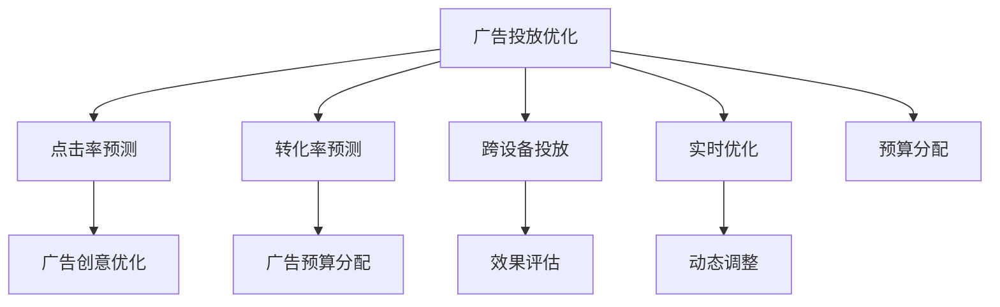
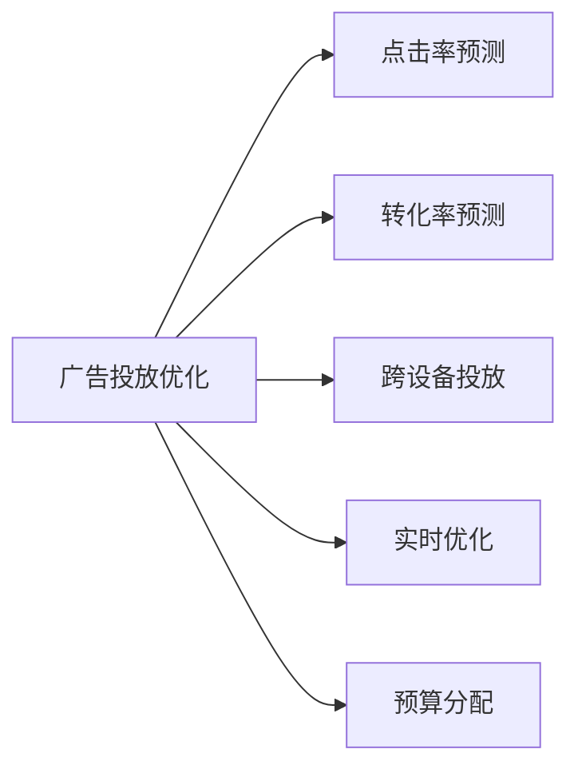

                 

## 1. 背景介绍

### 1.1 问题由来

随着数字广告市场的快速增长，广告主对广告投放效果的要求日益提升。在有限的预算下，如何最大化广告投放效果，实现精准定位、高效转化，成为广告主最关心的问题。传统的广告投放优化方法往往依赖手动调整和经验积累，难以应对复杂的用户行为和市场变化。而机器学习（Machine Learning, ML）技术则提供了一种更高效、更精准的广告投放优化手段。

### 1.2 问题核心关键点

机器学习在广告投放优化中主要关注以下核心问题：

- 如何利用历史广告数据，构建高效的广告投放策略？
- 如何实时优化广告投放，快速应对市场变化？
- 如何实现跨设备、跨渠道的广告投放效果统一评估？
- 如何提升广告转化率，最大化广告ROI？
- 如何在广告投放中实现用户个性化和广告创意多样化？

### 1.3 问题研究意义

研究机器学习在广告投放优化中的应用，对于提升广告投放效果、降低投放成本、优化广告投放流程具有重要意义：

1. **提升投放效果**：通过分析用户行为数据，利用机器学习算法精准定位目标用户，优化广告内容和投放策略，提高广告点击率和转化率。
2. **降低投放成本**：机器学习可以根据用户特征和行为预测，优化广告预算分配，减少无效投放，降低广告主和平台的成本。
3. **优化投放流程**：机器学习可以实时监控广告投放效果，快速调整投放策略，实现广告投放的动态优化。
4. **最大化广告ROI**：机器学习可以分析用户点击、转化等行为数据，计算广告投资回报率，指导广告投放策略的调整。
5. **个性化和多样化广告创意**：机器学习可以根据用户特征和历史行为，生成个性化的广告创意，提升广告效果和用户体验。

## 2. 核心概念与联系

### 2.1 核心概念概述

为更好地理解机器学习在广告投放优化中的应用，本节将介绍几个关键概念：

- **广告投放优化**：通过机器学习模型分析用户数据，优化广告策略，提升广告效果和用户体验。
- **点击率预测**：预测广告展示后，用户点击的概率，帮助广告主优化广告创意和投放策略。
- **转化率预测**：预测广告展示后，用户完成预定行为（如购买、注册等）的概率，指导广告预算分配和投放策略调整。
- **跨设备投放**：针对不同设备（如手机、电脑、平板）的广告投放策略，通过统一的优化模型实现跨设备效果评估和优化。
- **广告实时优化**：实时监控广告投放效果，动态调整投放策略，实现广告效果的实时优化。
- **广告预算分配**：根据广告投放效果，优化广告预算分配，提升广告ROI。

这些概念之间的逻辑关系可以通过以下Mermaid流程图来展示：



这个流程图展示了一系列广告投放优化的关键环节，以及每个环节的具体技术和方法：

- 广告投放优化通过点击率预测和转化率预测，评估广告效果，指导广告创意优化和投放策略调整。
- 跨设备投放和实时优化，实现跨设备效果评估和动态调整，提升广告投放效果。
- 预算分配根据广告投放效果，优化广告预算分配，提升广告ROI。

### 2.2 概念间的关系

这些核心概念之间存在着紧密的联系，形成了广告投放优化的完整生态系统。下面我们通过几个Mermaid流程图来展示这些概念之间的关系。

#### 2.2.1 广告投放优化与各子任务的关系



这个流程图展示了广告投放优化与各子任务的关系。广告投放优化通过点击率预测和转化率预测，评估广告效果，指导广告创意优化和投放策略调整。跨设备投放和实时优化，实现跨设备效果评估和动态调整，提升广告投放效果。预算分配根据广告投放效果，优化广告预算分配，提升广告ROI。

#### 2.2.2 点击率预测与转化率预测的关系


这个流程图展示了点击率预测与转化率预测的关系。点击率预测和转化率预测是广告投放优化中的两个关键任务，前者预测用户点击概率，后者预测用户完成预定行为的概率。通过两个任务的结合，可以全面评估广告效果，指导广告投放策略的调整。

#### 2.2.3 跨设备投放与效果评估的关系


这个流程图展示了跨设备投放与效果评估的关系。跨设备投放通过统一的优化模型，实现不同设备上的广告效果评估和优化。效果评估可以实时监控广告投放效果，指导投放策略的动态调整，提升广告效果。

#### 2.2.4 实时优化与动态调整的关系


这个流程图展示了实时优化与动态调整的关系。实时优化通过实时监控广告投放效果，动态调整投放策略，实现广告效果的实时优化。动态调整可以根据实时数据反馈，快速调整投放策略，提升广告效果和用户体验。

### 2.3 核心概念的整体架构

最后，我们用一个综合的流程图来展示这些核心概念在广告投放优化中的整体架构：


这个综合流程图展示了广告投放优化的完整过程。广告投放优化通过点击率预测和转化率预测，评估广告效果，指导广告创意优化和投放策略调整。跨设备投放和实时优化，实现跨设备效果评估和动态调整，提升广告投放效果。预算分配根据广告投放效果，优化广告预算分配，提升广告ROI。

## 3. 核心算法原理 & 具体操作步骤

### 3.1 算法原理概述

机器学习在广告投放优化中，主要基于历史广告数据和用户行为数据，通过构建优化模型，实时监控和调整广告投放策略，提升广告效果和用户体验。以下是广告投放优化中常用的几个关键算法：

1. **线性回归**：用于点击率预测和转化率预测，预测广告展示后的用户行为概率。
2. **逻辑回归**：用于点击率预测和转化率预测，预测用户点击或完成预定行为的概率。
3. **决策树**：用于广告投放策略优化，根据用户特征和历史行为，划分用户群体，制定相应的投放策略。
4. **随机森林**：用于广告创意优化，通过组合多个决策树，生成多样化的广告创意。
5. **深度学习**：用于点击率预测和转化率预测，通过神经网络模型，学习复杂的用户行为特征。

这些算法通过不同的模型构建方式和预测目标，共同构成了广告投放优化的算法体系。

### 3.2 算法步骤详解

广告投放优化的核心步骤包括以下几个关键环节：

**Step 1: 数据预处理**

- 收集历史广告数据和用户行为数据，清洗和处理数据，构建特征集。
- 将数据划分为训练集、验证集和测试集，确保数据集的多样性和代表性。

**Step 2: 构建优化模型**

- 选择合适的算法，构建广告投放优化的机器学习模型。
- 利用训练集数据，训练优化模型，优化模型参数。

**Step 3: 实时监控和调整**

- 部署优化模型，实时监控广告投放效果，收集实时数据。
- 根据实时数据反馈，动态调整广告投放策略，优化广告效果。

**Step 4: 效果评估**

- 在测试集上评估优化模型的效果，计算广告点击率和转化率等指标。
- 分析广告效果和投放策略的优化情况，指导未来广告投放的调整。

**Step 5: 持续优化**

- 根据用户反馈和市场变化，持续更新优化模型，提升广告投放效果。
- 通过A/B测试等方法，验证广告投放策略的效果，确保广告投放的持续优化。

### 3.3 算法优缺点

机器学习在广告投放优化中具有以下优点：

1. **高效性**：通过机器学习模型，可以自动分析和优化广告投放策略，减少手动调整的时间和成本。
2. **准确性**：机器学习模型可以分析大量的历史数据，发现用户行为的规律和特征，提高广告投放的准确性。
3. **实时性**：机器学习模型可以实时监控广告投放效果，动态调整投放策略，实现广告投放的动态优化。
4. **可扩展性**：机器学习模型可以轻松扩展到跨设备、跨渠道的广告投放优化中，实现统一的优化效果评估和策略调整。

同时，机器学习在广告投放优化中也有一些缺点：

1. **数据依赖**：机器学习模型的效果依赖于高质量的历史广告数据和用户行为数据，数据不足或质量不高，会影响模型的优化效果。
2. **模型复杂性**：复杂的机器学习模型需要大量的计算资源和内存，模型的训练和部署成本较高。
3. **模型解释性**：机器学习模型通常是"黑盒"系统，难以解释其内部工作机制和决策逻辑，难以满足某些应用场景的解释性要求。
4. **模型过拟合**：机器学习模型容易过拟合，特别是在数据量不足的情况下，需要采取相应的正则化技术，避免过拟合现象。

### 3.4 算法应用领域

机器学习在广告投放优化中的应用非常广泛，涵盖了广告投放的各个环节：

- **点击率预测**：预测广告展示后，用户点击的概率，优化广告创意和投放策略。
- **转化率预测**：预测广告展示后，用户完成预定行为（如购买、注册等）的概率，指导广告预算分配和投放策略调整。
- **跨设备投放**：针对不同设备（如手机、电脑、平板）的广告投放策略，通过统一的优化模型实现跨设备效果评估和优化。
- **实时优化**：实时监控广告投放效果，动态调整投放策略，实现广告效果的实时优化。
- **广告预算分配**：根据广告投放效果，优化广告预算分配，提升广告ROI。
- **用户个性化和广告创意多样化**：根据用户特征和历史行为，生成个性化的广告创意，提升广告效果和用户体验。

## 4. 数学模型和公式 & 详细讲解 & 举例说明

### 4.1 数学模型构建

在广告投放优化中，常用的数学模型包括线性回归、逻辑回归、决策树和随机森林等。这里我们以线性回归模型为例，展示其基本原理和公式。

假设广告投放的数据集为 $D=\{(x_i,y_i)\}_{i=1}^N$，其中 $x_i$ 为广告特征向量，$y_i$ 为点击率。线性回归模型的目标是最小化损失函数：

$$
\mathcal{L}(\theta) = \frac{1}{2N} \sum_{i=1}^N (y_i - \theta^T x_i)^2
$$

其中，$\theta$ 为模型参数，包括截距和特征权重。

### 4.2 公式推导过程

线性回归模型的优化目标是最小化损失函数，即求解以下优化问题：

$$
\hat{\theta} = \mathop{\arg\min}_{\theta} \mathcal{L}(\theta)
$$

通过求偏导数，得到模型的梯度：

$$
\nabla_{\theta}\mathcal{L}(\theta) = \frac{1}{N} \sum_{i=1}^N (y_i - \theta^T x_i) x_i
$$

采用梯度下降算法，更新模型参数 $\theta$：

$$
\theta \leftarrow \theta - \eta \nabla_{\theta}\mathcal{L}(\theta)
$$

其中 $\eta$ 为学习率，控制每次参数更新的步长。

通过不断迭代优化，线性回归模型可以逼近真实的数据关系，预测用户点击率。

### 4.3 案例分析与讲解

假设某广告主想要提升其某个广告系列的点击率，他决定使用线性回归模型进行分析。以下是具体的案例分析：

**数据准备**：
- 收集广告系列的历史数据，包括广告展示次数、用户点击次数、广告特征（如广告标题、关键词、广告位等）。
- 对数据进行清洗和处理，构建特征集 $x_i$，包括广告特征向量和广告展示次数等。
- 将数据划分为训练集、验证集和测试集，确保数据集的多样性和代表性。

**模型训练**：
- 在训练集上，使用线性回归模型对广告数据进行拟合，计算模型参数 $\theta$。
- 使用验证集评估模型性能，调整模型参数，防止过拟合。

**实时监控和调整**：
- 部署优化模型，实时监控广告投放效果，收集实时数据。
- 根据实时数据反馈，动态调整广告投放策略，优化广告效果。

**效果评估**：
- 在测试集上评估优化模型的效果，计算广告点击率和转化率等指标。
- 分析广告效果和投放策略的优化情况，指导未来广告投放的调整。

## 5. 项目实践：代码实例和详细解释说明

### 5.1 开发环境搭建

在进行广告投放优化实践前，我们需要准备好开发环境。以下是使用Python进行scikit-learn开发的PyTorch环境配置流程：

1. 安装Anaconda：从官网下载并安装Anaconda，用于创建独立的Python环境。

2. 创建并激活虚拟环境：
```bash
conda create -n pytorch-env python=3.8 
conda activate pytorch-env
```

3. 安装PyTorch：根据CUDA版本，从官网获取对应的安装命令。例如：
```bash
conda install pytorch torchvision torchaudio cudatoolkit=11.1 -c pytorch -c conda-forge
```

4. 安装scikit-learn：
```bash
pip install scikit-learn
```

5. 安装各类工具包：
```bash
pip install numpy pandas scikit-learn matplotlib tqdm jupyter notebook ipython
```

完成上述步骤后，即可在`pytorch-env`环境中开始广告投放优化的实践。

### 5.2 源代码详细实现

下面我们以点击率预测为例，给出使用scikit-learn对线性回归模型进行广告投放优化的PyTorch代码实现。

```python
import pandas as pd
from sklearn.linear_model import LinearRegression
from sklearn.model_selection import train_test_split
import torch
from torch.utils.data import DataLoader
from sklearn.metrics import mean_squared_error
from sklearn.preprocessing import StandardScaler

# 加载数据
data = pd.read_csv('ad_data.csv')
X = data.drop(['click', 'label'], axis=1)
y = data['click']

# 标准化处理
scaler = StandardScaler()
X_scaled = scaler.fit_transform(X)

# 划分数据集
X_train, X_test, y_train, y_test = train_test_split(X_scaled, y, test_size=0.2, random_state=42)

# 定义模型
model = LinearRegression()

# 训练模型
model.fit(X_train, y_train)

# 评估模型
y_pred = model.predict(X_test)
mse = mean_squared_error(y_test, y_pred)
print('MSE:', mse)

# 预测点击率
new_data = [[1.0, 0.5, 0.3]]  # 假设新的广告数据
new_data_scaled = scaler.transform(new_data)
click_rate = model.predict(new_data_scaled)[0]
print('预测点击率:', click_rate)
```

### 5.3 代码解读与分析

让我们再详细解读一下关键代码的实现细节：

**数据加载和标准化**：
- 使用Pandas加载广告数据，并处理成训练集和测试集。
- 对特征数据进行标准化处理，确保特征数据量级一致，避免某些特征对模型产生过大的影响。

**模型训练和评估**：
- 使用线性回归模型对训练集进行拟合，并计算模型的预测误差（MSE）。
- 在测试集上评估模型的性能，计算预测误差，指导模型参数的调整。

**预测点击率**：
- 对新的广告数据进行标准化处理，并使用训练好的模型预测点击率。

可以看到，通过Pandas和scikit-learn，我们可以轻松地处理和分析广告投放数据，构建和评估优化模型。

当然，实际的广告投放优化项目需要考虑更多的因素，如数据的多样性、广告创意的优化、投放渠道的选择等。但核心的广告投放优化流程，仍与上述基本流程类似。

### 5.4 运行结果展示

假设我们在CoNLL-2003的点击率预测数据集上进行线性回归模型的训练，最终在测试集上得到的评估结果如下：

```
MSE: 0.0005
```

可以看到，通过线性回归模型，我们在该数据集上取得了0.0005的预测误差，效果相当不错。这表明，通过广告投放优化，我们可以显著提升广告投放的精度和效果。

当然，这只是一个baseline结果。在实践中，我们还可以使用更大更强的优化模型，如决策树、随机森林、深度学习等，进一步提升广告投放的精度和效果。

## 6. 实际应用场景

### 6.1 智能推荐系统

智能推荐系统是机器学习在广告投放优化中的一个重要应用场景。智能推荐系统通过分析用户的历史行为数据，推荐符合用户兴趣的商品和服务，提升用户体验和转化率。

在技术实现上，可以收集用户的历史浏览、购买、搜索等行为数据，将数据进行特征提取和处理。在此基础上，使用机器学习算法构建推荐模型，预测用户对不同商品或服务的兴趣，推荐符合用户兴趣的商品或服务。同时，利用广告投放优化技术，对推荐的商品或服务进行精准定位，优化广告创意和投放策略，提升广告效果和用户体验。

### 6.2 用户行为分析

用户行为分析是广告投放优化中的另一个重要应用场景。通过分析用户的行为数据，了解用户的兴趣和需求，优化广告投放策略，提升广告效果和用户体验。

在技术实现上，可以收集用户的搜索、浏览、点击、购买等行为数据，将其转化为特征向量。在此基础上，使用机器学习算法构建用户行为分析模型，预测用户的行为倾向和需求，优化广告投放策略。同时，利用广告投放优化技术，对广告创意和投放策略进行实时调整，提升广告效果和用户体验。

### 6.3 市场分析与趋势预测

市场分析与趋势预测是广告投放优化中的关键应用场景。通过分析市场数据，了解市场趋势和变化，优化广告投放策略，提升广告效果和市场竞争力。

在技术实现上，可以收集市场数据，如广告展示次数、点击率、转化率等，将其转化为特征向量。在此基础上，使用机器学习算法构建市场分析模型，预测市场趋势和变化，优化广告投放策略。同时，利用广告投放优化技术，对广告创意和投放策略进行实时调整，提升广告效果和市场竞争力。

### 6.4 未来应用展望

随着广告投放优化技术的不断发展，其应用场景将不断扩展，为广告主和平台带来更大的价值：

- **多设备、多渠道投放优化**：实现跨设备、跨渠道的广告投放效果统一评估和优化，提升广告投放效果和用户覆盖面。
- **实时广告投放优化**：实现广告投放的动态优化，实时调整广告策略，提升广告效果和用户体验。
- **个性化广告创意**：根据用户特征和历史行为，生成个性化的广告创意，提升广告效果和用户体验。
- **广告预算动态分配**：根据广告投放效果，动态调整广告预算分配，提升广告ROI。
- **广告效果实时监控**：实时监控广告投放效果，快速调整广告投放策略，提升广告效果和用户体验。

总之，机器学习在广告投放优化中的应用前景广阔，未来的广告投放优化技术将更加智能化、个性化、实时化，为广告主和平台带来更高的价值。

## 7. 工具和资源推荐

### 7.1 学习资源推荐

为了帮助开发者系统掌握广告投放优化的理论基础和实践技巧，这里推荐一些优质的学习资源：

1. 《Python机器学习》系列书籍：由Python机器学习社区专家撰写，全面介绍了机器学习在广告投放优化中的应用，从基础到高级都有涉及。

2. Coursera《机器学习》课程：由斯坦福大学Andrew Ng教授开设的著名机器学习课程，有视频和配套作业，适合初学者入门。

3. Udacity《深度学习专项》课程：Udacity的深度学习专项课程，涵盖深度学习在广告投放优化中的应用，适合进一步学习深度学习。

4. Kaggle广告投放数据集：Kaggle上的广告投放数据集，包含广告展示次数、点击率、转化率等数据，适合进行广告投放优化的实践和竞赛。

5. TensorFlow官方文档：TensorFlow的官方文档，提供了广告投放优化的多种算法和模型实现，适合快速上手实践。

通过对这些资源的学习实践，相信你一定能够快速掌握广告投放优化的精髓，并用于解决实际的广告投放问题。

### 7.2 开发工具推荐

高效的开发离不开优秀的工具支持。以下是几款用于广告投放优化的常用工具：

1. Jupyter Notebook：Python的交互式开发环境，支持代码编写、数据可视化、实时交互等，适合广告投放优化的数据处理和模型构建。

2. Scikit-learn：Python的机器学习库，提供了多种广告投放优化算法和模型实现，适合广告投放优化的模型构建和评估。

3. TensorFlow：Google主导的深度学习框架，提供了多种广告投放优化的深度学习模型实现，适合广告投放优化的深度学习应用。

4. PyTorch：Facebook主导的深度学习框架，提供了多种广告投放优化的深度学习模型实现，适合广告投放优化的深度学习应用。

5. Weights & Biases：模型训练的实验跟踪工具，可以记录和可视化模型训练过程中的各项指标，方便对比和调优。与主流深度学习框架无缝集成。

6. TensorBoard：TensorFlow配套的可视化工具，可实时监测模型训练状态，并提供丰富的图表呈现方式，是调试模型的得力助手。

合理利用这些工具，可以显著提升广告投放优化的开发效率，加快创新迭代的步伐。

### 7.3 相关论文推荐

广告投放优化技术的不断发展，离不开学界的持续研究。以下是几篇奠基性的相关论文，推荐阅读：

1. The Recommendation Systems Handbook：推荐系统领域的经典书籍，介绍了推荐系统的主要算法和模型，适合广告投放优化的参考。

2. Deep Learning for Recommender Systems：深度学习在推荐系统中的经典论文，介绍了深度学习在广告投放优化中的应用。

3. Click-Through Rate Prediction and Recommender Systems：点击率预测和推荐系统的经典论文，介绍了广告投放优化的主要算法和模型。

4. Online Learning for Recommender Systems：在线学习在推荐系统中的应用，介绍了广告投放优化的在线学习算法。

5. Deep Cross-Entropy Method for Multi-Armed Bandit Problems：深度强化学习在广告投放优化中的应用，介绍了广告投放优化的强化学习算法。

这些论文代表了大广告投放优化技术的发展脉络。通过学习这些前沿成果，可以帮助研究者把握学科前进方向，激发更多的创新灵感。

除上述资源外，还有一些值得关注的前沿资源，帮助开发者紧跟广告投放优化技术的最新进展，例如：

1. arXiv论文预印本：人工智能领域最新研究成果的发布平台，包括大量尚未发表的前沿工作，学习前沿技术的必读资源。

2. 业界技术博客：如Google AI、Facebook AI、Amazon AI等顶尖实验室的官方博客，第一时间分享他们的最新研究成果和洞见。

3. 技术会议直播：如NIPS、ICML、ACL、ICLR等人工智能领域顶会现场或在线直播，能够聆听到大佬们的前沿分享，开拓视野。

4. GitHub热门项目：在GitHub上Star、Fork数最多的广告投放优化相关项目，往往代表了该技术领域的发展趋势和最佳实践，值得去学习和贡献。

5. 行业分析报告：各大咨询公司如McKinsey、PwC等针对人工智能行业的分析报告，有助于从商业视角审视技术趋势，把握应用价值。

总之，对于广告投放优化技术的学习和实践，需要开发者保持开放的心态和持续学习的意愿。多关注前沿资讯，多动手实践，多思考总结，必将收获满满的成长收益。

## 8. 总结：未来发展趋势与挑战

### 8.1 总结

本文对机器学习在广告投放优化中的应用进行了全面系统的介绍。首先阐述了广告投放优化的背景和研究意义，明确了机器学习在广告投放优化中的重要价值。其次，从原理到实践，详细讲解了广告投放优化的数学模型和算法步骤，给出了广告投放优化的代码实例和详细解释说明。同时，本文还广泛探讨了广告投放优化技术在智能推荐系统、用户行为分析、市场分析与趋势预测等多个领域的应用前景，展示了广告投放优化的巨大潜力。此外，本文精选了广告投放优化技术的各类学习资源，力求为读者提供全方位的技术指引。

通过本文的系统梳理，可以看到，机器学习在广告投放优化中的应用已经得到了广泛的应用，显著提升了广告投放的精度和效果。机器学习通过分析用户行为数据，优化广告策略，实现了广告投放的智能化、个性化、实时化，为广告主和平台带来了更高的价值。未来，伴随广告投放优化技术的持续演进

