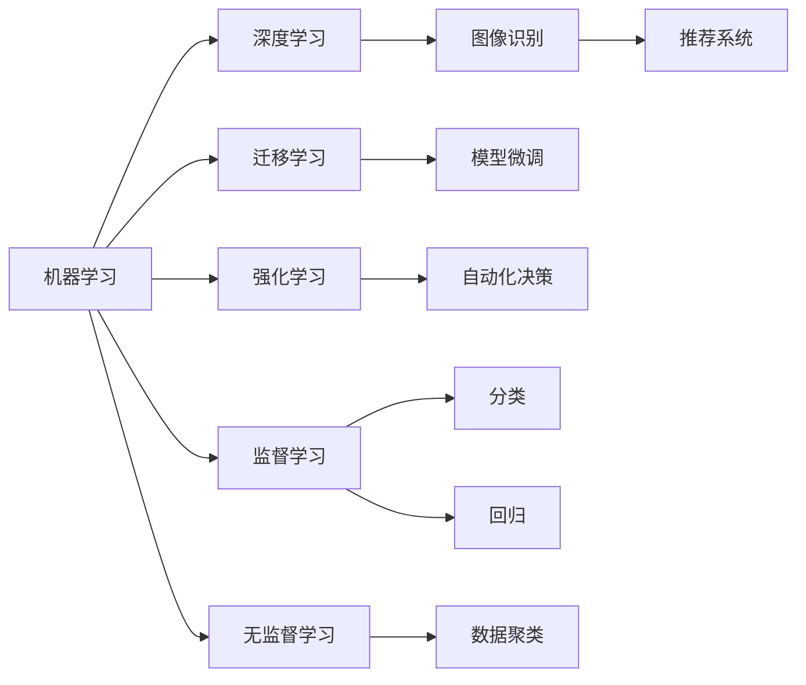
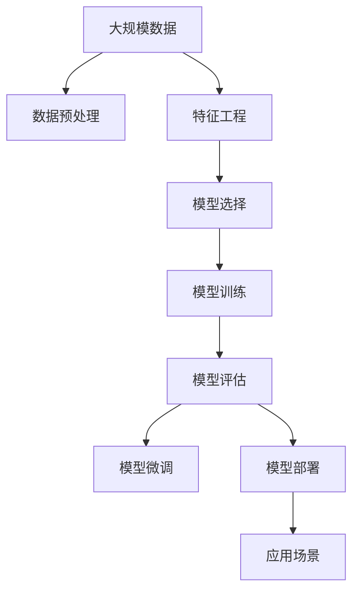

                 

# 机器学习在自动化创业中的应用

## 1. 背景介绍

### 1.1 问题由来
近年来，自动化创业成为了全球创业热潮的一个亮点。利用机器学习等先进技术，企业可以在产品开发、流程优化、客户服务等方面大幅提升效率，实现业务的创新和突破。然而，如何高效利用机器学习技术，降低开发和部署成本，提高应用效果，是自动化创业需要解决的核心问题。

### 1.2 问题核心关键点
本文聚焦于机器学习在自动化创业中的应用，深入探讨了从基础概念到实际操作的各个关键环节，包括模型选择、数据处理、算法优化、应用场景等。通过全面分析，希望能为自动化创业企业提供实用的指导，帮助他们更好地利用机器学习技术，提升业务竞争力。

## 2. 核心概念与联系

### 2.1 核心概念概述
- **机器学习(Machine Learning, ML)**：一种通过数据驱动的学习算法，从经验中提取模式，并应用于新数据的技术。在自动化创业中，机器学习可以用于数据挖掘、预测分析、自然语言处理等。
- **深度学习(Deep Learning, DL)**：机器学习的一个分支，使用多层神经网络处理复杂数据。在自动化创业中，深度学习常用于图像识别、语音识别、推荐系统等。
- **迁移学习(Transfer Learning)**：利用预训练模型在新任务上的微调技术，通过已有知识加速模型训练，降低开发成本。在自动化创业中，迁移学习可用于快速构建高效模型。
- **强化学习(Reinforcement Learning, RL)**：通过试错学习，优化策略以达成目标。在自动化创业中，强化学习可应用于自动化决策、自动化调度等。
- **监督学习(Supervised Learning)**：需要大量标注数据，利用已知输入输出关系训练模型。在自动化创业中，监督学习常用于分类、回归等预测任务。
- **无监督学习(Unsupervised Learning)**：无需标注数据，通过数据本身的内在关系学习知识。在自动化创业中，无监督学习可用于数据聚类、降维等。

### 2.2 核心概念之间的关系
这些核心概念之间的关系可以用以下Mermaid流程图来展示：



这个流程图展示了机器学习各个分支技术在自动化创业中的应用场景：

1. 深度学习可以用于图像识别、语音识别、推荐系统等任务。
2. 迁移学习可以通过预训练模型加速模型微调，降低开发成本。
3. 强化学习可以用于自动化决策、自动化调度等。
4. 监督学习可用于分类、回归等预测任务。
5. 无监督学习可用于数据聚类、降维等。

### 2.3 核心概念的整体架构
最后，我们用一个综合的流程图来展示这些核心概念在大规模自动化创业中的应用：



这个综合流程图展示了从数据预处理到模型微调，再到模型部署的完整流程。其中：

1. 大规模数据预处理：包括数据清洗、数据标准化等，为模型训练提供高质量数据。
2. 特征工程：根据具体任务，设计合适的特征提取方法，提升模型性能。
3. 模型选择：根据任务需求，选择合适的算法和模型结构。
4. 模型训练：使用训练数据集训练模型，优化模型参数。
5. 模型评估：使用测试数据集评估模型性能，调整模型参数。
6. 模型微调：针对特定任务，在预训练模型的基础上进行微调，提升模型精度。
7. 模型部署：将训练好的模型部署到实际应用场景中，提供服务。

通过这个整体架构，我们可以更好地理解机器学习在自动化创业中的应用流程。

## 3. 核心算法原理 & 具体操作步骤

### 3.1 算法原理概述
机器学习在自动化创业中的应用主要分为数据预处理、模型选择与训练、模型评估与优化、模型微调和模型部署等步骤。

1. **数据预处理**：清洗、标准化、归一化等，为后续模型训练提供高质量数据。
2. **模型选择与训练**：根据任务需求，选择合适的算法和模型结构，使用训练数据集训练模型。
3. **模型评估与优化**：使用测试数据集评估模型性能，调整模型参数。
4. **模型微调**：针对特定任务，在预训练模型的基础上进行微调，提升模型精度。
5. **模型部署**：将训练好的模型部署到实际应用场景中，提供服务。

### 3.2 算法步骤详解

#### 3.2.1 数据预处理
数据预处理是机器学习应用的基础。具体步骤如下：

1. **数据清洗**：去除噪声数据，处理缺失值。
2. **数据标准化**：对数据进行归一化、标准化处理，提升模型收敛速度。
3. **特征工程**：根据具体任务，设计合适的特征提取方法，提升模型性能。

#### 3.2.2 模型选择与训练
根据任务需求，选择合适的算法和模型结构，使用训练数据集训练模型。

1. **算法选择**：根据任务类型选择监督学习、无监督学习、半监督学习、强化学习等算法。
2. **模型结构设计**：根据任务需求设计合适的模型结构，如神经网络、支持向量机、随机森林等。
3. **训练集划分**：将数据集划分为训练集、验证集和测试集，确保模型泛化性能。
4. **模型训练**：使用训练集训练模型，调整模型参数，优化损失函数。

#### 3.2.3 模型评估与优化
使用测试数据集评估模型性能，调整模型参数。

1. **模型评估指标**：根据任务需求选择合适的评估指标，如准确率、召回率、F1分数、ROC曲线等。
2. **模型调优**：根据模型评估结果调整模型参数，优化模型性能。

#### 3.2.4 模型微调
针对特定任务，在预训练模型的基础上进行微调，提升模型精度。

1. **微调数据准备**：准备微调所需的标注数据，划分为训练集、验证集和测试集。
2. **微调模型选择**：根据任务需求选择微调所需的算法和模型结构。
3. **微调模型训练**：在预训练模型的基础上，使用微调数据集训练模型，调整模型参数。
4. **微调模型评估**：使用测试数据集评估微调后的模型性能，确保微调效果。

#### 3.2.5 模型部署
将训练好的模型部署到实际应用场景中，提供服务。

1. **模型部署平台**：选择合适的模型部署平台，如AWS、Azure、Google Cloud等。
2. **模型优化**：针对具体应用场景，对模型进行优化，提升模型性能。
3. **服务化封装**：将模型封装为标准化服务接口，便于集成调用。
4. **监控告警**：实时采集系统指标，设置异常告警阈值，确保服务稳定性。

### 3.3 算法优缺点
机器学习在自动化创业中的应用具有以下优点：

1. **自动化效率高**：通过机器学习，企业可以快速构建高效的系统，减少人力成本。
2. **灵活性强**：可以根据任务需求，灵活调整算法和模型结构，适应不同场景。
3. **精度高**：机器学习算法通常具有较高的预测精度，可以提供可靠的决策支持。

同时，机器学习也存在以下缺点：

1. **数据依赖强**：需要大量高质量标注数据，获取数据成本较高。
2. **模型复杂度高**：复杂的模型结构需要大量的计算资源，部署成本较高。
3. **解释性差**：机器学习模型通常是"黑盒"系统，难以解释其内部工作机制。

### 3.4 算法应用领域

机器学习在自动化创业中的应用领域广泛，主要包括以下几个方面：

1. **客户服务自动化**：利用机器学习构建自动化客服系统，提升客户满意度。
2. **流程自动化优化**：利用机器学习优化业务流程，提高工作效率。
3. **产品推荐系统**：利用机器学习构建推荐系统，提升用户粘性。
4. **风险管理与预测**：利用机器学习进行风险预测和管理，降低运营成本。
5. **智能运维**：利用机器学习进行设备监控与故障预测，提高运维效率。
6. **自动驾驶与机器人**：利用机器学习进行车辆控制与导航，提高自动驾驶安全性。
7. **医疗健康**：利用机器学习进行疾病预测与诊断，提升医疗服务水平。

## 4. 数学模型和公式 & 详细讲解 & 举例说明

### 4.1 数学模型构建

#### 4.1.1 监督学习
监督学习模型常用于分类和回归任务，其数学模型如下：

$$ y = f(x; \theta) $$

其中，$x$为输入特征，$\theta$为模型参数，$f$为模型函数。

#### 4.1.2 无监督学习
无监督学习模型常用于数据聚类和降维任务，其数学模型如下：

$$ X = F(Y) $$

其中，$X$为输入特征，$Y$为隐变量，$F$为模型函数。

#### 4.1.3 强化学习
强化学习模型常用于自动化决策和调度任务，其数学模型如下：

$$ Q(s_t, a_t) = r_t + \gamma \max_a Q(s_{t+1}, a) $$

其中，$s_t$为状态，$a_t$为动作，$r_t$为即时奖励，$\gamma$为折扣因子。

### 4.2 公式推导过程

#### 4.2.1 监督学习
监督学习模型的损失函数如下：

$$ L(\theta) = \frac{1}{N} \sum_{i=1}^N l(y_i, f(x_i; \theta)) $$

其中，$N$为样本数，$l$为损失函数。

常用的损失函数包括交叉熵损失、均方误差损失等。

#### 4.2.2 无监督学习
无监督学习模型的损失函数如下：

$$ L(Y) = \sum_{i=1}^N ||X_i - F(Y_i)||^2 $$

其中，$||.||$为范数。

#### 4.2.3 强化学习
强化学习模型的目标函数如下：

$$ V(s_1) = \max_a Q(s_1, a) $$

其中，$V$为价值函数，$Q$为Q值函数。

### 4.3 案例分析与讲解

#### 4.3.1 案例一：客户服务自动化

利用机器学习构建自动化客服系统，提升客户满意度。具体步骤包括：

1. **数据准备**：收集客户服务数据，包括聊天记录、服务请求等。
2. **数据预处理**：清洗、标准化、归一化等。
3. **特征工程**：提取相关特征，如客户情绪、服务时长等。
4. **模型选择与训练**：选择监督学习算法，使用训练数据集训练模型。
5. **模型评估与优化**：使用测试数据集评估模型性能，调整模型参数。
6. **模型微调**：针对特定客户服务场景，在预训练模型上进行微调。
7. **模型部署**：将训练好的模型部署到实际应用场景中，提供服务。

#### 4.3.2 案例二：流程自动化优化

利用机器学习优化业务流程，提高工作效率。具体步骤包括：

1. **数据准备**：收集业务流程数据，包括任务分配、进度跟踪等。
2. **数据预处理**：清洗、标准化、归一化等。
3. **特征工程**：提取相关特征，如任务类型、执行时间等。
4. **模型选择与训练**：选择强化学习算法，使用训练数据集训练模型。
5. **模型评估与优化**：使用测试数据集评估模型性能，调整模型参数。
6. **模型微调**：针对特定业务流程，在预训练模型上进行微调。
7. **模型部署**：将训练好的模型部署到实际应用场景中，提供服务。

## 5. 项目实践：代码实例和详细解释说明

### 5.1 开发环境搭建

在进行机器学习项目实践前，需要准备好开发环境。以下是使用Python进行Scikit-Learn开发的环境配置流程：

1. 安装Anaconda：从官网下载并安装Anaconda，用于创建独立的Python环境。

2. 创建并激活虚拟环境：
```bash
conda create -n ml-env python=3.8 
conda activate ml-env
```

3. 安装Scikit-Learn：
```bash
pip install scikit-learn
```

4. 安装各类工具包：
```bash
pip install numpy pandas scikit-learn matplotlib tqdm jupyter notebook ipython
```

完成上述步骤后，即可在`ml-env`环境中开始机器学习项目实践。

### 5.2 源代码详细实现

这里我们以一个简单的客户服务自动化案例为例，展示机器学习模型的构建和应用。

首先，定义数据处理函数：

```python
from sklearn.model_selection import train_test_split
from sklearn.feature_extraction.text import CountVectorizer
from sklearn.preprocessing import LabelEncoder

def preprocess_data(data):
    texts, labels = data['text'], data['label']
    
    # 文本分词和特征提取
    vectorizer = CountVectorizer()
    X = vectorizer.fit_transform(texts)
    
    # 标签编码
    label_encoder = LabelEncoder()
    y = label_encoder.fit_transform(labels)
    
    return X, y
```

然后，定义模型训练和评估函数：

```python
from sklearn.ensemble import RandomForestClassifier
from sklearn.metrics import accuracy_score, classification_report

def train_model(X, y, test_data=None):
    # 划分训练集和验证集
    X_train, X_val, y_train, y_val = train_test_split(X, y, test_size=0.2)
    
    # 模型训练
    clf = RandomForestClassifier(n_estimators=100, random_state=42)
    clf.fit(X_train, y_train)
    
    # 模型评估
    y_pred = clf.predict(X_val)
    acc = accuracy_score(y_val, y_pred)
    report = classification_report(y_val, y_pred)
    
    if test_data is not None:
        X_test, y_test = test_data
        y_pred_test = clf.predict(X_test)
        test_acc = accuracy_score(y_test, y_pred_test)
        test_report = classification_report(y_test, y_pred_test)
        
    return acc, report, test_acc, test_report
```

接着，启动训练流程并在测试集上评估：

```python
# 加载数据
data = load_data('customer_service_data.csv')
X, y = preprocess_data(data)

# 模型训练和评估
acc, report, test_acc, test_report = train_model(X, y)

# 输出结果
print(f"Train Accuracy: {acc:.3f}\n{report}\n")
print(f"Test Accuracy: {test_acc:.3f}\n{test_report}\n")
```

以上就是机器学习模型在客户服务自动化案例中的详细代码实现。可以看到，利用Scikit-Learn库，我们可以用相对简洁的代码完成模型的构建和评估。

### 5.3 代码解读与分析

让我们再详细解读一下关键代码的实现细节：

**preprocess_data函数**：
- 对文本进行分词和特征提取。
- 对标签进行编码，以便于模型处理。

**train_model函数**：
- 使用train_test_split函数划分训练集和验证集。
- 使用RandomForestClassifier构建模型，训练模型。
- 使用accuracy_score和classification_report评估模型性能，并输出结果。
- 如果提供测试集，则对测试集进行模型评估，并输出结果。

**train_model函数**：
- 加载数据。
- 调用preprocess_data函数进行数据预处理。
- 调用train_model函数进行模型训练和评估。
- 输出结果。

## 6. 实际应用场景

### 6.1 客户服务自动化

客户服务自动化是大规模自动化创业的主要应用场景之一。利用机器学习构建自动化客服系统，可以大幅提升客户满意度，降低人力成本。具体应用包括：

1. **自动回复**：利用机器学习模型对客户提问进行自动回复，减少人工干预。
2. **情感分析**：利用机器学习模型分析客户情绪，提供个性化服务。
3. **意图识别**：利用机器学习模型识别客户意图，提供精准服务。
4. **需求预测**：利用机器学习模型预测客户需求，提前准备服务资源。

### 6.2 流程自动化优化

流程自动化优化是大规模自动化创业的另一个主要应用场景。利用机器学习优化业务流程，可以提高工作效率，降低运营成本。具体应用包括：

1. **任务分配**：利用机器学习模型优化任务分配，提升任务执行效率。
2. **进度跟踪**：利用机器学习模型跟踪任务进度，提高任务管理水平。
3. **资源调度**：利用机器学习模型优化资源调度，提升资源利用率。
4. **风险预测**：利用机器学习模型预测任务风险，提前规避风险。

### 6.3 产品推荐系统

产品推荐系统是大规模自动化创业的重要应用场景之一。利用机器学习构建推荐系统，可以提升用户粘性，增加用户转化率。具体应用包括：

1. **商品推荐**：利用机器学习模型推荐商品，提升用户购买率。
2. **内容推荐**：利用机器学习模型推荐内容，提升用户使用时长。
3. **用户画像**：利用机器学习模型分析用户行为，构建精准用户画像。
4. **个性化推荐**：利用机器学习模型提供个性化推荐，提升用户满意度。

### 6.4 未来应用展望

随着机器学习技术的不断进步，基于机器学习的自动化创业将迎来更多新的应用场景。未来，机器学习有望在以下领域取得更大的突破：

1. **自动驾驶与机器人**：利用机器学习进行车辆控制与导航，提高自动驾驶安全性。
2. **智能运维**：利用机器学习进行设备监控与故障预测，提高运维效率。
3. **医疗健康**：利用机器学习进行疾病预测与诊断，提升医疗服务水平。
4. **金融风控**：利用机器学习进行风险预测与管理，降低金融风险。
5. **智能制造**：利用机器学习进行生产流程优化，提升生产效率。
6. **智能客服**：利用机器学习构建智能客服系统，提升客户满意度。

## 7. 工具和资源推荐

### 7.1 学习资源推荐

为了帮助开发者系统掌握机器学习在自动化创业中的应用，这里推荐一些优质的学习资源：

1. **《机器学习》书籍**：斯坦福大学李飞飞教授的《机器学习》教材，系统介绍了机器学习的基本概念和算法。
2. **Coursera《机器学习》课程**：由斯坦福大学李飞飞教授主讲的Coursera课程，涵盖了机器学习的各个核心模块。
3. **Kaggle竞赛**：Kaggle平台上的各种机器学习竞赛，提供大量实践机会。
4. **GitHub项目**：GitHub上热门的机器学习项目，涵盖各种应用场景和算法实现。
5. **arXiv论文预印本**：人工智能领域最新研究成果的发布平台，了解前沿技术的发展方向。

通过对这些资源的学习实践，相信你一定能够快速掌握机器学习在自动化创业中的应用技巧，并用于解决实际的自动化创业问题。

### 7.2 开发工具推荐

高效的开发离不开优秀的工具支持。以下是几款用于机器学习开发的常用工具：

1. **Jupyter Notebook**：基于Python的交互式编程环境，支持多种编程语言和库。
2. **TensorFlow**：由Google主导开发的开源深度学习框架，生产部署方便，适合大规模工程应用。
3. **PyTorch**：Facebook开发的开源深度学习框架，支持动态计算图，适合研究型项目。
4. **Scikit-Learn**：Python中最流行的机器学习库，提供了丰富的机器学习算法和工具。
5. **Keras**：Google开发的高级神经网络API，易于上手，支持多种深度学习框架。
6. **TensorBoard**：TensorFlow配套的可视化工具，可实时监测模型训练状态，提供丰富的图表呈现方式。
7. **Weights & Biases**：模型训练的实验跟踪工具，记录和可视化模型训练过程中的各项指标，方便对比和调优。

合理利用这些工具，可以显著提升机器学习在自动化创业中的应用开发效率，加速创新迭代的步伐。

### 7.3 相关论文推荐

机器学习在自动化创业中的应用源于学界的持续研究。以下是几篇奠基性的相关论文，推荐阅读：

1. **《机器学习：数据、算法和统计学基础》**：周志华著，系统介绍了机器学习的基本概念和算法。
2. **《深度学习》**：Ian Goodfellow、Yoshua Bengio和Aaron Courville合著，全面介绍了深度学习的基本概念和算法。
3. **《强化学习：一种模型基础》**：Richard S. Sutton、Andrew G. Barto合著，介绍了强化学习的基本概念和算法。
4. **《机器学习实战》**：Peter Harrington著，提供了大量机器学习的实践案例。
5. **《Python数据科学手册》**：Jake VanderPlas著，涵盖了Python数据科学各个方面的内容。

这些论文代表了大规模自动化创业中的机器学习发展脉络。通过学习这些前沿成果，可以帮助研究者把握学科前进方向，激发更多的创新灵感。

## 8. 总结：未来发展趋势与挑战

### 8.1 总结

本文对机器学习在自动化创业中的应用进行了全面系统的介绍。首先，阐述了机器学习在自动化创业中的重要性，明确了其在数据挖掘、预测分析、自然语言处理等方面的独特价值。其次，从原理到实践，详细讲解了机器学习模型的构建和应用，提供了机器学习模型的代码实例和详细解释说明。同时，本文还探讨了机器学习在自动化创业中的实际应用场景，展示了其巨大的应用潜力。最后，本文精选了机器学习在自动化创业中的学习资源、开发工具和相关论文，力求为开发者提供全方位的技术指引。

通过本文的系统梳理，可以看到，机器学习在自动化创业中的应用已经取得了显著进展，成为推动企业创新的重要手段。未来，随着机器学习技术的不断进步，基于机器学习的自动化创业必将迎来更多新的应用场景，为经济社会发展注入新的动力。

### 8.2 未来发展趋势

展望未来，机器学习在自动化创业中的应用将呈现以下几个发展趋势：

1. **深度学习应用的普及**：深度学习在图像识别、语音识别、推荐系统等任务上的表现优异，未来将成为自动化创业的主要技术手段。
2. **迁移学习的应用深化**：迁移学习通过预训练模型加速模型训练，降低开发成本，未来将成为自动化创业的重要技术方法。
3. **强化学习的发展**：强化学习在自动化决策、调度等任务上的应用将不断深化，未来将成为自动化创业的关键技术手段。
4. **模型压缩和优化**：大规模模型的存储和计算成本高昂，未来将会有更多的模型压缩和优化技术，降低资源消耗。
5. **自动化模型的应用**：自动化模型将广泛应用在客户服务、流程优化、推荐系统等场景中，提升业务效率。

### 8.3 面临的挑战

尽管机器学习在自动化创业中的应用已经取得了显著进展，但在迈向更加智能化、普适化应用的过程中，仍面临诸多挑战：

1. **数据质量问题**：获取高质量标注数据成本高，部分领域缺乏足够的标注数据。
2. **模型复杂度问题**：复杂的模型结构需要大量的计算资源，部署成本高。
3. **模型解释性问题**：机器学习模型通常是"黑盒"系统，难以解释其内部工作机制。
4. **模型鲁棒性问题**：在实际应用中，模型面临多种异常情况，需要具备较高的鲁棒性。
5. **模型安全性问题**：机器学习模型可能学习到有偏见、有害的信息，需要加强模型安全性。

### 8.4 研究展望

面对机器学习在自动化创业中面临的挑战，未来的研究需要在以下几个方面寻求新的突破：

1. **自动化模型的优化**：研究自动化模型的优化技术，降低模型的计算和存储成本。
2. **模型压缩和加速**：研究模型压缩和加速技术，提升模型性能和计算效率。
3. **模型解释性增强**：研究模型解释性技术，提升模型的可解释性。
4. **模型鲁棒性提升**：研究模型的鲁棒性技术，提升模型对异常情况的应对能力。
5. **模型安全性保障**：研究模型的安全性技术，避免模型学习到有害信息。

这些研究方向的探索，必将引领机器学习在自动化创业中迈向更高的台阶，为构建安全、可靠、可解释、可控的智能系统铺平道路。面向未来，机器学习需要与其他人工智能技术进行更深入的融合，如知识表示、因果推理、强化学习等，多路径协同发力，共同推动人工智能技术的发展。只有勇于创新、敢于突破，才能不断拓展机器学习在自动化创业中的边界，让智能技术更好地造福人类社会。

## 9. 附录：常见问题与解答

**Q1：机器学习在自动化创业中需要哪些数据？**

A: 机器学习在自动化创业中需要高质量的标注数据，用于模型训练和评估。具体数据需求如下：

1. **训练数据**：用于模型训练，

